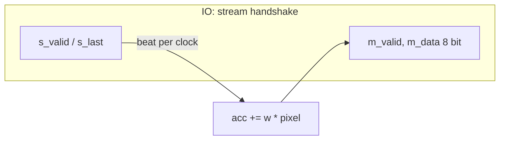

# write-design-notes: reference

## metrics.json keys most used (designs/<d>/output/metrics.json)
- Counts and area: `design__instance__count`, `design__instance__count__stdcell`, `design__instance__area__stdcell`, `design__instance__utilization`, `design__die__bbox`, `design__core__bbox`, `design__die__area`, `design__core__area`, `design__instance__count__macros`.
- Classes: `design__instance__count__class:{sequential_cell, multi_input_combinational_cell, inverter, tap_cell, fill_cell, antenna_cell, timing_repair_buffer, clock_buffer}`, `design__instance__count__hold_buffer`, matching `design__instance__area__class:*`.
- Timing (suffix `__corner:<corner>` for per corner; corners nom_tt_025C_1v80, nom_ss_100C_1v60, nom_ff_n40C_1v95, plus min_/max_ spef corners): `timing__setup__wns`, `timing__hold__wns`, `timing__{setup,hold}_vio__count`, `timing__{setup,hold}_r2r_vio__count`, `clock__skew__worst_{setup,hold}`.
- Violations: `design__max_slew_violation__count`, `design__max_cap_violation__count`, `design__max_fanout_violation__count`, `antenna__violating__nets`, `design__power_grid_violation__count`.
- Routing: `global_route__wirelength`, `global_route__vias`, `route__wirelength`, `route__wirelength__max`, `route__drc_errors`, `route__drc_errors__iter:N`, `design__instance__displacement__total`.
- Power: `power__total`, `power__internal__total`, `power__switching__total`, `power__leakage__total`.
- Synthesis/lint: `synthesis__check_error__count`, `design__lint_error__count`, `design__lint_warning__count`, `design__inferred_latch__count`, `design__instance_unmapped__count`.
- Signoff: `magic__drc_error__count`, `klayout__drc_error__count`, `design__xor_difference__count`, `design__lvs_error__count` (+ `design__lvs_*_difference/unmatched__count`), `route__antenna_violation__count`, `antenna_diodes_count`.
Key names vary by LibreLane version: print them, do not guess.

## Report files (designs/<d>/output/reports/)
synth_stat.rpt, synth_checks.rpt, cell_usage.rpt, floorplan.txt, placement_global.txt, placement_detailed.txt, cts.rpt, routing_global.txt, routing_detailed.txt, timing_summary.rpt, timing_paths_max_ss.rpt, timing_paths_min_ff.rpt, drc_magic.rpt, drc_klayout.json, lvs_netgen.rpt, irdrop.rpt, manufacturability.rpt; `output/resources.json`, `output/layout.png`, `output/flow.log`.

## Typical phrasing patterns copied from prec_int8
- "Magic `COUNT: 0` (`drc_magic.rpt`); KLayout: all 257 rule entries in `drc_klayout.json` are 0 (my sum)".
- "Worst setup path (`timing_paths_max_ss.rpt`): flip-flop `_635_` to `_653_`, slack 11.386656 ns".
- "642 std cells = 352 synthesised + 79 timing-repair + 14 clock buffers + 45 diodes + 152 taps (my sum)".
- Unknowns: "I did not find which script treats it as non-fatal", "probably a reused run (my inference)", "Before-state memory numbers are not recorded".

## Per-corner timing table template
| Corner | Worst setup slack (ns) | Worst hold slack (ns) |
|---|---|---|
| nom_tt_025C_1v80 | | |
| nom_ss_100C_1v60 | | |
| nom_ff_n40C_1v95 | | |
| Overall worst | value (corner) | value (corner) |
Take rows from `timing_summary.rpt`; overall worst is the min over all nine corners there.

## Data-flow table template (stream engine)
| Edge | Beat accepted | Compute this edge | State/acc after | Phase after |
End with the result line: class, beat 0/1 hex, latency, quoting the golden `--trace` output verbatim.

## Wrapper notes
Wrapper designs (designs/user_project_wrapper*/, three of them: tiny_ai_core, soc_itm, soc_kv) follow the same headings; note the `gds` stage may print "REUSED" in seconds: quote `wall_s_total` from `output/resources.json`, not the stage time (soc_kv NOTES.md). See [designs/user_project_wrapper/NOTES.md](../../../designs/user_project_wrapper/NOTES.md): "register table" becomes a connection table, no CTS ("Not run (`RUN_CTS` false)"), 0 std cells.

## Mermaid example that passes the lint

