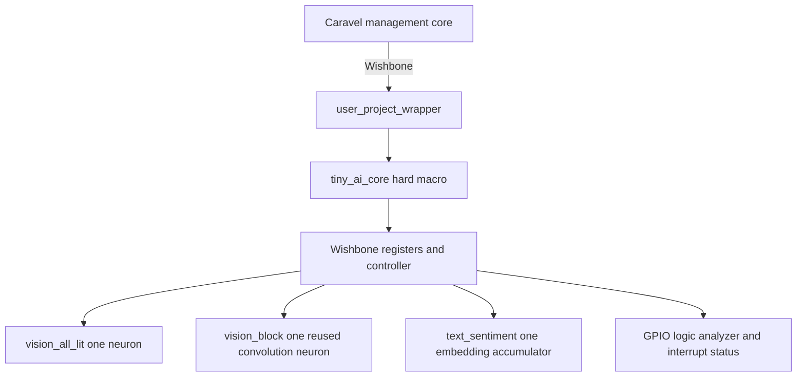

# Tiny AI ChipIgnite Project Specification and Agent Plan

This document specifies a private GitHub project that places three deliberately tiny AI examples into one ChipIgnite Caravel user project. It is written for simple coding agents: each phase has a narrow scope, named outputs, objective checks, and a stop condition. The plan ends with a locally verified, hardened, precheck-clean design. It does not authorize repository publication, ChipFoundry account changes, uploads, paid reservations, or tapeout confirmation.

The key decision is to build one hard macro named `tiny_ai_core`. It contains three one-neuron examples behind one Wishbone register interface. The fixed Caravel `user_project_wrapper` contains only one instance of that macro. This is much smaller and easier to verify than the MNIST accelerators in the sibling repository while still exercising dense inference, convolution with weight reuse, and embedding lookup.

## Status (as of 2026-10-06)

> **2026-10-07:** all 25 designs are validated and frozen (`designs/FROZEN.json`); the maintained agent front end is the Nous Hermes desktop app.

> **Update 2026-10-06 (current state, later than the notes below; evidence `build/state_snapshot.md`, each design's `output/metrics.json`):**
> - 25 designs are hardened clean (DRC, LVS, XOR, antenna 0; setup and hold met; all five `make flow-all` stages PASS, including
>   gate-level sims of the synthesised and routed netlists). `make test` passes, `make check-generated` covers 41 generated files.
> - The engines flagged below as "not hardened yet" (`audio_pitch`, `audio_onset`, `image_text_match`) and the seven `prec_*`
>   precision designs are hardened. New since: the KV-cache attention family `kv_attn_{n4,n8,n16,n8_int4,n8_ring}`
>   (`shared/rtl/kv_attn_core.v`, `model/kv_attention/`, `docs/LLM_INFERENCE.md`), `soc_kv_attn_n8` (adapter + `kv_attn_n8`, 300 x 300 um)
>   and `user_project_wrapper_soc_kv`; plus `user_project_wrapper_soc_itm`. All wrapper builds (`user_project_wrapper`,
>   `_soc_itm`, `_soc_kv`) are signoff-clean.
> - `make adapter-test` now runs 14 engines (13 stream engines + `kv_attn_n8`). `make soc-kv` (KV firmware on the PicoRV32 SoC) passes.
> - The full-Caravel sims and the local precheck were run for `user_project_wrapper` (`tiny_ai_core`) only, not for the `_soc_itm` or `_soc_kv` wrappers.
> - Agent work (`docs/HERMES_AGENT.md`, `examples/`, `tools/`): Hermes prompt mode 13/15, native 6/15
>   (`build/agent/eval_20261006_143402.json`); harness 13/15 baseline, 15/15 with one deterministic tool.
> - Still open: Phase 5 and 11 (human), the release manifest (Phase 9), Phase 10, the cell-budget amendment decision.

> **Update 2026-10-06 (precheck, full-chip GL):**
> - Owner decision: GPIO 5..37 start as `GPIO_MODE_MGMT_STD_INPUT_NOPULL` (`designs/user_project_wrapper/rtl/user_defines.v`,
>   `designs/user_project_wrapper_soc_itm/rtl/user_defines.v`). This resolves the earlier open decision (2) on `io_oeb`: with
>   management-owned inputs the floating `io_oeb` is irrelevant to the OEB check.
> - Local precheck (cf-precheck 1.3.7): 14 of 14 checks PASS, 61 s, on wrapper run `RUN_2026-10-06_03-29-55`
>   (`build/precheck_final.log`, `precheck/results/summary.tsv`, `docs/PRECHECK.md`). It ran in our own aarch64 container, not
>   ChipFoundry's `mpw_precheck` image; confirmation with their tooling and all `cf` account steps remain human-only.
> - Caravel sims after the fix (`build/gpio_fix_chain.log`): caravel-rtl PASS 54 s, hybrid caravel-gl PASS 59 s.
> - Full-chip gate-level (caravel_core netlist incl. management SoC + our wrapper + macro, functional cells, unit delay, firmware):
>   PASS in 14 m 23 s (`make caravel-fullgl`, `docs/CARAVEL_SIM.md`).
> - SDF (CVC 7.00b, x86-only, amd64 container) on wrapper + macro: PASS at nom_tt_025C_1v80, nom_ss_100C_1v60, max_ss_100C_1v60;
>   2186/2186 IOPATH and 2312/2348 INTERCONNECT annotated (36 to top-level output ports dropped, CVC limitation); timing checks are
>   not enforced. Full-chip GL+SDF with firmware was NOT completed (under 0.06 simulated us per wall second); needs an x86 Linux
>   host or a shorter SPI-flash boot.
> - Remaining open owner decisions: the slew budget interpretation, and the host for full-chip SDF.

> **Update 2026-10-06 (SoC):** Phase 8 is partly done, with evidence (all native on macOS, iverilog + riscv64-elf-gcc):
> - `make soc-sim`: PicoRV32 firmware against `user_project_wrapper` RTL, all 784 cases on the accelerator and in pure C,
>   15 protocol negatives, irq; PASS (`firmware/README.md`, about 25 s). This is not Caravel's management core.
> - `make caravel-rtl`: complete Caravel RTL, real VexRiscv firmware, one case per mode; PASS (about 53 s).
> - `make caravel-gl`: hybrid gate-level (routed wrapper and macro netlists inside RTL Caravel, unit delay); PASS (about 58 s).
>   Details: `docs/CARAVEL_SIM.md`.
> - `shared/rtl/wb_stream_adapter.v` verified with all 14 stream engines (13 + `kv_attn_n8`, `make adapter-test`); `designs/soc_image_text_match`
>   (adapter + `image_text_match`, 109 pins) hardened clean.
> - Acceptance item "Full-Caravel representative RTL and GL tests pass" stays unticked: RTL is met, but GL is partial (Caravel
>   and the management core stay RTL, no SDF, one case per mode, and the wrapper under test holds `tiny_ai_core`, not yet
>   the final wrapper build). Also still open: `cf precheck`, wrapper hardening with the adapter macro, GPIO startup modes.

> **Update 2026-10-06 (owner decisions and results):**
> - `tiny_ai_core` simplified for learning: only the Wishbone bus and the interrupt leave the core (109 signal pins;
>   the GPIO and logic-analyser mirrors of "External observability" are removed); 250 x 250 um die; hardened against
>   the template's Caravel macro constraints; builds in about 2 minutes.
> - Phase 7 (wrapper) **done locally**: `user_project_wrapper` with one `tiny_ai_core mprj` hardens signoff-clean (DRC,
>   LVS, XOR, antenna 0; setup/hold >= 0 at all corners; max-slew/cap/fanout 0) and the Wishbone testbench passes on its
>   gate-level netlists (`designs/user_project_wrapper/README.md` has the five-step path to clean).
> - Open owner decisions: (1) the macro's max-slew budget of 0 conflicts with the Caravel input transitions of
>   `wbs_adr_i` / `wbs_dat_i` (0.84-0.92 ns > 0.75 ns limit): count only internal nets, or accept as environment-limited;
>   (2) the wrapper's unconnected `io_oeb` must be driven high (or all user GPIO set to inputs) before any tapeout.
> - New engines, RTL verified, not hardened yet: `audio_pitch`, `audio_onset`, `image_text_match`; and a precision
>   study (`model/precision_hw/`, seven formats) in progress.

This specification was written before any implementation. The requirements below are unchanged. Where the
implementation refines or deviates, an indented "Implemented" or "Decision" note sits under the item; where a budget
is missed, a "Proposed amendment (owner to decide)" note records the options. Nothing in a note changes a requirement.
Evidence for every number is named the first time it appears. `build/` is git-ignored, so logs under it are local
evidence that `make` regenerates; everything else named is tracked.

| Phase | Status | Evidence |
|---|---|---|
| 0 Private repository | Done (human). `origin` is `github.com/rajaghv-dev/open-ai-chip`, visibility PRIVATE | `git remote -v`; `gh repo view` reports PRIVATE |
| 1 Baseline and version lock | Done locally with LibreLane 3.0.2, not the official ChipFoundry `cf` flow. `user_proj_example` (the template module, `chipfoundry/caravel_user_project` @ `b510613`) hardened clean. No template-wrapper smoke test and no `cf`-selected lock: `versions.lock` is the sibling repository's pin set | `versions.lock`, `provenance/SOURCES.md`, `designs/user_proj_example/output/metrics.json`, `README.md` |
| 2 Golden model and generators | Done. Exhaustive fit over each complete truth table; golden model; generated ROMs and vectors; regeneration check; negative tests | `model/tiny_ai/{spec.json,train.py,golden.py,gen_rom.py,weights.json}`, `scripts/check_generated.sh`, `tests/run_tests.sh` |
| 3 Three engines | Done. Three standalone stream modules, each verified alone on RTL and on both gate-level netlists | `designs/{vision_all_lit,vision_block,text_sentiment}/{rtl,tb,output}/`, `docs/ARCHITECTURE.md` |
| 4 Wishbone core | Done. `tiny_ai_core` with the register map below; 784 cases, 65,642 checks through Wishbone on the RTL, the synthesised netlist and the routed netlist | `designs/tiny_ai_core/{rtl,tb}/`, `build/flow/tiny_ai_core/stage_{simulate,gl_synth,gl_final}.log` |
| 5 Human `cf` initialization checkpoint | NOT STARTED (human only) | none |
| 6 Macro physical configuration | Done for `tiny_ai_core` standalone with LibreLane, clean. Cell budget exceeded as written (see Physical budgets) | `designs/tiny_ai_core/{config.json,output/metrics.json,output/reports/}`, `README.md` |
| 7 Wrapper integration | Done locally (update 2026-10-06 above): `user_project_wrapper` with one `tiny_ai_core mprj`, `user_defines.v`, hardened signoff-clean; later wrappers `user_project_wrapper_soc_itm` and `user_project_wrapper_soc_kv` also clean | `designs/user_project_wrapper*/output/metrics.json`, `designs/user_project_wrapper/README.md` |
| 8 Caravel verification | DONE with iverilog instead of Cocotb: VexRiscv firmware, Caravel RTL, hybrid GL and full-chip functional GL PASS; full-chip SDF not completed | `docs/CARAVEL_SIM.md`, `build/gpio_fix_chain.log` |
| 9 Local precheck and candidate bundle | PARTLY DONE: local precheck 14 of 14 PASS (our container); no `release/manifest.json`, no bundle | `precheck/results/summary.tsv`, `docs/PRECHECK.md` |
| 10 Independent verification | NOT STARTED: no fresh-clone reproduction | none |
| 11 Human submission checkpoint | NOT STARTED (human only; not part of agent execution) | none |

What is next, in order (items 3 and 4 were done locally later, see the 2026-10-06 updates above; kept as the original plan):

1. Phase 5 (human): `cf` initialization and GPIO configuration for the private repository. Until then no agent runs
   `cf login`, `cf init`, `cf push`, or `cf confirm`.
2. Owner decision on the cell-count budget (proposed amendment under Physical budgets).
3. Phase 7: wrapper with exactly one `tiny_ai_core mprj`, no glue logic, macro placed against the wrapper PDN, then
   wrapper hardening (this also decides whether the 400 x 400 micrometre macro really lines up with the wrapper straps).
4. Phase 8: Caravel Cocotb test with management firmware at RTL, then gate level.
5. Phase 9: local `cf precheck` with LVS and Magic DRC enabled; `release/manifest.json`.
6. Phase 10: independent fresh-clone reproduction. Phase 11 stays human-only.

## Agent front ends (decision 2026-10-07)

The supported front end is **Nous Research's Hermes Agent desktop app** (Hermes.app / `hermes` CLI), connected to this
repo through the `chip` profile: local Ollama `qwen3.5-64k:9b`, the MCP bridge `tools/hermes_mcp_bridge.py` to the repo
tool server (`examples/hermes_desktop/tool_server/`), the repo skills (`.claude/skills/`), approvals and the
`pre_tool_call` hook (`scripts/hermes/hooks/pre_tool_call.py`), set up by `scripts/hermes_agent_setup.sh` (review the diff,
then `--apply`). Hermes sessions read and run through gated tools only; they never edit repo files; Claude pitches in
through the `ask_claude` tool when needed. All new agent work targets this integration: see
[docs/HERMES_AGENT_INTEGRATION.md](docs/HERMES_AGENT_INTEGRATION.md).

The other front ends stay in the repo as they are, **not maintained and partly incomplete** (owner decision: keep, do not
extend):

| Front end | Where | Known incompleteness |
|---|---|---|
| Open WebUI + "Hermes chip agent" preset | `examples/hermes_desktop/{setup_webui.sh,start.sh,stop.sh,preset.json,install_prompts.py,*_filter.py,audit_config.py}`, `scripts/hermes.sh`, `make hermes`/`make demo*` | Legacy prompt-based tool calling: the ~60 tool specs (~18.5k tokens) exceed hermes3:8b's 8k context, so most tools are invisible to the model (measured: 34/56 = 61 % on the tool-calling eval); free-form GUI routing unreliable; no further tuning planned |
| Repo wrapper app "Hermes Chip Agent.app" | `examples/hermes_desktop/desktop/` | Wraps Open WebUI; superseded by Hermes.app; Layout tools window depends on a running tool server and shows nothing when it is down |
| Terminal agent loops | `tools/hermes_agent.py`, `examples/hermes_harness/`, `examples/hermes_rag/rag_agent.py`, `examples/hermes_klayout_gui/agent.py`, `examples/hermes_klayout_demo/` | Educational; hermes3:8b prompt mode; results recorded in their READMEs; not wired to Hermes.app |
| Demo runner through Open WebUI | `examples/hermes_desktop/demos.py`, `demo_defs.py` | Demos run through Open WebUI; Hermes.app equivalents are not built yet |

What is shared and maintained because Hermes.app uses it: the tool server and its modules, the MCP bridge and its tool
curation (`tools/hermes_tools.json`), the skills, the mini RAG (`rag_tools.py` on `examples/hermes_rag/rag.py`), the GUI
backends (`examples/hermes_klayout_gui/{view_api,offscreen_backend,live_backend}.py`, KLayout bridge, Magic bridge), the
freeze guard, and the tool-calling eval (`examples/hermes_desktop/eval_tools/`, Hermes backend).

## Project decision

| Item | Decision |
|---|---|
| Git hosting | Private repository under the same GitHub owner as `../open-ai-silicon`; suggested name `rajaghv-dev/open-ai-chip` |
| Visibility | Private for the entire project unless the owner explicitly changes it |
| Process | SkyWater `sky130A` through the current ChipFoundry Caravel template |
| Harness | Caravel digital `user_project_wrapper` |
| User macro | One hard macro, `tiny_ai_core` |
| AI examples | `vision_all_lit`, `vision_block`, and `text_sentiment` |
| Logical AI nodes | Three total: one threshold or scoring node per example; the convolution node is reused across four windows |
| Host interface | 32-bit Caravel Wishbone slave at `0x3000_0000` |
| Clock target | 25 ns period, or 40 MHz |
| Arithmetic | Integer and fixed width only; no floating point, SRAM macro, CPU, or HLS block |
| Verification | Exhaustive standalone testing of every input, then representative full-Caravel RTL and gate-level tests |
| Physical flow | Harden child macro first, then fixed wrapper, then local `cf precheck` |
| Submission | Out of scope; all `cf push`, submit, reservation, and `cf confirm` actions are human-only |

> **Implemented (2026-10-05):** Process, macro, examples, interface, clock, arithmetic and the standalone
> verification rows are implemented as written; the Physical flow row is implemented only for the first step (child
> macro, hardened with LibreLane 3.0.2 in Docker, `versions.lock`). The wrapper, `cf precheck` and the Caravel
> tests are not started. Clock: 40 MHz is met at all nine corners with worst setup slack +6.99 ns
> (`designs/tiny_ai_core/output/reports/timing_summary.rpt`).
>
> **Decision (2026-10-05):** the three examples are three standalone 24-pin stream modules taken from the sibling
> `ARCH_STUDY_PLAN.md` conventions, instantiated unchanged in `tiny_ai_core` (`u_vision_all_lit`, `u_vision_block`,
> `u_text_sentiment`). Reason: each engine can be verified, hardened and read on its own (80 x 80 micrometre macros
> in `designs/<engine>/`), and the Wishbone core adds no learned values, so a retrained network changes only the
> generated `*_rom.v` files. This replaces the original picture of one monolithic controller owning the three
> engines; the register-level behaviour the spec requires is unchanged.

## Source projects and provenance

The implementation must be self-contained in the private target repository. Do not use a filesystem symlink or Git submodule that would make a clean clone depend on `../open-ai-silicon`.

Use these sources only as references or as explicitly copied, attributed building blocks:

1. `../open-ai-silicon` at commit `78fa678829cdfca02a6fea747bf1f43b9eb1c743`.
2. Its [architecture study](../open-ai-silicon/docs/ARCH_STUDY_PLAN.md), especially the shared streaming conventions and the definitions of `vision_all_lit`, `vision_block`, and `text_sentiment`.
3. Its [main specification](../open-ai-silicon/docs/SPEC.md), especially sections 6.10 and 8.
4. Its [agent plan](../open-ai-silicon/docs/AGENT_PLAN.md), especially the evidence and verification gates.
5. Its working RTL to GDS infrastructure, test style, signoff checks, and measured examples. In particular, `designs/ci_user_proj_example` proves that a small Caravel-style macro can complete RTL, synthesis, routing, gate-level simulation, and signoff locally.
6. The current official ChipFoundry template, inspected at `chipfoundry/caravel_user_project` commit `b510613cec367828966b37583f9090ac5ddb6491` on 2026-10-05.

Create `provenance/SOURCES.md` in the target repository. It must record every copied file, its source repository and commit, its license, and all local changes. Do not copy generated outputs or historical metrics and present them as new results.

> **Implemented:** `provenance/SOURCES.md` exists (the path the spec names). It records the sibling commit
> `78fa678829cdfca02a6fea747bf1f43b9eb1c743`, the template commit `b510613cec367828966b37583f9090ac5ddb6491`, the
> license of each copied file, and the local changes; files written new in this repository are listed as new.
> `tests/upstream.sha256` pins the template RTL byte for byte. The three tiny engines, the model and the core are
> new work in this repository, designed from the sibling documents, not copied.

## Scope

### Included

- Three tiny, deterministic AI examples with no external dataset download.
- A bit-exact Python model, deterministic training or parameter fitting, generated weights, and exhaustive vectors.
- Plain synthesizable Verilog for the three examples and one Wishbone-facing top.
- Standalone RTL and gate-level verification.
- Caravel wrapper RTL, GPIO defaults, Cocotb test, and management-core firmware.
- OpenLane or LibreLane configurations for `tiny_ai_core` and `user_project_wrapper` using the versions selected by the current ChipFoundry project.
- Macro and wrapper hardening, signoff review, and local ChipFoundry precheck.
- A private GitHub development and release workflow.

### Excluded

- MNIST in the first milestone. The sibling repository already covers larger MNIST networks.
- `cnn_fp16`, floating-point arithmetic, external SRAM, analog blocks, HLS, RISC-V cores, and custom standard cells.
- More than one hard macro inside the wrapper.
- Dynamic model or weight updates after fabrication.
- Accuracy claims based on external datasets.
- GitHub repository creation or visibility changes by an agent.
- ChipFoundry login, project registration, upload, paid reservation, submission, or final confirmation by an agent.
- Fabrication and board bring-up.

## Why these three examples

The sibling architecture study contains eight good candidates. These three form the smallest useful ChipIgnite MVP:

| Example | AI property | Input space | Logical nodes | Hardware lesson |
|---|---|---:|---:|---|
| `vision_all_lit` | Dense threshold neuron | 16 images | 1 | Every input has a weight; the computation is a weighted sum and threshold. |
| `vision_block` | Convolution and max pooling | 512 images | 1 reused four times | Kernel weights stay constant while buffering and control handle different windows. |
| `text_sentiment` | Embedding lookup and accumulation | 256 four-token sentences | 1 | Most model state is a tiny lookup table; the arithmetic remains one accumulator and threshold. |

Together they require only three neuron-equivalent compute blocks. The convolution example must reuse one block serially rather than instantiate four parallel copies. This makes "few nodes" an architectural rule rather than a documentation claim.

The following sibling examples remain future work: `audio_pitch`, `audio_onset`, `text_bigram`, `text_attention`, and `neuron_precision`. Do not add them until the three-example MVP passes all gates.

## Functional specification

### Vision all lit

- Input: four one-bit pixels representing a 2 by 2 image.
- Model: one binary threshold neuron.
- Target behavior: output 1 only when all four pixels are 1.
- Initial fitted parameters: four positive unit weights and threshold 4. The fitting script, not hand-edited RTL, is authoritative.
- Execution: one stored pixel is accumulated per clock after `START`; result is committed after four accumulation cycles.
- Verification: all 16 input images.
- Debug score: unsigned lit-pixel count from 0 through 4.

> **Implemented:** `designs/vision_all_lit/rtl/vision_all_lit.v`. Fitted weights 1,1,1,1 and threshold 4
> (`model/tiny_ai/weights.json`, produced by `train.py`). Engine latency is 1 cycle after the last input beat
> (`model/tiny_ai/spec.json`). At the core, CYCLES counts 6 for this mode (see CYCLES under Register map).

### Vision block

- Input: nine one-bit pixels representing a 3 by 3 image in raster order.
- Model: one 2 by 2 binary convolution kernel reused at all four valid positions, followed by OR max pooling.
- Target behavior: output 1 if any 2 by 2 window is fully lit.
- Storage: one nine-bit frame register in the MVP. A line-buffer version is a later comparison, not part of this tapeout plan.
- Execution: evaluate one window per cycle with the same threshold node; OR each window result into the pooled result.
- Verification: all 512 images.
- Debug score: maximum lit-pixel count seen in a 2 by 2 window, from 0 through 4.

> **Implemented:** `designs/vision_block/rtl/vision_block.v`: one neuron, one window selector, four window cycles,
> a 9-bit frame register. Engine latency 5 (`spec.json`, the accepting edge plus four window cycles); CYCLES at the
> core is 15, the longest mode (9 buffered inputs streamed, then compute).

### Text sentiment

- Input: four tokens. Each token is two bits and selects one of four vocabulary entries: `PAD`, `GOOD`, `FINE`, or `BAD`.
- Model: signed embedding lookup, four-term accumulation, and threshold at zero.
- Label rule for the complete truth table: positive when the number of `GOOD` tokens is greater than the number of `BAD` tokens. `PAD` and `FINE` are neutral.
- Training: deterministic brute-force search over small signed integer embeddings and a threshold. Select the smallest-magnitude exact solution, with a deterministic tie-break.
- Execution: one ROM lookup and accumulation per cycle for four cycles.
- Verification: all 256 four-token sentences.
- Debug score: signed sentiment sum, exposed as an eight-bit two's-complement value.

> **Implemented:** `designs/text_sentiment/rtl/text_sentiment.v`. Fitted embeddings PAD 0, GOOD +1, FINE 0, BAD -1
> (`weights.json`); 3-bit signed embeddings (range -4..3) and a 5-bit signed accumulator, which covers the sum range
> -16..12 without overflow (header of `text_sentiment.v`). Engine latency 1; CYCLES at the core is 6.

## Numeric rules

- All RTL widths must be explicit. Unsized literals are forbidden in arithmetic expressions.
- Binary pixels and convolution weights are one bit.
- Text embeddings are signed three-bit values unless the fitting proof shows that fewer bits are sufficient.
- The shared visible debug score is signed eight bit. Each core must prove that its internal mathematical range fits without overflow.
- Arithmetic wraps nowhere. Any narrowing conversion must be explicit and accompanied by a range assertion in the testbench.
- Comparison tie behavior must be specified even if a current example does not create a tie.
- The Python golden model must implement the same widths, signedness, and cycle-visible behavior as RTL.

> **Implemented:** widths come from `model/tiny_ai/spec.json`; `golden.py` computes class, score and the CYCLES
> value that `gen_rom.py` writes into `designs/tiny_ai_core/tb/vectors.hex`, and the testbench compares against it.
> A score tie (text sum of 0) is negative: class is `sum > 0`.

## Chip hierarchy



`user_project_wrapper` must contain exactly one `tiny_ai_core` instance named `mprj` and no synthesizable glue logic. The macro itself drives all Wishbone responses, GPIO output and output-enable buses, logic-analyzer output, and interrupt outputs, including constants on unused bits.

The macro uses `vccd1` and `vssd1`. `analog_io` and `user_clock2` are unused. The wrapper keeps the official port list, fixed DEF, pin geometry, ring, and do-not-edit configuration from the pinned ChipFoundry template.

> **Implemented:** the left-hand half of the diagram only. `tiny_ai_core` has the template's macro port list
> (Wishbone, `la_*`, `io_*`, `irq`, optional `vccd1`/`vssd1` under `USE_POWER_PINS`) and drives every output,
> including constants on unused bits (176 `conb_1` tie cells in `designs/tiny_ai_core/output/reports/synth_stat.rpt`).
> Inside it the "Wishbone registers and controller" box of the diagram is one register block plus a four-state
> sequencer (IDLE, FEED, BEAT0, BEAT1), which feeds a buffered copy of the inputs into the selected engine one item
> per clock (see `docs/ARCHITECTURE.md`). The wrapper (`mprj`) does not exist yet.

## Wishbone interface

### Bus behavior

- Base address: `0x3000_0000`.
- Address window: 256 bytes.
- Every accepted transaction receives exactly one `wbs_ack_o` pulse.
- Reads and writes honor `wbs_sel_i`; only byte lane 0 is required for input data, but all control and status accesses must behave deterministically for every byte-select value.
- Unmapped reads return zero and acknowledge normally.
- Unmapped writes acknowledge and have no effect.
- `START` while busy has no effect and sets the sticky protocol error bit.
- Input writes while busy have no effect and set the sticky protocol error bit.
- `DONE` is sticky until `CLEAR` or the next valid `START`.
- `user_irq[0]` pulses for one clock when a result becomes valid. `user_irq[2:1]` are zero.

> **Implemented** (header of `designs/tiny_ai_core/rtl/tiny_ai_core.v`, checked by `tb/tiny_ai_core_tb.v`):
> every transaction gets exactly one one-clock `wbs_ack_o` (checked: never wider, never without a request); reads
> are masked by `wbs_sel_i`; unmapped offsets inside the window and every address outside the 256-byte window read 0
> and acknowledge; unmapped writes acknowledge and do nothing.
>
> **Decision (2026-10-05) -- protocol errors.** An input outside the mode's range is rejected when it is pushed
> (not stored, sticky `ERROR` set), instead of being stored and flagged at `START`. Reason: the buffer then only ever
> holds legal values, so `START` needs only a count check and the engine never sees a bad item from software (the
> engines still flag bad items themselves). Also decided: `CLEAR` while busy sets `ERROR` and does not abort the
> run (a run cannot be cancelled half-way, so it cannot leave the engine in an unknown state); `START` and `CLEAR`
> in one write: `CLEAR` wins and `START` is ignored; an input when the buffer already holds 9 sets `ERROR`;
> `ERROR` stays set until `CLEAR`; `DONE` stays set until `CLEAR` or the next valid `START`.

### Register map

| Offset | Name | Access | Definition |
|---:|---|---|---|
| `0x00` | `ID` | R | `0x54414901`, meaning Tiny AI version 1 |
| `0x04` | `CTRL` | R W | bits 1:0 mode; bit 8 `START`; bit 9 `CLEAR` |
| `0x08` | `STATUS` | R | bit 0 `BUSY`; bit 1 `DONE`; bit 2 `ERROR`; bits 5:4 active mode; bits 11:8 input count |
| `0x0C` | `INPUT` | W | low byte pushes one pixel or token while idle |
| `0x10` | `RESULT` | R | bit 0 classification; bits 15:8 signed debug score; remaining bits zero |
| `0x14` | `CYCLES` | R | cycles from accepted `START` to result commit |
| `0x18` | `CAPS` | R | supported mode bitmap, maximum input length, and RTL version |
| `0x1C` | `DEBUG` | R | mode-specific stored input summary for simulation and board diagnosis |

> **Implemented, exact fields:** `CTRL` bits 1:0 are written through byte lane 0 and `START`/`CLEAR` (bits 8 and 9)
> through byte lane 1; both are self-clearing and read 0. `STATUS` is as specified. `INPUT` is accepted only on byte
> lane 0 while idle. `CAPS` = supported modes `3'b111` in bits 2:0, maximum inputs 9 in bits 11:8, RTL version 1 in
> bits 23:16. `DEBUG` = the input buffer, 2 bits per input, input 0 in bits 1:0, 18 bits used.
>
> **Decision (2026-10-05) -- CYCLES.** `CYCLES` is the number of clock edges from the edge that accepts `START` to
> the edge that commits the result (feed, the engine's compute, both result beats). It uses 8 bits and saturates at
> 255; the longest run needs 15. Measured and checked per case against `golden.py`: 6 cycles in mode 0, 15 in
> mode 1, 6 in mode 2 (decoded from `designs/tiny_ai_core/tb/vectors.hex`, byte 13 of each of the 784 records). All
> are within the 16-cycle latency budget, which the testbench asserts for every case.

Mode assignments are fixed:

- `0`: `vision_all_lit`, exactly four input pushes.
- `1`: `vision_block`, exactly nine input pushes.
- `2`: `text_sentiment`, exactly four input pushes; token values above 3 set `ERROR`.
- `3`: reserved; `START` sets `ERROR` and does not assert `BUSY`.

> **Implemented:** as written. Mode 2 token values above 3 are rejected at `INPUT` (see the decision above).

The design accepts a valid `START` only when the exact expected number of inputs has been loaded. `CLEAR` resets `DONE`, `ERROR`, input count, result, score, and cycle count without requiring a global reset.

## External observability

GPIO 0 through 4 remain fixed system pins. GPIO 5 and 6 remain management UART pins. Configure the remaining pads as follows:

| GPIO | Mode | Signal |
|---:|---|---|
| 7 | user input without pull | reserved board input |
| 8 | user output | result bit |
| 9 | user output | done |
| 10 | user output | busy |
| 11 | user output | protocol error |
| 12 to 13 | user output | active mode |
| 14 to 21 | user output | signed debug score |
| 22 to 37 | user input without pull | reserved |

Mirror `RESULT[15:0]`, `STATUS[15:0]`, and `CYCLES[31:0]` into the low 64 bits of `la_data_out`. Drive the remaining logic-analyzer outputs to zero. The MVP does not accept control through `la_data_in`; all inference control uses Wishbone.

> **Implemented in the macro:** `io_out[8]` class, `[9]` DONE, `[10]` BUSY, `[11]` ERROR, `[13:12]` active mode,
> `[21:14]` score, with `io_oeb = 0` on exactly those pads; every other pad has `io_oeb = 1` and `io_out = 0`.
> `la_data_out[15:0]` = RESULT, `[31:16]` = STATUS, `[63:32]` = CYCLES (the register is 8 bits, the rest zero), the
> upper 64 bits are 0; `la_data_in` is unused. Not done: GPIO startup modes for pads 5 to 37 live in
> `user_defines.v` and the `cf gpio-config` step (Phases 5 and 7), so GPIO 5 to 37 are not yet configured.

## Physical budgets

These are design budgets to be verified, not measured claims:

| Metric | Budget |
|---|---:|
| AI compute nodes | exactly 3 |
| Standard-cell instances in `tiny_ai_core` | at most 2,500, excluding fill cells |
| Sequential cells | at most 128 |
| Child macro die | start at 400 by 400 micrometres; adjust only with recorded evidence |
| Child macro routing | metal 4 maximum |
| Clock | 40 MHz at all required corners |
| Inference latency after `START` | at most 16 cycles in every mode |
| Magic DRC | 0 |
| KLayout DRC | 0 |
| LVS errors | 0 |
| XOR differences | 0 |
| Antenna violations | 0 |
| Setup and hold violating endpoints | 0 at every signoff corner |
| Max slew and max capacitance violations in child macro | 0 |

The initial 400 by 400 micrometre macro size is chosen so the wrapper's approximately 180 micrometre PDN pitch can cross it with more than one strap pair. The physical-design agent must verify actual power connectivity and may enlarge or shrink the macro only after recording utilization, congestion, strap intersections, and timing.

> **Implemented -- measured against the table** (`designs/tiny_ai_core/output/metrics.json` and
> `output/reports/timing_summary.rpt`; LibreLane 3.0.2, 400 x 400 micrometre die, `RT_MAX_LAYER` met4):
>
> | Metric | Budget | Measured | Result |
> |---|---|---|---|
> | AI compute nodes | exactly 3 | 3 instances in `tiny_ai_core.v` | met |
> | Standard cells, excluding fill | at most 2,500 | 3,521 (2,115 tap + 1,406 other) | exceeded as written |
> | Sequential cells | at most 128 | 109 (RTL 109, all survive) | met |
> | Die | 400 x 400, adjust with evidence | 400 x 400 kept; instance utilization 0.0998 | kept |
> | Routing layer | met4 maximum | met4 | met |
> | Clock | 40 MHz, all corners | worst setup +6.99 ns (max_ss), worst hold +0.108 ns (min_ff), 0 violating endpoints | met |
> | Latency | at most 16 cycles | 6 / 15 / 6 | met |
> | Magic DRC, KLayout DRC, LVS, XOR, antenna | 0 | 0, 0, 0, 0, 0 | met |
> | Max slew, max cap | 0 | 0, 0 at every corner (max fanout also 0) | met |
>
> **Proposed amendment (owner to decide, not decided here):** the 2,500 budget was written before the die size was
> chosen, and 2,115 of the 3,521 cells are tap cells (`design__instance__count__class:tap_cell`), placed on a fixed
> grid by die area, not by the design. Excluding tap cells the macro has 1,406 cells, within budget. Option A:
> amend the budget to "at most 2,500, excluding fill and tap cells". Option B: keep the budget as written and shrink
> the die, with evidence that the wrapper PDN still crosses it (this reopens the strap-pair question above and cannot
> be settled before the wrapper exists). Either way the original line stays in this document until the owner
> chooses.
>
> **Decision (2026-10-05) -- die and layers:** the 400 x 400 micrometre die and met4 are kept. Utilization of 0.0998
> shows the die is far larger than the logic needs; it is held at this size for the wrapper PDN reason in the
> paragraph above. This is unverified until Phase 7 shows the strap intersections.
>
> **Decision (2026-10-05) -- physical repair settings** (`designs/tiny_ai_core/config.json`, README): the zero
> slew/cap/fanout counts come from tightening repair, not from loosening limits (no `MAX_TRANSITION_CONSTRAINT`,
> `DISABLE_LVS` or relaxed timing; `tests/run_tests.sh` rejects those keys). `RUN_HEURISTIC_DIODE_INSERTION` is
> false (it added a diode on buffer outputs; antenna repair stays on and antenna is 0), `PL_RESIZER_MAX_SLEW_MARGIN`
> and `GRT_DESIGN_REPAIR_MAX_SLEW_PCT` are 70, `MAX_FANOUT_CONSTRAINT` is 8, and `CTS_DISTANCE_BETWEEN_BUFFERS` is
> 30 with sink clustering size 8 and diameter 20 (a deeper clock tree).
> Superseded later the same day: with the Caravel macro SDC the 70 % slew margins chased environment-limited input nets
> until the container ran out of memory; both margins are now 20 (`designs/tiny_ai_core/config.json` key `//SLEW`).

The wrapper remains the fixed 2920 by 3520 micrometre Caravel user area. Do not change any configuration explicitly marked fixed or do not edit in the template.

## Model and generated data

The model directory is the source of truth for expected behavior:

```text
model/tiny_ai/
  spec.json
  train.py
  golden.py
  gen_rom.py
  weights.json
  vectors/
```

Requirements:

1. `spec.json` defines vocabulary, label rules, widths, thresholds, and mode IDs.
2. `train.py` enumerates each complete truth table and fits the smallest exact integer parameters. It uses a fixed seed even if no randomized search is needed.
3. `golden.py` implements bit-exact inference and cycle counts and can evaluate one case or all cases.
4. `gen_rom.py` generates Verilog constants or ROM code and all test vectors.
5. `weights.json`, generated RTL, and vectors carry a source hash and generated-file header.
6. Regeneration from a clean clone must produce no diff.
7. Agents never hand-edit generated weights, ROM RTL, or vector files.

No network access or dataset download is allowed during training, generation, simulation, or CI.

> **Implemented:** the directory holds `spec.json`, `common.py`, `train.py`, `golden.py`, `gen_rom.py`,
> `weights.json` and `model/examples/` (computed worked examples for `docs/WHY_AI.md`, not chips). There is no
> `model/tiny_ai/vectors/` directory: `gen_rom.py` writes vectors next to each testbench
> (`designs/<name>/tb/vectors.hex`) and the 784-case core vectors (`designs/tiny_ai_core/tb/vectors.hex`), each with a
> generated-file header carrying the source hash. `train.py` fits by exhaustive search (96, 96 and 4,096 parameter
> settings), so no randomness is used; the seed is recorded in `spec.json`. `make check-generated`
> (`scripts/check_generated.sh`) fails if regeneration changes any tracked file; `gen_rom.py` writes a file only if its
> content changed.

## Private repository layout

The target private repository should use the current ChipFoundry template as its root and add these project files:

```text
SPEC.md
README.md
provenance/SOURCES.md
model/tiny_ai/
verilog/rtl/
  defines.v
  tiny_ai_core.v
  tiny_ai_regs.v
  vision_all_lit.v
  vision_block.v
  text_sentiment.v
  tiny_ai_weights.v
  user_project_wrapper.v
  user_defines.v
verilog/dv/unit/
  tiny_ai_core_tb.v
  vectors/
verilog/dv/cocotb/tiny_ai_suite/
  tiny_ai_suite.c
  tiny_ai_suite.py
  tiny_ai_suite.yaml
verilog/includes/
openlane/tiny_ai_core/
  config.json
  pin_order.cfg
  base.sdc
openlane/user_project_wrapper/
lvs/user_project_wrapper/lvs_config.json
scripts/
  check_generated.sh
  check_signoff.py
  package_candidate.sh
release/
  manifest.json
```

The repository must not contain absolute paths, symlinks into `../open-ai-silicon`, credentials, API keys, SFTP keys, Docker sockets, local PDKs, tool installations, run directories, or intermediate GDS files.

> **Implemented -- actual layout today.** The repository is not yet based on the `cf init` template, so the
> template paths above (`verilog/rtl/`, `openlane/`, `lvs/`, `release/`) do not exist; each design is self-contained
> under `designs/<name>/`:
>
> ```text
> SPEC.md  README.md  Makefile  versions.lock
> provenance/SOURCES.md
> docs/ARCHITECTURE.md  docs/WHY_AI.md  docs/slides/ (reference deck from the sibling repository, unchanged)
> model/tiny_ai/{spec.json,common.py,train.py,golden.py,gen_rom.py,weights.json}   model/examples/
> shared/tb/stream_tb.vh                      shared stream testbench for the three engines
> designs/user_proj_example/                  template baseline (RTL, config.json, pin_order.cfg, sdc, tb, NOTES.md)
> designs/{vision_all_lit,vision_block,text_sentiment}/
>     rtl/<d>.v  rtl/<d>_rom.v (generated)  tb/<d>_tb.v  tb/vectors.hex (generated)  config.json  README.md  NOTES.md
> designs/tiny_ai_core/{rtl/tiny_ai_core.v, tb/tiny_ai_core_tb.v, tb/vectors.hex, config.json}
> designs/*/output/   metrics.json resources.json flow.log *.lef layout.png reports/   (committed, from make collect)
> scripts/{doctor.sh,check_generated.sh}  scripts/flow/{run_capped.sh,find_reusable_run.py,gl_sim.sh,
>     check_signoff.py,collect.sh,summary.py,design_info.py,tiny_table.py,signoff_allowances.json}
> tests/{run_tests.sh,upstream.sha256}
> ```
>
> Mapping to the spec's names: `tiny_ai_regs.v` and `tiny_ai_weights.v` do not exist (the register block is inside
> `tiny_ai_core.v`; the weights are the three generated `<d>_rom.v`); `verilog/dv/unit/` is `designs/*/tb/`;
> `openlane/tiny_ai_core/config.json` is `designs/tiny_ai_core/config.json`. `package_candidate.sh`,
> `release/manifest.json`, `user_project_wrapper.v`, `user_defines.v`, the Cocotb package and the wrapper LVS config
> are not written. Run directories and GDS stay out of Git (`.gitignore`; GDS is under `build/results/`).

During development, do not commit GDS. `package_candidate.sh` creates a local release bundle and SHA-256 manifest. If the owner later chooses ChipFoundry's HTTPS upload mode, the final GDS can remain outside Git. If the owner instead chooses remote GitHub upload, the owner must explicitly decide whether the final wrapper GDS may be committed to the private release branch because that mode requires push-critical files at GitHub `HEAD`.

## Required developer commands

The implementation must provide these stable project commands even if they wrap scripts or official `cf` commands:

```text
make doctor            host tools, pins, Docker, PDK and template checks
make generate          regenerate weights, ROM and vectors
make check-generated   fail if regeneration changes tracked files
make simulate          exhaustive standalone RTL test
make synth-check       Yosys hierarchy, warnings and no-logic-lost checks
make test              generate check, RTL, protocol and repository tests
make harden-macro      official hardening of tiny_ai_core
make check-macro       macro signoff and artifact checks
make harden-wrapper    official hardening of user_project_wrapper
make verify-caravel    representative full-Caravel RTL test
make verify-caravel-gl representative full-Caravel gate-level test
make precheck          local ChipFoundry precheck
make candidate         all non-account gates and a local release bundle
```

Every target must return nonzero on failure. No target may convert a failed check into a warning. `make candidate` must stop before any upload or account-linked operation.

> **Implemented -- commands that exist** (`Makefile`; `DESIGN=<name>` selects the design, default
> `user_proj_example`; `PROFILE=tight` caps the container at 2 CPUs and 8 GB):
>
> | Spec command | Today |
> |---|---|
> | `make doctor` | exists: host tools, Docker, LibreLane image, sky130A PDK at the pinned commit |
> | `make generate`, `make check-generated` | exist |
> | `make simulate` | exists, per design (`DESIGN=`); exhaustive for each engine and for the core through Wishbone |
> | `make test` | exists, no Docker: structure, no symlinks or absolute paths, upstream hashes, config guards, RTL lint with `-Wall`, model check, regeneration check, RTL sims, negative tests |
> | `make synth-check` | does not exist; equivalent: the synthesis check inside `make gds` (`ERROR_ON_SYNTH_CHECKS` is true; `synth_checks.rpt`) and the flip-flop survival check in `make check` |
> | `make harden-macro`, `make check-macro` | do not exist; equivalents: `make gds DESIGN=tiny_ai_core` and `make check DESIGN=tiny_ai_core` (`scripts/flow/check_signoff.py`: DRC, LVS, XOR, antenna, slack at every corner, synthesis check errors, surviving flip-flops) |
> | exhaustive gate-level runs | `make gl` (synthesised netlist) and `make gl-final` (routed, powered netlist) |
> | `make precheck`, `make caravel-rtl`, `make caravel-gl`, `make caravel-fullgl` | exist |
> | `make harden-wrapper`, `make verify-caravel`, `make verify-caravel-gl`, `make candidate` | do not exist; equivalents: `make wrapper`, `make caravel-rtl`, `make caravel-gl` (no `candidate` bundle yet, Phase 9) |
> | extra targets | `make flow-all` (simulate, gds, check, gl, gl-final, collect), `make tiny` (the three engines plus comparison table), `make collect`, `make view`, `make model-check`, `make clean`, `make help` |
>
> `make check` reports max-slew and max-cap counts for the baseline template module without failing on them (the
> template's input-transition constraints on unbuffered pins); for `tiny_ai_core` both are 0 and are budgets above.

## Verification plan

### Model checks

- Enumerate and label all 16, 512, and 256 cases.
- Prove the fitted model has zero mismatches on each truth table.
- Prove generated outputs are deterministic.
- Add negative tests that mutate one expected output and confirm the checker exits nonzero.

### Standalone RTL checks

- Drive every case through Wishbone, not through private internal signals.
- Compare result, score, cycle count, status, and interrupt behavior with the golden model.
- Check reset during idle and busy.
- Check `CLEAR`, exact input counts, extra inputs, invalid token, invalid mode, `START` while busy, input while busy, back-to-back runs, unmapped addresses, and every byte-select pattern.
- Compile with warnings enabled. Treat latches, multiple drivers, width truncation, undriven outputs, and synthesis check errors as failures.

> **Implemented:** `designs/tiny_ai_core/tb/tiny_ai_core_tb.v` drives everything through the Wishbone ports only, so
> the same file runs unchanged on the RTL and on both netlists. Result: 784 cases, 65,642 checks, 24,060 Wishbone
> transactions (`build/flow/tiny_ai_core/stage_simulate.log`). It covers every case (class, score, CYCLES, STATUS,
> DEBUG, one one-clock `irq[0]`, GPIO and LA mirrors), registers and byte-select masking, unmapped and
> out-of-window addresses, every protocol negative, `START`+`CLEAR`, back-to-back runs without `CLEAR`, and reset at
> many points of a run in every mode. Comparisons use `!==` so X can never pass. `tests/run_tests.sh` compiles every
> design with `iverilog -Wall` (only `-Wno-timescale`, because the template RTL has no `timescale`).

### Standalone gate-level checks

- Run the same exhaustive testbench on the synthesized netlist.
- Run it again on the final routed powered netlist.
- Assert that expected sequential state survives synthesis.
- Require zero functional mismatches.

> **Implemented:** the same testbench passes (same 784 cases, 65,642 checks) on the synthesised netlist
> (`stage_gl_synth.log`) and on the routed powered netlist (`stage_gl_final.log`). `make check` confirms 109 RTL
> registers and 109 surviving sequential cells (`stage_check.log`). The flip-flop count is checked against what
> Yosys produces, not against raw RTL register bits, because Yosys recodes finite state machines as one-hot (see
> Intuitions).

### Caravel checks

Full-Caravel simulation is slower, so it is representative rather than exhaustive. Management firmware must:

1. Configure GPIO.
2. Read and validate `ID` and `CAPS`.
3. Run at least one negative and one positive vector in each mode.
4. Check Wishbone status, result, score, cycle count, GPIO, logic-analyzer mirror, and interrupt.
5. Print an unambiguous pass or failure code over management UART.

Run this test at RTL and again after wrapper hardening with the gate-level project files.

> **Not implemented:** no Cocotb package, no management firmware, no full-Caravel run (Phase 8).

### Physical and precheck gates

- Child macro artifact set: GDS, LEF, powered netlist, SDC, SPEF, LIB, metrics, and reports.
- Wrapper artifact set: exactly one `user_project_wrapper.gds`, gate-level wrapper netlist, extracted views, and reports.
- Review metrics directly; do not accept a green flow banner without checking DRC, LVS, XOR, antenna, timing, slew, capacitance, cell count, and sequential count.
- Run all required local precheck checks, including LVS and Magic DRC. Do not use a disable-LVS result as release evidence.
- Hash the final wrapper GDS and record the hash, tool versions, PDK commit, template commit, source commit, and test log hashes in `release/manifest.json`.

> **Implemented for the child macro only:** `designs/tiny_ai_core/output/` holds `metrics.json`, `resources.json`,
> `flow.log`, the LEF and `reports/` (synthesis, floorplan, placement, clock tree, routing, cell usage, timing at the
> slow and fast corners, Magic and KLayout DRC, Netgen LVS, IR drop, manufacturability), plus `layout.png`. The
> GDS, powered netlist, SPEF and LIB views are produced under `build/results/tiny_ai_core/` and are not committed.
> The wrapper artifacts, local precheck and manifest do not exist.

## Agent execution plan

Agents run these phases sequentially. A later phase cannot start until the earlier acceptance gate passes.

### Phase 0 Human private repository checkpoint

**Human only**

- Create or select a private GitHub repository under the owner's account. Suggested name: `open-ai-chip`.
- Confirm it is private and grant the coding environment access.
- Do not install the ChipFoundry GitHub App unless the owner later chooses remote upload.

**Gate:** the agent can clone the repository, and repository visibility is confirmed private by the owner. The first push requires the owner's normal branch authorization and review. If either condition fails, stop.

### Phase 1 Baseline and version lock

**Agent reads:** this specification, the sibling source documents, `../open-ai-silicon/CLAUDE.md`, the current official ChipFoundry template, and its licenses.

**Agent produces:**

- A target repository based on the official template without changing fixed wrapper geometry.
- `provenance/SOURCES.md`.
- A lock file recording the template commit, ChipFoundry CLI version, flow version, Caravel tag, and PDK commits actually selected at setup time.
- A passing unmodified template RTL smoke test.

**Gate:** clean clone, no secret files, exact version record, template smoke test passes. Do not start AI RTL if the baseline fails.

> **Implemented (partial):** done locally with LibreLane 3.0.2 and the template's `user_proj_example` module, not
> through the official `cf` flow. `versions.lock` records LibreLane 3.0.2 (image `ghcr.io/librelane/librelane:3.0.2`),
> the sky130A PDK commit `8afc8346a57fe1ab7934ba5a6056ea8b43078e71` and template commit `b510613`; `tests/upstream.sha256`
> guards the copied RTL. The baseline hardened clean (`designs/user_proj_example/output/metrics.json`: 1,421 cells,
> 33 flip-flops, 200 x 200 micrometre die, DRC/LVS/XOR/antenna 0). Missing relative to the Gate: a CLI version and
> Caravel tag in the lock, and a template RTL smoke test through `cf`. AI RTL was started before those existed; the
> owner may wish to record that.

### Phase 2 Golden models and generators

**Agent owns:** `model/tiny_ai/` only.

**Agent produces:** model spec, deterministic fitter, bit-exact golden model, weights, vectors, and generation check.

**Gate:** zero model mismatches across 16, 512, and 256 cases; regeneration has no diff; a deliberately corrupted vector makes the checker fail.

> **Implemented:** done. `tests/run_tests.sh` runs `golden.py --check`, `check_generated.sh`, and negative tests
> (a corrupted expected value in each `vectors.hex`, a broken RTL copy per engine, a mutated threshold in a copy of
> the model); each mutation is asserted to have applied, so a check cannot "pass" a no-op.

### Phase 3 Three inference engines

**Agent owns:** the three engine RTL files and engine-only unit tests.

**Agent produces:** one explicit-state implementation per example. `vision_block` must contain one reused threshold engine, not four parallel engines.

**Gate:** all truth tables pass at engine level; lint and Yosys checks are clean; hierarchy inspection confirms exactly three compute nodes in the complete design intent.

> **Implemented:** done (engine testbenches: 29, 540 and 269 cases per `README.md`, each also on both netlists).
> `vision_block` has one threshold neuron and a window counter. Three instances appear in `tiny_ai_core.v`.

### Phase 4 Wishbone core integration

**Agent owns:** `tiny_ai_core.v`, `tiny_ai_regs.v`, top-level unit test, and include lists.

**Agent produces:** register map, loading rules, controller, status, GPIO, logic analyzer, and interrupt behavior.

**Gate:** the exhaustive 784-case suite passes through Wishbone; every protocol negative test passes; all outputs are driven; synthesis retains the expected state.

> **Implemented:** done, with the file layout and decisions noted above (`tiny_ai_regs.v` and `include lists` are
> not separate files).

### Phase 5 Human ChipFoundry initialization checkpoint

This checkpoint is human-only and must occur before either official hardening command. The owner:

- installs or selects the pinned ChipFoundry CLI;
- runs `cf login` and `cf init` for the private target repository;
- selects the intended shuttle and runs `cf gpio-config`;
- reviews every generated or changed project file and confirms that the repository remains private; and
- commits only the reviewed, non-secret configuration files.

This checkpoint authorizes local technical work only. It does not authorize `cf push`, a reservation, submission, payment, or `cf confirm`. If a later local command needs an authenticated session, the owner runs it or explicitly authorizes that exact non-submission command without exposing credentials to an agent.

**Gate:** initialization and GPIO configuration are reviewed, no credential is tracked, the exact CLI, project, and shuttle identifiers are recorded, and the private repository is clean. If the owner does not want account-linked initialization yet, stop after Phase 4 with a simulation-ready design.

### Phase 6 Macro physical configuration

**Agent owns:** `openlane/tiny_ai_core/`, macro constraints, pin order, and signoff checker.

**Agent starts from:** 400 by 400 micrometres, metal 4 maximum, 25 ns clock, `vccd1` and `vssd1`.

**Gate:** child hardening finishes; all physical and timing budgets pass; both exhaustive gate-level runs pass. If area or PDN must change, record evidence before editing the budget or geometry.

> **Implemented:** hardening finished clean and both gate-level runs pass. "All budgets pass" is not literally true:
> the cell budget is exceeded as written (see the proposed amendment under Physical budgets), and the PDN
> crossing of the wrapper straps is unverified until Phase 7. The Gate's own rule applies: the budget and the geometry
> are not edited until the owner decides. Status: Phase 6 done, one budget decision open.

### Phase 7 Fixed wrapper integration

**Agent owns:** wrapper RTL, wrapper macro configuration, `user_defines.v`, and LVS configuration.

**Agent produces:** a wrapper with exactly one `tiny_ai_core mprj` instance and no glue logic. The macro placement must align with the wrapper PDN and keep Wishbone routes short.

**Gate:** wrapper elaborates, has the exact golden port list, respects the fixed DEF and PDN settings, connects macro power, and hardens without fatal violations.

> **Not started.**

### Phase 8 Caravel verification

**Agent owns:** one Cocotb test package and management firmware.

**Agent produces:** the representative six-vector test, protocol checks, GPIO checks, logic-analyzer checks, and UART pass code.

**Gate:** official `cf verify` flow passes at RTL and GL. No test may pass only because of a timeout, missing assertion, or ignored return code.

> **Not started.**

### Phase 9 Local precheck and candidate bundle

**Agent owns:** local scripts and release manifest only.

**Agent produces:** complete local precheck reports and a local release bundle. The bundle contains required source/configuration files, exactly one wrapper GDS, hashes, and reports.

**Gate:** every required precheck passes, all earlier test logs are present, the final Git working tree has no unexplained change, and the candidate command performs no network upload.

> **Not started.**

### Phase 10 Independent verification

**Verifier starts from:** a fresh clone of the private candidate commit with no build directories.

**Verifier reruns:** generation, exhaustive RTL, synthesis check, macro hardening, exhaustive gate-level, wrapper hardening, Caravel RTL and GL, and local precheck.

**Gate:** results match the release manifest and every acceptance item below is supported by a file. A second run is not optional for tapeout readiness.

> **Not started.**

### Phase 11 Human ChipFoundry submission checkpoint

This phase is not part of agent execution.

If the owner wants to proceed after independent verification, the owner reviews the candidate manifest and chooses one upload path:

- Prefer `cf push --https` when the private repository should remain inaccessible to the ChipFoundry GitHub App.
- Use `cf push --remote` only after explicitly granting the GitHub App access to this private repository and confirming that the required release files are present at GitHub `HEAD`.

Reservation, payment, submission, and `cf confirm` remain final human-only actions. The agent may supply the evidence checklist but must not perform or approve them.

## Agent operating rules

1. Read the nearest repository instructions before changing files.
2. Work on one phase and one ownership area only.
3. Start from a clean branch and report the starting commit.
4. Do not edit sibling `../open-ai-silicon`; it is reference material.
5. Do not change the target repository from private to public.
6. Do not add external model downloads, package registries at test time, or nondeterministic data.
7. Do not hand-edit generated model artifacts.
8. Do not weaken timing, DRC, LVS, synthesis, or precheck settings to make a gate pass.
9. Do not use `DISABLE_LVS`, suppress synthesis check errors, or accept deleted logic.
10. Do not modify fixed wrapper geometry or pin locations.
11. Do not run multiple physical flows concurrently on the local machine.
12. Do not run `cf login`, `cf init`, `cf push`, submit, reserve, or `cf confirm` without the owner's direct action and review.
13. Stop after the first decisive failure and preserve the log and run directory.
14. Report only measured numbers and name the source file for each.
15. Do not edit frozen paths (`designs/FROZEN.json`) or run `make freeze`; the Makefile refuses `gds`, `collect`, `flow-all` and `flow` on frozen designs; unfreeze is owner-only (`designs/FROZEN.md`).

Every handoff uses this form:

```text
Phase:
Status: PASS | FAIL | NOT RUN
Start commit:
End commit:
Commands and exit codes:
Files changed:
Evidence paths:
Measured budgets:
Tracked or untracked files:
First failure or blocker:
Next phase allowed: yes | no
```

## Acceptance criteria

The project is locally ChipIgnite-ready only when all items pass:

- [ ] The GitHub repository is private and self-contained.
  Private: `gh repo view` reports PRIVATE as of 2026-10-05, but only the owner can confirm and keep it; self-contained:
  `tests/run_tests.sh` structure check (no symlinks, no absolute home paths, no sibling-repository names). Left
  unticked until the owner confirms; the Phase 10 fresh clone is the real test of self-containment.
- [x] Source and template provenance are recorded by commit and license. Evidence: `provenance/SOURCES.md`, `tests/upstream.sha256`.
- [x] There are exactly three logical inference nodes as specified. Evidence: three instances in `designs/tiny_ai_core/rtl/tiny_ai_core.v`; `vision_block` reuses one neuron (`designs/vision_block/rtl/vision_block.v`).
- [x] All 784 functional inputs pass the bit-exact model. Evidence: `model/tiny_ai/golden.py --check` in `tests/run_tests.sh`; the 784-record `designs/tiny_ai_core/tb/vectors.hex` is generated from it.
- [x] All 784 inputs pass standalone RTL through Wishbone. Evidence: `build/flow/tiny_ai_core/stage_simulate.log` (784 cases, 65,642 checks).
- [x] All 784 inputs pass synthesized and routed gate-level macro simulation. Evidence: `stage_gl_synth.log`, `stage_gl_final.log` in the same directory.
- [x] Protocol, reset, invalid-input, and back-to-back tests pass. Evidence: same logs; cases listed in the testbench header.
- [ ] `tiny_ai_core` meets the cell, state, latency, layer, timing, DRC, LVS, XOR, antenna, slew, and capacitance budgets.
  Met: state (109 <= 128), latency (6, 15, 6 <= 16), layer (met4), timing, DRC, LVS, XOR, antenna, slew, capacitance
  (`designs/tiny_ai_core/output/metrics.json`). Missing: the cell budget (3,521 against 2,500 as written) awaits the
  owner's decision on the proposed amendment.
- [x] `user_project_wrapper` contains one macro instance and preserves the golden wrapper interface and geometry. Evidence: `designs/user_project_wrapper/` (one `tiny_ai_core mprj`, signoff-clean) and the precheck 14 of 14 PASS (`precheck/results/summary.tsv`); the fixed geometry is under `fixed_dont_change`.
- [x] GPIO 5 through 37 all have valid startup modes. Evidence: `designs/user_project_wrapper/rtl/user_defines.v` (`GPIO_MODE_MGMT_STD_INPUT_NOPULL`, owner decision 2026-10-06) and precheck `gpio_defines` PASS (`precheck/results/summary.tsv`). The `cf gpio-config` account step remains human-only.
- [x] Full-Caravel representative RTL and GL tests pass. Evidence: `make caravel-rtl` PASS 54 s, hybrid GL PASS 59 s (`build/gpio_fix_chain.log`), full-chip functional GL with firmware PASS 14 m 23 s (`docs/CARAVEL_SIM.md`). Caveat: SDF at full-chip level was not completed (SDF passes only on wrapper + macro); representative, one case per mode.
- [x] Wrapper-level setup and hold pass at every required corner. Evidence: `designs/user_project_wrapper/output/metrics.json` (setup +1.461 ns, hold +0.105 ns worst over 9 corners).
- [x] Local ChipFoundry precheck passes with LVS and Magic DRC enabled. Evidence: 14 of 14 PASS (`precheck/results/summary.tsv`, `docs/PRECHECK.md`). Caveat: run with `cf-precheck 1.3.7` in our own container, not ChipFoundry's `mpw_precheck` image; confirmation with their tooling is a human step.
- [ ] The release manifest identifies the exact source, tools, PDK, template, GDS hash, and evidence logs. Missing: `release/manifest.json`.
- [ ] An independent fresh-clone reproduction matches the candidate. Missing: Phase 10.
- [ ] No agent has uploaded, submitted, reserved, confirmed, published, or changed repository visibility.
  Nothing in the repository history shows such an action (four commits, local work only), but this is the owner's
  attestation to make, so it is left unticked.

Passing these items means the design is technically prepared for the owner to review for ChipIgnite submission. It does not mean the design has been submitted or fabricated.

## Intuitions and insights

Why the design is the way it is, in plain terms. Every number comes from the file named; see also
`docs/WHY_AI.md` (why these are neural networks) and `docs/ARCHITECTURE.md` (block diagrams).

**These are neural networks, not programs.** The three engines contain no rule such as "all four pixels lit". Each is
a generic engine (compare to a weight, count matches, test a threshold; or look up a number and add it), and the
knowledge sits in a generated ROM that `model/tiny_ai/train.py` fits from labelled examples. Training found weights
1,1,1,1 with threshold 4 for the vision examples and PAD 0, GOOD +1, FINE 0, BAD -1 for text (`weights.json`). Feed the
same RTL different labels and the same circuit computes a different rule (`docs/WHY_AI.md` section 4: "at least three
lit" is threshold 3; "any lit" is threshold 1). A hand-wired AND gate cannot be re-taught; this can, by regenerating
`*_rom.v`. The converse matters as much: a structure can represent only what it has the capacity for. A single
neuron cannot learn "exactly two pixels lit" (an XOR-like rule needs a second layer), and a sum of word scores cannot
learn "GOOD right before BAD" because adding ignores word order (`docs/WHY_AI.md` section 5; the fitter finds no
solution for either). Choosing the structure is the real design decision, which is the point of the sibling
architecture study.

**Why one neuron, used serially.** `vision_block` evaluates four 2 x 2 windows with one neuron over four cycles
instead of four neurons in one cycle: one-quarter the arithmetic hardware for four times the compute time
(`docs/WHY_AI.md` section 3.2). It is the cheapest choice that still fits the 16-cycle budget, and it makes "three
nodes" a property of the RTL (three instances) rather than a claim. The price shows in latency: the longest mode
takes 15 cycles at the core, counted from the accepted START to the committed result
(`designs/tiny_ai_core/tb/vectors.hex`; the core streams the buffered image into the engine one item per clock).

**Where the area really goes.** `tiny_ai_core` has 3,521 standard cells (`metrics.json`), but only 900 cells leave
synthesis (`output/reports/synth_stat.rpt`): 109 flip-flops, 176 tie cells that hold constant outputs for unused
Caravel pins, and a few hundred combinational cells that include the Wishbone glue. The three engines alone are 169,
297 and 200 cells including their own tap cells (`README.md`). Physical design then adds 2,115 tap cells
(a fixed grid over a 400 x 400 micrometre die), 468 timing-repair buffers, 54 hold buffers and 34 clock buffers.
Utilization is 0.0998: the die is about nine-tenths empty. The lesson is the one the Risks table anticipated: a tiny
AI is dominated by the SoC interface (607 port bits on a 17-port module, buffering and taps), so the cell count says
little about the AI itself. Do not compare cell counts across dies of different size without separating taps.

**Why a 400 micrometre die, and what it costs.** The size is chosen so the wrapper's roughly 180 micrometre PDN
pitch crosses the macro with more than one strap pair (Physical budgets). It is a connectivity decision, not a
logic one. Its costs are visible: the taps scale with area, and the longest routed net is 356 micrometres
(`route__wirelength__max`), so a few signals are long and weakly driven, which is where slew trouble starts. Whether
the choice was right can only be checked once the wrapper exists.

**Lessons from the physical flow** (`designs/tiny_ai_core/config.json` and README). First, heuristic diode insertion
added a diode on buffered outputs, which inflated the fanout of those nets; turning it off (antenna repair stays on,
antenna violations are 0) removed the fanout violations. Second, the repair steps work at the typical corner, so a
signal that looks fine there can still exceed the maximum slew at the slow corner (ss, 100 C, 1.60 V); the cure was to
repair with margin (`PL_RESIZER_MAX_SLEW_MARGIN` and `GRT_DESIGN_REPAIR_MAX_SLEW_PCT` 70 at first; 20 now, because 70 ran out of
memory with the Caravel SDC, `config.json` `//SLEW`) and not to loosen the
limit. Third, the clock root fans out to all 109 flip-flops, so the clock tree was made deeper
(`CTS_DISTANCE_BETWEEN_BUFFERS` 30, sink clustering size 8, diameter 20); the config records the setting, the repository does not record the before-state. The repository's guard in `tests/run_tests.sh`
forbids the shortcuts (`MAX_TRANSITION_CONSTRAINT`, `DISABLE_LVS`) so a clean number cannot be bought by relaxing a
check. The typical-corner statement is an explanation of the mechanism taken from the flow behaviour; it is not
separately proven by a file in the repository.

**Verification lessons.** Exhaustive truth tables are possible only because the tasks are tiny: 16 + 512 + 256 = 784
inputs, so "tested" means "every input", not "a sample". The same Wishbone testbench runs on the RTL, the
synthesised netlist and the routed netlist, so a netlist that differs from the RTL fails the same checks. A failure
worth remembering: the first ROM was an `always @(*)` block whose inputs never changed, so the simulator never evaluated
it and it kept its initial value; `model/tiny_ai/gen_rom.py` now emits continuous assignments only and says why in a
comment. Negative tests exist so that each check is shown able to fail (`tests/run_tests.sh`: a corrupted vector, a
broken RTL copy, a mutated threshold, a counter that increments by 2), and every mutation asserts it applied. And flip-flop
counts must be read with synthesis in mind: Yosys recodes small FSMs as one-hot, so `vision_block` has 22 RTL register
bits but 24 flip-flops (22 - 2 + 4), and `check_signoff.py` compares against the elaborated count, not the source
count (`designs/vision_block/NOTES.md`).

**Precision.** `docs/WHY_AI.md` section 8 trains one small model and quantises it afterwards
(`model/examples/precision.py`): fp32 reaches 93.25% test accuracy and int4 93.40%, so down to 4 bits nothing is lost
here; a 1-bit post-training copy falls to 82.70%, about ten points. The chips here use 1-bit weights and lose nothing
because they were fitted at 1 bit from the start and their truth tables are fully enumerated; the table's 1-bit row
is the harder "squeeze afterwards" case. For future engines (`audio_*`, `text_*`, MNIST-scale): a model that is
quantised after training should plan on int4 or int8 weights and keep 1 bit for networks trained for it; the weight
memory shrinks 32x going from fp32 to 1 bit (800 to 25 bits there), but accuracy has to be measured, not assumed.

## Risks and responses

| Risk | Response |
|---|---|
| Current ChipFoundry pins differ from the sibling repository | Resolve and record versions in Phase 1; the target's lock file is authoritative. |
| Tiny logic is dominated by the full Caravel pin interface | Keep one combined macro and measure standard cells excluding fill; do not interpret interface overhead as AI node count. |
| A 400 micrometre macro misses wrapper power straps | Inspect PDN intersections and adjust placement or macro size with evidence before wrapper hardening. |
| Wrapper routing creates slew problems | Place the macro near Wishbone pins, constrain realistic transition and load, and fix the design rather than relaxing the constraint. |
| Exhaustive full-Caravel simulation is too slow | Keep exhaustive checks at standalone RTL and macro GL; use representative vectors only at full-Caravel level. |
| A trivial model is optimized away | Require exhaustive GL simulation and check surviving sequential and combinational logic against the RTL intent. |
| Private GitHub blocks remote ChipFoundry access | Use local precheck and, if the owner proceeds, HTTPS direct upload; do not make the repository public as a workaround. |
| Official CLI requires account initialization before hardening | Complete model, RTL, unit verification, and offline synthesis first; pause at the explicit human checkpoint before account-linked flow steps. |

> **Implemented (risk review):** "Tiny logic is dominated by the full Caravel pin interface" proved right: see
> Intuitions. "A trivial model is optimized away" did not happen: 109 of 109 flip-flops survive and both gate-level
> runs pass. "A 400 micrometre macro misses wrapper power straps" is still open (Phase 7). A new risk: the cell budget
> was written before tap cells were counted (proposed amendment above). A second new risk: the Phase 1 baseline did
> not go through `cf`, so `cf`-pinned tool versions may differ from `versions.lock`; Phase 5 resolves this.

## References

- Local architecture source: [Architecture study](../open-ai-silicon/docs/ARCH_STUDY_PLAN.md)
- Local ChipIgnite source: [Open AI silicon specification](../open-ai-silicon/docs/SPEC.md)
- Local measured baseline: [Exercise 1](../open-ai-silicon/docs/EXERCISE_1.md)
- Official current template: <https://github.com/chipfoundry/caravel_user_project>
- Official ChipFoundry CLI and private upload workflows: <https://github.com/chipfoundry/cf-cli>
- Caravel project background: <https://github.com/efabless/caravel>
