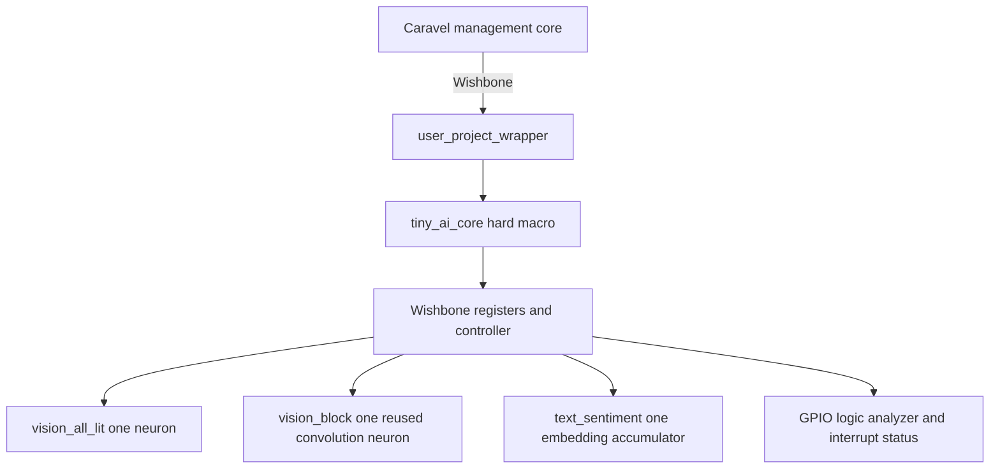

# Tiny AI ChipIgnite Project Specification and Agent Plan

This document specifies a private GitHub project that places three deliberately tiny AI examples into one ChipIgnite Caravel user project. It is written for simple coding agents: each phase has a narrow scope, named outputs, objective checks, and a stop condition. The plan ends with a locally verified, hardened, precheck-clean design. It does not authorize repository publication, ChipFoundry account changes, uploads, paid reservations, or tapeout confirmation.

The key decision is to build one hard macro named `tiny_ai_core`. It contains three one-neuron examples behind one Wishbone register interface. The fixed Caravel `user_project_wrapper` contains only one instance of that macro. This is much smaller and easier to verify than the MNIST accelerators in the sibling repository while still exercising dense inference, convolution with weight reuse, and embedding lookup.

## Project decision

| Item | Decision |
|---|---|
| Git hosting | Private repository under the same GitHub owner as `../open-ai-silicon`; suggested name `rajaghv-dev/open-ai-chip` |
| Visibility | Private for the entire project unless the owner explicitly changes it |
| Process | SkyWater `sky130A` through the current ChipFoundry Caravel template |
| Harness | Caravel digital `user_project_wrapper` |
| User macro | One hard macro, `tiny_ai_core` |
| AI examples | `vision_all_lit`, `vision_block`, and `text_sentiment` |
| Logical AI nodes | Three total: one threshold or scoring node per example; the convolution node is reused across four windows |
| Host interface | 32-bit Caravel Wishbone slave at `0x3000_0000` |
| Clock target | 25 ns period, or 40 MHz |
| Arithmetic | Integer and fixed width only; no floating point, SRAM macro, CPU, or HLS block |
| Verification | Exhaustive standalone testing of every input, then representative full-Caravel RTL and gate-level tests |
| Physical flow | Harden child macro first, then fixed wrapper, then local `cf precheck` |
| Submission | Out of scope; all `cf push`, submit, reservation, and `cf confirm` actions are human-only |

## Source projects and provenance

The implementation must be self-contained in the private target repository. Do not use a filesystem symlink or Git submodule that would make a clean clone depend on `../open-ai-silicon`.

Use these sources only as references or as explicitly copied, attributed building blocks:

1. `../open-ai-silicon` at commit `78fa678829cdfca02a6fea747bf1f43b9eb1c743`.
2. Its [architecture study](../open-ai-silicon/docs/ARCH_STUDY_PLAN.md), especially the shared streaming conventions and the definitions of `vision_all_lit`, `vision_block`, and `text_sentiment`.
3. Its [main specification](../open-ai-silicon/docs/SPEC.md), especially sections 6.10 and 8.
4. Its [agent plan](../open-ai-silicon/docs/AGENT_PLAN.md), especially the evidence and verification gates.
5. Its working RTL to GDS infrastructure, test style, signoff checks, and measured examples. In particular, `designs/ci_user_proj_example` proves that a small Caravel-style macro can complete RTL, synthesis, routing, gate-level simulation, and signoff locally.
6. The current official ChipFoundry template, inspected at `chipfoundry/caravel_user_project` commit `b510613cec367828966b37583f9090ac5ddb6491` on 2026-10-05.

Create `provenance/SOURCES.md` in the target repository. It must record every copied file, its source repository and commit, its license, and all local changes. Do not copy generated outputs or historical metrics and present them as new results.

## Scope

### Included

- Three tiny, deterministic AI examples with no external dataset download.
- A bit-exact Python model, deterministic training or parameter fitting, generated weights, and exhaustive vectors.
- Plain synthesizable Verilog for the three examples and one Wishbone-facing top.
- Standalone RTL and gate-level verification.
- Caravel wrapper RTL, GPIO defaults, Cocotb test, and management-core firmware.
- OpenLane or LibreLane configurations for `tiny_ai_core` and `user_project_wrapper` using the versions selected by the current ChipFoundry project.
- Macro and wrapper hardening, signoff review, and local ChipFoundry precheck.
- A private GitHub development and release workflow.

### Excluded

- MNIST in the first milestone. The sibling repository already covers larger MNIST networks.
- `cnn_fp16`, floating-point arithmetic, external SRAM, analog blocks, HLS, RISC-V cores, and custom standard cells.
- More than one hard macro inside the wrapper.
- Dynamic model or weight updates after fabrication.
- Accuracy claims based on external datasets.
- GitHub repository creation or visibility changes by an agent.
- ChipFoundry login, project registration, upload, paid reservation, submission, or final confirmation by an agent.
- Fabrication and board bring-up.

## Why these three examples

The sibling architecture study contains eight good candidates. These three form the smallest useful ChipIgnite MVP:

| Example | AI property | Input space | Logical nodes | Hardware lesson |
|---|---|---:|---:|---|
| `vision_all_lit` | Dense threshold neuron | 16 images | 1 | Every input has a weight; the computation is a weighted sum and threshold. |
| `vision_block` | Convolution and max pooling | 512 images | 1 reused four times | Kernel weights stay constant while buffering and control handle different windows. |
| `text_sentiment` | Embedding lookup and accumulation | 256 four-token sentences | 1 | Most model state is a tiny lookup table; the arithmetic remains one accumulator and threshold. |

Together they require only three neuron-equivalent compute blocks. The convolution example must reuse one block serially rather than instantiate four parallel copies. This makes “few nodes” an architectural rule rather than a documentation claim.

The following sibling examples remain future work: `audio_pitch`, `audio_onset`, `text_bigram`, `text_attention`, and `neuron_precision`. Do not add them until the three-example MVP passes all gates.

## Functional specification

### Vision all lit

- Input: four one-bit pixels representing a 2 by 2 image.
- Model: one binary threshold neuron.
- Target behavior: output 1 only when all four pixels are 1.
- Initial fitted parameters: four positive unit weights and threshold 4. The fitting script, not hand-edited RTL, is authoritative.
- Execution: one stored pixel is accumulated per clock after `START`; result is committed after four accumulation cycles.
- Verification: all 16 input images.
- Debug score: unsigned lit-pixel count from 0 through 4.

### Vision block

- Input: nine one-bit pixels representing a 3 by 3 image in raster order.
- Model: one 2 by 2 binary convolution kernel reused at all four valid positions, followed by OR max pooling.
- Target behavior: output 1 if any 2 by 2 window is fully lit.
- Storage: one nine-bit frame register in the MVP. A line-buffer version is a later comparison, not part of this tapeout plan.
- Execution: evaluate one window per cycle with the same threshold node; OR each window result into the pooled result.
- Verification: all 512 images.
- Debug score: maximum lit-pixel count seen in a 2 by 2 window, from 0 through 4.

### Text sentiment

- Input: four tokens. Each token is two bits and selects one of four vocabulary entries: `PAD`, `GOOD`, `FINE`, or `BAD`.
- Model: signed embedding lookup, four-term accumulation, and threshold at zero.
- Label rule for the complete truth table: positive when the number of `GOOD` tokens is greater than the number of `BAD` tokens. `PAD` and `FINE` are neutral.
- Training: deterministic brute-force search over small signed integer embeddings and a threshold. Select the smallest-magnitude exact solution, with a deterministic tie-break.
- Execution: one ROM lookup and accumulation per cycle for four cycles.
- Verification: all 256 four-token sentences.
- Debug score: signed sentiment sum, exposed as an eight-bit two's-complement value.

## Numeric rules

- All RTL widths must be explicit. Unsized literals are forbidden in arithmetic expressions.
- Binary pixels and convolution weights are one bit.
- Text embeddings are signed three-bit values unless the fitting proof shows that fewer bits are sufficient.
- The shared visible debug score is signed eight bit. Each core must prove that its internal mathematical range fits without overflow.
- Arithmetic wraps nowhere. Any narrowing conversion must be explicit and accompanied by a range assertion in the testbench.
- Comparison tie behavior must be specified even if a current example does not create a tie.
- The Python golden model must implement the same widths, signedness, and cycle-visible behavior as RTL.

## Chip hierarchy



`user_project_wrapper` must contain exactly one `tiny_ai_core` instance named `mprj` and no synthesizable glue logic. The macro itself drives all Wishbone responses, GPIO output and output-enable buses, logic-analyzer output, and interrupt outputs, including constants on unused bits.

The macro uses `vccd1` and `vssd1`. `analog_io` and `user_clock2` are unused. The wrapper keeps the official port list, fixed DEF, pin geometry, ring, and do-not-edit configuration from the pinned ChipFoundry template.

## Wishbone interface

### Bus behavior

- Base address: `0x3000_0000`.
- Address window: 256 bytes.
- Every accepted transaction receives exactly one `wbs_ack_o` pulse.
- Reads and writes honor `wbs_sel_i`; only byte lane 0 is required for input data, but all control and status accesses must behave deterministically for every byte-select value.
- Unmapped reads return zero and acknowledge normally.
- Unmapped writes acknowledge and have no effect.
- `START` while busy has no effect and sets the sticky protocol error bit.
- Input writes while busy have no effect and set the sticky protocol error bit.
- `DONE` is sticky until `CLEAR` or the next valid `START`.
- `user_irq[0]` pulses for one clock when a result becomes valid. `user_irq[2:1]` are zero.

### Register map

| Offset | Name | Access | Definition |
|---:|---|---|---|
| `0x00` | `ID` | R | `0x54414901`, meaning Tiny AI version 1 |
| `0x04` | `CTRL` | R W | bits 1:0 mode; bit 8 `START`; bit 9 `CLEAR` |
| `0x08` | `STATUS` | R | bit 0 `BUSY`; bit 1 `DONE`; bit 2 `ERROR`; bits 5:4 active mode; bits 11:8 input count |
| `0x0C` | `INPUT` | W | low byte pushes one pixel or token while idle |
| `0x10` | `RESULT` | R | bit 0 classification; bits 15:8 signed debug score; remaining bits zero |
| `0x14` | `CYCLES` | R | cycles from accepted `START` to result commit |
| `0x18` | `CAPS` | R | supported mode bitmap, maximum input length, and RTL version |
| `0x1C` | `DEBUG` | R | mode-specific stored input summary for simulation and board diagnosis |

Mode assignments are fixed:

- `0`: `vision_all_lit`, exactly four input pushes.
- `1`: `vision_block`, exactly nine input pushes.
- `2`: `text_sentiment`, exactly four input pushes; token values above 3 set `ERROR`.
- `3`: reserved; `START` sets `ERROR` and does not assert `BUSY`.

The design accepts a valid `START` only when the exact expected number of inputs has been loaded. `CLEAR` resets `DONE`, `ERROR`, input count, result, score, and cycle count without requiring a global reset.

## External observability

GPIO 0 through 4 remain fixed system pins. GPIO 5 and 6 remain management UART pins. Configure the remaining pads as follows:

| GPIO | Mode | Signal |
|---:|---|---|
| 7 | user input without pull | reserved board input |
| 8 | user output | result bit |
| 9 | user output | done |
| 10 | user output | busy |
| 11 | user output | protocol error |
| 12 to 13 | user output | active mode |
| 14 to 21 | user output | signed debug score |
| 22 to 37 | user input without pull | reserved |

Mirror `RESULT[15:0]`, `STATUS[15:0]`, and `CYCLES[31:0]` into the low 64 bits of `la_data_out`. Drive the remaining logic-analyzer outputs to zero. The MVP does not accept control through `la_data_in`; all inference control uses Wishbone.

## Physical budgets

These are design budgets to be verified, not measured claims:

| Metric | Budget |
|---|---:|
| AI compute nodes | exactly 3 |
| Standard-cell instances in `tiny_ai_core` | at most 2,500, excluding fill cells |
| Sequential cells | at most 128 |
| Child macro die | start at 400 by 400 micrometres; adjust only with recorded evidence |
| Child macro routing | metal 4 maximum |
| Clock | 40 MHz at all required corners |
| Inference latency after `START` | at most 16 cycles in every mode |
| Magic DRC | 0 |
| KLayout DRC | 0 |
| LVS errors | 0 |
| XOR differences | 0 |
| Antenna violations | 0 |
| Setup and hold violating endpoints | 0 at every signoff corner |
| Max slew and max capacitance violations in child macro | 0 |

The initial 400 by 400 micrometre macro size is chosen so the wrapper's approximately 180 micrometre PDN pitch can cross it with more than one strap pair. The physical-design agent must verify actual power connectivity and may enlarge or shrink the macro only after recording utilization, congestion, strap intersections, and timing.

The wrapper remains the fixed 2920 by 3520 micrometre Caravel user area. Do not change any configuration explicitly marked fixed or do not edit in the template.

## Model and generated data

The model directory is the source of truth for expected behavior:

```text
model/tiny_ai/
  spec.json
  train.py
  golden.py
  gen_rom.py
  weights.json
  vectors/
```

Requirements:

1. `spec.json` defines vocabulary, label rules, widths, thresholds, and mode IDs.
2. `train.py` enumerates each complete truth table and fits the smallest exact integer parameters. It uses a fixed seed even if no randomized search is needed.
3. `golden.py` implements bit-exact inference and cycle counts and can evaluate one case or all cases.
4. `gen_rom.py` generates Verilog constants or ROM code and all test vectors.
5. `weights.json`, generated RTL, and vectors carry a source hash and generated-file header.
6. Regeneration from a clean clone must produce no diff.
7. Agents never hand-edit generated weights, ROM RTL, or vector files.

No network access or dataset download is allowed during training, generation, simulation, or CI.

## Private repository layout

The target private repository should use the current ChipFoundry template as its root and add these project files:

```text
SPEC.md
README.md
provenance/SOURCES.md
model/tiny_ai/
verilog/rtl/
  defines.v
  tiny_ai_core.v
  tiny_ai_regs.v
  vision_all_lit.v
  vision_block.v
  text_sentiment.v
  tiny_ai_weights.v
  user_project_wrapper.v
  user_defines.v
verilog/dv/unit/
  tiny_ai_core_tb.v
  vectors/
verilog/dv/cocotb/tiny_ai_suite/
  tiny_ai_suite.c
  tiny_ai_suite.py
  tiny_ai_suite.yaml
verilog/includes/
openlane/tiny_ai_core/
  config.json
  pin_order.cfg
  base.sdc
openlane/user_project_wrapper/
lvs/user_project_wrapper/lvs_config.json
scripts/
  check_generated.sh
  check_signoff.py
  package_candidate.sh
release/
  manifest.json
```

The repository must not contain absolute paths, symlinks into `../open-ai-silicon`, credentials, API keys, SFTP keys, Docker sockets, local PDKs, tool installations, run directories, or intermediate GDS files.

During development, do not commit GDS. `package_candidate.sh` creates a local release bundle and SHA-256 manifest. If the owner later chooses ChipFoundry's HTTPS upload mode, the final GDS can remain outside Git. If the owner instead chooses remote GitHub upload, the owner must explicitly decide whether the final wrapper GDS may be committed to the private release branch because that mode requires push-critical files at GitHub `HEAD`.

## Required developer commands

The implementation must provide these stable project commands even if they wrap scripts or official `cf` commands:

```text
make doctor            host tools, pins, Docker, PDK and template checks
make generate          regenerate weights, ROM and vectors
make check-generated   fail if regeneration changes tracked files
make simulate          exhaustive standalone RTL test
make synth-check       Yosys hierarchy, warnings and no-logic-lost checks
make test              generate check, RTL, protocol and repository tests
make harden-macro      official hardening of tiny_ai_core
make check-macro       macro signoff and artifact checks
make harden-wrapper    official hardening of user_project_wrapper
make verify-caravel    representative full-Caravel RTL test
make verify-caravel-gl representative full-Caravel gate-level test
make precheck          local ChipFoundry precheck
make candidate         all non-account gates and a local release bundle
```

Every target must return nonzero on failure. No target may convert a failed check into a warning. `make candidate` must stop before any upload or account-linked operation.

## Verification plan

### Model checks

- Enumerate and label all 16, 512, and 256 cases.
- Prove the fitted model has zero mismatches on each truth table.
- Prove generated outputs are deterministic.
- Add negative tests that mutate one expected output and confirm the checker exits nonzero.

### Standalone RTL checks

- Drive every case through Wishbone, not through private internal signals.
- Compare result, score, cycle count, status, and interrupt behavior with the golden model.
- Check reset during idle and busy.
- Check `CLEAR`, exact input counts, extra inputs, invalid token, invalid mode, `START` while busy, input while busy, back-to-back runs, unmapped addresses, and every byte-select pattern.
- Compile with warnings enabled. Treat latches, multiple drivers, width truncation, undriven outputs, and synthesis check errors as failures.

### Standalone gate-level checks

- Run the same exhaustive testbench on the synthesized netlist.
- Run it again on the final routed powered netlist.
- Assert that expected sequential state survives synthesis.
- Require zero functional mismatches.

### Caravel checks

Full-Caravel simulation is slower, so it is representative rather than exhaustive. Management firmware must:

1. Configure GPIO.
2. Read and validate `ID` and `CAPS`.
3. Run at least one negative and one positive vector in each mode.
4. Check Wishbone status, result, score, cycle count, GPIO, logic-analyzer mirror, and interrupt.
5. Print an unambiguous pass or failure code over management UART.

Run this test at RTL and again after wrapper hardening with the gate-level project files.

### Physical and precheck gates

- Child macro artifact set: GDS, LEF, powered netlist, SDC, SPEF, LIB, metrics, and reports.
- Wrapper artifact set: exactly one `user_project_wrapper.gds`, gate-level wrapper netlist, extracted views, and reports.
- Review metrics directly; do not accept a green flow banner without checking DRC, LVS, XOR, antenna, timing, slew, capacitance, cell count, and sequential count.
- Run all required local precheck checks, including LVS and Magic DRC. Do not use a disable-LVS result as release evidence.
- Hash the final wrapper GDS and record the hash, tool versions, PDK commit, template commit, source commit, and test log hashes in `release/manifest.json`.

## Agent execution plan

Agents run these phases sequentially. A later phase cannot start until the earlier acceptance gate passes.

### Phase 0 Human private repository checkpoint

**Human only**

- Create or select a private GitHub repository under the owner's account. Suggested name: `open-ai-chip`.
- Confirm it is private and grant the coding environment access.
- Do not install the ChipFoundry GitHub App unless the owner later chooses remote upload.

**Gate:** the agent can clone the repository, and repository visibility is confirmed private by the owner. The first push requires the owner's normal branch authorization and review. If either condition fails, stop.

### Phase 1 Baseline and version lock

**Agent reads:** this specification, the sibling source documents, `../open-ai-silicon/CLAUDE.md`, the current official ChipFoundry template, and its licenses.

**Agent produces:**

- A target repository based on the official template without changing fixed wrapper geometry.
- `provenance/SOURCES.md`.
- A lock file recording the template commit, ChipFoundry CLI version, flow version, Caravel tag, and PDK commits actually selected at setup time.
- A passing unmodified template RTL smoke test.

**Gate:** clean clone, no secret files, exact version record, template smoke test passes. Do not start AI RTL if the baseline fails.

### Phase 2 Golden models and generators

**Agent owns:** `model/tiny_ai/` only.

**Agent produces:** model spec, deterministic fitter, bit-exact golden model, weights, vectors, and generation check.

**Gate:** zero model mismatches across 16, 512, and 256 cases; regeneration has no diff; a deliberately corrupted vector makes the checker fail.

### Phase 3 Three inference engines

**Agent owns:** the three engine RTL files and engine-only unit tests.

**Agent produces:** one explicit-state implementation per example. `vision_block` must contain one reused threshold engine, not four parallel engines.

**Gate:** all truth tables pass at engine level; lint and Yosys checks are clean; hierarchy inspection confirms exactly three compute nodes in the complete design intent.

### Phase 4 Wishbone core integration

**Agent owns:** `tiny_ai_core.v`, `tiny_ai_regs.v`, top-level unit test, and include lists.

**Agent produces:** register map, loading rules, controller, status, GPIO, logic analyzer, and interrupt behavior.

**Gate:** the exhaustive 784-case suite passes through Wishbone; every protocol negative test passes; all outputs are driven; synthesis retains the expected state.

### Phase 5 Human ChipFoundry initialization checkpoint

This checkpoint is human-only and must occur before either official hardening command. The owner:

- installs or selects the pinned ChipFoundry CLI;
- runs `cf login` and `cf init` for the private target repository;
- selects the intended shuttle and runs `cf gpio-config`;
- reviews every generated or changed project file and confirms that the repository remains private; and
- commits only the reviewed, non-secret configuration files.

This checkpoint authorizes local technical work only. It does not authorize `cf push`, a reservation, submission, payment, or `cf confirm`. If a later local command needs an authenticated session, the owner runs it or explicitly authorizes that exact non-submission command without exposing credentials to an agent.

**Gate:** initialization and GPIO configuration are reviewed, no credential is tracked, the exact CLI, project, and shuttle identifiers are recorded, and the private repository is clean. If the owner does not want account-linked initialization yet, stop after Phase 4 with a simulation-ready design.

### Phase 6 Macro physical configuration

**Agent owns:** `openlane/tiny_ai_core/`, macro constraints, pin order, and signoff checker.

**Agent starts from:** 400 by 400 micrometres, metal 4 maximum, 25 ns clock, `vccd1` and `vssd1`.

**Gate:** child hardening finishes; all physical and timing budgets pass; both exhaustive gate-level runs pass. If area or PDN must change, record evidence before editing the budget or geometry.

### Phase 7 Fixed wrapper integration

**Agent owns:** wrapper RTL, wrapper macro configuration, `user_defines.v`, and LVS configuration.

**Agent produces:** a wrapper with exactly one `tiny_ai_core mprj` instance and no glue logic. The macro placement must align with the wrapper PDN and keep Wishbone routes short.

**Gate:** wrapper elaborates, has the exact golden port list, respects the fixed DEF and PDN settings, connects macro power, and hardens without fatal violations.

### Phase 8 Caravel verification

**Agent owns:** one Cocotb test package and management firmware.

**Agent produces:** the representative six-vector test, protocol checks, GPIO checks, logic-analyzer checks, and UART pass code.

**Gate:** official `cf verify` flow passes at RTL and GL. No test may pass only because of a timeout, missing assertion, or ignored return code.

### Phase 9 Local precheck and candidate bundle

**Agent owns:** local scripts and release manifest only.

**Agent produces:** complete local precheck reports and a local release bundle. The bundle contains required source/configuration files, exactly one wrapper GDS, hashes, and reports.

**Gate:** every required precheck passes, all earlier test logs are present, the final Git working tree has no unexplained change, and the candidate command performs no network upload.

### Phase 10 Independent verification

**Verifier starts from:** a fresh clone of the private candidate commit with no build directories.

**Verifier reruns:** generation, exhaustive RTL, synthesis check, macro hardening, exhaustive gate-level, wrapper hardening, Caravel RTL and GL, and local precheck.

**Gate:** results match the release manifest and every acceptance item below is supported by a file. A second run is not optional for tapeout readiness.

### Phase 11 Human ChipFoundry submission checkpoint

This phase is not part of agent execution.

If the owner wants to proceed after independent verification, the owner reviews the candidate manifest and chooses one upload path:

- Prefer `cf push --https` when the private repository should remain inaccessible to the ChipFoundry GitHub App.
- Use `cf push --remote` only after explicitly granting the GitHub App access to this private repository and confirming that the required release files are present at GitHub `HEAD`.

Reservation, payment, submission, and `cf confirm` remain final human-only actions. The agent may supply the evidence checklist but must not perform or approve them.

## Agent operating rules

1. Read the nearest repository instructions before changing files.
2. Work on one phase and one ownership area only.
3. Start from a clean branch and report the starting commit.
4. Do not edit sibling `../open-ai-silicon`; it is reference material.
5. Do not change the target repository from private to public.
6. Do not add external model downloads, package registries at test time, or nondeterministic data.
7. Do not hand-edit generated model artifacts.
8. Do not weaken timing, DRC, LVS, synthesis, or precheck settings to make a gate pass.
9. Do not use `DISABLE_LVS`, suppress synthesis check errors, or accept deleted logic.
10. Do not modify fixed wrapper geometry or pin locations.
11. Do not run multiple physical flows concurrently on the local machine.
12. Do not run `cf login`, `cf init`, `cf push`, submit, reserve, or `cf confirm` without the owner's direct action and review.
13. Stop after the first decisive failure and preserve the log and run directory.
14. Report only measured numbers and name the source file for each.

Every handoff uses this form:

```text
Phase:
Status: PASS | FAIL | NOT RUN
Start commit:
End commit:
Commands and exit codes:
Files changed:
Evidence paths:
Measured budgets:
Tracked or untracked files:
First failure or blocker:
Next phase allowed: yes | no
```

## Acceptance criteria

The project is locally ChipIgnite-ready only when all items pass:

- [ ] The GitHub repository is private and self-contained.
- [ ] Source and template provenance are recorded by commit and license.
- [ ] There are exactly three logical inference nodes as specified.
- [ ] All 784 functional inputs pass the bit-exact model.
- [ ] All 784 inputs pass standalone RTL through Wishbone.
- [ ] All 784 inputs pass synthesized and routed gate-level macro simulation.
- [ ] Protocol, reset, invalid-input, and back-to-back tests pass.
- [ ] `tiny_ai_core` meets the cell, state, latency, layer, timing, DRC, LVS, XOR, antenna, slew, and capacitance budgets.
- [ ] `user_project_wrapper` contains one macro instance and preserves the golden wrapper interface and geometry.
- [ ] GPIO 5 through 37 all have valid startup modes.
- [ ] Full-Caravel representative RTL and GL tests pass.
- [ ] Wrapper-level setup and hold pass at every required corner.
- [ ] Local ChipFoundry precheck passes with LVS and Magic DRC enabled.
- [ ] The release manifest identifies the exact source, tools, PDK, template, GDS hash, and evidence logs.
- [ ] An independent fresh-clone reproduction matches the candidate.
- [ ] No agent has uploaded, submitted, reserved, confirmed, published, or changed repository visibility.

Passing these items means the design is technically prepared for the owner to review for ChipIgnite submission. It does not mean the design has been submitted or fabricated.

## Risks and responses

| Risk | Response |
|---|---|
| Current ChipFoundry pins differ from the sibling repository | Resolve and record versions in Phase 1; the target's lock file is authoritative. |
| Tiny logic is dominated by the full Caravel pin interface | Keep one combined macro and measure standard cells excluding fill; do not interpret interface overhead as AI node count. |
| A 400 micrometre macro misses wrapper power straps | Inspect PDN intersections and adjust placement or macro size with evidence before wrapper hardening. |
| Wrapper routing creates slew problems | Place the macro near Wishbone pins, constrain realistic transition and load, and fix the design rather than relaxing the constraint. |
| Exhaustive full-Caravel simulation is too slow | Keep exhaustive checks at standalone RTL and macro GL; use representative vectors only at full-Caravel level. |
| A trivial model is optimized away | Require exhaustive GL simulation and check surviving sequential and combinational logic against the RTL intent. |
| Private GitHub blocks remote ChipFoundry access | Use local precheck and, if the owner proceeds, HTTPS direct upload; do not make the repository public as a workaround. |
| Official CLI requires account initialization before hardening | Complete model, RTL, unit verification, and offline synthesis first; pause at the explicit human checkpoint before account-linked flow steps. |

## References

- Local architecture source: [Architecture study](../open-ai-silicon/docs/ARCH_STUDY_PLAN.md)
- Local ChipIgnite source: [Open AI silicon specification](../open-ai-silicon/docs/SPEC.md)
- Local measured baseline: [Exercise 1](../open-ai-silicon/docs/EXERCISE_1.md)
- Official current template: <https://github.com/chipfoundry/caravel_user_project>
- Official ChipFoundry CLI and private upload workflows: <https://github.com/chipfoundry/cf-cli>
- Caravel project background: <https://github.com/efabless/caravel>
