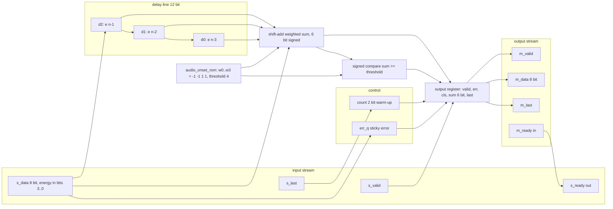
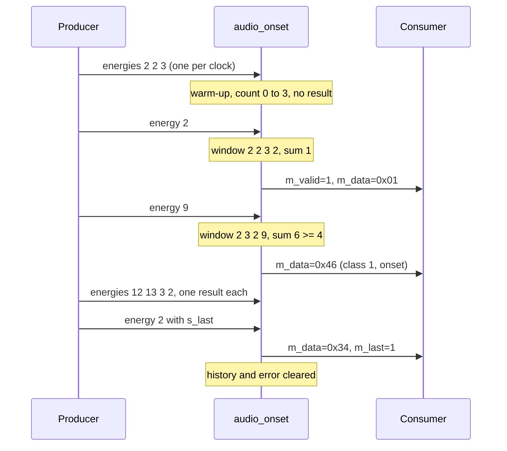
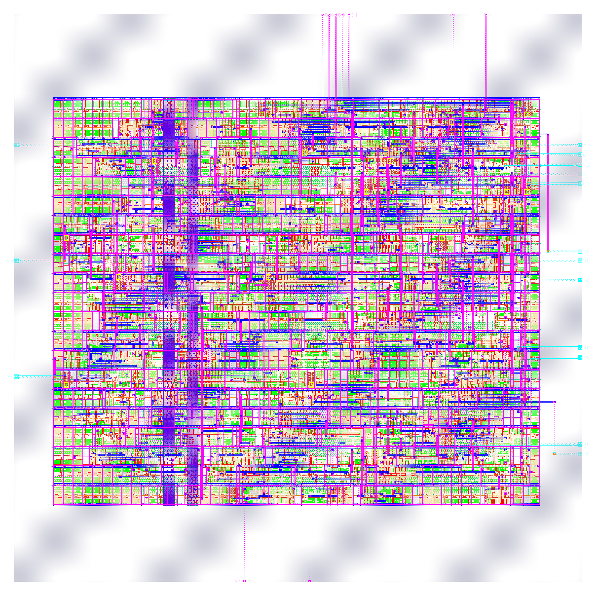

# audio_onset: design notes

## What it is

`audio_onset` is a streaming onset detector. One 4-bit loudness value (`s_data[3:0]`) arrives per clock beat; after every new value, once four have been seen, it answers "did the sound just get louder?" (source: `README.md`).
One neuron over the last four energies: `sum = w0*e[n-3] + w1*e[n-2] + w2*e[n-1] + w3*e[n]`, `class = (sum >= threshold)` with weights `[-1, -1, +1, +1]` and threshold 4 (`model/audio_onset/weights.json`, ROM in `rtl/audio_onset_rom.v`).
Output beat: `m_data = {error, class, sum[5:0]}` (6-bit two's complement sum), one beat per input beat after a warm-up of 3 samples, one cycle after the input beat.
It is AI because the weights were found by `model/audio_onset/train.py` (exhaustive search of the 625 weight vectors in -2..2 plus thresholds), not written into the RTL. See [../../docs/WHY_AI.md](../../docs/WHY_AI.md) section 6.
Simulation: `make simulate DESIGN=audio_onset` printed `PASS audio_onset_tb: 68829 beats x 3 passes (all 65536 windows, short streams, errors, resets; full-rate, gaps, stalls), 203193 output beats compared, 856018 checks`.
Hardening: `make flow-all` passed all 5 stages (simulate, gds, check, gate-level synthesised and routed, collect), total 77 s (`build/flow_audio_onset.log`).

## Architecture



Registers (all in `rtl/audio_onset.v`; synchronous active-high reset, but `d0..d2` and the `out_*` data bits have no reset because they are gated by warm-up and `out_valid`):

| Register | Width | Purpose |
|---|---|---|
| `d0` | 4 | energy 3 samples ago (oldest) |
| `d1` | 4 | energy 2 samples ago |
| `d2` | 4 | energy 1 sample ago |
| `count` | 2 | samples seen since reset or `s_last`, saturates at 3 |
| `err_q` | 1 | sticky error: `s_data[7:4] != 0` in this stream |
| `out_valid` | 1 | a result is waiting for the consumer |
| `out_err`, `out_cls`, `out_last` | 1 each | result bits 7, 6 and `m_last` |
| `out_sum` | 6 | result bits 5..0, signed sum |

RTL flip-flop bits: 12+2+1+1+1+1+1+6 = 25. `metrics.json` (`design__instance__count__class:sequential_cell`) says 25 and `synth_stat.rpt` lists 25 `dfxtp_2`.
There is no multiplier: each product `w*e` is `(w[0]?e:0) + (w[1]?2e:0) - (w[2]?4e:0)` and, as the weights are constants, synthesis folds it to a four-input add/subtract tree (comments in `rtl/audio_onset.v`).

## Data flow

Example stream (10 energies, one per clock, `m_ready` always 1, `s_last` on the last): `2 2 3 2 9 12 13 3 2 2`, a quiet start, a loud burst, then quiet again. Numbers from `model/audio_onset/golden.py` (`beat()` with weights `[-1,-1,1,1]`, threshold 4).
`d0 d1 d2` and `count` are shown as the engine sees them before the edge (the shift happens on that edge); the three delay registers start as 0 after reset and are ignored until warm.

| Edge | e (new) | d0 d1 d2 before | count before | sum = -d0 -d1 +d2 +e | class | Result beat (`m_data`) |
|---|---|---|---|---|---|---|
| 0 | 2 | 0 0 0 | 0 | not computed | | none (warm-up) |
| 1 | 2 | 0 0 2 | 1 | not computed | | none |
| 2 | 3 | 0 2 2 | 2 | not computed | | none |
| 3 | 2 | 2 2 3 | 3 | -2-2+3+2 = 1 | 0 | 0x01 |
| 4 | 9 | 2 3 2 | 3 | -2-3+2+9 = 6 | 1 | 0x46 (onset) |
| 5 | 12 | 3 2 9 | 3 | -3-2+9+12 = 16 | 1 | 0x50 |
| 6 | 13 | 2 9 12 | 3 | -2-9+12+13 = 14 | 1 | 0x4E |
| 7 | 3 | 9 12 13 | 3 | -9-12+13+3 = -5 | 0 | 0x3B |
| 8 | 2 | 12 13 3 | 3 | -12-13+3+2 = -20 | 0 | 0x2C |
| 9 (`s_last`) | 2 | 13 3 2 | 3 | -13-3+2+2 = -12 | 0 | 0x34, `m_last`=1 |

`m_data` packs `{error=0, class, sum[5:0]}`: for example -5 is 59 = 0x3B in six bits, +16 with class 1 is 0x40+0x10 = 0x50. A result appears on `m_data` the cycle after its input beat. 10 samples give 7 results (10 - 3), then `s_last` clears the history and `count`.
Reading the table: the sum rises to 6 when the first loud value enters on the "new" side, peaks at 16 when two loud values are new and two quiet ones are old, then goes negative (-20) when loud values are the old half and quiet ones the new. The same four constants give "louder" and "quieter" with opposite sign.



## Verification

Testbench: `designs/audio_onset/tb/audio_onset_tb.v` (self-contained, no shared include; ports only so it runs
unchanged on the RTL and on both netlists), `+VEC=designs/audio_onset/tb/vectors.hex`. The file is played
three times: pass 0 at full rate (`m_ready` always 1, `s_ready` always 1, exact latency: result in the cycle
after the input beat, none otherwise); pass 1 with random input gaps (garbage on `s_data`/`s_last` while
`s_valid` is low) and random output stalls; pass 2 with heavy back-pressure (`m_ready` low 3 cycles in 4).
Every cycle: `s_ready === (!m_valid | m_ready)`; a stalled result holds `m_valid`/`m_data`/`m_last`; no result
without an accepted input beat; results in order. Reset both between beats (drain-reset) and with a result
waiting (stall-reset, the result is discarded). Comparisons use `!==` so X never passes; hard timeout of
400,000,000 ns; `$fatal(1, "FAIL ...")` on the first failure.
Fresh `make simulate DESIGN=audio_onset`: `PASS audio_onset_tb: 68829 beats x 3 passes (all 65536 windows,
short streams, errors, resets; full-rate, gaps, stalls), 203193 output beats compared, 856018 checks`

Vectors: `designs/audio_onset/tb/vectors.hex` is generated by `model/audio_onset/gen_rom.py` from
`model/audio_onset/weights.json` and `model/audio_onset/golden.py`; every expected result beat comes from the
bit-exact golden model, never hand-written. One de Bruijn B(16,4) stream of 65,539 samples in which each of
the 65,536 four-sample windows occurs exactly once (so every window is tested as the newest window of some
beat; 65,536 is the full input space of the neuron), then short streams, `s_last` everywhere, error samples,
generated onset sequences and resets: 68,829 input beats in all (header of
`designs/audio_onset/tb/audio_onset_tb.v`).

Model-level: `model/audio_onset/golden.py` has no `--check` entry point and the audio engines are not part of
`make check-generated` or `tests/run_tests.sh`; I found no recorded zero-mismatch run for them. The accuracy
of the trained rule is in the NOTES (fitted, not exact).

Gate-level: the same testbench file runs on the synthesised netlist (`make gl DESIGN=audio_onset`:
synthesis-only run, netlist `build/gl/audio_onset/runs/gl/final/nl/audio_onset.nl.v`, 173 cells) and on the
routed post-PnR netlist (`make gl-final DESIGN=audio_onset`:
`designs/audio_onset/runs/RUN_2026-10-05_20-00-31/final/nl/audio_onset.nl.v`, 669 cells), compiled by
`scripts/flow/gl_sim.sh` against the sky130_fd_sc_hd functional models with a unit gate delay of `#0.01`
(`GL_UNIT_DELAY`, default in gl_sim.sh; it must be above 0 to avoid flip-flop races and below the 1 ns sample
point). Results on disk: `build/flow/audio_onset/stage_gl_synth.log` and `stage_gl_final.log` both end
`gl_sim: audio_onset PASS`; `build/gl/audio_onset/result.txt` reads `audio_onset | final:audio_onset.nl.v |
every case of tb/vectors.hex | PASS | 8 s`. `build/gl/audio_onset/synth_checks.txt` reads
`synthesis__check_error__count = 0`.

Signoff checks that are verification (`scripts/flow/check_signoff.py audio_onset`,
`build/flow/audio_onset/stage_check.log`): no logic lost, `tests/run_tests.sh` has no negative entries for
audio_onset (its negative section covers the counter, the three tiny engines, the core and the model only),
and `designs/audio_onset/NOTES.md` states that there is no mutation suite, so a wrong weight being caught is
not demonstrated; the exhaustive window coverage makes it very likely. The checks inside the testbench that
can fail: X, an output beat without an input beat, a stalled result that changes, wrong latency, wrong state
after reset.; Yosys driver warnings (multiple drivers / no driver) 0, synthesis check errors 0
(`synth_checks.txt`).

Negative tests: RTL 25 registers, 25 surviving sequential cells, allowance 0 (3 x 4-bit delay line = 12 flops
among them; the NOTES do not report a one-hot recoding)

## Layout (GDSII)



The picture (`output/layout.png`, KLayout render) shows the 80 x 80 um die (`design__die__bbox` = `0.0 0.0 80.0 80.0`, 6400 um^2) in grey with the core inside (`design__core__bbox` = `5.52 10.88 74.06 68.0`, 3915 um^2, 21 rows of 149 sites). Horizontal stripes are cell rows, the magenta grid is the power network, the two wide purple vertical bands left of centre are power straps, cyan stubs on the left and right edges and magenta wires at the top and bottom are the I/O pins; small yellow squares are antenna diodes.
This core is visibly busier than the `audio_pitch` one: utilization 0.713647 (`design__instance__utilization`), 316 stdcells, 2793.93 um^2 (`design__instance__area__stdcell`), with 353 fill-class cells (245 `decap_3`, 55 `fill_1`, 53 `fill_2`; `cell_usage.rpt`), 57 tap cells and 20 antenna diodes. `design__io` = 26 (24 signals plus `vccd1`, `vssd1`).

## From RTL to GDSII: what each step did

### Synthesis

Yosys mapped the RTL to 173 sky130_fd_sc_hd cells, 2080.746 um^2, of which 531.76 um^2 (25.56 %) is the 25 `dfxtp_2` flip-flops (`output/reports/synth_stat.rpt`). The rest is 1548.99 um^2 of logic (my subtraction). The biggest contributors: 27 `xnor2_2` (439.17 um^2) and 11 `xor2_2` (178.92 um^2), the adder tree; 17 `mux2_1` (191.43 um^2); 13 `nand2_2`, 8 `and2b_2`, 8 `or2_2`, 8 `a21oi_2`. `synth_checks.rpt` shows no problems; `synthesis__check_error__count` = 0, `design__inferred_latch__count` = 0, `design__instance_unmapped__count` = 0, lint warnings 446 (`design__lint_warning__count`).
Report: [synth_stat.rpt](output/reports/synth_stat.rpt), [synth_checks.rpt](output/reports/synth_checks.rpt).

### Floorplan

Die fixed at 80 x 80 um by `config.json`; 21 rows, core area 3915.005 um^2, 173 instances, effective utilization 0.531 before repair and fill (`floorplan.txt`).
Report: [floorplan.txt](output/reports/floorplan.txt).

### Placement

Global placement finished at iteration 905 with routability-mode iteration count 683 and final weighted congestion 0.9445; final placement area 2461.94 (+6.97 %) (`placement_global.txt`). Detailed placement: original HPWL 2882.2 u, legalized 2973.9 u (+3 %) (`placement_detailed.txt`). `design__instance__displacement__total` = 92.12 um. Timing repair added 58 buffers, 444.176 um^2 (`design__instance__count__class:timing_repair_buffer`, `design__instance__area__class:timing_repair_buffer`).
Reports: [placement_global.txt](output/reports/placement_global.txt), [placement_detailed.txt](output/reports/placement_detailed.txt).

### Clock tree

TritonCTS: 1 clock root, 5 buffers inserted, 25 sinks (`cts.rpt`). Worst setup-side skew 0.2538 ns (`clock__skew__worst_setup`). After CTS, 18 hold buffers were inserted (`design__instance__count__hold_buffer`).
Report: [cts.rpt](output/reports/cts.rpt).

### Routing

Global routing: 247 routed nets, `global_route__wirelength` = 7307, `global_route__vias` = 1503; the log notes extra iterations to remove overflow (`routing_global.txt`, `metrics.json`). Detailed routing: DRC violations per iteration 63, 11, 0 (`route__drc_errors__iter:0..2`), final `route__drc_errors` = 0; wire length 4264 um in `routing_detailed.txt` (`route__wirelength` = 4211), 1478 vias (`route__vias`), longest net 122.86 um (`route__wirelength__max`).
Reports: [routing_global.txt](output/reports/routing_global.txt), [routing_detailed.txt](output/reports/routing_detailed.txt).

### Timing

Clock period 25 ns (`config.json`). All corners pass with TNS 0 (`timing_summary.rpt`, `metrics.json`).

| Corner | Worst setup slack (ns) | Worst hold slack (ns) |
|---|---|---|
| nom_tt_025C_1v80 | 13.9625 | 0.3225 |
| nom_ss_100C_1v60 | 13.2227 | 0.9127 |
| nom_ff_n40C_1v95 | 14.2297 | 0.1155 |
| Overall worst | 13.2059 (max_ss_100C_1v60) | 0.1128 (min_ff_n40C_1v95) |

Worst setup path (`timing_paths_max_ss.rpt`, slack 13.205867 ns): input port `m_ready` to output port `s_ready`, the combinational `s_ready = ~out_valid | m_ready`. The worst path ending at a flip-flop starts at `s_data[0]` and ends at `_308_`, slack 13.619506 ns, i.e. through the adder tree.
Worst hold path (`timing_paths_min_ff.rpt`, slack 0.112794 ns): start and end point are both flip-flop `_303_` (a register feeding back on itself).
Reports: [timing_summary.rpt](output/reports/timing_summary.rpt), [timing_paths_max_ss.rpt](output/reports/timing_paths_max_ss.rpt), [timing_paths_min_ff.rpt](output/reports/timing_paths_min_ff.rpt).

### DRC

Magic `COUNT: 0` (`drc_magic.rpt`); KLayout: all 257 rule entries in `drc_klayout.json` are 0 (my sum); `manufacturability.rpt`: DRC Passed.
Reports: [drc_magic.rpt](output/reports/drc_magic.rpt), [drc_klayout.json](output/reports/drc_klayout.json), [manufacturability.rpt](output/reports/manufacturability.rpt).

### LVS

`lvs_netgen.rpt`: "Circuits match uniquely." with 257 devices and 254 nets each side; `manufacturability.rpt`: LVS Passed.
Report: [lvs_netgen.rpt](output/reports/lvs_netgen.rpt).

### Power / IR drop

Total power 8.0656e-04 W (`power__total`: internal 4.51e-04, switching 3.56e-04, leakage 4.2e-09 W). IR drop on vccd1: worst 7.35e-04 V (0.04 %), average 1.90e-04 V; vssd1 worst 5.74e-04 V (`irdrop.rpt`).
Report: [irdrop.rpt](output/reports/irdrop.rpt).

### Antenna, slew, capacitance

20 antenna diodes inserted (`design__instance__count__class:antenna_cell`); `antenna__violating__nets` = 0; `manufacturability.rpt`: Antenna Passed.
Report: [cell_usage.rpt](output/reports/cell_usage.rpt).

## Run time and memory

From `output/resources.json` (profile "tight": 2 CPUs, 8 GB): total wall time 49 s, container peak memory 609,095,680 bytes (0.567 GB), 78 steps. Whole `flow-all` 77 s (`build/flow_audio_onset.log`; the gate-level stages took 11 s and 8 s).

| Step | Wall time (s) |
|---|---|
| 46-openroad-detailedrouting | 7.356 |
| 35-openroad-cts | 4.094 |
| 57-openroad-stapostpnr | 2.506 |

## Reproduce

```bash
python3 model/audio_onset/train.py     # fit the weights -> weights.json
python3 model/audio_onset/gen_rom.py   # rtl/audio_onset_rom.v and tb/vectors.hex
make simulate DESIGN=audio_onset       # RTL simulation, 3 passes
make flow-all DESIGN=audio_onset       # simulate, gds, check, gate-level, collect
```

`rtl/audio_onset_rom.v` is generated from `model/audio_onset/weights.json`; `gen_rom.py` refuses to emit a ROM whose exact sum range does not fit 6 bits. The testbench `tb/audio_onset_tb.v` is ports-only, so it also runs on the synthesised and routed netlists.

## Comparison with audio_pitch

| Metric | audio_onset | audio_pitch | Source |
|---|---|---|---|
| Std cells | 316 | 234 | `design__instance__count__stdcell` |
| Flip-flops | 25 | 21 | `design__instance__count__class:sequential_cell` |
| Stdcell area (um^2) | 2793.93 | 1744.17 | `design__instance__area__stdcell` |
| Utilization | 0.7136 | 0.4455 | `design__instance__utilization` |
| Routed wirelength (um) | 4211 | 2700 | `route__wirelength` |
| Worst setup slack (ns) | 13.206 | 13.354 | `timing__setup__ws` |
| Worst hold slack (ns) | 0.1128 | 0.1032 | `timing__hold__ws` |
| Total power (W) | 8.066e-04 | 1.121e-04 | `power__total` |
| Flow wall time (s) | 49 | 47 | `resources.json` |

## Intuitions and insights

1. **Streaming state is a delay line sized by the window.** `vision_block` stores a 9-bit frame and answers once; here the memory is three 4-bit registers (`d0..d2`, 12 flops) that shift every beat, and the newest sample never needs to be stored because it is used live. The stream could be 10 beats (the trace above) or a year: the flop count stays 25 (`sequential_cell`).

2. **The weights mean "recent minus older".** In the trace the sum is `-(old two) + (new two)`: 1 for a quiet window, 6 when the first loud value arrives, 16 at the peak, then -5 and -20 as the loud values age into the negative-weight half. Threshold 4 turns that into the rule "sum of the newest two exceeds the sum of the oldest two by at least 4", i.e. the mean rises by 2 (WHY_AI section 6).

3. **Knowledge from data: the trainer rediscovered [-1, -1, +1, +1].** `train.py` was never told the weights; it searched all 5^4 = 625 vectors in -2..2 on windows with 5 % label noise and picked this one with threshold 4: 95.63 % on the noisy training labels, 100 % on clean test windows and on all 65,536 windows (`weights.json`; `model/examples/audio.py` prints 95.73 % because it runs its own data). Honest caveat from WHY_AI: the label rule has the same shape as the neuron, so this shows the search works, not that the shape suits real sound.

4. **Same RTL, different function.** Weights and threshold live only in `rtl/audio_onset_rom.v`, generated from `weights.json` (sha256 in its header). Train other labels (a falling edge, a slow trend) and the same adder tree, comparator and delay line compute a different answer; only the constants change, and synthesis folds them in.

5. **Bit width: four bits per sample is not four times the cost, it is more.** The same window of four samples needs 12 history bits here against 4 in a 1-bit design (WHY_AI), the sum grows from a 2-bit count to a 6-bit signed value, and the measured result is 316 vs 234 cells, 25 vs 21 flip-flops and 2793.93 vs 1744.17 um^2 (table above). Flip-flops grow modestly (+4); the logic grows most: 1548.99 vs 654.38 um^2 of combinational area at synthesis (`synth_stat.rpt`, my subtraction), 2.4x, and 38 xor/xnor cells (27 + 11) are 618 um^2 of it. In a real audio chip, sample width is the first knob to shrink.

6. **6 signed bits is exactly enough, thanks to modular arithmetic.** Energies 0..15 with weights [-1,-1,1,1] give -30..30, inside -32..31. A lone product like 15*(-4) = -60 would wrap, but two's complement addition is modular, so the final 6-bit sum is still exact. `gen_rom.py` computes the range and refuses a ROM that does not fit; `golden.py` asserts `-32 <= s <= 31`. Widening the weights range would force a wider adder and wider output register.

7. **Throughput: one result per clock.** At 25 ns (`config.json`) the engine takes a new energy every cycle, 40 M results/s, and answers one cycle later (the testbench's pass 0 checks the exact latency). Audio energies are slow; as my assumption (not from the repo), a 100 Hz energy rate would leave room for hundreds of thousands of channels in principle, but each channel would need its own 12+3 bits of delay line and count swapped in. The plan describes this only as time-multiplexing, not a measurement.

8. **Where the area goes.** 316 cells occupy 2793.93 um^2 of the 3915 um^2 core (utilization 0.7136); fill-class cells (353, of which 245 decaps) and 57 taps take the rest. Synthesis gave 2080.746 um^2, so the flow added 713.18 um^2 (my subtraction), of which timing-repair buffers are 444.18 um^2 (58 buffers) per `metrics.json`; the rest (clock buffers, hold buffers, diodes) was not split out.

9. **Timing headroom.** Worst setup slack is 13.206 ns of 25 ns, and the worst path is again the `m_ready` to `s_ready` wire; even the adder-tree path from `s_data[0]` to a flop has 13.62 ns. Hold is the tight number: 0.1128 ns at min_ff. Both audio designs keep the same ~13 ns setup headroom, so the 4-bit arithmetic does not limit the clock at 25 ns.

10. **Verification: de Bruijn coverage, streaming testbench, negative checks.** A frame testbench (`vision_block`, 540 independent frames) cannot check history-dependent output. Here one de Bruijn stream contains each of the 65,536 four-sample windows exactly once (68,829 beats, `tb/audio_onset_tb.v` header), so every window is tested as the newest window of some beat, then short streams, `s_last` everywhere, error samples and resets, replayed in three paces (full rate, random gaps and stalls, heavy back-pressure): 203,193 output beats and 856,018 checks. The testbench fails on X (`!==`), an output beat with no input beat, a stalled result that changes, wrong latency, and wrong state after reset (drain-reset and stall-reset). There is no mutation suite in the repo, so I cannot show that a wrong weight would be caught; the exhaustive coverage makes it very likely but that is not demonstrated here.
