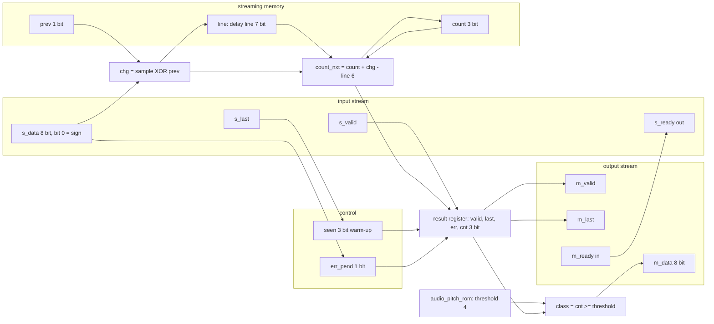
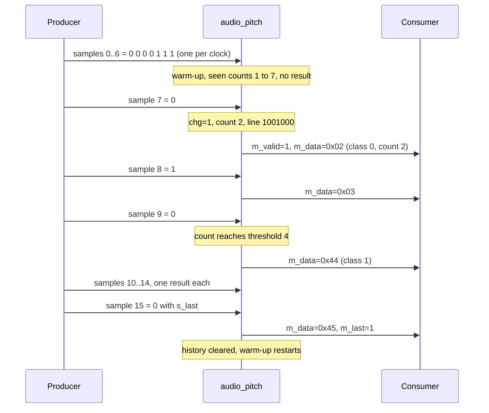
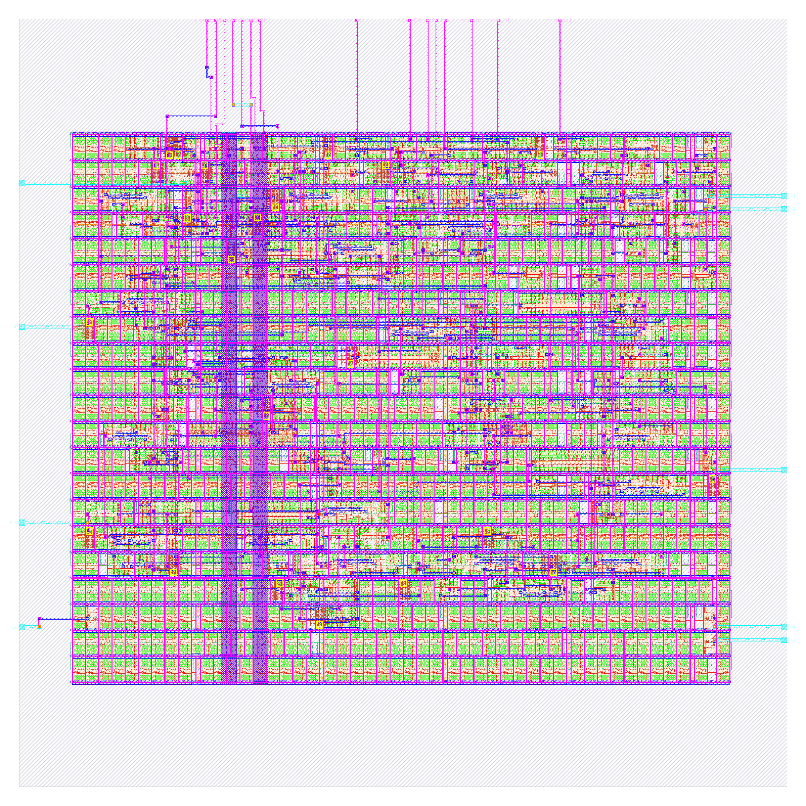

# audio_pitch: design notes

## What it is

`audio_pitch` is a streaming one-bit pitch detector. Samples (the sign of a waveform) arrive one per clock beat and never stop; after every sample the chip answers "do the last W = 8 samples look like a high tone?" (source: `README.md`).
A `[+1, -1]` kernel slid along time is, on one-bit data, an XOR of consecutive samples: 1 at every sign change. The changes in the window are counted and compared with a trained threshold of 4 (`model/audio_pitch/weights.json`, ROM in `rtl/audio_pitch_rom.v`).
Output beat per input beat (after warm-up): `m_data = {error, class, 3'b000, count[2:0]}` (`rtl/audio_pitch.v`), `class = count >= 4`.
It is AI, not a hand-written rule, because the threshold was fitted from generated labelled data by `model/audio_pitch/train.py`. The fit is honest about its limit: 171 of 200 training examples correct, 85.5 % (`weights.json`). See [../../docs/WHY_AI.md](../../docs/WHY_AI.md) section 6.
Simulation: `make simulate DESIGN=audio_pitch` printed `PASS audio_pitch_tb: 370 recordings x3 passes, 6078 result beats, 12173 checks`.
Hardening: `make flow-all` passed all 5 stages (simulate, gds, check, gate-level synthesised and routed, collect; `build/flow_audio_pitch.log`), total 59 s.

## Architecture



Registers (all in `rtl/audio_pitch.v`, synchronous active-high reset):

| Register | Width | Purpose |
|---|---|---|
| `prev` | 1 | previous sample of this recording |
| `line` | 7 | delay line of the last W-1 change bits; `line[0]` newest, `line[6]` oldest |
| `count` | 3 | sign changes in the window = sum of `line` (0..7) |
| `seen` | 3 | samples seen, saturates at 7 (warm-up counter) |
| `err_pend` | 1 | a bad sample (`s_data[7:1] != 0`) not yet reported |
| `m_valid_r`, `m_last_r`, `m_err_r` | 1 each | result register control and flags |
| `m_cnt_r` | 3 | result register: the count |

RTL flip-flop bits: 1+7+3+3+1+1+1+1+3 = 21. `metrics.json` (`design__instance__count__class:sequential_cell`) says 21 and `synth_stat.rpt` lists 21 `dfxtp_2`: they agree. The threshold ROM is a constant (`4'd4`), not flip-flops.
The update is incremental: `count_nxt = count + chg - line[6]` (change entering minus change leaving), so no 7-input adder is needed.

## Data flow

Example stream (16 samples, one per clock, `m_ready` always 1, `s_last` on the last): `0 0 0 0 1 1 1 0 1 0 1 1 0 1 0 0`. Values below come from `model/audio_pitch/golden.py` (`Pitch(8, 4).push`), cross-checked against the RTL update rules.
The first 7 samples are warm-up (`seen` counts 1..7, no output). From sample index 7 on, every sample produces one result beat, the cycle after the accepting edge. `line` is shown newest bit first (`line[0]` ... `line[6]`), after the edge.

| Edge | sample | chg | leaving (`line[6]` before) | line after | count after | seen after | Result beat (`m_data`) |
|---|---|---|---|---|---|---|---|
| 0 | 0 | 0 | 0 | 0000000 | 0 | 1 | none (warm-up) |
| 1 | 0 | 0 | 0 | 0000000 | 0 | 2 | none |
| 2 | 0 | 0 | 0 | 0000000 | 0 | 3 | none |
| 3 | 0 | 0 | 0 | 0000000 | 0 | 4 | none |
| 4 | 1 | 1 | 0 | 1000000 | 1 | 5 | none |
| 5 | 1 | 0 | 0 | 0100000 | 1 | 6 | none |
| 6 | 1 | 0 | 0 | 0010000 | 1 | 7 | none |
| 7 | 0 | 1 | 0 | 1001000 | 2 | 7 | 0x02 (low) |
| 8 | 1 | 1 | 0 | 1100100 | 3 | 7 | 0x03 (low) |
| 9 | 0 | 1 | 0 | 1110010 | 4 | 7 | 0x44 (HIGH) |
| 10 | 1 | 1 | 0 | 1111001 | 5 | 7 | 0x45 (HIGH) |
| 11 | 1 | 0 | 1 | 0111100 | 4 | 7 | 0x44 (HIGH) |
| 12 | 0 | 1 | 0 | 1011110 | 5 | 7 | 0x45 (HIGH) |
| 13 | 1 | 1 | 0 | 1101111 | 6 | 7 | 0x46 (HIGH) |
| 14 | 0 | 1 | 1 | 1110111 | 6 | 7 | 0x46 (HIGH) |
| 15 (`s_last`) | 0 | 0 | 1 | cleared | cleared | 0 | 0x45 (HIGH), `m_last`=1 |

Reading the table: edge 4 is the first sign change (the signal wakes up), so `count` starts to climb as changes enter. At edge 11 the oldest change (a 1 that entered at edge 4) leaves while a 0 enters: count falls 5 to 4. At edge 15 the count is 6 - 1 + 0 = 5, the result is sent with `m_last`, and the history is cleared so the next recording warms up again. 16 samples give 9 results (16 - 7).
Output values: `class` is bit 6, so 0x44 = class 1 with count 4.



## Verification

Testbench: `designs/audio_pitch/tb/audio_pitch_tb.v` (self-contained, no shared include; ports only so it runs
unchanged on the RTL and on both netlists), `+VEC=designs/audio_pitch/tb/vectors.hex`. The vector file is sent
three times (random gaps/stalls, full rate with `s_ready` never low, random gaps again). Checked on every
cycle and result beat: each result equals golden.py's, in order, none before its input beat was accepted, none
unexpected or missing; while `m_valid` is high and `m_ready` low, `m_valid`/`m_data`/`m_last` hold; with
`s_valid` low, garbage on `s_data`/`s_last` is ignored; reset in the middle of a recording (history cleared)
and with a result waiting. Comparisons use `!==` so X never passes; hard timeout of 400,000,000 ns; `$fatal(1,
"FAIL ...")` on the first failure.
Fresh `make simulate DESIGN=audio_pitch`: `PASS audio_pitch_tb: 370 recordings x3 passes, 6078 result beats,
12173 checks (values, order, stalls, full rate, garbage when idle, error flag, s_last, reset)`

Vectors: `designs/audio_pitch/tb/vectors.hex` is generated by `model/audio_pitch/gen_rom.py` from
`model/audio_pitch/weights.json` and `model/audio_pitch/golden.py`; every expected result beat comes from the
bit-exact golden model, never hand-written. It holds 370 recordings and 4564 input beats (2020 expected result
beats per pass; 6078 result beats compared over the three passes plus the reset tests): all 256 window
contents, a de Bruijn stream that makes every window occur in a continuing stream, tones and tone changes with
noise, short recordings, error samples and a reset-test recording (`designs/audio_pitch/README.md`).

Model-level: `model/audio_pitch/golden.py` has no `--check` entry point and the audio engines are not part of
`make check-generated` or `tests/run_tests.sh`; I found no recorded zero-mismatch run for them. The accuracy
of the trained rule is in the NOTES (fitted, not exact).

Gate-level: the same testbench file runs on the synthesised netlist (`make gl DESIGN=audio_pitch`:
synthesis-only run, netlist `build/gl/audio_pitch/runs/gl/final/nl/audio_pitch.nl.v`, 100 cells) and on the
routed post-PnR netlist (`make gl-final DESIGN=audio_pitch`:
`designs/audio_pitch/runs/RUN_2026-10-05_19-59-29/final/nl/audio_pitch.nl.v`, 868 cells), compiled by
`scripts/flow/gl_sim.sh` against the sky130_fd_sc_hd functional models with a unit gate delay of `#0.01`
(`GL_UNIT_DELAY`, default in gl_sim.sh; it must be above 0 to avoid flip-flop races and below the 1 ns sample
point). Results on disk: `build/flow/audio_pitch/stages.txt` lists `gl_synth PASS` and `gl_final PASS` (the `stage_gl_*.log` files hold only the command line); `build/gl/audio_pitch/sim/gl.log` ends with the testbench `PASS audio_pitch_tb: ...` line; `build/gl/audio_pitch/result.txt` reads `audio_pitch | final:audio_pitch.nl.v |
every case of tb/vectors.hex | PASS | 0 s`. `build/gl/audio_pitch/synth_checks.txt` reads
`synthesis__check_error__count = 0`.

Signoff checks that are verification (`scripts/flow/check_signoff.py audio_pitch`,
`build/flow/audio_pitch/stage_check.log`): no logic lost, RTL 21 registers, 21 surviving sequential cells, allowance 0 (this NOTES does not report a one-hot recoding for this design); Yosys driver warnings (multiple drivers / no driver) 0, synthesis check errors 0 (`synth_checks.txt`).

Negative tests: `tests/run_tests.sh`, section "negative" (PASS in `make test`): one expected value in a copy of `tb/vectors.hex` (the expected `m_data` bit 0 of the first result beat; the mutation is asserted to have applied) is flipped and the testbench must exit non-zero with no PASS line; it stops with `FATAL: designs/audio_pitch/tb/audio_pitch_tb.v:58: FAIL ...`. This shows the checker can fail on a wrong result value. No RTL mutation (for example a changed threshold) is tested for this design, so "the testbench catches a wrong threshold" is not demonstrated; the other checks that can fail inside the testbench are X, an unexpected result beat, a result changing while stalled, garbage on `s_data` while idle and wrong behaviour after reset.

## Layout (GDSII)



The picture (`output/layout.png`, KLayout render) shows the 80 x 80 um die (`design__die__bbox` = `0.0 0.0 80.0 80.0`, 6400 um^2) as the grey square and the core inside it (`design__core__bbox` = `5.52 10.88 74.06 68.0`, core area 3915 um^2, 21 rows of 149 sites in `floorplan.txt`).
Horizontal stripes are the standard-cell rows; the magenta grid is the power distribution; two wide purple vertical bands left of centre are vertical power straps. Cyan stubs on the left and right edges and magenta wires at the top are the I/O pins and their routes. The small yellow squares are antenna diodes.
Placement is sparse: stdcell area 1744.17 um^2 over 234 cells (`design__instance__area__stdcell`, `design__instance__count__stdcell`) is utilization 0.44551 of the core. Most of the picture is fill: 634 fill-class cells (523 `decap_3`, 56 `fill_1`, 55 `fill_2` in `cell_usage.rpt`) and 57 tap cells (`design__instance__count__class:fill_cell`, `...:tap_cell`), plus 22 antenna diodes.
Pins: `design__io` = 26 (24 signal pins plus `vccd1` and `vssd1`).

## From RTL to GDSII: what each step did

### Synthesis

Yosys mapped the RTL to 100 sky130_fd_sc_hd cells, 1101.056 um^2, of which 446.678 um^2 (40.57 %) is the 21 `dfxtp_2` flip-flops (`output/reports/synth_stat.rpt`). The rest is 654.4 um^2 of logic (my subtraction): `and2_2` 10, `nor2_2` 11, `a22o_2` 7, `nand2_2` 6, `o211a_2` 5, 3 `xor2_2` plus 2 `xnor2_2`, and 3 `conb_1` tie cells for the constant outputs. `synth_checks.rpt` shows no problems; `synthesis__check_error__count` = 0, `design__inferred_latch__count` = 0, `design__instance_unmapped__count` = 0, lint warnings 447 (`design__lint_warning__count`), errors none.
Report: [synth_stat.rpt](output/reports/synth_stat.rpt), [synth_checks.rpt](output/reports/synth_checks.rpt).

### Floorplan

Die fixed at 80 x 80 um by `config.json`; OpenROAD added 21 rows, core area 3915.005 um^2, 100 instances, effective utilization 0.281 before repair and fill (`floorplan.txt`).
Report: [floorplan.txt](output/reports/floorplan.txt).

### Placement

Global placement finished at iteration 358, routability-mode iteration count 75, final weighted congestion 0.8928 (`placement_global.txt`). Detailed placement: original HPWL 2101.7 u, legalized 2179.4 u (+4 %) (`placement_detailed.txt`). `design__instance__displacement__total` = 71.4 um. Timing repair added 47 buffers, 360.346 um^2 (`design__instance__count__class:timing_repair_buffer`, `design__instance__area__class:timing_repair_buffer`).
Reports: [placement_global.txt](output/reports/placement_global.txt), [placement_detailed.txt](output/reports/placement_detailed.txt).

### Clock tree

TritonCTS: 1 clock root, 5 buffers inserted, 21 sinks (`cts.rpt`). Worst setup-side skew 0.2521 ns (`clock__skew__worst_setup`). After CTS, 11 hold buffers were inserted (`design__instance__count__hold_buffer`).
Report: [cts.rpt](output/reports/cts.rpt).

### Routing

Global routing: 164 routed nets (`routing_global.txt`); `global_route__wirelength` = 4540 and `global_route__vias` = 982 in `metrics.json` (the `routing_global.txt` log itself prints 4450 um and 946 vias, taken before the later repair steps; the two differ and the reason was not checked). Detailed routing: DRC violations per iteration 51, 17, 8, 0 (`route__drc_errors__iter:0..3`), final `route__drc_errors` = 0; wire length 2737 um after iteration 0 and 2700 um at the end (`routing_detailed.txt`, `route__wirelength` = 2700), 983 vias (`route__vias`), longest net 116.76 um (`route__wirelength__max`).
Reports: [routing_global.txt](output/reports/routing_global.txt), [routing_detailed.txt](output/reports/routing_detailed.txt).

### Timing

Clock period 25 ns (`config.json`). All corners pass with TNS 0 (`timing_summary.rpt`, `metrics.json`).

| Corner | Worst setup slack (ns) | Worst hold slack (ns) |
|---|---|---|
| nom_tt_025C_1v80 | 14.0340 | 0.3258 |
| nom_ss_100C_1v60 | 13.3616 | 0.8807 |
| nom_ff_n40C_1v95 | 14.2854 | 0.1044 |
| Overall worst | 13.3539 (max_ss_100C_1v60) | 0.1032 (min_ff_n40C_1v95) |

Worst setup path (`timing_paths_max_ss.rpt`, slack 13.353942 ns): input port `m_ready` to output port `s_ready`, the combinational `s_ready = ~m_valid_r | m_ready` pass-through. The worst path ending at a flip-flop (`_160_` D pin) has slack 15.838755 ns.
Worst hold path (`timing_paths_min_ff.rpt`, slack 0.103218 ns): flip-flop `_150_` to `_151_`, two neighbouring stages with no logic between them, i.e. the delay line.
Reports: [timing_summary.rpt](output/reports/timing_summary.rpt), [timing_paths_max_ss.rpt](output/reports/timing_paths_max_ss.rpt), [timing_paths_min_ff.rpt](output/reports/timing_paths_min_ff.rpt).

### DRC

Magic `COUNT: 0` (`drc_magic.rpt`); KLayout: all 257 rule entries in `drc_klayout.json` are 0 (my sum); `manufacturability.rpt`: DRC Passed.
Reports: [drc_magic.rpt](output/reports/drc_magic.rpt), [drc_klayout.json](output/reports/drc_klayout.json), [manufacturability.rpt](output/reports/manufacturability.rpt).

### LVS

`lvs_netgen.rpt`: "Circuits match uniquely." with 173 devices and 173 nets each side; `manufacturability.rpt`: LVS Passed.
Report: [lvs_netgen.rpt](output/reports/lvs_netgen.rpt).

### Power / IR drop

Total power 1.1207e-04 W (`power__total`: internal 8.89e-05, switching 2.32e-05, leakage 4.2e-09 W). IR drop on vccd1: worst 8.09e-05 V, average 2.43e-05 V (`irdrop.rpt`); vssd1 worst 8.22e-05 V.
Report: [irdrop.rpt](output/reports/irdrop.rpt).

### Antenna, slew, capacitance

22 antenna diodes inserted (`design__instance__count__class:antenna_cell`); `antenna__violating__nets` = 0; `manufacturability.rpt`: Antenna Passed. Capacitance violations: 0 (`design__max_cap_violation__count`).
Slew: `design__max_slew_violation__count` = 18, all in the three ss corners (nom/min/max_ss_100C_1v60), 0 in tt and ff; fanout violations: 1 in every corner. Classification (run dir `57-openroad-stapostpnr/nom_ss_100C_1v60/checks.rpt`, `final/nl/audio_pitch.nl.v`): the 18 pins are 9 cell input pins plus the 9 antenna-diode pins attached to them, all at 0.889 ns against the 0.75 ns limit, and the driver `fanout22` (a `buf_1`, fanout 17 against a limit of 8, which is the one fanout violation) is a flow-inserted internal buffer, so none of the 18 is an input-port-limited case; all belong to the internal-driver (fixable in principle) class. Repair margin used: 40 % (`config.json` keys `PL_RESIZER_MAX_SLEW_MARGIN`, `GRT_DESIGN_REPAIR_MAX_SLEW_PCT`); no other margin was tried for this design (not verified). `check_signoff.py` prints these as notes and does not fail on them.
Report: [cell_usage.rpt](output/reports/cell_usage.rpt).

## Run time and memory

From `output/resources.json` (profile "tight": 2 CPUs, 8 GB): total wall time 47 s, container peak memory 670,220,288 bytes (0.624 GB), 78 steps. Whole `flow-all` 59 s (`build/flow_audio_pitch.log`).

| Step | Wall time (s) |
|---|---|
| 46-openroad-detailedrouting | 6.455 |
| 35-openroad-cts | 4.071 |
| 57-openroad-stapostpnr | 2.632 |

## Reproduce

```bash
make simulate DESIGN=audio_pitch    # RTL simulation, 370 recordings x3 passes
make flow-all DESIGN=audio_pitch    # simulate, gds, check, gate-level, collect
python3 model/audio_pitch/train.py  # re-fit the threshold -> weights.json
python3 model/audio_pitch/gen_rom.py   # regenerate ROM and tb/vectors.hex
```

`rtl/audio_pitch_rom.v` is generated from `model/audio_pitch/weights.json`. The testbench `tb/audio_pitch_tb.v` is ports-only, so it also runs on the synthesised and routed netlists.

## Comparison with audio_onset

| Metric | audio_pitch | audio_onset | Source |
|---|---|---|---|
| Std cells | 234 | 316 | `design__instance__count__stdcell` |
| Flip-flops | 21 | 25 | `design__instance__count__class:sequential_cell` |
| Stdcell area (um^2) | 1744.17 | 2793.93 | `design__instance__area__stdcell` |
| Utilization | 0.4455 | 0.7136 | `design__instance__utilization` |
| Routed wirelength (um) | 2700 | 4211 | `route__wirelength` |
| Worst setup slack (ns) | 13.354 | 13.206 | `timing__setup__ws` |
| Worst hold slack (ns) | 0.1032 | 0.1128 | `timing__hold__ws` |
| Total power (W) | 1.121e-04 | 8.066e-04 | `power__total` |
| Flow wall time (s) | 47 | 49 | `resources.json` |

## Intuitions and insights

1. **Streaming state is a delay line sized by the window, not a frame.** `vision_block` keeps a 9-bit `frame` and answers once per image. Here the memory is `prev` + `line` = 8 bits of history plus a 3-bit count, and it stays 21 flip-flops (`sequential_cell`) whether the stream lasts 16 samples (the trace above) or a year. WHY_AI section 6 counts the same thing: 11 state bits at W = 8, independent of stream length.

2. **The count is updated, not recomputed.** `count_nxt = count + chg - line[6]` is a 3-bit add and subtract per clock. Summing the 7-bit line each time would need a population-count tree. `golden.py` ships an independent `recount()` and `gen_rom.py` checks the running count against it, and `model/examples/audio.py` prints "running count equals recount ... True".

3. **Why W = 8 gives only 85.5 %.** `weights.json` lists high-tone counts seen [2, 3, 4, 5] and low-tone counts [0, 1, 2, 3]: the ranges overlap at 2 and 3, so no threshold can be perfect and 29 high-tone windows fall below 4 (`wrong_high_below_threshold`), with 0 low-tone errors. The trainer picked the threshold that sacrifices only the high side. It is a finding about the window, not a bug.

4. **A longer window costs flip-flops.** `model/examples/audio.py` gets 100 % at W = 16 (threshold 5) and W = 32 (threshold 7), with state bits 20 and 37 versus 11 at W = 8. At 21.27 um^2 per `dfxtp_2` (446.678 / 21 from `synth_stat.rpt`) the extra 9 state bits at W = 16 are roughly 191 um^2 of flip-flops alone (my arithmetic, not a flow result), and the delay line is the part that scales linearly.

5. **Bit width: 1-bit samples are cheap.** This design has 21 flip-flops and 234 cells; `audio_onset`, with the same style of window but 4-bit energies, has 25 flip-flops and 316 cells, and 2793.93 vs 1744.17 um^2 of stdcell area (table above). Its combinational synthesis area is 1548.99 um^2 versus 654.38 here (synth_stat, my subtraction), 2.4x. Storage grows 12 vs 8 history bits; arithmetic grows more, because a 3-bit unsigned counter becomes a 6-bit signed add tree.

6. **Throughput: one result per clock.** At the 25 ns clock (`config.json`) the engine accepts a sample every cycle (`s_ready` is 1 while `m_ready` is 1), 40 M results/s. Audio is far slower. As an assumption (not from the repo), a 16 kHz stream would use 0.04 % of that, so one unit could in principle be time-multiplexed over thousands of channels, if per-channel state (11 bits here) were swapped in and out. WHY_AI states this as a point about time-multiplexing, not a measurement.

7. **Where the area goes.** The 234 cells occupy 1744.17 um^2 of a 3915 um^2 core; the rest is 634 fill-class cells (523 decaps) and 57 taps, with `design__instance__area` equal to the core area. Within the stdcell area, timing-repair buffers take 360.35 um^2 (47 buffers), about 21 % of it, and the cell area grew from 1101.06 um^2 at synthesis to 1744.17 um^2 after the flow (clock buffers, hold buffers, diodes and repair; split beyond the buffers not checked).

8. **Timing headroom is huge, hold is the tight spot.** Worst setup slack is 13.354 ns of 25 ns, and the worst path is the pure `m_ready` to `s_ready` wire, not the counter. The tightest number is hold, 0.1032 ns at min_ff, on a flop-to-flop path through the delay line: shift registers have no logic to hide hold skew, and the flow had to add 11 hold buffers.

9. **Verification: windows overlap, so test every window in a stream.** Unlike `vision_block`'s 540 independent frames, a streaming engine's output depends on history, so `gen_rom.py` builds a de Bruijn sequence (`de_bruijn(2, W)`) that makes every one of the 256 window contents occur in a continuing stream, plus tones with noise, short recordings, error samples and resets (370 recordings, 4564 input beats, `README.md`). Three pacing passes (random gaps/stalls, full rate, random again) give 6078 result beats and 12173 checks.

10. **Negative checks: one corrupted vector, no RTL mutation.** The testbench fails on any X (`!==`), an unexpected result beat when none is due, a result that changes while stalled, garbage on `s_data` while idle, and wrong behaviour after reset. `tests/run_tests.sh` also corrupts one expected value in `tb/vectors.hex` and requires the testbench to fail (`FATAL: ...audio_pitch_tb.v:58: FAIL`). There is no RTL mutation test, so "the testbench catches a wrong threshold" is not demonstrated here.
