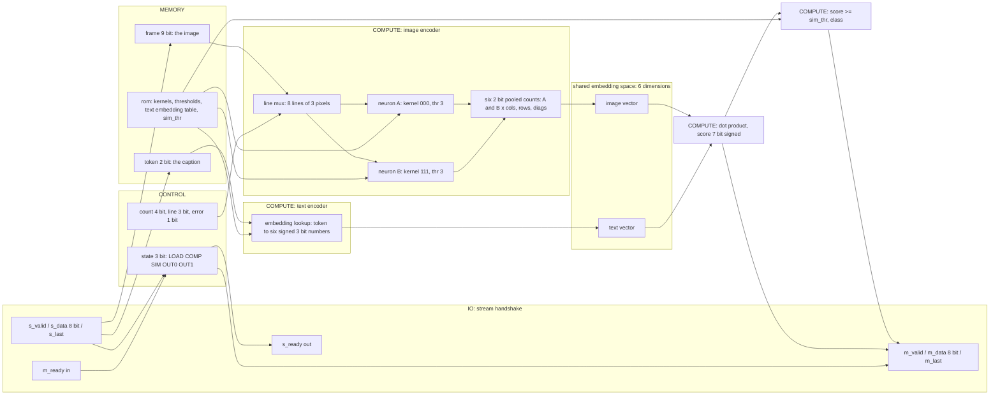
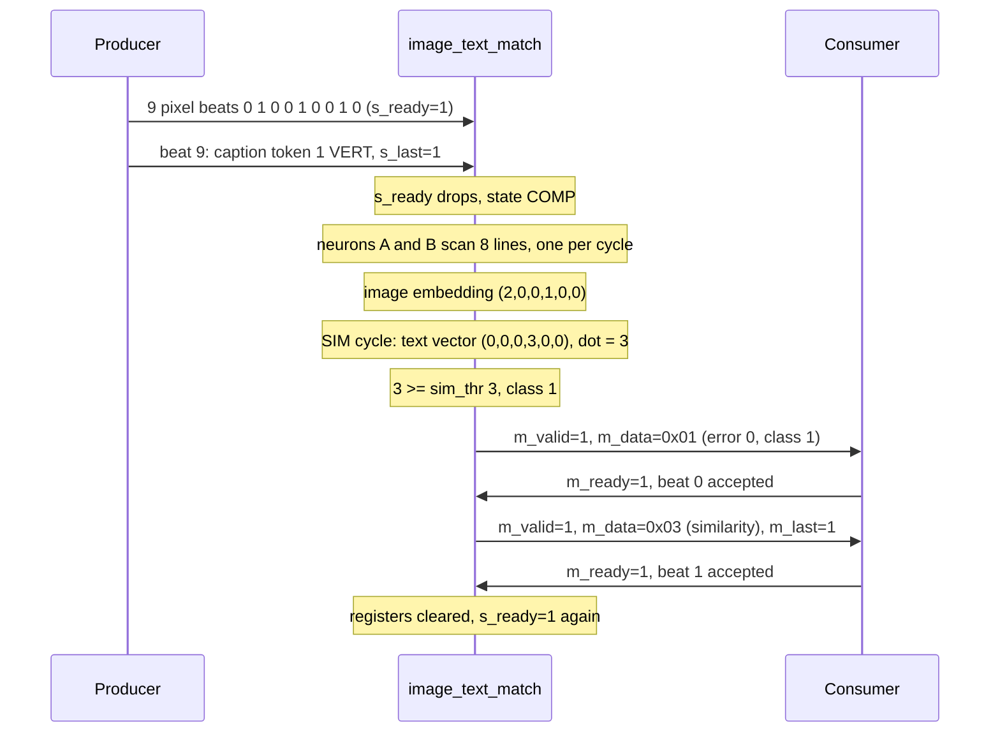
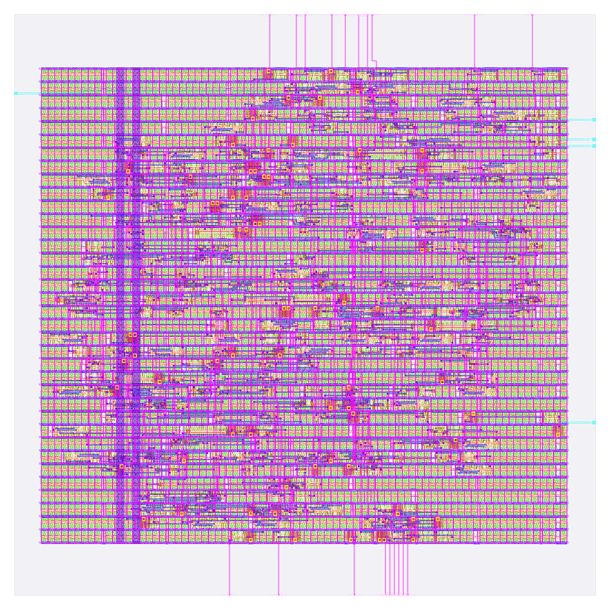

# image_text_match: design notes

Every number below comes from `output/` (metrics.json, resources.json, flow.log, reports/*), `config.json`, `rtl/`, `tb/`,
`model/image_text_match/` or `build/flow/image_text_match/stage_*.log`. Run: `runs/RUN_2026-10-05_20-23-15`
(`output/resources.json` `run_dir`). `make flow-all DESIGN=image_text_match` passed all 5 stages
(`build/flow/image_text_match/stages.txt`: simulate, gds, check, gl_synth, gl_final, collect all PASS).
`make simulate` and `golden.py --check` were re-run on 2026-10-06 while writing this file.

## What it is

`image_text_match` is a multimodal matcher, CLIP at its smallest. It reads a 3 x 3 one-bit image (9 beats, raster order) and one
caption token (beat 10: 0 EMPTY, 1 VERT, 2 HORIZ, 3 DIAG) and answers 1 when the caption describes the image (source: `README.md`,
`rtl/image_text_match.v` header). Two encoders put the two modalities into one 6-number space: an image encoder (two 3-tap neurons
applied to the 8 lines of the image, fires sum-pooled per line group) and a text encoder (a 4-row ROM table). The similarity is
a dot product; class = similarity >= threshold.
Output is two stream beats: beat 0 = `{6'b0, error, class}`, beat 1 = the similarity score (signed, sign-extended to 8 bits).
Latency is 10 clock edges after the last input beat (RTL header; `golden.py` prints `latency=10`).
It is AI, not a hand-written rule, because kernels, thresholds and the whole text table are learned by
`model/image_text_match/train.py` and stored in the generated `rtl/image_text_match_rom.v`; the RTL only says "scan two neurons over
lines, count, look up a text vector, dot, threshold". See [../../docs/WHY_AI.md](../../docs/WHY_AI.md).
Simulation: `make simulate DESIGN=image_text_match` printed `PASS image_text_match_tb: 2079 cases, 10408 checks`.

## Architecture



Registers (all in `rtl/image_text_match.v`, synchronous active-high reset, clocked by `clk`):

| Register | Width | Block | Purpose |
|---|---|---|---|
| `state` | 3 | CONTROL | FSM: LOAD=0 (s_ready high), COMP=1, SIM=2, OUT0=3, OUT1=4 (m_valid high in OUT0/OUT1) |
| `count` | 4 | CONTROL | beats received, saturates at 10; also the write index |
| `frame` | 9 | MEMORY | the image, bit i = pixel i |
| `token` | 2 | MEMORY | caption token |
| `line` | 3 | CONTROL | line being scanned, 0..7 |
| `a_col`, `a_row`, `a_dia` | 2 each (6) | COMPUTE | neuron A fire counts per line group |
| `b_col`, `b_row`, `b_dia` | 2 each (6) | COMPUTE | neuron B fire counts per line group |
| `score` | 7 | COMPUTE | similarity, signed, written in SIM |
| `error` | 1 | CONTROL | bad item or wrong frame length |

RTL flip-flop bits declared: 3+4+9+2+3+12+7+1 = 41 (matches the README's "41 flip-flops by inspection"). The ROM
(`kernel_a = 000`, `kernel_b = 111`, both thresholds 3, `sim_thr = 3`, four embedding rows) is constants, not flip-flops.
`metrics.json` `design__instance__count__class:sequential_cell` = 39, `synth_stat.rpt` shows 39 `dfxtp_2`, and
`build/flow/image_text_match/stage_check.log` reads "registers: RTL 39 (allowance 0), surviving sequential cells 39".
So the count is 2 below the declared 41 even though Yosys recoded the 5-state FSM to one-hot (`06-yosys-synthesis/yosys-synthesis.log`:
"mapping auto encoding to `one-hot` for this FSM", 5 states), which on its own would add 2 flops (3 binary to 5 one-hot).
Net, 4 declared register bits are not in the netlist, and the signoff register breakdown says which
(`python3 scripts/flow/check_signoff.py image_text_match --breakdown`): of the six 2-bit pooled counters only `a_row`, `b_col`,
`b_row` and `b_dia` survive; `a_col` and `a_dia` (2 x 2 = 4 bits) are gone. The learned text table explains it
(`model/image_text_match/weights.json`): every caption gives weight 0 to the "dark column" and "dark diagonal" channels, so those
two counters are never read and synthesis removes them. 41 + 2 (one-hot) - 4 = 39. The trained weights pruned the hardware.

## Data flow

Example (the README's worked example): a lit middle column, pixels `0 1 0 0 1 0 0 1 0`, caption VERT (token 1), no input gaps,
`m_ready` always 1. `python3 model/image_text_match/golden.py 0 1 0 0 1 0 0 1 0 1` gives `beat0=0x01 beat1=0x03 latency=10`:
class 1, similarity 3. Neuron A (kernel 000, thr 3) fires on a fully dark line, neuron B (kernel 111, thr 3) on a fully lit line;
tap i of a line is pixel i of that line (RTL `pix` mux).

The 8 line evaluations by the two reused neurons (match = pixels equal to the kernel weight, 0..3; derived by hand from the RTL rules):

| line | what | pixels | A match | A fire | B match | B fire | pooled after |
|---|---|---|---|---|---|---|---|
| 0 | column 0 | 0,0,0 | 3 | 1 | 0 | 0 | a_col=1 |
| 1 | column 1 | 1,1,1 | 0 | 0 | 3 | 1 | b_col=1 |
| 2 | column 2 | 0,0,0 | 3 | 1 | 0 | 0 | a_col=2 |
| 3 | row 0 | 0,1,0 | 2 | 0 | 1 | 0 | unchanged |
| 4 | row 1 | 0,1,0 | 2 | 0 | 1 | 0 | unchanged |
| 5 | row 2 | 0,1,0 | 2 | 0 | 1 | 0 | unchanged |
| 6 | diagonal 0,4,8 | 0,1,0 | 2 | 0 | 1 | 0 | unchanged |
| 7 | diagonal 2,4,6 | 0,1,0 | 2 | 0 | 1 | 0 | unchanged |

Image embedding (A cols, A rows, A diags, B cols, B rows, B diags) = (2, 0, 0, 1, 0, 0). Text embedding of VERT (from
`rtl/image_text_match_rom.v`) = (0, 0, 0, 3, 0, 0). Dot product = 2*0 + 0 + 0 + 1*3 + 0 + 0 = 3; 3 >= `sim_thr` 3, so class = 1.

Cycle by cycle (a row is the state after that clock edge; E1 to E8 load pixels 1 to 8, only E1, E4, E7 change `frame`):

| Edge | Input handshake | State | frame[8:0] | count | line | pooled (a_col,b_col) | score | Output |
|---|---|---|---|---|---|---|---|---|
| E0 | beat 0 pixel 0 | LOAD | 000000000 | 1 | 0 | 0,0 | 0 | s_ready=1 |
| E1-E8 (shown: E1, E4, E7) | beat 1 pixel 1 | LOAD | 000000010 | 2 | 0 | 0,0 | 0 | |
| E4 | beat 4 pixel 1 | LOAD | 000010010 | 5 | 0 | 0,0 | 0 | |
| E7 | beat 7 pixel 1 | LOAD | 010010010 | 8 | 0 | 0,0 | 0 | |
| E9 | beat 9 token 1, s_last | COMP | 010010010 | 10 | 0 | 0,0 | 0 | s_ready drops; token=01 |
| E10 | none | COMP | same | 10 | 1 | 1,0 | 0 | line 0 (col 0): A fires |
| E11 | none | COMP | same | 10 | 2 | 1,1 | 0 | line 1 (col 1): B fires |
| E12 | none | COMP | same | 10 | 3 | 2,1 | 0 | line 2 (col 2): A fires |
| E13-E16 | none | COMP | same | 10 | 4..7 | 2,1 | 0 | lines 3 to 6 (3 rows, main diagonal): nothing fires |
| E17 | none | SIM | same | 10 | 0 | 2,1 | 0 | line 7 (anti diagonal): nothing; state moves on |
| E18 | none | OUT0 | same | 10 | 0 | 2,1 | 3 | dot product registered; m_valid=1, m_data=0x01 |
| E19 | beat 0 accepted | OUT1 | same | 10 | 0 | 2,1 | 3 | m_data=0x03, m_last=1 |
| E20 | beat 1 accepted | LOAD | 000000000 | 0 | 0 | 0,0 | 0 | registers cleared, ready for the next frame |

(`line` wraps to 0 after line 7 because it is a 3-bit counter.) Latency 10 = edges E9 through E18 inclusive (1 accept + 8 lines + 1
similarity), matching `latency=10` from golden.py. One frame costs 21 clocks (E0 to E20). Values are derived by hand from the RTL and the
golden model, not read from a waveform; the final results (0x01, 0x03, latency 10) are what the testbench checks.



## Verification

Testbench: `designs/image_text_match/tb/image_text_match_tb.v` (a short wrapper that defines `DUT image_text_match`) includes
`tb/stream_tb_big.vh`, run with `+VEC=designs/image_text_match/tb/vectors.hex`. Per case it sends the frame with random gaps on `s_valid`,
takes the two result beats under random `m_ready` stalls and compares beat 0, beat 1, `m_last` and the latency with the golden values;
it also checks that outputs hold while stalled and that reset mid-frame or with a result waiting returns to an empty, ready state.
`tb/stream_tb_big.vh` is a copy of `shared/tb/stream_tb.vh` with one change: `MAXREC` raised from 1024 to 4096 (a `diff` against the
shared file shows only that value and a new header). The shared body stores at most 1,023 cases and this design has 2,079, so the shared
one would not fit. If the shared file later takes `MAXREC` >= 2100 the copy can be deleted (its own header says so).
Fresh `make simulate DESIGN=image_text_match` (2026-10-06): `PASS image_text_match_tb: 2079 cases, 10408 checks (results, latency, back-pressure, protocol errors, reset)`.

Vectors: `tb/vectors.hex` is generated by `model/image_text_match/gen_rom.py`: all 512 images x 4 captions = 2,048 pairs, plus
9 short frames, 2 long frames and 20 out-of-range items = 31 protocol cases, 2,079 in total (`README.md` Files table). Expected
beats and latency come from the bit-exact golden model. `python3 model/image_text_match/golden.py --check` printed
`golden: image_text_match 2048 cases, 0 mismatches`.

Gate-level (`scripts/flow/gl_sim.sh`, same testbench, unit gate delay): `make gl`: synthesised netlist `build/gl/image_text_match/runs/gl/final/nl/image_text_match.nl.v`, 253 cells; `make gl-final`: routed netlist
`designs/image_text_match/runs/RUN_2026-10-05_20-23-15/final/nl/image_text_match.nl.v`, 2489 cells (fill, tap and decap cells included). Both stages are PASS in `build/flow/image_text_match/stages.txt` and in `build/flow_image_text_match.log` (gl_synth 5 s, gl_final 1 s); the `stage_gl_*.log` files hold only the command line. The testbench is the same (2079 cases / 10408 checks, as in the RTL run above). `build/gl/image_text_match/result.txt` reads
`image_text_match | final:image_text_match.nl.v | every case of tb/vectors.hex | PASS | 1 s`.

Signoff check (`scripts/flow/check_signoff.py`, `stage_check.log`): "registers: RTL 39 (allowance 0), surviving sequential cells 39 ... => PASS".
It also prints, without failing, "max-slew violations: 61" and "max-cap violations: 0" (see the Antenna, slew, capacitance section).
Synthesis check errors: 0 (`synth_checks.rpt`, `synthesis__check_error__count`).

Negative tests: `tests/run_tests.sh`, section "negative" (PASS in `make test`), flips one expected value (word 13 of record 1 of a copy of `tb/vectors.hex`, mutation asserted to have applied) and requires the testbench to fail; it stops with `FATAL: ./designs/image_text_match/tb/stream_tb_big.vh:72: FAIL ...`. No RTL mutation test exists for this design.

## Layout (GDSII)



`output/layout.png` (rendered by KLayout) shows the 120 x 120 um die (`design__die__bbox` = `0.0 0.0 120.0 120.0`, die area 14400 um^2).
Inside is the core, `design__core__bbox` = `5.52 10.88 114.08 108.8`, core area 10630.2 um^2, with 36 standard-cell rows
(`design__rows`). Pins sit on the die edge: `floorplan.txt` reports 24 I/O pins, `design__io` is 26 (24 signals plus `vccd1` and `vssd1`).
Cells: 551 standard cells totalling 3856.2 um^2 (`design__instance__count__stdcell`, `design__instance__area__stdcell`), plus 1,938 fill
cells (6774 um^2) and 152 tap cells (`design__instance__count__class:fill_cell`, `...:tap_cell`); `cell_usage.rpt` shows 1,677 `decap_3`
among the fill, 72 `diode_2` antenna diodes, 46 `clkdlybuf4s25_1` and 16 `dlygate4sd3_1` timing-repair cells.
Core utilisation, `design__instance__utilization` = 0.362759 (about 36 %). About 36 % of the core (27 % of the die: 3856.2 of 14400 um^2, my division) is therefore standard cells and the rest
is fill and empty row space, which was the point of the larger die (see Intuitions).

## From RTL to GDSII: what each step did

### Synthesis

Yosys mapped the RTL to sky130_fd_sc_hd cells: 253 cells, area 2630.022 um^2 (`floorplan.txt` cell type report), of which 39 flip-flops
are 829.546 um^2 (31.5 %), 200 multi-input gates 1746.68 um^2, 13 inverters 48.80 um^2 and 1 buffer 5.00 um^2 (`output/reports/synth_stat.rpt`
agrees on 39 `dfxtp_2`). `synth_checks.rpt`: "Found and reported 0 problems"; `design__inferred_latch__count` = 0,
`design__instance_unmapped__count` = 0, `synthesis__check_error__count` = 0. Lint: 0 errors, 446 warnings (`design__lint_warning__count`).
Reports: [synth_stat.rpt](output/reports/synth_stat.rpt), [synth_checks.rpt](output/reports/synth_checks.rpt).

### Floorplan

The die is fixed at 120 x 120 um by `config.json` (`FP_SIZING` absolute); the core was snapped to `5.52 10.88 114.08 108.8`. OpenROAD
added 36 rows of 236 sites, core area 10630.195 um^2, instance area 2630.022 um^2, effective utilisation 0.247 with 253 instances (before
buffers, taps and repair). Report: [floorplan.txt](output/reports/floorplan.txt).

### Placement

Global placement ran with target density 0.365301, routability-driven; with taps the starting utilisation was 29.646 % (GPL-0019) over 477
instances (253 movable, 224 fixed) (`placement_global.txt`). Detailed placement mirrored 109 instances; HPWL 6661.2 u before,
6456.8 u after (-3.1 %) (`placement_detailed.txt`). Its cell report at that point lists 48 timing-repair buffers (480.46 um^2); the
final count after routing is 64 (`design__instance__count__class:timing_repair_buffer`).
Reports: [placement_global.txt](output/reports/placement_global.txt), [placement_detailed.txt](output/reports/placement_detailed.txt).

### Clock tree

TritonCTS built 1 clock root with 9 `clkbuf_16` buffers (plus 1 dummy `clkbuf_4`) driving 39 sinks, the 39 flip-flops (`cts.rpt`);
`metrics.json` counts 10 clock buffers (232.723 um^2). Worst clock skew overall: setup 0.2537 ns, hold -0.2534 ns
(`clock__skew__worst_setup`, `clock__skew__worst_hold`). Hold repair added 16 hold buffers (`design__instance__count__hold_buffer`),
0 setup buffers. Report: [cts.rpt](output/reports/cts.rpt).

### Routing

Global routing: 339 nets, wire length 12,903 um in `routing_global.txt` (`global_route__wirelength` = 13123, `global_route__vias` = 2359 in metrics),
total overflow 0, usage 12.87 % (met1 19.43 %, met2 20.27 %, met3 0.74 %, met4 0 %).
Detailed routing: DRC violations per iteration 74, 9, 9, 0 (`route__drc_errors__iter:0..3`), final `route__drc_errors` = 0. Final wire length
7832 um (`route__wirelength`), longest net 170.45 um (`route__wirelength__max`), 2350 vias, all single-cut. `route__net` = 339.
Reports: [routing_global.txt](output/reports/routing_global.txt), [routing_detailed.txt](output/reports/routing_detailed.txt).

### Timing

Clock period 25 ns (`config.json`); input and output delay 5 ns each (flow.log SDC lines). All nine corner/RC combinations pass: zero setup
and hold violations, TNS 0 (`timing_summary.rpt`).

| Corner | Worst setup slack (ns) | Worst hold slack (ns) |
|---|---|---|
| nom_tt_025C_1v80 | 17.1091 | 0.3246 |
| nom_ss_100C_1v60 | 13.4269 | 0.8693 |
| nom_ff_n40C_1v95 | 18.2984 | 0.1089 |
| Overall worst | 13.4214 (max_ss_100C_1v60) | 0.1072 (min_ff_n40C_1v95) |

Worst setup path (`timing_paths_max_ss.rpt`, slack 13.421398 ns): starts at input port `s_data[5]` (5 ns input delay), goes through an input
delay buffer (`clkdlybuf4s25_1`) and a chain of `or4`, `or3`, `or3`, `or4b`, `and3` and `a41o` gates (it starts with the "is the item out of range" `bad_item` OR-reduction; that the rest of the chain belongs to the same signal was not traced) and ends at flip-flop
`_430_`. Worst hold slack is 0.107225 ns (`timing_paths_min_ff.rpt`). Worst register-to-register setup slack is 15.4108 ns
(`timing__setup_r2r__ws`); it is `inf` at the tt and ff corners where no reg-to-reg setup path is reported.
Reports: [timing_summary.rpt](output/reports/timing_summary.rpt), [timing_paths_max_ss.rpt](output/reports/timing_paths_max_ss.rpt), [timing_paths_min_ff.rpt](output/reports/timing_paths_min_ff.rpt).

### DRC

DRC verifies the drawn shapes obey the foundry's spacing, width and enclosure rules. Magic: `COUNT: 0` (`drc_magic.rpt`,
`magic__drc_error__count` = 0). KLayout: all 257 rule entries in `drc_klayout.json` are 0 (sum 0; `klayout__drc_error__count` = 0).
`manufacturability.rpt`: DRC Passed. Reports: [drc_magic.rpt](output/reports/drc_magic.rpt), [drc_klayout.json](output/reports/drc_klayout.json), [manufacturability.rpt](output/reports/manufacturability.rpt).

### LVS

LVS extracts transistors and connections from the layout and checks they are the same circuit as the netlist. `lvs_netgen.rpt`: "Circuits match
uniquely." with 352 devices and 342 nets on both sides; all `design__lvs_*` counts are 0; `manufacturability.rpt`: LVS Passed.
Report: [lvs_netgen.rpt](output/reports/lvs_netgen.rpt).

### Power / IR drop

Total power 2.084e-04 W (`power__total` in `metrics.json`: internal 1.565e-04, switching 5.19e-05, leakage 1.05e-08 W). IR drop
(`irdrop.rpt`, nom_tt corner): vccd1 worst drop 2.32e-04 V (0.01 %), average 4.57e-05 V; vssd1 worst 2.42e-04 V (0.01 %), average 4.04e-05 V.
Power grid violations: 0 (`design__power_grid_violation__count`). Report: [irdrop.rpt](output/reports/irdrop.rpt).

### Antenna, slew, capacitance

Antenna (charge buildup on long wires during manufacturing): 0 violating nets and pins (`antenna__violating__nets`,
`route__antenna_violation__count`) after inserting 72 antenna diode cells (180.173 um^2). `manufacturability.rpt`: Antenna Passed.
Max capacitance violations: 0 at every corner. Two items that are not clean in `metrics.json`: `design__max_slew_violation__count` = 61
(all in the slow-slow corners: nom_ss 25, min_ss 18, max_ss 61; the tt and ff corners have 0) and `design__max_fanout_violation__count` = 6
at every corner (checked in the run dir `57-openroad-stapostpnr/max_ss_100C_1v60/checks.rpt`: fanout 17 on `clkbuf_0_clk/X`, `fanout29/X`, `fanout44/X`, `fanout46/X`, `fanout47/X` and 11 on `_205_/Y`, against the limit 8). `flow.log` lists the three ss corners under "Max Slew violations found" and then continues; the flow gate and
`check_signoff.py` print the slew count as a note and do not fail on it. `MAX_FANOUT_CONSTRAINT` is 8 (`config.json`). Classification of the 61 max_ss slew pins (same checks.rpt): every one sits on a net driven by a flow-inserted internal `fanout` buffer, none on a net driven directly by an input port. `fanout46` drives 18 pins at 0.883 ns, `fanout29` 18 at 0.767 ns, `fanout44` 18 at 0.755 ns and `fanout48` 7 at 0.775 ns, against the 0.75 ns limit (many of the pins are antenna-diode pins on those nets). The nom_ss corner has the 18 + 7 on `fanout46`/`fanout48`, min_ss the 18 on `fanout46`. So the slew count is internal-driver (fixable in principle), not environment-limited; no further repair was attempted (margin 20 %, see below). Whether these are acceptable depends on the target flow's rules. Flow warnings: 1, flow errors: 0.
Reports: [manufacturability.rpt](output/reports/manufacturability.rpt), [cell_usage.rpt](output/reports/cell_usage.rpt), [timing_summary.rpt](output/reports/timing_summary.rpt).

## Run time and memory

From `output/resources.json` (profile "tight": 2 CPUs, 8 GB limit, exit code 0): total wall time 56 s; container peak memory 760,360,960 bytes
(0.708 GB); peak per-step RSS 557,842,432 bytes; 78 steps. Stage wall times (`build/flow_image_text_match.log`): gds 58 s, gl_synth 5 s, gl_final 1 s, collect 5 s.
Slowest steps:

| Step | Wall time (s) |
|---|---|
| 46-openroad-detailedrouting | 9.594 |
| 35-openroad-cts | 4.190 |
| 67-klayout-drc | 3.460 |
| 70-magic-spiceextraction | 2.833 |
| 57-openroad-stapostpnr | 2.720 |

## Reproduce

```bash
python3 model/image_text_match/train.py        # fit, writes weights.json
python3 model/image_text_match/gen_rom.py      # ROM + vectors (writes only when content changes)
python3 model/image_text_match/golden.py --check
make simulate DESIGN=image_text_match          # RTL simulation, 2079 cases
make flow-all DESIGN=image_text_match          # simulate, gds, check, gate-level, collect
make collect DESIGN=image_text_match           # refresh output/ (metrics, reports, layout, LEF)
```

The same testbench runs on the RTL, the synthesised netlist and the routed netlist. `rtl/image_text_match_rom.v` is generated; do not edit it.

## Intuitions and insights

**Two modalities, one space.** A picture (nine pixels) and a word (a 2-bit token) have nothing in common, so no single rule compares them. The
design gives each its own encoder and makes both emit a vector in the same 6-dimensional space; the answer is only how well the vectors agree
(dot product, `rtl/image_text_match.v` header). That is the CLIP recipe, contrastive image-text matching, at 2,048 pairs. Neither
modality is classified alone: a text vector (0,0,0,3,0,0) means nothing until it meets an image vector, and the image vector (2,0,0,1,0,0)
means nothing until a caption selects which components to weigh.

**What the trainer discovered.** `train.py` searched exhaustively and reached 0 mismatches on all 2,048 pairs (README). It chose kernel
A = 000 and B = 111, both threshold 3: B is a "lit line" detector, A a "dark line" detector. The dark-line neuron was needed to express EMPTY:
with only lit-line features and non-negative counts, "no pixel lit" cannot be written, but "all three rows dark" gives A rows = 3, and
the EMPTY text vector (0,1,0,0,0,0) turns that into similarity 3. Parts of the structure stayed unused: A cols, A diags and the B weights
not listed are 0 in the table (README, `rtl/image_text_match_rom.v`). The hardware still pays for them; unused capacity of the structure
is real silicon.

**The table is a design choice, not the labels.** Nothing in the RTL says "a vertical line is a lit column". The ROM row for VERT puts weight
3 on B cols; the 3 exists because it makes similarity reach the threshold 3 on exactly the true cases. Change the labels, re-train, regenerate
the ROM and the same RTL describes different captions.

**Serial reuse: 2 neurons x 8 lines.** The image has 8 lines (3 columns, 3 rows, 2 diagonals). A parallel design would instantiate 16 neuron
copies; this one has 2 and walks the lines one per cycle (`line` counter, 8 COMP cycles). The weights stay constants shared by every line; what
grows is everything around the neurons: a 9-bit frame, a 3-bit line counter, a COMP state and six small pooled counters. The price is time:
8 compute cycles plus 1 similarity cycle, giving latency 10 against single-cycle for a fully parallel design (not built, so not measured).
Here the frame needs 21 clocks (E0 to E20 in the cycle table), 525 ns at the 25 ns constraint, about 1.9 million frames per second with
no stalls (derived, not measured).

**Where the area goes.** Of the 3856.2 um^2 of standard cells (`metrics.json`): 200 multi-input gates 1740.42 um^2 (45.1 %), 39 flip-flops
829.546 um^2 (21.5 %), 64 timing-repair buffers 629.354 um^2 (16.3 %), 10 clock buffers 232.723 um^2 (6.0 %), 152 tap cells 190.182 um^2
(4.9 %), 72 antenna diodes 180.173 um^2 (4.7 %), 13 inverters 48.797 um^2 and 1 buffer 5.005 um^2. The 24-pin interface and the handshake are
fixed overhead; the logic is the dot product (six 7-bit multiplies by 3-bit values, 6-term adder), the line mux, the text ROM and the
pooling counters. Repair buffers (16 % of cell area, 629.354 um^2) cost about three quarters of what the flip-flops do (829.546 um^2; my division, 0.76).

**The two physical failures and what they teach.** `config.json` records both. First, the die: copied from `vision_block` at 80 x 80 um
(6400 um^2), placement reached 82 % utilisation and the repair step ran out of memory; at 120 x 120 um (14400 um^2) utilisation is 0.3628.
Lesson: an engine with a larger netlist (551 standard cells here) cannot inherit its sibling's die;
utilisation is a first-class design parameter and a copied value hides the problem. Second, the repair margin: with
`PL_RESIZER_MAX_SLEW_MARGIN` and `GRT_DESIGN_REPAIR_MAX_SLEW_PCT` at 40 (copied) the post-placement repair ran out of the 8 GB container memory
twice, at 80 and at 120 um; setting both to 20 fixed it (`tiny_ai_core` showed the same pattern, per the config comment). A larger margin
asks the resizer to fix more nets, which costs memory, and a bigger die did not help. The final run peaked at 0.708 GB. The cost is visible
in the result: with the 20 % margin the ss corners still report 61 max-slew violations and 6 max-fanout violations remain (see Antenna,
slew, capacitance). Before-state memory numbers for the failed runs are not recorded in the repository; only the config comments describe them.

**Timing headroom.** Worst setup slack is +13.421 ns at a 25 ns clock (`timing_summary.rpt`), worst hold +0.107 ns. The critical path is not
the neurons or the dot product but the input range check: `s_data[5]` through an input delay buffer and `or4`, `or3`, `or3`, with a 5 ns
input delay (`timing_paths_max_ss.rpt`). The neurons and the dot product are registered and spread across 10 cycles, so they never set the
clock; worst register-to-register setup slack is 15.4108 ns. Speed is not the constraint at 40 MHz; the thin side is hold at the fast corner
(0.107 ns, 16 hold buffers).

**How this would scale.** More captions means a bigger embedding table: the text encoder is a ROM addressed by the token, so each new caption is
one more 18-bit row (6 x 3 bits) plus a wider `token` register, with the image encoder untouched. The table is the part that grows with
vocabulary, the way CLIP's text side does. Richer images mean more feature neurons and more lines: a larger frame register (9 bits per 3 x 3), more line
groups and pooled counters, and a wider embedding (here 6 numbers), so the dot product and the pooled-count bank grow with it, while serial reuse
keeps the neuron count flat at the price of more cycles per frame. The trainer's finding that some features stayed unused is the warning
sign: dimensions should be added where the search shows a need (as the A neuron was needed for EMPTY), not by default.

**Verification lessons.** All 512 images x 4 captions are tested plus 31 protocol cases (2,079 total, 10,408 checks), passing on the RTL, the
synthesised netlist (253 cells) and the routed netlist (2489 cells) (`stage_gl_*.log`). A hard limit in the shared testbench body (MAXREC 1024)
would have silently capped the suite; the copy with 4096 exists for that reason. The register count also needs care: 41 declared bits, 39 in
silicon, because two pooled counters have zero weight in every learned caption embedding and synthesis prunes them; this is why
the signoff check elaborates the RTL itself rather than trusting a hand count. Training decided part of the hardware: a zero
weight is a wire that does not need to exist.
