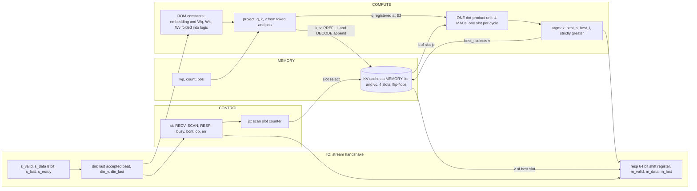
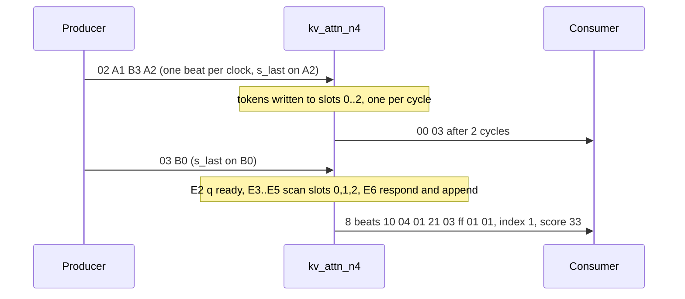
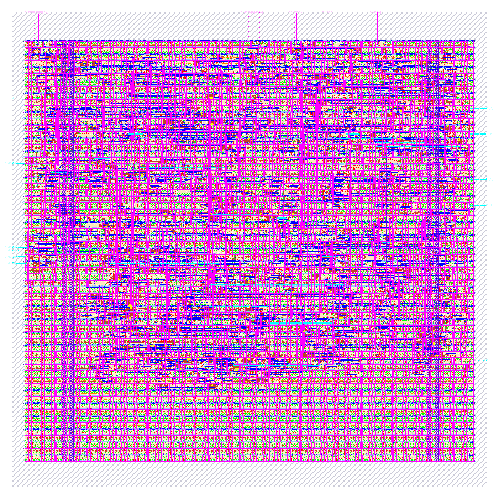

# kv_attn_n4: design notes

## What it is

`kv_attn_n4` is a one-head attention engine (model dimension 4) with a KV cache of 4 entries held in flip-flops, 8-bit K/V components, no ring (`designs/kv_attn_n4/README.md`, `model/kv_attention/spec.md` section 1). It runs the two phases of LLM inference in miniature: PREFILL streams prompt tokens into the cache at 1 cycle per token, DECODE scans the cache serially with ONE dot-product unit (4 MACs, one slot per cycle), keeps the best score with a signed strictly-greater compare, and returns that entry's value vector (hard attention) before appending the new token (`spec.md` sections 4 and 6; `shared/rtl/kv_attn_core.v` header).
The task is hand-picked, not trained: 16 tokens `t = 4*a + b` (key id a, value b); a DECODE token is a query "what value was last stored under key a?" and a same-key entry scores `32 + pos` while any other scores at most 31, so a key match always wins and the most recent match wins among matches (`spec.md` section 2). Golden task check: `python3 model/kv_attention/golden.py --check` ends `PASS golden: 69 checks` and reports 100.00 % recall for `kv_attn_n4` over 400 episodes, seed 7, with 0 false and 0 missed HIT.
Interface: the 24-pin stream engine (`clk, rst, s_valid, s_data[7:0], s_last, s_ready, m_valid, m_data[7:0], m_last, m_ready`; `designs/kv_attn_n4/rtl/kv_attn_n4.v`). Commands `01` RESET_CACHE, `02` PREFILL + tokens, `03` DECODE + token; responses are 2 beats `[status, count]` or 8 beats `[status, count, index, score, v0..v3]` (`spec.md` section 4). Latency after the last input beat: 2 cycles for everything but a successful DECODE, `n + 3` for a DECODE over n cached entries, so at most 6 for this N (`spec.md` section 6, table in `golden.py --check`: worst 6 cycles).
Simulation: `make simulate DESIGN=kv_attn_n4` printed `PASS kv_attn_n4_tb: 1245 records, 12882 checks (1239 commands: beats, m_last, latency, s_ready, back-pressure; 6 resets)` (`build/flow/kv_attn_n4/stage_simulate.log`).
Hardening: `make flow-all` passed all 5 stages (simulate, gds, check, gate-level, collect), total 96 s, of which the gds stage 82 s (`build/flow_kv_attn_n4.log`); `build/kv_batch.log` records `FINAL kv_attn_n4 EXIT=0 SECONDS=96`. Flow wall time of the stage-2 run is 82 s (`output/resources.json`).

## Architecture



Block map (the `MEMORY`, `COMPUTE`, `CONTROL`, `IO` comments in `shared/rtl/kv_attn_core.v`): the KV cache is the only large storage; the projections are three constant matrices (one non-zero entry per row, `spec.md` section 7) that synthesis folds into wires and adders, so there is no weight memory; scoring reuses a single dot-product unit for every slot, which is why decode time is linear in n.

Registers declared in `shared/rtl/kv_attn_core.v` for N = 4 (IW = 2 slot-index bits), my sum of the declarations:

| Register | Bits | Role |
|---|---|---|
| `kc` | 128 | 4 slots x 4 K components x 8 bit (MEMORY) |
| `vc` | 128 | 4 slots x 4 V components x 8 bit (MEMORY) |
| `wp` | 2 | next slot to write |
| `count` | 3 | valid entries 0..N |
| `pos` | 5 | tokens cached, saturating at 31 |
| `st` | 2 | FSM RECV / SCAN / RESP |
| `busy` | 1 | s_ready = ~busy |
| `din` | 8 | last accepted beat |
| `din_v, din_last` | 2 | beat is new / last of frame |
| `bcnt` | 2 | beats processed, saturates at 2 |
| `op` | 8 | opcode |
| `err` | 4 | first PREFILL error |
| `mv` | 1 | m_valid |
| `resp` | 64 | response beats, shifted right |
| `rrem` | 3 | beats remaining |
| `jc` | 3 | scan slot counter |
| `best_s` | 8 | argmax tracker, signed score |
| `best_i` | 2 | argmax tracker, slot |
| `q_r` | 32 | q of the DECODE token |

Declared bits: 406 (my sum of the table). Surviving flip-flops: 159 (`design__instance__count__class:sequential_cell` in `metrics.json`; `synth_stat.rpt` lists 159 `dfxtp_2`; `build/flow/kv_attn_n4/stage_check.log`: `registers: RTL 159 (allowance 0), surviving sequential cells 159`). The difference of 247 (my subtraction) is not state that was lost but constants and duplicates that synthesis never builds; the biggest part is the cache (section Intuitions, item 2): `core.kc` 28 and `core.vc` 8 flip-flops survive of 128 and 128 declared. `q_r` keeps 2 of 32 bits (q = (4 e0, 4 e1, 0, 1) has two varying bits, `spec.md` section 2). The per-register survivors from `python3 scripts/flow/check_signoff.py kv_attn_n4 --breakdown`:

| Surviving register | Flip-flops |
|---|---|
| `resp` | 56 |
| `kc` | 28 |
| `m_data` | 8 (the low byte of `resp`) |
| `din` | 8 |
| `vc` | 8 |
| `op` | 8 |
| `best_s` | 8 |
| `k_w` | 5 (5 bits: matches `pos`; the tool prints an internal name, my reading) |
| `err` | 3 |
| `unnamed` | 3 (IW+1 = 3 bits; I did not identify which register) |
| `count` | 3 |
| `rrem` | 3 |
| `jc` | 3 |
| `st` | 3 (one-hot recoded, 3 for 3 states) |
| `q_r` | 2 |
| `wp` | 2 |
| `bcnt` | 2 |
| `best_i` | 2 |
| `m_valid` | 1 |
| `busy` | 1 |
| `din_v` | 1 |
| `din_last` | 1 |
Total 159 (my sum), equal to the surviving count; `check_signoff.py` allowance 0, no `removed_registers` entry needed.

## Data flow

One concrete session on `kv_attn_n4`. `golden.py --trace` (default variant `kv_attn_n8`; the trace script in `golden.py` prefills 4 tokens, A1 B3 A2 C0, then decodes B0) prints the first three slots exactly as below; the 3-token PREFILL and the n = 3 DECODE here are my replay of the same golden `Engine.command` on `kv_attn_n4` (token names `A1` = `4*0+1` = 1, `B3` = 7, `A2` = 2, query `B0` = 4). The edge columns are my replay of the RTL control in `shared/rtl/kv_attn_core.v` and the schedule in `spec.md` section 6, not a waveform from a simulator.

PREFILL A1 B3 A2: golden response `00 03` (status 0, count 3), latency 2 cycles. Stored K / V and the position each was written at, from the golden model:

| Slot | Token | K (int8 x 4) | V (int8 x 4) | pos |
|---|---|---|---|---|
| 0 | A1 | [-4, -4, 0, 0] | [-1, -1, -1, 0] | 0 |
| 1 | B3 | [-4, 4, 0, 1] | [3, -1, 1, 1] | 1 |
| 2 | A2 | [-4, -4, 0, 2] | [1, -1, -1, 2] | 2 |

Cycle by cycle (edge 1 accepts the opcode beat; E1 = the edge accepting the `s_last` beat, E2 the next):

| Edge | Beat accepted | Processed this edge (one cycle after accept) | Cache / counters after | Phase after |
|---|---|---|---|---|
| 1 | `02` opcode | nothing | count 0, pos 0 | RECV |
| 2 | `01` token A1 | opcode registered, bcnt 1 | count 0 | RECV |
| 3 | `07` token B3 | A1 written to slot 0 at pos 0 | count 1, wp 1, pos 1 | RECV |
| 4 (E1) | `02` token A2, `s_last` | B3 written to slot 1 at pos 1; busy set | count 2, wp 2, pos 2 | RECV, s_ready low |
| 5 (E2) | none | A2 (last beat) written to slot 2 at pos 2; response `[00, 03]` loaded | count 3, wp 3, pos 3 | RESP, m_valid high after the edge |
| 6 | none | beat 0 `00` taken (m_ready high) | resp shifts | RESP |
| 7 | none | beat 1 `03` taken, m_last high | | RECV, s_ready high again |

Latency 2 = edges E1 to E2 inclusive; each token cost one cycle and did not depend on N = 4 (`spec.md` section 6: m tokens take `(m + 1) + 2` cycles from the first beat, here 6 to the response and 7 to the last beat).

DECODE B0 on the 3 cached entries: q = [-4, 4, 0, 1], scores over slots 0..2 = [0, 33, 2] (golden `info`, equal to the first three scores of the traced run `[0, 33, 2, ...]`). Best slot 1, response `10 04 01 21 03 ff 01 01`: status 0x10 (HIT, bit 4), count 4 (after the append), index 1, score 0x21 = 33, V = [3, -1, 1, 1], latency 6 cycles = n + 3 with n = 3 (`golden.Engine.command`).

| Edge | Beat accepted | Compute this edge | best_s, best_i after | Phase after |
|---|---|---|---|---|
| 1 | `03` opcode | nothing | none | RECV |
| 2 (E1) | `04` token B0, `s_last` | opcode registered; busy set | none | RECV, s_ready low |
| 3 (E2) | none | q computed from B0 and registered in `q_r`; `jc` = 0 | none | SCAN |
| 4 (E3) | none | slot 0: dot unit forms q . k = 0 (forced: jc = 0) | 0, 0 | SCAN |
| 5 (E4) | none | slot 1: dot unit forms q . k = 33, greater than best: replaces | 33, 1 | SCAN |
| 6 (E5) | none | slot 2: dot unit forms q . k = 2, not greater: keeps | 33, 1 | SCAN |
| 7 (E6 = E(n+3)) | none | `jc == count`: V of slot 1 read, response loaded; k, v of B0 appended to slot 3 at pos 3 | count 4, wp 0 (2-bit pointer wraps from 3 to 0), pos 4 | RESP, m_valid high after the edge |
| 8 to 15 | none | one response beat per edge: `10`, `04`, `01`, `21`, `03`, `ff`, `01`, `01`; `m_last` on the last | | RECV after the last |

The appended entry (slot 3) is K = [-4, 4, 0, 3], V = [-3, -1, 1, 3], pos 3, so a later query for key B finds B0 as the most recent match (`golden.py`).



## Verification

Testbench: `designs/kv_attn_n4/tb/kv_attn_n4_tb.v` defines `DUT kv_attn_n4`, `EXP_N 4`, `EXP_BITS 8`, `EXP_RING 0` and includes the shared body `shared/tb/kv_attn_tb.vh`, run with `+VEC=designs/kv_attn_n4/tb/vectors.hex`. It plays every record against one engine instance with random `s_valid` gaps and random `m_ready` stalls, and checks every output beat with `!==` (X never passes), `m_last` only on the last beat, the exact latency, `m_valid` low before the frame ends, `s_ready` low from the last input beat until the last response beat is taken, outputs held under back-pressure, and three kinds of reset (idle, mid-frame, response pending); the first failure calls `$fatal` (header comment of `kv_attn_tb.vh`).
Fresh `make simulate DESIGN=kv_attn_n4`: `PASS kv_attn_n4_tb: 1245 records, 12882 checks (1239 commands: beats, m_last, latency, s_ready, back-pressure; 6 resets)`.
Vectors: `designs/kv_attn_n4/tb/vectors.hex` is generated by `model/kv_attention/gen.py` from `golden.py` (header carries the sha256). Coverage listed in `spec.md` section 9: every opcode and bad opcodes, every (cached token, query token) pair, every fill level n = 0..4 (the `n + 3` latency), BAD_FRAME, BAD_TOKEN, CACHE_FULL (exact fill, +1, over-long frames), same-key chains, three kinds of reset, 60 random episodes with a fixed seed and a final reset. The record count in the PASS line above (1245) is what the generator wrote; I did not recount it.
Model level: `python3 model/kv_attention/golden.py --check` ends `PASS golden: 69 checks`; it includes the exhaustive score range (-32 .. 63 for int8 keys, so an int8 accumulator never saturates) and HIT (score >= 32) if and only if the key ids match.
Gate level: the same testbench runs on the synthesised netlist and on the routed netlist: `gl_sim: kv_attn_n4 PASS (1 s)` (`build/flow/kv_attn_n4/stage_gl_synth.log`) and `gl_sim: kv_attn_n4 PASS (1 s)` (`stage_gl_final.log`); `synthesis__check_error__count` = 0. This stage found a real bug in the shared core (Intuitions, item 7).
Signoff: `build/flow_kv_attn_n4.log` stage 3 reads `check : PASS ... DRC/LVS/XOR/antenna, slack at all corners, no logic lost`; `stage_check.log`: `registers: RTL 159 (allowance 0), surviving sequential cells 159`.
Negative tests: none for `kv_attn_n4`. `tests/run_tests.sh` has one kv_attn mutation test, for `kv_attn_n8` only; I found none for this design, so a wrong constant being caught here rests on the full vector coverage, not on a demonstrated mutation.
Not verified: behaviour with a different clock or with the Wishbone adapter on this variant. Only `kv_attn_n8` is integrated (adapter macro `designs/soc_kv_attn_n8`, Caravel wrapper `designs/user_project_wrapper_soc_kv`, PicoRV32 run `make soc-kv`, `firmware/README.md`); this variant is a standalone stream engine.

## Layout (GDSII)



The picture (`output/layout.png`, KLayout render) shows the 200 x 200 um die (`design__die__bbox` = `0.0 0.0 200.0 200.0`, `config.json`; 40000 um^2) with the core inside (`design__core__bbox` = `5.52 10.88 194.12 187.68`, 33344.5 um^2). Standard cells sit in rows, the power grid is on the upper metals and the 26 I/O (24 signals plus `vccd1`, `vssd1`; `design__io`) are on the edges.
Utilisation is 0.3811 (`design__instance__utilization`): 1679 std cells, 12708.4 um^2 (`design__instance__area__stdcell`). With the 5890 fill-class cells (20636.0 um^2, `design__instance__count__class:fill_cell`, `design__instance__area__class:fill_cell`) the instance area is 33344.5 um^2 (`design__instance__area`), equal to the core area, so the core is fully populated; fill, not logic, is most of it. Tap cells 469, antenna diodes 272.
Die choice: `config.json` `//DIE_AREA` says the 200 x 200 um die was an estimate before the first flow run (about 40 percent utilisation target); the hardened result is utilisation 0.381, so the estimate was generous (the estimated flip-flop count in that comment is also higher than the built 159; see Intuitions, item 2).

## From RTL to GDSII: what each step did

### Synthesis

Yosys mapped the RTL to 633 sky130_fd_sc_hd cells, 7956.38 um^2, of which 3381.993600 um^2 (42.51 %) is the 159 `dfxtp_2` flip-flops (`output/reports/synth_stat.rpt`). The mux cells are the next block: 125 `mux2_1` and 16 `mux4_2`, the cache write enables and the slot read muxes (same report). `synth_checks.rpt`: `synthesis__check_error__count` = 0; lint warnings 447, lint errors 0 (`metrics.json`).
Report: [synth_stat.rpt](output/reports/synth_stat.rpt), [synth_checks.rpt](output/reports/synth_checks.rpt).

### Floorplan

Die 200 x 200 um from `config.json` (`FP_SIZING` absolute, `DIE_AREA` [0, 0, 200, 200]); core 33344.5 um^2; the 633 synthesised cells (7956.38 um^2) give an effective utilisation of 0.239 before repair, CTS, taps and diodes (my division).
Report: [floorplan.txt](output/reports/floorplan.txt).

### Placement

Global placement: routability mode ran 69 iterations, final weighted congestion 0.8419, placed cell area 8969.6232 um^2, +0.00 % growth (`placement_global.txt`). Detailed placement: original HPWL 17377.0 u, legalised 17773.3 u (`placement_detailed.txt`); `design__instance__displacement__total` = 462.40 um. Timing repair left 255 buffers, 2433.6 um^2 (`design__instance__count__class:timing_repair_buffer`), of which 162 are hold buffers (`design__instance__count__hold_buffer`).
Reports: [placement_global.txt](output/reports/placement_global.txt), [placement_detailed.txt](output/reports/placement_detailed.txt).

### Clock tree

TritonCTS: 1 clock root, 49 buffers inserted, 159 sinks (equal to the flip-flop count) (`cts.rpt`). Worst setup-side skew 0.2555 ns, worst hold-side skew -0.2542 ns (`clock__skew__worst_setup`, `clock__skew__worst_hold`); 50 clock-buffer-class cells in the final design (`metrics.json`).
Report: [cts.rpt](output/reports/cts.rpt).

### Routing

Global routing: `global_route__wirelength` = 39612, `global_route__vias` = 7033 (`metrics.json`; `routing_global.txt`). Detailed routing: DRC violations per iteration 152, 58, 40, 0 (`route__drc_errors__iter:*`), final `route__drc_errors` = 0; wire length 23906 um, 6827 vias, longest net 383.4 um (`route__wirelength`, `route__vias`, `route__wirelength__max`).
Reports: [routing_global.txt](output/reports/routing_global.txt), [routing_detailed.txt](output/reports/routing_detailed.txt).

### Timing

Clock period 25 ns (`config.json`, 40 MHz). All corners pass, setup and hold TNS 0 (`timing_summary.rpt`; `timing__setup__wns` = 0, `timing__hold__wns` = 0).

| Corner | Worst setup slack (ns) | Worst hold slack (ns) |
|---|---|---|
| nom_tt_025C_1v80 | 14.6072 | 0.3236 |
| nom_ss_100C_1v60 | 9.6080 | 0.8640 |
| nom_ff_n40C_1v95 | 16.4349 | 0.1039 |
| Overall worst | 9.3494 (max_ss_100C_1v60) | 0.1029 (min_ff_n40C_1v95) |

Worst setup path (`timing_paths_max_ss.rpt`): starts at `rst` (input port clocked by clk), ends at flip-flop `_0942_`, slack 9.349373 ns. Worst hold path (`timing_paths_min_ff.rpt`): flip-flop `_1020_` to `_1012_`, slack 0.102903 ns.
Reports: [timing_summary.rpt](output/reports/timing_summary.rpt), [timing_paths_max_ss.rpt](output/reports/timing_paths_max_ss.rpt), [timing_paths_min_ff.rpt](output/reports/timing_paths_min_ff.rpt).

### DRC

Magic `COUNT: 0` (`drc_magic.rpt`; `magic__drc_error__count` = 0); KLayout: `klayout__drc_error__count` = 0 and the 257 top-level entries in `drc_klayout.json` sum to 0 (my sum); `manufacturability.rpt`: DRC Passed.
Reports: [drc_magic.rpt](output/reports/drc_magic.rpt), [drc_klayout.json](output/reports/drc_klayout.json), [manufacturability.rpt](output/reports/manufacturability.rpt).

### LVS

`lvs_netgen.rpt`: "Circuits match uniquely." with 987 devices and 953 nets each side; `design__lvs_error__count` = 0; `manufacturability.rpt`: LVS Passed.
Report: [lvs_netgen.rpt](output/reports/lvs_netgen.rpt).

### Power / IR drop

Total power 1.0095e-03 W (`power__total`: internal 7.7184e-04, switching 2.3767e-04, leakage 3.37e-08 W). `irdrop.rpt` (its own total 8.64e-04 W): vccd1 worst IR drop 2.55e-04 V, vssd1 2.01e-04 V.
Report: [irdrop.rpt](output/reports/irdrop.rpt).

### Antenna, slew, capacitance

272 antenna diodes inserted (`design__instance__count__class:antenna_cell`); `antenna__violating__nets` = 0, `route__antenna_violation__count` = 0; `manufacturability.rpt`: Antenna Passed. Max-cap violations 0, max-fanout violations 29, **max-slew violations 415** (`design__max_cap_violation__count`, `design__max_fanout_violation__count`, `design__max_slew_violation__count`).
The slew count in `timing_summary.rpt`: 415 overall, 18 at nom_tt, 363 at nom_ss, 0 at nom_ff, 415 at max_ss. It is reported, not failing: `check_signoff.py` prints it as a note (`stage_check.log`: `note: max-slew violations: 415`) and the flow reports PASS. The repair margin is 20 (`config.json`: `PL_RESIZER_MAX_SLEW_MARGIN` = 20, `GRT_DESIGN_REPAIR_MAX_SLEW_PCT` = 20); the `//SLEW` comment says 40 ran out of the 8 GB container memory twice. I did not trace the violating pins to their drivers, so I cannot say how many are environment-limited (input-port transition) and how many are internal; I did not chase them.
Report: [cell_usage.rpt](output/reports/cell_usage.rpt).

## Run time and memory

From `output/resources.json` (profile "tight": 2 CPUs, 8 GB): total wall time 82 s, container peak memory 703,705,088 bytes (0.655 GB), 78 steps. The whole `flow-all` took 96 s (`build/flow_kv_attn_n4.log`; gate-level stages: `gl_sim: kv_attn_n4 PASS (1 s)`, `gl_sim: kv_attn_n4 PASS (1 s)`).

| Step | Wall time (s) |
|---|---|
| 46-openroad-detailedrouting | 18.126 |
| 70-magic-spiceextraction | 7.641 |
| 67-klayout-drc | 6.678 |

## Reproduce

```bash
python3 model/kv_attention/golden.py --check   # self-checks, task metrics, cache sizes
python3 model/kv_attention/golden.py --trace   # per-step cache contents (default variant kv_attn_n8)
python3 model/kv_attention/gen.py              # rtl/*_rom.v and tb/vectors.hex (generated, never edit)
make simulate DESIGN=kv_attn_n4               # RTL simulation
make flow-all DESIGN=kv_attn_n4               # simulate, gds, check, gate-level, collect
python3 scripts/flow/check_signoff.py kv_attn_n4 --breakdown   # per-register flip-flop survivors
```

`designs/kv_attn_n4/rtl/kv_attn_n4_rom.v` is generated; never edit it.

## Comparison of the three non-ring int8 variants

| Metric | kv_attn_n4 | kv_attn_n8 | kv_attn_n16 | Source |
|---|---|---|---|---|
| Cache entries N | 4 | 8 | 16 | `config.json`, `spec.md` section 1 |
| Nominal cache bits N x 2 x 4 x 8 | 256 | 512 | 1024 | `spec.md` section 1 |
| Cache flip-flops built (kc + vc) | 36 | 72 | 144 | `check_signoff.py --breakdown` |
| All flip-flops | 159 | 200 | 277 | `design__instance__count__class:sequential_cell` |
| Synthesised cells | 633 | 773 | 1041 | `synth_stat.rpt` |
| Std cells | 1679 | 2566 | 4169 | `design__instance__count__stdcell` |
| Std-cell area (um^2) | 12708.4 | 16412.0 | 23406.2 | `design__instance__area__stdcell` |
| Die (um) | 200 x 200 | 260 x 260 | 340 x 340 | `config.json` |
| Utilisation | 0.381 | 0.279 | 0.224 | `design__instance__utilization` |
| Worst decode latency (cycles) | 6 | 10 | 18 | `spec.md` section 6 (n + 3, n = N-1) |
| Worst setup slack (ns) | 9.3494 | 10.7398 | 8.7658 | `timing_summary.rpt` |
| Worst hold slack (ns) | 0.1029 | 0.1052 | 0.0956 | `timing_summary.rpt` |
| Total power (W) | 1.0095e-03 | 1.1361e-03 | 1.2816e-03 | `power__total` |
| Routed wirelength (um) | 23906 | 34465 | 55238 | `route__wirelength` |
| Max-slew violations | 415 | 551 | 1190 | `design__max_slew_violation__count` |
| Flow wall time, stage 2 (s) | 82 | 105 | 142 | `output/resources.json` |

## Intuitions and insights

1. **Prefill is streaming, decode is serial.** Prefill costs 1 cycle per prompt token regardless of how many entries are cached; a DECODE over n entries costs n + 3 cycles because ONE dot-product unit scores one slot per cycle (`spec.md` section 6; the schedule table and replay above). For this design that is 2 cycles for any PREFILL and at most 6 for a DECODE, so the decode is up to 3 times the 2-cycle PREFILL latency (my division), and a response of T generated tokens after an N-token prompt does work of order T x N (`spec.md` section 10). The firmware measurement on `kv_attn_n8` in the PicoRV32 SoC (`firmware/README.md`, section "KV-cache attention: prefill vs decode") shows the same contrast one level up: prefill cost per token falls from 328.0 cycles at P = 1 to 90.6 at P = 7 (one frame pays the setup once; each added token adds 51 bus cycles), while every decode is its own frame at a flat 670 round-trip cycles, 502 of them (about three quarters) spent reading the 8-beat answer; the engine's own n + 3 growth (7 to 14 cycles above the baseline for n = 0..7) is hidden behind the bus. That is the tiny version of prefill being compute-bound and decode latency- or bandwidth-bound (`docs/LLM_INFERENCE.md`). Those firmware numbers are for `kv_attn_n8` only; I did not run firmware on `kv_attn_n4`.
2. **The cache is nominally 256 bits but only 36 flip-flops were built.** `spec.md` section 1 gives N x 2 x 4 x 8 = 256 bits, and the `config.json` `//DIE_AREA` comment estimated about 410 flip-flops in total. `metrics.json` reports 159 sequential cells, and `check_signoff.py --breakdown` attributes 28 to `kc` and 8 to `vc`: 7 + 2 = 9 flip-flops per slot instead of 64 (my division). The reason is that the weights are fixed constants, so most stored fields carry little information (value sets from `golden.project` with `store_k` / `store_v` over all 16 tokens and positions 0..31, my enumeration):

| Field | Values it can ever hold | Information built as flip-flops |
|---|---|---|
| K0 = 4 e0 | -4, +4 | 1 bit (bit 2 is always 1, bits 1..0 always 0, bits 7..3 repeat the sign) |
| K1 = 4 e1 | -4, +4 | 1 bit (same reasoning) |
| K2 (column 3 of Wk is zero) | 0 | none, a constant 0 |
| K3 = pos | 0..31 (32 values) | 5 bits (bits 7..5 always 0) |
| V0 = e2 | -3, -1, +1, +3 | 2 bits |
| V1 = e0, V2 = e1 | -1, +1 | none new: identical to K0 / K1, so the flops are merged |
| V3 = pos | 0..31 (32 values) | none new: identical to K3, merged |

   Sum per slot: 1 + 1 + 0 + 5 = 7 for K and 2 for V, equal to the 7 and 2 the breakdown shows. This is the same mechanism that `designs/kv_attn_n8_int4/README.md` ("Why 24 registers are pruned") analyses for the int4 variant, where the sign copies of K0, K1 and V0 are the pruned bits; in the 8-bit variants `-noabc` already merges the sign copies, so the allowance there is 0 (`stage_check.log`: `registers: RTL 159 (allowance 0), surviving sequential cells 159`). That README states that these variants report equal counts with and without abc (159 / 200 / 198 / 277 for n4 / n8 / n8_ring / n16), which agrees with `stage_check.log` (checked). Consequence: the cache is 36 of 159 flip-flops (22.6 %, my division) here, and the control state (123 flip-flops, my subtraction) is almost constant across the family (123, 128, 133 for n4, n8, n16): it only gains the index registers `wp`, `best_i`, `count`, `jc` and one more IW+1-bit register. Not pruned although it could be: a sound ROM-aware design could save the remaining dead bits only by an RTL change, which this note does not make.
3. **How area and cells scale with N while decode scales with n.** Std cells 1679 / 2566 / 4169 for N = 4 / 8 / 16 (`design__instance__count__stdcell`) and synthesised cells 633 / 773 / 1041 (`synth_stat.rpt`); std-cell area 12708.4 / 16412.0 / 23406.2 um^2. Doubling N from 4 to 8 adds 887 std cells (221.8 per added slot) and from 8 to 16 adds 1603 (200.4 per added slot, my divisions), so cost per slot is roughly linear: 9 flip-flops of about 21.3 um^2 each (`synth_stat.rpt`: 4254.080000 um^2 / 200 for n8, my division) plus a write-enable mux per stored bit and a share of the N-to-1 read mux (`mux2_1` 125 / 183 / 246, `mux4_2` 16 / 26 / 62). Flip-flops are a steady 42.5 % of synthesised area (42.51 / 42.39 / 42.48 %, `synth_stat.rpt`). The dies were set by hand in `config.json` (and not resized after the first run): 200^2 / 260^2 / 340^2 um (`config.json`) at utilisation 0.381 / 0.279 / 0.224. Meanwhile decode latency is n + 3: worst case 6 / 10 / 18 cycles (`spec.md` section 6), which is 150 / 250 / 450 ns of engine time at the 25 ns clock (my multiplication, engine cycles only). So memory (cells) and time (cycles) both grow about linearly in N, but the time penalty is paid on every decoded token.
4. **Where the area goes.** 1679 std cells = 633 synthesised + 255 timing-repair buffers + 50 clock buffers + 272 diodes + 469 taps (my sum = 1679; `metrics.json` classes and `synth_stat.rpt`). The 162 hold buffers are included in the repair-buffer count, not added again (my reading of the class counts). The fill (5890 cells, 20636.0 um^2) is larger than the logic itself (12708.4 um^2), which is a property of the absolute die size set in `config.json`, not of the design.
5. **Timing headroom.** Worst setup slack 9.3494 ns of 25 ns at max_ss and worst hold slack 0.1029 ns at min_ff (`timing_summary.rpt`); the worst setup path starts at `rst` (input port clocked by clk), i.e. the synchronous reset fan-out to every cleared register, not the dot product (`timing_paths_max_ss.rpt`). The 4-MAC dot product and the compare close in one cycle with that margin, so the schedule needs no pipelining; the period is generous because the design is control-dominated and the multiplies fold to wires and shifts (`kv_attn_core.v` COMPUTE comment). Hold is what limits: slack near 0.1 ns after 162 hold buffers.
6. **Physical lessons from the family.** `config.json` `//SLEW` records that a slew margin of 40 (copied from `vision_block`) ran the post-placement repair out of the 8 GB container twice, and 20 is used; the peak memory of the successful runs is 0.655 / 0.848 / 0.865 GB (`resources.json`). The `//DIE_AREA` comments say each die was sized by estimate before the first run and 'resize after the first flow run'; the dies stayed as estimated (200 / 260 / 340 um), utilisation ended at 0.381 / 0.279 / 0.224, so there is slack to shrink them; I did not try, and no failed physical attempt for these three is recorded in the files I read.
7. **The `jc` reset bug: a verification lesson.** `shared/rtl/kv_attn_core.v` carries a comment on the reset of the scan counter `jc`: `jc <= {(IW+1){1'b0}}; // not X after power-up: gate-level X-pessimism otherwise keeps stray bits unknown`. Per the hand-off for this task (not recorded in any other repo file I found, so not verified here), the fault was an uninitialised scan counter that only the gate-level simulation at N = 16 exposed, as X-pessimism on the one extra counter bit (N = 16 has the widest counter, IW + 1 = 5 bits, `kv_attn_core.v`). The fix is one line: `jc` is cleared in the reset branch. I did not reproduce the failure, so the exact failing record is not stated here. The lesson: RTL simulation (which passed) and the signoff register-count check cannot see an unreset register whose unknown value only matters through gate-level X propagation; the gate-level run of the same testbench (`gl_sim: kv_attn_n4 PASS (1 s)`) can, and a cheap reset is better than relying on a register being written before it is read. The core is shared, so all five KV engines (`kv_attn_n4`, `kv_attn_n8`, `kv_attn_n16`, `kv_attn_n8_int4`, `kv_attn_n8_ring`) were re-hardened with the fixed version (`build/state_snapshot.md`).
8. **Slew counts, honestly.** Max-slew violations are 415 / 551 / 1190 for n4 / n8 / n16 (`design__max_slew_violation__count`), i.e. 24.7 / 21.5 / 28.5 per 100 std cells (my division), with max-fanout violations 29 / 64 / 147 and max-cap 0 / 1 / 3. They are reported, not failing: `check_signoff.py` prints them as notes, the flow passes all 5 stages, DRC, LVS, antenna and all-corner slack are clean. The count appears in the ss corners of `timing_summary.rpt` (for example 415 at max_ss for this design). The repair margin was kept at 20 (`config.json`); I did not chase a lower count or classify the pins, and a lower count would not make the chip better by itself.
9. **What the testbench catches and what it does not.** 1245 records, 12882 checks, with exact latency and `s_ready` checked per record, so any off-by-one in the n + 3 schedule fails. It does not demonstrate that a wrong ROM constant is caught for this design (only `kv_attn_n8` has a mutation test in `tests/run_tests.sh`), and it does not run on the PicoRV32 adapter for this variant.
10. **Takeaway against the siblings.** The three non-ring int8 engines differ only in `N`; the table above shows 1679 / 2566 / 4169 std cells and 82 / 105 / 142 s of flow time. For comparison, the stream engine `prec_int8` is 642 std cells and 35 flip-flops (`designs/prec_int8/NOTES.md`): the KV engines are 2.6x to 6.5x larger in std cells (2.6x, 4.0x, 6.5x, my divisions) because memory, not arithmetic, dominates, and N sets the price of context in both area and time per token.
