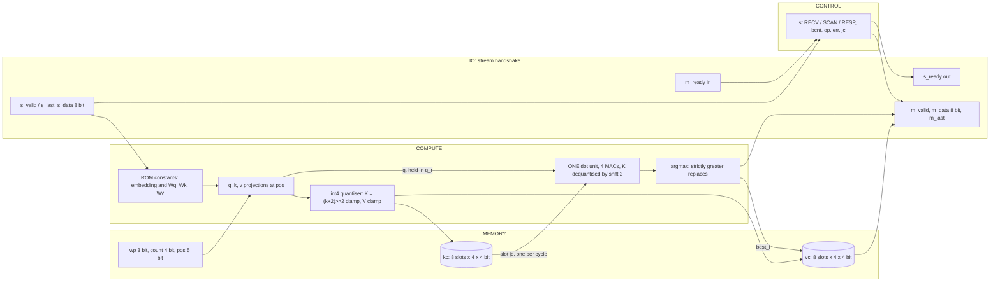

# kv_attn_n8_int4: design notes

## What it is

`kv_attn_n8_int4` is a one-head attention engine (model dimension 4) whose KV cache holds 8 entries of 4-bit components instead of 8-bit ones: nominal cache bits N x 2 x d x bits = 8 x 2 x 4 x 4 = 256 against 512 for `kv_attn_n8` (`model/kv_attention/golden.py --check`, "Cache size" table).
It speaks the 24-pin valid/ready stream protocol: PREFILL streams prompt tokens into the cache (1 cycle per token), DECODE scans the cache serially with one dot-product unit (n + 3 cycles for n cached entries, `spec.md` section 6) and returns the best-matching entry's value vector (hard attention), then appends the new token (source: `designs/kv_attn_n8_int4/README.md`, `model/kv_attention/spec.md` sections 2, 4, 6).
Task: 16 tokens `t = 4a + b` (key `a`, value `b`); a DECODE token is a query "which value was last stored under key a?", and the engine must prefer a key match and, among matches, the newest entry (`spec.md` section 2).
The int4 rule (`spec.md` section 3): K is stored as `clamp((k + 2) >> 2, -8, 7)` and dequantised with `<< 2` in the dot unit; V is saturated to -8..7; the position `pos` (component 3) therefore collapses four neighbouring positions into one bucket.
Simulation: `make simulate DESIGN=kv_attn_n8_int4` printed `PASS kv_attn_n8_int4_tb: 1521 records, 16074 checks (1515 commands: beats, m_last, latency, s_ready, back-pressure; 6 resets)`.
Hardening: `make flow-all` passed all 5 stages (simulate, gds, check, gate-level, collect) in 107 s total (`build/kv_batch.log` FINAL line, `build/flow_kv_attn_n8_int4.log`); the stage-2 flow wall time is 93 s and the peak container memory 0.722 GB (`output/resources.json`).
Task accuracy: 81.65 % right recalls against the unbounded oracle, against 100.00 % for int8, on the same 400 episodes (`python3 model/kv_attention/golden.py --check`, re-run for this note).

The surprise, up front: the 4-bit cache is not smaller in silicon here. Synthesis gave 846 cells and 10770.33 um^2 against 773 cells and 10034.62 um^2 for `kv_attn_n8` (`synth_stat.rpt` of each design, "Chip area for module"), and 222 flip-flops against 200 (`metrics.json`, `design__instance__count__class:sequential_cell`). The "Intuitions and insights" section explains why.

## Architecture

The design is a thin top (`rtl/kv_attn_n8_int4.v`) around the shared engine `shared/rtl/kv_attn_core.v` instantiated as `kv_attn_core #(.N(8), .KVB(4), .RING(0))`, plus a generated constant ROM (`rtl/kv_attn_n8_int4_rom.v`, never edited by hand; the five variants hold identical constants, `spec.md` section 1).



Registers of the elaborated core (`python3 scripts/flow/check_signoff.py kv_attn_n8_int4 --breakdown`; the registers are declared in `shared/rtl/kv_attn_core.v`):

| Register | Bits (elaborated) | Purpose |
|---|---|---|
| `kc` | 64 | key cache, 8 slots; 8 bits per slot after the front-end merges identical expressions |
| `vc` | 56 | value cache, 7 bits per slot (my inference: the int4 clamp keeps the sign-like bits as separate expressions, so the front end cannot merge them) |
| `resp` | 56 | response shift register, beat 0 in the low byte |
| `m_data`, `din`, `op` | 8 each | output beat view, last accepted input beat, opcode |
| `best_s` | 6 | argmax score (the int8 variant has 8; the int4 score range is -32..60, `golden.py --check`) |
| `k_w` | 5 | name given by the tool; probably the 5-bit `pos` counter (my guess) |
| unnamed, `count`, `jc` | 4 each | an unnamed register group, valid entries 0..8, scan slot counter |
| `err`, `wp`, `rrem`, `best_i`, `st` | 3 each | prefill first error, write pointer, response beats remaining, best slot, FSM (one-hot) |
| `q_r`, `bcnt` | 2 each | `q_r` (registered q of the DECODE token; only 2 of its 32 bits survive elaboration, I did not check why), beat counter |
| `m_valid`, `busy`, `din_v`, `din_last` | 1 each | handshake and frame flags |

The tool's sum is 246 elaborated register bits (my sum of the table: 64+56+56+8+8+8+6+5+4+4+4+3+3+3+3+3+2+2+1+1+1+1 = 246). After synthesis 222 survive; the 24 that vanish are exact duplicates, covered in the Synthesis step and the signoff allowance.

Per-slot organisation: components of K and V are 4 bits each, four components per entry (k0, k1 key bits, k2 always 0, k3 the position bucket; v0 value level, v1, v2 key bits, v3 position), so one cache slot is 2 x 4 x 4 = 32 nominal bits (`spec.md` section 2 and the README table "What each stored int4 component can ever hold").

## Data flow

The golden model is bit- and cycle-exact; `python3 model/kv_attention/golden.py --trace kv_attn_n8_int4` prints cache contents per command, and `--check` self-verifies.
The standard trace first PREFILLs `A1 B3 A2 C0` and then decodes `B0`: its slot dump shows the quantised stored values directly (K = (k+2)>>2, so the key bits are +-1 instead of +-4, V keeps scale 1):

```
slot 0  K=[-1,-1,0,0]  V=[-1,-1,-1,0]   pos=0    (A1: e0=-1, e1=-1, value level -1)
slot 1  K=[-1, 1,0,0]  V=[ 3,-1, 1,1]   pos=1    (B3)
slot 2  K=[-1,-1,0,1]  V=[ 1,-1,-1,2]   pos=2    (A2)
slot 3  K=[ 1,-1,0,1]  V=[-3, 1,-1,3]   pos=3    (C0)
DECODE B0 -> response 10 05 01 20 03 ff 01 01  latency 7 cycles   (score 32, slot 1, V=[3,-1,1,1])
```
(`golden.py --trace kv_attn_n8_int4`, verbatim.) `kv_attn_n8` stores the same keys with +-4 and `pos` exact (my replay of the `PREFILL A1 A2 B0` script used below, not of the trace above: slots 0, 1, 2 hold K = [-4,-4,0,0], [-4,-4,0,1], [-4,4,0,2]).

A tie caused by quantisation. I replayed a short script with the same `Engine` class from `golden.py` (`kv_attn_n8_int4` and, for comparison, `kv_attn_n8`): `PREFILL A1 A2 B0`, then `DECODE A3`. Both A entries hold key A; A2 is newer (position 1) than A1 (position 0), so the right answer is A2's value.
The query is q = [-4, -4, 0, 1]. DECODE at E1 = the edge that takes the last input beat; L = n + 3 = 6 (`spec.md` section 6, `golden.py` prints `lat 6`); the replay columns below are my reading of the schedule plus the golden values:

| Edge | What the dot unit does | int4 stored K of the slot (dequantised, `k4 << 2`) | int4 score | int8 stored K, score | int4 best after edge |
|---|---|---|---|---|---|
| E1 | accepts the last beat (token A3, `s_last`) | | | | none |
| E2 | q, k, v computed and registered, `jc = 0` | | | | none |
| E3 | slot 0 (A1, pos 0) | [-1,-1,0,0] x 4 = [-4,-4,0,0] | 16+16+0+0 = 32 | [-4,-4,0,0], 32 | slot 0, 32 (`jc == 0` forces the update) |
| E4 | slot 1 (A2, pos 1) | pos bucket (1+2)>>2 = 0, K = [-4,-4,0,0] | 32 | [-4,-4,0,1], 33 | stays slot 0: 32 > 32 is false |
| E5 | slot 2 (B0, pos 2) | [-1,1,0,1] x 4 = [-4,4,0,4] | 16 - 16 + 0 + 4 = 4 | [-4,4,0,2], 2 | slot 0 |
| E6 | `jc == n`: response loaded, append token A3 at slot 3 | | | | response |

Slot 2's int4 score: (-4)(-4) + (-4)(4) + 0 + 1 x 4 = 4 (my arithmetic, matches `scores=[32, 32, 4]` from the replay). Results (replay output, verbatim):

- int4: `DECODE A3 -> 10 04 00 20 ff ff ff 00 lat 6`: status 0x10 (HIT), count 4, index 0, score 0x20 = 32, V = [-1,-1,-1,0], i.e. the OLDER token A1 (value 1).
- int8 (`kv_attn_n8`): `DECODE A3 -> 10 04 01 21 01 ff ff 01 lat 6`: index 1, score 0x21 = 33, V = [1,-1,-1,1], i.e. the newer A2 (value 2).

Same hit, same latency, wrong recall: the exact tie rule of the spec ("strictly greater replaces: the lowest index wins a tie") picks the older of two tokens that land in the same 4-position bucket (`spec.md` sections 3 and 8). This is the kind of error behind the 18.35 % of missing recall (100 - 81.65, my subtraction of the `--check` figures); I did not count how many of those are exactly bucket ties.

```mermaid
sequenceDiagram
    participant P as Producer
    participant D as kv_attn_n8_int4
    participant C as Consumer
    P->>D: 03 (DECODE), token A3 with s_last
    Note over D: E2 q = [-4,-4,0,1]; E3 slot 0 score 32 best; E4 slot 1 score 32 not strictly greater
    D->>C: E6 m_valid, beat 0 = 0x10 (HIT), count 4
    C->>D: m_ready, beats 04 00 20 ff ff ff 00 follow
    Note over D: append: token A3 written to slot 3, pos 3
```

## Verification

Testbench: `designs/kv_attn_n8_int4/tb/kv_attn_n8_int4_tb.v` includes the shared body `shared/tb/kv_attn_tb.vh` (header: it defines `DUT`, `EXP_N`, `EXP_BITS`, `EXP_RING`) and plays `designs/kv_attn_n8_int4/tb/vectors.hex`.
It checks the vector header against the DUT parameters; every output beat with `!==` (so X never passes); `m_last` only on the last beat; the latency exactly; `m_valid` low before the frame ends; `s_ready` low from the last input beat until the last response beat is taken; outputs held under back-pressure; reset when idle, in the middle of a frame and with a response pending. Input beats get random `s_valid` gaps and output beats random `m_ready` stalls (`shared/tb/kv_attn_tb.vh` header). The first failure calls `$fatal`.
Fresh `make simulate DESIGN=kv_attn_n8_int4`: `PASS kv_attn_n8_int4_tb: 1521 records, 16074 checks (1515 commands: beats, m_last, latency, s_ready, back-pressure; 6 resets)`.

Vectors: `vectors.hex` is generated by `model/kv_attention/gen.py` from `golden.py` (header lines in the file: "Generated ... do not edit", source sha256 `5aa21bef...`). `spec.md` section 9 lists the coverage: every opcode and bad opcode, every (cached token, query token) pair (256), every fill level n = 0..N (the n + 3 latency), BAD_FRAME, BAD_TOKEN, CACHE_FULL, same-key chains (recency and int4 ties), resets idle / mid-frame / pending, and 60 random episodes with a fixed seed. 1521 records here and 1521 records for the int8 base (`build/flow_kv_attn_n8.log`), with expected values that differ only where int4 differs.
Model level: `python3 model/kv_attention/golden.py --check` ended `PASS golden: 69 checks`, including the exhaustive score range (int8 K: -32..63; int4 K: -32..60) and "HIT (score >= 32) <=> same key id: exhaustive OK".
Task metrics (same run): int4 recalls the right value on 921 of 1128 matching decode steps, 81.65 %; against int8 on the same 400 episodes and 1561 decode steps, the selected index is the same on 1065 steps (68.23 %) and the recalled value on 1354 (86.74 %). False HIT / missed HIT: 0 / 0, so the key match is intact.
Gate level: the same testbench ran on the synthesised netlist and the routed netlist: `build/flow/kv_attn_n8_int4/stage_gl_synth.log` ends `gl_sim: kv_attn_n8_int4 PASS (1 s)` and `stage_gl_final.log` ends `gl_sim: kv_attn_n8_int4 PASS (1 s)`; `build/flow_kv_attn_n8_int4.log` stage 4: `synthesised PASS 5s, routed PASS 2s`.
Signoff: stage 3 `check : PASS ... DRC/LVS/XOR/antenna, slack at all corners, no logic lost`; `build/flow/kv_attn_n8_int4/stage_check.log` reports `registers: RTL 246 (allowance 24), surviving sequential cells 222`.
Negative tests: `tests/run_tests.sh` has a vector-mutation test only for `kv_attn_n8` (one flipped expected beat is rejected); I did not find one for `kv_attn_n8_int4`, so a corrupted vector here is not demonstrated beyond the coverage above.
README check: the section "Why 24 registers are pruned" of `designs/kv_attn_n8_int4/README.md` now quotes 246 elaborated and 222 surviving flip-flops, equal to `stage_check.log` and `--breakdown`; no stale number found.

## Layout (GDSII)

`output/layout.png` is the routed layout; `kv_attn_n8_int4.lef` is the abstract.
Die 220 x 220 um (`design__die__bbox` 0 0 220 220, `design__die__area` 48400 um^2); core 5.52 10.88 to 214.36 206.72, area 40899.2 um^2 (`design__core__bbox`, `design__core__area`). The die size is the estimate from `config.json` (`DIE_AREA`, the `//DIE_AREA` comment in the file still says "not yet hardened"); it was not resized after the flow, but the flow passed at 40.78 % utilisation (`design__instance__utilization` 0.407826).
Instances (`metrics.json`): 2394 standard cells (`design__instance__count__stdcell`), 16679.7 um^2 (`design__instance__area__stdcell`); by class: 222 sequential, 595 multi-input combinational, 8 buffers, 21 inverters, 334 timing-repair buffers (199 of them hold buffers: `design__instance__count__hold_buffer`), 42 clock buffers plus 3 clock inverters, 577 antenna diodes, 592 tap cells, 6981 fill cells (not in the 2394).
Check: 222 + 595 + 8 + 21 = 846 synthesised cells (`synth_stat.rpt`), + 334 repair + 42 clock buffers + 3 clock inverters + 577 diodes + 592 taps = 2394 (my sum, equal to `design__instance__count__stdcell`). The base `kv_attn_n8` is 773 + 299 + 57 + 592 + 845 = 2566 (my sum), so the 172-cell gap in std cells (2394 against 2566) is +73 synthesised cells, +35 repair buffers, -12 clock cells (45 against 57), -15 diodes and -253 taps (592 against 845), the last from the smaller die (my sums); the logic itself is larger.

## From RTL to GDSII: what each step did

### Synthesis

Yosys + abc mapped the design to 846 sky130 cells, 10770.33 um^2 (`reports/synth_stat.rpt`): 222 `dfxtp_2` flip-flops (4.72e3 um^2), 155 `mux2_1`, 19 `mux4_2`, 6 `xor2_2`, 4 `xnor2_2`. The base has 773 cells, 10034.62 um^2 (its `synth_stat.rpt`): 200 flip-flops, 183 `mux2_1`, 26 `mux4_2`. So the int4 engine is +73 cells (+9.4 %) and +735.7 um^2 (+7.3 %; my sums of the two reports).
`reports/synth_checks.rpt`: `Found and reported 0 problems`; `synthesis__check_error__count` 0, `design__lint_warning__count` 449 (the base: 447), `design__inferred_latch__count` 0 (`metrics.json`).

Flip-flop reconciliation, the point of this step. Declared bits (RTL), synthesised, and the difference:
1. The elaborated register total is 246 (`--breakdown`; table above). `stage_check.log`: "registers: RTL 246 (allowance 24), surviving sequential cells 222". `metrics.json` agrees: 222.
2. The 24 duplicates are 3 per cache slot x 8 slots (`scripts/flow/signoff_allowances.json`, entry `kv_attn_n8_int4`, `removed_registers: 24`): `kc` component 0 is +-1 (`0001` or `1111`), so its bit 3 equals bit 1 (and bit 2); `kc` component 1 likewise; `vc` component 0 is e2 in {-3,-1,1,3} = `1101/1111/0001/0011`, so bit 3 equals bit 2. Each pair has the same D input and the same write enable in every reachable state, so abc keeps one flop of each pair. The allowance says the proof is the exhaustive enumeration of tokens 0..15 x pos 0..31 in `golden.py`; the README table "What each stored int4 component can ever hold" lists the value sets I used above.
3. 16 provably-zero bits survive. K3 = min(7, (pos+2)>>2) and V3 = min(7, pos) are in 0..7, so their top bit (bit 3 of the 4-bit field) is always 0, in all 8 slots: 2 x 8 = 16 flops. Yosys cannot prove that without a reachable-state analysis (README), so they stay, and the allowance does not cover them.
4. Left in the cache after abc: 96 flops = 12 per slot: k0 sign 1, k1 sign 1, K3 4, v0 2 (bit 1 and the sign; bit 0 is the constant 1), V3 4 (my reading of the README table and the allowance reason; 96 = 222 - 126 non-cache flops, with 126 = 246 - 120 elaborated cache bits, my arithmetic).

### Floorplan

Absolute sizing, `DIE_AREA` 0 0 220 220 from `config.json` (`reports/floorplan.txt`: "Using absolute sizing for the floorplan", SDC input/output delay 5 ns, clock uncertainty 0.25 ns, derate 5 %). Utilisation 40.78 %, core area 40899.2 um^2.

### Placement

Global placement finished with zero routing overflow (`reports/placement_global.txt`: GPL-0041 "Total routing overflow: 0.0000", 0 overflowed tiles). After detailed placement `reports/placement_detailed.txt` lists 131 timing-repair buffers among 1713 instances (13332.79 um^2); the final count is 334 repair buffers because later stages add more (`design__instance__count__class:timing_repair_buffer`). `design__instance__displacement__total` 615.78 um, mean 0.242 um, max 7.32 um (base: 512.5, 0.187, 5.52; `metrics.json`).
`config.json` `//SLEW`: placement and post-GRT repair margin 20 (the `//SLEW` comment: margin 40 ran the 8 GB container out of memory twice in earlier designs).

### Clock tree

`reports/cts.rpt`: 1 clock root, 29 buffers inserted for 222 sinks (24 `clkbuf_8` + 5 `clkbuf_16`), plus dummy loads; the final metrics count 42 clock buffers and 3 clock inverters. Worst skew: setup 0.2810 ns, hold -0.2808 ns (`clock__skew__worst_setup`, `clock__skew__worst_hold`). Hold buffers: 199 (`design__instance__count__hold_buffer`).

### Routing

Global routing: 50487 um, 1218 nets (`reports/routing_global.txt`: GRT-0018, GRT-0014); detailed routing finished with `route__drc_errors` 0; the DRC error count per iteration was 309, 34, 57, 0 (`route__drc_errors__iter:0..3`). Final wirelength 32319 um, 8962 vias (`route__wirelength`, `route__vias`), longest net 271.2 um (`route__wirelength__max`). Detailed routing was the longest step: 20.198 s (`resources.json`).

### Timing

Clock 25 ns (`config.json` `CLOCK_PERIOD`, 40 MHz). From `reports/timing_summary.rpt` (slack in ns; no setup or hold violations at any corner):

| Corner | Worst setup slack | Worst hold slack | Max slew violations |
|---|---|---|---|
| nom_tt_025C_1v80 | 14.8929 | 0.3107 | 126 |
| nom_ss_100C_1v60 | 9.8692 | 0.8513 | 554 |
| nom_ff_n40C_1v95 | 16.6313 | 0.1083 | 0 |
| Overall worst | 9.6665 (max_ss_100C_1v60) | 0.1066 (min_ff_n40C_1v95) | 554 |

Worst setup path (`timing_paths_max_ss.rpt`): startpoint input port `rst`, endpoint flip-flop `_1315_`, slack 9.666520 ns (the reset fan-out into the 222 flops is the longest path, 25 ns is generous). Worst hold path (`timing_paths_min_ff.rpt`): flip-flop `_1400_` to `_1392_`, slack 0.106623 ns. The base's overall worst is 10.7398 ns setup and 0.1052 ns hold (its `timing_summary.rpt`).

### DRC

Magic `COUNT: 0` (`reports/drc_magic.rpt`); KLayout: all 257 rule entries in `reports/drc_klayout.json` are 0 (my count of entries, sum zero by `klayout__drc_error__count` 0). `magic__drc_error__count` 0.

### LVS

`reports/lvs_netgen.rpt`: 1324 devices and 1240 nets on each side, "Circuits match uniquely"; `design__lvs_error__count` 0.

### Power / IR drop

`power__total` 1.0033 mW: internal 7.34e-4 W, switching 2.69e-4 W, leakage 4.0e-8 W (`metrics.json`). `reports/irdrop.rpt` prints its own total of 8.57e-04 W (it differs from `metrics.json`) and two worst-case IR-drop lines, 1.53e-04 V and 1.90e-04 V. The base: 1.1361 mW, so the int4 engine uses 11.7 % less power (my division), with internal power 0.7339 mW against 0.8612 mW (`metrics.json`); I did not trace the cause (fewer clock buffers, 42 + 3 against 57, and a smaller die are candidates, my guess).

### Antenna, slew, capacitance

`antenna__violating__nets` 0, `route__antenna_violation__count` 0; 577 diode cells were inserted by the heuristic insertion (`design__instance__count__class:antenna_cell`).
`design__max_slew_violation__count` is 554, 126 at nom_tt and 554 at nom_ss, 0 at ff (`timing_summary.rpt`); `design__max_cap_violation__count` 0; `design__max_fanout_violation__count` 83 (constraint `MAX_FANOUT_CONSTRAINT` 8 in `config.json`). `check_signoff.py` prints these as notes and does not fail on them. The base has 551 slew violations and 64 fanout violations, so int4 is not worse by a meaningful margin. I did not trace the violating pins to their drivers, so I cannot say how many are environment-limited input-port nets and how many are internal; the repair margin used is 20 percent (`config.json` `//SLEW`).

Reports: [synth_stat.rpt](output/reports/synth_stat.rpt), [synth_checks.rpt](output/reports/synth_checks.rpt), [floorplan.txt](output/reports/floorplan.txt), [placement_global.txt](output/reports/placement_global.txt), [placement_detailed.txt](output/reports/placement_detailed.txt), [cts.rpt](output/reports/cts.rpt), [routing_global.txt](output/reports/routing_global.txt), [routing_detailed.txt](output/reports/routing_detailed.txt), [timing_summary.rpt](output/reports/timing_summary.rpt), [timing_paths_max_ss.rpt](output/reports/timing_paths_max_ss.rpt), [timing_paths_min_ff.rpt](output/reports/timing_paths_min_ff.rpt), [drc_magic.rpt](output/reports/drc_magic.rpt), [drc_klayout.json](output/reports/drc_klayout.json), [lvs_netgen.rpt](output/reports/lvs_netgen.rpt), [irdrop.rpt](output/reports/irdrop.rpt), [cell_usage.rpt](output/reports/cell_usage.rpt), [manufacturability.rpt](output/reports/manufacturability.rpt).

## Run time and memory

`output/resources.json`: profile `tight` (2 CPUs, 8 GB), `wall_s_total` 93 s, `container_peak_mem_gb` 0.722, peak RSS of any step 601.9 MB (`peak_rss_bytes_flow_stats_max`). Longest steps: detailed routing 20.198 s, Magic SPICE extraction 9.745 s, KLayout DRC 7.907 s, CTS 4.604 s, post-PnR STA 4.333 s, Magic DRC 3.869 s. The whole `make flow-all` was 107 s (simulate 1 s, gds 93 s, check 1 s, gate-level 7 s, collect 5 s; `build/flow_kv_attn_n8_int4.log`), the batch FINAL line `kv_attn_n8_int4 EXIT=0 SECONDS=107` (`build/kv_batch.log`). The base took 105 s of flow wall time and 0.848 GB.

## Reproduce

```
make simulate DESIGN=kv_attn_n8_int4          # RTL regression, prints the PASS line quoted above
make flow-all DESIGN=kv_attn_n8_int4          # simulate, gds, check, gate-level, collect
python3 model/kv_attention/golden.py --check  # task metrics: int4 81.65 %, agreement with int8
python3 model/kv_attention/golden.py --trace kv_attn_n8_int4
python3 scripts/flow/check_signoff.py kv_attn_n8_int4 --breakdown
python3 model/kv_attention/gen.py             # regenerates rom and vectors (write-if-changed)
```

## Intuitions and insights

1. **Halving the cache bits did not halve (or even reduce) the flip-flops, because the int8 baseline was already pruned.** Nominal cache bits are 256 against 512 (`golden.py --check`), yet the flops are 222 here against 200 for `kv_attn_n8` (`metrics.json`): 96 cache flops against 72. The `--breakdown` for the base shows `kc` 56 + `vc` 16 = 72 elaborated cache bits out of 512 declared: the ROM is a constant (K components are +-4, e2 in {-3,-1,1,3}), so almost every bit of the int8 entry is constant or a copy of another bit, and Yosys removes those at RTL elaboration. Per slot the int8 entry needs 9 distinct flops (K0 sign, K1 sign, 5 position bits, 2 for the value level; my count from `spec.md` section 2), and V3 is the same expression as K3, so it is merged for free. In int4 the clamp expressions differ per bit and K3 (a bucket) and V3 (a saturated position) are different numbers, so they cannot merge; the clamp logic hides the constants until abc (24 merged) and a further 16 never go away (3 above). Therefore 96 cache flops, +24 over the int8 cache; the non-cache flops are 126 against 128 (`best_s` 6 against 8 bits), so the total is +22 (222 - 200, my arithmetic).
2. **Smaller bits cost a bigger synthesis result in this design.** 846 cells and 10770.33 um^2 against 773 and 10034.62 um^2 (+7.3 %), partly (my inference) because the quantiser (a +2, a shift, a compare against 7 and -8 on four components) sits in front of the cache, and partly because of the 22 extra flops (222 `dfxtp_2` 4722.03 um^2 against 200 at 4254.08 um^2, `metrics.json`, +467.95 um^2 by my subtraction). What does shrink is the read mux: 155 `mux2_1` + 19 `mux4_2` against 183 + 26 (`synth_stat.rpt` of each). The real lesson is that quantisation saves bits only where data entropy is high; this cache holds hand-picked, nearly constant data, so synthesis had already deleted most of the nominal bits. With trained, dense K/V values the halving would be real.
3. **Final area is a floorplan story, not a logic story.** Std cells: 2394 against 2566 (-6.7 %) only because the die is 220 x 220 instead of 260 x 260 um and so has 592 instead of 845 tap cells and 6981 instead of 11984 fill cells (`metrics.json`). Standard-cell area is 16679.7 against 16412 um^2 (+1.6 %, `design__instance__area__stdcell`) and the logic synthesises larger. The die is a config estimate that happened to be smaller; utilisation is 40.78 % against 27.87 %.
4. **The accuracy cost lands on the recency term, not on key matching.** The int4 task accuracy is 81.65 % against 100.00 % (`golden.py --check`), but false and missed HIT counts are 0 / 0: `HIT` (score >= 32) still means the same key, because key components +-4 are exact in int4 (K = +-1, then << 2). What is lost is the position term: `(pos+2)>>2` puts four neighbouring positions in one bucket, so two tokens with the same key and positions in the same bucket tie, and the lowest index (the older token) wins (the trace above: scores 32 and 32 instead of 32 and 33). The agreement with int8 is 68.23 % on the selected index and 86.74 % on the recalled value (`--check`); the value agrees more often than the index; I did not analyse why. Quantise the thing that has little resolution to spare, and the resolution you remove is exactly what the arithmetic needed.
5. **A logic-lost allowance is a verification lesson: prove it, do not suppress it.** The check `check_signoff.py` compares the elaborated register count with the surviving sequential cells; 24 vanished, and the answer was not to relax the check but to put a number and a proof into `scripts/flow/signoff_allowances.json` (`removed_registers: 24` with a reason: three exact-duplicate bits per slot, enumerated over tokens 0..15 x pos 0..31). The same reasoning was applied to the 16 bits that did survive: they are constant too, but the tool cannot see it, and the allowance deliberately does not cover them. An allowance of exactly the proven size means a real lost flop (a bug) would still fail the check at 25.
6. **Timing is not the limit.** 25 ns clock, worst setup slack 9.6665 ns (max_ss_100C_1v60, startpoint `rst`) and worst hold slack 0.1066 ns (`timing_summary.rpt`); the dequantise shift is free wiring (`<< 2`, `shared/rtl/kv_attn_core.v`). Hold is the tighter margin (199 hold buffers).
7. **Slew counts, honestly.** 554 max-slew violations at the ss corner and 126 at nom_tt (`timing_summary.rpt`), 0 at ff, no cap violation, 83 fanout violations. The base has 551 (and one cap violation), the ring 666. `check_signoff.py` treats these as notes. I did not classify them (input-port-driven versus internal), so I will not claim they are all unfixable; the repair margins are the 20 percent from `config.json`.
8. **Takeaway versus siblings.** Same engine, same 24 pins, same 25 ns clock: `kv_attn_n8` 200 flops and 10034.62 um^2 synthesised, `kv_attn_n8_ring` 198 and 10010.85 um^2, `kv_attn_n8_int4` 222 and 10770.33 um^2 (`synth_stat.rpt` each). The 4-bit cache is the only one that is larger. The docs argue that KV quantisation saves capacity and bandwidth ("bytes_per_element 2 -> 1 -> 0.5", `docs/LLM_INFERENCE.md` table row KV quantisation), which is true for a real, dense cache; this small chip shows the other side, the extra dequantise/scale logic at the array input (same file, hardware table), and that an optimiser may already be exploiting the structure you hoped to buy with narrower words.

### Comparison with `kv_attn_n8`

| Quantity | `kv_attn_n8` (int8) | `kv_attn_n8_int4` | Source |
|---|---|---|---|
| Nominal cache bits | 512 | 256 | `golden.py --check` |
| Task accuracy (unbounded oracle) | 100.00 % | 81.65 % | `golden.py --check` |
| Same selected index vs int8 | n/a | 68.23 % | `golden.py --check` |
| Flip-flops (surviving) | 200 | 222 | `metrics.json` |
| Cache flops (kc + vc) | 72 | 96 | `--breakdown` (my sums) |
| Synthesised cells / area | 773 / 10034.62 um^2 | 846 / 10770.33 um^2 | `synth_stat.rpt` |
| Std cells after the flow | 2566 | 2394 | `design__instance__count__stdcell` |
| Std-cell area | 16412 um^2 | 16679.7 um^2 | `design__instance__area__stdcell` |
| Die | 260 x 260 um | 220 x 220 um | `design__die__bbox` |
| Utilisation | 27.87 % | 40.78 % | `design__instance__utilization` |
| Total power | 1.1361 mW | 1.0033 mW | `power__total` |
| Worst setup / hold slack | 10.7398 / 0.1052 ns | 9.6665 / 0.1066 ns | `timing_summary.rpt` |
| Max-slew violations | 551 | 554 | `design__max_slew_violation__count` |
| Decode latency | n + 3 | n + 3 | `golden.py --check` |
| Flow wall time / peak memory | 105 s / 0.848 GB | 93 s / 0.722 GB | `resources.json` |
