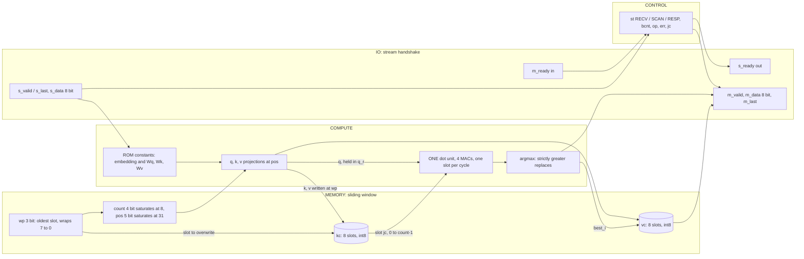
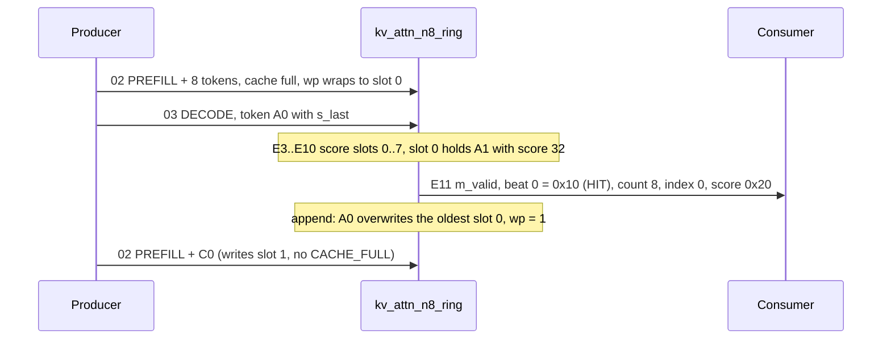

# kv_attn_n8_ring: design notes

## What it is

`kv_attn_n8_ring` is the `kv_attn_n8` attention engine with one change: when the 8-entry KV cache is full it does not answer CACHE_FULL, it overwrites the oldest entry (write pointer round-robin), so the cache behaves as a sliding window over the last 8 tokens (source: `designs/kv_attn_n8_ring/README.md`, `model/kv_attention/spec.md` sections 1 and 4).
Same 24-pin valid/ready stream interface and commands as its siblings: PREFILL streams prompt tokens in (1 cycle per token), DECODE scans all cached slots serially with one dot-product unit and answers with the best-matching entry's value vector (hard attention), then appends the new token (`spec.md` sections 2, 4, 6).
Task: 16 tokens `t = 4a + b`; a DECODE token is a query "which value was last stored under key a?" and the newest key match wins (`spec.md` section 2).
Differences from the base, from `spec.md`: no CACHE_FULL error, `wp = (wp + 1) mod N` wraps, `count = min(count + 1, N)`; a decode of a full cache scans all N = 8 slots, so the latency is n + 3 = 11 cycles for n = 8 (the base tops out at 10, `golden.py --check`, "decode latency" table); the position `pos` still saturates at 31, so recency resolves only the first 32 tokens after a reset (`spec.md` sections 2 and 8).
Simulation: `make simulate DESIGN=kv_attn_n8_ring` printed `PASS kv_attn_n8_ring_tb: 1767 records, 22344 checks (1761 commands: beats, m_last, latency, s_ready, back-pressure; 6 resets)`.
Hardening: `make flow-all` passed all 5 stages (simulate, gds, check, gate-level, collect) in 118 s total (`build/kv_batch.log` FINAL line; `build/flow_kv_attn_n8_ring.log`); the stage-2 flow wall time is 103 s and the peak container memory 0.725 GB (`output/resources.json`).
Task accuracy (`python3 model/kv_attention/golden.py --check`, re-run for this note, 400 episodes, seed 7): 100.00 % against the last-N (window) oracle on 32-token episodes (8611 / 8611 recalls), 91.11 % against an unbounded oracle (8611 / 9451); on 48-token episodes 89.12 % against the window oracle (12827 / 14393) and 80.96 % against the unbounded one.

## Architecture

The design is a thin top (`rtl/kv_attn_n8_ring.v`) around the shared engine `shared/rtl/kv_attn_core.v`, instantiated as `kv_attn_core #(.N(8), .KVB(8), .RING(1))`, plus a generated constant ROM (`rtl/kv_attn_n8_ring_rom.v`, never edited by hand).
The only place `RING` is used in the core is `wire full = (RING == 0) && (count == N)`: with `RING = 1` the "cache full" condition is constant 0, so neither a prefill token nor a decode ever sees CACHE_FULL, and the write pointer `wp` (an `IW`-bit register) wraps by itself.



Registers (elaborated core, `python3 scripts/flow/check_signoff.py kv_attn_n8_ring --breakdown`):

| Register | Bits | Purpose |
|---|---|---|
| `kc` | 56 | key cache, 7 bits per slot after merging constants and identical expressions |
| `vc` | 16 | value cache, 2 bits per slot (V1, V2, V3 equal K0, K1, K3 and merge into `kc`) |
| `resp` | 56 | response shift register |
| `m_data`, `din`, `op`, `best_s` | 8 each | output beat view, last accepted input beat, opcode, argmax score |
| `k_w` | 5 | name given by the tool; probably the 5-bit `pos` counter (my guess) |
| `count`, `jc` | 4 each | valid entries 0..8, scan slot counter |
| `wp`, `rrem`, `best_i`, `st`, unnamed | 3 each | write pointer, response beats remaining, best slot, FSM, an unnamed register group |
| `err`, `q_r`, `bcnt` | 2 each | prefill first error, registered q piece, beat counter |
| `m_valid`, `busy`, `din_v`, `din_last` | 1 each | handshake and frame flags |

Sum 198: my sum of the table 56+16+56+32+5+8+15+6+4 = 198 (the 4 one-bit flags are included in the last term), equal to `stage_check.log` "registers: RTL 198 (allowance 0), surviving sequential cells 198". The base has `err` 3 bits and an unnamed 4-bit group, 200 in total; the 2 missing bits here are plausibly the unreachable CACHE_FULL code (my inference from `full` being constant 0; I did not look at the netlist). The RTL differs from the base in no register at all, only in that constant.

## Data flow

The golden model is bit- and cycle-exact; `python3 model/kv_attention/golden.py --trace kv_attn_n8_ring` prints cache contents per command (its first commands only fill 6 of the 8 slots, e.g. `DECODE A0 -> response 10 06 02 22 01 ff ff 02 latency 8 cycles`; its later commands do reach a full cache, latency 11, but I did not rely on it for the wrap and used my own script below).
To show the wrap I replayed my own short script with the same `Engine` class (`model/kv_attention/golden.py`; I ran it for `kv_attn_n8_ring` and for `kv_attn_n8`): `PREFILL A1 B1 C1 D1 B2 C2 D2 B3` (fills the 8 slots, `wp` wraps to 0), `DECODE A0`, `PREFILL C0`, `DECODE A0`. Cache after the prefill (K position component and V0, the value level):

```
slot 0  K=[-4,-4,0,0]  V=[-1,-1,-1,0]  pos 0   <- A1, the OLDEST, and the next slot to write (wp = 0)
slot 1  K=[-4, 4,0,1]  V=[-1,-1, 1,1]  pos 1      B1
slot 2  K=[ 4,-4,0,2]  V=[-1, 1,-1,2]  pos 2      C1
slot 3  K=[ 4, 4,0,3]  V=[-1, 1, 1,3]  pos 3      D1
slot 4  K=[-4, 4,0,4]  V=[ 1,-1, 1,4]  pos 4      B2
slot 5  K=[ 4,-4,0,5]  V=[ 1, 1,-1,5]  pos 5      C2
slot 6  K=[ 4, 4,0,6]  V=[ 1, 1, 1,6]  pos 6      D2
slot 7  K=[-4, 4,0,7]  V=[ 3,-1, 1,7]  pos 7      B3
```

DECODE A0 on this FULL cache (n = 8, latency L = n + 3 = 11, `golden.py` prints `lat 11`). q = [-4, -4, 0, 1]. E1 = the edge that takes the last input beat; the per-edge columns are my reading of the schedule (`spec.md` section 6) with the golden scores:

| Edge | What happens | Slot score (`scores=` from the replay) | Best after edge |
|---|---|---|---|
| E1 | last input beat (token A0) accepted | | none |
| E2 | q, k, v computed and registered, `jc = 0` | | none |
| E3 | slot 0 (A1, pos 0) | 32 | slot 0, 32 (`jc == 0` forces the update) |
| E4 | slot 1 (B1) | 1 | slot 0 |
| E5 | slot 2 (C1) | 2 | slot 0 |
| E6 | slot 3 (D1) | -29 | slot 0 |
| E7 | slot 4 (B2) | 4 | slot 0 |
| E8 | slot 5 (C2) | 5 | slot 0 |
| E9 | slot 6 (D2) | -26 | slot 0 |
| E10 | slot 7 (B3) | 7 | slot 0 |
| E11 | `jc == n`: response loaded; the append writes slot `wp = 0` (the oldest, A1, which was just read), `wp` becomes 1, `count` stays 8, `pos` 8 | | response |

Response (replay output, verbatim): `DECODE A0 -> 10 08 00 20 ff ff ff 00 lat 11`: status 0x10 (HIT), count 8 (saturated), index 0, score 0x20 = 32, V = [-1,-1,-1,0]: the A1 token's value. The scan still uses the oldest entry, and only after the scan does the append overwrite it. Afterwards (replay dump):

```
slot 0  K=[-4,-4,0,8]  V=[-3,-1,-1,8]  pos 8   <- A0 (the query token), overwrote A1;   wp = 1
```
Then `PREFILL C0 -> 00 08` writes slot 1, overwriting the old B1 with C0 (K = [4,-4,0,9], V = [-3,1,-1,9]; `wp` = 2). A second `DECODE A0` (L = 11 again) scores slot 0 at 40 = 32 + pos 8, the best, and answers `10 08 00 28 fd ff ff 08`: index 0, score 0x28 = 40, V0 = 0xfd = -3, i.e. value 0 from the newer A0 token. The same four commands on `kv_attn_n8` (replay): the 8-token prefill fills the cache, then both decodes and the C0 prefill answer `03 08` (CACHE_FULL, count 8, latency 2): the base needs a RESET_CACHE, the ring keeps going.



## Verification

Testbench: `designs/kv_attn_n8_ring/tb/kv_attn_n8_ring_tb.v` includes the shared body `shared/tb/kv_attn_tb.vh` and plays `designs/kv_attn_n8_ring/tb/vectors.hex`.
It checks the vector header against the DUT parameters (N, KV bits, ring); every output beat with `!==` (so X never passes); `m_last` only on the last beat; the latency exactly; `m_valid` low before the frame ends; `s_ready` low from the last input beat until the last response beat is taken; outputs held under back-pressure; reset when idle, mid-frame and with a response pending. Random `s_valid` gaps and random `m_ready` stalls are applied (`shared/tb/kv_attn_tb.vh` header). The first failure calls `$fatal`.
Fresh `make simulate DESIGN=kv_attn_n8_ring`: `PASS kv_attn_n8_ring_tb: 1767 records, 22344 checks (1761 commands: beats, m_last, latency, s_ready, back-pressure; 6 resets)`. The base plays 1521 records / 15834 checks (`build/flow_kv_attn_n8.log`); the ring file is larger because it adds the wrap cases.
Vectors: generated by `model/kv_attention/gen.py` from `golden.py` (header: "Generated ... do not edit", source sha256 `5aa21bef...`). `spec.md` section 9 lists the ring-specific coverage: prefill wrap, N+3 decodes past the wrap, a 27-token frame, and position saturation with 40 same-key tokens, besides every opcode and bad opcode, every (cached token, query token) pair, every fill level, BAD_FRAME, BAD_TOKEN, resets and 60 random episodes.
Model level: `golden.py --check` ended `PASS golden: 69 checks`. The task metrics (above) say the ring is exactly right against the last-N oracle (8611 / 8611) and loses 840 of 9451 recalls against the unbounded oracle on 32-token episodes (my subtraction), 0 false HIT and 0 missed HIT.
Gate level: the same testbench ran on both netlists: `build/flow/kv_attn_n8_ring/stage_gl_synth.log` ends `gl_sim: kv_attn_n8_ring PASS (0 s)`, `stage_gl_final.log` ends `gl_sim: kv_attn_n8_ring PASS (1 s)`; `build/flow_kv_attn_n8_ring.log` stage 4: `synthesised PASS 5s, routed PASS 2s`.
Signoff: stage 3 `check : PASS ... DRC/LVS/XOR/antenna, slack at all corners, no logic lost`; `stage_check.log`: `registers: RTL 198 (allowance 0), surviving sequential cells 198`. The ring needs no signoff allowance (`scripts/flow/signoff_allowances.json` has none for it).
Negative tests: `tests/run_tests.sh` has a corrupted-vector test only for `kv_attn_n8`; I did not find one for the ring, so a wrong ring behaviour being caught is not demonstrated beyond the wrap cases of the vector file.

## Layout (GDSII)

`output/layout.png` is the routed layout; `kv_attn_n8_ring.lef` is the abstract.
Die 260 x 260 um (`design__die__bbox`, `design__die__area` 67600 um^2); core 5.52 10.88 to 254.38 247.52, 58890.2 um^2 (`design__core__bbox`, `design__core__area`). The die is the estimate in `config.json` (`DIE_AREA` 260 x 260; its `//DIE_AREA` comment still says "not yet hardened"); utilisation is 28.28 % (`design__instance__utilization` 0.282788), low because the estimate assumed about 670 flip-flops (`config.json`) and only 198 survive.
Instances (`metrics.json`): 2621 standard cells (`design__instance__count__stdcell`), 16653.5 um^2; by class: 198 sequential, 550 multi-input combinational, 8 buffers, 21 inverters, 312 timing-repair buffers (179 hold buffers: `design__instance__count__hold_buffer`), 55 clock buffers, 632 antenna diodes, 845 tap cells, 11916 fill cells (not in the 2621).
Check: 198 + 550 + 8 + 21 = 777 synthesised cells (`synth_stat.rpt`), + 312 + 55 + 632 + 845 = 2621 (my sum, equal to `design__instance__count__stdcell`). The base is 773 + 299 + 57 + 592 + 845 = 2566 (my sum): the 55 extra cells are +4 synthesised, +13 repair buffers, -2 clock buffers and +40 diodes.

## From RTL to GDSII: what each step did

### Synthesis

Yosys + abc mapped the design to 777 sky130 cells, 10010.85 um^2 (`reports/synth_stat.rpt`): 198 `dfxtp_2` (4.21e3 um^2), 155 `mux2_1`, 27 `mux4_2`, 6 `xnor2_2`, 1 `xor2_2`. The base: 773 cells, 10034.62 um^2, 200 flip-flops, 183 `mux2_1`, 26 `mux4_2` (its `synth_stat.rpt`). So the ring is +4 cells (+0.5 %) and -23.77 um^2 (-0.24 %) smaller in area (my sums): the sliding window is free in logic.
`reports/synth_checks.rpt`: `Found and reported 0 problems`; `synthesis__check_error__count` 0, `design__lint_warning__count` 447 (same as the base), `design__inferred_latch__count` 0 (`metrics.json`).
Flip-flop reconciliation: declared (elaborated) 198, surviving 198, allowance 0 (`stage_check.log`, `--breakdown`). 512 nominal cache bits became 72 real cache flops: the ROM is constant, so K0 and K1 are +-4 (one sign flop each), K2 is 0, e2 has two distinct bits, and V1, V2, V3 are the same expressions as K0, K1, K3 (`spec.md` section 2; `--breakdown` kc 56 + vc 16 = 72). That is the same as the base, so the ring adds no flop: `wp` was already a 3-bit wrapping pointer.

### Floorplan

Absolute sizing, `DIE_AREA` 0 0 260 260 from `config.json` (`reports/floorplan.txt`: "Using absolute sizing for the floorplan", SDC input/output delay 5 ns, clock uncertainty 0.25 ns, derate 5 %). Utilisation 28.28 %.

### Placement

Global placement finished with zero routing overflow (`reports/placement_global.txt`: GPL-0041 "Total routing overflow: 0.0000"). After detailed placement `reports/placement_detailed.txt` lists 131 timing-repair buffers among 1927 instances (13001.22 um^2); the final count is 312 repair buffers (`design__instance__count__class:timing_repair_buffer`). `design__instance__displacement__total` 558.22 um, mean 0.199 um, max 5.94 um (`metrics.json`; base 512.5 um).
`config.json` `//SLEW`: repair margins 20 percent (the comment: 40 ran the 8 GB container out of memory twice at 80 and 120 um dies).

### Clock tree

`reports/cts.rpt`: 1 clock root, 49 buffers inserted for 198 sinks (16 `clkbuf_8` + 33 `clkbuf_16`), plus dummy loads; the final metrics count 55 clock buffers. Worst skew: setup 0.2580 ns, hold -0.2570 ns (`clock__skew__worst_setup`, `clock__skew__worst_hold`). Hold buffers: 179.

### Routing

Global routing: 53937 um, 1149 nets (`reports/routing_global.txt`: GRT-0018, GRT-0014). Detailed routing finished with `route__drc_errors` 0; the error count per iteration was 236, 55, 27, 0 (`route__drc_errors__iter:0..3`). Final wirelength 35749 um, 8819 vias (`route__wirelength`, `route__vias`); the longest net is 789.555 um (`route__wirelength__max`) against 532.88 um in the base; I did not identify which net it is. Detailed routing was the longest step: 19.826 s (`resources.json`).

### Timing

Clock 25 ns (`config.json` `CLOCK_PERIOD`, 40 MHz). From `reports/timing_summary.rpt` (slack in ns; no setup or hold violations at any corner):

| Corner | Worst setup slack | Worst hold slack | Max slew violations |
|---|---|---|---|
| nom_tt_025C_1v80 | 15.4479 | 0.3007 | 180 |
| nom_ss_100C_1v60 | 10.8718 | 0.8238 | 592 |
| nom_ff_n40C_1v95 | 17.0329 | 0.1078 | 0 |
| Overall worst | 10.7045 (max_ss_100C_1v60) | 0.1063 (min_ff_n40C_1v95) | 666 |

Worst setup path (`timing_paths_max_ss.rpt`): startpoint input port `rst`, endpoint flip-flop `_1197_`, slack 10.704512 ns. Worst hold path (`timing_paths_min_ff.rpt`): flip-flop `_1337_` back to itself, slack 0.106288 ns. The base's overall worst is 10.7398 ns setup and 0.1052 ns hold.

### DRC

Magic `COUNT: 0` (`reports/drc_magic.rpt`); KLayout: all 257 rule entries in `reports/drc_klayout.json` are 0 (my count of entries; `klayout__drc_error__count` 0). `magic__drc_error__count` 0.

### LVS

`reports/lvs_netgen.rpt`: 1251 devices and 1159 nets on each side, "Circuits match uniquely"; `design__lvs_error__count` 0.

### Power / IR drop

`power__total` 1.1468 mW: internal 8.62e-4 W, switching 2.85e-4 W, leakage 5.8e-8 W (`metrics.json`); the base is 1.1361 mW (+0.9 %, my division). `reports/irdrop.rpt` prints its own total of 9.81e-04 W (it differs from `metrics.json`) and two worst-case IR-drop lines, 2.19e-04 V and 2.78e-04 V.

### Antenna, slew, capacitance

`antenna__violating__nets` 0, `route__antenna_violation__count` 0; 632 diode cells were inserted by the heuristic insertion (`design__instance__count__class:antenna_cell`).
`design__max_slew_violation__count` is 666 (nom_tt 180, nom_ss 592, max_ss 666, ff 0; `timing_summary.rpt`), `design__max_cap_violation__count` 0, `design__max_fanout_violation__count` 67 (constraint `MAX_FANOUT_CONSTRAINT` 8). The base has 551 slew violations and 64 fanout violations, the int4 engine 554 and 83. `check_signoff.py` prints these as notes and does not fail on them. I did not trace the violating pins to their drivers, so I cannot say how many are input-port-limited and how many internal; the repair margin is 20 percent (`config.json` `//SLEW`).

Reports: [synth_stat.rpt](output/reports/synth_stat.rpt), [synth_checks.rpt](output/reports/synth_checks.rpt), [floorplan.txt](output/reports/floorplan.txt), [placement_global.txt](output/reports/placement_global.txt), [placement_detailed.txt](output/reports/placement_detailed.txt), [cts.rpt](output/reports/cts.rpt), [routing_global.txt](output/reports/routing_global.txt), [routing_detailed.txt](output/reports/routing_detailed.txt), [timing_summary.rpt](output/reports/timing_summary.rpt), [timing_paths_max_ss.rpt](output/reports/timing_paths_max_ss.rpt), [timing_paths_min_ff.rpt](output/reports/timing_paths_min_ff.rpt), [drc_magic.rpt](output/reports/drc_magic.rpt), [drc_klayout.json](output/reports/drc_klayout.json), [lvs_netgen.rpt](output/reports/lvs_netgen.rpt), [irdrop.rpt](output/reports/irdrop.rpt), [cell_usage.rpt](output/reports/cell_usage.rpt), [manufacturability.rpt](output/reports/manufacturability.rpt).

## Run time and memory

`output/resources.json`: profile `tight` (2 CPUs, 8 GB), `wall_s_total` 103 s, `container_peak_mem_gb` 0.725, peak RSS of any step 614.5 MB (`peak_rss_bytes_flow_stats_max`). Longest steps: detailed routing 19.826 s, Magic SPICE extraction 14.239 s, KLayout DRC 10.475 s, Magic DRC 5.799 s, post-PnR STA 5.045 s, CTS 4.580 s. The whole `make flow-all` was 117 s in `build/flow_kv_attn_n8_ring.log` (118 s in the batch FINAL line `kv_attn_n8_ring EXIT=0 SECONDS=118`, `build/kv_batch.log`). The base took 105 s of flow wall time and 0.848 GB.

## Reproduce

```
make simulate DESIGN=kv_attn_n8_ring          # RTL regression, prints the PASS line quoted above
make flow-all DESIGN=kv_attn_n8_ring          # simulate, gds, check, gate-level, collect
python3 model/kv_attention/golden.py --check  # task metrics: 100 % vs window, 91.11 % vs unbounded
python3 model/kv_attention/golden.py --trace kv_attn_n8_ring
python3 scripts/flow/check_signoff.py kv_attn_n8_ring --breakdown
python3 model/kv_attention/gen.py             # regenerates rom and vectors (write-if-changed)
```

## Intuitions and insights

1. **A ring buffer is sliding-window attention, and it is nearly free in hardware.** The only RTL difference from `kv_attn_n8` is the constant `full = (RING == 0) && ...`. Synthesis: 777 cells, 10010.85 um^2 against 773 cells, 10034.62 um^2 (`synth_stat.rpt` of each), and 198 against 200 flip-flops (`metrics.json`): the window costs nothing; if anything it removes the CACHE_FULL branch (2 flops fewer, my inference). The cost is elsewhere: decode latency n + 3 reaches 11 cycles for a full cache against 10 for the base (`golden.py --check`).
2. **Bounded memory is the point: the window forgets, and `--check` puts numbers on it.** The cache is a fixed 512 nominal bits (72 real flops) however long the stream is: the same flop count serves 32 tokens or 32 million. Against "the last 8 tokens" the ring is exactly right (8611 / 8611, 100.00 %); against an unbounded memory it is right on 8611 of 9451 recalls, 91.11 %, on 32-token episodes (`golden.py --check`). The 840 missing recalls are the price of having forgotten older keys, a deliberate trade, not a bug. The docs list the same trade: "tokens older than W are forgotten; the model must work with that" (`docs/LLM_INFERENCE.md`, sliding window row).
3. **The same idea as the audio delay line, with a pointer instead of a shift.** `designs/audio_onset/NOTES.md` stores a window of three 4-bit samples (12 flops) that shift every beat; the stream can be 10 beats or a year and the flop count stays 25. The ring does the same for tokens (the window is the 8 slots) but moves a write pointer, not the data: one slot is written per token, the others do not toggle. That is why there is no extra datapath.
4. **The limit that bit is the position counter, not the ring.** On 48-token episodes the accuracy against the window oracle falls from 100.00 % to 89.12 % (12827 / 14393) and against the unbounded oracle to 80.96 % (`golden.py --check`), because `pos` saturates at 31 and later entries tie on recency; the lowest physical slot then wins, which after a wrap is not the newest (`spec.md` section 8: "a limitation of the 5-bit position, stated here instead of hidden"). A ring needs a recency signal that wraps with the window (an age or modular position); the saturating counter that is fine for a plain cache is the wrong tool here. I did not build or measure that fix.
5. **Where the extra area comes from is the physical flow, not the logic.** Std-cell area after the flow is 16653.5 against 16412 um^2 (+1.5 %, `design__instance__area__stdcell`), although the synthesised area went down: the repair buffers are 312 against 299, the diodes 632 against 592, and the flow ran on a 260 x 260 um die either way, at 28.28 % utilisation (`metrics.json`). The die is a config estimate that assumed about 670 flip-flops (`config.json`); the real design has 198. A smaller die would be the first optimisation, and I did not try one.
6. **Timing is not the limit.** 25 ns clock, worst setup slack 10.7045 ns (max_ss_100C_1v60, startpoint `rst`) and worst hold slack 0.1063 ns (min_ff_n40C_1v95, flip-flop `_1337_` to itself; `timing_summary.rpt`, `timing_paths_*.rpt`). Hold is the tighter margin: 179 hold buffers were inserted, 172 in the base (`metrics.json`).
7. **Slew counts, honestly.** 666 max-slew violations (592 at nom_ss, 180 at nom_tt, 0 at ff), the largest of the three designs compared here, against 551 (base) and 554 (int4); no cap violation, 67 fanout violations (`timing_summary.rpt`, `metrics.json`). `check_signoff.py` prints them as notes. I did not classify them, so I will not claim they are unfixable; the longest routed net, 789.555 um against 532.88 um in the base, is a candidate cause that I did not follow up.
8. **Verification lesson: a corner case that only exists in one variant needs vectors made for it.** The wrap, the "N+3 decodes past the wrap" and the 40-token same-key chain exist only in the ring file (1767 records, against 1521 for the base; `spec.md` section 9), and gate-level simulation of the routed netlist replays all of them (`stage_gl_final.log` PASS). What is missing is a negative test for the ring (`tests/run_tests.sh` mutates only the base's vectors). The register check needed no allowance (RTL 198 = surviving 198), which is itself the good outcome: an allowance is for provable dead logic, and there was none to prove here.
9. **Takeaway versus siblings.** Same engine, same pins, same 25 ns clock: `kv_attn_n8` 200 flops, 10034.62 um^2, CACHE_FULL at 8 tokens; `kv_attn_n8_ring` 198 flops, 10010.85 um^2, never full, forgets; `kv_attn_n8_int4` 222 flops, 10770.33 um^2, and 81.65 % recall (`synth_stat.rpt` each, `golden.py --check`). Of the two modifications, the one that changes behaviour in time (the ring) costs less than the one that changes the number format (int4): a pointer is cheap, a quantiser is not.

### Comparison with `kv_attn_n8`

| Quantity | `kv_attn_n8` | `kv_attn_n8_ring` | Source |
|---|---|---|---|
| Nominal cache bits | 512 | 512 | `golden.py --check` |
| Full-cache behaviour | CACHE_FULL | overwrites the oldest | `spec.md` section 4 |
| Task accuracy vs window / unbounded oracle (32 tokens) | 100.00 % / 100.00 % | 100.00 % / 91.11 % | `golden.py --check` |
| 48-token episodes vs window / unbounded | not reported | 89.12 % / 80.96 % | `golden.py --check` |
| Worst decode latency | 10 cycles | 11 cycles | `golden.py --check` |
| Flip-flops (surviving) | 200 | 198 | `metrics.json` |
| Synthesised cells / area | 773 / 10034.62 um^2 | 777 / 10010.85 um^2 | `synth_stat.rpt` |
| Std cells after the flow | 2566 | 2621 | `design__instance__count__stdcell` |
| Std-cell area | 16412 um^2 | 16653.5 um^2 | `design__instance__area__stdcell` |
| Die / utilisation | 260 x 260 um / 27.87 % | 260 x 260 um / 28.28 % | `design__die__bbox`, `design__instance__utilization` |
| Total power | 1.1361 mW | 1.1468 mW | `power__total` |
| Worst setup / hold slack | 10.7398 / 0.1052 ns | 10.7045 / 0.1063 ns | `timing_summary.rpt` |
| Max-slew violations | 551 | 666 | `design__max_slew_violation__count` |
| Flow wall time / peak memory | 105 s / 0.848 GB | 103 s / 0.725 GB | `resources.json` |
