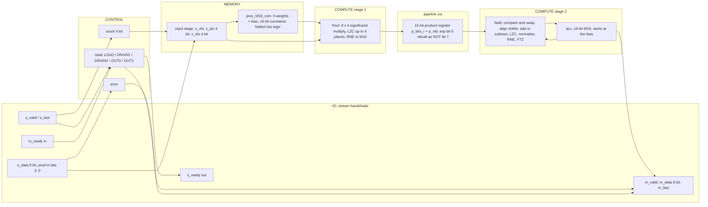
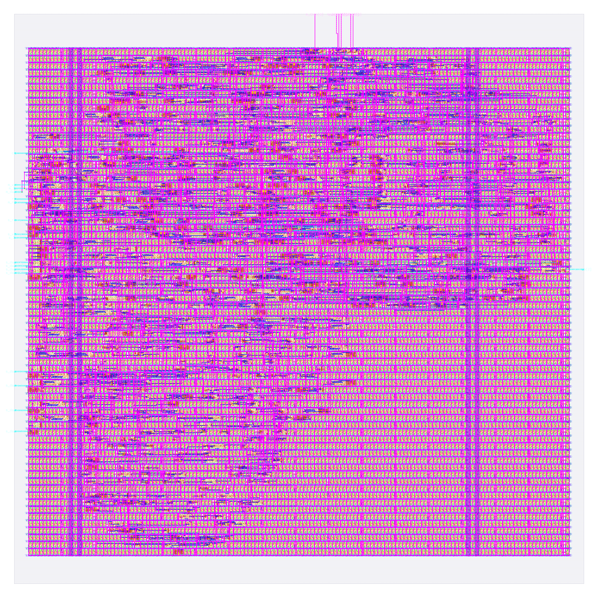

# prec_bf16: design notes

## What it is

`prec_bf16` is a one-neuron image classifier using bfloat16 weights (1 sign, 8 exponent, 7 stored mantissa bits, bias 127, smallest normal 2^-126): it reads a 3 x 3 image of 4-bit pixels, one pixel per clock beat, and answers "vertical bar (1) or horizontal bar (0)?" (source: `designs/prec_bf16/README.md`, `model/precision_hw/spec.md` section 1).
The weights are the trained fp32 weights rounded to bf16 with round-to-nearest-even; values below 2^-126 would be stored as +0 (`designs/prec_bf16/rtl/prec_bf16_rom.v`, generated, never edited). The accumulator has the weight format. There is no scale factor.
It is one of seven engines that share task, trained fp32 weights, pins and control, and differ only in number format (`docs/PRECISION_STUDY.md` section 1). The float MAC is two stages: `prec_bf16_fmul` (bf16 weight x pixel, product rounded to bf16 RNE) into a 15-bit product register, then `prec_bf16_fadd` (bf16 accumulate, RNE, flush-to-zero). Two roundings per step, unfused, bit-identical to a single-cycle MAC (`README.md`).
Output: beat 0 = `{6'b0, error, class}`, beat 1 = `acc[15:8] ^ acc[7:0]`; latency 3 cycles after the last input beat (`golden.LATENCY`, `spec.md` section 6).
Simulation: `make simulate DESIGN=prec_bf16` printed `PASS prec_bf16_tb: 931 cases, 4668 checks (results, latency, back-pressure, protocol errors, reset)`.
Hardening: `make flow-all` passed all 5 stages (simulate, gds, check, gate-level, collect) in 111 s total (`build/prec_bf16_a1.log`: simulate 1 s, gds 94 s, check 1 s, gl_synth 6 s, gl_final 3 s, collect 6 s); the flow wall time is 93 s (`output/resources.json`).
Timing was closed with tool settings only: worst setup slack +0.044 ns at max_ss_100C_1v60, the thinnest margin of the seven formats (`output/metrics.json`, `docs/PRECISION_STUDY.md` section 6).
Test accuracy 94.00 %, 99.95 % same decision as fp32 on 2000 held-out images (`python3 model/precision_hw/report.py`).

## Architecture



Registers (all in `rtl/prec_bf16.v`; synchronous active-high reset):

| Register | Width | Purpose |
|---|---|---|
| `state` | 3 | FSM LOAD / DRAIN1 / DRAIN2 / OUT0 / OUT1 (Yosys recoded it one-hot: 5 flops) |
| `count` | 4 | beats accepted, saturates at 9; also the pixel index |
| `error` | 1 | sticky: bad item or wrong frame length |
| `x_vld` | 1 | input stage holds a used item |
| `x_pix` | 4 | the unsigned 4-bit pixel |
| `x_idx` | 4 | its index = ROM address |
| `p_vld` | 1 | `p_bits_r` holds a nonzero product to add on the next edge |
| `p_bits_r` | 15 | rounded product `{sign, exp[7], exp[5:0], mantissa[6:0]}`, exponent bit 6 not stored |
| `acc` | 16 | bf16 running sum, starts at the bias; class = ~acc[15] |

RTL flip-flop bits: 49 (sum of the table: 3+4+1+1+4+4+1+15+16). `metrics.json` (`design__instance__count__class:sequential_cell`) says 51, `synth_stat.rpt` lists 51 `dfxtp_2`, and `cell_usage.rpt` lists 50 `dfxtp_2` + 1 `dfxtp_4` after repair. The extra 2 are the one-hot recoding of the 5-state FSM (5 flops instead of 3; `yosys-synthesis.log` line 357: "mapping auto encoding to `one-hot` for this FSM"). `build/flow/prec_bf16/stage_check.log` reports `registers: RTL 51 (allowance 0), surviving sequential cells 51`.
The removed bit: before the fix the product register was 16 bits (RTL 50 + 2 = 52 flops) and only 51 cells survived, so `check_signoff` failed with "logic lost" (history in `README.md` and the comment at `p_bits_r` in the RTL). Reason: every ROM weight has biased exponent 0x74..0x7D (my decode of `prec_bf16_rom.v`: 120, 125, 121, 125, 121, 125, 122, 125, 116 = 0x78, 0x7D, 0x79, 0x7D, 0x79, 0x7D, 0x7A, 0x7D, 0x74), a pixel at most 15 adds at most 3 to the exponent (plus 1 for a rounding carry), so every nonzero product has exponent 0x74..0x81. In that range exponent bit 6 is the complement of bit 7 (0x74..0x7F have bits 7,6 = 0,1; 0x80, 0x81 have 1,0). Synthesis had already proved this and deleted the flop; the RTL now stores 15 bits and rebuilds bit 13 of the product word as `~p_bits_r[13]`. `p_vld` is 0 for zero products, so the adder never sees the one value (exponent 0) where the identity fails.
Caveat: the identity is a property of these trained weights, not of the format. If the ROM is regenerated with exponents outside 0x74..0x7D the full 16-bit register must be restored (RTL comment).
There is no weight RAM: 9 x 16 weight bits + a 16-bit bias = 160 parameter bits (`report.py`); the ROM is a 10-way mux of 16-bit constants addressed by `x_idx`. Because the address is a register, the multiplier operand is not a compile-time constant, so synthesis builds a general 8 x 4 significand multiplier (the weight mux is in front of it).

## Data flow

One concrete image (vertical bar plus noise, the same as in `prec_int8/NOTES.md`), `python3 model/precision_hw/golden.py --trace bf16 3 12 2 4 13 3 2 11 3` (pixels p0..p8): pixels 3 12 2 / 4 13 3 / 2 11 3.
The trace prints, per item, the weight, the rounded product and the new accumulator (hex bf16 and value) and ends `class 1  beat1 ce`. The edge table below is my replay of the RTL schedule using those printed values: pixel k is accepted at edge k, its product is registered at edge k+1, and added into the accumulator at edge k+2 (`spec.md` section 6; `README.md`: E0 accepts, E1 registers the product, E2 accumulates).

| Edge | Beat accepted (pixel) | Product registered (item, w x pixel, rounded) | Accumulate (item, acc after) | State after |
|---|---|---|---|---|
| reset | | | acc = 0xbe3a = -0.181640625 (bias) | LOAD |
| 0 | 3 | none (x_vld = 0) | none | LOAD |
| 1 | 12 | item 0: 0.01477 x 3 = 0x3d36 = 0.0444 | none | LOAD |
| 2 | 2 | item 1: 0.29102 x 12 = 0x4060 = 3.5 | item 0: 0xbe0c = -0.13671875 | LOAD |
| 3 | 4 | item 2: 0.02881 x 2 = 0x3d6c = 0.0576 | item 1: 0x4057 = 3.359375 | LOAD |
| 4 | 13 | item 3: -0.31641 x 4 = 0xbfa2 = -1.265625 | item 2: 0x405b = 3.421875 | LOAD |
| 5 | 3 | item 4: -0.01904 x 13 = 0xbe7e = -0.248 | item 3: 0x400a = 2.15625 | LOAD |
| 6 | 2 | item 5: -0.26758 x 3 = 0xbf4e = -0.8047 | item 4: 0x3ff4 = 1.90625 | LOAD |
| 7 | 11 | item 6: 0.04468 x 2 = 0x3db7 = 0.0894 | item 5: 0x3f8d = 1.1015625 | LOAD |
| 8 | 3 (s_last) | item 7: 0.29492 x 11 = 0x4050 = 3.25 | item 6: 0x3f98 = 1.1875 | DRAIN1 |
| 9 | none | item 8: 0.000832 x 3 = 0x3b24 = 0.0025 | item 7: 0x408e = 4.4375 | DRAIN2 |
| 10 | none | none | item 8: 0x408e = 4.4375 (0.0025 is below half an ulp, so the sum is unchanged) | OUT0 |

The accumulator hex values are copied from `golden.py --trace`. Item 8 is not skipped: its weight is nonzero and its pixel is 3, so `p_vld` is 1 and the adder runs, but the rounded sum equals the old accumulator.
Result: class 1 (acc positive, sign bit 0), beat 0 = 0x01, beat 1 = 0x40 ^ 0x8e = 0xce (`golden.py --trace` prints `beat1 ce`); `m_valid` rises after edge 10, 3 cycles after the edge that accepted `s_last` (latency 3). The two stages overlap: while item k is added at edge k+2, item k+1 is multiplied and registered, and item k+2 is being accepted, so throughput stays one beat per clock.

```mermaid
sequenceDiagram
    participant P as Producer
    participant D as prec_bf16
    participant C as Consumer
    P->>D: pixels 3 12 2 4 13 3 2 11 (s_valid, one per clock)
    Note over D: edge k: pixel k latched in x_*; fmul of item k-1 registered in the product register; fadd of item k-2 updates acc
    P->>D: pixel 3 with s_last (edge 8)
    Note over D: DRAIN1 edge 9: product of item 8 registered, item 7 added, acc = 4.4375 (0x408e)
    Note over D: DRAIN2 edge 10: item 8 added, acc = 0x408e
    D->>C: m_valid=1, m_data=0x01 (class 1, error 0)
    C->>D: m_ready=1
    D->>C: m_data=0xce, m_last=1
    Note over D: acc reloaded with the bias, state back to LOAD
```

## Verification

Testbench: `designs/prec_bf16/tb/prec_bf16_tb.v` (defines `DUT prec_bf16` and includes the shared body `shared/tb/stream_tb.vh`), `+VEC=designs/prec_bf16/tb/vectors.hex`. For every case it sends the frame with random `s_valid` gaps, takes the two result beats with random `m_ready` stalls, and compares beat 0, beat 1, `m_last` and the latency; it also checks that the outputs hold under back-pressure, that `s_ready` is low from the last beat until the result is taken, and that reset mid-frame or with a result waiting returns to an empty ready state. Comparisons use `!==`, so X never passes; the first failure calls `$fatal`.
Fresh `make simulate DESIGN=prec_bf16`: `PASS prec_bf16_tb: 931 cases, 4668 checks (results, latency, back-pressure, protocol errors, reset)`

Vectors: `designs/prec_bf16/tb/vectors.hex` is generated by `model/precision_hw/gen.py` from `golden.py`; the same 931 inputs are used for every format and only the expected values differ (`spec.md` section 8): 600 held-out test images, 37 further images where a non-binary format disagrees with fp32, 16 uniform images (v = 0..15), 27 single bright/dark/8-on-7 pixel images, 4 ideal bars/checkerboards, 16 sum-maximising/minimising images, 120 near-boundary random images, 60 uniform-random images, 8 short frames, 3 long frames, 36 out-of-range items (4 values x 9 positions), 4 short/bad-frame cases. 600+37+16+27+4+16+120+60+8+3+36+4 = 931. Every format sees 51 error cases.
Model level: `python3 model/precision_hw/golden.py --check` ends `golden: all self-checks passed`. The lines for this format: `bf16 RNE vs fp32 top-16-bit trick on 20000 random fp32 values ok`; `FTZ: fp16(2^-15) = +0, bf16(2^-127) = +0 ... ok`; `encode/decode: ... bf16 1.0=3f80 ok`; `every pixel 0..15 exact in E4M3, fp16, bf16 ok`; `bf16 datapath == fp32 replay rounded by top-16-bit trick (33946 ops) ok`; `bf16: |acc| <= 20.76 < max finite 3.39e+38; smallest product 0.000832 >= min normal ok`.
Float-unit check: the task brief mentioned a 60,000-pair float-unit check recorded in the README; I did not find it in `designs/prec_bf16/README.md`, `spec.md` or `tests/run_tests.sh` (grep for 60000 and pairs). The closest recorded evidence is the `golden.py --check` replay above (33946 bf16 ops; the shared fp16 + fp8 replay is 60576 ops).
Gate level: the same testbench runs on the synthesised netlist (`build/gl/prec_bf16/runs/gl/final/nl/prec_bf16.nl.v`, 776 cells, my grep count of sky130 instances, equal to `synth_stat.rpt`) and on the routed netlist (`designs/prec_bf16/runs/RUN_2026-10-05_20-30-14/final/nl/prec_bf16.nl.v`, 10413 instances including taps, fill and diodes, equal to `design__instance__count`). `build/flow/prec_bf16/stage_gl_synth.log` ends `gl_sim: prec_bf16 PASS (2 s)` and `stage_gl_final.log` ends `gl_sim: prec_bf16 PASS (2 s)`, both after `PASS prec_bf16_tb: 931 cases, 4668 checks`; `build/gl/prec_bf16/synth_checks.txt` reads `synthesis__check_error__count = 0`.
Signoff: `build/flow/prec_bf16/stage_check.log`: `registers: RTL 51 (allowance 0), surviving sequential cells 51`, `max-slew violations: 45`, `max-cap violations: 0`, `=> PASS` (`scripts/flow/check_signoff.py`: DRC/LVS/XOR/antenna, slack at all corners, no logic lost).
Negative tests: `tests/run_tests.sh` (corrupted expected value in `vectors.hex`, broken-RTL copy, mutated threshold) lists `prec_bf16` in `NEWENG` but its corrupted-vector loop at line 261 names only `audio_pitch audio_onset image_text_match prec_int8`, and `designs/prec_bf16/README.md` records no negative test. So no bf16-specific negative test is demonstrated; I did not run `tests/run_tests.sh`.

## Layout (GDSII)



The picture (`output/layout.png`, KLayout render) shows the 220 x 220 um die (`design__die__bbox`, `config.json`; 48400 um^2) with the core inside (`design__core__bbox` = `5.52 10.88 214.36 206.72`, 40899.2 um^2). Standard cells sit in horizontal rows, the power grid is on the upper metals and the 26 I/O (24 signals plus `vccd1`, `vssd1`; `design__io`) are on the edges.
Utilisation is 0.248654 (`design__instance__utilization`): 1754 std cells, 10169.8 um^2 (`design__instance__area__stdcell`). In the final layout there are also 8659 fill-class cells (7766 `decap_3`, 524 `fill_1`, 369 `fill_2`; 30729.5 um^2, `metrics.json` and `cell_usage.rpt`), 592 tap cells and 239 antenna diodes.

## From RTL to GDSII: what each step did

### Synthesis

Yosys mapped the RTL to 776 sky130_fd_sc_hd cells, 7608.55 um^2, of which 1084.79 um^2 (14.26 %) is the 51 `dfxtp_2` flip-flops (`output/reports/synth_stat.rpt`). Main contributors: 80 `nand2_2`, 60 `mux2_1` (675.65 um^2) + 3 `mux4_2` (67.57 um^2), 57 `nor2_2`, 44 `a21oi_2`, 44 `or2_2`, 41 `a21o_2`, 41 `inv_2`, 28 `xor2_2` + 24 `xnor2_2` (455.44 + 390.37 um^2), 24 `and2b_2`, 23 `and2_2`, 30 `o21ai_2`, 21 `and3_2`.
Where the float structure shows: 63 mux cells (743.21 um^2, 9.8 % of the synthesised area, my sum) are the barrel shifters, the right-shift aligner of the adder, the left-shift normaliser after the subtract, and the 4-place normaliser after the multiply; 52 xor/xnor cells (845.81 um^2) are the add/subtract inversion and the multiplier; the rest is carry logic, the leading-zero priority encoders and the 10-way weight mux. The 8 x 4 multiplier is a general one (operand from a mux of ROM constants), but `synth_stat.rpt` is flat so its exact area is not separable; I did not isolate it. `synth_checks.rpt` found no problems; `synthesis__check_error__count` = 0, lint warnings 453 (`design__lint_warning__count`).
Report: [synth_stat.rpt](output/reports/synth_stat.rpt), [synth_checks.rpt](output/reports/synth_checks.rpt).

### Floorplan

Die 220 x 220 um from `config.json`; core 40899.2 um^2; 776 instances (7608.547 um^2) give an effective utilisation of 0.186 before repair, CTS, taps and fill (`floorplan.txt`). The die was sized for a serial float MAC of 3 to 5k cells (`//DIE_AREA` in `config.json`) and was never shrunk.
Report: [floorplan.txt](output/reports/floorplan.txt).

### Placement

Global placement ended at iteration 420 with 64 routability-mode iterations; final weighted congestion 0.8790, no cell inflation (`placement_global.txt`). Detailed placement: displacement 0.0 u in the step's own lines, original HPWL 20910.2 u, legalised 21452.5 u (+3 %); `design__instance__displacement__total` = 19.62 um, max 5.44 um (`placement_detailed.txt`, `metrics.json`). Timing repair added 133 buffers, 855.821 um^2 (`design__instance__count__class:timing_repair_buffer`, `design__instance__area__class:timing_repair_buffer`), 2 of them setup buffers (`design__instance__count__setup_buffer`); the earlier failing run had 123.
Reports: [placement_global.txt](output/reports/placement_global.txt), [placement_detailed.txt](output/reports/placement_detailed.txt).

### Clock tree

TritonCTS: 1 clock root, 9 `clkbuf_16` buffers inserted (plus 5 `clkbuf_4` dummy loads), 51 sinks (equal to the flip-flop count) (`cts.rpt`). Worst setup-side skew 0.2600 ns (`clock__skew__worst_setup`); 0 hold buffers (`design__instance__count__hold_buffer`); 14 clock-buffer-class cells in the final design (`metrics.json`).
Report: [cts.rpt](output/reports/cts.rpt).

### Routing

Global routing: `global_route__wirelength` = 38253, `global_route__vias` = 6474 (`metrics.json`). Detailed routing: DRC violations per iteration 182, 41, 23, 0 (`route__drc_errors__iter:*`), final `route__drc_errors` = 0; wire length 23952 um (met1 12269, met2 11154, met3 415, met4 113 um, `routing_detailed.txt`), 6681 vias (all single-cut), longest net 251.66 um (`route__wirelength__max`); 931 routed nets (`route__net`).
Reports: [routing_global.txt](output/reports/routing_global.txt), [routing_detailed.txt](output/reports/routing_detailed.txt).

### Timing

Clock period 25 ns (`config.json`). All corners pass, setup and hold TNS 0 (`timing_summary.rpt`, `metrics.json`).

| Corner | Worst setup slack (ns) | Worst hold slack (ns) |
|---|---|---|
| max_ss_100C_1v60 | 0.0443 | 0.8838 |
| nom_ss_100C_1v60 | 0.2273 | 0.8780 |
| min_ss_100C_1v60 | 0.4220 | 0.8741 |
| nom_tt_025C_1v80 | 12.2677 | 0.3233 |
| nom_ff_n40C_1v95 | 17.1409 | 0.1126 |
| Overall worst | 0.0443 (max_ss_100C_1v60) | 0.1101 (min_ff_n40C_1v95) |

Worst setup path (`timing_paths_max_ss.rpt`): flip-flop `_1482_` (`acc[11]`, launch clock at 0.765 ns) to flip-flop `_1484_` (accumulator bit), data arrival 25.194817 ns, required 25.239157 ns (25 ns + clock path - 0.25 ns uncertainty - 0.276 ns setup), slack 0.044341 ns; the path has 84 cell-output lines including the clock buffers. It runs through the adder loop in order: magnitude compare (`and2b`, `or2`, `or4b`), the swap and alignment muxes (4 `mux2_4`, 4 `mux2_1`, 2 `mux4_2` appear in the path), add/subtract (2 `xnor2_2`), the wide `or4bb`/`or3b` leading-zero logic, the normalise shifter, then the rounding `a2bb2o`/`a31o`/`a221o`/`a21o`/`a32o`/`a211o` chain into the flip-flop. The data part is about 24.4 ns of the 25 ns (my subtraction, 25.1948 - 0.765). Worst hold path (`timing_paths_min_ff.rpt`): flip-flop `_1474_` back to itself, slack 0.110137 ns.
History (`designs/prec_bf16/runs/RUN_*/final/metrics.json`, `README.md`, `spec.md` section 6):

| Stage | Setup WS at max_ss (ns) | Std cells | Source |
|---|---|---|---|
| single-stage MAC | not found in repo files | | `docs/PRECISION_STUDY.md` section 6 says so too |
| two-stage MAC, default repair (RUN_2026-10-05_20-11-27) | -0.9275 | 1808 (123 repair buffers) | run `metrics.json` |
| two-stage MAC, 15-bit product register, tool timing repair (RUN_2026-10-05_20-30-14) | +0.0443 | 1754 (133 repair buffers) | run `metrics.json` |

What each repair key in `config.json` does (my reading of the key names and their effect on the numbers; no RTL change, clock period stays 25 ns): `RUN_POST_GRT_RESIZER_TIMING` runs one more resizer timing-repair pass after global routing, when real wire parasitics are known; `PL_RESIZER_SETUP_SLACK_MARGIN` and `GRT_RESIZER_SETUP_SLACK_MARGIN` = 0.5 make the repair keep working until 0.5 ns of setup slack is reached instead of 0, so the final (post-route) slack lands positive; `PL_RESIZER_SETUP_BUFFERING` / `GRT_RESIZER_SETUP_BUFFERING` insert buffers on critical nets; `PL_RESIZER_SETUP_GATE_CLONING` / `GRT_RESIZER_SETUP_GATE_CLONING` duplicate high-fanout gates to cut load. The same file sets `MAX_FANOUT_CONSTRAINT` 8, `PL_RESIZER_MAX_SLEW_MARGIN` 40 and `GRT_DESIGN_REPAIR_MAX_SLEW_PCT` 40. The margin is thin (0.044 ns is 0.18 % of the period): `README.md` says a run on a different machine should be rechecked.
Reports: [timing_summary.rpt](output/reports/timing_summary.rpt), [timing_paths_max_ss.rpt](output/reports/timing_paths_max_ss.rpt), [timing_paths_min_ff.rpt](output/reports/timing_paths_min_ff.rpt).

### DRC

Magic `COUNT: 0` (`drc_magic.rpt`); KLayout: all 257 rule entries in `drc_klayout.json` are 0 (my sum); `manufacturability.rpt`: DRC Passed.
Reports: [drc_magic.rpt](output/reports/drc_magic.rpt), [drc_klayout.json](output/reports/drc_klayout.json), [manufacturability.rpt](output/reports/manufacturability.rpt).

### LVS

`lvs_netgen.rpt`: "Final result: Circuits match uniquely." with 976 devices and 938 nets each side (after merging 9437 parallel devices per side); `manufacturability.rpt`: LVS Passed.
Report: [lvs_netgen.rpt](output/reports/lvs_netgen.rpt).

### Power / IR drop

Total power 1.2715e-03 W (`power__total`: internal 6.386e-04, switching 6.328e-04, leakage 3.9e-08 W). `irdrop.rpt` (its own total 1.09e-03 W, nom_tt corner): vccd1 worst IR drop 4.20e-04 V, average 5.35e-05 V; vssd1 worst 3.76e-04 V, average 5.24e-05 V; the report states 0.02 % drop on both nets. `design__power_grid_violation__count` = 0.
Report: [irdrop.rpt](output/reports/irdrop.rpt).

### Antenna, slew, capacitance

239 antenna diodes inserted (598.074 um^2, `design__instance__count__class:antenna_cell`); `antenna__violating__nets` = 0; `manufacturability.rpt`: Antenna Passed. Max-cap violations 0, max-slew violations 45 (36 at nom_ss and min_ss, 45 at max_ss; 0 at tt and ff), max-fanout violations 29 at every corner (`design__max_cap_violation__count`, `design__max_slew_violation__count`, `design__max_fanout_violation__count`). The flow still reports PASS (`stage_check.log` prints the slew count as a note); I did not find which script treats it as non-fatal.
Report: [cell_usage.rpt](output/reports/cell_usage.rpt).

## Run time and memory

From `output/resources.json` (profile "tight": 2 CPUs, 8 GB): total wall time 93 s, container peak memory 893,284,352 bytes (0.832 GB), 79 steps. Whole `flow-all` 111 s (`build/prec_bf16_a1.log`; stage times listed above).

| Step | Wall time (s) |
|---|---|
| 47-openroad-detailedrouting | 19.528 |
| 71-magic-spiceextraction | 9.763 |
| 68-klayout-drc | 8.121 |
| 35-openroad-cts | 4.591 |
| 06-yosys-synthesis | 1.322 |

## Reproduce

```bash
python3 model/precision_hw/golden.py --check   # self-checks
python3 model/precision_hw/golden.py --trace bf16 3 12 2 4 13 3 2 11 3   # the cycle table above
python3 model/precision_hw/gen.py              # rtl/prec_bf16_rom.v and tb/vectors.hex
make simulate DESIGN=prec_bf16                       # RTL simulation, 931 cases
make flow-all DESIGN=prec_bf16                       # simulate, gds, check, gate-level, collect
python3 model/precision_hw/report.py           # study table incl. this design's metrics
```

`rtl/prec_bf16_rom.v` is generated (header carries the sha256 of `golden.py` and `gen.py`); never edit it. The `--trace` command takes the nine pixel values (0..15) as arguments, not the placeholders p0 .. p8 that the brief and `spec.md` line 485 write (`python3 model/precision_hw/golden.py --trace <fmt> p0 .. p8`; the literal letters raise a ValueError).

## Comparison of the seven formats

Numbers from `docs/PRECISION_STUDY.md` sections 2 and 3, which come from `output/metrics.json`, `synth_stat.rpt` and `report.py`.

| Metric | bin | tern | int4 | int8 | fp8 | fp16 | bf16 |
|---|---|---|---|---|---|---|---|
| Std cells | 199 | 293 | 377 | 642 | 1404 | 1932 | 1754 |
| Synthesised cells | 83 | 160 | 230 | 352 | 709 | 905 | 776 |
| Flip-flops | 19 | 28 | 30 | 35 | 49 | 52 | 51 |
| xor/xnor cells | 0 | 17 | 15 | 40 | 45 | 63 | 52 |
| mux cells | 3 | 3 | 3 | 4 | 61 | 92 | 63 |
| Std-cell area (um^2) | 1474 | 2485 | 3263 | 4860 | 9225 | 11913 | 10170 |
| Die (um) | 80 x 80 | 80 x 80 | 80 x 80 | 120 x 120 | 170 x 170 | 220 x 220 | 220 x 220 |
| Utilisation (%) | 37.6 | 63.5 | 83.3 | 45.7 | 39.6 | 29.1 | 24.9 |
| Routed wirelength (um) | 2154 | 3895 | 6171 | 8187 | 21106 | 28736 | 23952 |
| Setup slack at max_ss (ns) | 16.396 | 16.346 | 13.457 | 11.387 | 0.259 | 0.111 | 0.044 |
| Hold slack (ns) | 0.114 | 0.112 | 0.115 | 0.111 | 0.107 | 0.111 | 0.110 |
| Power (mW) | 0.105 | 0.144 | 0.188 | 0.240 | 1.017 | 1.929 | 1.271 |
| Test accuracy (%) | 88.95 | 94.15 | 94.25 | 94.05 | 94.15 | 94.05 | 94.00 |
| Same decision as fp32 (%) | 90.30 | 98.80 | 98.90 | 100.00 | 98.30 | 100.00 | 99.95 |
| Parameter bits | 13 | 27 | 47 | 88 | 80 | 160 | 160 |
| Bits moved / inference | 22 | 63 | 83 | 124 | 116 | 196 | 196 |
| Latency (cycles) | 2 | 2 | 2 | 2 | 3 | 3 | 3 |

## Intuitions and insights

1. **What the format is.** bf16 keeps fp32's 8-bit exponent (range up to 3.39e+38, smallest normal 2^-126) and cuts the mantissa from 23 bits to 7 (8-bit significand). ML training uses it because gradients and activations span many orders of magnitude, and range matters more than the last digits; the conversion from fp32 is just dropping the low 16 bits (`golden.py --check`: "bf16 RNE vs fp32 top-16-bit trick"). Here the quantised weights keep 3 significant digits (+0.2910 vs fp32 +0.2911, `report.py`), and the bias is -0.181641 against fp32 -0.181312.

2. **Accuracy.** 94.00 % test accuracy and 99.95 % same decision as fp32 (`report.py`): one decision of 2000 differs from fp32 (fp16 and int8 agree on all 2000). The 0.05 point gap is one image (0.05 points per image, `docs/PRECISION_STUDY.md` section 8), well inside the 0.53 point standard error, so it is noise. The task never stresses the range the format was built for: `golden.py --check` shows |acc| <= 20.76 against a maximum finite value of 3.39e+38 and a smallest product of 0.000832, far above the minimum normal.

3. **Smaller than fp16, bigger than int8.** Same 16 storage bits, but a 7-bit mantissa instead of 10: the multiplier is 8 x 4 instead of 11 x 4 and the aligner and normaliser are narrower. Against fp16 (`docs/PRECISION_STUDY.md`): std cells 1754 vs 1932 (-9.2 %, my division), synthesised cells 776 vs 905 (-14.3 %), std-cell area 10170 vs 11913 um^2 (-14.6 %, the study's number), mux cells 63 vs 92 (-31 %), xor/xnor 52 vs 63, wire 23952 vs 28736 um (-16.6 %), power 1.271 vs 1.929 mW (-34 %). The wider 8-bit exponent (fp16 has 5) does not outweigh the 3 mantissa bits saved: the exponent compare, subtract and add are a few bits longer, but the multiplier and shifters shrink more. Against int8 it is 2.1x the std-cell area (10170 / 4860, my division) and 5.3x the power for the same 94 % accuracy.

4. **The redundant exponent bit: trained weights shape the hardware.** Exponent bit 6 of every nonzero product equals NOT bit 7 because all ten parameters sit in 0x74..0x7D (just below 1.0, since |w| < 0.5 and the bias is -0.18). Synthesis proved it and removed the flop on its own; the first run then failed signoff with "logic lost" (52 RTL registers, 51 cells), a failure of RTL honesty rather than of the circuit. Writing the RTL to match (15 bits, bit rebuilt with an inverter) made the register count truthful (49 + 2 one-hot = 51 equals the 51 surviving cells). The price is a hidden coupling between the weights and the netlist: regenerate the ROM with larger exponents and the hardware computes wrong products unless the 16th bit is put back. The datapath is hard-wired to this learned model.

5. **The accumulate loop and the +0.044 ns margin.** The compare, align, add/subtract, leading-zero count, normalise and round chain feeds back into the next add, so it cannot be pipelined without slowing the loop (`docs/PRECISION_STUDY.md` section 6). The worst path (`_1482_` `acc[11]` to `_1484_`) takes about 24.4 ns of 25 ns, and the result is +0.044 ns at max_ss, +0.227 ns at nom_ss, +0.422 ns at min_ss. It passed only with post-route repair at a 0.5 ns margin target, buffering and gate cloning; the product register alone left -0.927 ns. 0.044 ns is the thinnest margin in the study (fp16 0.111, fp8 0.259) and is tool and machine dependent.

6. **What pipelining cost.** One extra cycle of latency (3 instead of 2) and the product register: 16 flops in the RTL before the fix (15 now), about 21.3 um^2 each at `dfxtp_2` (my arithmetic from `synth_stat.rpt`: 1084.79 / 51), so about 320 um^2 of the 10170 um^2 std-cell area (3.1 %, my division). Throughput does not change: one beat per clock. The cost is small; the benefit is that the multiply, rounding and ROM mux are no longer in the accumulate path, but the add chain remains and defines the 25 ns limit. A single-stage bf16 was never built, so its slack is not in the repo; the sibling `prec_fp8` single-stage MAC failed by 2.144 ns and `prec_fp16` by 6.667 ns (`docs/PRECISION_STUDY.md` section 6).

7. **Where the area goes.** 1754 std cells = 776 synthesised + 133 timing-repair + 14 clock buffers + 239 diodes + 592 taps (my sum). Flip-flops are only 14.26 % of synthesised area (51 cells); the logic is 6523.76 um^2 of 7608.55 (my subtraction), dominated by the adder's shifters and the multiplier. The 220 x 220 um die is 4.75x the std-cell area (utilisation 24.9 %): the die was a guess and never shrunk, so die area is not comparable, std-cell area is. Fill is 8659 cells, 30729.5 um^2, three times the std cells. Wire 23952 um, 13.7 um per std cell (`docs/PRECISION_STUDY.md` section 5), longest net 251.66 um, the longest of the seven.

8. **Weight memory versus what synthesis did.** 160 parameter bits (same as fp16), no storage cells; constants folded into a 10-way mux in front of the multiplier. A programmable version would store 160 bits (about 3.4k um^2 of `dfxtp_2`, my arithmetic from the flip-flop area above), about a third of the 10170 um^2 std-cell area. Of the 8 exponent bits, the nonzero products span only 14 codes (0x74..0x81), which is why one bit is provably redundant; the range that the 8-bit exponent buys is not used by this task.

9. **Takeaway.** bf16 is 6.9x binary's std-cell area (`report.py`: 6.9x) for 94.00 % accuracy, against 94.05 % for int8 at 2.1x less area and 5.3x less power, 94.15 % for tern at 4.1x less area (10170 / 2485). On this task the float range is unused, and what you pay for is alignment and normalisation hardware, not bits. Choose bf16 for the range, not for this workload.
