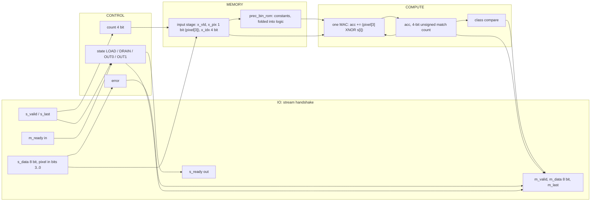
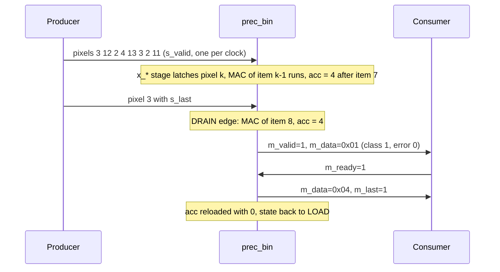
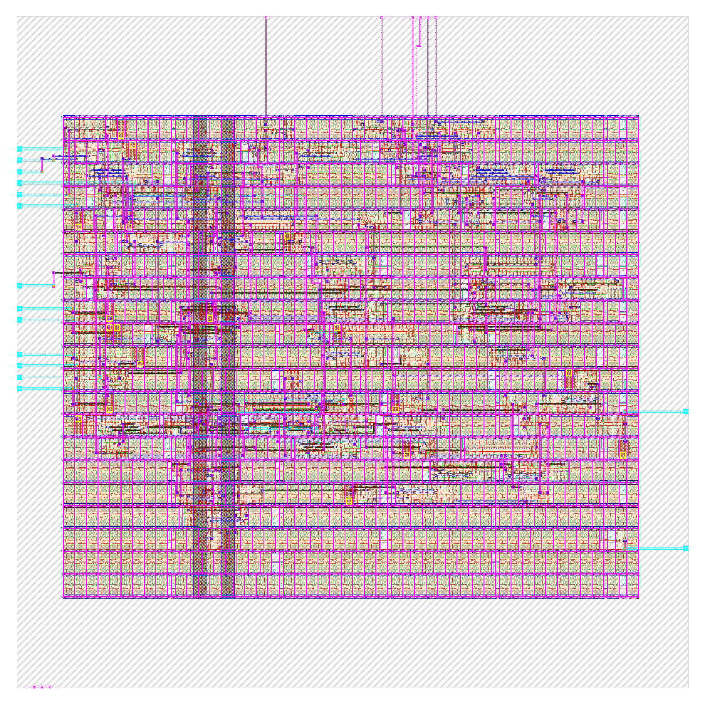

# prec_bin: design notes

## What it is

`prec_bin` is a one-neuron image classifier using 1-bit weights, binarised pixels, XNOR-popcount: it reads a 3 x 3 image of 4-bit pixels, one pixel per clock beat, and answers "vertical bar (1) or horizontal bar (0)?" (source: `designs/prec_bin/README.md`, `model/precision_hw/spec.md` section 1).
Weights are the sign of the fp32 weights (1 = +1, 0 = -1); each pixel is binarised to its top bit (`pixel >= 8`, i.e. `pixel[3]`); the MAC is XNOR then popcount, and the decision is `match count >= T` with T = 3, the threshold with the best training accuracy on the binarised training set (`model/precision_hw/spec.md` section 3.1).
It is one of seven engines that share task, trained fp32 weights, pins and control, and differ only in number format; the four non-float ones are hardened and compared here. The float formats (fp8, fp16, bf16) are still being timing-closed, so they are not in this note.
Output: beat 0 = `{6'b0, error, class}`, beat 1 = fold of the accumulator (`spec.md` section 5.2); latency 2 cycles after the last input beat (`golden.LATENCY`, `spec.md` section 6).
Simulation: `make simulate DESIGN=prec_bin` printed `PASS prec_bin_tb: 931 cases, 4668 checks (results, latency, back-pressure, protocol errors, reset)`.
Hardening: `make flow-all` passed all 5 stages (simulate, gds, check, gate-level, collect) in 57 s total (`build/flow_prec_bin.log`); the stage-2 flow wall time is 45 s (`output/resources.json`).
Test accuracy 88.95 %, 90.30 % same decision as fp32 on 2000 held-out images (`python3 model/precision_hw/report.py`).

## Architecture



Registers (all in `rtl/prec_bin.v`; synchronous active-high reset):

| Register | Width | Purpose |
|---|---|---|
| `state` | 2 | FSM LOAD / DRAIN / OUT0 / OUT1 (Yosys recoded it one-hot: 4 flops) |
| `count` | 4 | beats accepted, saturates at 9; also the pixel index |
| `error` | 1 | sticky: bad item or wrong frame length |
| `x_vld` | 1 | input stage holds a used item |
| `x_pix` | 1 | the pixel (bin: only bit 3) |
| `x_idx` | 4 | its index = ROM address |
| `acc` | 4 | 4-bit unsigned match count, starts at 0 |

RTL flip-flop bits: 17 (sum of the table). `metrics.json` (`design__instance__count__class:sequential_cell`) says 19, and `synth_stat.rpt` lists 19 `dfxtp_2`: the extra 2 are the one-hot recoding of the 4-state FSM (`yosys-synthesis.log`: "mapping auto encoding to `one-hot` for this FSM"; `build/flow/prec_bin/stage_check.log` also reports 19 surviving sequential cells).
There is no multiplier and, after synthesis, not even an XNOR cell: `synth_stat.rpt` lists 0 `xnor2`/`xor2` cells. The ROM bit `s[i]` is a constant, so `pixel[3] XNOR s[i]` is either the bit or its inverse and Yosys folded it into the decode logic on `x_idx`. What remains of the MAC is a 4-bit incrementer (`count += match`) and a 4-bit compare with T = 3, inside 544.27 um^2 of non-flip-flop logic (948.41 - 404.14, my subtraction).
There is no weight RAM: 9 weight bits + a 4-bit T = 13 stored bits (`report.py`), 0 memory cells in the netlist: the ROM is `assign` constants selected by `x_idx` and Yosys folded them into logic.

## Data flow

One concrete image (vertical bar plus noise), `python3 model/precision_hw/golden.py --trace bin 3 12 2 4 13 3 2 11 3`: pixels 3 12 2 / 4 13 3 / 2 11 3.
The `--trace` command prints the final accumulator for integer formats (`integer: acc = 4 (code 4)`, `class 1  beat1 04`); the per-step column below is my own replay of the same rule with the weights of `spec.md` section 3.5 (1 1 1 0 0 0 1 1 1; T = 3 (threshold, 4-bit)), and it ends on the traced value.
Pixel k is accepted at edge k and latched into `x_*`; its MAC executes one edge later, so the MAC of item k overlaps the arrival of pixel k+1 (`spec.md` section 6). Edge 8 carries `s_last`; edge 9 is the DRAIN edge that does the last MAC.

| Edge | Beat accepted (pixel, x_idx) | MAC this edge (item, w, pixel) | acc after edge | State after |
|---|---|---|---|---|
| reset | | | 0 (loaded 0) | LOAD |
| 0 | 3 (idx 0) | none (x_vld = 0) | 0 | LOAD |
| 1 | 12 (idx 1) | item 0: input bit 0, weight bit 1, no match | 0 | LOAD |
| 2 | 2 (idx 2) | item 1: input bit 1, weight bit 1, match +1 | 1 | LOAD |
| 3 | 4 (idx 3) | item 2: input bit 0, weight bit 1, no match | 1 | LOAD |
| 4 | 13 (idx 4) | item 3: input bit 0, weight bit 0, match +1 | 2 | LOAD |
| 5 | 3 (idx 5) | item 4: input bit 1, weight bit 0, no match | 2 | LOAD |
| 6 | 2 (idx 6) | item 5: input bit 0, weight bit 0, match +1 | 3 | LOAD |
| 7 | 11 (idx 7) | item 6: input bit 0, weight bit 1, no match | 3 | LOAD |
| 8 | 3 (idx 8) | item 7: input bit 1, weight bit 1, match +1 | 4 | DRAIN |
| 9 | none (DRAIN) | item 8: input bit 0, weight bit 1, no match | 4 | OUT0 |

Result: class 1 (acc 4 >= T = 3), beat 0 = 0x01 (error 0, class 1), beat 1 = 0x04 (`golden.py --trace`), `m_valid` high from the edge after the DRAIN edge (latency 2).



## Verification

Testbench: `designs/prec_bin/tb/prec_bin_tb.v` (defines `DUT prec_bin` and includes the shared body `shared/tb/stream_tb.vh`), `+VEC=designs/prec_bin/tb/vectors.hex`. For every case it sends the frame with random `s_valid` gaps, takes the two result beats with random `m_ready` stalls, and compares beat 0, beat 1, `m_last` and the latency; it also checks that the outputs hold under back-pressure, that `s_ready` is low from the last beat until the result is taken, and that reset mid-frame or with a result waiting returns to an empty ready state. Comparisons use `!==`, so X never passes; the first failure calls `$fatal`.
Fresh `make simulate DESIGN=prec_bin`: `PASS prec_bin_tb: 931 cases, 4668 checks (results, latency, back-pressure, protocol errors, reset)`

Vectors: `designs/prec_bin/tb/vectors.hex` is generated by `model/precision_hw/gen.py` from `golden.py`; the same 931 inputs are used for every format and only the expected values differ (`spec.md` section 8): 600 held-out test images, 37 further images where a non-binary format disagrees with fp32, 16 uniform images (v = 0..15), 27 single bright/dark/8-on-7 pixel images, 4 ideal bars/checkerboards, 16 sum-maximising/minimising images, 120 near-boundary random images, 60 uniform-random images, 8 short frames, 3 long frames, 36 out-of-range items (4 values x 9 positions), 4 short/bad-frame cases. 600+37+16+27+4+16+120+60+8+3+36+4 = 931. Every format sees 51 error cases.
Model level: `python3 model/precision_hw/golden.py --check` ends `golden: all self-checks passed`; for this format `tern/int4/int8/bin datapath == plain integer reference (2025 images) ok`, plus the accumulator-range lines quoted above.
Gate level: the same testbench runs on the synthesised netlist (`build/gl/prec_bin/runs/gl/final/nl/prec_bin.nl.v`, 83 cells, my grep count of sky130 instances) and on the routed netlist (`designs/prec_bin/runs/RUN_2026-10-05_20-16-32/final/nl/prec_bin.nl.v`, 895 instances including taps, fill and diodes, equal to `design__instance__count`). `build/flow/prec_bin/stage_gl_synth.log` ends `gl_sim: prec_bin PASS (4 s)` and `stage_gl_final.log` ends `gl_sim: prec_bin PASS (1 s)`; `build/gl/prec_bin/synth_checks.txt` reads `synthesis__check_error__count = 0`.
Signoff: `build/flow_prec_bin.log` stage 3: `check : PASS ... DRC/LVS/XOR/antenna, slack at all corners, no logic lost (scripts/flow/check_signoff.py)`; `stage_check.log` reports `registers: RTL 19 (allowance 0), surviving sequential cells 19`.
Negative tests: none in `tests/run_tests.sh` yet, and none recorded in `designs/prec_bin/README.md`, so a wrong ROM constant being caught is not demonstrated beyond the 931-case coverage.

## Layout (GDSII)



The picture (`output/layout.png`, KLayout render) shows the 80 x 80 um die (`design__die__bbox`, `config.json`; 6400 um^2) with the core inside (`design__core__bbox` = `5.52 10.88 74.06 68.0`, 3915 um^2). Standard cells sit in horizontal rows, the power grid is on the upper metals and the 26 I/O (24 signals plus `vccd1`, `vssd1`; `design__io`) are on the edges.
Utilisation is 0.376478 (`design__instance__utilization`): 199 std cells, 1473.91 um^2 (`design__instance__area__stdcell`). In the final layout there are also 696 fill-class cells (605 `decap_3`, 46 `fill_1`, 45 `fill_2`; 2441.09 um^2, `metrics.json` and `cell_usage.rpt`), 57 tap cells and 18 antenna diodes.

## From RTL to GDSII: what each step did

### Synthesis

Yosys mapped the RTL to 83 sky130_fd_sc_hd cells, 948.41 um^2, of which 404.14 um^2 (42.6 %) is the 19 `dfxtp_2` flip-flops (`output/reports/synth_stat.rpt`). Main contributors: 19 `dfxtp_2` (404.138 um^2, 42.6 %), 8 `and2b_2` (70.067), 4 `conb_1` tie cells (15.014), 3 each of `and3b_2`, `and4b_2`, `a31o_2` and `mux2_1`, 5 `nor2_2`, 4 `nand2_2`, 4 `or2_2`. `synth_checks.rpt`: "Found and reported 0 problems"; `synthesis__check_error__count` = 0, lint warnings 447 (`design__lint_warning__count`).
Report: [synth_stat.rpt](output/reports/synth_stat.rpt), [synth_checks.rpt](output/reports/synth_checks.rpt).

### Floorplan

Die 80 x 80 um from `config.json`; core 3915 um^2; 83 instances (948.410 um^2) give an effective utilisation of 0.242 before repair, CTS, taps and fill (`floorplan.txt`).
Report: [floorplan.txt](output/reports/floorplan.txt).

### Placement

Global placement ended at iteration 348 with HPWL 1384 um and 87 routability-mode iterations; final weighted congestion 0.902; placed cell area 1078.29 um^2, +0.00 % growth (`placement_global.txt`). Detailed placement: original HPWL 1649.7 u, legalised 1708.1 u (+4 %); the step's own displacement lines read 0.0 u, while `design__instance__displacement__total` = 46.26 um (`placement_detailed.txt`, `metrics.json`). Timing repair added 35 buffers, 276.515 um^2 (`design__instance__count__class:timing_repair_buffer`, `design__instance__area__class:timing_repair_buffer`).
Reports: [placement_global.txt](output/reports/placement_global.txt), [placement_detailed.txt](output/reports/placement_detailed.txt).

### Clock tree

TritonCTS: 1 clock root, 5 buffers inserted, 19 sinks (equal to the flip-flop count) (`cts.rpt`). Worst setup-side skew 0.2514 ns (`clock__skew__worst_setup`); 9 hold buffers were inserted (`design__instance__count__hold_buffer`); 6 clock-buffer-class cells in the final design (`metrics.json`).
Report: [cts.rpt](output/reports/cts.rpt).

### Routing

Global routing: 133 routed nets, `global_route__wirelength` = 3808, `global_route__vias` = 789 (`metrics.json`) (`routing_global.txt`). Detailed routing: DRC violations per iteration 19, 6, 3, 0 (`route__drc_errors__iter:*`), final `route__drc_errors` = 0; wire length 2154 um (met1 1103, met2 891, met3 159 um, `routing_detailed.txt`), 787 vias, longest net 112.235 um (`route__wirelength__max`).
Reports: [routing_global.txt](output/reports/routing_global.txt), [routing_detailed.txt](output/reports/routing_detailed.txt).

### Timing

Clock period 25 ns (`config.json`). All corners pass, setup and hold TNS 0 (`timing_summary.rpt`, `metrics.json`).

| Corner | Worst setup slack (ns) | Worst hold slack (ns) |
|---|---|---|
| nom_tt_025C_1v80 | 18.1162 | 0.3298 |
| nom_ss_100C_1v60 | 16.4069 | 0.9187 |
| nom_ff_n40C_1v95 | 18.6932 | 0.1156 |
| Overall worst | 16.3956 (max_ss_100C_1v60) | 0.1139 (min_ff_n40C_1v95) |

Worst setup path (`timing_paths_max_ss.rpt`): `m_ready` (input port) to flip-flop `_117_`, slack 16.395647 ns, data arrival 8.671 ns. Worst hold path (`timing_paths_min_ff.rpt`): flip-flop `_129_` back to itself, slack 0.113914 ns.
Reports: [timing_summary.rpt](output/reports/timing_summary.rpt), [timing_paths_max_ss.rpt](output/reports/timing_paths_max_ss.rpt), [timing_paths_min_ff.rpt](output/reports/timing_paths_min_ff.rpt).

### DRC

Magic `COUNT: 0` (`drc_magic.rpt`); KLayout: all 257 rule entries in `drc_klayout.json` are 0 (my sum); `manufacturability.rpt`: DRC Passed.
Reports: [drc_magic.rpt](output/reports/drc_magic.rpt), [drc_klayout.json](output/reports/drc_klayout.json), [manufacturability.rpt](output/reports/manufacturability.rpt).

### LVS

`lvs_netgen.rpt`: "Circuits match uniquely." with 139 devices and 140 nets each side; `manufacturability.rpt`: LVS Passed.
Report: [lvs_netgen.rpt](output/reports/lvs_netgen.rpt).

### Power / IR drop

Total power 1.0548e-04 W (`power__total`: internal 8.339e-05, switching 2.208e-05 W). `irdrop.rpt` (its own total 9.04e-05 W): vccd1 worst IR drop 8.55e-05 V, average 2.36e-05 V; vssd1 worst 8.82e-05 V (the worst vccd1 drop is 0.0047 % of 1.8 V, my division).
Report: [irdrop.rpt](output/reports/irdrop.rpt).

### Antenna, slew, capacitance

18 antenna diodes inserted (`design__instance__count__class:antenna_cell`); `antenna__violating__nets` = 0; `manufacturability.rpt`: Antenna Passed. Max-cap violations 0, max-slew violations 0, max-fanout violations 1 (`design__max_cap_violation__count`, `design__max_slew_violation__count`, `design__max_fanout_violation__count`).
Report: [cell_usage.rpt](output/reports/cell_usage.rpt).

## Run time and memory

From `output/resources.json` (profile "tight": 2 CPUs, 8 GB): total wall time 45 s, container peak memory 698,249,216 bytes (0.65 GB), 78 steps. Whole `flow-all` 57 s (`build/flow_prec_bin.log`; gate-level stages 4 s and 1 s).

| Step | Wall time (s) |
|---|---|
| 46-openroad-detailedrouting | 4.839 |
| 35-openroad-cts | 3.956 |
| 67-klayout-drc | 2.453 |

## Reproduce

```bash
python3 model/precision_hw/golden.py --check   # self-checks
python3 model/precision_hw/gen.py              # rtl/prec_bin_rom.v and tb/vectors.hex
make simulate DESIGN=prec_bin                       # RTL simulation, 931 cases
make flow-all DESIGN=prec_bin                       # simulate, gds, check, gate-level, collect
python3 model/precision_hw/report.py           # study table incl. this design's metrics
```

`rtl/prec_bin_rom.v` is generated (header carries the sha256 of `golden.py` and `gen.py`); never edit it.

## Comparison of the four hardened formats

The float formats (fp8, fp16, bf16) are still being timing-closed, so they are not in this table.

| Metric | prec_bin | prec_tern | prec_int4 | prec_int8 | Source |
|---|---|---|---|---|---|
| Std cells | 199 | 293 | 377 | 642 | `design__instance__count__stdcell` (metrics.json) |
| Synthesised cells | 83 | 160 | 230 | 352 | `synth_stat.rpt` |
| Flip-flops | 19 | 28 | 30 | 35 | `design__instance__count__class:sequential_cell` |
| Std-cell area (um^2) | 1473.91 | 2484.88 | 3263.13 | 4859.66 | `design__instance__area__stdcell` |
| Die (um) | 80 x 80 | 80 x 80 | 80 x 80 | 120 x 120 | `config.json`, `design__die__bbox` |
| Utilisation | 0.376 | 0.635 | 0.833 | 0.457 | `design__instance__utilization` |
| Routed wirelength (um) | 2154 | 3895 | 6171 | 8187 | `route__wirelength` |
| Worst setup slack (ns) | 16.40 | 16.35 | 13.46 | 11.39 | `timing__setup__ws` |
| Worst hold slack (ns) | 0.114 | 0.112 | 0.115 | 0.111 | `timing__hold__ws` |
| Total power (W) | 1.0548e-04 | 1.4394e-04 | 1.8792e-04 | 2.4041e-04 | `power__total` |
| Test accuracy (%) | 88.95 | 94.15 | 94.25 | 94.05 | `report.py` |
| Same decision as fp32 (%) | 90.30 | 98.80 | 98.90 | 100.00 | `report.py` |
| Parameter bits | 13 | 27 | 47 | 88 | `report.py` |
| Bits moved / inference | 22 | 63 | 83 | 124 | `report.py` |

## Intuitions and insights

1. **What the format is and how the weights came about.** The weights are not free parameters here: they are the signs of the nine trained fp32 weights (weight bits 1 1 1 0 0 0 1 1 1, `spec.md` section 3.5), the pixels are cut to one bit, and T = 3 was chosen on the binarised training set. The learning is real (the fp32 neuron came from logistic regression), but the quantisation throws away every magnitude.

2. **Accuracy: the only format that loses.** 88.95 % test accuracy and 90.30 % same decision as fp32, against 94.05 % for fp32 (`report.py`). `spec.md` section 9 gives the reason: a sign-only weight cannot say "this pixel hardly matters", so the corner and centre pixels, whose fp32 weights are 0.0148, -0.0191 and 0.0008, vote with full strength, and a binarised pixel (`>= 8`) cannot express brightness 7 versus 9.

3. **What the MAC costs in gates.** Nothing you can point at: no multiplier, no adder beyond an incrementer, and 0 xor/xnor cells in `synth_stat.rpt` because the constant weight bit folds the XNOR into plain decode logic. 83 cells, 948.41 um^2 at synthesis, 19 flip-flops of which 404.14 um^2 (42.6 %), the largest flip-flop share of the four. Four tie cells (`conb_1`) hold the always-zero upper bits of `m_data`.

4. **Accumulator width.** 4 bits for a count that tops out at 9. The accumulator is 4 of the 19 flip-flops; the other 15 are control and the input stage, so for the binary format the stream plumbing, not the arithmetic, is the design (the RTL header says the same).

5. **Weight memory versus what synthesis did.** The parameters are 13 bits (`report.py`) but there is no storage: the ROM is `assign` constants selected by `x_idx` and Yosys folded them into logic, so the area (1473.91 um^2 of std cells after the flow) is hard-wired weights, not a memory. A programmable version would need those 13 bits as flops, 13 x 21.3 um^2 = 277 um^2 at `dfxtp_2` size (404.138 / 19 = 21.27 um^2, my arithmetic).

6. **Bits moved.** 22 bits per inference into the MAC and parameters (9 x 1 inputs + 13 parameter bits, `report.py`), versus 356 for fp32: 16x less. The stream pins still carry 72 bits in and 16 out for every format (`report.py` footnote), so on this interface the saving is internal only.

7. **Timing headroom.** The single-stage MAC closes with 16.3956 ns worst setup slack of 25 ns (`timing_summary.rpt`); the worst path is the input `m_ready` to a flop, not the arithmetic. Unlike the float formats, which needed a 2-stage MAC and latency 3 (`spec.md` section 6), no pipelining was needed. The tight number is hold: 0.1139 ns at min_ff, and the flow inserted 9 hold buffers (`design__instance__count__hold_buffer`).

8. **Where the area goes.** 199 std cells = 83 synthesised + 35 timing-repair buffers + 6 clock buffers + 18 diodes + 57 taps (my sum, matches `design__instance__count__stdcell`). The 35 repair buffers cost 276.52 um^2, 29 % of the synthesised area, and fill (696 cells, 605 of them `decap_3`, 2441.09 um^2) is more than the logic: at utilisation 0.376 the die is mostly empty.

9. **Why it is still the right engine for some jobs.** Smallest everything: 199 cells, 2154 um wire, 105 uW, 22 bits moved. Its 88.95 % is the price: ternary costs +94 std cells (293 vs 199, 1.47x) and buys +5.2 accuracy points (94.15 vs 88.95 %, `report.py`).

10. **Check on honesty.** Accuracy comes from 2000 simulated images from the same generator as the training set, so it is a statement about this synthetic task, not about real bars. Differences below a few tenths of a point are noise at this sample size (`spec.md` section 9).
