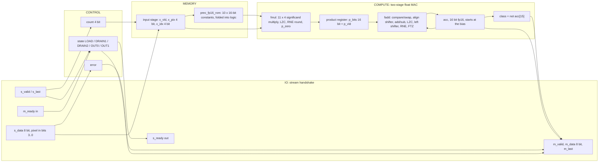
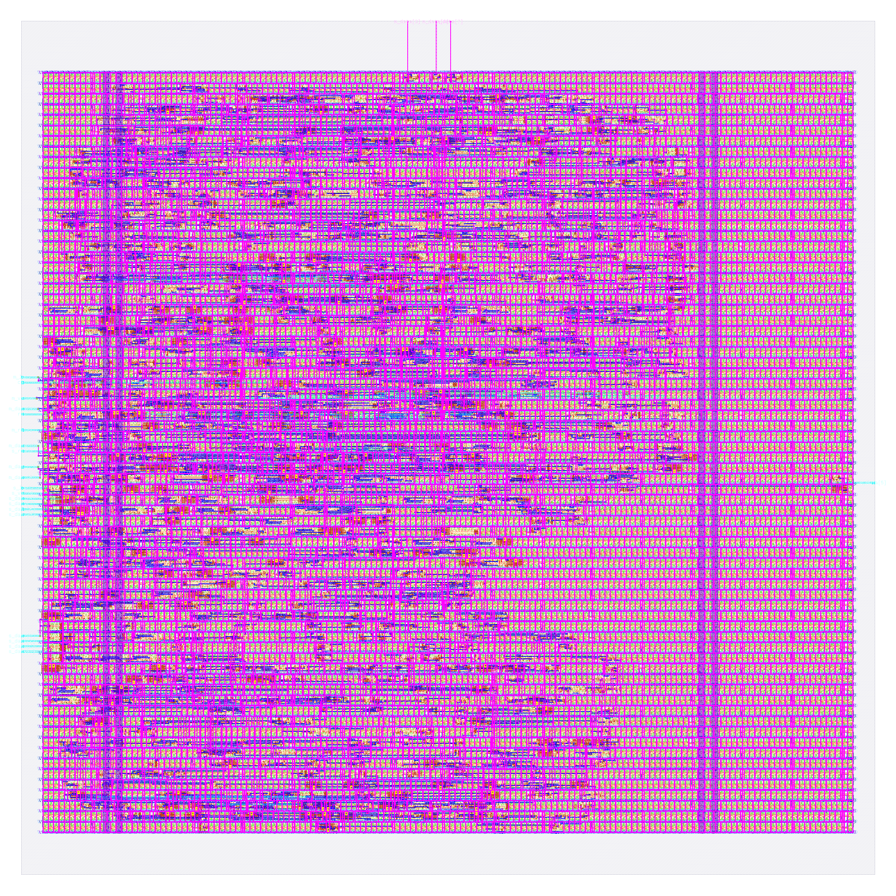

# prec_fp16: design notes

## What it is

`prec_fp16` is a one-neuron image classifier using IEEE 754 binary16 (half precision) weights: it reads a 3 x 3 image of 4-bit pixels, one pixel per clock beat, and answers "vertical bar (1) or horizontal bar (0)?" (source: `designs/prec_fp16/README.md`, `model/precision_hw/spec.md`).
Binary16 is 1 sign bit, 5 exponent bits (bias 15), 10 stored mantissa bits (11-bit significand with the hidden 1); smallest normal 2^-14 (`README.md`). The 10 parameters are the fp32 logistic-regression weights rounded to nearest even and stored as 16-bit patterns, e.g. `W1 = 16'h34A8 = +0.291015625` and bias `16'hB1CD = -0.181274414` (`rtl/prec_fp16_rom.v`).
It is one of seven engines that share task, trained fp32 weights, pins and control, and differ only in number format (`docs/PRECISION_STUDY.md`). Hardware: ONE float multiply-accumulate unit used for the 9 inputs, one per clock, in two pipeline stages: `prec_fp16_fmul` (weight x pixel, product rounded to fp16 RNE, then registered) and `prec_fp16_fadd` (fp16 accumulate with RNE, flush-to-zero below 2^-14). Unfused: two roundings per step.
Output: beat 0 = `{6'b0, error, class}`, beat 1 = `acc[15:8] ^ acc[7:0]`; latency 3 cycles after the last input beat (`rtl/prec_fp16.v` header, `golden.LATENCY`).
Simulation: `make simulate DESIGN=prec_fp16` printed `PASS prec_fp16_tb: 931 cases, 4668 checks (results, latency, back-pressure, protocol errors, reset)`.
Hardening: `make flow-all DESIGN=prec_fp16` passed all 5 stages (simulate 1 s, gds 105 s, check 1 s, gate-level 7 s and 4 s, collect 5 s; total 123 s) in `build/prec_fp16_a1.log`; stage logs in `build/flow/prec_fp16/stage_*.log`. Closure needed tool timing repair on top of the pipelined RTL (see Timing).
Test accuracy 94.05 %, 100.00 % same decision as fp32 on 2000 held-out images (`python3 model/precision_hw/report.py`).

## Architecture



Registers (all in `rtl/prec_fp16.v`; synchronous active-high reset):

| Register | Width | Purpose |
|---|---|---|
| `state` | 3 | FSM LOAD / DRAIN1 / DRAIN2 / OUT0 / OUT1 (Yosys recoded it one-hot: 5 flops) |
| `count` | 4 | beats accepted, saturates at 9; also the pixel index |
| `error` | 1 | sticky: bad item or wrong frame length |
| `x_vld` | 1 | input stage holds a used item |
| `x_pix` | 4 | the unsigned 4-bit pixel |
| `x_idx` | 4 | its index = ROM address |
| `p_vld` | 1 | `p_bits` holds a nonzero product to add on the next edge (0 for a skipped item or a zero product) |
| `p_bits` | 16 | the product, already rounded to fp16: the pipeline cut between `fmul` and `fadd` |
| `acc` | 16 | fp16 running sum, starts at the bias; class = ~sign |

RTL flip-flop bits: 50 (sum of the table; `README.md` also says 50, "was 32 with the single-cycle MAC"). `metrics.json` (`design__instance__count__class:sequential_cell`) says 52, `synth_stat.rpt` lists 52 `dfxtp` and `cell_usage.rpt` shows 50 `dfxtp_2` + 2 `dfxtp_4` (resizer upsizing): the extra 2 are the one-hot recoding of the 5-state FSM, 3 bits become 5 (`yosys-synthesis.log`: "mapping auto encoding to `one-hot` for this FSM"; `build/flow/prec_fp16/stage_check.log`: `registers: RTL 52 (allowance 0), surviving sequential cells 52`).
Flip-flops are 1111.07 um^2 of the 11912.7 um^2 std-cell area (`design__instance__area__class:sequential_cell`, `design__instance__area__stdcell`), 9.3 % (my division); at synthesis 12.55 % of 8810.95 um^2 (`synth_stat.rpt`).
`fmul` unpacks the weight (exponent 0 means zero, FTZ), multiplies the 11-bit significand by the 4-bit integer pixel exactly (15-bit product), counts leading zeros (at most 4 places), shifts, rounds with guard/sticky and packs; `p_zero` (weight or pixel zero) suppresses `p_vld`. `fadd` orders the operands by magnitude, aligns the smaller by the 5-bit exponent difference with a sticky bit, adds or subtracts 14-bit operands into a 15-bit sum, counts leading zeros up to 15 places, left-shifts, rounds and flushes below 2^-14 (`rtl/prec_fp16.v`).
There is no weight RAM: 10 x 16 = 160 parameter bits (`report.py`) are constants in `rtl/prec_fp16_rom.v`, a 9-way mux of 16-bit constants feeding the multiplier.

## Data flow

One concrete image (vertical bar plus noise), `python3 model/precision_hw/golden.py --trace fp16 3 12 2 4 13 3 2 11 3`: pixels 3 12 2 / 4 13 3 / 2 11 3.
The trace prints every MAC step (weight, pixel, rounded product bits, accumulator bits) and ends `class 1  beat1 2b`; the edge numbering below is my mapping of those steps onto the schedule of `spec.md` section 6 and the RTL. Pixel k is accepted at edge k, its product is registered at edge k+1 (stage 1), added into `acc` at edge k+2 (stage 2): so while item k is added, item k+1 is multiplied and item k+2 is accepted. Edge 8 carries `s_last`; edges 9 and 10 are DRAIN1 and DRAIN2.

| Edge | Beat accepted (pixel, x_idx) | Stage 1 this edge (item, product into `p_bits`) | Stage 2 this edge (add into `acc`) | `acc` after edge | State after |
|---|---|---|---|---|---|
| reset | | | | b1cd = -0.181274 (bias) | LOAD |
| 0 | 3 (idx 0) | none (x_vld = 0) | none | b1cd | LOAD |
| 1 | 12 (idx 1) | item 0: w +0.014786 x 3 = 29ae (+0.044373) | none | b1cd | LOAD |
| 2 | 2 (idx 2) | item 1: w +0.291016 x 12 = 42fc (+3.492188) | item 0 | b062 = -0.136963 | LOAD |
| 3 | 4 (idx 3) | item 2: w +0.028854 x 2 = 2b63 (+0.057709) | item 1 | 42b6 = +3.355469 | LOAD |
| 4 | 13 (idx 4) | item 3: w -0.316650 x 4 = bd11 (-1.266602) | item 2 | 42d4 = +3.414063 | LOAD |
| 5 | 3 (idx 5) | item 4: w -0.019089 x 13 = b3f1 (-0.248169) | item 3 | 404c = +2.148438 | LOAD |
| 6 | 2 (idx 6) | item 5: w -0.267090 x 3 = ba69 (-0.801270) | item 4 | 3f9a = +1.900391 | LOAD |
| 7 | 11 (idx 7) | item 6: w +0.044586 x 2 = 2db5 (+0.089172) | item 5 | 3c66 = +1.099609 | LOAD |
| 8 | 3 (idx 8), `s_last` | item 7: w +0.294678 x 11 = 427c (+3.242188) | item 6 | 3cc1 = +1.188477 | DRAIN1 |
| 9 | none | item 8: w +0.000830 x 3 = 191a (+0.002491) | item 7 | 446e = +4.429688 | DRAIN2 |
| 10 | none | none | item 8 | 446f = +4.433594 | OUT0 |

Result: class 1 (acc >= 0), beat 0 = 0x01 (error 0, class 1), beat 1 = 0x44 ^ 0x6f = 0x2b (`golden.py --trace`: `beat1 2b`); `m_valid` rises after edge 10, three edges (8, 9, 10) after the one that accepted the last beat. Note edge 10: adding the product 0.002491 to 4.429688 moves the sum by exactly one fp16 step (2^-8 = 0.003906 at this magnitude), a rounding the model reproduces bit for bit.

```mermaid
sequenceDiagram
    participant P as Producer
    participant D as prec_fp16
    participant C as Consumer
    P->>D: pixels 3 12 2 4 13 3 2 11 (s_valid, one per clock)
    Note over D: edge k accepts pixel k, stage 1 rounds product k-1, stage 2 adds product k-2
    P->>D: pixel 3 with s_last (edge 8)
    Note over D: edge 9 DRAIN1: product of item 8 registered; edge 10 DRAIN2: acc = 446f (+4.4336)
    D->>C: m_valid=1, m_data=0x01 (class 1, error 0)
    C->>D: m_ready=1
    D->>C: m_data=0x2b, m_last=1
    Note over D: acc reloaded with the bias, state back to LOAD
```

## Verification

Testbench: `designs/prec_fp16/tb/prec_fp16_tb.v` (defines `DUT prec_fp16` and includes the shared body `shared/tb/stream_tb.vh`), `+VEC=designs/prec_fp16/tb/vectors.hex`. For every case it sends the frame with random `s_valid` gaps, takes the two result beats with random `m_ready` stalls, and compares beat 0, beat 1, `m_last` and the latency; it also checks that outputs hold under back-pressure, that `s_ready` is low from the last beat until the result is taken, and that reset mid-frame or with a result waiting returns to an empty ready state. Comparisons use `!==`, so X never passes; the first failure calls `$fatal`.
Fresh `make simulate DESIGN=prec_fp16`: `PASS prec_fp16_tb: 931 cases, 4668 checks (results, latency, back-pressure, protocol errors, reset)`

Vectors: `designs/prec_fp16/tb/vectors.hex` is generated by `model/precision_hw/gen.py` from `golden.py`; the same 931 inputs are used for every format and only the expected values differ (`spec.md` section 8): 600 held-out test images, 37 further images where a non-binary format disagrees with fp32, 16 uniform images (v = 0..15), 27 single bright/dark/8-on-7 pixel images, 4 ideal bars/checkerboards, 16 sum-maximising/minimising images, 120 near-boundary random images, 60 uniform-random images, 8 short frames, 3 long frames, 36 out-of-range items (4 values x 9 positions), 4 short/bad-frame cases. 600+37+16+27+4+16+120+60+8+3+36+4 = 931 (group list as recorded in `designs/prec_int8/NOTES.md`; I did not re-derive it from the hex file). Every format sees 51 error cases.
Model level: `python3 model/precision_hw/golden.py --check` ends `golden: all self-checks passed`; for this format the lines are `fp16 RNE vs struct 'e' on 19342 random doubles ok`, `ties to even: fp16(1+2^-11)=1, fp16(1+3*2^-11)=1+2^-9 ok`, `FTZ: fp16(2^-15) = +0 ... ok`, `fp16 + fp8 datapath == double replay rounded by struct 'e' (60576 ops) ok` and `fp16: |acc| <= 19.52 < max finite 6.55e+04; smallest product 0.00083 >= min normal ok` (the proof that no Inf/NaN/subnormal logic is needed).
The 60,000-pair float-unit check: the closest thing I found is the 60576-op replay above (it covers fp16 and fp8 together, in the Python model); a separate 60,000-pair RTL float-unit check is not recorded in `designs/prec_fp16/README.md` or `spec.md`, so I do not claim it.
Gate level: the same testbench runs on the synthesised netlist (`build/gl/prec_fp16/runs/gl/final/nl/prec_fp16.nl.v`, 905 cells, my grep count of sky130 instances, equal to `synth_stat.rpt`) and on the routed netlist (`designs/prec_fp16/runs/RUN_2026-10-05_20-25-56/final/nl/prec_fp16.nl.v`, 10158 instances including taps, fill and diodes, equal to `design__instance__count`). `build/flow/prec_fp16/stage_gl_synth.log` ends `gl_sim: prec_fp16 PASS (2 s)` and `stage_gl_final.log` ends `gl_sim: prec_fp16 PASS (3 s)`, each preceded by the 931-case PASS line; `build/gl/prec_fp16/synth_checks.txt` reads `synthesis__check_error__count = 0`.
Signoff: `build/prec_fp16_a1.log` stage 3: `check : PASS ... DRC/LVS/XOR/antenna, slack at all corners, no logic lost (scripts/flow/check_signoff.py)`; `stage_check.log` reports `registers: RTL 52 (allowance 0), surviving sequential cells 52`.
Earlier failed run, for contrast: `build/flow_prec_fp16.log` (the pre-repair attempt) shows `FAIL: timing: timing__setup__wns = -1.317747726013381`, 14 violating endpoints at nom_ss and min_ss, and the check stage failing, with gate-level stages not run.
Negative tests: none recorded in `designs/prec_fp16/README.md`, and `tests/run_tests.sh` only lists the design among the new engines (`NEWENG`); I did not find a negative test specific to this design, so a wrong ROM constant or a broken rounder being caught is not demonstrated beyond the 931-case coverage.

## Layout (GDSII)



The picture (`output/layout.png`, KLayout render) shows the 220 x 220 um die (`design__die__bbox`, `config.json`; 48400 um^2) with the core inside (`design__core__bbox` = `5.52 10.88 214.36 206.72`, 40899.2 um^2, `design__instance__area`). Standard cells sit in horizontal rows, the power grid is on the upper metals and the 26 I/O (24 signals plus `vccd1`, `vssd1`; `design__io`) are on the edges.
Utilisation is 0.291269 (`design__instance__utilization`): 1932 std cells, 11912.7 um^2 (`design__instance__area__stdcell`). In the final layout there are also 8226 fill-class cells (7279 `decap_3`, 564 `fill_1`, 383 `fill_2`; 28986.6 um^2, `metrics.json` and `cell_usage.rpt`); the 1932 are 905 synthesised + 180 timing-repair buffers + 13 clock buffers + 242 antenna diodes + 592 tap cells (my sum, equal to the metric).

## From RTL to GDSII: what each step did

### Synthesis

Yosys mapped the RTL to 905 sky130_fd_sc_hd cells, 8810.95 um^2, of which 1106.06 um^2 (12.55 %) is the 52 `dfxtp_2` flip-flops (`output/reports/synth_stat.rpt`). Main contributors: 92 `mux2_1` (about 1.04e3 um^2, 11.8 % of the area, my division; barrel shifters and selects), 37 `xnor2_2` + 26 `xor2_2` = 63 xor/xnor (601.83 + 422.91 um^2), 85 `nor2_2`, 64 `nand2_2`, 49 `or2_2`, 45 `a21oi_2`, 44 `inv_2`, 41 `a21o_2`, 40 `and2_2`, 32 `o21ai_2`, 28 `and3_2`, 22 `and2b_2`, 20 `o211a_2`.
The mix by function (the report does not label them, so this is my reading of the RTL):
- Muxes and shifters: 92 muxes, against 3 to 4 in the integer designs (`docs/PRECISION_STUDY.md` cell-mix table). The alignment shifter in `fadd` (a 28-bit funnel shifted right by a 5-bit difference), the left normaliser (15 bits, shift up to 15 places), the `fmul` normaliser (shift up to 4) and the ROM mux account for them.
- The 11 x 4 mantissa multiplier: yosys flattens `*` into xor/and-or-invert gates and does not report it as a unit, so I cannot give its area; the 63 xor/xnor are shared between the multiplier partial-product sums, the subtract-or-add conditional inversion, and the 5-bit exponent arithmetic.
- Leading-zero counters: two instances of `prec_fp16_lzc` (15-bit input, 5-bit result) built from priority `for` loops, i.e. chains of and/or/a21o gates, not a labelled block.
- Comparison: the `a_big` magnitude compare (15 bits) and the 16-bit swap muxes.
`synth_checks.rpt` and `synthesis__check_error__count` = 0; lint warnings 452 (`design__lint_warning__count`).
Report: [synth_stat.rpt](output/reports/synth_stat.rpt), [synth_checks.rpt](output/reports/synth_checks.rpt).

### Floorplan

Die 220 x 220 um from `config.json` (the `//DIE_AREA` key says it was a start value sized for roughly 40 % utilisation of 3-5k cells; the design came out at 905 synthesised cells); core 40899.226 um^2; 905 instances (8810.950 um^2) give an effective utilisation of 0.215 before repair, CTS, taps and fill (`floorplan.txt`: `IFP-0104 Effective utilization: 0.215`).
Report: [floorplan.txt](output/reports/floorplan.txt).

### Placement

Global placement (`-density 0.33354 -routability_driven`) ended at iteration 445 with HPWL 2.217e4 um and 65 routability-mode iterations; final weighted congestion 0.8477, routing overflow 0, placed cell area 9738.72 um^2, +0.00 % inflation (`placement_global.txt`, `GPL-1001`, `GPL-1003`, `GPL-1005`). Detailed placement shows HPWL 26034.3 u legalised from 25383.2 u (+3 %) in one step and 26034.3 u back to 25383.2 u (-2.5 %) in another; the step's own displacement lines read 0.0 u, while `design__instance__displacement__total` = 2.3 um (`placement_detailed.txt`, `metrics.json`). Timing repair added 180 buffers, 1223.67 um^2 (`design__instance__count__class:timing_repair_buffer`, `design__instance__area__class:timing_repair_buffer`), 3 of them setup buffers (`design__instance__count__setup_buffer`).
Reports: [placement_global.txt](output/reports/placement_global.txt), [placement_detailed.txt](output/reports/placement_detailed.txt).

### Clock tree

TritonCTS: 1 clock root, 9 `clkbuf_16` buffers inserted plus 4 dummy `clkbuf_4` loads, 52 sinks (equal to the flip-flop count) (`cts.rpt`). Worst setup-side skew 0.2544 ns (`clock__skew__worst_setup`); 0 hold buffers (`design__instance__count__hold_buffer`); 13 clock-buffer-class cells in the final design (`metrics.json`).
Report: [cts.rpt](output/reports/cts.rpt).

### Routing

Global routing: 1107 nets, `global_route__wirelength` = 45429, `global_route__vias` = 7634 (`metrics.json`; the log line `GRT-0018` says 44325 um and `GRT-0111` 7405 vias, taken before the final repair, my reading). Detailed routing: DRC violations per iteration 220, 46, 61, 0 (`route__drc_errors__iter:*`), final `route__drc_errors` = 0; wire length 28736 um (met1 15700, met2 12306, met3 730, met4 0 um, `routing_detailed.txt`), 7872 vias, all single-cut (`route__vias__singlecut`), longest net 206.4 um (`route__wirelength__max`). `RT_MAX_LAYER` is met4 (`config.json`).
Reports: [routing_global.txt](output/reports/routing_global.txt), [routing_detailed.txt](output/reports/routing_detailed.txt).

### Timing

Clock period 25 ns (`config.json`). All corners pass, setup and hold TNS 0 (`timing_summary.rpt`, `metrics.json`); but all three ss corners are within half a nanosecond of zero.

| Corner (max / nom / min libs) | Worst setup slack (ns) | Worst hold slack (ns) |
|---|---|---|
| max_ss_100C_1v60 | 0.1106 | 0.8995 |
| nom_ss_100C_1v60 | 0.2815 | 0.8953 |
| min_ss_100C_1v60 | 0.4337 | 0.8905 |
| nom_tt_025C_1v80 | 12.1783 | 0.3173 |
| nom_ff_n40C_1v95 | 16.9900 | 0.1139 |
| Overall worst | 0.1106 (max_ss_100C_1v60) | 0.1108 (min_ff_n40C_1v95) |

(`timing_summary.rpt`; the README quotes hold >= 0.107 ns, the metrics file's overall worst is 0.1108, the file is the source here.)
Worst setup path (`timing_paths_max_ss.rpt`, max_ss_100C_1v60): from `_1720_` (netlist `add.pbits[7]`, i.e. product-register bit 7, `dfxtp_4`) to `_1740_` (`acc[12]`), data arrival 25.106873 ns against data required 25.217434 ns (library setup 0.278 ns, clock uncertainty 0.25 ns), slack 0.110562 ns. The path is the adder stage, not the multiplier: from `p_bits` through an `and2b`, a chain of `or4`/`or3`/`o311a`/`or4b`/`a211oi` (the magnitude compare and swap), `mux2` and `a21bo`, high-fanout buffers into an `xnor2` (add or subtract), then `or4b_4`, `a2111o_2`, `a32o`, `xor2`, `o211a`, a `mux2_1` and `mux2_2` (normalise shifter) and finally the rounder into `acc`. Single cells at this corner are slow: `or4b_4` 1.108 ns, `or4_4` 1.053 ns, `or3_2` 0.985 ns, `a2111o_2` 0.963 ns, `mux2_1` 0.786 ns, the launching flop clk-to-Q 0.783 ns (cell names and delays from the path listing; the stage grouping is my reading). Worst hold path (`timing_paths_min_ff.rpt`): `_1698_` to `_1708_`, slack 0.110779 ns.

History (README, `spec.md` section 6, `config.json`, `designs/prec_fp16/runs/RUN_*/final/metrics.json`, `docs/PRECISION_STUDY.md` section 6):

| Step | `timing__setup__ws` at max_ss (ns) | Flip-flops | Std cells | Timing-repair buffers | Source |
|---|---|---|---|---|---|
| Single-cycle MAC | -6.667 | 34 | 2018 | 236 | `RUN_2026-10-05_20-09-08` |
| Two-stage MAC (product register) | -1.318 (14 failing endpoints at nom_ss and min_ss, `build/flow_prec_fp16.log`) | 52 | 1927 | 163 | `RUN_2026-10-05_20-21-30` |
| Plus tool timing repair | +0.111 (nom_ss +0.281, min_ss +0.434) | 52 | 1932 | 180 | `RUN_2026-10-05_20-25-56` |

What each repair key in `config.json` does (the key meanings are my summary of the OpenROAD/LibreLane options, the settings are from the file):
- `RUN_POST_GRT_RESIZER_TIMING` true: after global routing, with real wire parasitics, run another resizer setup-timing repair pass (the step list has `37-openroad-resizertimingpostcts` at 10.8 s in `resources.json`).
- `PL_RESIZER_SETUP_SLACK_MARGIN` and `GRT_RESIZER_SETUP_SLACK_MARGIN` 0.5: repair until slack is 0.5 ns, not merely 0, during placement and after routing; this over-repairs on purpose so the final number stays positive after the last parasitics change.
- `PL_RESIZER_SETUP_BUFFERING` and `GRT_RESIZER_SETUP_BUFFERING` true: insert buffers to isolate high-fanout loads off the critical path (the path shows `fanout60`, `fanout61`, `rebuffer*`, `wire*` and `max_cap*` cells).
- `PL_RESIZER_SETUP_GATE_CLONING` and `GRT_RESIZER_SETUP_GATE_CLONING` true: duplicate a gate to split its fanout.
- `MAX_FANOUT_CONSTRAINT` 8, `PL_RESIZER_MAX_SLEW_MARGIN` 40, `GRT_DESIGN_REPAIR_MAX_SLEW_PCT` 40, `RUN_POST_GRT_DESIGN_REPAIR` true: the slew and fanout side of the same repair.
No RTL timing change was made between the second and third rows; `CLOCK_PERIOD` stays 25 ns (`README.md`). The README warns the margin at max_ss is thin and a run on a different machine should be rechecked.
Reports: [timing_summary.rpt](output/reports/timing_summary.rpt), [timing_paths_max_ss.rpt](output/reports/timing_paths_max_ss.rpt), [timing_paths_min_ff.rpt](output/reports/timing_paths_min_ff.rpt).

### DRC

Magic `COUNT: 0` (`drc_magic.rpt`); KLayout: all 257 rule entries in `drc_klayout.json` are 0 (my sum), `klayout__drc_error__count` 0 and `magic__drc_error__count` 0 (`metrics.json`); `manufacturability.rpt`: DRC Passed.
Reports: [drc_magic.rpt](output/reports/drc_magic.rpt), [drc_klayout.json](output/reports/drc_klayout.json), [manufacturability.rpt](output/reports/manufacturability.rpt).

### LVS

`lvs_netgen.rpt`: "Circuits match uniquely." with 1152 devices and 1113 nets each side (after merging 9006 parallel devices, the fill and decap cells); `manufacturability.rpt`: LVS Passed.
Report: [lvs_netgen.rpt](output/reports/lvs_netgen.rpt).

### Power / IR drop

Total power 1.9289e-03 W (`power__total`: internal 9.6998e-04, switching 9.5888e-04 W; the estimate, not a measurement). `irdrop.rpt` (nom_tt corner, its own total 1.66e-03 W): vccd1 worst IR drop 4.34e-04 V, average 8.29e-05 V (0.02 %); vssd1 worst 3.74e-04 V. `design__power_grid_violation__count` = 0.
Report: [irdrop.rpt](output/reports/irdrop.rpt).

### Antenna, slew, capacitance

242 antenna diodes inserted (`design__instance__count__class:antenna_cell`, 605.58 um^2, `RUN_HEURISTIC_DIODE_INSERTION` in `config.json`); `antenna__violating__nets` = 0 and `route__antenna_violation__count` = 0; `manufacturability.rpt`: Antenna Passed. Max-cap violations 0; max-slew violations 36, only in the three ss corners (`timing_summary.rpt`); max-fanout violations 26 in every corner (`design__max_fanout_violation__count`), against a constraint of 8 (`config.json`). `stage_check.log` prints `note: max-slew violations: 36` and the flow still reports PASS; I did not find which script treats it as non-fatal.
Report: [cell_usage.rpt](output/reports/cell_usage.rpt).

## Run time and memory

From `output/resources.json` (profile "tight": 2 CPUs, 8 GB): total wall time 104 s, container peak memory 759,177,216 bytes (0.707 GB), 79 steps. Whole `flow-all` 123 s in `build/prec_fp16_a1.log` (gds stage 105 s, gate-level stages 7 s and 4 s).

| Step | Wall time (s) |
|---|---|
| 47-openroad-detailedrouting | 22.468 |
| 37-openroad-resizertimingpostcts | 10.762 |
| 71-magic-spiceextraction | 10.142 |
| 68-klayout-drc | 8.331 |
| 35-openroad-cts | 4.597 |

## Reproduce

```bash
python3 model/precision_hw/golden.py --check                   # self-checks
python3 model/precision_hw/golden.py --trace fp16 3 12 2 4 13 3 2 11 3   # the MAC trace above
python3 model/precision_hw/gen.py                              # rtl/prec_fp16_rom.v and tb/vectors.hex
make simulate DESIGN=prec_fp16                                 # RTL simulation, 931 cases
make flow-all DESIGN=prec_fp16                                 # simulate, gds, check, gate-level, collect
python3 model/precision_hw/report.py                           # study table incl. this design's metrics
```

`rtl/prec_fp16_rom.v` is generated (header carries the sha256 of the sources); never edit it. The slow-corner margin is 0.111 ns, so recheck `timing_summary.rpt` after any run on another machine (`README.md`).

## Comparison of the seven formats

Generated by `python3 model/precision_hw/report.py` and pasted in `docs/PRECISION_STUDY.md` section 2 (Study tables A and B); sources there: `metrics.json`, `synth_stat.rpt`, `resources.json`, each README.

| Metric | bin | tern | int4 | int8 | fp8 | fp16 | bf16 |
|---|---|---|---|---|---|---|---|
| Test accuracy (%) | 88.95 | 94.15 | 94.25 | 94.05 | 94.15 | 94.05 | 94.00 |
| Same decision as fp32 (%) | 90.30 | 98.80 | 98.90 | 100.00 | 98.30 | 100.00 | 99.95 |
| Parameter bits | 13 | 27 | 47 | 88 | 80 | 160 | 160 |
| Bits moved / inference | 22 | 63 | 83 | 124 | 116 | 196 | 196 |
| Accumulator | 4-bit count | 10-bit int | 12-bit int | 17-bit int | fp16 | fp16 | bf16 |
| Latency (cycles) | 2 | 2 | 2 | 2 | 3 | 3 | 3 |
| Std cells | 199 | 293 | 377 | 642 | 1404 | 1932 | 1754 |
| Synthesised cells | 83 | 160 | 230 | 352 | 709 | 905 | 776 |
| Flip-flops | 19 | 28 | 30 | 35 | 49 | 52 | 51 |
| Std-cell area (um^2) | 1474 | 2485 | 3263 | 4860 | 9225 | 11913 | 10170 |
| Area relative to bin | 1.0x | 1.7x | 2.2x | 3.3x | 6.3x | 8.1x | 6.9x |
| Die (um) | 80x80 | 80x80 | 80x80 | 120x120 | 170x170 | 220x220 | 220x220 |
| Utilisation (%) | 37.6 | 63.5 | 83.3 | 45.7 | 39.6 | 29.1 | 24.9 |
| Routed wirelength (um) | 2154 | 3895 | 6171 | 8187 | 21106 | 28736 | 23952 |
| Vias | 787 | 1363 | 2092 | 2948 | 6350 | 7872 | 6681 |
| Worst setup slack at max_ss (ns) | 16.396 | 16.346 | 13.457 | 11.387 | 0.259 | 0.111 | 0.044 |
| Worst hold slack (ns) | 0.114 | 0.112 | 0.115 | 0.111 | 0.107 | 0.111 | 0.110 |
| Power estimate (mW) | 0.105 | 0.144 | 0.188 | 0.240 | 1.017 | 1.929 | 1.271 |
| Flow wall time (s) | 45 | 47 | 65 | 59 | 101 | 104 | 93 |

Cell mix from synthesis (`report.py`, `docs/PRECISION_STUDY.md` section 3), xor/xnor / mux / flop / inv-buf / other / total: bin 0/3/19/2/59/83, tern 17/3/28/6/106/160, int4 15/3/30/9/173/230, int8 40/4/35/11/262/352, fp8 45/61/49/45/509/709, fp16 63/92/52/44/654/905, bf16 52/63/51/41/569/776.

## Intuitions and insights

1. **What the format is.** IEEE binary16 spends 5 bits on the exponent and 10 on the mantissa (11-bit significand with the hidden 1), bias 15, smallest normal 2^-14 (`README.md`). Range is about 6.55e4 at the top; precision is 2^-10 relative. The trained weights span 0.00083 to 0.317 and the largest accumulator value on the test set is 19.52 (`golden.py --check`: `|acc| <= 19.52 < max finite 6.55e+04`), so the range is far more than this task needs; the precision is what matters, and the smallest product 0.00083 stays above the flush threshold, which is why Inf, NaN and subnormal logic are provably unnecessary.

2. **Accuracy.** 94.05 % test accuracy and 100.00 % same decision as fp32 (`report.py`); the fp32 reference itself scores 94.05 %. fp16 reproduces every fp32 decision on 2000 images, as int8 does. The weights are within 1e-4 of fp32 (`+0.2910` against `+0.2911`, `-0.1813` against `-0.1813`, `report.py` parameter print), so the agreement is expected; what it buys over int4 (98.90 %) or fp8 (98.30 %) is 1.1 to 1.7 points of agreement, not accuracy. The accuracy range 94.00 to 94.25 % from tern up is a few images, i.e. noise (`docs/PRECISION_STUDY.md` section 7).

3. **The largest design of the study, and what costs the gates.** 1932 std cells, 11912.7 um^2, 8.1x the binary design's area (1474) and 2.5x int8's (4860); 905 synthesised cells with 92 muxes against 3 to 4 for the integer designs and 63 xor/xnor against int8's 40 (`synth_stat.rpt`, `docs/PRECISION_STUDY.md`). The multiplier is only 11 x 4, and an integer multiplier of the same size would be a minor part: the cost is the float machinery around it, the compare and swap, the alignment shifter, the leading-zero count, the normalising shifter and two rounding incrementers, each present because floating point must re-align and re-normalise after every operation. fp8 has the same 8-bit-weight width as int8 and is 1.9x its area; the pattern repeats with fp16.

4. **The accumulate loop is the speed limit.** The single-cycle MAC measured -6.667 ns at max_ss_100C_1v60, the product register brought it to -1.318 ns, and tool timing repair to +0.111 ns (`RUN_*` metrics, `README.md`). The product register cuts multiply from add, but the add-align-normalise-round chain sits in the accumulator feedback: the next sum needs this one, so it cannot be cut further without slowing the loop (`docs/PRECISION_STUDY.md` section 6). The worst path now starts at `p_bits` and ends at `acc[12]`, which is that chain, 24.4 ns of it from launch to capture (my subtraction of the 0.742 ns clock arrival from 25.107 ns). The integer designs finish a whole multiply and add in 11.7 to 13.8 ns of data arrival.

5. **What the pipeline cost.** 2 more flip-flops of FSM plus 17 for `p_bits` and `p_vld`: 52 flip-flops against 34 in the single-cycle run (`RUN_2026-10-05_20-09-08` metrics; README says 32 RTL bits), 9.3 % of std-cell area, and 1 extra cycle of latency (3 against 2). Throughput is unchanged (one beat per clock) and results are bit-identical, which the same 931 vectors confirm.

6. **The thinnest margins and reproducibility.** +0.111 ns of 25 ns at max_ss is 0.44 % of the period; nom_ss is +0.281 and min_ss +0.434 (`timing_summary.rpt`). The three runs differ by 4 to 5 cells in the netlist (1927 against 1932) and the result moved by 1.4 ns from the repair settings alone, so the number is a property of the tool run as much as of the design. The `PL/GRT_RESIZER_SETUP_SLACK_MARGIN` of 0.5 over-repairs so that a post-route parasitic change does not turn it negative; the README says to recheck on another machine, and I did not run a second seed. bf16 is thinner still at +0.044 ns (`docs/PRECISION_STUDY.md`).

7. **Power against the integers.** 1.929 mW (`power__total`, an estimate) is 8.0x int8's 0.240 mW (my division) and 18x binary's 0.105 mW, a little more than the 8.1x cell-area ratio to bin. Internal and switching power are nearly equal (0.970 and 0.959 mW), unlike the integer designs where internal power is about 72 % (int8: 1.7409e-04 of 2.4041e-04, `designs/prec_int8/NOTES.md`); the float logic toggles more of its many wide shifter and mux nets each cycle, which is my inference, not a measurement. The grid is not stressed: worst IR drop 0.434 mV, 0.02 % (`irdrop.rpt`).

8. **Where the area goes.** Of 11912.7 um^2 of std cells: 9087.5 um^2 logic and flops after resizing (1111.07 + 165.16 + 7811.24, `metrics.json`), 1223.7 timing-repair buffers (10.3 %), 740.7 taps, 605.6 diodes, 255.2 clock buffers. The 8226 fill cells (28986.6 um^2) are 2.4x the logic area, because the 220 x 220 um die (48400 um^2) was chosen for a 3-5k cell estimate and the design needed 905 synthesised cells; utilisation is 0.291. The die is a human choice (`config.json`), so compare cell area, not die area. Wirelength 28736 um and 7872 vias are 13.3x the binary design's wire.

9. **Where it sits against bf16.** Same 16 bits of storage and 160 parameter bits, but bf16 is 14.6 % smaller (10170 against 11913 um^2) because its multiplier is 8 x 4 instead of 11 x 4 and its mantissa path shorter; it gives up 0.05 points of fp32 agreement (99.95 against 100.00) (`docs/PRECISION_STUDY.md` section 3). Against int8, fp16 matches accuracy and agreement for 2.5x the area, 8x the power and 1 more cycle of latency: on this task, where the weights are small constants, integer arithmetic does the same job for far less.
