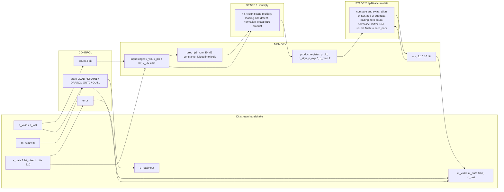
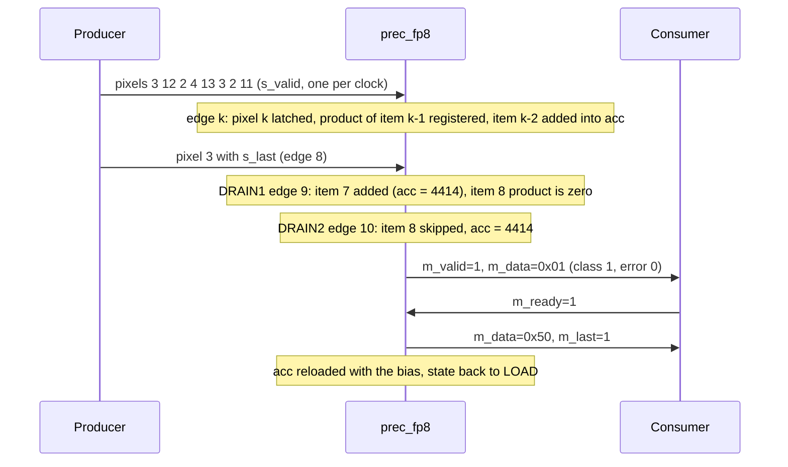
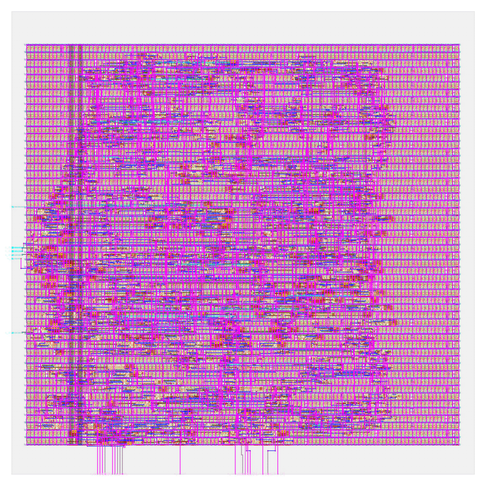

# prec_fp8: design notes

## What it is

`prec_fp8` is a one-neuron image classifier using OCP fp8 E4M3 weights with an fp16 accumulator: it reads a 3 x 3 image of 4-bit pixels, one pixel per clock beat, and answers "vertical bar (1) or horizontal bar (0)?" (source: `designs/prec_fp8/README.md`, `model/precision_hw/spec.md` section 1).
Weights and bias are the trained fp32 values rounded to E4M3 with RNE and flushed to zero below the smallest normal 2^-6; the ROM holds `00 29 0F AA 8A A9 13 29 00` and bias `A4` = -0.1875 (`rtl/prec_fp8_rom.v`, `spec.md` sections 3.4 and 3.5).
It is one of seven engines that share task, trained fp32 weights, pins and control, and differ only in number format. This one answers "what does a float multiply-accumulate cost?".
The MAC is two-stage: stage 1 multiplies E4M3 weight by pixel into an exact fp16 product that is registered; stage 2 adds it into the fp16 accumulator with round-to-nearest-even (`README.md`, `spec.md` section 6).
Output: beat 0 = `{6'b0, error, class}`, beat 1 = `acc[15:8] ^ acc[7:0]` (`rtl/prec_fp8.v`); latency 3 cycles after the last input beat (`golden.LATENCY`, `spec.md` section 6).
Simulation: `make simulate DESIGN=prec_fp8` printed `PASS prec_fp8_tb: 931 cases, 4668 checks (results, latency, back-pressure, protocol errors, reset)`.
Hardening: `make flow-all` passed all 5 stages (simulate, gds, check, gate-level, collect) in 118 s total (`build/prec_fp8_a1.log`, `designs/prec_fp8/output/flow.log`); the gds stage wall time is 101 s (`output/resources.json`).
Test accuracy 94.15 %, 98.30 % same decision as fp32 on 2000 held-out images (`python3 model/precision_hw/report.py`).

## Architecture



Registers (all in `rtl/prec_fp8.v`; synchronous active-high reset):

| Register | Width | Purpose |
|---|---|---|
| `state` | 3 | FSM LOAD / DRAIN1 / DRAIN2 / OUT0 / OUT1 (Yosys recoded it one-hot) |
| `count` | 4 | beats accepted, saturates at 9; also the pixel index |
| `error` | 1 | sticky: bad item or wrong frame length |
| `x_vld` | 1 | input stage holds a used item |
| `x_pix` | 4 | the unsigned 4-bit pixel |
| `x_idx` | 4 | its index = ROM address |
| `acc` | 16 | fp16 accumulator, starts as the widened bias |
| `p_vld` | 1 | product register holds a nonzero product for the adder |
| `p_sign`, `p_exp`, `p_man` | 1 + 5 + 7 = 13 | the product register: exact fp16 product; the low 3 mantissa bits are always 0, so 7 stored |

RTL flip-flop bits: 47 (sum of the table; `README.md` says 47). `metrics.json` (`design__instance__count__class:sequential_cell`) says 49, and `synth_stat.rpt` lists 49 `dfxtp_2`: the extra 2 are the one-hot recoding of the 5-state FSM, 3 encoded bits becoming 5 flops (`yosys-synthesis.log`: "mapping auto encoding to `one-hot` for this FSM"; `build/flow/prec_fp8/stage_check.log` reports `registers: RTL 49 (allowance 0), surviving sequential cells 49`). The final layout has 48 `dfxtp_2` and 1 `dfxtp_4` (`cell_usage.rpt`), so one flop was upsized by timing repair.
The multiplier is tiny (4 x 4 significands, no rounding because the product is exact in fp16); the cost is the fp16 adder. `synth_stat.rpt` shows 58 `mux2_1` + 3 `mux4_2` = 61 mux cells, 45 xor/xnor (731.95 um^2, my sum) and 5958.21 um^2 of non-flip-flop logic (7000.46 - 1042.25, my subtraction), 2.0x the int8 logic.
There is no weight RAM: 9 x 8 weight bits + an 8-bit bias = 80 parameter bits (`report.py`); the ROM constants are folded into the 9-way constant mux in front of the multiplier.
No Inf, NaN or subnormal logic exists: `spec.md` section 4.6 proves it unreachable and `golden.py --check` confirms `fp8: |acc| <= 19.08 < max finite 6.55e+04`.

## Data flow

One concrete image (vertical bar plus noise), `python3 model/precision_hw/golden.py --trace fp8 3 12 2 4 13 3 2 11 3`: pixels 3 12 2 / 4 13 3 / 2 11 3.
The trace prints the bias load, then per item the weight, the exact product (fp16 hex) and the accumulator after the add, and ends `class 1  beat1 50`; the edge timing below follows `spec.md` section 6 (float schedule) and the state comments in `rtl/prec_fp8.v`.
Pixel k is accepted at edge k and latched into `x_*`; its product is registered at edge k+1 (stage 1) and added into `acc` at edge k+2 (stage 2). So at any edge three items are in flight: item k+2 arrives, item k+1 is multiplied, item k is added. Items 0 and 8 have weight +0 (flushed), so their product is zero, `p_vld` stays 0 and `acc` is not touched.

| Edge | Beat accepted (pixel, x_idx) | Stage 1: product registered (item, w x pixel) | Stage 2: acc after edge | State after |
|---|---|---|---|---|
| reset | | | b200 = -0.1875 (widened bias) | LOAD |
| 0 | 3 (idx 0) | none (x_vld = 0) | b200 | LOAD |
| 1 | 12 (idx 1) | item 0: w 0 x 3, zero product, p_vld = 0 | b200 | LOAD |
| 2 | 2 (idx 2) | item 1: 0.28125 x 12 = 3.375 (42c0) | b200 (item 0 zero) | LOAD |
| 3 | 4 (idx 3) | item 2: 0.029296875 x 2 = 0.05859375 (2b80) | item 1: 4260 = 3.1875 | LOAD |
| 4 | 13 (idx 4) | item 3: -0.3125 x 4 = -1.25 (bd00) | item 2: 427e = 3.24609375 | LOAD |
| 5 | 3 (idx 5) | item 4: -0.01953125 x 13 = -0.25390625 (b410) | item 3: 3ffc = 1.99609375 | LOAD |
| 6 | 2 (idx 6) | item 5: -0.28125 x 3 = -0.84375 (bac0) | item 4: 3ef8 = 1.7421875 | LOAD |
| 7 | 11 (idx 7) | item 6: 0.04296875 x 2 = 0.0859375 (2d80) | item 5: 3b30 = 0.8984375 | LOAD |
| 8 | 3 (idx 8, s_last) | item 7: 0.28125 x 11 = 3.09375 (4230) | item 6: 3be0 = 0.984375 | DRAIN1 |
| 9 | none (DRAIN1) | item 8: w 0 x 3, zero product | item 7: 4414 = 4.078125 | DRAIN2 |
| 10 | none (DRAIN2) | none | item 8 skipped: 4414 | OUT0 |

Result: class 1 (sign bit of 4414 is 0), beat 0 = 0x01, beat 1 = 0x44 ^ 0x14 = 0x50 (`golden.py --trace` prints `beat1 50`). With E = edge 8, DRAIN1 is E+1, DRAIN2 is E+2 and `m_valid` is first sampled high at E+3: latency 3 (`spec.md` section 6).



## Verification

Testbench: `designs/prec_fp8/tb/prec_fp8_tb.v` (defines `DUT prec_fp8` and includes the shared body `shared/tb/stream_tb.vh`), `+VEC=designs/prec_fp8/tb/vectors.hex`. For every case it sends the frame with random `s_valid` gaps, takes the two result beats with random `m_ready` stalls, and compares beat 0, beat 1, `m_last` and the latency (3 for this design); it also checks that the outputs hold under back-pressure, that `s_ready` is low from the last beat until the result is taken, and that reset mid-frame or with a result waiting returns to an empty ready state. Comparisons use `!==`, so X never passes; the first failure calls `$fatal`.
Fresh `make simulate DESIGN=prec_fp8`: `PASS prec_fp8_tb: 931 cases, 4668 checks (results, latency, back-pressure, protocol errors, reset)`

Vectors: `designs/prec_fp8/tb/vectors.hex` is generated by `model/precision_hw/gen.py` from `golden.py`; the same 931 inputs are used for every format and only the expected values differ (`spec.md` section 8): 600 held-out test images, 37 further images where a non-binary format disagrees with fp32, 16 uniform images (v = 0..15), 27 single bright/dark/8-on-7 pixel images, 4 ideal bars/checkerboards, 16 sum-maximising/minimising images, 120 near-boundary random images, 60 uniform-random images, 8 short frames, 3 long frames, 36 out-of-range items (4 values x 9 positions), 4 short/bad-frame cases. 600+37+16+27+4+16+120+60+8+3+36+4 = 931. Every format sees 51 error cases.
Model level: `python3 model/precision_hw/golden.py --check` ends `golden: all self-checks passed`; the lines for this format are `E4M3 RNE vs model/examples/precision.py encoder on 17311 values ok`, `fp16 RNE vs struct 'e' on 19342 random doubles ok`, `fp16 + fp8 datapath == double replay rounded by struct 'e' (60576 ops) ok`, `ties to even` and `FTZ` lines ok, and `fp8: |acc| <= 19.08 < max finite 6.55e+04; smallest product 0.0195 >= min normal ok`.
Adder check: `designs/prec_fp8/README.md` records a throw-away check of the adder and product against a Python Fraction model on 400,000 random and cancellation-biased (acc, weight, pixel) triples with zero mismatches; the script is not kept in the repository, so this is a recorded result, not a rerunnable test.
Gate level: the same testbench runs on the synthesised netlist (`build/gl/prec_fp8/runs/gl/final/nl/prec_fp8.nl.v`, 709 cells per `stage_gl_synth.log`) and on the routed netlist (`designs/prec_fp8/runs/RUN_2026-10-05_20-28-04/final/nl/prec_fp8.nl.v`, 5448 cells per `stage_gl_final.log`, equal to `design__instance__count`, including taps, fill and diodes). `build/flow/prec_fp8/stage_gl_synth.log` ends `gl_sim: prec_fp8 PASS (1 s)` and `stage_gl_final.log` ends `gl_sim: prec_fp8 PASS (2 s)`, each after `PASS prec_fp8_tb: 931 cases, 4668 checks (...)`; `synthesis__check_error__count = 0`.
Signoff: `output/flow.log` stage 3: `check : PASS 0s -- DRC/LVS/XOR/antenna, slack at all corners, no logic lost (scripts/flow/check_signoff.py)`; `stage_check.log` reports `registers: RTL 49 (allowance 0), surviving sequential cells 49`.
Negative tests: `designs/prec_fp8/README.md` records none, and `tests/run_tests.sh` lists its negative cases for `audio_pitch`, `audio_onset`, `image_text_match` and `prec_int8` (header, line 15), so a corrupted fp8 vector or a broken fp8 adder being caught is not demonstrated beyond the 931-case coverage and the 400,000-case adder check.

## Layout (GDSII)



The picture (`output/layout.png`, KLayout render) shows the 170 x 170 um die (`design__die__bbox`, `config.json`; 28900 um^2) with the core inside (`design__core__bbox` = `5.52 10.88 164.22 157.76`, 23309.9 um^2). Standard cells sit in 54 horizontal rows (`design__rows`), the power grid is on the upper metals and the 26 I/O (24 signals plus `vccd1`, `vssd1`; `design__io`) are on the edges.
Utilisation is 0.39576 (`design__instance__utilization`): 1404 std cells, 9225.1 um^2 (`design__instance__area__stdcell`). In the final layout there are also 4044 fill-class cells (3481 `decap_3`, 312 `fill_1`, 251 `fill_2`; 14084.8 um^2, `metrics.json` and `cell_usage.rpt`), 336 tap cells and 218 antenna diodes.

## From RTL to GDSII: what each step did

### Synthesis

Yosys mapped the RTL to 709 sky130_fd_sc_hd cells, 7000.46 um^2, of which 1042.25 um^2 (14.9 %) is the 49 `dfxtp_2` flip-flops (`output/reports/synth_stat.rpt`). Main contributors: 58 `mux2_1` (653.13 um^2) and 3 `mux4_2` (67.57 um^2) for the barrel shifters (alignment before the add, normalisation after it), 27 `xnor2_2` + 18 `xor2_2` (439.17 + 292.78 um^2) for compare, add/subtract and the exponent logic, 51 `nor2_2`, 49 `nand2_2`, 45 `inv_2`, 38 `and2_2`, 33 `a21oi_2`, 31 `o211a_2`, 31 `or2_2`, 28 `o21ai_2`, 27 `and3_2`, 25 `a21o_2`, 19 `a211o_2`. The report has no full-adder or half-adder cell: adders are built from xor/xnor and and-or-invert gates. `synth_checks.rpt`: "Found and reported 0 problems"; `synthesis__check_error__count` = 0, lint warnings 449 (`design__lint_warning__count`).
Report: [synth_stat.rpt](output/reports/synth_stat.rpt), [synth_checks.rpt](output/reports/synth_checks.rpt).

### Floorplan

Die 170 x 170 um from `config.json` (the `//DIE_AREA` key estimated 1200-1600 cells and picked 170 um for 35-40 % utilisation); core 23309.9 um^2; 709 instances (7000.464 um^2) give an effective utilisation of 0.300 before repair, CTS, taps and fill (`floorplan.txt`).
Report: [floorplan.txt](output/reports/floorplan.txt).

### Placement

Global placement ran 322 routability-mode iterations, final weighted congestion 0.9080; placed cell area 7852.70 um^2, +0.91 % over the original 7781.88 um^2 (routability inflation 70.83 um^2) (`placement_global.txt`). Detailed placement: the step's own displacement lines read 0.0 u, HPWL 18001.6 u to 18607.0 u legalised (+3 %), and `design__instance__displacement__total` = 24.64 um, max 5.02 um (`placement_detailed.txt`, `metrics.json`). Timing repair added 125 buffers, 847.06 um^2 (`design__instance__count__class:timing_repair_buffer`, `design__instance__area__class:timing_repair_buffer`), of which 3 are setup buffers (`design__instance__count__setup_buffer`).
Reports: [placement_global.txt](output/reports/placement_global.txt), [placement_detailed.txt](output/reports/placement_detailed.txt).

### Clock tree

TritonCTS: 1 clock root, 9 `clkbuf_16` buffers inserted, 49 sinks (equal to the flip-flop count), plus 7 dummy `clkbuf_4` loads (`cts.rpt`). Worst setup-side skew 0.3001 ns at max_ss (`clock__skew__worst_setup__corner:max_ss_100C_1v60`); no hold buffers were needed (`design__instance__count__hold_buffer` = 0); 16 clock-buffer-class cells in the final design (`metrics.json`). The clock arrives at the start flip-flop 0.782 ns after the source (`timing_paths_max_ss.rpt`).
Report: [cts.rpt](output/reports/cts.rpt).

### Routing

Global routing: `global_route__wirelength` = 34962, `global_route__vias` = 6253 (`metrics.json`); the log runs extra iterations to remove overflow (`routing_global.txt`). Detailed routing: DRC violations per iteration 183, 84, 82, 2, 1, 1, 0 (`route__drc_errors__iter:*`), final `route__drc_errors` = 0; wire length 21106 um (met1 10709, met2 9594, met3 738, met4 63 um, `routing_detailed.txt`), 6350 vias all single-cut (`route__vias__singlecut`), longest net 183.98 um (`route__wirelength__max`).
Reports: [routing_global.txt](output/reports/routing_global.txt), [routing_detailed.txt](output/reports/routing_detailed.txt).

### Timing

Clock period 25 ns (`config.json`). All corners pass, setup and hold TNS 0 (`timing_summary.rpt`, `metrics.json`).

| Corner | Worst setup slack (ns) | Worst hold slack (ns) |
|---|---|---|
| nom_tt_025C_1v80 | 12.3019 | 0.3184 |
| nom_ss_100C_1v60 | 0.4255 | 0.8941 |
| nom_ff_n40C_1v95 | 17.0727 | 0.1083 |
| min_ss_100C_1v60 | 0.5884 | 0.8900 |
| max_ss_100C_1v60 | 0.2591 | 0.8978 |
| Overall worst | 0.2591 (max_ss_100C_1v60) | 0.1068 (min_ff_n40C_1v95) |

Worst setup path (`timing_paths_max_ss.rpt`): flip-flop `_1335_` (net `acc[10]`) to flip-flop `_1334_` (an accumulator bit), data arrival 24.995 ns against a required 25.254 ns (25 ns period + 0.782 clock arrival - 0.250 uncertainty - 0.278 setup), slack 0.259133 ns, 50 cell/buffer stages. Reading the path: `acc[10]` goes through a fanout buffer (fanout 17) into an `xnor2_4` (the magnitude compare), then an `o2111a` and `a21oi`/`o21ai` chain, a `mux2_2` driven from its select pin (the alignment shift, 0.85 ns on its own), then a long and-or chain through `xor2_2`, `a31o_4`, `a21o` and `a211o` (add, leading-zero count, normalise, round) back into `acc`. It is the accumulate loop: the path starts and ends in `acc`. Worst hold path (`timing_paths_min_ff.rpt`): flip-flop `_1314_` back to itself, slack 0.106830 ns.
Reports: [timing_summary.rpt](output/reports/timing_summary.rpt), [timing_paths_max_ss.rpt](output/reports/timing_paths_max_ss.rpt), [timing_paths_min_ff.rpt](output/reports/timing_paths_min_ff.rpt).

How timing was closed (older runs in `designs/prec_fp8/runs/*/final/metrics.json`, `spec.md` section 6, `README.md`):

| Step | Run | Worst setup at max_ss (ns) | Std cells | Timing-repair buffers |
|---|---|---|---|---|
| Single-cycle MAC (multiply and add in one stage) | `RUN_2026-10-05_20-07-06` | -2.1437 (16 failing endpoints per ss corner, `spec.md`) | 1318 | 194 |
| Pipelined: product registered | `RUN_2026-10-05_20-20-00` | -1.1407 | 1398 | 119 |
| Plus tool timing repair (this design) | `RUN_2026-10-05_20-28-04` | +0.2591 (nom_ss +0.4255, min_ss +0.5884) | 1404 | 125 |

The pipeline register moved the failure by 1.0 ns but not out of the red; the rest came from tool-only repair with no RTL change (`config.json`, clock stays 25 ns):

| Key | What it does |
|---|---|
| `RUN_POST_GRT_RESIZER_TIMING` | runs a resizer timing-repair pass after global routing, when real wire parasitics are known |
| `PL_RESIZER_SETUP_SLACK_MARGIN` / `GRT_RESIZER_SETUP_SLACK_MARGIN` = 0.5 | asks the resizer to repair paths until they have 0.5 ns of slack, not just zero, before and after global routing |
| `PL_RESIZER_SETUP_BUFFERING` / `GRT_RESIZER_SETUP_BUFFERING` | lets setup repair insert buffers to isolate heavy loads from critical nets |
| `PL_RESIZER_SETUP_GATE_CLONING` / `GRT_RESIZER_SETUP_GATE_CLONING` | duplicates high-fanout gates on critical paths so each copy drives fewer sinks |
| `PL_RESIZER_MAX_SLEW_MARGIN`, `GRT_DESIGN_REPAIR_MAX_SLEW_PCT` = 40, `MAX_FANOUT_CONSTRAINT` = 8 | slew and fanout limits for the repair passes |

Those descriptions are my reading of the key names and the sizes of the effect (buffer count 119 to 125, upsized cells such as `xnor2_4`, `and3_4`, `a31o_4` in the worst path); I did not read the resizer source. The margin is thin: README says a run on a different machine should be rechecked.

### DRC

Magic `COUNT: 0` (`drc_magic.rpt`); KLayout: all 257 rule entries in `drc_klayout.json` are 0 (my sum); `manufacturability.rpt`: DRC Passed.
Reports: [drc_magic.rpt](output/reports/drc_magic.rpt), [drc_klayout.json](output/reports/drc_klayout.json), [manufacturability.rpt](output/reports/manufacturability.rpt).

### LVS

`lvs_netgen.rpt`: "Circuits match uniquely." with 896 devices and 865 nets each side (4552 parallel devices merged); `manufacturability.rpt`: LVS Passed.
Report: [lvs_netgen.rpt](output/reports/lvs_netgen.rpt).

### Power / IR drop

Total power 1.0168e-03 W (`power__total`: internal 5.428e-04, switching 4.740e-04 W). `irdrop.rpt` (its own total 8.73e-04 W, nom_tt): vccd1 worst IR drop 5.94e-04 V, average 1.73e-04 V; vssd1 worst 5.35e-04 V (0.03 % of 1.8 V per the report).
Report: [irdrop.rpt](output/reports/irdrop.rpt).

### Antenna, slew, capacitance

218 antenna diodes inserted (545.52 um^2, `design__instance__count__class:antenna_cell`); `antenna__violating__nets` = 0; `manufacturability.rpt`: Antenna Passed. Max-cap violations 0, max-slew violations 82 (72 at nom_ss and min_ss, 82 at max_ss, 0 at the other six corners), max-fanout violations 29 at every corner (`design__max_slew_violation__count`, `design__max_cap_violation__count`, `design__max_fanout_violation__count`, `timing_summary.rpt`). The signoff does not fail on slew: `scripts/flow/check_signoff.py` documents "Also printed, never failing: max-slew / max-cap counts", and `stage_check.log` prints `note: max-slew violations: 82` before `=> PASS`. The LibreLane step log does list the three ss corners as slew violators (`flow.log`) and the flow still completes.
Report: [cell_usage.rpt](output/reports/cell_usage.rpt).

## Run time and memory

From `output/resources.json` (profile "tight": 2 CPUs, 8 GB): total wall time 101 s, container peak memory 881,397,760 bytes (0.821 GB), 79 steps. Whole `flow-all` 118 s (`build/prec_fp8_a1.log`: simulate 1 s, gds 103 s, check 0 s, gate-level 6 s and 3 s, collect 5 s).

| Step | Wall time (s) |
|---|---|
| 47-openroad-detailedrouting | 36.252 |
| 37-openroad-resizertimingpostcts | 5.705 |
| 68-klayout-drc | 5.696 |
| 71-magic-spiceextraction | 5.235 |

Detailed routing alone is 36 % of the run (36.252 / 101, my division).

## Reproduce

```bash
python3 model/precision_hw/golden.py --check                 # self-checks
python3 model/precision_hw/golden.py --trace fp8 3 12 2 4 13 3 2 11 3   # the table above
python3 model/precision_hw/gen.py                            # rtl/prec_fp8_rom.v and tb/vectors.hex
make simulate DESIGN=prec_fp8                                # RTL simulation, 931 cases
make flow-all DESIGN=prec_fp8                                # simulate, gds, check, gate-level, collect
python3 model/precision_hw/report.py                         # study table incl. this design's metrics
```

`rtl/prec_fp8_rom.v` is generated (header carries the sha256 of `golden.py` and `gen.py`); never edit it. Because the margin is 0.259 ns, rerun the flow on the target machine and read `output/reports/timing_summary.rpt` before trusting the closure.

## Comparison of the seven formats

Source: `docs/PRECISION_STUDY.md` section 2 (Table A and Table B, printed by `python3 model/precision_hw/report.py`; Table B values come from each `output/metrics.json`, `synth_stat.rpt` and `output/resources.json`).

| Metric | bin | tern | int4 | int8 | fp8 | fp16 | bf16 |
|---|---|---|---|---|---|---|---|
| Test accuracy (%) | 88.95 | 94.15 | 94.25 | 94.05 | 94.15 | 94.05 | 94.00 |
| Same decision as fp32 (%) | 90.30 | 98.80 | 98.90 | 100.00 | 98.30 | 100.00 | 99.95 |
| Parameter bits | 13 | 27 | 47 | 88 | 80 | 160 | 160 |
| Bits moved / inference | 22 | 63 | 83 | 124 | 116 | 196 | 196 |
| Accumulator | 4-bit count | 10-bit int | 12-bit int | 17-bit int | fp16 | fp16 | bf16 |
| Latency (cycles) | 2 | 2 | 2 | 2 | 3 | 3 | 3 |
| Flow wall time (s) | 45 | 47 | 65 | 59 | 101 | 104 | 93 |
| Std cells | 199 | 293 | 377 | 642 | 1404 | 1932 | 1754 |
| Synthesised cells | 83 | 160 | 230 | 352 | 709 | 905 | 776 |
| Flip-flops | 19 | 28 | 30 | 35 | 49 | 52 | 51 |
| Std-cell area (um^2) | 1474 | 2485 | 3263 | 4860 | 9225 | 11913 | 10170 |
| Area relative to bin | 1.0x | 1.7x | 2.2x | 3.3x | 6.3x | 8.1x | 6.9x |
| Die (um) | 80 x 80 | 80 x 80 | 80 x 80 | 120 x 120 | 170 x 170 | 220 x 220 | 220 x 220 |
| Utilisation (%) | 37.6 | 63.5 | 83.3 | 45.7 | 39.6 | 29.1 | 24.9 |
| Routed wirelength (um) | 2154 | 3895 | 6171 | 8187 | 21106 | 28736 | 23952 |
| Vias | 787 | 1363 | 2092 | 2948 | 6350 | 7872 | 6681 |
| Worst setup at max_ss (ns) | 16.396 | 16.346 | 13.457 | 11.387 | 0.259 | 0.111 | 0.044 |
| Worst hold (ns) | 0.114 | 0.112 | 0.115 | 0.111 | 0.107 | 0.111 | 0.110 |
| Power (mW) | 0.105 | 0.144 | 0.188 | 0.240 | 1.017 | 1.929 | 1.271 |
| xor/xnor cells | 0 | 17 | 15 | 40 | 45 | 63 | 52 |
| mux cells | 3 | 3 | 3 | 4 | 61 | 92 | 63 |

The xor/xnor and mux rows are the "cell mix" block of `docs/PRECISION_STUDY.md` section 3.

## Intuitions and insights

1. **What the format is.** E4M3 is 1 sign bit, 4 exponent bits (bias 7) and 3 mantissa bits; normals run from 2^-6 = 0.015625 to a maximum of 448 (`0x7E`), and there is no Inf (`S.1111.111` is NaN) (`spec.md` section 4.1 table). Three mantissa bits give 4 significant bits, which is exactly what a 4-bit pixel needs, so every pixel 0..15 is exact in E4M3 and the 4 x 4 significand product has at most 8 bits and is exact in fp16 (`spec.md` section 4). That is why the accumulator is fp16: the 3-bit mantissa cannot hold a running sum of nine products, fp16 holds it with 11 significant bits, and the only rounding in the whole engine is the fp16 add (about 0.31 value-changing roundings per inference, `report.py`). `spec.md` section 4.5 notes fp32 would be the more common accumulator and is out of scale here.

2. **Two weights are lost.** `w0` = 0.0148 and `w8` = 0.00083 are below 2^-6, the smallest E4M3 normal, so the encoder flushes them to +0 (`spec.md` section 3.4; ROM `W0 = 8'h00`, `W8 = 8'h00`). With subnormals they would be kept in 2^-9 steps; this design pays no subnormal logic and the price is measurable: 98.30 % same decision as fp32 (34 of 2000 images differ, my arithmetic from `report.py`), against 100.00 % for int8 at the same 8 bits per weight. Test accuracy 94.15 % is not worse than fp32's 94.05 %; the study itself says differences of a few tenths are noise (`PRECISION_STUDY.md` section 8). The zero weights also give the trace its two skipped items: the MAC does nothing for pixels 0 and 8.

3. **What the float MAC costs in gates.** 709 synthesised cells and 7000.46 um^2 at synthesis, against 352 and 3717.32 um^2 for int8 (`synth_stat.rpt` of each design): 2.0x the cells at the same weight width. The fingerprint is muxes: 61 for fp8 against 4 for int8, because alignment and normalisation need barrel shifters (`PRECISION_STUDY.md` section 3). After layout the std-cell area is 9225 um^2, 6.3x the binary design (1474 um^2) and 1.9x int8 (4860 um^2). The 80 weight bits are not what costs: fp8 and int8 store the same 8 bits per weight, and fp8's expected cost sits in the adder (`spec.md` section 10: "the accumulator, not the weight, sets float cost").

4. **The accumulate loop is the speed limit.** The worst path starts at `acc[10]` and ends in `acc`: compare, align, add, count leading zeros, normalise, round, all depending on the previous sum. A pipeline register can separate the multiply from the add, but the add-and-normalise chain feeds back into itself, so it cannot be cut without slowing the loop (`PRECISION_STUDY.md` section 6). Even this adder, with a product that arrives exact and needs no rounding, takes 24.995 ns of the 25 ns budget at 100 C and 1.60 V; at the typical corner the worst slack is 12.30 ns, so the slow corner costs about 12 ns of margin (`timing_summary.rpt`, worst slack per corner, not necessarily the same path). Integer engines use 11.4 ns of data path at most (int8, `designs/prec_int8/NOTES.md`).

5. **What the pipeline cost.** One product register (13 bits plus `p_vld` = 14 flops) and one more cycle of latency: flip-flops 49 against 32 before the pipeline (README) and latency 3 against 2 for every integer format (`spec.md` section 6). Throughput is unchanged, one pixel per clock, and results are bit-identical to the one-stage version. Of the 15 extra RTL flops (47 against 32), 13 are the product register, 1 is `p_vld` and 1 is the extra state bit (5 states instead of 4); the one-hot recoding adds 2 more in the netlist (49). The return was 1.0 ns of setup (-2.144 to -1.141 ns), which was not enough on its own.

6. **Thin slack and reproducibility.** The final margin is +0.259 ns at max_ss, +0.426 at nom_ss, +0.588 at min_ss, and hold is 0.107 ns at the worst corner (`metrics.json`). Closure came from repair knobs, not RTL changes, and the 82 max-slew violations at the ss corners are tolerated by the checker. The repair is tool-version and machine dependent: README advises rechecking on a different machine, and `PRECISION_STUDY.md` section 8 calls "closes at 40 MHz" for the floats fragile. The study reports a single run per design, so 0.259 ns is one sample, not a distribution. A real design would lengthen the clock period, or use a different adder structure, before relying on this margin.

7. **Where the area goes.** 1404 std cells = 709 synthesised + 125 timing-repair buffers + 16 clock buffers + 218 antenna diodes + 336 taps (my sum, equal to `design__instance__count__stdcell`). Of the 9225.1 um^2, 1044.75 um^2 are the 49 flops (11.3 %), 5920.68 um^2 the multi-input combinational cells, 847.06 um^2 timing-repair buffers, 545.52 um^2 diodes (`metrics.json` classes). The 170 x 170 um die (28900 um^2) is 2.0x int8's 120 x 120 um (28900 / 14400, my division). Utilisation 39.6 %, and 4044 fill cells take 14084.8 um^2, more than the logic. Wire length is 21106 um, 2.6x int8's 8187 um, and the 15.0 um of wire per cell is typical of the larger designs.

8. **Where fp8 sits among the seven.** For 94.15 % accuracy fp8 spends 9225 um^2 and 1.017 mW, 2.8x ternary's area (2485 um^2, 94.15 %) for the same accuracy, and its fp32 agreement (98.30 %) is below int4's (98.90 %) and int8's (100.00 %), which cost 3263 and 4860 um^2. It is cheaper than fp16 (11913 um^2) and bf16 (10170 um^2) because its multiplier is 4 x 4 and its product is exact; it is the lightest float. On this task the float formats buy nothing: their dynamic range is never exercised by pixels 0..15 and nine small weights (`PRECISION_STUDY.md` section 8).
