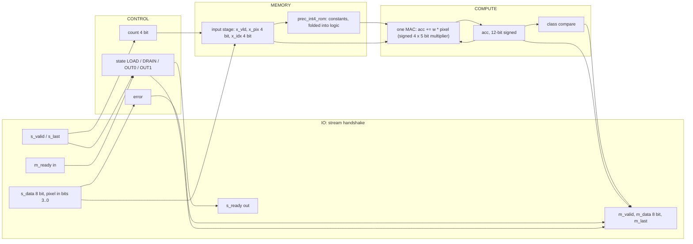
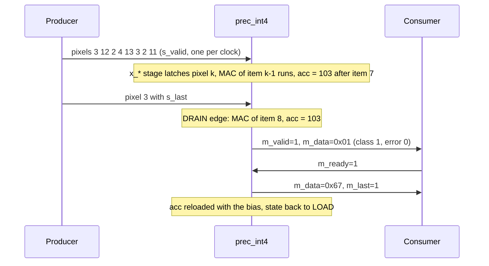
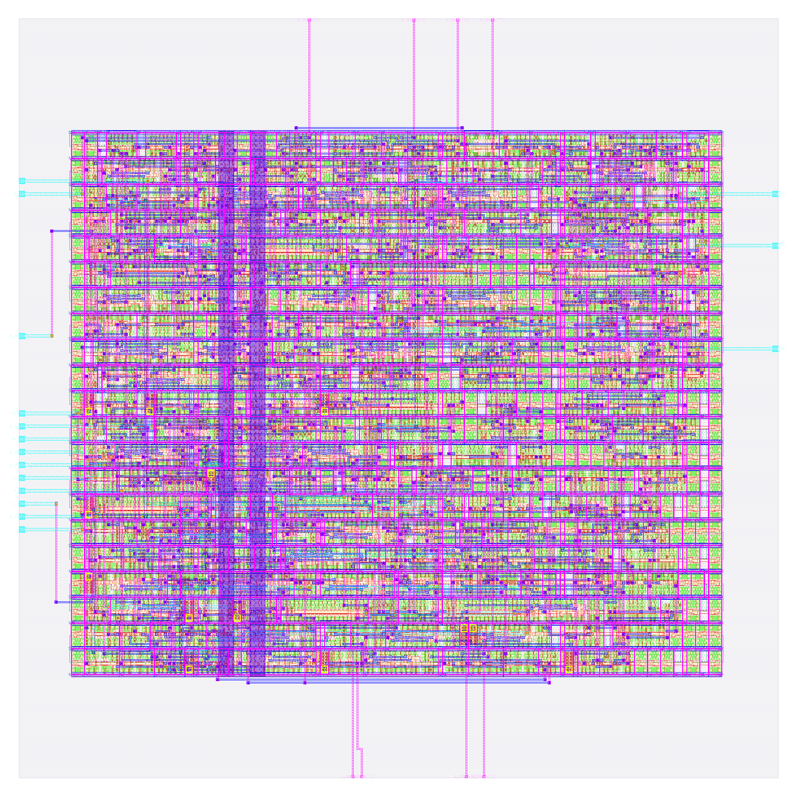

# prec_int4: design notes

## What it is

`prec_int4` is a one-neuron image classifier using 4-bit signed integer weights, symmetric per tensor: it reads a 3 x 3 image of 4-bit pixels, one pixel per clock beat, and answers "vertical bar (1) or horizontal bar (0)?" (source: `designs/prec_int4/README.md`, `model/precision_hw/spec.md` section 1).
Weights are symmetric per-tensor 4-bit integers: `scale = max|w| / 7 = 0.0452489`, `q = RNE(w / scale)` in [-7, 7], and the bias is divided by the same scale (-4) so no scale multiply is needed in hardware (`spec.md` section 3.3): `sum >= 0` in integer units has the same sign as `scale * sum`.
It is one of seven engines that share task, trained fp32 weights, pins and control, and differ only in number format; the four non-float ones are hardened and compared here. The float formats (fp8, fp16, bf16) are still being timing-closed, so they are not in this note.
Output: beat 0 = `{6'b0, error, class}`, beat 1 = fold of the accumulator (`spec.md` section 5.2); latency 2 cycles after the last input beat (`golden.LATENCY`, `spec.md` section 6).
Simulation: `make simulate DESIGN=prec_int4` printed `PASS prec_int4_tb: 931 cases, 4668 checks (results, latency, back-pressure, protocol errors, reset)`.
Hardening: `make flow-all` passed all 5 stages (simulate, gds, check, gate-level, collect) in 77 s total (`build/flow_prec_int4.log`); the stage-2 flow wall time is 65 s (`output/resources.json`).
Test accuracy 94.25 %, 98.90 % same decision as fp32 on 2000 held-out images (`python3 model/precision_hw/report.py`).

## Architecture



Registers (all in `rtl/prec_int4.v`; synchronous active-high reset):

| Register | Width | Purpose |
|---|---|---|
| `state` | 2 | FSM LOAD / DRAIN / OUT0 / OUT1 (Yosys recoded it one-hot: 4 flops) |
| `count` | 4 | beats accepted, saturates at 9; also the pixel index |
| `error` | 1 | sticky: bad item or wrong frame length |
| `x_vld` | 1 | input stage holds a used item |
| `x_pix` | 4 | the unsigned 4-bit pixel |
| `x_idx` | 4 | its index = ROM address |
| `acc` | 12 | 12-bit signed, starts at the bias |

RTL flip-flop bits: 28 (sum of the table). `metrics.json` (`design__instance__count__class:sequential_cell`) says 30, and `synth_stat.rpt` lists 30 `dfxtp_2`: the extra 2 are the one-hot recoding of the 4-state FSM (`yosys-synthesis.log`: "mapping auto encoding to `one-hot` for this FSM"; `build/flow/prec_int4/stage_check.log` also reports 30 surviving sequential cells).
One signed 4 x 5 bit multiplier plus a 12-bit adder, both generic (the weight comes from the ROM by `x_idx`, so the multiplier cannot be removed even though the ROM is constant). `synth_stat.rpt` shows 15 xor/xnor cells (243.98 um^2) and 1784.21 um^2 of non-flip-flop logic (2422.32 - 638.11, my subtraction), 1.46x the ternary logic.
There is no weight RAM: 9 x 4 weight bits + an 11-bit bias = 47 parameter bits (`report.py`). Three weights are 0 and two are +1 (`spec.md` section 3.5).

## Data flow

One concrete image (vertical bar plus noise), `python3 model/precision_hw/golden.py --trace int4 3 12 2 4 13 3 2 11 3`: pixels 3 12 2 / 4 13 3 / 2 11 3.
The `--trace` command prints the final accumulator for integer formats (`integer: acc = 103 (code 067)`, `class 1  beat1 67`); the per-step column below is my own replay of the same rule with the weights of `spec.md` section 3.5 (+0, +6, +1, -7, +0, -6, +1, +7, +0; bias -4 (11-bit)), and it ends on the traced value.
Pixel k is accepted at edge k and latched into `x_*`; its MAC executes one edge later, so the MAC of item k overlaps the arrival of pixel k+1 (`spec.md` section 6). Edge 8 carries `s_last`; edge 9 is the DRAIN edge that does the last MAC.

| Edge | Beat accepted (pixel, x_idx) | MAC this edge (item, w, pixel) | acc after edge | State after |
|---|---|---|---|---|
| reset | | | -4 (loaded bias) | LOAD |
| 0 | 3 (idx 0) | none (x_vld = 0) | -4 | LOAD |
| 1 | 12 (idx 1) | item 0: w +0 x pixel 3 = skip | -4 | LOAD |
| 2 | 2 (idx 2) | item 1: w +6 x pixel 12 = +72 | 68 | LOAD |
| 3 | 4 (idx 3) | item 2: w +1 x pixel 2 = +2 | 70 | LOAD |
| 4 | 13 (idx 4) | item 3: w -7 x pixel 4 = -28 | 42 | LOAD |
| 5 | 3 (idx 5) | item 4: w +0 x pixel 13 = skip | 42 | LOAD |
| 6 | 2 (idx 6) | item 5: w -6 x pixel 3 = -18 | 24 | LOAD |
| 7 | 11 (idx 7) | item 6: w +1 x pixel 2 = +2 | 26 | LOAD |
| 8 | 3 (idx 8) | item 7: w +7 x pixel 11 = +77 | 103 | DRAIN |
| 9 | none (DRAIN) | item 8: w +0 x pixel 3 = skip | 103 | OUT0 |

Result: class 1 (acc 103 >= 0), beat 0 = 0x01 (error 0, class 1), beat 1 = 0x67 (`golden.py --trace`), `m_valid` high from the edge after the DRAIN edge (latency 2).



## Verification

Testbench: `designs/prec_int4/tb/prec_int4_tb.v` (defines `DUT prec_int4` and includes the shared body `shared/tb/stream_tb.vh`), `+VEC=designs/prec_int4/tb/vectors.hex`. For every case it sends the frame with random `s_valid` gaps, takes the two result beats with random `m_ready` stalls, and compares beat 0, beat 1, `m_last` and the latency; it also checks that the outputs hold under back-pressure, that `s_ready` is low from the last beat until the result is taken, and that reset mid-frame or with a result waiting returns to an empty ready state. Comparisons use `!==`, so X never passes; the first failure calls `$fatal`.
Fresh `make simulate DESIGN=prec_int4`: `PASS prec_int4_tb: 931 cases, 4668 checks (results, latency, back-pressure, protocol errors, reset)`

Vectors: `designs/prec_int4/tb/vectors.hex` is generated by `model/precision_hw/gen.py` from `golden.py`; the same 931 inputs are used for every format and only the expected values differ (`spec.md` section 8): 600 held-out test images, 37 further images where a non-binary format disagrees with fp32, 16 uniform images (v = 0..15), 27 single bright/dark/8-on-7 pixel images, 4 ideal bars/checkerboards, 16 sum-maximising/minimising images, 120 near-boundary random images, 60 uniform-random images, 8 short frames, 3 long frames, 36 out-of-range items (4 values x 9 positions), 4 short/bad-frame cases. 600+37+16+27+4+16+120+60+8+3+36+4 = 931. Every format sees 51 error cases.
Model level: `python3 model/precision_hw/golden.py --check` ends `golden: all self-checks passed`; for this format `tern/int4/int8/bin datapath == plain integer reference (2025 images) ok`, plus the accumulator-range lines quoted above.
Gate level: the same testbench runs on the synthesised netlist (`build/gl/prec_int4/runs/gl/final/nl/prec_int4.nl.v`, 230 cells, my grep count of sky130 instances) and on the routed netlist (`designs/prec_int4/runs/RUN_2026-10-05_20-18-29/final/nl/prec_int4.nl.v`, 601 instances including taps, fill and diodes, equal to `design__instance__count`). `build/flow/prec_int4/stage_gl_synth.log` ends `gl_sim: prec_int4 PASS (4 s)` and `stage_gl_final.log` ends `gl_sim: prec_int4 PASS (1 s)`; `build/gl/prec_int4/synth_checks.txt` reads `synthesis__check_error__count = 0`.
Signoff: `build/flow_prec_int4.log` stage 3: `check : PASS ... DRC/LVS/XOR/antenna, slack at all corners, no logic lost (scripts/flow/check_signoff.py)`; `stage_check.log` reports `registers: RTL 30 (allowance 0), surviving sequential cells 30`.
Negative tests: none in `tests/run_tests.sh` yet, and none recorded in `designs/prec_int4/README.md`, so a wrong ROM constant being caught is not demonstrated beyond the 931-case coverage.

## Layout (GDSII)



The picture (`output/layout.png`, KLayout render) shows the 80 x 80 um die (`design__die__bbox`, `config.json`; 6400 um^2) with the core inside (`design__core__bbox` = `5.52 10.88 74.06 68.0`, 3915 um^2). Standard cells sit in horizontal rows, the power grid is on the upper metals and the 26 I/O (24 signals plus `vccd1`, `vssd1`; `design__io`) are on the edges.
Utilisation is 0.833493 (`design__instance__utilization`): 377 std cells, 3263.13 um^2 (`design__instance__area__stdcell`). In the final layout there are also 224 fill-class cells (127 `decap_3`, 54 `fill_1`, 43 `fill_2`; 651.88 um^2, `metrics.json` and `cell_usage.rpt`), 57 tap cells and 13 antenna diodes.

## From RTL to GDSII: what each step did

### Synthesis

Yosys mapped the RTL to 230 sky130_fd_sc_hd cells, 2422.32 um^2, of which 638.11 um^2 (26.3 %) is the 30 `dfxtp_2` flip-flops (`output/reports/synth_stat.rpt`). Main contributors: 30 `dfxtp_2` (638.112 um^2, 26.3 %), 22 `and2_2`, 15 `nor2_2`, 14 `a21oi_2`, 14 `nand2_2`, 13 `a21o_2`, 11 `o21ai_2`, 10 `or2_2`, 8 `xnor2_2` + 7 `xor2_2` (130.125 + 113.859 um^2), 3 `mux2_1`. `synth_checks.rpt`: "Found and reported 0 problems"; `synthesis__check_error__count` = 0, lint warnings 446 (`design__lint_warning__count`).
Report: [synth_stat.rpt](output/reports/synth_stat.rpt), [synth_checks.rpt](output/reports/synth_checks.rpt).

### Floorplan

Die 80 x 80 um from `config.json`; core 3915 um^2; 230 instances (2422.320 um^2) give an effective utilisation of 0.619 before repair, CTS, taps and fill (`floorplan.txt`).
Report: [floorplan.txt](output/reports/floorplan.txt).

### Placement

Global placement ended at iteration 330 with HPWL 2518 um and 92 routability-mode iterations; final weighted congestion 0.9065; placed cell area 2780.1 um^2, +0.00 % growth (`placement_global.txt`). Detailed placement: original HPWL 4062.6 u, legalised 4226.1 u (+4 %); the step's own displacement lines read 0.0 u, while `design__instance__displacement__total` = 116.58 um (`placement_detailed.txt`, `metrics.json`). Timing repair added 66 buffers, 496.726 um^2 (`design__instance__count__class:timing_repair_buffer`, `design__instance__area__class:timing_repair_buffer`).
Reports: [placement_global.txt](output/reports/placement_global.txt), [placement_detailed.txt](output/reports/placement_detailed.txt).

### Clock tree

TritonCTS: 1 clock root, 9 buffers inserted, 30 sinks (equal to the flip-flop count) (`cts.rpt`). Worst setup-side skew 0.252 ns (`clock__skew__worst_setup`); 17 hold buffers were inserted (`design__instance__count__hold_buffer`); 11 clock-buffer-class cells in the final design (`metrics.json`).
Report: [cts.rpt](output/reports/cts.rpt).

### Routing

Global routing: 314 routed nets, `global_route__wirelength` = 10080, `global_route__vias` = 2085 (`metrics.json`); the log notes extra iterations to remove overflow (`routing_global.txt`). Detailed routing: DRC violations per iteration 75, 37, 40, 5, 5, 0 (`route__drc_errors__iter:*`), final `route__drc_errors` = 0; wire length 6171 um (met1 2850, met2 2797, met3 411, met4 111 um, `routing_detailed.txt`), 2092 vias, longest net 130.455 um (`route__wirelength__max`).
Reports: [routing_global.txt](output/reports/routing_global.txt), [routing_detailed.txt](output/reports/routing_detailed.txt).

### Timing

Clock period 25 ns (`config.json`). All corners pass, setup and hold TNS 0 (`timing_summary.rpt`, `metrics.json`).

| Corner | Worst setup slack (ns) | Worst hold slack (ns) |
|---|---|---|
| nom_tt_025C_1v80 | 17.7997 | 0.3214 |
| nom_ss_100C_1v60 | 13.5276 | 0.9058 |
| nom_ff_n40C_1v95 | 18.5798 | 0.1196 |
| Overall worst | 13.4572 (max_ss_100C_1v60) | 0.1150 (min_ff_n40C_1v95) |

Worst setup path (`timing_paths_max_ss.rpt`): flip-flop `_402_` to flip-flop `_415_` (accumulator), slack 13.457193 ns, data arrival 11.677 ns, 48 cell/buffer lines in the path. Worst hold path (`timing_paths_min_ff.rpt`): flip-flop `_416_` back to itself, slack 0.115004 ns.
Reports: [timing_summary.rpt](output/reports/timing_summary.rpt), [timing_paths_max_ss.rpt](output/reports/timing_paths_max_ss.rpt), [timing_paths_min_ff.rpt](output/reports/timing_paths_min_ff.rpt).

### DRC

Magic `COUNT: 0` (`drc_magic.rpt`); KLayout: all 257 rule entries in `drc_klayout.json` are 0 (my sum); `manufacturability.rpt`: DRC Passed.
Reports: [drc_magic.rpt](output/reports/drc_magic.rpt), [drc_klayout.json](output/reports/drc_klayout.json), [manufacturability.rpt](output/reports/manufacturability.rpt).

### LVS

`lvs_netgen.rpt`: "Circuits match uniquely." with 324 devices and 322 nets each side; `manufacturability.rpt`: LVS Passed.
Report: [lvs_netgen.rpt](output/reports/lvs_netgen.rpt).

### Power / IR drop

Total power 1.8792e-04 W (`power__total`: internal 1.4389e-04, switching 4.402e-05 W). `irdrop.rpt` (its own total 0.000161 W): vccd1 worst IR drop 1.52e-04 V, average 3.68e-05 V; vssd1 worst 1.46e-04 V (the worst vccd1 drop is 0.0084 % of 1.8 V, my division).
Report: [irdrop.rpt](output/reports/irdrop.rpt).

### Antenna, slew, capacitance

13 antenna diodes inserted (`design__instance__count__class:antenna_cell`); `antenna__violating__nets` = 0; `manufacturability.rpt`: Antenna Passed. Max-cap violations 0, max-slew violations 9, max-fanout violations 0 (`design__max_cap_violation__count`, `design__max_slew_violation__count`, `design__max_fanout_violation__count`); the slew count appears only in the ss corners of `timing_summary.rpt` and the flow still reports PASS (`stage_check.log` note line), I did not find which script treats it as non-fatal.
Report: [cell_usage.rpt](output/reports/cell_usage.rpt).

## Run time and memory

From `output/resources.json` (profile "tight": 2 CPUs, 8 GB): total wall time 65 s, container peak memory 911,388,672 bytes (0.849 GB), 78 steps. Whole `flow-all` 77 s (`build/flow_prec_int4.log`; gate-level stages 4 s and 1 s).

| Step | Wall time (s) |
|---|---|
| 46-openroad-detailedrouting | 21.766 |
| 35-openroad-cts | 4.055 |
| 57-openroad-stapostpnr | 2.735 |

## Reproduce

```bash
python3 model/precision_hw/golden.py --check   # self-checks
python3 model/precision_hw/gen.py              # rtl/prec_int4_rom.v and tb/vectors.hex
make simulate DESIGN=prec_int4                       # RTL simulation, 931 cases
make flow-all DESIGN=prec_int4                       # simulate, gds, check, gate-level, collect
python3 model/precision_hw/report.py           # study table incl. this design's metrics
```

`rtl/prec_int4_rom.v` is generated (header carries the sha256 of `golden.py` and `gen.py`); never edit it.

## Comparison of the four hardened formats

The float formats (fp8, fp16, bf16) are still being timing-closed, so they are not in this table.

| Metric | prec_bin | prec_tern | prec_int4 | prec_int8 | Source |
|---|---|---|---|---|---|
| Std cells | 199 | 293 | 377 | 642 | `design__instance__count__stdcell` (metrics.json) |
| Synthesised cells | 83 | 160 | 230 | 352 | `synth_stat.rpt` |
| Flip-flops | 19 | 28 | 30 | 35 | `design__instance__count__class:sequential_cell` |
| Std-cell area (um^2) | 1473.91 | 2484.88 | 3263.13 | 4859.66 | `design__instance__area__stdcell` |
| Die (um) | 80 x 80 | 80 x 80 | 80 x 80 | 120 x 120 | `config.json`, `design__die__bbox` |
| Utilisation | 0.376 | 0.635 | 0.833 | 0.457 | `design__instance__utilization` |
| Routed wirelength (um) | 2154 | 3895 | 6171 | 8187 | `route__wirelength` |
| Worst setup slack (ns) | 16.40 | 16.35 | 13.46 | 11.39 | `timing__setup__ws` |
| Worst hold slack (ns) | 0.114 | 0.112 | 0.115 | 0.111 | `timing__hold__ws` |
| Total power (W) | 1.0548e-04 | 1.4394e-04 | 1.8792e-04 | 2.4041e-04 | `power__total` |
| Test accuracy (%) | 88.95 | 94.15 | 94.25 | 94.05 | `report.py` |
| Same decision as fp32 (%) | 90.30 | 98.80 | 98.90 | 100.00 | `report.py` |
| Parameter bits | 13 | 27 | 47 | 88 | `report.py` |
| Bits moved / inference | 22 | 63 | 83 | 124 | `report.py` |

## Intuitions and insights

1. **What the format is and how the weights came about.** Symmetric per-tensor 4-bit integers: scale = max|w| / 7 = 0.0452489, weights 0 +6 +1 -7 0 -6 +1 +7 0, bias -4 (`spec.md` section 3.5). The scale is folded away: `sum >= 0` in integer units has the same sign as `scale * sum`, so no multiplication by the scale exists in the RTL.

2. **Accuracy.** 94.25 % test accuracy and 98.90 % same decision as fp32 (`report.py`). The 94.25 vs 94.05 % difference is 4 images in 2000, noise; "same decision" is the better measure and 98.90 vs ternary's 98.80 % is 2 images in 2000.

3. **What the MAC costs in gates.** A real multiplier appears: one signed 4 x 5 bit multiplier and a 12-bit adder, with 15 xor/xnor cells (243.98 um^2) and 1784.21 um^2 of non-flip-flop logic (`synth_stat.rpt`), 1.46x ternary's. Total 230 cells, 2422.32 um^2 at synthesis, the first format where the flip-flops fall under 27 % of the area.

4. **Accumulator width.** 12 signed bits cover any ROM; the trained ROM needs [-199, 221] (`golden.py --check`), 9 bits. Flip-flop total: 30.

5. **Weight memory versus what synthesis did.** 47 parameter bits (9 x 4 + 11) but no stored bits: constants selected by `x_idx` and folded into logic. The multiplier input is a 9-way mux of constants selected by `x_idx`; I did not measure how far Yosys specialised the multiplier per weight.

6. **Bits moved.** 83 bits per inference (36 pixels + 47 parameters, `report.py`).

7. **Timing headroom.** Worst setup slack 13.4572 ns of 25 ns, the worst path is the accumulator itself: `_402_` to `_415_` with 11.677 ns of data arrival (`timing_paths_max_ss.rpt`) at the slow-slow corner. A single-stage multiply-accumulate closes at 25 ns with 47 % of the period in use (11.677 / 25, my division), unlike the float formats, which needed pipelining (`spec.md` section 6). Hold 0.1150 ns at min_ff.

8. **Where the area goes.** 377 std cells = 230 synthesised + 66 timing-repair + 11 clock buffers + 13 diodes + 57 taps (my sum). Utilisation 0.833 (`design__instance__utilization`), the densest of the four on an 80 x 80 um die: detailed routing needed 6 iterations (75, 37, 40, 5, 5, 0 violations) and global routing ran extra iterations to remove overflow, and total wirelength is 6171 um, 1.58x ternary's.

9. **Takeaway.** int4 buys 0.1 accuracy point over ternary for 84 more std cells (377 vs 293, +29 %) on this task ternary dominates it. The 4-bit multiplier is the cost of magnitude resolution the task does not need.
