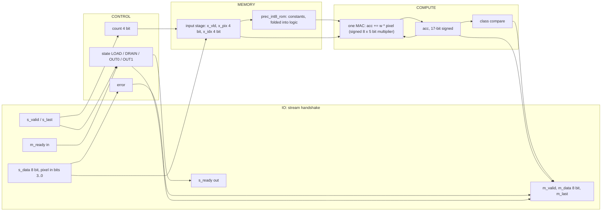
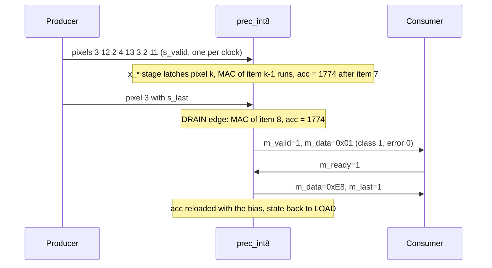
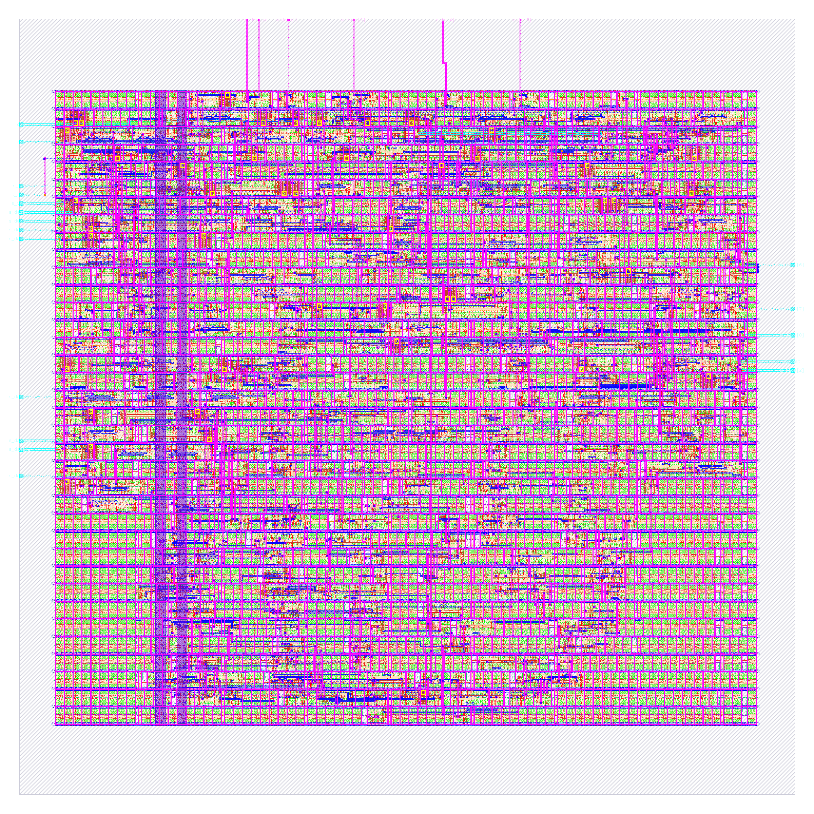

# prec_int8: design notes

## What it is

`prec_int8` is a one-neuron image classifier using 8-bit signed integer weights, symmetric per tensor: it reads a 3 x 3 image of 4-bit pixels, one pixel per clock beat, and answers "vertical bar (1) or horizontal bar (0)?" (source: `designs/prec_int8/README.md`, `model/precision_hw/spec.md` section 1).
Weights are symmetric per-tensor 8-bit integers: `scale = max|w| / 127 = 0.00249404`, `q = RNE(w / scale)` in [-127, 127], and the bias is divided by the same scale (-73), so the scale never appears in hardware (`spec.md` section 3.3).
It is one of seven engines that share task, trained fp32 weights, pins and control, and differ only in number format; all seven are hardened (`build/state_snapshot.md`, `model/precision_hw/report.py` table B) and are compared in the last section.
Output: beat 0 = `{6'b0, error, class}`, beat 1 = fold of the accumulator (`spec.md` section 5.2); latency 2 cycles after the last input beat (`golden.LATENCY`, `spec.md` section 6).
Simulation: `make simulate DESIGN=prec_int8` printed `PASS prec_int8_tb: 931 cases, 4668 checks (results, latency, back-pressure, protocol errors, reset)`.
Hardening: `make flow-all` passed all 5 stages (simulate, gds, check, gate-level, collect) in 12 s total (`build/flow_prec_int8.log`); the stage-2 flow wall time is 59 s (`output/resources.json`).
Test accuracy 94.05 %, 100.00 % same decision as fp32 on 2000 held-out images (`python3 model/precision_hw/report.py`).

## Architecture



Registers (all in `rtl/prec_int8.v`; synchronous active-high reset):

| Register | Width | Purpose |
|---|---|---|
| `state` | 2 | FSM LOAD / DRAIN / OUT0 / OUT1 (Yosys recoded it one-hot: 4 flops) |
| `count` | 4 | beats accepted, saturates at 9; also the pixel index |
| `error` | 1 | sticky: bad item or wrong frame length |
| `x_vld` | 1 | input stage holds a used item |
| `x_pix` | 4 | the unsigned 4-bit pixel |
| `x_idx` | 4 | its index = ROM address |
| `acc` | 17 | 17-bit signed, starts at the bias |

RTL flip-flop bits: 33 (sum of the table). `metrics.json` (`design__instance__count__class:sequential_cell`) says 35, and `synth_stat.rpt` lists 35 `dfxtp_2`: the extra 2 are the one-hot recoding of the 4-state FSM (`yosys-synthesis.log`: "mapping auto encoding to `one-hot` for this FSM"; `python3 scripts/flow/check_signoff.py prec_int8` also reports 35 surviving sequential cells; the `build/flow/prec_int8/stage_*.log` files currently hold only the make command lines, not the original output, so they are not cited).
One signed 8 x 5 bit multiplier plus a 17-bit adder. `synth_stat.rpt` shows 40 xor/xnor cells (650.62 um^2) and 2972.85 um^2 of non-flip-flop logic (3717.32 - 744.46, my subtraction), 1.67x the int4 logic; it is the only one of the four that needed a 120 x 120 um die (`config.json`).
There is no weight RAM: 9 x 8 weight bits + a 16-bit bias = 88 parameter bits (`report.py`); the ROM constants (`rtl/prec_int8_rom.v`) are the largest of the four and the multiplier input is a 9-way mux of 8-bit constants.

## Data flow

One concrete image (vertical bar plus noise), `python3 model/precision_hw/golden.py --trace int8 3 12 2 4 13 3 2 11 3`: pixels 3 12 2 / 4 13 3 / 2 11 3.
The `--trace` command prints the final accumulator for integer formats (`integer: acc = 1774 (code 006ee)`, `class 1  beat1 e8`); the per-step column below is my own replay of the same rule with the weights of `spec.md` section 3.5 (+6, +117, +12, -127, -8, -107, +18, +118, +0; bias -73 (16-bit)), and it ends on the traced value.
Pixel k is accepted at edge k and latched into `x_*`; its MAC executes one edge later, so the MAC of item k overlaps the arrival of pixel k+1 (`spec.md` section 6). Edge 8 carries `s_last`; edge 9 is the DRAIN edge that does the last MAC.

| Edge | Beat accepted (pixel, x_idx) | MAC this edge (item, w, pixel) | acc after edge | State after |
|---|---|---|---|---|
| reset | | | -73 (loaded bias) | LOAD |
| 0 | 3 (idx 0) | none (x_vld = 0) | -73 | LOAD |
| 1 | 12 (idx 1) | item 0: w +6 x pixel 3 = +18 | -55 | LOAD |
| 2 | 2 (idx 2) | item 1: w +117 x pixel 12 = +1404 | 1349 | LOAD |
| 3 | 4 (idx 3) | item 2: w +12 x pixel 2 = +24 | 1373 | LOAD |
| 4 | 13 (idx 4) | item 3: w -127 x pixel 4 = -508 | 865 | LOAD |
| 5 | 3 (idx 5) | item 4: w -8 x pixel 13 = -104 | 761 | LOAD |
| 6 | 2 (idx 6) | item 5: w -107 x pixel 3 = -321 | 440 | LOAD |
| 7 | 11 (idx 7) | item 6: w +18 x pixel 2 = +36 | 476 | LOAD |
| 8 | 3 (idx 8) | item 7: w +118 x pixel 11 = +1298 | 1774 | DRAIN |
| 9 | none (DRAIN) | item 8: w +0 x pixel 3 = skip | 1774 | OUT0 |

Result: class 1 (acc 1774 >= 0), beat 0 = 0x01 (error 0, class 1), beat 1 = 0xE8 (`golden.py --trace`), `m_valid` high from the edge after the DRAIN edge (latency 2).



## Verification

Testbench: `designs/prec_int8/tb/prec_int8_tb.v` (defines `DUT prec_int8` and includes the shared body `shared/tb/stream_tb.vh`), `+VEC=designs/prec_int8/tb/vectors.hex`. For every case it sends the frame with random `s_valid` gaps, takes the two result beats with random `m_ready` stalls, and compares beat 0, beat 1, `m_last` and the latency; it also checks that the outputs hold under back-pressure, that `s_ready` is low from the last beat until the result is taken, and that reset mid-frame or with a result waiting returns to an empty ready state. Comparisons use `!==`, so X never passes; the first failure calls `$fatal`.
Fresh `make simulate DESIGN=prec_int8`: `PASS prec_int8_tb: 931 cases, 4668 checks (results, latency, back-pressure, protocol errors, reset)`

Vectors: `designs/prec_int8/tb/vectors.hex` is generated by `model/precision_hw/gen.py` from `golden.py`; the same 931 inputs are used for every format and only the expected values differ (`spec.md` section 8): 600 held-out test images, 37 further images where a non-binary format disagrees with fp32, 16 uniform images (v = 0..15), 27 single bright/dark/8-on-7 pixel images, 4 ideal bars/checkerboards, 16 sum-maximising/minimising images, 120 near-boundary random images, 60 uniform-random images, 8 short frames, 3 long frames, 36 out-of-range items (4 values x 9 positions), 4 short/bad-frame cases. 600+37+16+27+4+16+120+60+8+3+36+4 = 931. Every format sees 51 error cases.
Model level: `python3 model/precision_hw/golden.py --check` ends `golden: all self-checks passed`; for this format `tern/int4/int8/bin datapath == plain integer reference (2025 images) ok`, plus the accumulator-range lines quoted above.
Gate level: the same testbench runs on the synthesised netlist (`build/gl/prec_int8/runs/gl/final/nl/prec_int8.nl.v`, 352 cells, my grep count of sky130 instances) and on the routed netlist (`designs/prec_int8/runs/RUN_2026-10-05_20-13-05/final/nl/prec_int8.nl.v`, 2326 instances including taps, fill and diodes, equal to `design__instance__count`). `build/flow_prec_int8.log` stage 4 reads `gate-lvl : synthesised PASS 5s, routed PASS 2s`, and `build/gl/prec_int8/sim/gl.log` ends with the PASS line (931 cases, 4668 checks) for the last (routed) run; `build/gl/prec_int8/synth_checks.txt` reads `synthesis__check_error__count = 0`.
Signoff: `build/flow_prec_int8.log` stage 3: `check : PASS ... DRC/LVS/XOR/antenna, slack at all corners, no logic lost (scripts/flow/check_signoff.py)`; `python3 scripts/flow/check_signoff.py prec_int8` prints `registers: RTL 35 (allowance 0), surviving sequential cells 35`, `note: max-slew violations: 27` and `=> PASS`.
Negative test: `tests/run_tests.sh` (section "== negative", loop over audio_pitch, audio_onset, image_text_match, prec_int8) corrupts the expected beat-0 value of vector record 1 and requires the testbench to exit non-zero without a PASS line. There is no RTL-mutation test for prec_int8 (that loop covers only vision_all_lit, vision_block, text_sentiment), so a wrong ROM constant being caught rests on the 931-case coverage, not on a dedicated test.

## Layout (GDSII)



The picture (`output/layout.png`, KLayout render) shows the 120 x 120 um die (`design__die__bbox`, `config.json`; 14400 um^2) with the core inside (`design__core__bbox` = `5.52 10.88 114.08 108.8`, 10630.2 um^2). Standard cells sit in horizontal rows, the power grid is on the upper metals and the 26 I/O (24 signals plus `vccd1`, `vssd1`; `design__io`) are on the edges.
Utilisation is 0.457156 (`design__instance__utilization`): 642 std cells, 4859.66 um^2 (`design__instance__area__stdcell`). In the final layout there are also 1684 fill-class cells (1387 `decap_3`, 143 `fill_1`, 154 `fill_2`; 5770.53 um^2, `metrics.json` and `cell_usage.rpt`), 152 tap cells and 45 antenna diodes.

## From RTL to GDSII: what each step did

### Synthesis

Yosys mapped the RTL to 352 sky130_fd_sc_hd cells, 3717.32 um^2, of which 744.46 um^2 (20.0 %) is the 35 `dfxtp_2` flip-flops (`output/reports/synth_stat.rpt`). Main contributors: 35 `dfxtp_2` (744.464 um^2, 20.0 %), 28 `and2_2`, 27 `nand2_2`, 24 `xnor2_2` + 16 `xor2_2` (390.374 + 260.25 um^2), 23 `o21ai_2`, 22 `a21oi_2`, 19 `a21o_2`, 18 `nor2_2`, 12 `or2_2`, 11 `inv_2`, 4 `mux2_1`. `synth_checks.rpt`: "Found and reported 0 problems"; `synthesis__check_error__count` = 0, lint warnings 446 (`design__lint_warning__count`).
Report: [synth_stat.rpt](output/reports/synth_stat.rpt), [synth_checks.rpt](output/reports/synth_checks.rpt).

### Floorplan

Die 120 x 120 um from `config.json`; core 10630.2 um^2; 352 instances (3717.320 um^2) give an effective utilisation of 0.350 before repair, CTS, taps and fill (`floorplan.txt`).
Report: [floorplan.txt](output/reports/floorplan.txt).

### Placement

Global placement ended at iteration 384 with HPWL 5460 um and 72 routability-mode iterations; final weighted congestion 0.904; placed cell area 4249.63 um^2, +0.00 % growth (`placement_global.txt`). Detailed placement: original HPWL 6816.7 u, legalised 7053.9 u (+3 %); the step's own displacement lines read 0.0 u, while `design__instance__displacement__total` = 106.38 um (`placement_detailed.txt`, `metrics.json`). Timing repair added 79 buffers, 580.557 um^2 (`design__instance__count__class:timing_repair_buffer`, `design__instance__area__class:timing_repair_buffer`).
Reports: [placement_global.txt](output/reports/placement_global.txt), [placement_detailed.txt](output/reports/placement_detailed.txt).

### Clock tree

TritonCTS: 1 clock root, 9 buffers inserted, 35 sinks (equal to the flip-flop count) (`cts.rpt`). Worst setup-side skew 0.2547 ns (`clock__skew__worst_setup`); 18 hold buffers were inserted (`design__instance__count__hold_buffer`); 14 clock-buffer-class cells in the final design (`metrics.json`).
Report: [cts.rpt](output/reports/cts.rpt).

### Routing

Global routing: 448 routed nets, `global_route__wirelength` = 13800, `global_route__vias` = 2784 (`metrics.json`); the log notes extra iterations to remove overflow (`routing_global.txt`). Detailed routing: DRC violations per iteration 69, 6, 2, 0 (`route__drc_errors__iter:*`), final `route__drc_errors` = 0; wire length 8187 um (met1 4160, met2 3828, met3 197 um, `routing_detailed.txt`), 2948 vias, longest net 175.6 um (`route__wirelength__max`).
Reports: [routing_global.txt](output/reports/routing_global.txt), [routing_detailed.txt](output/reports/routing_detailed.txt).

### Timing

Clock period 25 ns (`config.json`). All corners pass, setup and hold TNS 0 (`timing_summary.rpt`, `metrics.json`).

| Corner | Worst setup slack (ns) | Worst hold slack (ns) |
|---|---|---|
| nom_tt_025C_1v80 | 18.0269 | 0.3209 |
| nom_ss_100C_1v60 | 11.4482 | 0.9055 |
| nom_ff_n40C_1v95 | 18.6671 | 0.1133 |
| Overall worst | 11.3867 (max_ss_100C_1v60) | 0.1111 (min_ff_n40C_1v95) |

Worst setup path (`timing_paths_max_ss.rpt`): flip-flop `_635_` to flip-flop `_653_` (accumulator), slack 11.386656 ns, data arrival 13.827 ns, 50 cell/buffer lines in the path. Worst hold path (`timing_paths_min_ff.rpt`): flip-flop `_646_` back to itself, slack 0.111149 ns.
Reports: [timing_summary.rpt](output/reports/timing_summary.rpt), [timing_paths_max_ss.rpt](output/reports/timing_paths_max_ss.rpt), [timing_paths_min_ff.rpt](output/reports/timing_paths_min_ff.rpt).

### DRC

Magic `COUNT: 0` (`drc_magic.rpt`); KLayout: all 257 rule entries in `drc_klayout.json` are 0 (my sum); `manufacturability.rpt`: DRC Passed.
Reports: [drc_magic.rpt](output/reports/drc_magic.rpt), [drc_klayout.json](output/reports/drc_klayout.json), [manufacturability.rpt](output/reports/manufacturability.rpt).

### LVS

`lvs_netgen.rpt`: "Circuits match uniquely." with 466 devices and 460 nets each side; `manufacturability.rpt`: LVS Passed.
Report: [lvs_netgen.rpt](output/reports/lvs_netgen.rpt).

### Power / IR drop

Total power 2.4041e-04 W (`power__total`: internal 1.7409e-04, switching 6.631e-05 W). `irdrop.rpt` (its own total 0.000206 W): vccd1 worst IR drop 2.60e-04 V, average 4.67e-05 V; vssd1 worst 2.46e-04 V (the worst vccd1 drop is 0.0144 % of 1.8 V, my division).
Report: [irdrop.rpt](output/reports/irdrop.rpt).

### Antenna, slew, capacitance

45 antenna diodes inserted (`design__instance__count__class:antenna_cell`); `antenna__violating__nets` = 0; `manufacturability.rpt`: Antenna Passed. Max-cap violations 0, max-slew violations 27, max-fanout violations 4 (`design__max_cap_violation__count`, `design__max_slew_violation__count`, `design__max_fanout_violation__count`); the slew count appears only in the ss corners of `timing_summary.rpt` and the flow still reports PASS: `scripts/flow/check_signoff.py` lists max-slew/max-cap counts under "Also printed, never failing" and prints `note: max-slew violations: 27`. I did not classify the 27 violating pins by driver (input port versus internal cell).
Report: [cell_usage.rpt](output/reports/cell_usage.rpt).

## Run time and memory

From `output/resources.json` (profile "tight": 2 CPUs, 8 GB): total wall time 59 s, container peak memory 642,142,208 bytes (0.598 GB), 78 steps. Whole `flow-all` 12 s (`build/flow_prec_int8.log`; gate-level stages 5 s and 2 s); the log lists the gds stage as 1 s, so the total is below the wall time, probably a reused run (my inference).

| Step | Wall time (s) |
|---|---|
| 46-openroad-detailedrouting | 10.793 |
| 35-openroad-cts | 4.182 |
| 67-klayout-drc | 3.555 |

## Reproduce

```bash
python3 model/precision_hw/golden.py --check   # self-checks
python3 model/precision_hw/gen.py              # rtl/prec_int8_rom.v and tb/vectors.hex
make simulate DESIGN=prec_int8                       # RTL simulation, 931 cases
make flow-all DESIGN=prec_int8                       # simulate, gds, check, gate-level, collect
python3 model/precision_hw/report.py           # study table incl. this design's metrics
```

`rtl/prec_int8_rom.v` is generated (header carries the sha256 of `golden.py` and `gen.py`); never edit it.

## Comparison of the seven hardened formats

All seven formats of the study are hardened. The float columns come from the same files for their own designs (`designs/prec_fp8|fp16|bf16/output/`).

| Metric | prec_bin | prec_tern | prec_int4 | prec_int8 | prec_fp8 | prec_fp16 | prec_bf16 | Source |
|---|---|---|---|---|---|---|---|---|
| Std cells | 199 | 293 | 377 | 642 | 1404 | 1932 | 1754 | `design__instance__count__stdcell` (metrics.json) |
| Synthesised cells | 83 | 160 | 230 | 352 | 709 | 905 | 776 | `synth_stat.rpt` |
| Flip-flops | 19 | 28 | 30 | 35 | 49 | 52 | 51 | `design__instance__count__class:sequential_cell` |
| Std-cell area (um^2) | 1473.91 | 2484.88 | 3263.13 | 4859.66 | 9225.10 | 11912.7 | 10169.8 | `design__instance__area__stdcell` |
| Die (um) | 80 x 80 | 80 x 80 | 80 x 80 | 120 x 120 | 170 x 170 | 220 x 220 | 220 x 220 | `config.json`, `design__die__bbox` |
| Utilisation | 0.376 | 0.635 | 0.833 | 0.457 | 0.396 | 0.291 | 0.249 | `design__instance__utilization` |
| Routed wirelength (um) | 2154 | 3895 | 6171 | 8187 | 21106 | 28736 | 23952 | `route__wirelength` |
| Worst setup slack (ns) | 16.40 | 16.35 | 13.46 | 11.39 | 0.26 | 0.11 | 0.04 | `timing__setup__ws` |
| Worst hold slack (ns) | 0.114 | 0.112 | 0.115 | 0.111 | 0.107 | 0.111 | 0.110 | `timing__hold__ws` |
| Total power (W) | 1.0548e-04 | 1.4394e-04 | 1.8792e-04 | 2.4041e-04 | 1.0168e-03 | 1.9289e-03 | 1.2715e-03 | `power__total` |
| Test accuracy (%) | 88.95 | 94.15 | 94.25 | 94.05 | 94.15 | 94.05 | 94.00 | `report.py` |
| Same decision as fp32 (%) | 90.30 | 98.80 | 98.90 | 100.00 | 98.30 | 100.00 | 99.95 | `report.py` |
| Parameter bits | 13 | 27 | 47 | 88 | 80 | 160 | 160 | `report.py` |
| Bits moved / inference | 22 | 63 | 83 | 124 | 116 | 196 | 196 | `report.py` |

## Intuitions and insights

1. **What the format is and how the weights came about.** Symmetric per-tensor 8-bit integers: scale = max|w| / 127 = 0.00249404, weights +6 +117 +12 -127 -8 -107 +18 +118 0, bias -73 (`spec.md` section 3.5). Unlike int4, even the 0.0148 and -0.0191 weights survive (as +6 and -8) and only w8 = 0.00083 rounds to 0.

2. **Accuracy.** 94.05 % test accuracy and 100.00 % same decision as fp32 (`report.py`): at 8 bits the quantised network reproduces every fp32 decision on the 2000 test images. This is the accuracy ceiling the cheaper formats are measured against, and it is the first format in the study (by bit width) with no decision flip; fp16 also reaches 100.00 %, bf16 99.95 %, fp8 98.30 % (`report.py`).

3. **What the MAC costs in gates.** A signed 8 x 5 multiplier and a 17-bit adder: 40 xor/xnor cells (650.62 um^2) and 2972.85 um^2 of non-flip-flop logic (`synth_stat.rpt`), 5.5x the binary logic (544.27 um^2). Total 352 cells, 3717.32 um^2 at synthesis, 35 flip-flops (20.0 % of area).

4. **Accumulator width.** 17 signed bits cover any ROM (`spec.md` section 4.2); the trained ROM only needs [-3703, 3992], 13 bits. The accumulator is 17 of 35 flip-flops.

5. **Weight memory versus what synthesis did.** 88 parameter bits, no storage cells, constants folded into the 9-way mux that feeds the multiplier. A programmable version would store 88 bits (about 1.9k um^2 of `dfxtp_2` at 21.27 um^2 each, my arithmetic from `synth_stat.rpt`), about 39 % of the current 4859.66 um^2 of std cells (my division).

6. **Bits moved.** 124 bits per inference (36 pixels + 88 parameters, `report.py`), 5.6x binary, still 2.9x fewer than fp32.

7. **Timing headroom.** Worst setup slack 11.3867 ns of 25 ns at max_ss; the path is `_635_` to `_653_` with 13.827 ns of data arrival. Even the 8 x 5 multiplier plus 17-bit add closes in one stage, so integer formats need no pipeline (`spec.md` section 6). 27 max-slew and 4 max-fanout violations are recorded (`metrics.json`) and did not block the flow.

8. **Where the area goes.** 642 std cells = 352 synthesised + 79 timing-repair + 14 clock buffers + 45 diodes + 152 taps (my sum). This design needed a 120 x 120 um die (`config.json`, 14400 um^2), utilisation 0.457; fill is 1684 cells, 5770.53 um^2, more than the logic itself. Wirelength 8187 um and 2948 vias, 3.8x the binary design's wire.

9. **Takeaway.** int8 is 3.2x binary's std cells (642 vs 199) and 2.3x its power for a perfect fp32 agreement; its 0.10 point accuracy deficit against ternary (94.05 vs 94.15 %, `report.py`) is noise. Against int4 it costs +265 std cells (642 vs 377) for +1.1 points of fp32 agreement (100.00 vs 98.90 %). Against the floats, see the table above: fp8 costs 1404 std cells (2.2x int8) and fp16 1932 (3.0x) for 98.30 % and 100.00 % fp32 agreement (my divisions of `design__instance__count__stdcell`, `report.py`).
