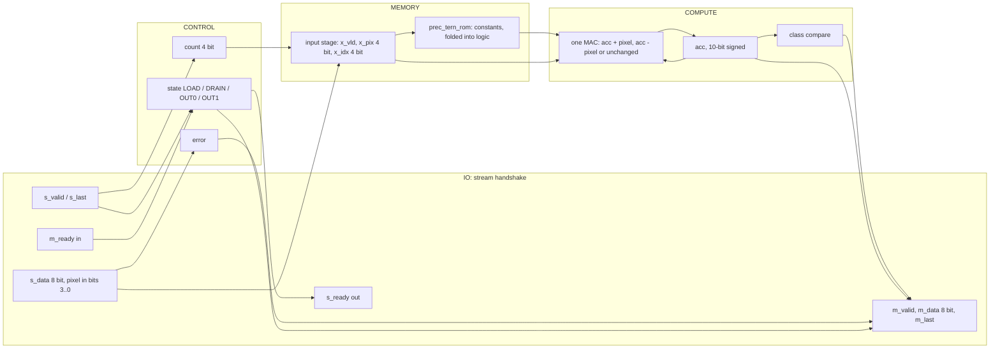
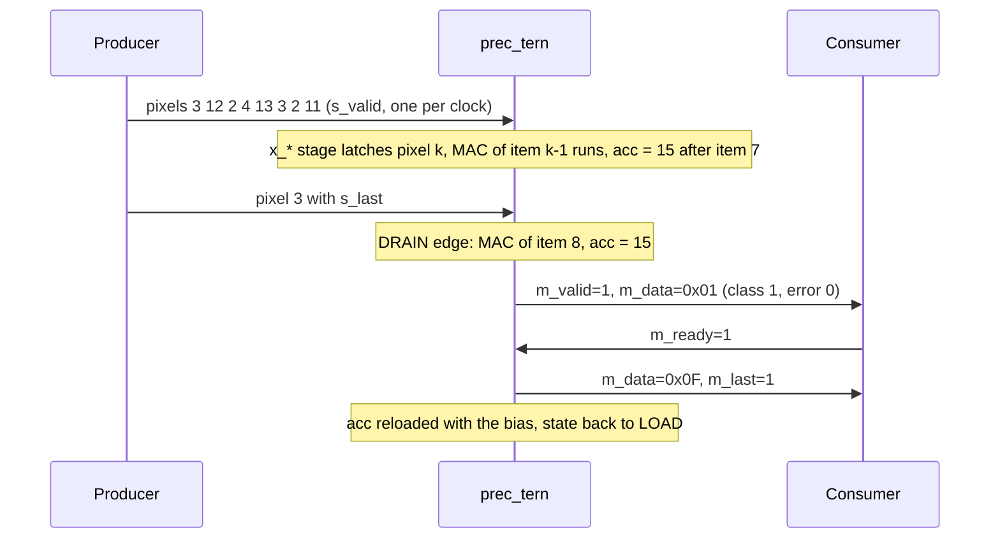
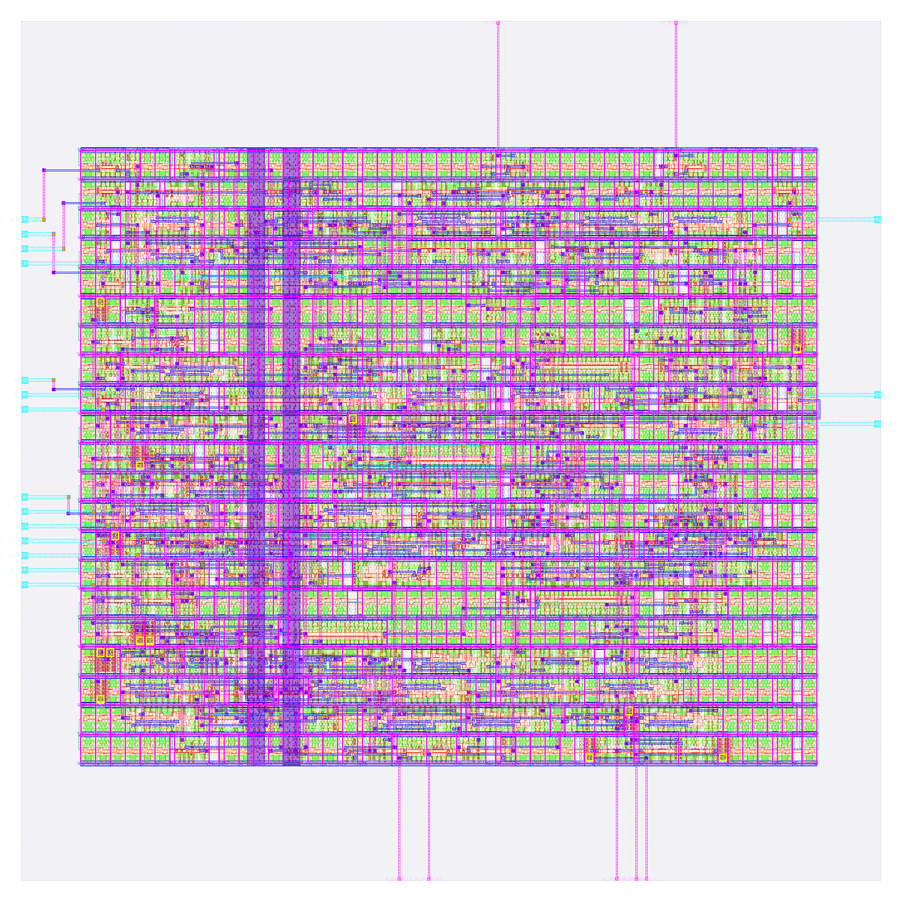

# prec_tern: design notes

## What it is

`prec_tern` is a one-neuron image classifier using ternary weights {-1, 0, +1} (TWN): it reads a 3 x 3 image of 4-bit pixels, one pixel per clock beat, and answers "vertical bar (1) or horizontal bar (0)?" (source: `designs/prec_tern/README.md`, `model/precision_hw/spec.md` section 1).
Weights are {-1, 0, +1}: threshold `delta = 0.7 * mean(|w|)` (TWN rule), weights above delta become +1, below -delta become -1, the rest 0; the bias is `RNE(b / alpha)` = -1 in units of alpha = 0.29243 (`spec.md` section 3.2). The five zero weights (w0, w2, w4, w6, w8) mean the corner and centre pixels do not vote at all.
It is one of seven engines that share task, trained fp32 weights, pins and control, and differ only in number format; all seven are hardened (`output/metrics.json` of each `designs/prec_<fmt>/`) and compared in the table near the end of this note.
Output: beat 0 = `{6'b0, error, class}`, beat 1 = fold of the accumulator (`spec.md` section 5.2); latency 2 cycles after the last input beat (`golden.LATENCY`, `spec.md` section 6).
Simulation: `make simulate DESIGN=prec_tern` printed `PASS prec_tern_tb: 931 cases, 4668 checks (results, latency, back-pressure, protocol errors, reset)`.
Hardening: `make flow-all` passed all 5 stages (simulate, gds, check, gate-level, collect) in 60 s total (`build/flow_prec_tern.log`); the stage-2 flow wall time is 47 s (`output/resources.json`).
Test accuracy 94.15 %, 98.80 % same decision as fp32 on 2000 held-out images (`python3 model/precision_hw/report.py`).

## Architecture



Registers (all in `rtl/prec_tern.v`; synchronous active-high reset):

| Register | Width | Purpose |
|---|---|---|
| `state` | 2 | FSM LOAD / DRAIN / OUT0 / OUT1 (Yosys recoded it one-hot: 4 flops) |
| `count` | 4 | beats accepted, saturates at 9; also the pixel index |
| `error` | 1 | sticky: bad item or wrong frame length |
| `x_vld` | 1 | input stage holds a used item |
| `x_pix` | 4 | the unsigned 4-bit pixel |
| `x_idx` | 4 | its index = ROM address |
| `acc` | 10 | 10-bit signed, starts at the bias |

RTL flip-flop bits: 26 (sum of the table). `metrics.json` (`design__instance__count__class:sequential_cell`) says 28, and `synth_stat.rpt` lists 28 `dfxtp_2`: the extra 2 are the one-hot recoding of the 4-state FSM (`yosys-synthesis.log`: "mapping auto encoding to `one-hot` for this FSM"; `build/flow/prec_tern/stage_check.log` also reports 28 surviving sequential cells).
There is no multiplier: the product is a conditional negate, so the MAC is one 10-bit add/subtract with skip. Synthesis shows 17 xor/xnor cells (11 `xnor2_2` + 6 `xor2_2`, 276.52 um^2, `synth_stat.rpt`) for the carry/invert path, and 1226.18 um^2 of non-flip-flop logic (1821.75 - 595.57, my subtraction), 2.25x the binary logic.
There is no weight RAM: 9 x 2 weight bits + a 9-bit bias = 27 parameter bits (`report.py`). The five zero weights are visible in the ROM as 00 codes, but the adder/subtractor stays generic.

## Data flow

One concrete image (vertical bar plus noise), `python3 model/precision_hw/golden.py --trace tern 3 12 2 4 13 3 2 11 3`: pixels 3 12 2 / 4 13 3 / 2 11 3.
The `--trace` command prints the final accumulator for integer formats (`integer: acc = 15 (code 00f)`, `class 1  beat1 0f`); the per-step column below is my own replay of the same rule with the weights of `spec.md` section 3.5 (+0, +1, +0, -1, +0, -1, +0, +1, +0; bias -1 (9-bit)), and it ends on the traced value.
Pixel k is accepted at edge k and latched into `x_*`; its MAC executes one edge later, so the MAC of item k overlaps the arrival of pixel k+1 (`spec.md` section 6). Edge 8 carries `s_last`; edge 9 is the DRAIN edge that does the last MAC.

| Edge | Beat accepted (pixel, x_idx) | MAC this edge (item, w, pixel) | acc after edge | State after |
|---|---|---|---|---|
| reset | | | -1 (loaded bias) | LOAD |
| 0 | 3 (idx 0) | none (x_vld = 0) | -1 | LOAD |
| 1 | 12 (idx 1) | item 0: w +0 x pixel 3 = skip | -1 | LOAD |
| 2 | 2 (idx 2) | item 1: w +1 x pixel 12 = +12 | 11 | LOAD |
| 3 | 4 (idx 3) | item 2: w +0 x pixel 2 = skip | 11 | LOAD |
| 4 | 13 (idx 4) | item 3: w -1 x pixel 4 = -4 | 7 | LOAD |
| 5 | 3 (idx 5) | item 4: w +0 x pixel 13 = skip | 7 | LOAD |
| 6 | 2 (idx 6) | item 5: w -1 x pixel 3 = -3 | 4 | LOAD |
| 7 | 11 (idx 7) | item 6: w +0 x pixel 2 = skip | 4 | LOAD |
| 8 | 3 (idx 8) | item 7: w +1 x pixel 11 = +11 | 15 | DRAIN |
| 9 | none (DRAIN) | item 8: w +0 x pixel 3 = skip | 15 | OUT0 |

Result: class 1 (acc 15 >= 0), beat 0 = 0x01 (error 0, class 1), beat 1 = 0x0F (`golden.py --trace`), `m_valid` high from the edge after the DRAIN edge (latency 2).



## Verification

Testbench: `designs/prec_tern/tb/prec_tern_tb.v` (defines `DUT prec_tern` and includes the shared body `shared/tb/stream_tb.vh`), `+VEC=designs/prec_tern/tb/vectors.hex`. For every case it sends the frame with random `s_valid` gaps, takes the two result beats with random `m_ready` stalls, and compares beat 0, beat 1, `m_last` and the latency; it also checks that the outputs hold under back-pressure, that `s_ready` is low from the last beat until the result is taken, and that reset mid-frame or with a result waiting returns to an empty ready state. Comparisons use `!==`, so X never passes; the first failure calls `$fatal`.
Fresh `make simulate DESIGN=prec_tern`: `PASS prec_tern_tb: 931 cases, 4668 checks (results, latency, back-pressure, protocol errors, reset)`

Vectors: `designs/prec_tern/tb/vectors.hex` is generated by `model/precision_hw/gen.py` from `golden.py`; the same 931 inputs are used for every format and only the expected values differ (`spec.md` section 8): 600 held-out test images, 37 further images where a non-binary format disagrees with fp32, 16 uniform images (v = 0..15), 27 single bright/dark/8-on-7 pixel images, 4 ideal bars/checkerboards, 16 sum-maximising/minimising images, 120 near-boundary random images, 60 uniform-random images, 8 short frames, 3 long frames, 36 out-of-range items (4 values x 9 positions), 4 short/bad-frame cases. 600+37+16+27+4+16+120+60+8+3+36+4 = 931. Every format sees 51 error cases.
Model level: `python3 model/precision_hw/golden.py --check` ends `golden: all self-checks passed`; for this format `tern/int4/int8/bin datapath == plain integer reference (2025 images) ok`, plus the accumulator-range lines quoted above.
Gate level: the same testbench runs on the synthesised netlist (`build/gl/prec_tern/runs/gl/final/nl/prec_tern.nl.v`, 160 cells, my grep count of sky130 instances) and on the routed netlist (`designs/prec_tern/runs/RUN_2026-10-05_20-17-29/final/nl/prec_tern.nl.v`, 727 instances including taps, fill and diodes, equal to `design__instance__count`). `build/flow/prec_tern/stages.txt` lists `gl_synth PASS` and `gl_final PASS` and `build/flow_prec_tern.log` times them at 4 s and 2 s (the `stage_gl_*.log` files hold only the command line); `build/gl/prec_tern/result.txt` reads `PASS`; `build/gl/prec_tern/synth_checks.txt` reads `synthesis__check_error__count = 0`.
Signoff: `build/flow_prec_tern.log` stage 3: `check : PASS ... DRC/LVS/XOR/antenna, slack at all corners, no logic lost (scripts/flow/check_signoff.py)`; `stage_check.log` reports `registers: RTL 28 (allowance 0), surviving sequential cells 28`.
Negative tests: none for this format in `tests/run_tests.sh` (its negative section corrupts one expected vector only for `prec_int8` among the prec formats), and none recorded in `designs/prec_tern/README.md`, so a wrong ROM constant being caught is not demonstrated beyond the 931-case coverage.

## Layout (GDSII)



The picture (`output/layout.png`, KLayout render) shows the 80 x 80 um die (`design__die__bbox`, `config.json`; 6400 um^2) with the core inside (`design__core__bbox` = `5.52 10.88 74.06 68.0`, 3915 um^2). Standard cells sit in horizontal rows, the power grid is on the upper metals and the 26 I/O (24 signals plus `vccd1`, `vssd1`; `design__io`) are on the edges.
Utilisation is 0.634708 (`design__instance__utilization`): 293 std cells, 2484.88 um^2 (`design__instance__area__stdcell`). In the final layout there are also 434 fill-class cells (330 `decap_3`, 55 `fill_1`, 49 `fill_2`; 1430.12 um^2, `metrics.json` and `cell_usage.rpt`), 57 tap cells and 13 antenna diodes.

## From RTL to GDSII: what each step did

### Synthesis

Yosys mapped the RTL to 160 sky130_fd_sc_hd cells, 1821.75 um^2, of which 595.57 um^2 (32.7 %) is the 28 `dfxtp_2` flip-flops (`output/reports/synth_stat.rpt`). Main contributors: 28 `dfxtp_2` (595.571 um^2, 32.7 %), 20 `and2_2`, 12 `a21o_2`, 12 `nor2_2`, 11 `xnor2_2` + 6 `xor2_2` (178.922 + 97.594 um^2), 8 `nand2_2`, 7 `o21a_2`, 6 `a211o_2`, 6 `a21oi_2`, 3 `mux2_1`. `synth_checks.rpt`: "Found and reported 0 problems"; `synthesis__check_error__count` = 0, lint warnings 446 (`design__lint_warning__count`).
Report: [synth_stat.rpt](output/reports/synth_stat.rpt), [synth_checks.rpt](output/reports/synth_checks.rpt).

### Floorplan

Die 80 x 80 um from `config.json`; core 3915 um^2; 160 instances (1821.750 um^2) give an effective utilisation of 0.465 before repair, CTS, taps and fill (`floorplan.txt`).
Report: [floorplan.txt](output/reports/floorplan.txt).

### Placement

Global placement ended at iteration 329 with HPWL 2098 um and 89 routability-mode iterations; final weighted congestion 0.8928; placed cell area 2081.96 um^2, +0.00 % growth (`placement_global.txt`). Detailed placement: original HPWL 3093.7 u, legalised 3217.0 u (+4 %); the step's own displacement lines read 0.0 u, while `design__instance__displacement__total` = 72.04 um (`placement_detailed.txt`, `metrics.json`). Timing repair added 58 buffers, 434.166 um^2 (`design__instance__count__class:timing_repair_buffer`, `design__instance__area__class:timing_repair_buffer`).
Reports: [placement_global.txt](output/reports/placement_global.txt), [placement_detailed.txt](output/reports/placement_detailed.txt).

### Clock tree

TritonCTS: 1 clock root, 5 buffers inserted, 28 sinks (equal to the flip-flop count) (`cts.rpt`). Worst setup-side skew 0.2545 ns (`clock__skew__worst_setup`); 13 hold buffers were inserted (`design__instance__count__hold_buffer`); 5 clock-buffer-class cells in the final design (`metrics.json`).
Report: [cts.rpt](output/reports/cts.rpt).

### Routing

Global routing: 235 routed nets, `global_route__wirelength` = 6610, `global_route__vias` = 1333 in `metrics.json` (the `routing_global.txt` log itself prints 6499 um and 1315 vias; the reason for the difference was not checked). Detailed routing: DRC violations per iteration 50, 5, 6, 0 (`route__drc_errors__iter:*`), final `route__drc_errors` = 0; wire length 3895 um (met1 1871, met2 1849, met3 174 um, `routing_detailed.txt`), 1363 vias, longest net 136.71 um (`route__wirelength__max`).
Reports: [routing_global.txt](output/reports/routing_global.txt), [routing_detailed.txt](output/reports/routing_detailed.txt).

### Timing

Clock period 25 ns (`config.json`). All corners pass, setup and hold TNS 0 (`timing_summary.rpt`, `metrics.json`).

| Corner | Worst setup slack (ns) | Worst hold slack (ns) |
|---|---|---|
| nom_tt_025C_1v80 | 18.0217 | 0.3106 |
| nom_ss_100C_1v60 | 16.3825 | 0.8869 |
| nom_ff_n40C_1v95 | 18.6309 | 0.1131 |
| Overall worst | 16.3457 (max_ss_100C_1v60) | 0.1118 (min_ff_n40C_1v95) |

Worst setup path (`timing_paths_max_ss.rpt`): flip-flop `_282_` to output port `m_data[0]`, slack 16.345718 ns, data arrival 3.404 ns (output delay leaves 19.75 ns required). Worst hold path (`timing_paths_min_ff.rpt`): flip-flop `_279_` to `_281_`, slack 0.111753 ns.
Reports: [timing_summary.rpt](output/reports/timing_summary.rpt), [timing_paths_max_ss.rpt](output/reports/timing_paths_max_ss.rpt), [timing_paths_min_ff.rpt](output/reports/timing_paths_min_ff.rpt).

### DRC

Magic `COUNT: 0` (`drc_magic.rpt`); KLayout: all 257 rule entries in `drc_klayout.json` are 0 (my sum); `manufacturability.rpt`: DRC Passed.
Reports: [drc_magic.rpt](output/reports/drc_magic.rpt), [drc_klayout.json](output/reports/drc_klayout.json), [manufacturability.rpt](output/reports/manufacturability.rpt).

### LVS

`lvs_netgen.rpt`: "Circuits match uniquely." with 240 devices and 238 nets each side; `manufacturability.rpt`: LVS Passed.
Report: [lvs_netgen.rpt](output/reports/lvs_netgen.rpt).

### Power / IR drop

Total power 1.4394e-04 W (`power__total`: internal 1.0752e-04, switching 3.641e-05 W). `irdrop.rpt` (its own total 0.000123 W): vccd1 worst IR drop 1.23e-04 V, average 3.01e-05 V; vssd1 worst 7.33e-05 V (the worst vccd1 drop is 0.0068 % of 1.8 V, my division).
Report: [irdrop.rpt](output/reports/irdrop.rpt).

### Antenna, slew, capacitance

13 antenna diodes inserted (`design__instance__count__class:antenna_cell`); `antenna__violating__nets` = 0; `manufacturability.rpt`: Antenna Passed. Max-cap violations 0, max-slew violations 9, max-fanout violations 0 (`design__max_cap_violation__count`, `design__max_slew_violation__count`, `design__max_fanout_violation__count`); the 9 slew violations are in the three ss corners only (0 in tt and ff) and `check_signoff.py` prints them as a note without failing (`stage_check.log`). Classification (run dir `57-openroad-stapostpnr/max_ss_100C_1v60/checks.rpt`): the 9 pins (`_203_/C1`, `_193_/B1`, `_236_/C1`, `_240_/B1`, `_253_/B1`, `_183_/B1`, `_249_/C1`, `_171_/A` and the driver pin `fanout27/X`) are all on one net at about 0.839 ns against the 0.75 ns limit, driven by `fanout27`, a flow-inserted internal buffer; none is an input-port-limited case. Repair margin used: 40 % (`config.json` keys `PL_RESIZER_MAX_SLEW_MARGIN`, `GRT_DESIGN_REPAIR_MAX_SLEW_PCT`); no other margin was tried for this design (not verified).
Report: [cell_usage.rpt](output/reports/cell_usage.rpt).

## Run time and memory

From `output/resources.json` (profile "tight": 2 CPUs, 8 GB): total wall time 47 s, container peak memory 600,117,248 bytes (0.559 GB), 78 steps. Whole `flow-all` 60 s (`build/flow_prec_tern.log`; gate-level stages 4 s and 2 s).

| Step | Wall time (s) |
|---|---|
| 46-openroad-detailedrouting | 8.172 |
| 35-openroad-cts | 3.95 |
| 57-openroad-stapostpnr | 2.498 |

## Reproduce

```bash
python3 model/precision_hw/golden.py --check   # self-checks
python3 model/precision_hw/gen.py              # rtl/prec_tern_rom.v and tb/vectors.hex
make simulate DESIGN=prec_tern                       # RTL simulation, 931 cases
make flow-all DESIGN=prec_tern                       # simulate, gds, check, gate-level, collect
python3 model/precision_hw/report.py           # study table incl. this design's metrics
```

`rtl/prec_tern_rom.v` is generated (header carries the sha256 of `golden.py` and `gen.py`); never edit it.

## Comparison of the seven hardened formats

All seven formats have a hardened run; the float formats (fp8, fp16, bf16) close timing only narrowly (setup slack 0.26, 0.11 and 0.04 ns at the worst corner, `metrics.json`), which is why they use a 2-stage MAC and latency 3 (`spec.md` section 6). Columns come from each design's `output/metrics.json`, `synth_stat.rpt` and `python3 model/precision_hw/report.py` (tables A and B).

| Metric | prec_bin | prec_tern | prec_int4 | prec_int8 | prec_fp8 | prec_fp16 | prec_bf16 | Source |
|---|---|---|---|---|---|---|---|---|
| Std cells | 199 | 293 | 377 | 642 | 1404 | 1932 | 1754 | `design__instance__count__stdcell` (metrics.json) |
| Synthesised cells | 83 | 160 | 230 | 352 | 709 | 905 | 776 | `synth_stat.rpt` |
| Flip-flops | 19 | 28 | 30 | 35 | 49 | 52 | 51 | `design__instance__count__class:sequential_cell` |
| Std-cell area (um^2) | 1473.91 | 2484.88 | 3263.13 | 4859.66 | 9225.10 | 11912.7 | 10169.8 | `design__instance__area__stdcell` |
| Die (um) | 80 x 80 | 80 x 80 | 80 x 80 | 120 x 120 | 170 x 170 | 220 x 220 | 220 x 220 | `config.json`, `design__die__bbox` |
| Utilisation | 0.376 | 0.635 | 0.833 | 0.457 | 0.396 | 0.291 | 0.249 | `design__instance__utilization` |
| Routed wirelength (um) | 2154 | 3895 | 6171 | 8187 | 21106 | 28736 | 23952 | `route__wirelength` |
| Worst setup slack (ns) | 16.40 | 16.35 | 13.46 | 11.39 | 0.26 | 0.11 | 0.04 | `timing__setup__ws` |
| Worst hold slack (ns) | 0.114 | 0.112 | 0.115 | 0.111 | 0.107 | 0.111 | 0.110 | `timing__hold__ws` |
| Total power (W) | 1.0548e-04 | 1.4394e-04 | 1.8792e-04 | 2.4041e-04 | 1.0168e-03 | 1.9289e-03 | 1.2715e-03 | `power__total` |
| Test accuracy (%) | 88.95 | 94.15 | 94.25 | 94.05 | 94.15 | 94.05 | 94.00 | `report.py` |
| Same decision as fp32 (%) | 90.30 | 98.80 | 98.90 | 100.00 | 98.30 | 100.00 | 99.95 | `report.py` |
| Parameter bits | 13 | 27 | 47 | 88 | 80 | 160 | 160 | `report.py` |
| Bits moved / inference | 22 | 63 | 83 | 124 | 116 | 196 | 196 | `report.py` |
| Pipeline latency (cycles after last beat) | 2 | 2 | 2 | 2 | 3 | 3 | 3 | `report.py` study table A |

## Intuitions and insights

1. **What the format is and how the weights came about.** Three levels, 2 bits per weight. The TWN rule keeps the weights whose magnitude exceeds 0.7 x mean|w| (`spec.md` section 3.2): w1 and w7 become +1, w3 and w5 become -1, and the other five become 0. The four surviving weights are pixels 1, 7 (the top and bottom of the centre column) and 3, 5 (the two ends of the centre row), the bar geometry, without the centre pixel 4; the trained fp32 weights near 0 are dropped.

2. **Accuracy.** 94.15 % test accuracy, 98.80 % same decision as fp32 (`report.py`): equal to fp32 within noise (94.05 %). Having 0 as a weight is what the binary format lacks; ternary recovers all the lost accuracy at 27 parameter bits, 2x binary's storage per weight.

3. **What the MAC costs in gates.** No multiplier: the product is add, subtract or skip. `synth_stat.rpt`: 17 xor/xnor cells (276.52 um^2) for the carry/invert path and 1226.18 um^2 of non-flip-flop logic, 2.25x the binary logic (544.27 um^2). Total 160 cells, 1821.75 um^2 at synthesis.

4. **Accumulator width.** 10 signed bits for any ROM (`spec.md` section 4.2), but the trained ROM reaches only [-31, 29] (`golden.py --check`). The headroom (about 4 bits) is pure generality: 4 flops that this one ROM does not need.

5. **Weight memory versus what synthesis did.** 27 parameter bits, no storage cells: the ROM is folded into logic on `x_idx`. The RTL header notes that the five zero weights remove five of nine adder steps only "in effect": the hardware is still a generic add/sub because the weights are data in the ROM. A hard-wired ternary datapath that skips those pixels would be smaller still.

6. **Bits moved.** 63 bits per inference (36 pixel bits + 27 parameter bits, `report.py`), 2.9x binary and 5.7x fewer than fp32's 356.

7. **Timing headroom.** Worst setup slack 16.3457 ns of 25 ns; the worst path is a register to the output port `m_data[0]` with 3.40 ns data arrival, so even the add/sub is far from the clock limit; the single-stage MAC closes. Hold 0.1118 ns at min_ff. The 9 max-slew violations in the ss corners (`timing_summary.rpt`) are the only blemish.

8. **Where the area goes.** 293 std cells = 160 synthesised + 58 timing-repair + 5 clock buffers + 13 diodes + 57 taps (my sum). The 58 repair buffers (434.17 um^2) are 24 % of synthesised area; fill is 434 cells, 1430.12 um^2, and utilisation is 0.635.

9. **Takeaway.** For 1.47x the standard cells and 1.36x the power of binary (293 vs 199; 1.439e-4 vs 1.055e-4 W, my ratios), ternary reaches fp32-level accuracy. It is the cheapest format that has no accuracy penalty on this task.
