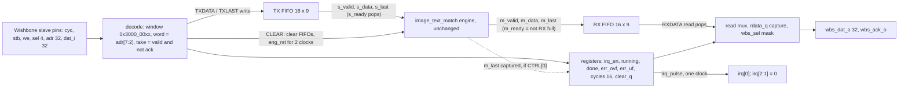
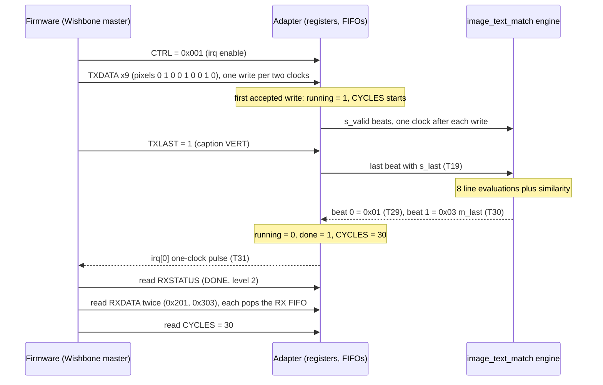
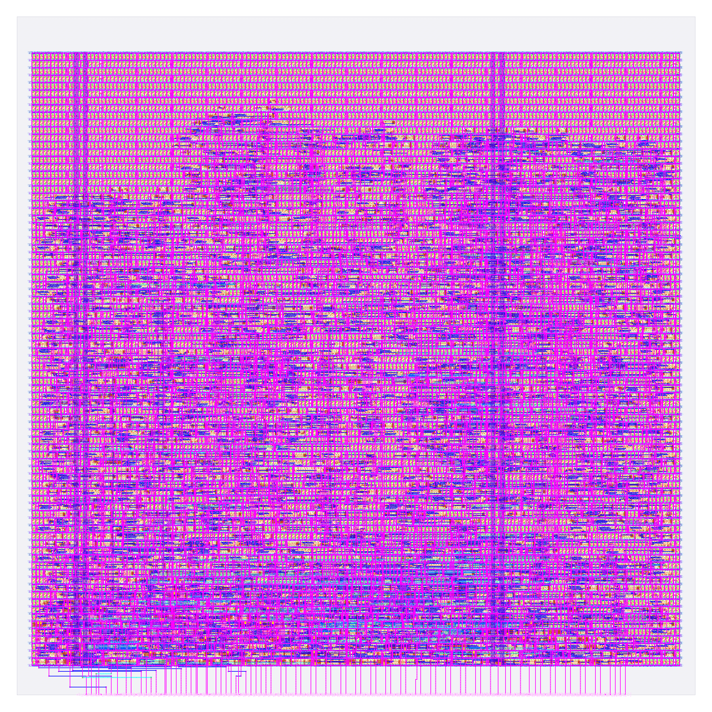

# soc_image_text_match: design notes

Every number below comes from `output/` (metrics.json, resources.json, flow.log, reports/*), `config.json`, `rtl/`, `tb/`,
`../../shared/rtl/wb_stream_adapter.v`, `build/flow/soc_image_text_match/stage_*.log` (`stages.txt`), `build/flow_soc_itm.log`
or from a command re-run while writing this file (named where used). Run: `runs/RUN_2026-10-06_08-18-20`
(`output/resources.json` `run_dir`). `make flow-all` passed all 5 stages (`build/flow/soc_image_text_match/stages.txt`: simulate 1 s,
gds 165 s, check 0 s, gate-level synthesised 8 s and routed 7 s, collect 4 s; my sum 185 s). The first run of 2026-10-05 (`runs/RUN_2026-10-05_21-07-22`) gave identical `metrics.json`; see Run time and memory.

## What it is

`soc_image_text_match` is a generic Wishbone-to-stream bridge, `shared/rtl/wb_stream_adapter.v` (TX FIFO and RX FIFO, 16 entries each,
9-bit TX entries `{last, data[7:0]}`), wired to ONE unchanged stream engine, `image_text_match` (`designs/image_text_match`: a 3 x 3 one-bit
image plus one caption token in as 10 beats, two result beats out: `{error, class}` and the similarity score). `rtl/soc_image_text_match.v`
is wiring only. Its port list is exactly `tiny_ai_core`'s: 109 signal pins (`design__io` = 111 with `vccd1`/`vssd1`), so it drops into
`user_project_wrapper` as `mprj` without touching the wrapper except for the macro name (`README.md`).

What is AI and what is not: the AI is only the engine, an embedding-pair matcher whose learned kernels, thresholds and caption table live in
`image_text_match_rom.v`. The adapter is ordinary system glue: bus decode, two FIFOs, status flags, a run timer, an interrupt. It adds no
weights. Software pushes beats with `TXDATA`/`TXLAST`, waits for `irq[0]` or `RXSTATUS.DONE`, pops two beats from `RXDATA` and reads `CYCLES`.

Simulation: `make simulate DESIGN=soc_image_text_match` (re-run 2026-10-06) printed
`PASS soc_image_text_match_tb: 2079 cases (all of tb/vectors.hex: results, m_last, CYCLES, irq, DONE polling), registers, CLEAR/reset mid-frame, 50947 checks`.
Hardened result (`output/metrics.json`): 3201 standard cells, 393 flip-flops, DRC, LVS, XOR, antenna all 0; worst setup +2.956 ns and worst hold
+0.110 ns over 9 corners; 421 max-slew violations reported (see Intuitions).

## Architecture



Register map (base `0x3000_0000`, 256-byte window, byte offsets; header of `wb_stream_adapter.v`, `README.md`):

| Offset | Name | Access | Fields |
|---|---|---|---|
| 0x00 | ID | R | 0x5354_5201 |
| 0x04 | CTRL | RW | [0] irq enable (byte lane 0); write bit 8 CLEAR (byte lane 1, self-clearing, reads 0) |
| 0x08 | STATUS | R | [0] TX_FULL [1] TX_EMPTY [2] RX_EMPTY [3] BUSY [4] DONE [5] ERR_OVF [6] ERR_UF, [15:8] TX level, [23:16] RX level |
| 0x0C | TXDATA | W | [7:0] pushed with `s_last` = 0 |
| 0x10 | TXLAST | W | [7:0] pushed with `s_last` = 1 |
| 0x14 | RXDATA | R | [7:0] `m_data`, [8] `m_last`, [9] valid; the read pops the RX FIFO (empty: 0 and ERR_UF) |
| 0x18 | RXSTATUS | R | [0] EMPTY [1] HEAD_LAST [2] DONE [15:8] RX level, no side effect |
| 0x1C | CYCLES | R | clocks from the edge that accepts a run's first TX beat to the edge that captures its `m_last` beat (16 bit, saturating) |
| 0x20 | CAPS | R | [7:0] version 1, [15:8] TX depth 16, [23:16] RX depth 16 (testbench expects 0x0010_1001) |

Flip-flop accounting. Declared RTL bits in the adapter: FIFO storage 2 x 16 x 9 = 288, FIFO pointers and counters 2 x (wp 4 + rp 4 + cnt 5) = 26,
`rdata_q` 32, `cycles` 16, nine one-bit flags (`ack`, `rd_ack`, `irq_en`, `clear_q`, `running`, `done`, `err_ovf`, `err_uf`, `irq_pulse`) = 9; sum 371.
The engine's surviving flip-flops are 39 (`designs/image_text_match/output/metrics.json`; `python3 scripts/flow/check_signoff.py image_text_match`: RTL 39, surviving 39).
`design__instance__count__class:sequential_cell` = 393 and 393 `dfxtp_2` in `output/reports/synth_stat.rpt`; `stage_check.log` of this design reads
"registers: RTL 393 (allowance 0), surviving sequential cells 393". Grouping the 393 `dfxtp_2` instances of the synthesised netlist
(`build/gl/soc_image_text_match/runs/gl/final/nl/soc_image_text_match.nl.v`) by the register name on their Q pin gives:

| Group | Flip-flops | Source of the number |
|---|---|---|
| TX FIFO storage `u_tx.mem` | 144 (16 x 9) | netlist Q names |
| RX FIFO storage `u_rx.mem` | 128 (16 x 8; bit 7 of the 9-bit entries has no flip-flop) | netlist Q names |
| FIFO pointers and counters (named `wp`, `rp`, count regs) | 26 | netlist Q names |
| `rdata_q` | 23 named | netlist Q names |
| `cycles` | 16 | netlist Q names |
| single-bit flags (`ack`, `rd_ack`, `irq_en`, `clear_q`, `running`, `done`, `err_ovf`, `err_uf`, `irq_pulse`) | 9 | netlist Q names |
| 8 unnamed (`_0000_` to `_0007_`) | 8 | their outputs drive the select pins of the 16-way read muxes (`mux4_2` S0, `mux2_1` S), so they are read-pointer or pointer-copy bits |
| engine (`u_engine.*`, `s_ready`, `m_last`) | 39 | netlist Q names; equals the engine alone (39) |

Totals: 144 + 128 + 26 + 23 + 16 + 9 + 8 + 39 = 393, equal to the metric. FIFO storage is 272 (69.2 %), the whole adapter 354 (90.1 %), the engine
39 (9.9 %). Reconciliation with the declared 371 + 39 = 410: 17 declared bits are not in the netlist as such (the 16 of RX bit 7 and 9 `rdata_q` bits that are
constant or merged, minus the 8 extra read-pointer-like flip-flops); I could not attribute the last bits exactly by name, and the "8 unnamed are read pointers" reading
is inferred from their fanout, not from a Yosys log. The `README.md` estimate "about 420 flip-flops" was an estimate; 393 is the measured count.

## Data flow

Example: the `image_text_match` worked example, pixels `0 1 0 0 1 0 0 1 0` (lit middle column), caption VERT (token 1), `CTRL` irq enable already set,
no CLEAR in the middle. `python3 model/image_text_match/golden.py 0 1 0 0 1 0 0 1 0 1` printed `beat0=0x01 beat1=0x03 latency=10` (class 1, score 3).
The trace below comes from a throwaway testbench (not checked in; it only instantiates `soc_image_text_match` and prints `tx_push`, `s_valid & s_ready`,
`rx_push`, `irq_pulse` per clock) run with iverilog on the RTL, using the same two-edge-per-transaction bus timing as `tb/soc_image_text_match_tb.v`
(request edge, then an idle edge). T is the clock edge relative to the edge that accepts the first TX beat.

| Edge | Event | State after |
|---|---|---|
| T0 | write TXDATA = 0 (pixel 0) accepted: `running` = 1, `cycles` = 0, `done` = 0 | TX FIFO level 1 |
| T1 | engine takes beat 0 (`s_valid` & `s_ready`); TX FIFO empties; bus is idle for this edge | engine count 1 |
| T2, T4 ... T18 | one more TXDATA write per two clocks (pixels 1 to 8), each accepted at the even edge | each beat taken by the engine on the next odd edge |
| T18 | write TXLAST = 1 (caption token, `s_last` = 1) accepted | TX FIFO level 1 |
| T19 | engine takes the last beat (10th); engine starts its 8-line scan | `s_ready` low until the result is out |
| T20 to T28 | engine computes: 8 lines, one similarity step (10 edges counting the accepting one) | TX and RX FIFOs empty; `cycles` counts up |
| T29 | engine result beat 0 `m_data` = 0x01 captured into the RX FIFO (`rx_push`) | RX level 1 |
| T30 | result beat 1 `m_data` = 0x03 with `m_last` captured; `running` = 0, `done` = 1, `cycles` = 30 | RX level 2 |
| T31 | `irq_pulse` = 1, so `irq[0]` is high for exactly one clock | |
| later | firmware reads RXSTATUS = 0x204 (RX level 2, DONE), RXDATA = 0x201, RXDATA = 0x303, CYCLES = 30, STATUS = 0x16 (DONE, RX empty, TX empty) | RX FIFO empty |

The printed values were `RXSTATUS 00000204`, `RXDATA0 00000201` ({valid, last = 0, data 0x01}), `RXDATA1 00000303` ({valid, last = 1, data 0x03}),
`CYCLES 30`, `STATUS 00000016`; in the printout the first TX push is at simulation edge 7, the last at 25, the engine takes the last beat at 26, `rx_push`
at 36 and 37, `irq_pulse` visible at 38, so 37 - 7 = 30. The engine's latency of 10 edges after the last input beat shows as T19 to T29. `CYCLES` = 30 here is
mostly bus pace: 10 writes at 2 edges each is 19 edges until the engine has its last beat, plus 10 for the engine, plus the capture of beat 1. The engine alone,
fed back to back, needs 21 clocks per frame (`designs/image_text_match/NOTES.md`). The testbench only requires `n beats <= CYCLES <= 100` (`tb/soc_image_text_match_tb.v`).



Back-pressure: `m_ready` = RX not full and no CLEAR in progress, so a full RX FIFO stalls the engine and no result is lost; a TX write while the TX FIFO
is full is dropped and sets the sticky ERR_OVF (header of `wb_stream_adapter.v`). CLEAR empties both FIFOs and holds the engine in reset for two clocks (`eng_rst` = `wb_rst_i` or `clear_q`).

## Verification

Testbench: `designs/soc_image_text_match/tb/soc_image_text_match_tb.v` is ports only (runs unchanged on RTL and gate level). It reads the ID, CAPS (0x0010_1001),
CTRL, STATUS (0x6 after reset), an unmapped offset, an out-of-window address and the other region (all 0), then for every case writes n-1 beats to TXDATA and the last to
TXLAST, waits for the one `irq[0]` pulse (odd cases) or polls `RXSTATUS.DONE` (even cases), checks RX level 2, reads `RXDATA` twice and compares `{valid, m_last, m_data}`,
reads CYCLES (in range) and STATUS (0x16), and requires exactly one one-clock irq pulse per case and `irq[2:1]` quiet. Afterwards CLEAR in the middle of a frame and reset
in the middle of a frame, each followed by a full case. The ack must be one clock wide and never without a request; `!==` is used so X never passes; 400,000,000 ns timeout.
`tb/vectors.hex` is a copy of `designs/image_text_match/tb/vectors.hex`: 512 images x 4 captions = 2,048 golden pairs plus 31 protocol cases (short and long frames, out-of-range items)
= 2,079 (`designs/image_text_match/NOTES.md`).

- RTL (`make simulate DESIGN=soc_image_text_match`, re-run): `PASS soc_image_text_match_tb: 2079 cases (all of tb/vectors.hex: results, m_last, CYCLES, irq, DONE polling), registers, CLEAR/reset mid-frame, 50947 checks`.
- Adapter regression with all 13 stream engines (`bash tests/adapter/run.sh`, re-run), each line is a separate PASS. The script now covers 14 engines (`kv_attn_n8` was added to `tests/adapter/run.sh` and ends `adapter tests: 14 engines PASS`, `build/state_snapshot.md`); the lines below are the 13 stream-engine results from the earlier run:
  - `PASS vision_all_lit: 113 input beats, 60 result beats checked (...), 369 bus transactions, 558 checks`
  - `PASS vision_block: 4827 input beats, 1082 result beats checked (...), 10835 bus transactions, 16726 checks`
  - `PASS text_sentiment: 1073 input beats, 540 result beats checked (...), 2769 bus transactions, 4398 checks`
  - `PASS image_text_match: 20748 input beats, 4160 result beats checked (...), 45766 bus transactions, 70657 checks`
  - `PASS audio_pitch: 4564 input beats, 2021 result beats checked (...), 11244 bus transactions, 17751 checks`
  - `PASS audio_onset: 68829 input beats, 67740 result beats checked (...), 205726 bus transactions, 342503 checks`
  - `PASS prec_bin`, `prec_tern`, `prec_int4`, `prec_int8`, `prec_fp8`, `prec_fp16`, `prec_bf16`: each 8338 input beats, 1864 result beats checked, 18636 bus transactions, 28817 checks.
  The parenthesis in every line reads "registers, burst/overflow, back-pressure, irq, CLEAR, replay".
- Gate level synthesised (`build/flow/soc_image_text_match/stage_gl_synth.log`): netlist `build/gl/soc_image_text_match/runs/gl/final/nl/soc_image_text_match.nl.v`, 1426 cells,
  `PASS soc_image_text_match_tb: 2079 cases ..., 50947 checks`, `gl_sim: soc_image_text_match PASS (3 s)`; `synthesis__check_error__count = 0`.
- Gate level routed (`stage_gl_final.log`): `designs/soc_image_text_match/runs/RUN_2026-10-06_08-18-20/final/nl/soc_image_text_match.nl.v`, 10342 cells (fill, tap, decap included), the same PASS line with 50947 checks,
  `gl_sim: soc_image_text_match PASS (6 s)`. `build/gl/soc_image_text_match/result.txt` reads `soc_image_text_match | final:soc_image_text_match.nl.v | every case of tb/vectors.hex | PASS | 6 s`.
  Both runs print the benign warning `$readmemh ... Not enough words in the file for the requested range [0:65535]` (the vector array is larger than the file).
- Signoff check (`scripts/flow/check_signoff.py`, `stage_check.log`): `registers: RTL 393 (allowance 0), surviving sequential cells 393`, `note: max-slew violations: 421`, `note: max-cap violations: 0`, `=> PASS`: no logic was lost.
- Not verified here: no firmware has been run against this macro and it was not part of the full-Caravel simulations or the local precheck (those ran for the `tiny_ai_core` wrapper only, `build/state_snapshot.md`). It is instantiated in the Caravel wrapper [../user_project_wrapper_soc_itm/NOTES.md](../user_project_wrapper_soc_itm/NOTES.md), which passed its own flow; the register map is exercised only by the testbenches above.

## Layout (GDSII)



The picture (`output/layout.png`, KLayout render) shows the 250 x 250 um die (`design__die__bbox` = `0.0 0.0 250.0 250.0`, 62500 um^2); the core is `design__core__bbox` = `5.52 10.88 244.26 236.64`,
53897.9 um^2, 83 rows (`design__rows`). Compared with `tiny_ai_core` the core is much more filled: the logic cloud covers the middle and lower two thirds of the core, while the top band (roughly the upper
quarter of the picture) is mostly tap and fill cells with few signal wires. Two vertical power straps are visible as darker bands near the left (about 11 % of the width) and right-centre (about 68 %) of the core.
The thin vertical wires below the core are the routes to the 109 signal pins on the bottom (S) edge, ordered like the wrapper's Wishbone pads (`config.json` `//IO_PIN_ORDER_CFG`, `pin_order.cfg`; `irq` at the right end).
`design__io` = 111 is the 109 plus `vccd1` and `vssd1`.
Cells (`metrics.json`): 10342 instances in total; 7141 fill (`design__instance__count__class:fill_cell`; `cell_usage.rpt`: 5807 `decap_3`, 738 `fill_1`, 596 `fill_2`) and 3201 standard cells
(`design__instance__count__stdcell`, area 29686 um^2, utilization 0.550781; 7141 + 3201 = 10342, my sum): 1001 multi-input combinational, 393 sequential, 684 timing-repair buffers (of which 421 are hold buffers), 269 clock buffers and 5 clock inverters,
28 inverters, 4 buffers, 52 antenna diodes and the 765 tap cells (my sum of these classes: 3201). Routed wire length 61165 um over 2369 nets (`route__wirelength`, `route__net`).

## From RTL to GDSII: what each step did

### Synthesis

Yosys mapped the RTL (adapter, two FIFOs, engine, ROM) to sky130_fd_sc_hd: 1426 cells, 18350.099 um^2, of which 8359.267 um^2 (45.55 %) is sequential (`output/reports/synth_stat.rpt`). Main types: 393 `dfxtp_2`,
200 `mux2_1` (2252.2 um^2), 105 `a22o_2`, 101 `nor2_2`, 60 `and2_2`, 46 `a21o_2`, 41 `mux4_2` (923.4 um^2), 36 `nand2_2`, 35 `or4_2`, 32 `a21oi_2`, 28 `inv_2`, 8 `conb_1`, 4 `buf_2`.
For comparison the engine alone synthesises to 253 cells, 2630.022 um^2 (`designs/image_text_match/output/reports/synth_stat.rpt`), so the adapter is about 15720 um^2 (85.7 %) of the 18350 um^2 (a subtraction of two separate syntheses, approximate).
`synth_checks.rpt`: "Found and reported 0 problems"; `synthesis__check_error__count` = 0, `design__inferred_latch__count` = 0, `design__instance_unmapped__count` = 0, lint 0 errors and 448 warnings (`design__lint_warning__count`).
Report: [synth_stat.rpt](output/reports/synth_stat.rpt), [synth_checks.rpt](output/reports/synth_checks.rpt).

### Floorplan

The die is fixed at 250 x 250 um by `config.json` (`FP_SIZING` absolute, `DIE_AREA` 0 0 250 250), the same as `tiny_ai_core`. OpenROAD added 83 rows of 519 sites, core area 53897.942 um^2, instance area 18350.099 um^2,
effective utilization 0.340 with 1426 instances (`floorplan.txt`: IFP-0102 to IFP-0105), before taps, buffers and repair. The Caravel macro SDC `base_soc.sdc` is read: clock `clk` 25 ns on `wb_clk_i`, max transition 0.75, max fanout 8,
clock latency range 4.65 : 5.57, clock transition 0.61 (`cts.rpt` preamble, same file as `tiny_ai_core`'s).
Report: [floorplan.txt](output/reports/floorplan.txt).

### Placement

Global placement finished at iteration 452 with 71 routability iterations and final weighted congestion 0.8991, target 1.01 achieved (`placement_global.txt`, GPL-1001, GPL-1005, GPL-0050).
Detailed placement: HPWL 43454.8 u before, 42359.4 u after (-2.5 %), displacement 0.0 u in its own analysis (`placement_detailed.txt`); over the whole flow `design__instance__displacement__total` = 288.1 um, max 22.68 um.
765 tap cells. Timing repair added 684 buffers in the final metrics (`design__instance__count__class:timing_repair_buffer`).
Reports: [placement_global.txt](output/reports/placement_global.txt), [placement_detailed.txt](output/reports/placement_detailed.txt).

### Clock tree

TritonCTS built one clock root with 186 buffers (185 `clkbuf_8`, 1 `clkbuf_16`) driving 393 sinks, plus 88 dummy load cells (60 `clkbuf_4`, 21 `clkbuf_8`, 2 `bufinv_16`, 2 `clkbuf_2`, 1 `bufinv_8`, 1 `clkinv_2`, 1 `clkinvlp_4`) (`cts.rpt`).
Clock buffers in the final metrics: 269 `clock_buffer` and 5 `clock_inverter` cells. Worst skew in `metrics.json`: setup 0.3544 ns, hold -2.1877 ns; the hold figure includes the SDC's 4.65 to 5.57 ns source-latency spread, and the
underlying breakdown is not reported. After CTS, repair added 421 hold buffers (`design__instance__count__hold_buffer`, in `cell_usage.rpt` as 421 `dlygate4sd3_1`), 0 setup buffers. (The count 421 equals the slew violation count by coincidence; they are different things.)
The tree is large relative to `image_text_match` alone (9 `clkbuf_16` for 39 sinks, `designs/image_text_match/NOTES.md`) because the sink count is 10 times larger and `CTS_SINK_CLUSTERING_SIZE` is 8.
Report: [cts.rpt](output/reports/cts.rpt).

### Routing

Global routing: total wirelength 91362 um in `routing_global.txt` (GRT-0018; `global_route__wirelength` = 91728, `global_route__vias` = 34 in metrics), layers met1 to met4 (`RT_MAX_LAYER` met4). Detailed routing: DRC violations per iteration
30, 0, 160, 12, 0 (`route__drc_errors__iter:0..4`), final `route__drc_errors` = 0. Final wire length 61165 um (`route__wirelength`; met1 29345, met2 29212, met3 2139, met4 468 um in `routing_detailed.txt`),
longest net 256.47 um (`route__wirelength__max`), 15215 vias all single-cut, 2369 routed nets.
Reports: [routing_global.txt](output/reports/routing_global.txt), [routing_detailed.txt](output/reports/routing_detailed.txt).

### Timing

`timing_summary.rpt`: setup violation counts 0 and hold violation counts 0 in all 9 corners; overall worst setup +2.9562 ns (max_ss_100C_1v60) and worst hold +0.1101 ns (min_ff_n40C_1v95). Register-to-register setup slack is not reported (N/A).
Worst setup path (`timing_paths_max_ss.rpt`, max_ss, slack 2.956203 ns): starts at input port `wbs_adr_i[18]` (clock network delay 5.57 ns, input external delay 3.89 ns, input slew 0.92 ns), passes `hold333`
(`dlygate4sd3_1`, 1.512 ns), an input buffer (`clkdlybuf4s25_1`), `hold334` (`dlygate4sd3_1`, 1.175 ns), an `or4_2` (1.373 ns), `hold335`, an `or4bb_2`, `hold336` and further decode cells (six `hold*` delay cells in total, 7.80 ns, my sum of their listed delays) and ends at flip-flop `_2229_`. Worst hold path (`timing_paths_min_ff.rpt`, min_ff, slack 0.110096 ns):
flip-flop `_2374_` to `_2324_`. The 25 ns clock is generous; setup is never the limit, hold and slew are.
Reports: [timing_summary.rpt](output/reports/timing_summary.rpt), [timing_paths_max_ss.rpt](output/reports/timing_paths_max_ss.rpt), [timing_paths_min_ff.rpt](output/reports/timing_paths_min_ff.rpt).

### DRC

Magic: `COUNT: 0` (`drc_magic.rpt`); `magic__drc_error__count` = 0, `klayout__drc_error__count` = 0, `magic__illegal_overlap__count` = 0, `design__xor_difference__count` = 0. `manufacturability.rpt`: DRC Passed.
Reports: [drc_magic.rpt](output/reports/drc_magic.rpt), [drc_klayout.json](output/reports/drc_klayout.json), [manufacturability.rpt](output/reports/manufacturability.rpt).

### LVS

`lvs_netgen.rpt`: top circuit `soc_image_text_match` with 2440 devices and 2442 nets on both sides, "Final result: Circuits match uniquely."; every cell reports "Cell pin lists are equivalent."; all `design__lvs_*` counts are 0;
`manufacturability.rpt`: LVS Passed.
Report: [lvs_netgen.rpt](output/reports/lvs_netgen.rpt).

### Power / IR drop

Total power 2.4597e-03 W (`power__total`: internal 1.853e-03, switching 6.063e-04, leakage 6.29e-08). IR drop (`irdrop.rpt`, nom_tt): vccd1 worst drop 3.34e-04 V (0.02 %), average 8.41e-05 V; vssd1 worst 2.87e-04 V (0.02 %), average 8.22e-05 V.
`design__power_grid_violation__count` = 0. The report's own "total power" line says 2.10e-03 W (a different analysis step than `power__total`); I did not reconcile the two.
Report: [irdrop.rpt](output/reports/irdrop.rpt).

### Antenna, slew, capacitance

Antenna: 0 violating nets and pins (`antenna__violating__nets` = 0; `routing_detailed.txt` ANT-0002 "Found 0 net violations", ANT-0001 "Found 0 pin violations"); 52 diode cells (`design__instance__count__class:antenna_cell`; `DIODE_ON_PORTS` "in",
heuristic insertion off in `config.json`; `antenna_diodes_count` = 3). Max capacitance 0, max fanout 0 (`MAX_FANOUT_CONSTRAINT` 8). `manufacturability.rpt`: Antenna, LVS and DRC Passed. Flow warnings 1, errors 0.

Max slew: `design__max_slew_violation__count` = 421, the number at `max_ss_100C_1v60` (`timing_summary.rpt`: 142 at each tt and ff corner (nom, min, max), 347 nom_ss, 320 min_ss, 421 max_ss). The limit is 0.75 ns.
Classification (the pin-level list is in `runs/RUN_2026-10-06_08-18-20/56-openroad-stapostpnr/<corner>/checks.rpt`, not in `output/reports/`; I traced each violating pin to its driver in the routed netlist
`final/nl/soc_image_text_match.nl.v` with a throwaway script, so the split below is my analysis, not a flow output):

| Group | Count | Where |
|---|---|---|
| Fast-corner violations (all of tt and ff) | 142 at every tt and ff corner | 64 are the input ports themselves (`wbs_adr_i[31:0]` at 0.92 ns and `wbs_dat_i[31:0]` at 0.84 ns, set by the Caravel SDC) and 78 are pins directly on those nets (60 on `wbs_adr_i`, 18 on `wbs_dat_i`) |
| Only at ss (421 - 142) | 279 | nets driven by cells inside the design: 196 behind `buf_1` fanout buffers, 63 behind `clkdlybuf4s25_1` fanout buffers, 9 behind input `clkdlybuf4s25_1` buffers, 11 straight from gates (`nor2`) |

Tracing the 279 further back through buffers: 9 of them are rooted in `wbs_dat_i` (behind an input buffer) and the rest (270) are rooted in internal flip-flops and gates, mostly high-fanout nets in groups of 9 pins
(for example the flip-flops `_2323_` (18 pins), `_2322_` and `_2327_`, which are among the read-pointer-like registers feeding the FIFO read muxes). Their worst slew is 1.0959 ns at max_ss (slack -0.346 ns). So 142 of 421 (34 %)
are environment-limited and corner-independent (Caravel input transitions above the limit); 279 (66 %) appear only at the slow corner on internal nets that resizing could in principle fix. The configured margins
(`PL_RESIZER_MAX_SLEW_MARGIN` and `GRT_DESIGN_REPAIR_MAX_SLEW_PCT` both 20, `config.json` `//SLEW`) are copied from `tiny_ai_core`, where larger margins made things worse; they were not re-tuned for this design.
Reports: [manufacturability.rpt](output/reports/manufacturability.rpt), [cell_usage.rpt](output/reports/cell_usage.rpt), [timing_summary.rpt](output/reports/timing_summary.rpt).

## Run time and memory

Re-run 2026-10-06: `shared/rtl/kv_attn_core.v` was added next to the adapter, and `scripts/flow/find_reusable_run.py` watches
the whole directory of every input file, so the run was redone. `metrics.json` came out identical; only the run record changed.
The first run (`RUN_2026-10-05_21-07-22`) took 165 s and 0.802 GB; the current run (`output/resources.json` `run_dir`
`RUN_2026-10-06_08-18-20`) is below, and run-to-run variation is a few seconds.

From `output/resources.json` (profile "tight": 2 CPUs, 8 GB limit, exit code 0): `wall_s_total` 163 s for the physical flow (the 185 s sum of `build/flow/soc_image_text_match/stages.txt` includes simulation, check, the two gate-level runs and collect);
container peak memory 1,052,114,944 bytes (0.98 GB); peak per-step RSS 691,011,584 bytes (step 45, detailed routing). 77 steps are listed. Slowest steps:

| Step | Wall time (s) |
|---|---|
| 45-openroad-detailedrouting | 60.188 |
| 37-openroad-resizertimingpostcts | 18.23 |
| 69-magic-spiceextraction | 10.653 |
| 66-klayout-drc | 9.871 |
| 56-openroad-stapostpnr | 8.075 |

For comparison `resources.json` of the other macros: `image_text_match` 56 s and 0.708 GB, `tiny_ai_core` 99 s and 0.642 GB, and the KV-attention macro `soc_kv_attn_n8` (same adapter, bigger engine, 300 x 300 um die) 181 s and 1.099 GB ([../soc_kv_attn_n8/NOTES.md](../soc_kv_attn_n8/NOTES.md)). Detailed routing alone is 36.9 % of this flow's 163 s (my division, 60.188 / 163).

## Reproduce

```bash
make simulate DESIGN=soc_image_text_match   # RTL simulation, 2,079 cases, 50947 checks
bash tests/adapter/run.sh                   # the adapter with all 13 stream engines
make flow-all DESIGN=soc_image_text_match   # Docker flow: simulate, gds, check, gate-level x2, collect (185 s on this machine, my sum of `stages.txt`)
make collect DESIGN=soc_image_text_match    # refresh output/ (metrics, reports, layout, LEF)
```

The testbench `tb/soc_image_text_match_tb.v` reads `tb/vectors.hex` (a copy of `designs/image_text_match/tb/vectors.hex`; the Makefile looks for it in this directory). The physical flow (Docker) was re-run on 2026-10-06 with identical metrics (see Run time and memory); all physical numbers come from the checked-in `output/` files and the run directory, the simulation and adapter numbers from commands re-run on 2026-10-06.

## Intuitions and insights

**The adapter is the "data movement" cost.** The AI engine is 39 flip-flops and 551 standard cells on its own (`designs/image_text_match/output/metrics.json`). Wrapped in the adapter it is 393 flip-flops and 3201 standard cells
(`output/metrics.json`): 10.1 times the flip-flops, 5.8 times the cells, 7.7 times the standard-cell area (29686 versus 3856.2 um^2), 11.8 times the power (2.46e-03 versus 2.08e-04 W) and 7.8 times the routed wire length (61165 versus 7832 um).
By the netlist grouping above, 354 of the 393 flip-flops (90 %) are bus interface and FIFOs; the matching network is 10 %. The network is the cheap part of the system.

**Against `tiny_ai_core`.** `tiny_ai_core` (three engines plus a one-item-at-a-time register interface) has 109 flip-flops, 1809 standard cells and 11578.6 um^2 (`designs/tiny_ai_core/output/metrics.json`). This macro has 3.6 times its flip-flops,
1.8 times its cells and 2.6 times its standard-cell area, while computing with a smaller engine. The difference is the FIFOs: 272 storage flip-flops, versus the 18-bit input buffer in `tiny_ai_core`. A generic streaming interface with 16-deep FIFOs on both sides costs
more than three whole engines plus a custom interface. Flip-flop storage is the expensive primitive here: a `dfxtp_2` is 21.27 um^2 (8359.27 um^2 for 393, my division of `design__instance__area__class:sequential_cell`) and the synthesised design is 45.55 % sequential by area.

**Why bus transactions dominate time.** The engine finishes in 10 clocks after its last beat (`golden.py` `latency=10`), but the trace above spends 19 clocks just pushing the 10 beats with an ideal two-clock bus, and the
CYCLES register reads 30. On a real CPU it is worse: `firmware/README.md` measured, for `tiny_ai_core` on the simulated PicoRV32 system, about 55 CPU clocks per bus write and an accelerator round trip of 490 to 728 clocks against computation of 6 to 15 clocks
(`accel_CYCLES_reg`); software won for the 4-input networks (0.3x and 0.7x). That interface is not this adapter's, so I only extrapolate: 10 TX writes at about 55 CPU clocks each is roughly 550 CPU clocks to feed a 10-clock engine, plus two RXDATA reads, a CYCLES read and a poll
(an estimate by multiplication, not a measurement of this macro). The streaming FIFOs fix nothing about this, because the bus is still one 32-bit word, one beat of 8 useful bits, per transaction.

**Why real accelerators batch, use DMA and keep data on chip.** The measured ratio shows the interface, not the arithmetic, sets throughput. The remedies are the usual ones: burst or pack several operands per bus word (here 8 of 32 bits are used), let a DMA engine
fill the TX FIFO without CPU involvement, keep weights and intermediate data in on-chip buffers so only the final result crosses the bus, and process many frames per interrupt. The 16-deep FIFOs in this adapter already allow a CPU to write ahead of the engine
(the adapter regression checks burst/overflow and back-pressure), but with `TXDATA` one beat per write the CPU still pays for every beat. Compute per bus transaction is the number to improve.

**A generic adapter means one build per experiment.** The repository's one-macro rule means the Caravel user area holds one hardened macro at a time. The adapter keeps the register map fixed (ID `0x5354_5201`, same offsets for all 13 engines) and
`tests/adapter/run.sh` shows it works with all 13 unchanged stream engines (PASS lines above) and with `kv_attn_n8`, but each engine still needs its own build: this macro is the adapter with `image_text_match` fixed in. A different engine means a new `soc_<engine>` top and a
new flow of about 3 minutes (163 s, `resources.json`), not a firmware change. The price of the generality is the 354 adapter flip-flops that every such build carries regardless of how small the engine is.

**FIFO depth is a trade-off, not a free parameter.** Depth 16 is chosen because `image_text_match` needs 10 beats per frame and `vision_block` 9, so one frame fits in the TX FIFO. `TX_DEPTH` and `RX_DEPTH` are parameters (powers of two, 2 to 64).
Each extra entry costs 9 flip-flops in TX (and 8 in RX) plus read-mux width, about 191 um^2 of flip-flops for a TX entry (9 x 21.27) (my arithmetic from the area per `dfxtp_2`). Halving both to depth 8 would remove about 136 flip-flops
(arithmetic: 8 x 9 + 8 x 8, not synthesised) but would no longer hold a 10-beat frame without engine draining; the 2,079-case testbench writes a frame without waiting. The RX FIFO needs only 2 entries for this engine's 2 result beats; its depth 16 matters for streaming engines such as `audio_onset`
(68,829 input beats, 67,740 results in the regression), where results arrive continuously.

**Slew and the Caravel input environment.** The SDC makes `wbs_adr_i` arrive at 0.92 ns and `wbs_dat_i` at 0.84 ns, above the 0.75 ns limit, so those 142 violations appear at every corner and cannot be repaired by resizing anything behind the port; the macro cannot change what Caravel
drives. The other 279 appear only at max_ss, where `buf_1` fanout buffers on high-fanout read-mux selects and decode nets are slow. Compare `tiny_ai_core`: 195 violations, 144 at tt and ff (`designs/tiny_ai_core/NOTES.md`). Here the fast-corner floor is 142 and the ss-only part is larger (279 versus 51 in that
design's partial trace), consistent with more high-fanout read-mux nets from 16-entry FIFOs. Inside Caravel only the report's number is not the gate: `manufacturability.rpt` lists Antenna, LVS and DRC, and the check script prints slew as a note. If the slew count matters, the first experiments are
a lower fanout limit for the pointer nets or a different repair margin; I did not run either.

**Timing slack is huge, hold is thin, and the clock tree is the surprise.** Setup slack +2.956 ns at a 25 ns clock after the Caravel input delays; hold +0.110 ns at min_ff, the same order as `tiny_ai_core`'s 0.105 ns. 421 hold buffers (`dlygate4sd3_1`) were inserted to reach that and the worst setup
path runs through six of them (7.80 ns of delay, my sum). So hold repair costs area (421 cells, 13 % of the 3201 standard cells) while setup would allow a much slower design; the SDC's 0.92 ns latency spread is what forces the hold buffers.

**The wrapper build with this macro is done; what it did not cover.** The port list is identical to `tiny_ai_core`, so `user_project_wrapper_soc_itm` needed only the macro name and the macro's views (`make views DESIGN=soc_image_text_match`). Its flow is clean (setup +2.965 ns, hold +0.110 ns, 0 slew violations, `designs/user_project_wrapper_soc_itm/output/metrics.json`; see [../user_project_wrapper_soc_itm/NOTES.md](../user_project_wrapper_soc_itm/NOTES.md)). Not tried with this macro: full-Caravel simulation with management firmware, and the local precheck (not verified). This macro's 250 x 250 um die is pin-limited (109 pins at about 2.3 um pitch), and at 0.55 utilization it is far fuller than `tiny_ai_core`'s 0.2148, so
the die has room for a second engine (the generic adapter would need a mux) but not for much more. The sibling `soc_kv_attn_n8` (same adapter, KV-cache attention engine) needed a 300 x 300 um die at 0.529 utilisation ([../soc_kv_attn_n8/NOTES.md](../soc_kv_attn_n8/NOTES.md)): its engine is 4.3 times the standard-cell area of `image_text_match` (16412 versus 3856.2 um^2, `kv_attn_n8/output/metrics.json` and this design's metrics, my division), and its worst setup slack is +1.442 ns versus +2.956 ns here.
