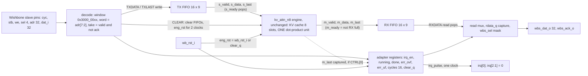
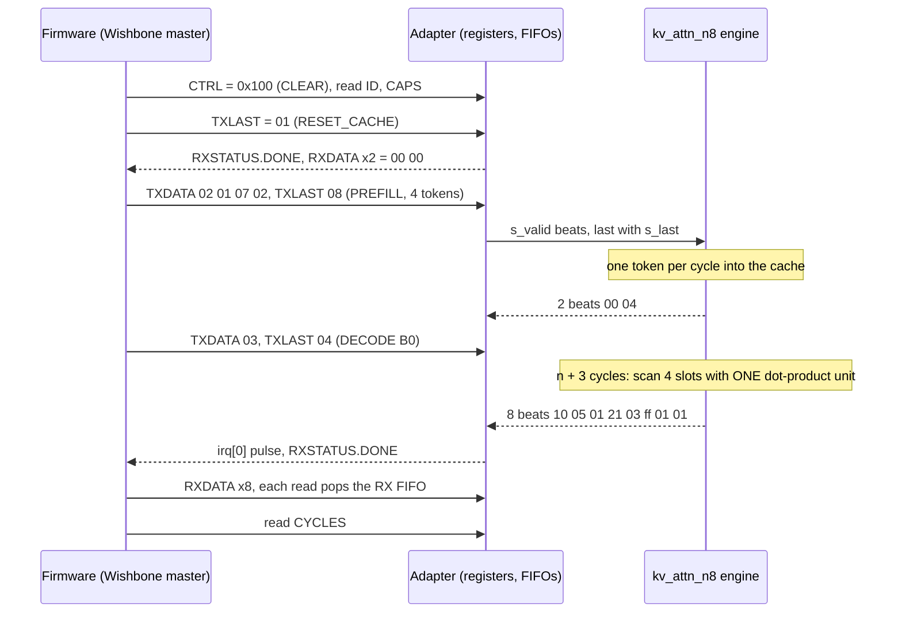
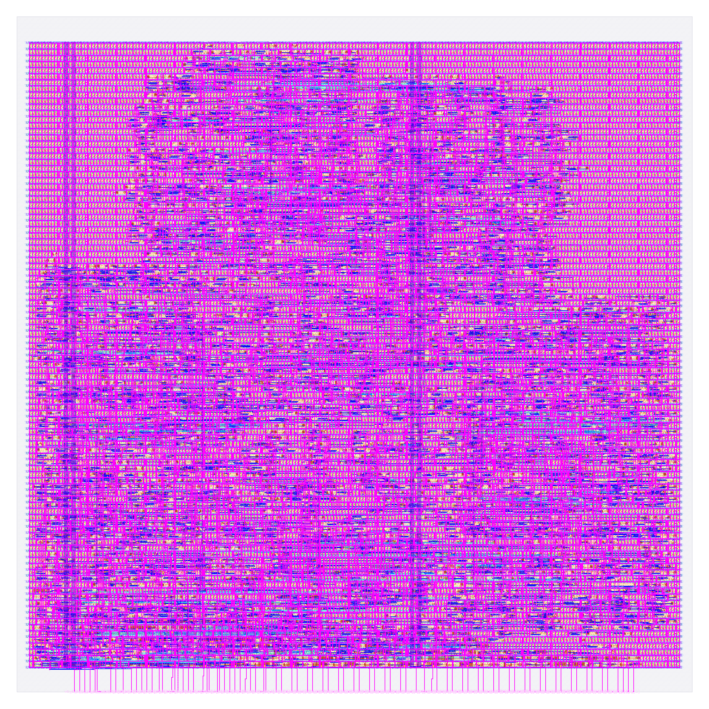

# soc_kv_attn_n8: design notes

Every number below comes from `output/` (metrics.json, resources.json, flow.log, reports/*), `config.json`, `base_soc.sdc`, `rtl/`, `tb/`,
`../../shared/rtl/wb_stream_adapter.v`, `../../model/kv_attention/spec.md`, `../../firmware/README.md`, `build/flow/soc_kv_attn_n8/stage_*.log` (`stages.txt`),
`build/flow_soc_kv_attn_n8.log`, `build/gl/soc_kv_attn_n8/`, `soc_sim/kv/build/sim.log`, or from a command re-run while writing this file (named where used).
Run: `runs/RUN_2026-10-06_08-09-32` (`output/resources.json` `run_dir`). `make flow-all` passed all 5 stages (`build/flow/soc_kv_attn_n8/stages.txt`: simulate 1 s, gds 0 s,
check 1 s, gate-level synthesised 8 s and routed 5 s, collect 4 s; `build/flow_soc_kv_attn_n8.log`: "total 20s"). The gds stage reads 0 s, so it reused the finished run instead of repeating it
(my inference from the 0 s and from `output/resources.json` `wall_s_total` = 181 s for the physical flow itself). The physical flow was not re-run for this document.

## What it is

`soc_kv_attn_n8` is the KV-cache attention engine as a Caravel SoC macro: the generic Wishbone-to-stream bridge `shared/rtl/wb_stream_adapter.v` (TX and RX FIFO, 16 entries each, 9-bit entries)
wired to ONE unchanged engine, `kv_attn_n8` (`designs/kv_attn_n8`: one attention head, model dimension 4, an 8-slot KV cache of 8-bit keys and values in flip-flops, shared engine
`shared/rtl/kv_attn_core.v`, contract `model/kv_attention/spec.md`). `rtl/soc_kv_attn_n8.v` is wiring only. Its port list is exactly `tiny_ai_core`'s: 109 signal pins
(`design__io` = 111 with `vccd1` / `vssd1`, `output/metrics.json`), so it drops into `user_project_wrapper` as `mprj`. `designs/user_project_wrapper_soc_kv/` exists for that; I did not read its results for this document.

What is AI and what is not. The AI is the engine: attention over a KV cache, the operation at the heart of LLM inference, in miniature. A DECODE token is a query q; every cached
key k_j is scored with a dot product `s_j = q . k_j`, the best entry wins (hard attention, strictly greater replaces, lowest slot wins a tie) and its value vector is returned
before the new token is appended (`spec.md` sections 2 and 4). PREFILL writes prompt tokens into the cache one per cycle with no scoring. The weights are hand-picked,
not trained, and folded into logic (`spec.md` section 2: "Why hand-picked"). The adapter is ordinary system glue: bus decode, two FIFOs, status flags, a run timer, an interrupt; it holds no weights.

Software sends a command frame (`TXDATA` ... `TXLAST` on the last beat: opcode `01` RESET_CACHE, `02` PREFILL + tokens, `03` DECODE + token), waits for `irq[0]` or `RXSTATUS.DONE`,
pops 2 response beats (8 for a successful DECODE) from `RXDATA` and reads `CYCLES` (`rtl/soc_kv_attn_n8.v` header, `spec.md` section 4).

Simulation: `make simulate DESIGN=soc_kv_attn_n8` (`build/flow/soc_kv_attn_n8/stage_simulate.log`) printed
`PASS soc_kv_attn_n8_tb: 1521 records (all of tb/vectors.hex: 1515 commands with every response beat, m_last, CYCLES, irq; 6 CLEARs of which 2 with a response pending), registers, 31647 checks`.
Hardened result (`output/metrics.json`): 4514 standard cells, 570 flip-flops, DRC, LVS, XOR, antenna all 0; worst setup +1.4424 ns at `max_ss_100C_1v60` and worst hold +0.1048 ns over 9 corners
(`output/reports/timing_summary.rpt`); 836 max-slew violations reported, not failing (see Antenna, slew, capacitance and Intuitions).

## Architecture



Register map (base `0x3000_0000`, 256-byte window, byte offsets; header of `wb_stream_adapter.v`; same map as `designs/soc_image_text_match`):

| Offset | Name | Access | Fields |
|---|---|---|---|
| 0x00 | ID | R | 0x5354_5201 (`ID_VALUE` in `wb_stream_adapter.v`; the firmware checks it and `soc_sim/kv/build/sim.log` shows PASS) |
| 0x04 | CTRL | RW | [0] irq enable (byte lane 0); write bit 8 CLEAR (byte lane 1, self-clearing, reads 0) |
| 0x08 | STATUS | R | [0] TX_FULL [1] TX_EMPTY [2] RX_EMPTY [3] BUSY [4] DONE [5] ERR_OVF [6] ERR_UF, [15:8] TX level, [23:16] RX level |
| 0x0C | TXDATA | W | [7:0] pushed with `s_last` = 0 |
| 0x10 | TXLAST | W | [7:0] pushed with `s_last` = 1 |
| 0x14 | RXDATA | R | [7:0] `m_data`, [8] `m_last`, [9] valid; the read pops the RX FIFO (empty: 0 and ERR_UF) |
| 0x18 | RXSTATUS | R | [0] EMPTY [1] HEAD_LAST [2] DONE [15:8] RX level, no side effect |
| 0x1C | CYCLES | R | clocks from the edge that accepts a run's first TX beat to the edge that captures its `m_last` beat (16 bit, saturating) |
| 0x20 | CAPS | R | [7:0] version 1, [15:8] TX depth 16, [23:16] RX depth 16: value 0x0010_1001; `soc_sim/kv/build/sim.log` prints `CAPS 0x00101001` |

Engine response frames (`spec.md` section 4): 2 beats `[status, count]` for RESET_CACHE, PREFILL and every error; 8 beats `[status, count, index, score, v0, v1, v2, v3]` for a successful DECODE,
`status[3:0]` = 0 OK, 1 BAD_OPCODE, 2 BAD_TOKEN, 3 CACHE_FULL, 4 BAD_FRAME, `status[4]` = HIT.

Flip-flop accounting. Measured: `design__instance__count__class:sequential_cell` = 570 and 570 `dfxtp_2` in `output/reports/synth_stat.rpt` (12124.128 um^2, 45.47 % of the synthesised area);
`build/flow/soc_kv_attn_n8/stage_check.log` reads "registers: RTL 570 (allowance 0), surviving sequential cells 570", so no logic was lost. The per-register survivors come from
`python3 scripts/flow/check_signoff.py soc_kv_attn_n8 --breakdown` (re-run for this file) and agree with my grouping of the 570 `dfxtp_2` instances in the synthesised netlist
(`build/gl/soc_kv_attn_n8/runs/gl/final/nl/soc_kv_attn_n8.nl.v`, grouped by the register name on the Q pin):

| Group | Flip-flops | Source of the number |
|---|---|---|
| TX FIFO storage `u_adapter.u_tx.mem` | 144 (16 x 9) | `--breakdown`, netlist Q names |
| RX FIFO storage `u_adapter.u_rx.mem` | 144 (16 x 9; all 9 bits live, see below) | `--breakdown`, netlist Q names |
| FIFO pointers (`u_tx` / `u_rx` `wp`, `rp`: 4 x 4) and counters (`rx_count` 5, `status` 5) | 26 | `--breakdown`, netlist Q names |
| `rdata_q` | 23 (of 32 declared) | netlist Q names |
| `cycles` | 16 | netlist Q names |
| nine single-bit flags (`wbs_ack_o`, `rd_ack`, `irq_en`, `clear_q`, `running`, `done`, `err_ovf`, `err_uf`, `irq_pulse`) | 9 | netlist Q names |
| unnamed `_0000_` ... `_0010_`, `_0021_` | 12 | netlist Q names; 8 of them are adapter read-pointer-like bits and 4 are engine bits (my inference, see below) |
| engine, named | 196 | `kc` 56, `resp` 56, `vc` 16, `din` 8, `op` 8, `best_s` 8, `m_data` 8, `k_w` 5, `count` 4, `jc` 4, `err` 3, `wp` 3, `rrem` 3, `best_i` 3, `st` 3, `q_r` 2, `bcnt` 2, `busy`, `din_v`, `din_last`, `m_valid` 1 each |

Totals: 144 + 144 + 26 + 23 + 16 + 9 + 12 + 196 = 570 (my sum), equal to the metric. The engine alone is 200 flip-flops (`designs/kv_attn_n8/output/metrics.json`; its netlist `build/gl/kv_attn_n8/runs/gl/final/nl/kv_attn_n8.nl.v`
has 200 `dfxtp` of which 4 have unnamed Q nets, which is where my "4 unnamed are the engine's" comes from), so the adapter is 570 - 200 = 370 flip-flops (my subtraction), 64.9 % of the total (my division);
the engine is 35.1 %. The adapter's named bits (144 + 144 + 26 + 23 + 16 + 9 = 362) plus the 8 remaining unnamed give the same 370.

Compared with `soc_image_text_match` (adapter = 393 - 39 = 354, `designs/soc_image_text_match/output/metrics.json` and `designs/image_text_match/output/metrics.json`) this adapter is 16 flip-flops larger. Those 16 are bit 7 of the 16 RX FIFO entries:
there `m_data[7]` was always 0 and the flip-flop was pruned (RX storage 128), here the engine's response bytes use all 8 bits (scores and signed values), so RX storage is 144. The adapter RTL is byte-identical; only what the engine can drive changes its size.

Why the engine has 200 flip-flops and not the 666 declared bits (`designs/kv_attn_n8/NOTES.md` register table, my sum there): the cache `kc` keeps 56 of 256 bits and `vc` 16 of 256, because the key components `4 e0`, `4 e1`, `0` and the position are
constants or copies of other bits (`spec.md` section 2, `designs/kv_attn_n8/NOTES.md` Intuitions item 2). The KV "cache" of 512 nominal bits is therefore only 72 flip-flops; `resp` (the 64-bit response shifter) is the other large block at 56.

## Data flow

Example: an LLM-style episode in miniature, from `python3 model/kv_attention/golden.py --trace kv_attn_n8` (re-run for this file, default variant). Tokens are `t = 4*key + value` (A = 0 .. D = 3), so A1 = 1, B3 = 7, A2 = 2, C0 = 8, B0 = 4.
The trace is the model's output; the bus and cycle columns below are from the firmware measurement (`firmware/README.md` KV section, P = 4 prefill, and `soc_sim/kv/build/sim.log`), not from a new simulation of this macro.

| Step | Bytes pushed through `TXDATA` / `TXLAST` | Engine and cache after | Response read through `RXDATA` |
|---|---|---|---|
| RESET_CACHE | `01` (TXLAST) | `count` = `wp` = `pos` = 0 | `00 00` |
| PREFILL A1 B3 A2 C0 | `02 01 07 02` then `08` (TXLAST): one frame of 5 beats | slots 0..3 written, one token per cycle: slot 1 holds K = [-4, 4, 0, 1], V = [3, -1, 1, 1]; latency 2 cycles after the last beat | `00 04` (status OK, count 4) |
| DECODE B0 | `03` then `04` (TXLAST) | q = [-4, 4, 0, 1]; scores over slots 0..3 are [0, 33, 2, -29]; slot 1 wins with 33 (a same-key entry scores 32 + pos); then token B0 is appended in slot 4; latency 7 cycles (n + 3, n = 4) | `10 05 01 21 03 ff 01 01`: status 0x10 = HIT, count 5, index 1, score 0x21 = 33, v0 = 3 (the value stored under B), v1 = -1, v2 = 1, v3 = 1 |
| DECODE A0 | `03` then `00` | scores [32, 1, 34, 3, 4]; slot 2 (A2, the more recent A) wins with 34, not slot 0 (A1, 32); latency 8 | `10 06 02 22 01 ff ff 02`: recalled value 2 |

The trace's own words for the second query: "selected slot 2 score 34 V=[1, -1, -1, 2] HIT=True recalled value 2". The same key stored twice (A1 then A2) is answered with the latest one: that is the recency term `pos` doing the job of
positional preference. The model's `--check` ends `PASS golden: 69 checks` and reports 100.00 % recall for `kv_attn_n8` over 400 episodes, seed 7 (1128 of 1128 recalls).



Back-pressure: `m_ready` = RX not full and no CLEAR in progress, so a full RX FIFO stalls the engine and no response beat is lost; a TX write while the TX FIFO is full is dropped and sets the sticky ERR_OVF
(header of `wb_stream_adapter.v`). The engine accepts one command frame at a time: after `s_last`, `s_ready` stays low until the last response beat has been taken (`spec.md` section 4). CLEAR empties both FIFOs and holds the engine
in reset for two clocks (`eng_rst` = `wb_rst_i` or `clear_q`, `wb_stream_adapter.v` line 143).

## How firmware drives it

`firmware/kv/main.c` (rv32i, no libc) runs on PicoRV32 in `soc_sim/kv/` (`soc_sim/kv/run.sh` compiles `wb_stream_adapter.v`, `kv_attn_core.v`, `kv_attn_n8_rom.v`, `kv_attn_n8.v` with `kv_soc_tb.v`, the same adapter and
engine pair that this macro wraps; it does not simulate `soc_kv_attn_n8.v` itself). One command: `make soc-kv` or `make -C firmware/kv sim` (about 15 s per `firmware/README.md`). The core of the code is one function:

```c
/* firmware/kv/main.c, run_frame(): push the beats, poll DONE, pop the response, read CYCLES */
for (int i = 0; i < nb - 1; i++) wr(R_TXDATA, beats[i]);
wr(R_TXLAST, beats[nb - 1]);
while (!(rd(R_RXSTAT) & RXS_DONE)) { }
do { v = rd(R_RXDATA); resp[n++] = (uint8_t)v; } while (!(v & 0x100) && n < 16);   /* bit 8 = m_last */
f->reg = rd(R_CYCLES);
```

Around it: the program reads `R_ID` (must be 0x53545201) and `R_CAPS`, writes `CTRL_CLEAR` (bit 8), then runs eight sessions P = 0..7: RESET_CACHE, one PREFILL frame `[02, t0..t(P-1)]`, DECODE `[03, t]` until the
8-entry cache is full, then one more DECODE that must answer CACHE_FULL. Every response beat is compared with values generated by `firmware/kv/gen_expected.py` from `model/kv_attention/golden.py`
(`expected.h`, not hand-written). The last line of `soc_sim/kv/build/sim.log` is `SOC_SIM: firmware exit PASS after 1020782 cycles`. The whole sequence also runs in `make test` (`tests/run_tests.sh` line 368: "firmware KV SoC sim (make soc-kv)").
Do not write more than 16 beats before letting the engine run (a write while the TX FIFO is full is dropped and sets ERR_OVF).

Measured by that firmware (CPU clock cycles, timer-read overhead of 11 removed; `firmware/README.md` KV section, identical to `soc_sim/kv/build/sim.log`):

| Operation | Round trip (CPU clocks) | write / wait / read | `CYCLES` register (adapter clocks) | Engine latency after last beat (`spec.md` section 6, `--trace`) |
|---|---|---|---|---|
| PREFILL, 1 token | 328 (328.0 per token) | 127 / 41 / 160 | 56 | 2 |
| PREFILL, 4 tokens | 481 (120.3 per token) | 280 / 41 / 160 | 209 | 2 |
| PREFILL, 7 tokens | 634 (90.6 per token) | 433 / 41 / 160 | 362 | 2 |
| DECODE, any cache fill n = 0..7 | 670 (same at every n) | 127 / 41 / 502 | 63 to 70 | n + 3 = 3 to 10 |
| DECODE on a full cache (CACHE_FULL, 2 beats) | 328 | not printed per phase | 56 | 2 |

`CYCLES` minus the full-cache baseline grows 7, 8, ... 14 for n = 0..7, which equals n + 7 = (n + 3 - 2) + (8 - 2) response beats, and the firmware checks it for every decode (`check_eq(..., n + 7)` in `main.c`).

## Verification

Testbench: `designs/soc_kv_attn_n8/tb/soc_kv_attn_n8_tb.v` is ports only (runs unchanged on RTL and gate level). `tb/vectors.hex` is a copy of `designs/kv_attn_n8/tb/vectors.hex` (40-byte records generated by
`model/kv_attention/gen.py` from `golden.py`, header in the testbench). Every record goes through `TXDATA` / `TXLAST` / `RXSTATUS` / `RXDATA` / `CTRL.CLEAR` only: a COMMAND record pushes its input beats, waits until the RX level equals
the expected response length, reads the beats and compares `{valid, m_last, m_data}` with `!==` (X never passes), checks STATUS (DONE, both FIFOs empty), CYCLES in range and exactly one `irq[0]` pulse; RST_IDLE, RST_MID
(partial frame, then CLEAR) and RST_PEND (whole frame, response left in the RX FIFO, then CLEAR: the response is lost by design) exercise CLEAR. After every CLEAR the next record must behave as on an empty cache. It also checks ID, CAPS,
unmapped and out-of-window reads, that `wbs_ack_o` is one clock wide and never without a request, and `irq[2:1]` = 0, with no ERR_OVF / ERR_UF. The vectors cover (`designs/kv_attn_n8/NOTES.md` from `spec.md` section 9) every opcode and bad opcodes,
BAD_FRAME, BAD_TOKEN, CACHE_FULL, same-key chains, every fill level n = 0..8 and 60 random episodes; so the error responses are exercised through the bus, which counts as negative testing of the engine protocol.

- RTL (`build/flow/soc_kv_attn_n8/stage_simulate.log`): `PASS soc_kv_attn_n8_tb: 1521 records (all of tb/vectors.hex: 1515 commands with every response beat, m_last, CYCLES, irq; 6 CLEARs of which 2 with a response pending), registers, 31647 checks`.
- Gate level synthesised (`stage_gl_synth.log`): netlist `build/gl/soc_kv_attn_n8/runs/gl/final/nl/soc_kv_attn_n8.nl.v`, 1965 cells, the same PASS line with 31647 checks, `gl_sim: soc_kv_attn_n8 PASS (2 s)`; `synthesis__check_error__count` = 0.
- Gate level routed (`stage_gl_final.log`): `designs/soc_kv_attn_n8/runs/RUN_2026-10-06_08-09-32/final/nl/soc_kv_attn_n8.nl.v`, 15565 cells (fill, tap and diodes included), the same PASS line, `gl_sim: soc_kv_attn_n8 PASS (5 s)`.
- Firmware on PicoRV32 (`soc_sim/kv/build/sim.log`, file time 13:44 on 2026-10-06; not re-run by me): `PASS`, `SOC_SIM: firmware exit PASS after 1020782 cycles`; the sim compiles the adapter and engine RTL, not this macro's wiring file.
- Adapter regression: `tests/adapter/run.sh` lists `kv_attn_n8:KV` among its engines (line 11, shared core line 19); I did not re-run it for this file.
- Signoff check (`stage_check.log`, `check_signoff.py`): `registers: RTL 570 (allowance 0), surviving sequential cells 570`, `note: max-slew violations: 836`, `note: max-cap violations: 0`, `=> PASS`.
- Not verified here: the macro's own CLEAR/irq behaviour under the CPU's real bus timing beyond what the two simulations above show; a Caravel-level run with this macro is not part of this document (`designs/user_project_wrapper_soc_kv/` has its own notes).

## Layout (GDSII)



The picture (`output/layout.png`, KLayout render) shows the 300 x 300 um die (`design__die__bbox` = `0.0 0.0 300.0 300.0`, `design__die__area` = 90000 um^2); the core is `design__core__bbox` = `5.52 10.88 294.4 288.32`,
80146.9 um^2, 102 rows (`design__rows`). The 109 signal pins are on the bottom (S) edge, ordered like the wrapper's Wishbone pads (`config.json` `//IO_PIN_ORDER_CFG`, `pin_order.cfg` is identical to `designs/soc_image_text_match/pin_order.cfg`, checked with `diff`), `irq` at the right end.
Cells (`metrics.json`): 15565 instances in total; 11051 fill (`design__instance__count__class:fill_cell`; `cell_usage.rpt`: 9096 `decap_3`, 1046 `fill_1`, 909 `fill_2`), 1144 tap cells, and 4514 standard cells
(`design__instance__count__stdcell`, area 42420.7 um^2, utilisation 0.529287): 1358 multi-input combinational, 570 sequential, 955 timing-repair buffers (of which 590 are hold buffers), 387 clock buffers and 15 clock inverters,
33 inverters, 4 buffers, 48 antenna diodes. Routed wire length 82391 um (`route__wirelength`).

Die versus estimate (`config.json` `//DIE_AREA`, written before the first run): the estimate was 29,686 um^2 (the `soc_image_text_match` standard-cell area) minus 3,856 um^2 (its engine) = about 25,800 um^2 for the adapter, plus 16,412 um^2 for `kv_attn_n8`,
"about 42,200 um2", giving "about 50 percent" at 300 um. Measured: 42,420.7 um^2 (`design__instance__area__stdcell`), +0.5 % against the estimate (my division), and utilisation 0.529 (`design__instance__utilization`) against "about 50 percent".
The estimate was good because it added two measured final areas. It also says the same sum would be "about 75 percent of a 250 um die's core"; my division of 42,200 by the 250 um die's core area 53,897.9 um^2 (`designs/soc_image_text_match/output/metrics.json`) gives 78 %, so "too dense" stands: the 300 um die was needed and is not oversized.
The comment's remark that the wrapper's met5 strap crosses the macro is a wrapper-level statement; I did not check it.

## From RTL to GDSII: what each step did

### Synthesis

Yosys mapped the RTL (adapter, two FIFOs, engine, ROM) to sky130_fd_sc_hd: 1965 cells (`floorplan.txt` IFP-0105), `Chip area for module '\soc_kv_attn_n8': 26665.5744` um^2, of which 12124.128 um^2 (45.47 %) is sequential (`output/reports/synth_stat.rpt`).
Main types: 570 `dfxtp_2`, 466 `mux2_1` (5.25E+03 um^2), 96 `mux4_2` (2.16E+03 um^2), 86 `nor2_2`, 69 `or2_2`, 55 `o211a_2`, 51 `and2_2`, 48 `and3_2`, 39 `nand2_2`, 36 `o22a_2`, 34 `a22o_2`, 33 `inv_2`.
Compared with the `soc_image_text_match` synthesis (200 `mux2_1`, 41 `mux4_2`; `designs/soc_image_text_match/NOTES.md`) the mux count is 2.3 times larger (466 / 200, my division): FIFO read muxes now carry 9 bits on RX and the engine's cache read, response shifter and write enables are muxes too.
For comparison the engine alone synthesises to 10034.62 um^2 (`designs/kv_attn_n8/NOTES.md` from its `synth_stat.rpt`), so the adapter is about 16,631 um^2 of the 26,665.6 um^2 (62 %; a subtraction of two separate syntheses, approximate).
`synth_checks.rpt`: see the file; `synthesis__check_error__count` = 0, `design__inferred_latch__count` = 0, `design__instance_unmapped__count` = 0, lint 0 errors and 449 warnings (`design__lint_warning__count`).
Report: [synth_stat.rpt](output/reports/synth_stat.rpt), [synth_checks.rpt](output/reports/synth_checks.rpt).

### Floorplan

The die is fixed at 300 x 300 um by `config.json` (`FP_SIZING` absolute, `DIE_AREA` 0 0 300 300). OpenROAD added 102 rows of 628 sites, core area 80146.867 um^2, instance area 26665.574 um^2, effective utilisation 0.333 with 1965 instances
(`floorplan.txt`: IFP-0100 to IFP-0105), before taps, buffers and repair. The Caravel macro SDC `base_soc.sdc` is read (identical to `designs/soc_image_text_match/base_soc.sdc` except one comment line, checked with `diff`): clock `clk` 25 ns on `wb_clk_i`,
max transition 0.75, max fanout 8, clock latency range 4.65 : 5.57, clock transition 0.61, clock uncertainty 0.25 (`floorplan.txt` preamble).
Report: [floorplan.txt](output/reports/floorplan.txt).

### Placement

Global placement finished at iteration 455 with 65 routability iterations and final weighted congestion 0.8974, target 1.01 achieved (`placement_global.txt`, GPL-1001, GPL-1003, GPL-1005, GPL-0050).
Detailed placement: original HPWL 59713.4 u, legalised 60979.7 u, displacement 0.0 u in its own analysis (`placement_detailed.txt`). 1144 tap cells. Timing repair added 955 buffers in the final metrics
(`design__instance__count__class:timing_repair_buffer`), whose area is 9202.58 um^2 (`design__instance__area__class:timing_repair_buffer`), the second largest class after combinational logic.
Reports: [placement_global.txt](output/reports/placement_global.txt), [placement_detailed.txt](output/reports/placement_detailed.txt).

### Clock tree

TritonCTS built one clock root with 253 buffers (252 `clkbuf_8`, 1 `clkbuf_16`) driving 570 sinks, plus dummy load cells (66 `clkbuf_4`, 60 `clkbuf_8`, 11 `clkinv_2`, 8 `clkbuf_2`, 3 `bufinv_16`, 1 `inv_2`) (`cts.rpt`).
Clock buffers in the final metrics: 387 `clock_buffer` and 15 `clock_inverter` cells, 4854.66 + 148.893 um^2. Worst skew in `metrics.json`: setup 0.3515 ns, hold -2.1889 ns; the hold figure includes the SDC's 4.65 to 5.57 ns source-latency spread
(0.92 ns) and its breakdown is not reported. After CTS, repair added 590 hold buffers (`design__instance__count__hold_buffer`; `cell_usage.rpt`: 590 `dlygate4sd3_1`), 0 setup buffers. That is 13.1 % of the 4514 standard cells (my division), the same fraction as
`soc_image_text_match` (421 of 3201, 13.2 %): hold repair scales with the number of flip-flop endpoints, not with what the logic computes.
Report: [cts.rpt](output/reports/cts.rpt).

### Routing

Global routing: total wirelength 130258 um in `routing_global.txt` (GRT-0018; `global_route__wirelength` = 130548 and `global_route__vias` = 21851 in metrics), layers met1 to met4 (`RT_MAX_LAYER` met4). Detailed routing: DRC violations per iteration
546, 135, 74, 0 (`route__drc_errors__iter:0..3`), final `route__drc_errors` = 0. Final wire length 82391 um (`route__wirelength`; met1 37908, met2 40812, met3 2850, met4 820 um in `routing_detailed.txt`),
longest net 308.55 um (`route__wirelength__max`), 20877 vias all single-cut (`route__vias__singlecut`), 3246 nets (`routing_detailed.txt`).
Reports: [routing_global.txt](output/reports/routing_global.txt), [routing_detailed.txt](output/reports/routing_detailed.txt).

### Timing

`timing_summary.rpt`: setup and hold violation counts are 0 in all 9 corners; the `timing__setup__wns` / `timing__hold__wns` metrics read 0 (no violation), so the slack figures come from the table.
Register-to-register setup slack is "N/A" in that table (no reg-to-reg path is the worst), and the hold r2r column equals the overall hold slack.

| Corner | Worst setup slack (ns) | Worst hold slack (ns) |
|---|---|---|
| nom_tt_025C_1v80 | 6.5017 | 0.2990 |
| nom_ss_100C_1v60 | 1.6824 | 0.4800 |
| nom_ff_n40C_1v95 | 8.2077 | 0.1060 |
| min_tt_025C_1v80 | 6.6468 | 0.2888 |
| min_ss_100C_1v60 | 1.9579 | 0.4477 |
| min_ff_n40C_1v95 | 8.3018 | 0.1048 |
| max_tt_025C_1v80 | 6.3795 | 0.3079 |
| max_ss_100C_1v60 | 1.4424 | 0.4884 |
| max_ff_n40C_1v95 | 8.1268 | 0.1070 |
| Overall worst | +1.4424 (max_ss_100C_1v60) | +0.1048 (min_ff_n40C_1v95) |

Worst setup path (`timing_paths_max_ss.rpt`, repeated in `runs/RUN_2026-10-06_08-09-32/56-openroad-stapostpnr/max_ss_100C_1v60/max.rpt`, slack 1.442393 ns): it starts at the input port `wb_rst_i`
with clock network delay 5.57 ns plus an input external delay of 12.5 ns, so the data launches at 18.07 ns (`base_soc.sdc`: `set_input_delay [expr $::env(CLOCK_PERIOD) * 0.5] ... wb_rst_i`, half of the 25 ns period).
It passes 15 cells and ends at the D pin of flip-flop `_3048_` at 29.564 ns; the capture clock edge is at 25 + 4.65 = 29.65 ns, plus 1.90 ns of clock tree to the flop, minus 0.25 ns uncertainty and 0.293 ns setup, so the required time is 31.006 ns (`max.rpt`).
The 15 cells and their delays (all from the path listing, sums are mine):

| Segment | Cells | Delay (ns) |
|---|---|---|
| input buffer and fanout tree on `wb_rst_i` | `input1`, `fanout357`, `fanout353`, `fanout352` (all `clkdlybuf4s25_1`) | 0.427 + 0.702 + 0.975 + 0.870 = 2.974 |
| `eng_rst` OR gate | `_1751_` `nor2_2` | 0.536 |
| second fanout tree | `fanout144`, `fanout143`, `fanout141` (`clkdlybuf4s25_1`) | 1.106 + 1.082 + 0.995 = 3.183 |
| reset / clear decode | `_1925_` `nand2_2`, `_1926_` `or3_2`, `_2077_` `nor2_2` | 0.232 + 1.212 + 0.345 = 1.789 |
| select buffer, mux | `fanout87` `buf_1` (output slew 1.068 ns), `_2078_` `mux2_1` (select to output) | 0.923 + 0.929 = 1.852 |
| hold buffer into D | `hold368` `dlygate4sd3_1` | 1.138 |
| Sum | | 11.47 (path total 29.564 - 18.070 = 11.494; the rest is wire delay) |

So 7 of the 15 cells are `clkdlybuf4s25_1`, a deliberately slow delay-buffer cell, and they contribute 6.157 ns (my sum) of the 11.494 ns. What this path is: `wb_rst_i` goes into `eng_rst` (`wb_stream_adapter.v`: `eng_rst = rst | clear_q`, the adapter's own
synchronous reset, and the FIFO `clr`), is combined with the clear and handshake logic and lands on the D input of a flop through a mux select: a synchronous reset implemented as data logic. In the routed netlist
(`runs/RUN_2026-10-06_08-09-32/final/nl/soc_kv_attn_n8.nl.v`, a throwaway script, not checked in) a breadth-first walk from `wb_rst_i` through combinational cells reaches the D pins of all 570 flip-flops: reset is the one net that touches every flop.
That is why reset distribution, not the attention math, sets the worst setup path of this macro. The same holds for the engine alone: its worst path (`designs/kv_attn_n8/output/reports/timing_paths_max_ss.rpt`) also starts at `rst`, with a 5.0 ns external delay and no clock latency, slack 10.74 ns.

The three designs compare as follows (`timing_summary.rpt` of each, worst path file `timing_paths_max_ss.rpt`):

| Design | Worst setup slack, max_ss | Worst path starts at | Launch time of that path | Data delay of that path |
|---|---|---|---|---|
| `kv_attn_n8` alone (no Caravel SDC) | +10.7398 ns | `rst` | 5.0 ns (external delay only) | 14.951 - 5.0 = 9.95 ns |
| `soc_image_text_match` | +2.9562 ns | `wbs_adr_i[18]` | 9.46 ns = 5.57 clock latency + 3.89 external delay | 27.798 - 9.46 = 18.34 ns |
| `soc_kv_attn_n8` | +1.4424 ns | `wb_rst_i` | 18.07 ns = 5.57 + 12.5 | 29.564 - 18.07 = 11.49 ns |

The data delay (my subtraction of the arrival time in each report) of the SoC macros is not the reason for the ranking: `soc_image_text_match`'s address path is slower (18.3 ns, because its input transition of 0.92 ns pushes it through `dlygate4sd3_1` hold buffers
and a decode), yet it has more slack, because that path launches 8.6 ns earlier. The Caravel SDC gives the reset a 12.5 ns input delay (half the period) while the address bus arrives 3.89 ns after the clock: `soc_kv_attn_n8` is limited by the SDC's reset budget, which leaves
25 + 4.65 - 18.07 = 11.58 ns (plus clock-tree and setup terms) for a net that has to reach 570 flops, against 11.49 ns used. Whether the larger die (300 versus 250 um) also adds wire delay is not isolated by any run here: the wire part of the path is the 0.022 ns left over
in the table above, so wire length is not what costs time; the delay cells and the number of fanout stages are. I did not run a variant to see which of the two (more sinks or the larger die) dominates.
Worst hold path (`timing_paths_min_ff.rpt`, min_ff, slack 0.104768 ns): flip-flop `_3246_` to `_3238_`, both through the same CTS tree (clock arrival at the launch flop 5.328 ns). The next two are `_3249_` to `_3241_` (0.106777) and `_3232_` to itself (0.107110).
Hold stays above +0.1 ns only because 590 `dlygate4sd3_1` hold buffers were inserted.
Reports: [timing_summary.rpt](output/reports/timing_summary.rpt), [timing_paths_max_ss.rpt](output/reports/timing_paths_max_ss.rpt), [timing_paths_min_ff.rpt](output/reports/timing_paths_min_ff.rpt).

### DRC

Magic: `COUNT: 0` (`drc_magic.rpt`); `magic__drc_error__count` = 0, `klayout__drc_error__count` = 0, all 257 rule entries in `drc_klayout.json` are 0 (my sum), `magic__illegal_overlap__count` = 0, `design__xor_difference__count` = 0.
`manufacturability.rpt`: DRC Passed.
Reports: [drc_magic.rpt](output/reports/drc_magic.rpt), [drc_klayout.json](output/reports/drc_klayout.json), [manufacturability.rpt](output/reports/manufacturability.rpt).

### LVS

`lvs_netgen.rpt`: top circuit `soc_kv_attn_n8` with 3374 devices and 3380 nets on both sides, "Netlists match uniquely." and "Final result: Circuits match uniquely."; all `design__lvs_*` counts are 0; `manufacturability.rpt`: LVS Passed.
Report: [lvs_netgen.rpt](output/reports/lvs_netgen.rpt).

### Power / IR drop

Total power 3.6387e-03 W (`power__total`: internal 2.776e-03, switching 8.624e-04, leakage 9.01e-08). IR drop (`irdrop.rpt`, nom_tt): vccd1 worst drop 6.74e-04 V (0.04 %), average 1.28e-04 V; vssd1 worst 6.06e-04 V (0.03 %), average 1.21e-04 V.
`design__power_grid_violation__count` = 0. The report's own "total power" line says 3.11e-03 W (a different analysis step than `power__total`); I did not reconcile the two.
Report: [irdrop.rpt](output/reports/irdrop.rpt).

### Antenna, slew, capacitance

Antenna: 0 violating nets and pins (`antenna__violating__nets` = 0, `antenna__violating__pins` = 0, `route__antenna_violation__count` = 0); 48 diode cells (`design__instance__count__class:antenna_cell`, `cell_usage.rpt`: 48 `diode_2`; `DIODE_ON_PORTS` "in",
heuristic insertion off in `config.json`; `antenna_diodes_count` = 0). Max capacitance 0, max fanout 0 (`MAX_FANOUT_CONSTRAINT` 8). `manufacturability.rpt`: Antenna, LVS and DRC Passed. Flow warnings 1, errors 0.

Max slew: `design__max_slew_violation__count` = 836, the number at `max_ss_100C_1v60` (`timing_summary.rpt`: 142 at nom_tt, nom_ff, min_tt, min_ff and max_ff, 160 at max_tt, 791 nom_ss, 763 min_ss, 836 max_ss). The limit is 0.75 ns; the worst pin is 1.22581 ns (slack -0.4758 ns).
Classification: the pin-level list is in `runs/RUN_2026-10-06_08-09-32/56-openroad-stapostpnr/max_ss_100C_1v60/checks.rpt` (836 pins), not in `output/reports/`. I traced each violating pin to the root of its net in the routed netlist with a throwaway script
(through buffers and delay cells back to a port, a flop or a gate), so the split is my analysis, not a flow output:

| Group | Count | Where |
|---|---|---|
| Environment-limited (same at every corner) | 142 = 32 + 32 + 60 + 18 | 64 are the input ports themselves (`wbs_adr_i[31:0]` at 0.92 ns, `wbs_dat_i[31:0]` at 0.84 ns, set by `base_soc.sdc`) and 78 are pins directly on those nets (60 on `wbs_adr_i`, 18 on `wbs_dat_i`); the number equals the 142 at the fast corners |
| Internal nets, rooted at a flop | 201 | nets behind buffers (`buf_*`, `clkdlybuf4s25_1`) driven by a flip-flop |
| Internal nets, rooted at a gate | 493 | 485 behind buffers from `nor2`, `and3`, `or2`, `or3b`, `nand2`, `and4` and similar; 8 straight from a gate (`nor3`, `nor3b`) |

142 + 201 + 493 = 836 (my sum). So 17 % are environment-limited and unfixable by resizing, and 83 % (694) are inside the macro and appear only at the slow corners (836 - 142 = 694). By pin type, 349 are the select pin `S` of a `mux2_1` and 82 the `S1` of a
`mux4_2`: 431 of 836 (52 %) are mux select inputs, the shared select nets of the FIFO read muxes, the cache slot read and the response shifter, each a high-fanout net buffered by `buf_1` or delay cells. The 20 % repair margins
(`PL_RESIZER_MAX_SLEW_MARGIN` and `GRT_DESIGN_REPAIR_MAX_SLEW_PCT`, `config.json` `//SLEW`) are copied from `tiny_ai_core`, where 70 % ran out of memory and 40 % was worse; they were not re-tuned here. Compared with `soc_image_text_match` (421 total, 142 environment, 279 internal;
`designs/soc_image_text_match/NOTES.md`), the environment floor is identical (the same SDC and the same 64 ports) and the internal part is 2.5 times larger (694 / 279, my division), in line with 2.3 times as many muxes in the synthesis. The slew count is a note in `check_signoff.py`, not a failing gate.
Reports: [manufacturability.rpt](output/reports/manufacturability.rpt), [cell_usage.rpt](output/reports/cell_usage.rpt), [timing_summary.rpt](output/reports/timing_summary.rpt).

## Run time and memory

From `output/resources.json` (profile "tight": 2 CPUs, 8 GB limit, exit code 0): `wall_s_total` 181 s for the physical flow (the 20 s total of the flow-all log does not include it, because the gds stage reused this run); container peak memory
1,179,701,248 bytes (1.099 GB); peak per-step RSS 656,408,576 bytes. 77 steps are listed. Slowest steps:

| Step | Wall time (s) |
|---|---|
| 45-openroad-detailedrouting | 46.736 |
| 37-openroad-resizertimingpostcts | 21.607 |
| 69-magic-spiceextraction | 16.369 |
| 66-klayout-drc | 15.2 |
| 56-openroad-stapostpnr | 10.309 |

For comparison `soc_image_text_match` took 165 s and 0.802 GB in its first run (163 s, 0.98 GB in the 2026-10-06 re-run with identical metrics), `kv_attn_n8` alone 105 s (`designs/kv_attn_n8/NOTES.md`). Detailed routing alone is 25.8 % of this flow's 181 s (my division).

## Reproduce

```bash
make simulate DESIGN=soc_kv_attn_n8   # RTL simulation, 1521 records, 31647 checks
make soc-kv                           # PicoRV32 firmware session (firmware/kv): prefill and decode cycle tables
make flow-all DESIGN=soc_kv_attn_n8   # Docker flow: simulate, gds, check, gate-level x2, collect (181 s physical flow on this machine)
make collect DESIGN=soc_kv_attn_n8    # refresh output/ (metrics, reports, layout, LEF)
python3 scripts/flow/check_signoff.py soc_kv_attn_n8 --breakdown   # per-register flip-flop survivors
python3 model/kv_attention/golden.py --trace kv_attn_n8            # the worked example above
```

The testbench `tb/soc_kv_attn_n8_tb.v` reads `tb/vectors.hex` (a copy of `designs/kv_attn_n8/tb/vectors.hex`; the Makefile looks for it in this directory). The physical flow (Docker) was not re-run for this document; all physical numbers come from the
checked-in `output/` files and the run directory; `golden.py --trace` and `--check` and `check_signoff.py --breakdown` were re-run on 2026-10-06, the firmware numbers are read from `firmware/README.md` and `soc_sim/kv/build/sim.log`.

## Intuitions and insights

**Why this is AI, and what makes it attention.** A language model generates one token at a time: the prompt is processed once (prefill), then each new token (decode) asks "which of the things I stored is most relevant to me?" by scoring its query against every cached key. That is exactly what the engine does,
at the smallest scale that still shows it: `score = q . k` over up to 8 cached entries with ONE dot-product unit, one slot per cycle, argmax, return the winner's value. The measured consequence (`firmware/README.md`, `spec.md` section 6) is that the engine's decode latency is n + 3 cycles, 3 to 10 clocks, growing by one clock per cached entry, while prefill costs one cycle per token regardless of cache length.
The recall task is an exact rule that a trained table could also express: a same-key entry scores 32 + pos, any other at most 31, so the latest same-key entry wins (`spec.md` section 2); `golden.py --check` measures 100.00 % recall over 1128 decodes. The weights are hand-picked and folded into logic, so this is "attention hardware", not a learned model.

**Why the SoC framing matters: the bus costs more than the attention.** The engine decodes in at most 10 clocks (`spec.md` section 6, 3 to 10), but a firmware DECODE round trip is 670 CPU clocks at every cache fill (`firmware/README.md`), so 670 / 10 = 67 times the engine's worst latency (my division, mixing the CPU clock
with the adapter clock only because both are the same clock in `soc_sim/kv`); 74 % of it (502 of 670) is reading the 8 response bytes, 18 % writing 2 command bytes (127), 6 % one status poll (41). The wait is the engine; everything else is the bus, at about 51 CPU clocks per transaction (`firmware/README.md`). Prefill amortises the setup:
the per-token cost falls from 328.0 clocks at P = 1 to 90.6 at P = 7 while the total grows only 51 per extra token. The firmware README calls this the tiny-scale version of "prefill is compute-bound, decode is memory- and latency-bound" and warns that the numbers say nothing about real LLM sizes. The lesson for this repository: an accelerator behind a byte-wide register bus cannot show its
speed; what one sees is the interface. The remedies are packing several bytes per bus word (8 of 32 bits are used), a response that is shorter than 8 bytes, a DMA path, or keeping the cache on chip so only the answer crosses (it already is). `CYCLES` hides the CPU: for a decode it reads only 63 to 70 adapter clocks while the CPU needs 670.

**Timing: the margin went to the system interface, not to the math.** Setup slack fell from +10.74 ns (engine alone) to +1.44 ns (macro) because the path now launches 18.07 ns after the clock edge instead of 5.0 ns: the Caravel SDC gives `wb_rst_i` a 12.5 ns input delay (half the 25 ns clock) plus 5.57 ns of clock latency, and reset is the one net that reaches all 570 flip-flops
(the netlist walk above). The worst path is 15 cells, 7 of them slow delay cells that the resizer used as fanout buffers, with a mux select at the end: reset written as data logic. The attention datapath (cache read, dot product, compare) is not on the worst path of any corner in `timing_paths_max_ss.rpt`. The macro still meets timing by 1.44 ns at ss, so nothing is wrong; the point is
the budget: a designer who looks at the standalone slack of the engine (+10.74 ns) would overestimate the macro's margin by 7.4 times (10.74 / 1.44, my division). Compare `soc_image_text_match`: +2.96 ns, set by an address pin whose launch is 8.6 ns earlier. The cheapest fixes, not tried: reset only the control flops (the cache storage has no reset need; `spec.md`: "cache data need not be cleared"), or register `eng_rst`
once to cut the fanout depth. Both change RTL and make the committed evidence stale, so I only name them.
Hold is +0.1048 ns at min_ff, the same order as `kv_attn_n8` alone (0.1052 ns) and `soc_image_text_match` (0.1101 ns): hold repair tracks the flop count (590 `dlygate4sd3_1`, 13.1 % of the cells), not the design.

**Where the area goes.** 570 flip-flops are 12124.1 um^2 (`design__instance__area__class:sequential_cell`), 28.6 % of the 42420.7 um^2 standard-cell area (my division); combinational logic is 14395.1 um^2 (33.9 %), timing-repair buffers 9202.6 um^2 (21.7 %), clock buffers and inverters 5003.6 um^2 (11.8 %), taps 1431.4 um^2,
diodes 120.1 um^2, inverters and buffers 143.9 um^2; these classes sum to 42420.7 um^2 (my sum, `metrics.json` `design__instance__area__class:*`). The synthesised netlist was 26665.6 um^2, so 15755 um^2 (59 %) was added after synthesis by repair, clock tree, taps and diodes (my subtraction; the five classes above sum to 15757.6). Hold buffers are 590 of the 955 repair buffers.
Of the 570 flip-flops 370 (65 %) belong to the adapter and 200 (35 %) to the attention engine, and 288 of them (51 %) are FIFO storage, 16 entries x 9 bits twice. The engine itself needs only 72 flip-flops for its 512-bit cache, because key and value components are constants or copies; its largest register is the 56-bit response shifter. So the KV cache that the experiment is about is 13 % of the macro's flip-flops (72 / 570, my division), and the
two FIFOs that carry bytes to it are four times that. Against `soc_image_text_match` the macro has 1.45 times the flip-flops (570 / 393), 1.41 times the cells (4514 / 3201), 1.43 times the standard-cell area (42420.7 / 29686 um^2), 1.48 times the power (3.639e-03 / 2.460e-03 W) and 1.35 times the routed wire (82391 / 61165 um) (`metrics.json` of each, my divisions); against `kv_attn_n8` alone 2.85 times the flip-flops,
1.76 times the cells (4514 / 2566), 2.58 times the area (42420.7 / 16412 um^2) and 3.2 times the power (3.639e-03 / 1.136e-03 W).

**Die sizing worked.** The estimate in `config.json` (42,200 um^2 of cells, about 50 % at 300 um) came out at 42,420.7 um^2 and 52.9 %, and the flow closed on the first run (detailed routing needed 4 iterations, 0 final violations; `route__drc_errors__iter:0..3` = 546, 135, 74, 0). Sizing a macro from the measured areas of its two parts plus
a repair overhead is reliable here; the 250 um die of `soc_image_text_match` at 55 % would not have held this macro (estimated 78 % before repair, my division, so a flow at that size would very likely have failed placement or routing; I did not try it).

**Slew and the Caravel input environment.** The 142 violations on the Wishbone address and data ports are the SDC's (0.92 ns and 0.84 ns input transitions against a 0.75 ns limit) and are identical to `soc_image_text_match`; the macro cannot change what Caravel drives. The other 694 appear only in the slow corners on internal nets, and half of all violations are mux select pins.
That is a property of this synthesis (466 `mux2_1`, 96 `mux4_2`), not a functional problem: `check_signoff.py` prints the slew count as a note and `manufacturability.rpt` passes. Whether a lower fanout limit or a different repair margin would reduce them I did not try; the `//SLEW` comment in `config.json` records that larger margins failed on a sibling design. A lower count is not by itself a better result.

**One build per experiment, and what the next one needs.** The KV engine is unchanged, so the register map, the firmware loop and the adapter regression carry over from `soc_image_text_match`; the cost of a new engine is a new `soc_<engine>` top, a die sizing and a flow run (181 s here), not a new firmware interface. What is untested: the macro with real Caravel management-SoC firmware (`soc_sim/kv` uses a PicoRV32 testbench with its own counter register
and not the Caravel timer), and anything about longer sequences than the 8-slot cache: the `kv_attn_n8_ring` variant wraps the cache but loses recency after 31 tokens (`spec.md` section 2), and `kv_attn_n16` would roughly double the cache bits (`spec.md` section 1) while leaving the adapter's 370 flip-flops fixed. Takeaway: for a small engine behind a generic bus, budget area and timing at the SoC level; the adapter and the reset net, not the attention, set both.
