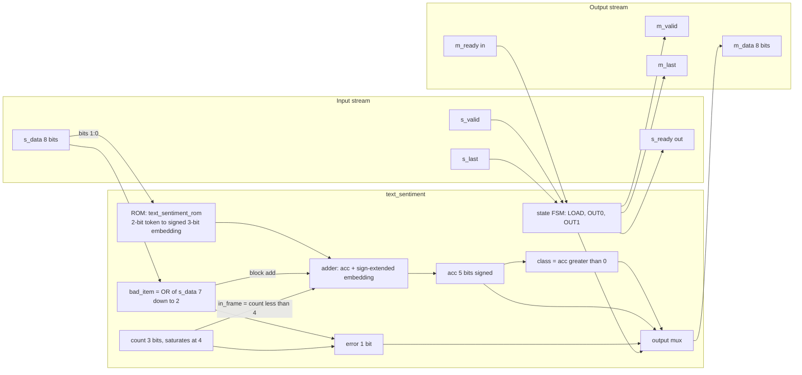
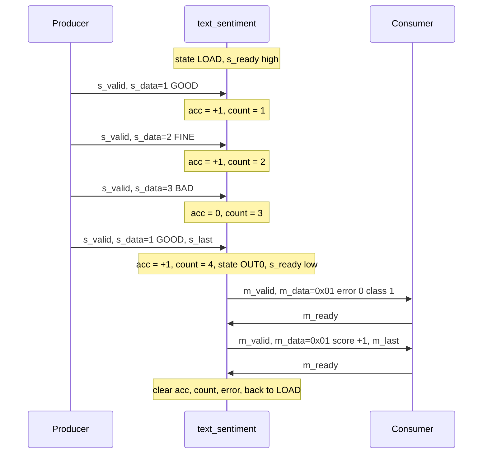
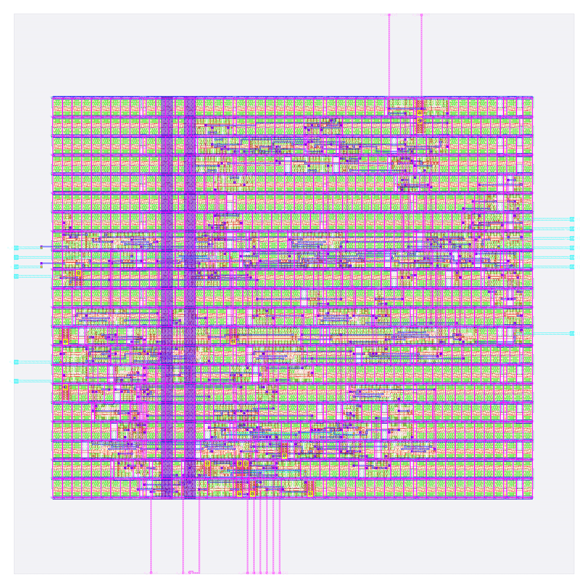

# text_sentiment: design notes

Numbers below are quoted from files in `output/` (metrics.json, resources.json, flow.log, reports/*) and from the RTL.
Paths are relative to this folder. Re-verified on 2026-10-06 against the current `output/` (run
`runs/RUN_2026-10-05_18-16-33`, `output/resources.json` `run_dir`). The testbench and checks are in the "Verification" section. The Reproduce commands are in the "Reproduce"
section below; the last section is "Intuitions and insights".

## What it is

A tiny sentence classifier. It reads four tokens from the vocabulary {PAD, GOOD, FINE, BAD}, looks each one up in a
small table of signed 3-bit numbers (PAD 0, GOOD +1, FINE 0, BAD -1, from `rtl/text_sentiment_rom.v`), adds them up,
and answers 1 ("positive") when the sum is greater than 0 (a sum of 0 counts as negative).
It replies with two 8-bit beats: `{6'b0, error, class}` then the signed score. Result arrives 1 cycle after the last
input beat (see `rtl/text_sentiment.v`).

It is AI in the same way a language model is: words become numbers through an embedding table, the numbers are
combined, and a threshold gives the label. This chip is that idea shrunk to a 4-entry table and one adder; see
[../../docs/WHY_AI.md](../../docs/WHY_AI.md), section 3.3.

## Architecture



Plain words: while `state` is LOAD the design is ready (`s_ready`). Each accepted beat looks up the token, adds the
embedding to `acc`, and bumps `count`. On the beat marked `s_last` the FSM moves to OUT0 and offers beat 0
(error, class); after it is taken it offers beat 1 (score, `m_last`), then clears everything and returns to LOAD.

| Register | Width | Purpose (from `rtl/text_sentiment.v`) |
|---|---|---|
| `state` | 2 | FSM: 0 = ST_LOAD (accepting tokens), 1 = ST_OUT0 (offering class beat), 2 = ST_OUT1 (offering score beat) |
| `count` | 3 | Beats received in this frame; counts up only while `count < 4`, so it saturates at 4 |
| `acc` | 5 | Signed running sentiment sum, range -16..12, cannot overflow for four 3-bit signed terms |
| `error` | 1 | Sticky flag: a token above 3, a frame longer than 4 beats, or `s_last` before the 4th beat |

Flip-flop total by RTL: 2 + 3 + 5 + 1 = 11 bits. The ROM and the class compare are combinational (no flops).

Flip-flop total after synthesis: 12 `sky130_fd_sc_hd__dfxtp_2` (reports/synth_stat.rpt), and
`design__instance__count__class:sequential_cell` = 12 in output/metrics.json. So the surviving sequential cells are
12, one more than the 11 RTL bits. The synthesis log shows Yosys detected `state` as an FSM and extracted it
(`runs/RUN_2026-10-05_18-16-33/06-yosys-synthesis/yosys-synthesis.log`, "Found FSM state register"); the same log
says "mapping auto encoding to `one-hot` for this FSM": the 3-state `state` becomes 3 one-hot flops instead of 2
binary ones, so 11 - 2 + 3 = 12. `scripts/flow/check_signoff.py` counts the same 12 when it elaborates the RTL. All 12 flops are clocked by the 3 clock buffers (cts.rpt: Total number of Sinks: 12).

## Data flow

Example input: tokens `1 2 3 1` = GOOD FINE BAD GOOD, producer never stalls, consumer always ready.
Embeddings (ROM): GOOD +1, FINE 0, BAD -1, GOOD +1. Expected sum = +1, so class 1, score +1.
`python3 model/tiny_ai/golden.py text_sentiment 1 2 3 1` prints `beat0=0x01 beat1=0x01 latency=1`, matching.

"Edge N" is the Nth rising clock edge after reset is released; register values are shown after that edge.

| Cycle (after edge) | Input handshake | Output handshake | State | ROM lookup | count | acc | error | m_data |
|---|---|---|---|---|---|---|---|---|
| 0 (idle) | s_ready=1, s_valid=0 | m_valid=0 | LOAD | n/a | 0 | 0 | 0 | not used |
| 1 | beat 0 taken: GOOD, s_last=0 | m_valid=0 | LOAD | 1 -> +1 | 1 | +1 | 0 | not used |
| 2 | beat 1 taken: FINE, s_last=0 | m_valid=0 | LOAD | 2 -> 0 | 2 | +1 | 0 | not used |
| 3 | beat 2 taken: BAD, s_last=0 | m_valid=0 | LOAD | 3 -> -1 | 3 | 0 | 0 | not used |
| 4 | beat 3 taken: GOOD, s_last=1 | m_valid=0 | OUT0 | 1 -> +1 | 4 | +1 | 0 | not used |
| 5 | s_ready=0 | m_valid=1, m_ready=1: beat 0 taken | OUT1 | n/a | 4 | +1 | 0 | beat 0 was 0x01 (error 0, class 1) |
| 6 | s_ready=0 | m_valid=1, m_last=1, m_ready=1: beat 1 taken | LOAD | n/a | 0 | 0 | 0 | beat 1 was 0x01 (score +1) |

Notes: during cycle 4 (before edge 5) the outputs already show `m_valid=1` with `m_data = 0x01`; the "output
handshake" column lists the beat consumed at the following edge. `error` stays 0 because on the 4th beat
`count == 3`, so the "s_last too early" test is false. The result is visible 1 cycle after the last input beat
(spec latency 1, golden.py `latency=1`).



The testbench `tb/text_sentiment_tb.v` includes `../../shared/tb/stream_tb.vh` and runs every case of
`tb/vectors.hex` (269 cases per the file header) with random stalls on both sides.

## Verification

Testbench: `designs/text_sentiment/tb/text_sentiment_tb.v` (a 9-line wrapper that defines `DUT
text_sentiment`) includes the shared body `shared/tb/stream_tb.vh`, run with
`+VEC=designs/text_sentiment/tb/vectors.hex -I shared/tb`. Per case it sends the frame with random gaps on
`s_valid`, takes the two result beats under random `m_ready` stalls and compares beat 0, beat 1, `m_last`
(beat 1 only) and the latency with the golden values. It also checks that `m_valid`/`m_data`/`m_last` hold
while stalled, that `s_ready` is low from the last input beat until the result is taken, and that reset in
mid-frame and with a result waiting returns to an empty, ready state. All comparisons use `!==`, so X never
passes; a 200,000,000 ns hard timeout and `$fatal(1, "FAIL ...")` on the first failure.
Fresh `make simulate DESIGN=text_sentiment`: `PASS text_sentiment_tb: 269 cases, 1358 checks (results,
latency, back-pressure, protocol errors, reset)`

Vectors: `designs/text_sentiment/tb/vectors.hex` is generated by `model/tiny_ai/gen_rom.py` from
`model/tiny_ai/weights.json` and `model/tiny_ai/golden.py` (269 cases: all 256 sentences, 3 short frames, 2
long frames and 8 out-of-range tokens (`designs/text_sentiment/README.md`)). Expected beats and latency
are produced by the bit-exact golden model, never written by hand.

Model-level: `python3 model/tiny_ai/golden.py --check` prints `golden: text_sentiment   256 cases, 0
mismatches`, so the golden model agrees with its own truth table (the training line says "exact"). `make
check-generated` (`scripts/check_generated.sh`) regenerates weights, ROMs and vectors in a scratch copy and
prints `check-generated: PASS (regeneration reproduces every file)`, so the committed `text_sentiment_rom.v`
and `vectors.hex` are reproducible.

Gate-level: the same testbench file runs on the synthesised netlist (`make gl DESIGN=text_sentiment`:
synthesis-only run, netlist `build/gl/text_sentiment/runs/gl/final/nl/text_sentiment.nl.v`, 83 cells) and on
the routed post-PnR netlist (`make gl-final DESIGN=text_sentiment`:
`designs/text_sentiment/runs/RUN_2026-10-05_18-16-33/final/nl/text_sentiment.nl.v`, 927 cells), compiled by
`scripts/flow/gl_sim.sh` against the sky130_fd_sc_hd functional models with a unit gate delay of `#0.01`
(`GL_UNIT_DELAY`, default in gl_sim.sh; it must be above 0 to avoid flip-flop races and below the 1 ns sample
point). Results on disk: `build/flow/text_sentiment/stages.txt` lists `gl_synth PASS` and `gl_final PASS` (the `stage_*.log`
files there hold only the recipe command lines, not simulator output); `build/gl/text_sentiment/result.txt` reads `text_sentiment |
final:text_sentiment.nl.v | every case of tb/vectors.hex | PASS | 1 s`.
`build/gl/text_sentiment/synth_checks.txt` reads `synthesis__check_error__count = 0`.

Signoff checks that are verification (`python3 scripts/flow/check_signoff.py text_sentiment`,
the `check` stage in `build/flow/text_sentiment/stages.txt`): no logic lost, RTL 12 registers, 12 surviving sequential cells,
allowance 0 (the 11 RTL bits become 12 because the 3-state FSM was recoded to one-hot); Yosys driver warnings
(multiple drivers / no driver) 0, synthesis check errors 0 (`synth_checks.txt`).

Negative tests (`tests/run_tests.sh`, section "negative", all PASS in a fresh run; mutations are made in a
temp dir and asserted to have applied): Corrupted vector: bit 0 of expected beat 0 of the first case flipped;
the testbench stops at `FAIL case 1`. Broken RTL: `acc > 5'sd0` mutated to `acc >= 5'sd0`; the testbench stops
at `FAIL case 1`. The model check is also shown to fail: a copy of `model/tiny_ai` with the vision_all_lit
threshold changed makes `golden.py --check` report `vision_all_lit 16 cases, 4 mismatches`. The README/NOTES
record no further negative tests.

## Layout (GDSII)



- Die: `design__die__bbox` = 0 0 80 80 um (die area 6400 um^2). Core: `design__core__bbox` = 5.52 10.88 74.06 68.0 um
  (core area 3915 um^2) (metrics.json). `design__rows` = 21 standard-cell rows, 3129 sites.
- Core utilization (`design__instance__utilization`) = 0.349 (34.9 percent) (same value as design__instance__utilization__stdcell).
  Synthesis-only utilization was 0.221 in floorplan.txt; the rest is clock, timing-repair and tap cells added later.
- In the picture: the large grey area is empty die; the rectangle in the middle is the core. Horizontal bands are the
  standard-cell rows; most of the area is decap and tap filler (green and orange cell outlines). The real logic is
  the small clusters of coloured wiring in between (metal 1 to metal 4, the magenta and blue lines).
- Pins sit on the die edges as thin lines running out of the core: a group on the left edge, a group on the right
  edge, a few at the top and several at the bottom (`design__io` = 26 in metrics.json, 24 signal pins per
  `floorplan__design__io` plus power; README lists 24 pins).
- Two wide vertical bands inside the core look like the vertical power straps, with a regular horizontal power rail
  at every cell row. The files I read do not state the strap pitch, so this is read from the picture.
- Fill: `design__instance__count__class:fill_cell` = 727 and tap cells = 57 (metrics.json). Total instances 927,
  of which 200 are real standard cells (`design__instance__count__stdcell`), area 1367.56 um^2.

## From RTL to GDSII: what each step did

The flow is LibreLane with the sky130A PDK and sky130_fd_sc_hd cells (config.json). Clock period 25 ns, die fixed at
80 x 80 um, routing up to met4. Run folder: `runs/RUN_2026-10-05_18-16-33`. Lint: 0 errors, 446 warnings
(flow.log; `design__lint_warning__count` in metrics.json), 0 inferred latches.

### Synthesis
Yosys turns the RTL into 83 gates and flops, area 867.082 um^2, of which sequential 255.245 um^2 (29.44 percent)
(reports/synth_stat.rpt). By type: 12 flops (dfxtp_2), 9 nor2, 6 each of a21oi, and2, nand2, xnor2, 3 each of
a21o, a31o, buf_2, mux2, o2bb2a, 5 inverters, 2 each of a32o, and3, nand2b, or2, or4, and 1 each of a221o, a22o,
a22oi, o211a, o21a, o221a, o22a, o31a. The CHECK pass "Found and reported 0 problems"
(reports/synth_checks.rpt); `synthesis__check_error__count` = 0 and unmapped cells = 0 (metrics.json).
Report: [output/reports/synth_stat.rpt](output/reports/synth_stat.rpt),
[output/reports/synth_checks.rpt](output/reports/synth_checks.rpt).

### Floorplan
Absolute sizing: die 0 0 80 80 um, core 5.52 10.88 74.06 68.0 um, core area 3915.005 um^2, 21 rows
(IFP-0102, IFP-0001 lines in floorplan.txt, but note that log first printed a 149-site row count and a slightly
different requested core box; the final bbox is the one in metrics.json). Instances 83, area 867.082 um^2, effective
utilization 0.221. No tie cells were needed (IFP-0030 inserted 0). Report:
[output/reports/floorplan.txt](output/reports/floorplan.txt).

### Placement
Global placement (placement_global.txt): target density 0.3397, 83 movable instances plus 99 fixed (tap and fill),
overflow went from 0.6328 at iteration 0 to 0.0990 at iteration 317, final HPWL 1566.6 um. Routability check:
total routing overflow 0, weighted congestion 0.7466 (target 1.01), no inflation. Detailed placement
(placement_detailed.txt): total/average/max displacement 0.0 u, HPWL 1958.8 u legalized then 1901.7 u after
optimizing (-2.9 percent), 48 instances mirrored. The cell type report at the end of detailed placement lists 37 Timing Repair Buffers, 269.01 um^2
(`placement_detailed.txt`); the final design has 44, 321.558 um^2 (`design__instance__count__class:timing_repair_buffer`,
`metrics.json`). Reports:
[output/reports/placement_global.txt](output/reports/placement_global.txt),
[output/reports/placement_detailed.txt](output/reports/placement_detailed.txt).

### Clock tree
cts.rpt: 1 clock root, 3 buffers inserted (all `sky130_fd_sc_hd__clkbuf_16`), 3 clock subnets, 12 sinks (the 12
flops). Worst clock skew in metrics.json: setup 0.2512 ns, hold -0.2512 ns (`clock__skew__worst_*`); the same value
is dominated by the 0.25 ns clock uncertainty set in the SDC (flow log lines "Setting clock uncertainty to: 0.25").
Clock buffer area 75.072 um^2. Hold fixing inserted 6 hold buffers and 0 setup buffers
(`design__instance__count__hold_buffer`, `__setup_buffer`). Report: [output/reports/cts.rpt](output/reports/cts.rpt).

### Routing
Global routing (routing_global.txt): 142 routed nets, wirelength 3650 um, 744 vias, congestion 8.37 percent total
usage (met1 12.22, met2 13.11, met3 1.01, met4 0.00), 0 overflow. metrics.json reports
`global_route__wirelength` = 3739 and `global_route__vias` = 763 (measured after later repair, so slightly higher).
Detailed routing (routing_detailed.txt, `route__drc_errors__iter:N`): 4 passes with 32, 5, 10, then 0 violations
(metal spacing and shorts on met1). Final wirelength 2252 um (met1 1104, met2 999, met3 148, nothing on li1 or met4),
791 vias, all single-cut (`route__vias__multicut` = 0), longest wire 85.47 um (`route__wirelength__max`),
143 nets. Ten DRT-0349 warnings are LEF58 rules the router skips (flow.log, harmless). Reports:
[output/reports/routing_global.txt](output/reports/routing_global.txt),
[output/reports/routing_detailed.txt](output/reports/routing_detailed.txt).

### Timing
Clock 25 ns; input and output delay 5 ns. All 9 corners (nom, min, max, each at tt, ss, ff) meet timing
(reports/timing_summary.rpt): worst setup slack 14.7485 ns (corner max_ss_100C_1v60), worst hold slack 0.1078 ns
(corner min_ff_n40C_1v95), both 0 violations, TNS 0. Per nominal corner (setup / hold, ns):
tt_025C_1v80 17.5732 / 0.3376; ss_100C_1v60 14.7621 / 0.9517; ff_n40C_1v95 18.4957 / 0.1093.
Worst setup path (timing_paths_max_ss.rpt): starts at input port `s_data[3]` and ends at flop `_137_` D pin,
data arrival 10.388 ns, slack 14.748 ns. The path goes through two `or4_2` gates, which is the "token above 3"
check feeding the accumulator update. Worst hold path (timing_paths_min_ff.rpt): flop `_141_` back to itself,
slack 0.107764 ns. `timing__setup_r2r__ws` is Infinity in metrics.json: there is no register-to-register setup
path measured; all critical setup paths start at input ports. Reports:
[output/reports/timing_summary.rpt](output/reports/timing_summary.rpt),
[output/reports/timing_paths_max_ss.rpt](output/reports/timing_paths_max_ss.rpt),
[output/reports/timing_paths_min_ff.rpt](output/reports/timing_paths_min_ff.rpt).

### DRC
Design Rule Check compares the drawn shapes against the foundry's geometric rules (minimum spacing, width,
enclosure). Magic: COUNT 0 (reports/drc_magic.rpt; `magic__drc_error__count` = 0). KLayout: every rule in
reports/drc_klayout.json is 0 (`klayout__drc_error__count` = 0). XOR between the two GDS writers:
`design__xor_difference__count` = 0. Reports: [output/reports/drc_magic.rpt](output/reports/drc_magic.rpt),
[output/reports/drc_klayout.json](output/reports/drc_klayout.json).

### LVS
Layout Versus Schematic extracts the transistors and wires from the layout and checks that they are the same
circuit as the synthesized netlist. Result line in lvs_netgen.rpt: "Final result: Circuits match uniquely."
Device count 147 on both sides, net count 145 on both sides (780 parallel devices merged). All
`design__lvs_*` counts in metrics.json are 0. Report:
[output/reports/lvs_netgen.rpt](output/reports/lvs_netgen.rpt). Summary:
[output/reports/manufacturability.rpt](output/reports/manufacturability.rpt) (Antenna, LVS, DRC all Passed).

### Power / IR drop
irdrop.rpt (corner nom_tt_025C_1v80): vccd1 supply 1.80 V, average IR drop 1.44e-05 V, worst 1.31e-04 V
(0.01 percent); vssd1 worst bounce 1.16e-04 V. Power grid violations: 0 (metrics.json). Total power
`power__total` = 7.24e-05 W (internal 5.50e-05, switching 1.74e-05, leakage 4.11e-09). Report:
[output/reports/irdrop.rpt](output/reports/irdrop.rpt).

### Antenna, slew, capacitance
Antenna: `antenna__violating__nets` = 0, `route__antenna_violation__count` = 0; 13 diode cells were inserted
(`design__instance__count__class:antenna_cell`; the key `antenna_diodes_count` itself reads 0). Max slew, max cap
and max fanout violations are 0 in every corner (metrics.json). Two floating nets are noted
(`timing__drv__floating__nets` = 2) with 0 disconnected pins (`design__disconnected_pin__count`). Flow warnings: 1
type (ORD-0039 once; ODB-0220 2, STA-1140 6, RSZ-0020 1, DRT-0349 10 in the per-code counts), 0 errors.
Cell mix after routing: [output/reports/cell_usage.rpt](output/reports/cell_usage.rpt).

## Run time and memory

From output/resources.json (profile "tight": 2 CPUs, 8 GB limit):

- Total wall time: 45 s (`wall_s_total`). Exit code 0.
- Peak container memory: 595271680 bytes = 0.554 GB (`container_peak_mem_gb`); largest single-step process RSS
  532676608 bytes (`peak_rss_bytes_flow_stats_max`, the netgen LVS step 72).
- Three slowest steps: 46-openroad-detailedrouting 5.151 s, 35-openroad-cts 3.955 s,
  67-klayout-drc 2.455 s (57-openroad-stapostpnr is next at 2.433 s).

## Reproduce

```bash
make simulate DESIGN=text_sentiment        # RTL testbench against tb/vectors.hex; prints PASS text_sentiment_tb: 269 cases, 1358 checks (...)
make flow-all DESIGN=text_sentiment        # simulate, gds, check, gate-level (synthesised and routed), collect
make collect DESIGN=text_sentiment         # refresh output/ (layout.png, metrics.json, reports/) from the latest run
python3 model/tiny_ai/golden.py text_sentiment 1 2 3 1   # reference answer: beat0=0x01 beat1=0x01 latency=1
```

Both `make` targets exist in the current `Makefile`; `make simulate DESIGN=text_sentiment` was re-run on 2026-10-06 and passed.

## Intuitions and insights

Plain-language lessons, each tied to a file. See also `docs/WHY_AI.md` (sections 3.3, 4, 5, 7), `docs/ARCHITECTURE.md` and the
"Intuitions and insights" section of `SPEC.md`.

**A neural network, not a rule.** The RTL has no "count GOOD minus BAD" and no word meanings. It looks a token up in a
table, adds the number, and tests the sign. The table (`rtl/text_sentiment_rom.v`: PAD 0, GOOD +1, FINE 0, BAD -1) was
fitted by `model/tiny_ai/train.py` from all 256 labelled sentences (`model/tiny_ai/weights.json`, `"cases": 256`); nobody
told it that GOOD is good. With other labels the same RTL computes another rule (`docs/WHY_AI.md` section 4): if FINE
counts as positive, FINE becomes +1; if one BAD outweighs two GOODs, BAD becomes -2, each with no hardware change. One
honest detail: only the embeddings are generated. The decision "sum > 0" is written in `rtl/text_sentiment.v`
(`cls = acc > 0`), although `weights.json` records the fitted threshold 0, so the learned content of this chip is 4 x 3 =
12 bits.

**The embedding lesson: memory-dominated at scale, trivial here, and blind to order.** An embedding model is a table
lookup plus an add: the table has vocabulary x width x bits entries while the arithmetic stays one adder
(`docs/WHY_AI.md` section 3.3: a real table has thousands of numbers per word). In this chip the table is only 12 constant
bits, so it vanishes into a few gates and the area is mostly control and checking: 83 synthesised cells, 867.082 um^2, of
which the 12 flip-flops are 255.245 um^2 (29.44 %, `synth_stat.rpt`). That the arithmetic is cheap and the memory grows is
a statement about scaling, not something these numbers show. The adder also cannot see order: "GOOD BAD" and "BAD GOOD"
give the same sum. On "GOOD immediately followed by BAD" the best bag-of-words setting gets 216 of 256 right (40 wrong),
while attention with position gets 0 wrong (`docs/WHY_AI.md` section 7, step 4; computed in Python, not built as a chip).
That gap is why sequence models and attention exist.

**Where the area goes.** Of 200 standard cells (1367.56 um^2, `metrics.json`) the 83 synthesised cells are 867.08 um^2. By
class: 63 multi-input gates 578.05 um^2 (42.3 %), 44 timing-repair buffers 321.56 um^2 (23.5 %), 12 flip-flops 255.25 um^2
(18.7 %), 3 clock buffers 75.07 um^2 (5.5 %), 57 tap cells 71.32 um^2 (5.2 %), 13 diode cells 32.53 um^2 (2.4 %), plus 3
buffers and 5 inverters (about 2.5 % together). The interface is 24 signal pins (`floorplan__design__io` 24, 26 with the two
power pins); the flow added 44 repair buffers to 83 logic cells, and the files do not say which nets they serve. The die
is 80 x 80 um at utilisation 0.349 with 727 decap and fill cells covering 2547.44 um^2, 1.9 times the cell area.

**The slew and fanout settings.** `config.json` has `MAX_FANOUT_CONSTRAINT` 8, `PL_RESIZER_MAX_SLEW_MARGIN` 40,
`GRT_DESIGN_REPAIR_MAX_SLEW_PCT` 40, post-global-route repair on and no `MAX_TRANSITION_CONSTRAINT`, the same recipe as the other
engines: repair with margin instead of loosening the limit (repair judges at one corner, the slow corner is worse; the
explanation in `SPEC.md`, which says it is not separately proven). Result: 0 max-slew, max-cap and max-fanout violations in
every corner (`metrics.json`). `RUN_HEURISTIC_DIODE_INSERTION` is true here (13 diode cells); `tiny_ai_core` sets it false
because diodes on buffered outputs inflated fanout (`designs/tiny_ai_core/config.json`, `SPEC.md`). No before-state is
recorded for this engine, so the effect of the keys on this design is not measured.

**Timing headroom at 25 ns.** Worst setup slack +14.748 ns, worst hold +0.108 ns (`timing_summary.rpt`, 9 corners). The
critical path is the "token above 3" check: `s_data[3]` through two `or4_2` to flop `_137_`, data arrival 10.388 ns
including the 5 ns input delay (`timing_paths_max_ss.rpt`). The embedding lookup and add are not the limit. Speed is not
the constraint at 40 MHz; hold is the thin side. First-order estimate, not a run: 25 - 14.75 = 10.3 ns if the I/O delays
did not scale.

**Latency and throughput.** Latency is 1 cycle (`model/tiny_ai/spec.json`, `golden.py` prints `latency=1`). One frame
costs 4 input beats plus 2 output beats, 6 clocks (the data-flow table above), 150 ns at the constrained 25 ns clock,
about 6.7 million sentences per second with no stalls (derived). There is no frame buffer: tokens are consumed as they
arrive, which keeps the engine at 12 flip-flops.

**Verification lessons.** All 256 possible sentences are tested, plus 13 protocol cases (3 short frames, 2 long, 8
out-of-range tokens; `model/tiny_ai/gen_rom.py` `cases()`): 269 cases, 1358 checks, passing on the RTL, the synthesised
netlist and the routed netlist (`build/sim/text_sentiment/sim.log`; `gl_synth` / `gl_final` PASS in `build/flow/text_sentiment/stages.txt`). `tests/run_tests.sh`
proves the checks can fail (corrupted vector, broken RTL copy, mutated threshold, each asserted to have applied). The
`always @(*)` ROM that simulation never evaluated is why `gen_rom.py` emits continuous assignments only (comment at line
27); this ROM is a conditional-operator chain. Yosys recoded the 3-state FSM as one-hot ("Found FSM state register",
"mapping auto encoding to `one-hot`" in `yosys-synthesis.log`), so 11 RTL bits became 12 flip-flops, and
`scripts/flow/check_signoff.py` compares against the elaborated count.
