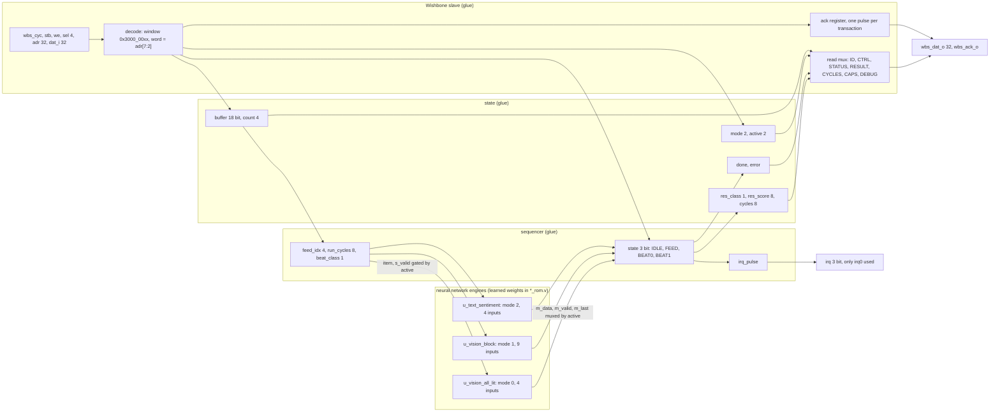
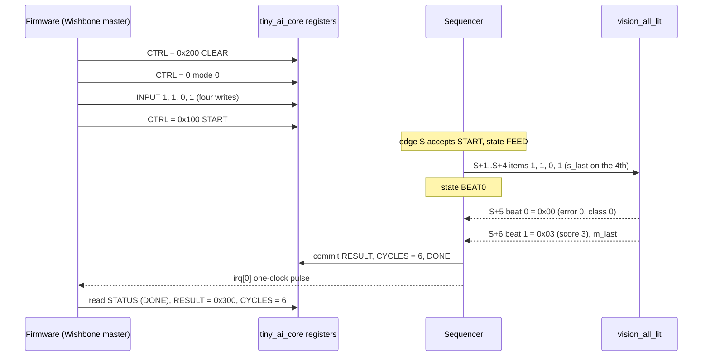
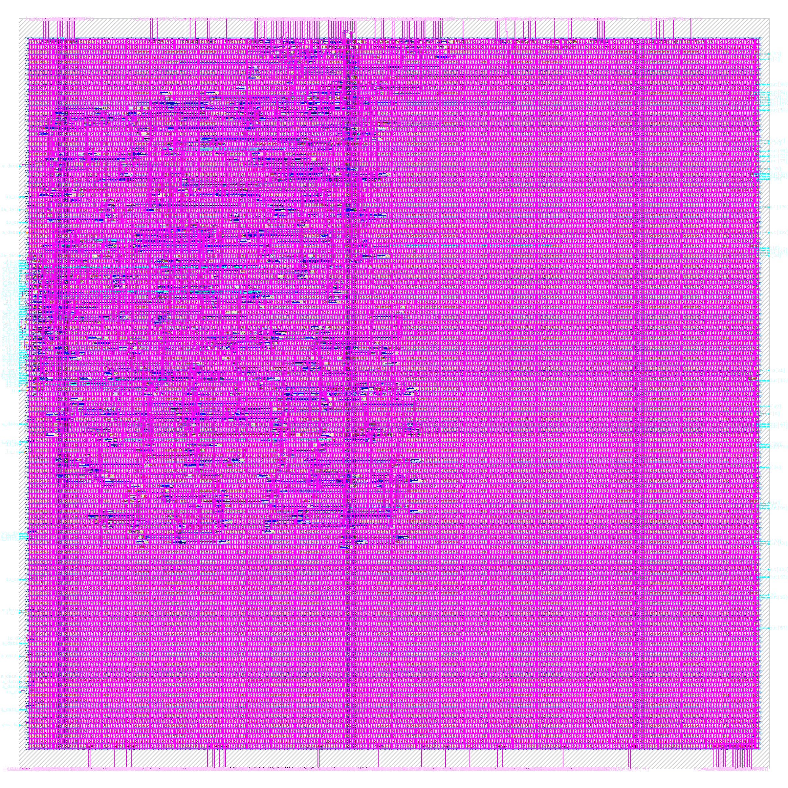

# tiny_ai_core: design notes

## What it is

`tiny_ai_core` is the three tiny AI engines (`vision_all_lit`, `vision_block`, `text_sentiment`, instantiated unchanged as `u_vision_all_lit`, `u_vision_block`, `u_text_sentiment`) behind one Caravel Wishbone register window (source: header of `rtl/tiny_ai_core.v`). Software pushes up to 9 inputs into a buffer through the `INPUT` register, writes `START`, and the core streams the buffer into the selected engine one item per clock, takes the engine's two result beats, and commits `RESULT`, `DONE` and `CYCLES` with a one-clock pulse on `irq[0]`.

What is neural network and what is not (from the RTL header): the networks are only the three engines (a binary neuron, a 2 x 2 convolution kernel reused at four positions with max-pooling, an embedding table with an accumulator). Their weights live in the generated `*_rom.v` files; this module adds none. Everything else in `rtl/tiny_ai_core.v` is ordinary system glue: a bus register block, an input buffer, a sequencer, status and interrupt. Retraining changes the ROMs, not this file.

Simplified for learning (owner decision 2026-10-06, `SPEC.md` Status update): only the Wishbone bus and the interrupt leave the core, so it has 109 signal pins (11 ports; `rtl/tiny_ai_core.v`) on a 250 x 250 um die. The GPIO and logic-analyser mirrors of `SPEC.md` are not implemented.
Simulation: `make simulate DESIGN=tiny_ai_core` printed `PASS tiny_ai_core_tb: 784 cases, 39956 checks (24060 wishbone transactions; ...)`.
Hardened result (`output/metrics.json`): DRC, LVS, XOR, antenna all 0; worst setup +1.456 ns, worst hold +0.105 ns over all corners; 195 max-slew violations reported (see Intuitions).

## Architecture



Register map (base `0x3000_0000`, 256-byte window, byte offsets; header of `rtl/tiny_ai_core.v`):

| Offset | Name | Access | Fields |
|---|---|---|---|
| 0x00 | ID | R | 0x54414901 |
| 0x04 | CTRL | RW | [1:0] mode (byte lane 0); write bit 8 START, bit 9 CLEAR (byte lane 1, self-clearing, read 0) |
| 0x08 | STATUS | R | [0] BUSY, [1] DONE, [2] ERROR, [5:4] active mode, [11:8] input count |
| 0x0C | INPUT | W | [7:0] one input, accepted only while idle (byte lane 0) |
| 0x10 | RESULT | R | [0] class, [15:8] signed debug score |
| 0x14 | CYCLES | R | clock edges from the edge that accepts START to the edge that commits the result (8 bits used) |
| 0x18 | CAPS | R | [2:0] modes 3'b111, [11:8] max inputs 9, [23:16] RTL version 1 |
| 0x1C | DEBUG | R | [17:0] input buffer, 2 bits per input, input 0 in bits [1:0] |

Internal registers (all in `rtl/tiny_ai_core.v`, synchronous active-high reset on `wb_rst_i`, clock `wb_clk_i`):

| Register | Width | Purpose |
|---|---|---|
| `state` | 3 | IDLE=0, FEED=1, BEAT0=2, BEAT1=3 |
| `mode`, `active` | 2 + 2 | CTRL[1:0]; mode latched at START |
| `count` | 4 | inputs in the buffer |
| `buffer` | 18 | 9 inputs x 2 bits |
| `feed_idx` | 4 | next input to stream |
| `done`, `error` | 1 + 1 | status bits (error is sticky until CLEAR) |
| `res_class`, `res_score` | 1 + 8 | committed result |
| `cycles`, `run_cycles` | 8 + 8 | CYCLES register and the running counter (saturating at 0xFF) |
| `beat_class` | 1 | result beat 0 captured |
| `irq_pulse`, `ack` | 1 + 1 | one-clock interrupt, one-clock bus ack |

Glue flip-flop bits: 3+2+2+4+18+4+1+1+1+8+8+8+1+1+1 = 63. The engines' surviving flip-flops are 10 + 24 + 12 = 46 (`docs/ARCHITECTURE.md` section 5, one-hot recoded). 63 + 46 = 109, equal to `design__instance__count__class:sequential_cell` = 109 in `output/metrics.json` and the 109 `dfxtp_2` in `output/reports/synth_stat.rpt`. The run's `06-yosys-synthesis/yosys-synthesis.log` says for `tiny_ai_core.state`: "Not marking tiny_ai_core.state as FSM state register: Users of register don't seem to benefit from recoding", so the controller stays 3 binary bits, while the three engine FSMs are recoded to `one-hot` (this is why the engines have 10, 24 and 12 flip-flops for 9, 22 and 11 RTL bits: 2 binary bits become 3 or 4 one-hot bits). Zero flip-flops were optimised away: 109 of 109.

Bus rules (RTL header): every transaction gets exactly one `wbs_ack_o` pulse; reads are masked by `wbs_sel_i`; unmapped reads return 0, unmapped writes do nothing. START or INPUT while busy, START with the wrong input count or mode 3, an out-of-range input, a tenth input, and CLEAR while busy all set the sticky ERROR bit. START and CLEAR in one write: CLEAR wins.

## Data flow

Example: mode 0 (`vision_all_lit`), inputs `1 1 0 1`, through the testbench `shared/tb/tiny_ai_wb_tb.vh` (`run_case`; each Wishbone transaction there takes two clock edges: the request edge and the idle edge that checks the ack dropped). The golden model `python3 model/tiny_ai/golden.py vision_all_lit 1 1 0 1` printed `beat0=0x00 beat1=0x03 latency=1`: class 0 (error 0), score 3 (three pixels agree with the learned weights 1,1,1,1; threshold 4). `core_run` gives CYCLES = inputs + engine latency + 1 = 4 + 1 + 1 = 6. The matching vector record in `tb/vectors.hex` reads mode 0, 4 inputs, class 0, score 3, CYCLES 6.

Software side (each row is one bus transaction; values derived by hand from the RTL, not read from a waveform):

| Step | Write / read | State after | count | buffer (hex) | mode | done | error |
|---|---|---|---|---|---|---|---|
| reset | `wb_rst_i` | IDLE | 0 | 0 | 0 | 0 | 0 |
| CLEAR | CTRL = 0x200 (sel 0010) | IDLE | 0 | 0x00000 | 0 | 0 | 0 |
| mode | CTRL = 0x000 (sel 0001) | IDLE | 0 | 0x00000 | 0 | 0 | 0 |
| INPUT 0 | INPUT = 1 | IDLE | 1 | 0x00001 | 0 | 0 | 0 |
| INPUT 1 | INPUT = 1 | IDLE | 2 | 0x00005 | 0 | 0 | 0 |
| INPUT 2 | INPUT = 0 | IDLE | 3 | 0x00005 | 0 | 0 | 0 |
| INPUT 3 | INPUT = 1 | IDLE | 4 | 0x00095 | 0 | 0 | 0 |
| STATUS | read | IDLE | 4 | | | | | returns 0x00000400 |
| START | CTRL = 0x100 (sel 0010) | FEED (next edge) | 4 | 0x00095 | 0 | 0 | 0 |

`start_ok` needs `count == mode_len(mode)` = 4 and mode != 3, so the START is accepted. Then the run, edge by edge. S is the edge that accepts START; `run_cycles` counts edges while busy:

| Edge | Core state after | feed_idx | run_cycles | Engine (`vision_all_lit`) | Notes |
|---|---|---|---|---|---|
| S | FEED | 0 | 0 | LOAD, count 0 | `active` = 0, `done` cleared |
| S+1 | FEED | 1 | 1 | takes item 0 = 1 | `s_valid` = feeding and active == 0 |
| S+2 | FEED | 2 | 2 | takes item 1 = 1 | |
| S+3 | FEED | 3 | 3 | takes item 2 = 0 | |
| S+4 | BEAT0 | 4 | 4 | takes item 3 = 1 with `s_last`; goes to OUT0 | `s_last` = (feed_idx == 3) |
| S+5 | BEAT1 | 4 | 5 | OUT0: beat 0 = 0x00 accepted, goes to OUT1 | `beat_class` = 0; m_ready = taking |
| S+6 | IDLE | 4 | 6 | OUT1: beat 1 = 0x03 with `m_last` accepted | `res_class` 0, `res_score` 3, `cycles` = 5+1 = 6, `done` 1, `irq_pulse` 1 |
| S+7 | IDLE | 4 | 6 | LOAD (frame cleared) | `irq_pulse` back to 0: irq[0] was high for exactly one clock |

Engine latency 1 means: last input beat at S+4, `m_valid` at S+5 (both edges counted, `model/tiny_ai/spec.json`). The software poll sees BUSY=1 on the first STATUS read after START (checked by `wait_done`), then BUSY=0 and DONE=1. Final reads: STATUS = {count 4, active 0, DONE} = 0x00000402, RESULT = 0x00000300 (score 3 in [15:8], class 0), CYCLES = 6, DEBUG = 0x00095, CAPS = 0x00010907, ID = 0x54414901.



Latency budget across modes (`tb/vectors.hex`, all 784 records): mode 0 has 16 records with CYCLES 6, mode 1 has 512 records with CYCLES 15, mode 2 has 256 records with CYCLES 6. These equal inputs + engine latency + 1: 4+1+1, 9+5+1, 4+1+1 (latencies 1, 5, 1 in `model/tiny_ai/spec.json`). The testbench requires CYCLES <= 16 on every run.

## Verification

Testbench: `designs/tiny_ai_core/tb/tiny_ai_core_tb.v` defines `TB_NAME`, instantiates the core with ports
only and includes the shared Wishbone body `shared/tb/tiny_ai_wb_tb.vh`
(`+VEC=designs/tiny_ai_core/tb/vectors.hex -I shared/tb`). For every case it does CLEAR, mode, input pushes,
START, polls STATUS (BUSY on the first poll), reads RESULT, CYCLES (must equal the record and be <= 16),
STATUS and DEBUG, and expects exactly one single-clock `irq[0]` pulse per run and `irq[2:1]` quiet; every
third case is run a second time without CLEAR and must repeat. It also checks the ID/CAPS/CTRL/DEBUG
registers, byte-select masking, unmapped offsets and addresses outside the window, protocol errors (sticky
ERROR), byte-lane writes, START+CLEAR, back-to-back runs, and reset during a run (every mode, many points)
followed by full cases. The Wishbone ack must be one clock wide and never rise without a request
(back-pressure/stall on this bus is the wait for ack). `!==` everywhere so X never passes; 100,000,000 ns hard
timeout; `$fatal(1, "FAIL ...")` on the first failure.
Fresh `make simulate DESIGN=tiny_ai_core`: `PASS tiny_ai_core_tb: 784 cases, 39956 checks (24060 wishbone
transactions; results, CYCLES<=16, irq, registers, byte lanes, window decode, protocol errors, back-to-back,
reset)`

Vectors: `designs/tiny_ai_core/tb/vectors.hex`, generated by `core_vectors()` in `model/tiny_ai/gen_rom.py`
using `model/tiny_ai/golden.py` (`core_run`): every valid input of the three engines, 16 + 512 + 256 = 784
cases (the full truth tables), each record holding mode, inputs, expected class, score byte and CYCLES from
the golden model, never hand-written.

Model-level: `python3 model/tiny_ai/golden.py --check` reports 0 mismatches for vision_all_lit (16 cases),
vision_block (512) and text_sentiment (256); `make check-generated` prints `check-generated: PASS
(regeneration reproduces every file)` and includes this `vectors.hex`.

Gate-level: the same testbench file runs on the synthesised netlist (`make gl DESIGN=tiny_ai_core`:
synthesis-only run, netlist `build/gl/tiny_ai_core/runs/gl/final/nl/tiny_ai_core.nl.v`, 716 cells) and on the
routed post-PnR netlist (`make gl-final DESIGN=tiny_ai_core`:
`designs/tiny_ai_core/runs/RUN_2026-10-05_19-50-40/final/nl/tiny_ai_core.nl.v`, 13650 cells), compiled by
`scripts/flow/gl_sim.sh` against the sky130_fd_sc_hd functional models with a unit gate delay of `#0.01`
(`GL_UNIT_DELAY`, default in gl_sim.sh; it must be above 0 to avoid flip-flop races and below the 1 ns sample
point). Results on disk: `build/flow/tiny_ai_core/stage_gl_synth.log` and `stage_gl_final.log` both end
`gl_sim: tiny_ai_core PASS`; `build/gl/tiny_ai_core/result.txt` reads `tiny_ai_core | final:tiny_ai_core.nl.v
| every case of tb/vectors.hex | PASS | 2 s`. `build/gl/tiny_ai_core/synth_checks.txt` reads
`synthesis__check_error__count = 0`.

Signoff checks that are verification (`scripts/flow/check_signoff.py tiny_ai_core`,
`build/flow/tiny_ai_core/stage_check.log`): no logic lost, RTL 109 registers, 109 surviving sequential cells,
allowance 0. Hand count: 63 glue bits + 46 engine flip-flops (10 + 24 + 12, the engine FSMs recoded to
one-hot) = 109; the RTL-bit count of the engines is 9 + 22 + 11 = 42, and the core's own 3-bit `state` stays
binary; Yosys driver warnings (multiple drivers / no driver) 0, synthesis check errors 0 (`synth_checks.txt`).

Negative tests (`tests/run_tests.sh`, "negative"): the expected class byte (byte 11) of the first case record
is flipped in a temp copy; the testbench exits non-zero with `FAIL case 1 RESULT class/score` and no PASS
line. The mutation is asserted to have applied. No other core-specific negative test is recorded in the NOTES.

## Layout (GDSII)



The picture (`output/layout.png`, KLayout render) shows the 250 x 250 um die (`design__die__bbox` = `0.0 0.0 250.0 250.0`, die area 62500 um^2) as the light-grey square. The core is `design__core__bbox` = `5.52 10.88 244.26 236.64`, core area 53897.9 um^2, 83 rows of 43077 sites in total (`design__rows`, `design__sites`; `floorplan.txt` says 83 rows of 519 sites). The dense magenta mesh is the power grid and local metal; the two wider vertical bands near the left and right thirds are vertical power straps. Logic is a diffuse cloud in the middle and lower half; the corners of the core are mostly fill and taps, which matches the low utilization.
The thin vertical wires below the core are the signal pins' routes: all 109 pins are on the bottom (S) edge, ordered left to right like the wrapper's Wishbone pads (`config.json` key `//IO_PIN_ORDER_CFG`, `pin_order.cfg`; `irq` at the right end). `design__io` = 111 is those 109 plus `vccd1` and `vssd1`.
Cells: 13650 instances in total, of which 11841 are fill (10780 `decap_3`, 639 `fill_1`, 422 `fill_2`, `cell_usage.rpt`), 765 are tap cells, and 1044 are logic: 573 multi-input combinational, 109 sequential, 245 timing-repair buffers, 34 clock buffers, 31 inverters, 3 buffers, 49 antenna diodes (`design__instance__count__class:*`). `design__instance__count__stdcell` = 1809 (everything except fill), stdcell area 11578.6 um^2, utilization 0.214825.

## From RTL to GDSII: what each step did

### Synthesis

Yosys mapped the RTL (the three engines, their ROMs and the glue) to sky130_fd_sc_hd: 716 cells, 7463.408 um^2, of which 2318.47 um^2 (31.06 %) is sequential (`output/reports/synth_stat.rpt`). Main types: 109 `dfxtp_2`, 52 `nor2_2`, 46 `and3_2`, 42 `a22o_2`, 41 `and2_2`, 38 `nand2_2`, 32 `or2_2`, 31 `inv_2`, 25 `a21oi_2`, 23 `a21o_2`, 12 `conb_1` tie cells, 3 `buf_2`.
`synth_checks.rpt` reports no problems; `synthesis__check_error__count` = 0, `design__inferred_latch__count` = 0, `design__instance_unmapped__count` = 0, lint 0 errors and 448 warnings (`design__lint_warning__count`).
Report: [synth_stat.rpt](output/reports/synth_stat.rpt), [synth_checks.rpt](output/reports/synth_checks.rpt).

### Floorplan

The die is fixed at 250 x 250 um by `config.json` (`FP_SIZING` absolute). OpenROAD added 83 rows of 519 sites, core area 53897.942 um^2, instance area 7463.408 um^2, effective utilization 0.138 with 716 instances (before buffers, taps and repair). The Caravel macro SDC is read here: clock `clk` 25 ns on `wb_clk_i`, max transition 0.75, max fanout 8, clock latency range 4.65 : 5.57 (`floorplan.txt`).
Report: [floorplan.txt](output/reports/floorplan.txt).

### Placement

Global placement finished at iteration 441, routability iterations 63, final weighted congestion 0.8011 (`placement_global.txt`). Detailed placement: HPWL 26986.4 u before, 26368.4 u after (-2.3 %), displacement 0.0 u in its own analysis (`placement_detailed.txt`); over the whole flow `design__instance__displacement__total` = 179.34 um, max 8.28 um. Taps: 765 `tapvpwrvgnd_1` cells. Timing repair then added buffers (245 `timing_repair_buffer` cells in the final metrics).
Reports: [placement_global.txt](output/reports/placement_global.txt), [placement_detailed.txt](output/reports/placement_detailed.txt).

### Clock tree

TritonCTS built one clock root with 31 buffers (30 `clkbuf_8`, 1 `clkbuf_16`) and 109 sinks, plus 3 `clkbuf_4` dummy loads (`cts.rpt`). The clock-tree settings are in `config.json` (`CTS_SINK_CLUSTERING_SIZE` 8, diameter 20, buffer distance 30). Worst skew in `metrics.json`: setup 0.2592 ns, hold -2.0985 ns (the hold figure includes the SDC's 4.65 to 5.57 ns source-latency spread; the underlying breakdown is not reported). After CTS, repair added 83 hold buffers (`design__instance__count__hold_buffer`), 0 setup buffers; clock buffers total 34 (`design__instance__count__class:clock_buffer`).
Report: [cts.rpt](output/reports/cts.rpt).

### Routing

Global routing: wire length 49238 um in `routing_global.txt` (`global_route__wirelength` = 49569, `global_route__vias` = 7333 in metrics). Detailed routing: DRC violations per iteration 198, 48, 37, 0 (`route__drc_errors__iter:0..3`), final `route__drc_errors` = 0. Final wire length 32323 um (`route__wirelength`), longest net 222.33 um (`route__wirelength__max`), 6822 vias, all single-cut. 1065 routed nets (`route__net`).
Reports: [routing_global.txt](output/reports/routing_global.txt), [routing_detailed.txt](output/reports/routing_detailed.txt).

### Timing

Worst slack per corner is in `timing_summary.rpt`; overall worst setup +1.4561 ns (max_ss_100C_1v60) and worst hold +0.1051 ns (min_ff_n40C_1v95); setup and hold violation counts 0 in all 9 corners. Register-to-register setup slack is not reported (`inf`). In the worst setup path (`timing_paths_max_ss.rpt`, max_ss corner) the startpoint is the input port `wb_rst_i`, which the SDC gives an input delay of 12.5 ns (half the 25 ns period); the path runs through chains of `clkdlybuf4s25_1` buffers (0.85 and 1.20 ns steps) before reaching the flip-flop. The worst hold path (`timing_paths_min_ff.rpt`, min_ff corner) is flip-flop `_1252_` to `_1244_` with the clock launched at the 4.65 ns source latency.
Reports: [timing_summary.rpt](output/reports/timing_summary.rpt), [timing_paths_max_ss.rpt](output/reports/timing_paths_max_ss.rpt), [timing_paths_min_ff.rpt](output/reports/timing_paths_min_ff.rpt).

### DRC

Magic: `COUNT: 0` (`drc_magic.rpt`); `magic__drc_error__count` = 0, `klayout__drc_error__count` = 0, `magic__illegal_overlap__count` = 0, `design__xor_difference__count` = 0. `manufacturability.rpt`: DRC Passed.
Reports: [drc_magic.rpt](output/reports/drc_magic.rpt), [drc_klayout.json](output/reports/drc_klayout.json), [manufacturability.rpt](output/reports/manufacturability.rpt).

### LVS

`lvs_netgen.rpt`: "Circuits match uniquely." with 1048 devices and 1058 nets on both sides and "Cell pin lists are equivalent."; all `design__lvs_*` counts are 0; `manufacturability.rpt`: LVS Passed.
Report: [lvs_netgen.rpt](output/reports/lvs_netgen.rpt).

### Power and IR drop

Total power 4.698e-04 W (`power__total`: internal 3.508e-04, switching 1.189e-04, leakage 5.54e-08). IR drop (`irdrop.rpt`, nom_tt): vccd1 worst 1.17e-04 V (0.01 %), average 1.65e-05 V; vssd1 worst 1.40e-04 V (0.01 %). Power grid violations 0.
Report: [irdrop.rpt](output/reports/irdrop.rpt).

### Antenna, slew, capacitance

Antenna: 0 violating nets and pins after 49 diode cells (`antenna__violating__nets` = 0, `design__instance__count__class:antenna_cell` = 49; `DIODE_ON_PORTS` "in" in `config.json`, heuristic diode insertion off). Max capacitance 0, max fanout 0 (`MAX_FANOUT_CONSTRAINT` 8). Max slew: `design__max_slew_violation__count` = 195 (144 at each tt and ff corner, 195 at max_ss, 180 at min_ss; `timing_summary.rpt`). `manufacturability.rpt` lists Antenna, LVS and DRC as Passed; slew is reported, not part of that gate. Flow warnings 1, errors 0.
Reports: [manufacturability.rpt](output/reports/manufacturability.rpt), [cell_usage.rpt](output/reports/cell_usage.rpt).

## Run time and memory

From `output/resources.json` (profile "tight": 2 CPUs, 8 GB limit, exit code 0): total wall time 98 s; container peak memory 690,204,672 bytes (0.643 GB); peak per-step RSS 617,611,264 bytes (step 71, netgen LVS). Steps 01 to 77 are listed.
Slowest steps:

| Step | Wall time (s) |
|---|---|
| 45-openroad-detailedrouting | 19.224 |
| 69-magic-spiceextraction | 13.149 |
| 66-klayout-drc | 9.748 |

(`65-magic-drc` 5.187 s, `56-openroad-stapostpnr` 4.63 s and `37-openroad-resizertimingpostcts` 4.89 s follow.) The earlier 400 x 400 um build took 168 s and 1.016 GB (`git show daeff2b:designs/tiny_ai_core/output/resources.json`).

## Reproduce

```bash
make simulate DESIGN=tiny_ai_core    # RTL simulation, 784 cases, 39956 checks
make views DESIGN=tiny_ai_core       # export the hardened macro views for the wrapper
make collect DESIGN=tiny_ai_core     # refresh output/ (metrics, reports, layout, LEF)
```

The testbench `tb/tiny_ai_core_tb.v` includes `shared/tb/tiny_ai_wb_tb.vh` and reads `tb/vectors.hex` (generated by `model/tiny_ai/gen_rom.py`); the same body runs on the RTL, the synthesised netlist and the routed netlist, and again through the wrapper ports (`designs/user_project_wrapper/tb/`). The physical flow (Docker) was not run for this document; all physical numbers come from the checked-in `output/` files.

## Intuitions and insights

**Neural network versus glue, by flip-flops.** Of the 109 flip-flops, 46 sit inside the engines (10 + 24 + 12) and 63 are Wishbone glue: the 18-bit input buffer, 16 bits of cycle counters, an 8-bit score copy and so on (`rtl/tiny_ai_core.v`, `synth_stat.rpt`). Even the storage is more than half glue. The learned weights cost no flip-flops at all, because they are ROM constants.

**Where the area goes.** The final design has 1809 standard cells (`metrics.json`), but 765 are tap cells and fill (11841 cells, 42319 um^2) is not counted in that number. Logic is 1044 cells: 573 combinational, 109 sequential, 245 timing-repair buffers, 34 clock buffers, 31 inverters, 3 buffers, 49 antenna diodes. Synthesis alone produced 716 cells (7463 um^2); the later steps took logic from 716 to 1044 cells (+328: repair buffers, clock buffers, diodes), so back-end overhead is about a third of the final logic cell count.

**Why simplifying the pins halved the cell count.** The earlier 400 x 400 um build with 609 I/O had 3521 standard cells, 2115 of them tap cells and 468 timing-repair buffers (`git show daeff2b:designs/tiny_ai_core/output/metrics.json`). The 250 x 250 um, 109-pin version has 1809, with 765 taps and 245 repair buffers. Taps scale with die area, not with logic: 2115 to 765 is the die shrinking from 160000 to 62500 um^2. The 176 tie cells that held constant outputs for unused Caravel pins are gone too (12 `conb_1` remain). Synthesised sequential cells did not change (109 both times), so the AI part was never the cost.

**Why the Caravel macro SDC matters.** `base_tiny_ai_core.sdc` carries the template's clock source latency (min 4.65, max 5.57 ns), clock transition 0.61 ns, Wishbone input delays (3.17 to 4.74 ns max, 0.79 to 1.86 ns min) and output delays (up to 8.41 ns on `wbs_ack_o`). With the default constraints the macro looked fine, but inside the wrapper hold failed by -0.894 ns (`designs/user_project_wrapper/README.md` step 3). Hardening with the same context the wrapper checks removes that surprise: hold is now +0.105 ns in the macro and in the wrapper. A 0.92 ns latency spread (5.57 - 4.65) is of the same order as many gate delays, which is why a hold margin of 0.105 ns is thin but real.

**The slew story, classified honestly.** There are 195 max-slew violations in the worst corner (144 at tt and ff). The SDC sets input transitions of 0.84 ns on `wbs_dat_i[*]` and 0.92 ns on `wbs_adr_i[*]`, above the 0.75 ns limit; (the 0.97 ns of the full template applied to `la_oenb`, which this core no longer has). A net that is already over the limit at the pin cannot be fixed by resizing cells behind it, so those violations are environment-limited. Classified by tracing each violating pin's net to its driver in the routed netlist (the post-route `checks.rpt` lists 131 of the 195 at max_ss_100C_1v60): 80 are on nets driven directly by the `wbs_adr_i` / `wbs_dat_i` input ports (environment-limited) and 51 on nets driven by internal cells (45 `buf_1`, 6 `clkdlybuf4s25_1` input buffers), which repair could in principle fix. The fast and typical corners still report 144 each, and internal buffers are not slow there, so the bulk is the corner-independent Caravel input transition. So: mostly environment-limited, not all; the 51 internal ones are a known, fixable remainder. Repair margins tried: 70 % ran out of memory chasing the unfixable nets, 40 % gave 247 violations, 20 % gave 195 (`config.json` key `//SLEW`). Note the monotonic surprise: more margin made it worse, a hypothesis (not tested here) is that extra repair buffering adds loaded nets. The wrapper's own count is 0, but its limit is 1.5 ns and it contains no cells (see the wrapper notes), so 0 there is not a better result for this macro.

**Why hold buffers and delay cells show up.** 83 hold buffers and 103 `clkdlybuf4s25_1` cells appear in `cell_usage.rpt`, and the worst setup path runs through `clkdlybuf4s25_1` stages (0.85 and 1.20 ns) from `wb_rst_i`, which the flow buffers through a fanout tree (net names `fanout162`, `fanout156`). A reset with 12.5 ns of input delay and a slow fanout tree still leaves +1.456 ns of setup slack on a 25 ns clock: the clock period is generous, so the setup side is never the problem here; hold and slew are.

**One-hot recoding and flip-flop counts.** Yosys recoded the three engine FSMs to one-hot (`yosys-synthesis.log`: "mapping auto encoding to `one-hot`"), so 9, 22 and 11 RTL bits became 10, 24 and 12 flip-flops. It declined the core's own `state` ("Users of register don't seem to benefit from recoding"), so that stays at 3 bits. 63 glue bits + 46 engine flip-flops = 109 matches the metric exactly; `check_signoff.py` compares against the elaborated count, not the source count.

**Latency budget: 6, 15, 6.** CYCLES = inputs + engine latency + 1: 4 + 1 + 1 = 6 for modes 0 and 2, 9 + 5 + 1 = 15 for mode 1 (`tb/vectors.hex`: 16, 256 and 512 records). The testbench caps CYCLES at 16. The "+1" is the commit edge; the "inputs" term is the core streaming one item per clock because the buffer decouples slow bus writes (two edges each in the testbench) from the engine. Mode 1 is slowest because the single 2 x 2 neuron is reused over four window positions.

**The pin order is a layout decision.** `pin_order.cfg` lists all 109 pins on the S edge in the order of the wrapper's pad row (x 3 to 624 um). At 109 pins on a 250 um edge, the pitch is about 2.3 um (`config.json` `//DIE_AREA`); the earlier 607-pin version needed 361 pins on one edge and failed global routing in the wrapper (`designs/user_project_wrapper/README.md` step 2). Pin count, not logic, set the floor on die width.

**Why 250 um.** `config.json` `//DIE_AREA` explains: 109 pins at about 2.3 um pitch fit one 250 um edge, and 250 um still lets one full group of the wrapper's horizontal met5 straps (pitch 180 um, 18.6 um between the 8 nets) cross the macro. Smaller would lose the straps; larger just adds taps (765 now for 62500 um^2) and fill.

**Reading the utilization number.** Utilization is 0.2148 including taps, and 0.138 at floorplan. That is low by design: the die is sized by pins and PDN straps, not logic. Do not compare cell counts across dies without separating taps, as `SPEC.md` Intuitions also says.
