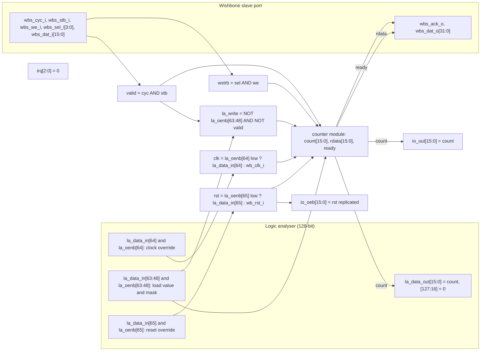
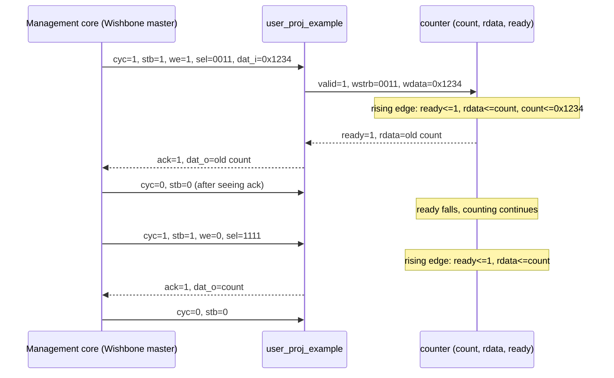
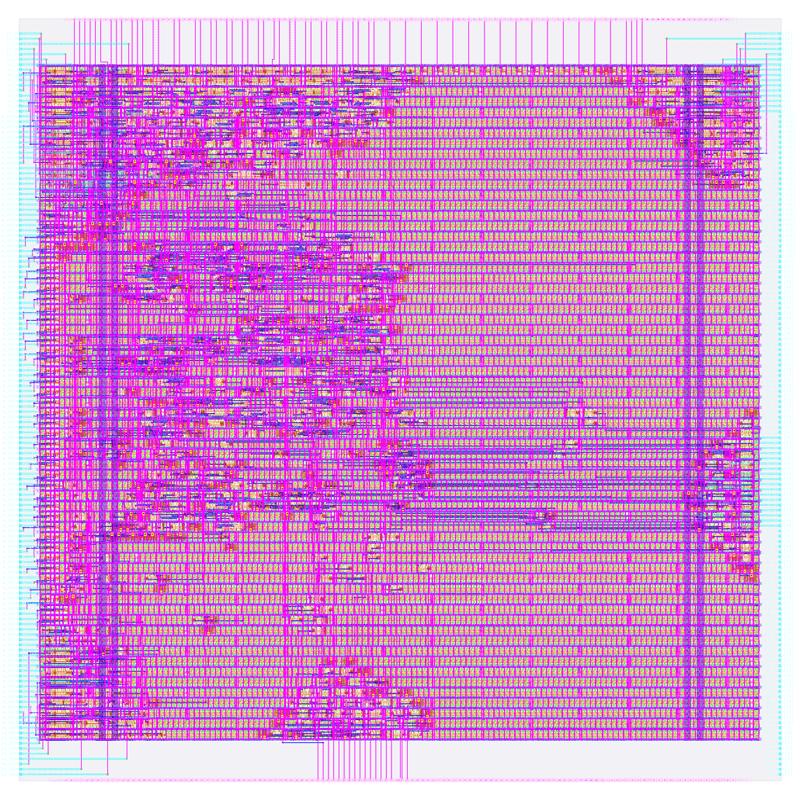

# user_proj_example: design notes

All numbers below come from the files under `output/` (named next to each number), from `config.json`,
`pin_order.cfg`, `rtl/user_proj_example.v` or `rtl/UPSTREAM.txt`. Anything a file does not contain is marked "not reported".
Re-verified on 2026-10-06 against the current `output/` (run directory `designs/user_proj_example/runs/RUN_2026-10-05_18-17-43`,
`output/resources.json` `run_dir`). The testbench and checks are in the "Verification" section. The Reproduce commands are in the "Reproduce" section below; the last section is
"Intuitions and insights".

## What it is

**This design is not AI.** It is the ChipIgnite (ChipFoundry `caravel_user_project`) template's example user
project: a 16-bit counter that the management core can read, write, start and stop over a Wishbone slave port,
that a 128-bit logic analyser (LA) can load, clock and reset, and whose value is driven onto 16 GPIO pads
(`rtl/UPSTREAM.txt`). It is in this repository as the **baseline that proves the flow**: if RTL, synthesis,
place and route, DRC, LVS and timing all pass for a trivial known-good design, then a failure on an AI engine is
more likely the engine than the flow.

The tiny AI engines in this repository do arithmetic that mimics a neural network (multiply-accumulate,
weights, activations). This design does only `count + 1` and some load multiplexing. See
[../../docs/WHY_AI.md](../../docs/WHY_AI.md) for why the AI designs exist and how they differ.

Flow settings (`config.json`): sky130A, `sky130_fd_sc_hd`, clock port `wb_clk_i`, `CLOCK_PERIOD` 25 ns (40 MHz),
die 200 x 200 um, supply nets `vccd1` / `vssd1`, `ERROR_ON_SYNTH_CHECKS` true.

## Architecture



Reading the diagram: the `wb_clk_i` and `wb_rst_i` inputs feed the two multiplexers; if the logic analyser
"owns" bit 64 (`la_oenb[64]` low) the counter is clocked from `la_data_in[64]` instead, and likewise bit 65
for reset. `io_oeb` is the pad output-enable, active low: it equals the reset, so pads are inputs while in
reset and outputs once reset is released. `irq` is tied to 0 (`rtl/user_proj_example.v`: "Unused").

Registers (all in module `counter`, `BITS` = 16):

| Register | Width | Purpose |
|---|---|---|
| `count` | 16 | The counter. Increments every clock unless the LA is loading; loaded by a Wishbone write (byte-wise via `wstrb`) or by the LA (`la_write & la_input`); cleared by reset. Drives `io_out` and `la_data_out[15:0]`. |
| `rdata` | 16 | Read-data capture register: holds the old value of `count` captured when a Wishbone request is accepted; drives `wbs_dat_o[15:0]` (upper 16 bits tied to 0). |
| `ready` | 1 | Acknowledge flop: high for one cycle after a request is accepted; drives `wbs_ack_o`. |

Flip-flop total: 16 + 16 + 1 = **33**. This equals `design__instance__count__class:sequential_cell` = 33 in
`output/metrics.json` (33 `sky130_fd_sc_hd__dfxtp_2` in `output/reports/synth_stat.rpt`, and `cts.rpt` lists
33 clock sinks), so nothing was optimised away and nothing was added. There are no latches
(`design__inferred_latch__count` 0, `metrics.json`).

## Data flow

Conventions: "edge N" is a rising clock edge. Values are after the edge. Addresses are ignored by this
design (`wbs_adr_i` is not used); every Wishbone access hits the one counter register.

**(a) Wishbone write then read** (what the testbench `tb/user_proj_example_tb.v` does; it drives address
0x3000_0000 and waits for ack)

| Cycle | Inputs presented before the edge | Internal effect at the edge | After the edge |
|---|---|---|---|
| 0 | `cyc=stb=1, we=1, sel=0011, dat_i=0x1234`; `ready`=0 | `valid` and `!ready`: `ready<=1`, `rdata<=count` (old value), `count<=0x1234` for both bytes (overrides the +1) | `count=0x1234`, `ack=1`, `dat_o`=old count |
| 1 | master sees ack, drops `cyc/stb` | `valid`=1 still this edge but `ready`=1 so no new capture; counts on | `count=0x1235`, `ack`=0 |
| 2 | read: `cyc=stb=1, we=0`, `sel=1111` | `wstrb`=0 so no write; `ready<=1`, `rdata<=count` | `ack=1`, `dat_o[15:0]`=count of the previous cycle |
| 3 | master drops `cyc/stb` | counts on | `ack`=0 |

Notes: the write returns the **old** count; a read returns the count as it was when the request was accepted
(one cycle earlier than the value after the edge). A request arriving while `ready` is high is only accepted one
cycle later (testbench comment). `wstrb`=0 with `we`=1 writes nothing and the count keeps running.

**(b) Free counting and a logic-analyser load**

| Cycle | Condition | Effect | `count` |
|---|---|---|---|
| reset | `wb_rst_i`=1 | `count<=0`, `ready<=0`; `io_oeb`=0xFFFF (pads are inputs) | 0x0000 |
| r+1 .. r+10 | reset released, no Wishbone, `la_oenb`=all 1 (LA not driving) | `~|la_write` true, so `count<=count+1`; `io_oeb`=0 (outputs) | 0x0001 .. 0x000A |
| L | `la_oenb[63:48]`=0, `la_data_in[63:48]`=0xBEEF, no Wishbone | `la_write`=0xFFFF (non-zero): increment is suppressed, `count<=la_write & la_input` | 0xBEEF |
| L+1.. | LA still holding | same load every cycle | stays 0xBEEF |
| release | `la_oenb[63:48]` back to 1 | `la_write`=0, counting resumes | 0xBEF0, ... |
| partial | only some mask bits low | `count<=la_write & la_input`: bits not selected by the mask load as 0 | per testbench (0x0034) |

While a Wishbone request is valid, `la_write` is forced to 0 (`& ~{BITS{valid}}`), so a Wishbone access always
beats an LA load. The testbench `tb/user_proj_example_tb.v` checks all of the above plus the LA clock override
(three LA clock pulses) and LA reset override (count cleared, `io_oeb` set). `make simulate` (run from the
repository root) prints `PASS user_proj_example_tb: 28 checks (reset, count, Wishbone read/write, LA load/clock/reset)`.



## Verification

Testbench: `designs/user_proj_example/tb/user_proj_example_tb.v`, written for this repository from the RTL's
behaviour (it is not part of the upstream template) and committed; there is no generator, no vectors file and
no shared include. It drives the Wishbone slave port and the logic analyser of the 16-bit counter and checks:
reset state, the free-running count, Wishbone read, full write, byte writes and a write with no byte enables,
LA load of the count (full and partial mask), LA clock and reset override, and the
`io_out`/`io_oeb`/`la_data_out`/`irq` outputs (`la_data_out[127:16]` must be zero). Every Wishbone access must
be acknowledged within 8 cycles. Comparisons use `===`/`!==` so X never passes; hard timeout of 100,000 ns
(the testbench comment says about 120 clock cycles; `build/sim/user_proj_example/sim.log` shows `$finish` at 480000 ps = 480 ns, i.e. 48 cycles of the testbench's 10 ns clock); `$fatal(1, "FAIL ...")` on the first wrong value.
Fresh `make simulate DESIGN=user_proj_example`: `PASS user_proj_example_tb: 28 checks (reset, count, Wishbone
read/write, LA load/clock/reset)`

Vectors: none to generate; the expected values are computed in the testbench from the counter's definition
(increment by 1, byte-wise `wstrb` merge, LA mask), not from a model script. Model-level checks do not apply
(no `golden.py`, not in `make check-generated`).
Scope limit stated in the testbench header: the unit alone. The template's own tests (io_ports, la_test1,
la_test2) need a full Caravel simulation with management-core firmware and are out of scope, as is the
wrapper.

Gate-level: the same testbench file runs on the synthesised netlist (`make gl DESIGN=user_proj_example`:
synthesis-only run, netlist `build/gl/user_proj_example/runs/gl/final/nl/user_proj_example.nl.v`, 332 cells)
and on the routed post-PnR netlist (`make gl-final DESIGN=user_proj_example`:
`designs/user_proj_example/runs/RUN_2026-10-05_18-17-43/final/nl/user_proj_example.nl.v`, 8727 cells),
compiled by `scripts/flow/gl_sim.sh` against the sky130_fd_sc_hd functional models with a unit gate delay of
`#0.01` (`GL_UNIT_DELAY`, default in gl_sim.sh; it must be above 0 to avoid flip-flop races and below the 1 ns
sample point). Results on disk: `build/flow/user_proj_example/stages.txt` lists `gl_synth PASS` and `gl_final PASS` (the
`stage_gl_*.log` files hold only the recipe command lines, not the simulator output);
`build/gl/user_proj_example/sim/gl.log` ends with the testbench `PASS ... 28 checks` line; `build/gl/user_proj_example/result.txt` reads `user_proj_example |
final:user_proj_example.nl.v | committed tb | PASS | 0 s`. `build/gl/user_proj_example/synth_checks.txt` reads
`synthesis__check_error__count = 0`.

Signoff checks that are verification (`python3 scripts/flow/check_signoff.py user_proj_example`, whose output is
the `check` stage in `build/flow/user_proj_example/stages.txt`): no logic lost, RTL 33 registers (16 + 16 + 1), 33 surviving
sequential cells, allowance 0; there is no FSM to recode, so the hand count matches; Yosys driver warnings
(multiple drivers / no driver) 0, synthesis check errors 0 (`synth_checks.txt`; the Yosys log `06-yosys-synthesis/yosys-synthesis.log` contains no "multiple drivers" / "no driver" line).

Negative tests (`tests/run_tests.sh`, "negative"): the counter RTL is copied with `count <= count + 1'b1;`
mutated to `count <= count + 2'd2;`; the testbench exits non-zero with a `FAIL co...` message and no PASS line
(mutation asserted to have applied). The README/NOTES record no other negative test for this design.

## Layout (GDSII)



What is visible (`output/layout.png`, rendered from the final GDS):

- **Die**: `design__die__bbox` = 0 0 200 200 um (`design__die__area` 40000 um^2); core `design__core__bbox` =
  5.52 10.88 194.12 187.68 um, core area 33344.5 um^2, 65 rows (`metrics.json`).
- **Pins on the edges**: `pin_order.cfg` places `wb_*`, `wbs_*`, `irq*`, `io_in*` on the north edge, `la_data_in*`
  south, `la_oenb*` and `io_oeb*` east, `la_data_out*` and `io_out*` west. The design has 541 signal port bits
  (`synth_stat.rpt`: "541 port bits"; 106 Wishbone/clock/reset + 384 LA + 48 io + 3 irq) and `design__io` = 543
  in `metrics.json` (the extra 2 are the `vccd1` / `vssd1` power pins). The thin cyan and pink stubs around the
  rim are these pins and the wires that reach them.
- **Logic cluster vs fill**: the real logic (332 synthesised cells, plus repair and clock buffers) is a small,
  denser region concentrated on the left side of the core near where the pins are. The large uniform area to the
  right is mostly filler and tap cells: `design__instance__count__class:fill_cell` 7306 (25298 um^2) and
  `tap_cell` 469 (586.8 um^2), against 1421 standard cells in total (8046.5 um^2).
- **Power straps**: the two broad vertical bands in the core (about an eighth of the way in from the left and near
  the right edge) are power-grid straps for `vccd1` / `vssd1`; the regular horizontal lines are the standard-cell
  power rails. `design__power_grid_violation__count` is 0.
- **Utilisation**: `design__instance__utilization` = 0.241313 (24.1 %, standard cells 8046.47 um^2 over core
  33344.5 um^2). The floorplan-time figure was 0.078 (`floorplan.txt`, "Effective utilization").

**Why 200 x 200 um instead of 2800 x 1760 um**: the template's die size is the macro slot reserved inside
`user_project_wrapper` for a big user design, not what this counter needs (about 300 cells). Measured on the
build machine at `PROFILE=tight`, the original size ran 44+ minutes unfinished with 69,228 tap cells
(`rtl/UPSTREAM.txt`, local change 1). The pins were also re-spread over all four sides because 541 pins do not
fit on one edge of a 200 um die (`rtl/UPSTREAM.txt`, local change 2). The 541-pin interface is large for a
200 um square, which is why pin routing dominates the picture.

## From RTL to GDSII: what each step did

### Synthesis
Yosys maps the RTL to `sky130_fd_sc_hd` cells: **332 cells, 2587.48 um^2** (`synth_stat.rpt`). By type: 33
`dfxtp_2` flip-flops, 131 `conb_1` tie cells (constant 0 outputs: `la_data_out[127:16]`, `irq`, upper
`wbs_dat_o`), 20 `mux2_1`, 32 `buf_2`, 15 `inv_2`, and about 100 gates (and/or/a21o/a32o/xor2 and so on). Check
pass: "Found and reported 0 problems" (`synth_checks.rpt`); `synthesis__check_error__count` 0, unmapped cells 0,
lint errors 0, lint warnings 8 (`metrics.json`). Report: [synth_stat.rpt](output/reports/synth_stat.rpt),
[synth_checks.rpt](output/reports/synth_checks.rpt).

### Floorplan
Absolute sizing: die 0 0 200 200, core 5.52 10.88 194.12 187.68 um, 65 rows of 410 sites, core area 33344.48
um^2, instance area 2587.48 um^2, utilisation 0.078, 332 instances (`floorplan.txt`). Tap cells then bring the
fixed instances to 599 (`placement_global.txt`, GPL-0008: fixed instances 599). Report: [floorplan.txt](output/reports/floorplan.txt).

### Placement
Global placement is routability driven at target density 0.2952 (`placement_global.txt`, GPL-0023) with 931
instances (332 movable), 677 nets, 1376 pins. Detailed placement legalises with total displacement 0.0 u,
mirrors 312 instances and cuts HPWL from 19160.0 u to 18505.7 u (-3.4 %) (`placement_detailed.txt`).
Reports: [placement_global.txt](output/reports/placement_global.txt),
[placement_detailed.txt](output/reports/placement_detailed.txt).

### Clock tree
One clock root, 33 sinks, 5 clock subnets, 5 `clkbuf_16` buffers inserted, plus dummy loads (1 `bufinv_16`,
1 `clkbuf_4`, 1 `clkbuf_8`) (`cts.rpt`). Final clock cells in `metrics.json`: 7 clock buffers, 1 clock inverter.
Worst clock skew: setup 0.2518 ns, hold -2.0956 ns (`clock__skew__worst_*`; the SDC models a 4.65 to 5.57 ns
source-latency range, so the hold figure mostly reflects that constraint). Report: [cts.rpt](output/reports/cts.rpt).

### Routing
Global routing: wirelength 32913 (`global_route__wirelength`), 18 `global_route__vias` in `metrics.json`; the
log reports 4086 vias, 31112 um and 0 overflow, peak layer usage 22.74 % on met2 (`routing_global.txt`).
Detailed routing: total wire length 23502 um (met1 9096, met2 12867, met3 1441, met4 96), 3915 vias, all
single-cut, 1040 nets (`routing_detailed.txt`, `metrics.json`). DRC violations per iteration: 1, 0, 5, 0 for
iterations 0 to 3, finishing with 0 violations (`route__drc_errors__iter:*`, `route__drc_errors` 0). Longest
net 291.48 um (`route__wirelength__max`). Reports: [routing_global.txt](output/reports/routing_global.txt),
[routing_detailed.txt](output/reports/routing_detailed.txt).

### Timing
Clock 25 ns, three process corners (nom/min/max parasitics each). Worst setup slack **5.9947 ns** (corner
`max_ss_100C_1v60`), worst hold slack **0.4040 ns** (corner `min_ff_n40C_1v95`); no violations, TNS 0
(`timing_summary.rpt`). Per nominal corner: tt setup 8.7170 / hold 0.7416, ss 6.0964 / 1.5162, ff 9.5789 /
0.4059 ns. Worst setup path: `wb_rst_i` (input port) to flop `_285_`, arrival 24.1633 ns
(`timing_paths_max_ss.rpt`); the reset input has a 12.5 ns input delay in the SDC. Worst hold path: flop `_282_`
to itself (a counter bit feeding back into its own logic), slack 0.404003 ns (`timing_paths_min_ff.rpt`).
Reg-to-reg setup slack is reported as N/A / infinity because the only constrained setup paths start at ports.
Reports: [timing_summary.rpt](output/reports/timing_summary.rpt),
[timing_paths_max_ss.rpt](output/reports/timing_paths_max_ss.rpt),
[timing_paths_min_ff.rpt](output/reports/timing_paths_min_ff.rpt).

### DRC
Design Rule Checking verifies the drawn shapes obey the foundry's spacing, width and enclosure rules so the
chip can be manufactured. Magic: count 0 (`drc_magic.rpt`, `magic__drc_error__count` 0). KLayout: 0 errors
(`klayout__drc_error__count` 0; every rule in `drc_klayout.json` that appears in the first lines read 0).
The XOR check of the two streamed-out GDS files also shows 0 differences (`design__xor_difference__count`).
Reports: [drc_magic.rpt](output/reports/drc_magic.rpt), [drc_klayout.json](output/reports/drc_klayout.json).

### LVS
Layout Versus Schematic extracts the transistors and wires from the layout and checks that they are the same
circuit as the synthesised netlist. Result: "Circuits match uniquely" and "Netlists match uniquely", 803
devices and 890 nets on both sides (`lvs_netgen.rpt`); all `design__lvs_*` counts are 0 (`metrics.json`).
`manufacturability.rpt` lists Antenna, LVS and DRC as Passed. Report: [lvs_netgen.rpt](output/reports/lvs_netgen.rpt),
[manufacturability.rpt](output/reports/manufacturability.rpt).

### Power / IR drop
IR drop is the voltage lost along the power grid. For `vccd1` at nom_tt_025C_1v80: total power 3.30e-04 W,
worst voltage 1.80 V, average drop 1.57e-05 V, worst drop 2.20e-04 V (0.01 %). `vssd1`: worst 2.58e-04 V
(`irdrop.rpt`). `metrics.json` total power 3.87e-04 W (internal 1.70e-04, switching 2.17e-04, leakage 3.7e-08).
Report: [irdrop.rpt](output/reports/irdrop.rpt).

### Antenna, slew, capacitance
Antenna effect: long wires can collect charge during manufacturing and damage a gate. Result: 0 violating nets,
0 pins (`antenna__violating__nets`, `route__antenna_violation__count`), with 254 antenna/diode cells present
(`design__instance__count__class:antenna_cell`; `antenna_diodes_count` 2). Max-slew violations 482, max-cap
1, max-fanout 3 at the worst corner (`metrics.json`, `timing_summary.rpt`; zero max-cap at the tt and ff
corners). These are **reported, not failed**: the root README ("Not covered") says part of the counts is environment-limited (input
transitions set by the SDC above the 0.75 ns limit, naming this design's 541 port bits) and part is internal nets, and `make check` reports them without failing
(`scripts/flow/check_signoff.py`). `flow.log` lists the corners with max-slew violations (all nine) and with
max-cap violations (the three ss corners), each list followed by a checker line reading "No max slew violations found" /
"No max cap violations found" (the check does not fail the flow), and ends "Flow complete". The "Intuitions and insights"
section below refines the cause of the 482. Also: 286 disconnected pins, 0 critical (`design__disconnected_pin__count`), and 2 floating nets.

## Run time and memory

From `output/resources.json` (profile `tight`: 2 CPUs, 8 GB; exit code 0):

- Total wall time: **77 s** for 79 steps (`wall_s_total` 77).
- Peak container memory: **0.764 GB** (819916800 bytes); highest single-process RSS 637.5 MB (637534208 bytes, detailed routing).
- Three slowest steps: `47-openroad-detailedrouting` 13.7 s, `71-magic-spiceextraction` 8.739 s,
  `68-klayout-drc` 6.515 s (next: `35-openroad-cts` 4.287 s).

## Reproduce

```sh
make flow-all      # DESIGN defaults to user_proj_example (Makefile: DESIGN ?= user_proj_example); runs the whole flow in Docker
make collect       # refreshes output/ (metrics.json, resources.json, reports/, layout.png, flow.log)
make simulate      # RTL simulation only; prints PASS user_proj_example_tb: 28 checks (...)
```

To choose the design explicitly: `make flow-all DESIGN=user_proj_example` and `make simulate DESIGN=user_proj_example`
(both targets exist in the current `Makefile`; `make simulate DESIGN=user_proj_example` was re-run on 2026-10-06 and
passed). `make flow-all` runs simulate, gds, check, gl (synthesised netlist), gl-final (routed netlist) and collect.
The run directory name is recorded in `output/resources.json` (`run_dir`).

## Intuitions and insights

Plain-language lessons, each tied to a file. See also `docs/WHY_AI.md` (why the other designs are neural networks),
`docs/ARCHITECTURE.md` and the "Intuitions and insights" section of `SPEC.md`.

**Why this is the baseline.** It is a deliberately non-AI design: a 16-bit counter with a Wishbone port and a
logic-analyser override (`rtl/UPSTREAM.txt`), 33 flip-flops that all survive synthesis (`metrics.json`
`design__instance__count__class:sequential_cell` 33; RTL 16 + 16 + 1) and no FSM to recode. Everything signoff checks is
0 (`metrics.json`: Magic and KLayout DRC, LVS, XOR, antenna, setup and hold violations) and the whole flow takes 77 s
(`output/resources.json`; for scale, `soc_kv_attn_n8`, now the largest build, takes 181 s with 4514 cells in its `metrics.json` and `resources.json`). That makes it the control experiment: a known-good, boring design that proves the toolchain,
so a later failure on an AI engine points at the engine, not the flow. The check that the testbench can fail also
started here: `tests/run_tests.sh` swaps `count + 1` for `count + 2` in a copy of the RTL and requires the testbench to
reject it.

**Why 200 x 200 um and not 2800 x 1760 um.** The template's die is the slot reserved inside `user_project_wrapper` for a
large user design (`rtl/UPSTREAM.txt`, local change 1), not what a counter needs: 332 synthesised cells, 2587.48 um^2
(`synth_stat.rpt`). 2800 x 1760 is 4,928,000 um^2, 123 times the 40000 um^2 die used here (arithmetic from the two die
sizes), and at that size the run was still unfinished after 44+ minutes with 69,228 tap cells (`UPSTREAM.txt`, measured in
the sibling repository). At 200 x 200 the flow takes 77 s. Even so the die is mostly empty: utilisation 0.241 and 7306
fill cells covering 25298 um^2, about 3.1 times the 8046.47 um^2 of real cells (`metrics.json`). The floor on the die is
the pin count, not the logic: 541 port bits had to be re-spread over all four edges (`UPSTREAM.txt`, local change 2;
`pin_order.cfg`).

**Where the area goes.** After place and route the standard cells total 1421 (8046.47 um^2) against 332 synthesised
(2587.48 um^2). By class (`metrics.json`): 358 timing-repair buffers 4052.64 um^2 (50.4 % of standard-cell area), the 252
multi-input gates 1676.61 um^2 (20.8 %), 33 flip-flops 701.92 um^2 (8.7 %), 254 antenna diode cells 635.61 um^2 (7.9 %),
469 tap cells 586.81 um^2 (7.3 %), 8 clock cells 176.42 um^2 (2.2 %). The repair buffers outweigh the logic they serve; the
largest groups in `cell_usage.rpt` are 166 `dlygate4sd3_1`, 66 `buf_4`, 65 `buf_12` and 58 `clkdlybuf4s25_1`. The
files do not say which nets each group serves, so tying them to the 541-pin interface is an expectation, not a measurement.
The 131 `conb_1` tie cells (491.72 um^2 in `synth_stat.rpt`) hold constant-0 outputs for pins the counter does not use.

**The 482 max-slew violations, then and now.** The README first attributed them to "the template's input-transition
constraints on 541 unbuffered pins". The SDC lets us be more exact (`base_user_proj_example.sdc`, `flow.log`): the maximum
transition is 0.75 ns, while the declared input transitions are 0.84 ns on `wbs_dat_i`, 0.86 on `la_data_in`, 0.92 on
`wbs_adr_i` and 0.97 on `la_oenb`. That is 32 + 128 + 32 + 128 = 320 input bits that start out above the limit, so no
repair can bring a net driven straight from such a port under it: the constraint comes from the environment, not the
design. This is the same conclusion the repository reached later for `tiny_ai_core` (`designs/tiny_ai_core/config.json`
note "//SLEW": environment-limited; a 70 % repair margin ran out of memory chasing these nets). Two cautions: 320 is not
482, and the repository holds no per-net list of the violators, so the other roughly 160 are unexplained; and this
design's `config.json` sets no slew margin (only `MAX_FANOUT_CONSTRAINT` 16), so how many of the 482 repair could remove
was never tried. Max-fanout 3 and max-cap 1 (ss corners only) are likewise reported, not failed.

**Why the small AI engines show far fewer slew violations than this design.** The stream engines have no SDC override in
`config.json`; their floorplan log shows the flow default ("Setting input delay to: 5",
`vision_all_lit/output/reports/floorplan.txt`), with no 0.84 to 0.97 ns input transitions. Their `design__max_slew_violation__count`
(each design's `output/metrics.json`) is 0 for `vision_all_lit`, `vision_block`, `text_sentiment` and `prec_bin`, but not
0 everywhere: 9 for `prec_tern` and `prec_int4`, 14 for `audio_onset`, 18 for `audio_pitch`, 61 for `image_text_match`, 195 for `tiny_ai_core`, and
415 to 1190 for the `kv_attn_*` family. So 482 is within the range of the larger designs, and the count grows with
design size, not only with this design's SDC. Which part of each count is environment-limited was classified only for
`tiny_ai_core` (see its NOTES); for the others it is not verified. The difference between 482 here and 0 on the smallest engines
is therefore partly the constraints each design was given and partly design size; no run swapped the SDC to separate the two.

**Timing headroom is I/O-limited.** Worst setup slack is 5.9947 ns of a 25 ns clock (`timing_summary.rpt`, corner
`max_ss_100C_1v60`), and the path is `wb_rst_i` to a flop with a 12.5 ns input delay (half the period, in the SDC) and 5.57
ns clock latency in front of it (`timing_paths_max_ss.rpt`). Register-to-register setup is reported as infinity
(`timing__setup_r2r__ws`), so a 16-bit increment is not the limit at 25 ns. The thin side is hold: 0.404 ns worst
(`min_ff_n40C_1v95`), where the other designs have 0.096 (`kv_attn_n16`) to 0.115 ns (`prec_int4`) (`timing__hold__ws` in each `output/metrics.json`).

**Verification.** `make simulate` prints "PASS user_proj_example_tb: 28 checks" and the same testbench passes on the
synthesised and the routed netlist (`build/flow/user_proj_example/stages.txt`: `gl_synth PASS`, `gl_final PASS`). A write
returns the old count, which the testbench checks explicitly ("write returns old count", `tb/user_proj_example_tb.v` line
115); that is easy to get wrong because the read data is captured before the new value lands.

**What it contributed to the flow.** The local changes recorded in `rtl/UPSTREAM.txt` became the shared recipe: absolute
die sizing, `@bit_major` pin ordering, LibreLane 3 key names, `ERROR_ON_SYNTH_CHECKS` true, no
`MAX_TRANSITION_CONSTRAINT` override. The AI engines reuse the same keys (`FP_SIZING` absolute, `RT_MAX_LAYER` met4,
`PDN_MULTILAYER` false, `MAGIC_DRC_USE_GDS` true, `ERROR_ON_SYNTH_CHECKS` true in their `config.json`). It also set the
reporting rule that max-slew and max-cap are printed, not failed, until the cause is understood
(`scripts/flow/check_signoff.py`).
