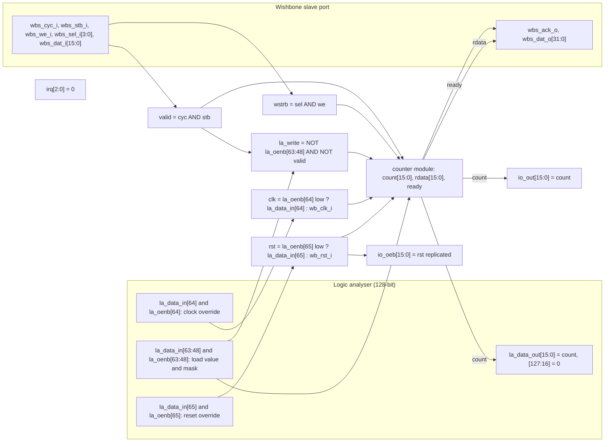
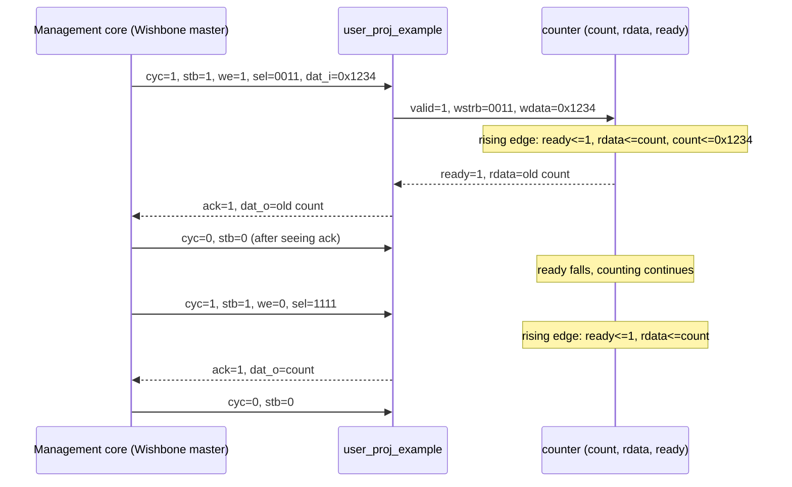

# user_proj_example: design notes

All numbers below come from the files under `output/` (named next to each number), from `config.json`,
`pin_order.cfg`, `rtl/user_proj_example.v` or `rtl/UPSTREAM.txt`. Anything a file does not contain is marked "not reported".

## What it is

**This design is not AI.** It is the ChipIgnite (ChipFoundry `caravel_user_project`) template's example user
project: a 16-bit counter that the management core can read, write, start and stop over a Wishbone slave port,
that a 128-bit logic analyser (LA) can load, clock and reset, and whose value is driven onto 16 GPIO pads
(`rtl/UPSTREAM.txt`). It is in this repository as the **baseline that proves the flow**: if RTL, synthesis,
place and route, DRC, LVS and timing all pass for a trivial known-good design, then a failure on an AI engine is
more likely the engine than the flow.

The tiny AI engines in this repository do arithmetic that mimics a neural network (multiply-accumulate,
weights, activations). This design does only `count + 1` and some load multiplexing. See
[../../docs/WHY_AI.md](../../docs/WHY_AI.md) for why the AI designs exist and how they differ.

Flow settings (`config.json`): sky130A, `sky130_fd_sc_hd`, clock port `wb_clk_i`, `CLOCK_PERIOD` 25 ns (40 MHz),
die 200 x 200 um, supply nets `vccd1` / `vssd1`, `ERROR_ON_SYNTH_CHECKS` true.

## Architecture



Reading the diagram: the `wb_clk_i` and `wb_rst_i` inputs feed the two multiplexers; if the logic analyser
"owns" bit 64 (`la_oenb[64]` low) the counter is clocked from `la_data_in[64]` instead, and likewise bit 65
for reset. `io_oeb` is the pad output-enable, active low: it equals the reset, so pads are inputs while in
reset and outputs once reset is released. `irq` is tied to 0 (`rtl/user_proj_example.v`: "Unused").

Registers (all in module `counter`, `BITS` = 16):

| Register | Width | Purpose |
|---|---|---|
| `count` | 16 | The counter. Increments every clock unless the LA is loading; loaded by a Wishbone write (byte-wise via `wstrb`) or by the LA (`la_write & la_input`); cleared by reset. Drives `io_out` and `la_data_out[15:0]`. |
| `rdata` | 16 | Read-data capture register: holds the old value of `count` captured when a Wishbone request is accepted; drives `wbs_dat_o[15:0]` (upper 16 bits tied to 0). |
| `ready` | 1 | Acknowledge flop: high for one cycle after a request is accepted; drives `wbs_ack_o`. |

Flip-flop total: 16 + 16 + 1 = **33**. This equals `design__instance__count__class:sequential_cell` = 33 in
`output/metrics.json` (33 `sky130_fd_sc_hd__dfxtp_2` in `output/reports/synth_stat.rpt`, and `cts.rpt` lists
33 clock sinks), so nothing was optimised away and nothing was added. There are no latches
(`design__inferred_latch__count` 0, `metrics.json`).

## Data flow

Conventions: "edge N" is a rising clock edge. Values are after the edge. Addresses are ignored by this
design (`wbs_adr_i` is not used); every Wishbone access hits the one counter register.

**(a) Wishbone write then read** (what the testbench `tb/user_proj_example_tb.v` does; it drives address
0x3000_0000 and waits for ack)

| Cycle | Inputs presented before the edge | Internal effect at the edge | After the edge |
|---|---|---|---|
| 0 | `cyc=stb=1, we=1, sel=0011, dat_i=0x1234`; `ready`=0 | `valid` and `!ready`: `ready<=1`, `rdata<=count` (old value), `count<=0x1234` for both bytes (overrides the +1) | `count=0x1234`, `ack=1`, `dat_o`=old count |
| 1 | master sees ack, drops `cyc/stb` | `valid`=1 still this edge but `ready`=1 so no new capture; counts on | `count=0x1235`, `ack`=0 |
| 2 | read: `cyc=stb=1, we=0`, `sel=1111` | `wstrb`=0 so no write; `ready<=1`, `rdata<=count` | `ack=1`, `dat_o[15:0]`=count of the previous cycle |
| 3 | master drops `cyc/stb` | counts on | `ack`=0 |

Notes: the write returns the **old** count; a read returns the count as it was when the request was accepted
(one cycle earlier than the value after the edge). A request arriving while `ready` is high is only accepted one
cycle later (testbench comment). `wstrb`=0 with `we`=1 writes nothing and the count keeps running.

**(b) Free counting and a logic-analyser load**

| Cycle | Condition | Effect | `count` |
|---|---|---|---|
| reset | `wb_rst_i`=1 | `count<=0`, `ready<=0`; `io_oeb`=0xFFFF (pads are inputs) | 0x0000 |
| r+1 .. r+10 | reset released, no Wishbone, `la_oenb`=all 1 (LA not driving) | `~|la_write` true, so `count<=count+1`; `io_oeb`=0 (outputs) | 0x0001 .. 0x000A |
| L | `la_oenb[63:48]`=0, `la_data_in[63:48]`=0xBEEF, no Wishbone | `la_write`=0xFFFF (non-zero): increment is suppressed, `count<=la_write & la_input` | 0xBEEF |
| L+1.. | LA still holding | same load every cycle | stays 0xBEEF |
| release | `la_oenb[63:48]` back to 1 | `la_write`=0, counting resumes | 0xBEF0, ... |
| partial | only some mask bits low | `count<=la_write & la_input`: bits not selected by the mask load as 0 | per testbench (0x0034) |

While a Wishbone request is valid, `la_write` is forced to 0 (`& ~{BITS{valid}}`), so a Wishbone access always
beats an LA load. The testbench `tb/user_proj_example_tb.v` checks all of the above plus the LA clock override
(three LA clock pulses) and LA reset override (count cleared, `io_oeb` set). `make simulate` (run from the
repository root) prints `PASS user_proj_example_tb: 28 checks (reset, count, Wishbone read/write, LA load/clock/reset)`.



## Layout (GDSII)


What is visible (`output/layout.png`, rendered from the final GDS):

- **Die**: `design__die__bbox` = 0 0 200 200 um (`design__die__area` 40000 um^2); core `design__core__bbox` =
  5.52 10.88 194.12 187.68 um, core area 33344.5 um^2, 65 rows (`metrics.json`).
- **Pins on the edges**: `pin_order.cfg` places `wb_*`, `wbs_*`, `irq*`, `io_in*` on the north edge, `la_data_in*`
  south, `la_oenb*` and `io_oeb*` east, `la_data_out*` and `io_out*` west. The design has 541 signal port bits
  (`synth_stat.rpt`: "541 port bits"; 106 Wishbone/clock/reset + 384 LA + 48 io + 3 irq) and `design__io` = 543
  in `metrics.json` (the extra 2 are the `vccd1` / `vssd1` power pins). The thin cyan and pink stubs around the
  rim are these pins and the wires that reach them.
- **Logic cluster vs fill**: the real logic (332 synthesised cells, plus repair and clock buffers) is a small,
  denser region concentrated on the left side of the core near where the pins are. The large uniform area to the
  right is mostly filler and tap cells: `design__instance__count__class:fill_cell` 7306 (25298 um^2) and
  `tap_cell` 469 (586.8 um^2), against 1421 standard cells in total (8046.5 um^2).
- **Power straps**: the two broad vertical bands in the core (about a fifth of the way in from the left and near
  the right edge) are power-grid straps for `vccd1` / `vssd1`; the regular horizontal lines are the standard-cell
  power rails. `design__power_grid_violation__count` is 0.
- **Utilisation**: `design__instance__utilization` = 0.241313 (24.1 %, standard cells 8046.47 um^2 over core
  33344.5 um^2). The floorplan-time figure was 0.078 (`floorplan.txt`, "Effective utilization").

**Why 200 x 200 um instead of 2800 x 1760 um**: the template's die size is the macro slot reserved inside
`user_project_wrapper` for a big user design, not what this counter needs (about 300 cells). Measured on the
build machine at `PROFILE=tight`, the original size ran 44+ minutes unfinished with 69,228 tap cells
(`rtl/UPSTREAM.txt`, local change 1). The pins were also re-spread over all four sides because 541 pins do not
fit on one edge of a 200 um die (`rtl/UPSTREAM.txt`, local change 2). The 541-pin interface is large for a
200 um square, which is why pin routing dominates the picture.

## From RTL to GDSII: what each step did

### Synthesis
Yosys maps the RTL to `sky130_fd_sc_hd` cells: **332 cells, 2587.48 um^2** (`synth_stat.rpt`). By type: 33
`dfxtp_2` flip-flops, 131 `conb_1` tie cells (constant 0 outputs: `la_data_out[127:16]`, `irq`, upper
`wbs_dat_o`), 20 `mux2_1`, 32 `buf_2`, 15 `inv_2`, and about 100 gates (and/or/a21o/a32o/xor2 and so on). Check
pass: "Found and reported 0 problems" (`synth_checks.rpt`); `synthesis__check_error__count` 0, unmapped cells 0,
lint errors 0, lint warnings 8 (`metrics.json`). Report: [synth_stat.rpt](output/reports/synth_stat.rpt),
[synth_checks.rpt](output/reports/synth_checks.rpt).

### Floorplan
Absolute sizing: die 0 0 200 200, core 5.52 10.88 194.12 187.68 um, 65 rows of 410 sites, core area 33344.48
um^2, instance area 2587.48 um^2, utilisation 0.078, 332 instances (`floorplan.txt`). Tap cells then bring the
fixed instances to 599 (`placement_global.txt`, GPL-0009). Report: [floorplan.txt](output/reports/floorplan.txt).

### Placement
Global placement is routability driven at target density 0.2952 (`placement_global.txt`, GPL-0023) with 931
instances (332 movable), 677 nets, 1376 pins. Detailed placement legalises with total displacement 0.0 u,
mirrors 312 instances and cuts HPWL from 19160.0 u to 18505.7 u (-3.4 %) (`placement_detailed.txt`).
Reports: [placement_global.txt](output/reports/placement_global.txt),
[placement_detailed.txt](output/reports/placement_detailed.txt).

### Clock tree
One clock root, 33 sinks, 5 clock subnets, 5 `clkbuf_16` buffers inserted, plus dummy loads (1 `bufinv_16`,
1 `clkbuf_4`, 1 `clkbuf_8`) (`cts.rpt`). Final clock cells in `metrics.json`: 7 clock buffers, 1 clock inverter.
Worst clock skew: setup 0.2518 ns, hold -2.0956 ns (`clock__skew__worst_*`; the SDC models a 4.65 to 5.57 ns
source-latency range, so the hold figure mostly reflects that constraint). Report: [cts.rpt](output/reports/cts.rpt).

### Routing
Global routing: wirelength 32913 (`global_route__wirelength`), 18 `global_route__vias` in `metrics.json`; the
log reports 4086 vias, 31112 um and 0 overflow, peak layer usage 22.74 % on met2 (`routing_global.txt`).
Detailed routing: total wire length 23502 um (met1 9096, met2 12867, met3 1441, met4 96), 3915 vias, all
single-cut, 1040 nets (`routing_detailed.txt`, `metrics.json`). DRC violations per iteration: 1, 0, 5, 0 for
iterations 0 to 3, finishing with 0 violations (`route__drc_errors__iter:*`, `route__drc_errors` 0). Longest
net 291.48 um (`route__wirelength__max`). Reports: [routing_global.txt](output/reports/routing_global.txt),
[routing_detailed.txt](output/reports/routing_detailed.txt).

### Timing
Clock 25 ns, three process corners (nom/min/max parasitics each). Worst setup slack **5.9947 ns** (corner
`max_ss_100C_1v60`), worst hold slack **0.4040 ns** (corner `min_ff_n40C_1v95`); no violations, TNS 0
(`timing_summary.rpt`). Per nominal corner: tt setup 8.7170 / hold 0.7416, ss 6.0964 / 1.5162, ff 9.5789 /
0.4059 ns. Worst setup path: `wb_rst_i` (input port) to flop `_285_`, arrival 24.1633 ns
(`timing_paths_max_ss.rpt`); the reset input has a 12.5 ns input delay in the SDC. Worst hold path: flop `_282_`
to itself (a counter bit feeding back into its own logic), slack 0.404003 ns (`timing_paths_min_ff.rpt`).
Reg-to-reg setup slack is reported as N/A / infinity because the only constrained setup paths start at ports.
Reports: [timing_summary.rpt](output/reports/timing_summary.rpt),
[timing_paths_max_ss.rpt](output/reports/timing_paths_max_ss.rpt),
[timing_paths_min_ff.rpt](output/reports/timing_paths_min_ff.rpt).

### DRC
Design Rule Checking verifies the drawn shapes obey the foundry's spacing, width and enclosure rules so the
chip can be manufactured. Magic: count 0 (`drc_magic.rpt`, `magic__drc_error__count` 0). KLayout: 0 errors
(`klayout__drc_error__count` 0; every rule in `drc_klayout.json` that appears in the first lines read 0).
The XOR check of the two streamed-out GDS files also shows 0 differences (`design__xor_difference__count`).
Reports: [drc_magic.rpt](output/reports/drc_magic.rpt), [drc_klayout.json](output/reports/drc_klayout.json).

### LVS
Layout Versus Schematic extracts the transistors and wires from the layout and checks that they are the same
circuit as the synthesised netlist. Result: "Circuits match uniquely" and "Netlists match uniquely", 803
devices and 890 nets on both sides (`lvs_netgen.rpt`); all `design__lvs_*` counts are 0 (`metrics.json`).
`manufacturability.rpt` lists Antenna, LVS and DRC as Passed. Report: [lvs_netgen.rpt](output/reports/lvs_netgen.rpt),
[manufacturability.rpt](output/reports/manufacturability.rpt).

### Power / IR drop
IR drop is the voltage lost along the power grid. For `vccd1` at nom_tt_025C_1v80: total power 3.30e-04 W,
worst voltage 1.80 V, average drop 1.57e-05 V, worst drop 2.20e-04 V (0.01 %). `vssd1`: worst 2.58e-04 V
(`irdrop.rpt`). `metrics.json` total power 3.87e-04 W (internal 1.70e-04, switching 2.17e-04, leakage 3.7e-08).
Report: [irdrop.rpt](output/reports/irdrop.rpt).

### Antenna, slew, capacitance
Antenna effect: long wires can collect charge during manufacturing and damage a gate. Result: 0 violating nets,
0 pins (`antenna__violating__nets`, `route__antenna_violation__count`), with 254 antenna/diode cells present
(`design__instance__count__class:antenna_cell`; `antenna_diodes_count` 2). Max-slew violations 482, max-cap
1, max-fanout 3 at the worst corner (`metrics.json`, `timing_summary.rpt`; zero max-cap at the tt and ff
corners). These are **reported, not failed**: as the root README says (line 85), they come from the template's
input-transition constraints on 541 unbuffered pins, not from real logic problems, and `make check` reports
them without failing. `flow.log` ends "No max cap violations found" for the last corner it lists and "Flow
complete". Also: 286 disconnected pins, 0 critical (`design__disconnected_pin__count`), and 2 floating nets.

## Run time and memory

From `output/resources.json` (profile `tight`: 2 CPUs, 8 GB; exit code 0):

- Total wall time: **74 s** for 79 steps.
- Peak container memory: **0.763 GB** (819384320 bytes); highest single-process RSS 638.6 MB (detailed routing).
- Three slowest steps: `47-openroad-detailedrouting` 13.19 s, `71-magic-spiceextraction` 8.44 s,
  `68-klayout-drc` 6.10 s (next: `35-openroad-cts` 4.16 s).

## Reproduce

```sh
make flow-all      # DESIGN defaults to user_proj_example; runs the whole flow in Docker
make collect       # refreshes output/ (metrics.json, resources.json, reports/, layout.png, flow.log)
```

To choose the design explicitly: `make flow-all DESIGN=user_proj_example`. The run directory name is recorded in
`output/resources.json` (`run_dir`).
