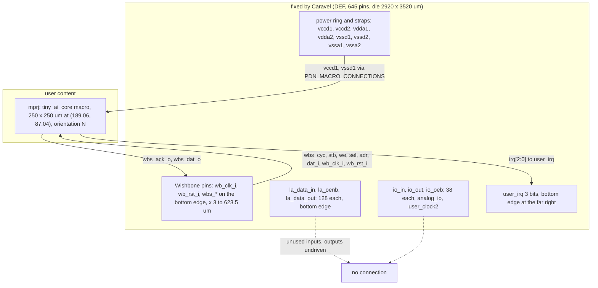
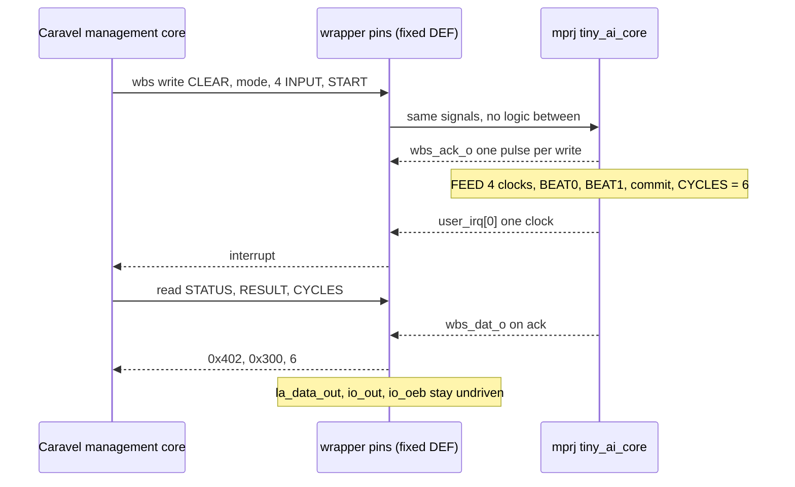
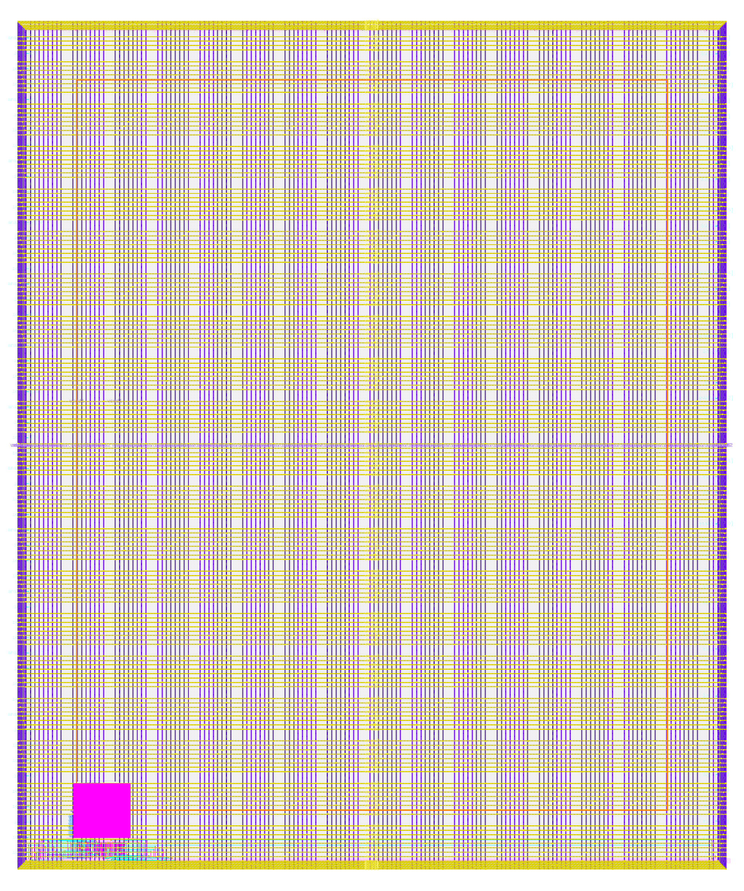

# user_project_wrapper: design notes

## What it is

`user_project_wrapper` is the fixed Caravel (ChipFoundry ChipIgnite template) shell that holds the user's logic. Here it holds exactly one hard macro, `tiny_ai_core`, instantiated as `mprj`, connected port-for-port with no glue logic (`rtl/user_project_wrapper.v`, `README.md`). The port list, the pin geometry (`fixed_dont_change/user_project_wrapper.def`), `signoff.sdc` and the power-ring settings come unchanged from the pinned template commit `b510613cec367828966b37583f9090ac5ddb6491` (`UPSTREAM.txt`); `config.json` is the template's translated from LibreLane 2 to LibreLane 3.0.2 key names with the same values.
It is a wiring and integration exercise, not logic: the flow is "elaborate-only, macro-first" (`SYNTH_ELABORATE_ONLY` true), so `design__instance__count__stdcell` = 0 and the only instance is the macro (`design__instance__count__macros` = 1, 62500 um^2).
Simulation: `make simulate DESIGN=user_project_wrapper` printed `PASS user_project_wrapper_tb: 784 cases, 39956 checks (24060 wishbone transactions; ...)`, the same body as the core's testbench driven through the wrapper's ports.
Hardened result (`output/metrics.json`): Magic and KLayout DRC 0, LVS 0, XOR 0, antenna 0, route DRC 0, max-slew, max-cap and max-fanout 0, worst setup +1.461 ns, worst hold +0.105 ns over all corners.

## Architecture



There are no registers in the wrapper. The "register table" is the list of what is connected:

| Wrapper port group | Width | Connected to | Source |
|---|---|---|---|
| `wb_clk_i`, `wb_rst_i` | 1 + 1 | `mprj` | `rtl/user_project_wrapper.v` |
| `wbs_stb_i`, `wbs_cyc_i`, `wbs_we_i`, `wbs_sel_i`, `wbs_dat_i`, `wbs_adr_i` | 1+1+1+4+32+32 | `mprj` | same |
| `wbs_ack_o`, `wbs_dat_o` | 1 + 32 | from `mprj` | same |
| `user_irq` | 3 | from `mprj.irq` (only bit 0 is used by the core, bits 2:1 are constant 0) | same, core header |
| `la_data_in`, `la_oenb`, `io_in` | 128 + 128 + 38 | unused | header comment of the wrapper |
| `la_data_out`, `io_out`, `io_oeb` | 128 + 38 + 38 = 204 | undriven | `scripts/flow/signoff_allowances.json` |
| `analog_io`, `user_clock2` | 29 + 1 | unused (analog_io stays high-impedance: checked by the testbench) | `README.md`, `tb/user_project_wrapper_tb.v` |
| `vccd1`, `vssd1` | 2 | `mprj` power pins (`PDN_MACRO_CONNECTIONS` "mprj vccd1 vssd1 vccd1 vssd1") | `config.json` |

Configuration that makes it a shell (`config.json`): `SYNTH_ELABORATE_ONLY` true; `RUN_CTS`, `RUN_FILL_INSERTION`, `RUN_TAP_ENDCAP_INSERTION`, `RUN_ANTENNA_REPAIR`, `RUN_IRDROP_REPORT`, `RUN_POST_GPL_DESIGN_REPAIR`, `RUN_POST_CTS_RESIZER_TIMING`, `PDN_ENABLE_RAILS` all false; `PDN_CORE_RING` true; `MAX_TRANSITION_CONSTRAINT` 1.5 and `ERROR_ON_SYNTH_CHECKS` false are the template's wrapper-level values, not changes made here (`UPSTREAM.txt`). The wrapper has no standard cells to repair, no flip-flops to clock and no rows to fill; everything inside the die is the macro and the power grid.

## Data flow

The wrapper is wire only, so a Wishbone run through it is the same as through the core; the difference is where each signal enters. Example: mode 0, inputs `1 1 0 1` (golden `python3 model/tiny_ai/golden.py vision_all_lit 1 1 0 1` gives `beat0=0x00 beat1=0x03 latency=1`; the vector record in `designs/tiny_ai_core/tb/vectors.hex` gives class 0, score 3, CYCLES 6). Values below are derived by hand from `designs/tiny_ai_core/rtl/tiny_ai_core.v`; each bus transaction takes two clock edges in `shared/tb/tiny_ai_wb_tb.vh`.

Software side as seen at the wrapper pins:

| Step | Wrapper pins driven (adr / sel / dat) | `wbs_ack_o` | `user_irq` | Notes |
|---|---|---|---|---|
| CLEAR | 0x3000_0004 / 0010 / 0x0200 | one pulse | 000 | clears DONE, ERROR, count, buffer, RESULT, CYCLES |
| mode | 0x3000_0004 / 0001 / 0x0000 | one pulse | 000 | mode = 0 (vision_all_lit) |
| INPUT x4 | 0x3000_000C / 1111 / 1, 1, 0, 1 | one pulse each | 000 | count 1, 2, 3, 4; buffer 0x00001, 0x00005, 0x00005, 0x00095 |
| START | 0x3000_0004 / 0010 / 0x0100 | one pulse | 000 | accepted because count 4 equals the mode length |

The macro then runs on its own for 6 edges after the accepting edge S (`wb_clk_i` is the only clock; `wbs_*` inputs are idle):

| Edge | Core state after | Engine activity | `wbs_dat_o` | `user_irq` |
|---|---|---|---|---|
| S | FEED | none yet | 0 | 000 |
| S+1 | FEED | item 0 = 1 taken | 0 | 000 |
| S+2 | FEED | item 1 = 1 taken | 0 | 000 |
| S+3 | FEED | item 2 = 0 taken | 0 | 000 |
| S+4 | BEAT0 | item 3 = 1 taken with last; engine to OUT0 | 0 | 000 |
| S+5 | BEAT1 | beat 0 = 0x00 (error 0, class 0) accepted | 0 | 000 |
| S+6 | IDLE | beat 1 = 0x03 accepted; RESULT, CYCLES = 6, DONE committed | 0 | 001 (one clock) |
| S+7 | IDLE | engine back to LOAD | 0 | 000 |

Read side: STATUS poll sees BUSY first, then DONE (`0x00000402`); RESULT read returns `0x00000300` on `wbs_dat_o`, CYCLES returns 6. `wbs_dat_o` is 0 whenever `ack` is low (RTL: `(ack & ~wbs_we_i & in_win) ? ... : 32'd0`).



## Verification

Testbench: `designs/user_project_wrapper/tb/user_project_wrapper_tb.v` drives the wrapper's Caravel ports
(`wb_clk_i`, `wbs_*`, `la_*`, `io_*`, `analog_io`, `user_irq`) and includes the same body as the core,
`shared/tb/tiny_ai_wb_tb.vh`, with the same vectors `designs/tiny_ai_core/tb/vectors.hex` (`-I shared/tb`). So
every core check (results, CYCLES<=16, irq, registers, byte lanes, window decode, protocol errors,
back-to-back runs, reset; `!==` so X never passes; 100,000,000 ns hard timeout; `$fatal` on the first failure)
is now exercised through the wrapper's ports and the `mprj` instance. One extra check: `analog_io` must stay
high impedance (the wrapper must not drive it). An optional RTL-only check (`-DRTL_Z_CHECK`, off by default
and off in gate-level runs) documents that `la_data_out`, `io_out` and `io_oeb` read z.
Fresh `make simulate DESIGN=user_project_wrapper`: `PASS user_project_wrapper_tb: 784 cases, 39956 checks
(24060 wishbone transactions; results, CYCLES<=16, irq, registers, byte lanes, window decode, protocol errors,
back-to-back, reset)` (identical counts to the core's own testbench).

Vectors and model: same 784 golden-model cases as tiny_ai_core (`model/tiny_ai/gen_rom.py` `core_vectors`,
`model/tiny_ai/golden.py`; `golden.py --check` 0 mismatches; `make check-generated` PASS). Nothing in the
wrapper is hand-written.

Gate-level: `scripts/flow/gl_sim.sh` runs the same testbench with the macro's routed netlist inside
(`--netlist-extra build/macros/tiny_ai_core/nl/tiny_ai_core.nl.v`, from `make views`), because the wrapper's
own netlist only instantiates the macro: the gl_sim line reports 0 cells for the wrapper netlist, both
synthesised (`build/gl/user_project_wrapper/runs/gl/final/nl/`) and routed
(`designs/user_project_wrapper/runs/RUN_2026-10-05_19-52-33/final/nl/`). Unit gate delay `#0.01`
(`GL_UNIT_DELAY`). `build/flow/user_project_wrapper/stage_gl_synth.log` and `stage_gl_final.log` both end
`gl_sim: user_project_wrapper PASS`; `build/gl/user_project_wrapper/result.txt`: `user_project_wrapper |
final:user_project_wrapper.nl.v | every case of tb/vectors.hex | PASS | 2 s`; `synth_checks.txt`:
`synthesis__check_error__count = 0`. The commands `make gl DESIGN=user_project_wrapper` and `make gl-final
DESIGN=user_project_wrapper` reproduce it.

Signoff checks that are verification (`scripts/flow/check_signoff.py user_project_wrapper`,
`stage_check.log`): RTL 0 registers, 0 surviving sequential cells, allowance 0 (elaborate-only; the macro's
109 registers are checked in the macro's own run). Yosys driver warnings: the only ones accepted are "is used
but has no driver" on the top-level outputs `io_out`, `io_oeb` and `la_data_out` (204 bits), by the explicit
allowance in `scripts/flow/signoff_allowances.json` (owner decision 2026-10-06: the core has only the Wishbone
bus and the interrupt, the wrapper may hold no glue logic). Any other driver warning still fails. Tapeout
caveat in that file: a floating `io_oeb` leaves the pad output enable undefined. Synthesis check errors 0.

Negative tests: `tests/run_tests.sh` has none for the wrapper itself (its testbench shares the core body,
whose corrupted-class test is described in tiny_ai_core's NOTES); the script only checks that the wrapper
files exist. The README/NOTES record none either.

Not verified yet: a full Caravel simulation with the management firmware (`docs/SOC_PLAN.md`). This testbench
drives the wrapper ports directly, so it does not prove address decode by the real Caravel management core,
the pad configuration, or the behaviour of the unconnected `io_oeb`/`io_out`/`la_data_out`.

## Layout (GDSII)



The picture (`output/layout.png`, KLayout render) shows the whole die: `design__die__bbox` = `0.0 0.0 2920.0 3520.0` (10,278,400 um^2), core `5.52 10.88 2914.1 3508.8` (10,174,000 um^2). Almost all of it is the Caravel power grid: purple vertical straps and yellow horizontal straps, thick bands along every edge (the ring) and a thin orange rectangle inside (what that rectangle is, is not stated in any report). The one other object is the bright magenta square at the lower left: the 250 x 250 um `tiny_ai_core` macro at (189.06, 87.04) um (`config.json`; `README.md` repeats the same coordinates). Instance utilization is 0.00614312 (`design__instance__utilization`): the macro is 0.6 % of the die. The cyan wires at the bottom edge connect the macro's bottom pins to the Wishbone pads.
`UPSTREAM.txt` still contains an older placement note (`mprj` at [59.8, 16.32], macro 400 x 400 um) written before the macro was simplified; `config.json` and `README.md` are current.
Rows: `design__rows` = 1386 in `metrics.json` while `floorplan.txt` says "Added 1286 rows of 6323 site unithd"; I did not reconcile the two.

## From RTL to GDSII: what each step did

### Synthesis (elaboration only)

Yosys only elaborates: `synth_stat.rpt` shows 19 ports, 637 port bits and one cell, `tiny_ai_core` ("Area for cell type tiny_ai_core is unknown!"). `synth_checks.rpt` raised no hard error (`ERROR_ON_SYNTH_CHECKS` false; `synthesis__check_error__count` = 0). Lint: 0 errors, 8 warnings (`design__lint_warning__count`). The lint step uses the macro's powered netlist (`pnl`) because the macro has `vccd1`/`vssd1` ports under `USE_POWER_PINS`.
Report: [synth_stat.rpt](output/reports/synth_stat.rpt), [synth_checks.rpt](output/reports/synth_checks.rpt).

### Floorplan and macro placement

The die is fixed at 2920 x 3520 um by the template DEF (`FP_DEF_TEMPLATE`), which supplies all 645 pins (`PINS 645` in the DEF, `design__io` = 645). OpenROAD reports core area 10173980.154 um^2, instance area 62500 um^2, effective utilization 0.006 with 1 instance (`floorplan.txt`). The macro is placed by `MACROS.tiny_ai_core.instances.mprj.location` = (189.06, 87.04), orientation N. Its power pins are tied by `PDN_MACRO_CONNECTIONS`.
Report: [floorplan.txt](output/reports/floorplan.txt).

### Placement

Nothing is placed besides the macro: `design__instance__displacement__total` = 0 and the cell count is 1 (`cell_usage.rpt`: `tiny_ai_core` 1, area 62500). Reports: [placement_global.txt](output/reports/placement_global.txt), [placement_detailed.txt](output/reports/placement_detailed.txt).

### Clock tree

Not run (`RUN_CTS` false). The macro carries its own tree: 31 buffers and 109 sinks in `designs/tiny_ai_core/output/reports/cts.rpt`. The wrapper's clock is just the `wb_clk_i` wire.

### Routing

Global routing: wire length 30049 um, final usage 0.05 %, overflow 0 / 0 / 0 (`routing_global.txt`); `global_route__vias` = 241. Detailed routing: `route__wirelength` = 28365 um, 224 vias (all single-cut), 637 routed nets plus 8 special nets, `route__drc_errors` = 0, longest net 2589.12 um (`route__wirelength__max`). That long net is consistent with the interrupt: the DEF puts `user_irq` at x 2905 to 2917 um (`UPSTREAM.txt`) while the macro is at x 189 to 439 um (my inference; the net is not named in a report). Warnings: `GRT-0036` 637, `GRT-0041` 1001, `DRT-0349` 10 (LEF58 enclosure rules not supported; same warning as in the core).
Reports: [routing_global.txt](output/reports/routing_global.txt), [routing_detailed.txt](output/reports/routing_detailed.txt).

### Timing

Worst slack in `timing_summary.rpt`: setup +1.4611 ns (max_ss_100C_1v60), hold +0.1051 ns (min_ff_n40C_1v95); 0 violations in all 9 corners. These match the macro's own numbers (core: +1.4561 and +0.1051), because the only paths are the macro's. The wrapper uses the macro's `.lib` per corner (`MACROS.lib`: tt, ss and ff mapped to `nom_tt_025C_1v80`, `nom_ss_100C_1v60`, `nom_ff_n40C_1v95`) and its SPEF for `min_*`, `nom_*`, `max_*`. Unannotated nets: 339 (`timing__unannotated_net__count`), 0 after filtering.
Reports: [timing_summary.rpt](output/reports/timing_summary.rpt), [timing_paths_max_ss.rpt](output/reports/timing_paths_max_ss.rpt), [timing_paths_min_ff.rpt](output/reports/timing_paths_min_ff.rpt).

### DRC

Magic DRC and KLayout DRC both 0 (`magic__drc_error__count`, `klayout__drc_error__count`); `magic__illegal_overlap__count` 0; XOR (GDS versus the flow's layout) 0. `manufacturability.rpt`: DRC Passed.
Reports: [drc_magic.rpt](output/reports/drc_magic.rpt), [drc_klayout.json](output/reports/drc_klayout.json), [manufacturability.rpt](output/reports/manufacturability.rpt).

### LVS

`lvs_netgen.rpt` ends "Cell pin lists are equivalent. Device classes user_project_wrapper and user_project_wrapper are equivalent. Final result: Circuits match uniquely." All `design__lvs_*` counts are 0; `manufacturability.rpt`: LVS Passed. The 204 undriven outputs and the unused inputs still show as pins on both sides, so the circuits match.
Report: [lvs_netgen.rpt](output/reports/lvs_netgen.rpt).

### Power and IR drop

`power__total` = 4.70e-04 W (internal 3.51e-04, switching 1.19e-04, leakage 5.5e-08), taken from the macro's library. `RUN_IRDROP_REPORT` is false, so there is no IR-drop report; the power grid check reports 0 violations on all 8 nets (`design__power_grid_violation__count`; one `PDN-0239` flow warning).

### Antenna, slew, capacitance

Antenna: 0 violating nets and pins (`RUN_ANTENNA_REPAIR` false, nothing inserted). Max slew, max cap, max fanout: 0 in every corner. Critical disconnected pins: 0, but `design__disconnected_pin__count` = 534 (unused inputs and undriven outputs; the split is not reported).
Reports: [manufacturability.rpt](output/reports/manufacturability.rpt), [cell_usage.rpt](output/reports/cell_usage.rpt).

## Run time and memory

From `output/resources.json` (profile "tight": 2 CPUs, 8 GB limit, exit code 0): total wall time 53 s; container peak memory 670,240,768 bytes (0.624 GB); peak per-step RSS 557,842,432 bytes (step 58, KLayout DRC). 69 steps.
Slowest steps:

| Step | Wall time (s) |
|---|---|
| 58-klayout-drc | 9.57 |
| 61-magic-spiceextraction | 5.339 |
| 49-openroad-stapostpnr | 4.628 |

(`57-magic-drc` 4.474 s and `55-klayout-xor` 2.942 s follow.)

## Reproduce

```bash
make simulate DESIGN=user_project_wrapper    # wrapper-level RTL simulation, 784 cases
make views DESIGN=tiny_ai_core               # export the hardened macro views into build/macros/tiny_ai_core/
make flow-all DESIGN=user_project_wrapper    # LibreLane 3.0.2 wrapper flow (elaborate-only, macro-first)
```

`lvs_config.json` is only for the later ChipFoundry precheck; LibreLane does not read it. The Docker flow was not run for this document; physical numbers come from the checked-in `output/` files. Not done (`README.md`): GPIO startup modes for pads 5 to 37 (`rtl/user_defines.v` is the template's), full-Caravel simulation with management firmware, the ChipFoundry precheck.

## Intuitions and insights

**What a Caravel wrapper is.** It is a die of fixed size (2920 x 3520 um), with a fixed pin list (645 pins in the DEF, from the template), a fixed power ring and a ring of straps, in which a user places their macros. The user may not change any of it (`config.json` section `//6`: "You should NOT edit this section"). The wrapper contributes no logic: 0 standard cells, 1 macro, 0.6 % utilization. The work of "hardening" it is integration: connect nets, connect power, prove nothing broke.

**Why macro placement and pin order decide routability.** The wrapper's Wishbone pads sit in a row on the bottom edge (x 3 to 623.5 um). The first macro had 361 pins on its own bottom edge, only 16 um above that pad row, and global routing failed on congestion (`README.md` step 2). The fix was not a router setting: the macro was simplified to 109 pins, all on its bottom edge in the same left-to-right order as the pads, and placed at (189.06, 87.04) so wires are short and do not cross. Result: overflow 0, 0.05 % usage (`routing_global.txt`). The lesson is that the pin order of the macro is part of the wrapper's floorplan.

**One long net, and why it does not matter here.** The longest wrapper net is 2589.12 um (`route__wirelength__max`) against 222.33 um in the core. It is probably the interrupt, whose pin sits at the far right of the bottom edge (x 2905 to 2917 um in `UPSTREAM.txt`). That is my reading of the geometry, not a named net in a report. An interrupt pulse of one 25 ns clock period has plenty of timing slack (worst setup +1.461 ns against a 25 ns period, with the core SDC's 0.7 ns `irq` output delay), so the wire is long but harmless.

**Why unpowered router diodes broke LVS.** In an earlier attempt the router added 40 antenna diodes to the wrapper; they were not connected to power, giving 70 LVS errors and an nwell DRC error (`README.md` step 3). The configuration is consistent with the explanation: the wrapper has `PDN_ENABLE_RAILS`, `RUN_TAP_ENDCAP_INSERTION` and `RUN_ANTENNA_REPAIR` all false, so there are no standard-cell rails or taps at wrapper level to feed such cells. The README does not spell out the mechanism; this is my inference. The cure is upstream: the macro was rehardened with the Caravel SDC and short wires so that the router no longer needed diodes (`antenna__violating__nets` = 0, nothing inserted).

**Why the macro's power pins need the powered netlist for lint.** The RTL wrapper connects `vccd1`/`vssd1` to the macro under `USE_POWER_PINS`; the plain netlist `nl` is presumably without those ports (my reading). LibreLane lints the wrapper with power pins defined, so it needs the powered netlist `pnl` or it reports port mismatches (`README.md` step 1). `config.json` now lists both `nl` and `pnl` for the macro.

**What "0 std cells" means.** `design__instance__count__stdcell` = 0 and `design__instance__area__stdcell` = 0: the netlist contains one macro and nothing else, because the flow is elaborate-only and the template turns off CTS, fill, taps, repair and IR-drop. So metrics such as cell counts, buffer counts and the 0.00614 utilization say nothing about the design's size. The macro's numbers (1809 standard cells, 109 flip-flops, in `designs/tiny_ai_core/output/metrics.json`) are the ones to read.

**What "MAX_TRANSITION 1.5" means, and why wrapper slew 0 is not the same win as it looks.** `MAX_TRANSITION_CONSTRAINT` 1.5 ns is the template's wrapper-level limit; the macro was hardened against 0.75 ns (core `floorplan.txt`: "Setting maximum transition to: 0.75"). The Caravel input transitions in the macro SDC are 0.84 ns (`wbs_dat_i`) and 0.92 ns (`wbs_adr_i`): above 0.75 (195 violations in the core), below 1.5 (0 in the wrapper). The wrapper has no standard cells of its own, so the 0 is partly the looser limit and partly absence of cells to violate. The core's count is the one that records the tight constraint, and the open owner decision in `SPEC.md` is exactly about counting it.

**The 204 undriven outputs, electrically.** Outputs `la_data_out` (128), `io_out` (38) and `io_oeb` (38) are left unconnected, 204 in all (`scripts/flow/signoff_allowances.json` lists the three names; Yosys driver warnings are accepted only on exactly those ports). In RTL simulation they are high-impedance z (the testbench checks that under `RTL_Z_CHECK`). In silicon an undriven `io_oeb` leaves each user pad's output enable undefined: a pad could drive against its pin. Before tapeout either drive `io_oeb` high (inputs) from the macro and `io_out`/`la_data_out` low, or configure every user GPIO as an input in `user_defines.v` (which is still the template's, so pads 5 to 37 are not set). That is a decision for the owner, recorded as open in `SPEC.md`.

**Five fixes in order, one cause each.** The path to clean (`README.md`): lint needed `pnl`; congestion needed a simpler macro and better placement (361 to 109 pins); hold -0.894 and the diode problem needed the Caravel macro SDC; the macro build ran out of memory with a 70 % slew margin, so 20 % was used; signoff flagged the 204 undriven outputs, accepted explicitly. Each fix moved work from the wrapper into the macro or its constraints, never into relaxing a limit. `README.md` at the repository root still says 40 % margins reached 0 slew in one place and 20 % giving 195 in another; the config comment (20 %) and metrics (195) are the current state.

**What full-Caravel simulation would add.** The testbench here drives the wrapper ports directly with a clean Wishbone master. A full-Caravel run would bring the RISC-V management core and its firmware as the Wishbone master, the real bus timing and arbitration with other peripherals, reset and clock sequencing, the GPIO startup configuration in `user_defines.v`, and the padring behaviour including the floating `io_oeb`. It would show whether firmware can run the CLEAR, mode, INPUT, START, poll sequence and see the interrupt. It is not done (`README.md`); the exhaustive 784-case check stays at wrapper level because a full-chip run is too slow for that (`SPEC.md` risks table).
