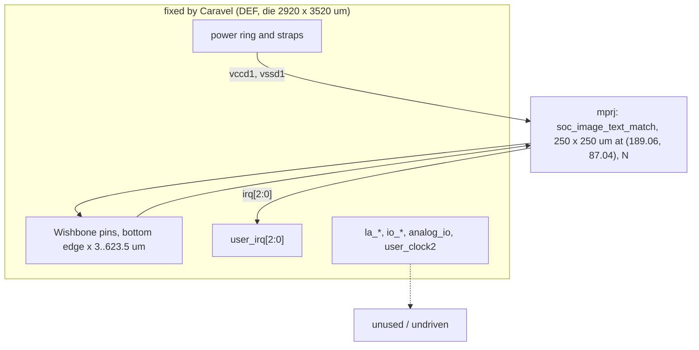
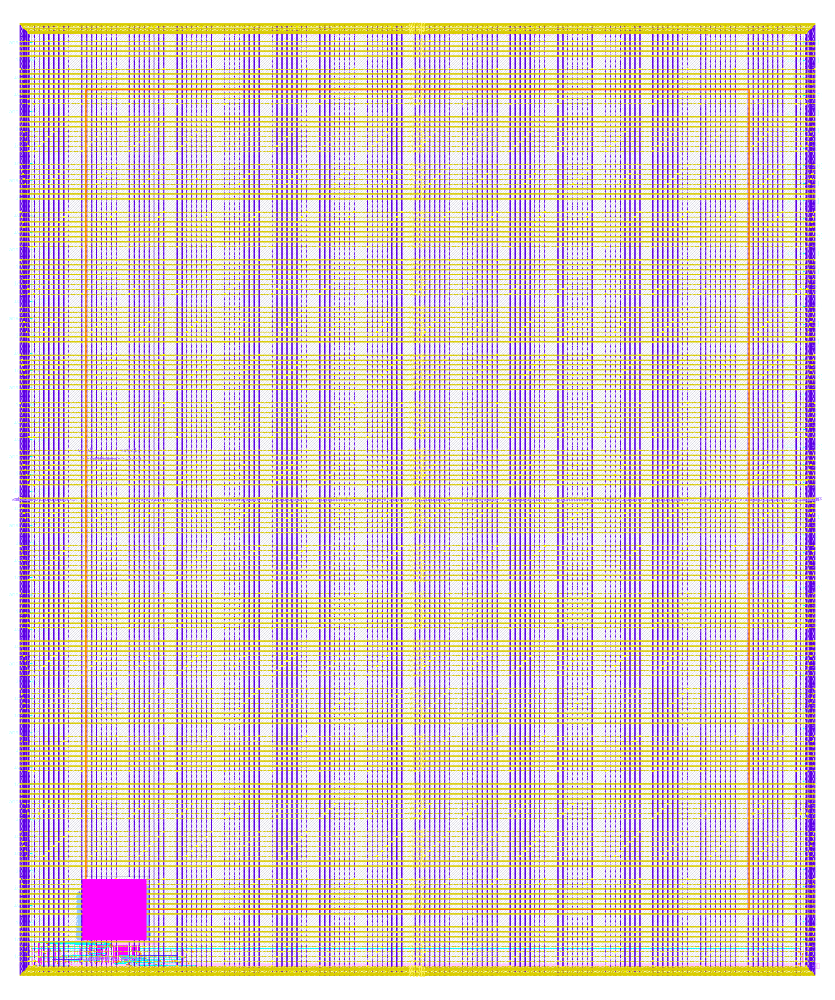

# user_project_wrapper_soc_itm: design notes

## What it is

The second "one build per experiment" Caravel wrapper (`docs/SOC_PLAN.md`): the same fixed `user_project_wrapper` shell as `designs/user_project_wrapper`, but the single macro `mprj` is `soc_image_text_match` (Wishbone adapter + image_text_match engine, register map in `designs/soc_image_text_match/README.md`) instead of `tiny_ai_core`. Module name stays `user_project_wrapper` (Caravel requires it); the port list is byte-identical to the template; no glue logic. Pin list and footprint of the macro match tiny_ai_core's (109 pins, 250 x 250 um, same pin order), so `config.json` differs from the tiny_ai_core wrapper only in the macro name/paths. `UPSTREAM.txt` lists what was copied and changed.
Result (`output/metrics.json`): Magic and KLayout DRC 0, LVS 0, XOR 0, antenna 0, route DRC 0, max-slew/cap/fanout 0, worst setup +2.965 ns (max_ss_100C_1v60), worst hold +0.110 ns (min_ff_n40C_1v95). Testbench `PASS user_project_wrapper_soc_itm_tb: 2079 cases ... 50947 checks` on RTL, synthesised and routed wrapper netlists (macro netlist inside).

## Architecture

Same connection table as the tiny_ai_core wrapper: wb_clk_i, wb_rst_i, wbs_* to/from `mprj`; `irq` to `user_irq` (here all three bits are meaningful to the adapter's interrupt map, bits 2:1 read 0 in the testbench); la_data_in, la_oenb, io_in unused; la_data_out, io_out, io_oeb (204 bits) undriven (accepted in `scripts/flow/signoff_allowances.json`); analog_io, user_clock2 unused. No registers in the wrapper.

## Data flow

Identical to the tiny_ai_core wrapper at the pins: a Wishbone write at 0x3000_xxxx enters on `wbs_*`, the macro answers with one `wbs_ack_o` pulse, results come back on `wbs_dat_o`, completion on `user_irq[0]`. What differs is behaviour inside the macro: TXDATA/TXLAST beats feed the engine, RXDATA is read twice for the two result beats, STATUS/RXSTATUS expose DONE (register map: `designs/soc_image_text_match/README.md`). The wrapper adds nothing and removes nothing between pad and macro.

## Verification

`tb/user_project_wrapper_soc_itm_tb.v` instantiates `user_project_wrapper` by ports only (analog_io unconnected, user_clock2 low, la/io inputs tied, user_irq -> irq) and contains the body of `designs/soc_image_text_match/tb/soc_image_text_match_tb.v`, run with `+VEC=tb/vectors.hex` (a copy of the macro's vectors, 2,079 cases): results, m_last, CYCLES range, irq pulse per case, DONE polling, ID/CAPS/CTRL, unmapped reads, ack one clock wide, CLEAR and reset mid-frame; `!==` so X never passes. Results: RTL `simulate` PASS in 1 s (2079 cases, 50947 checks); gl_synth PASS 10 s; gl_final PASS 8 s (`gl_sim: ... PASS`), with the macro's routed netlist from `build/macros/soc_image_text_match/nl/` added by the Makefile through MACROS (the wrapper netlists themselves contain 0 std cells). `defines.v` is compiled first at gate level (`--pre`).
`check_signoff.py`: PASS (RTL 0 registers, 0 surviving cells; 204 undriven outputs accepted by the allowance; slew/cap 0). Not verified: full Caravel simulation with management firmware, real pad configuration, behaviour of the floating io_oeb (tapeout caveat as for the tiny_ai_core wrapper). The tiny_ai_core wrapper's extra analog_io-is-z check was not carried over (analog_io is left unconnected in this testbench).

## Layout (GDSII)

Die 2920 x 3520 um (10,278,400 um^2), same as tiny_ai_core's wrapper; almost all of it is the Caravel power grid, plus the one 250 x 250 um macro at (189.06, 87.04) um (62,500 um^2, utilization 0.00614, identical to the tiny_ai_core wrapper because the footprint is identical). Wires from the macro's bottom pins to the Wishbone pads sit at the bottom edge.

## From RTL to GDSII: what each step did

### Synthesis
Elaboration only (`SYNTH_ELABORATE_ONLY`): one cell, `soc_image_text_match`, 0 standard cells. Lint 0 errors, 8 warnings (same count as the tiny_ai_core wrapper), using the macro's powered netlist (`pnl`). Synth check errors 0. [synth_stat.rpt](output/reports/synth_stat.rpt)

### Floorplan
Fixed die and pin positions from the template DEF; the macro placed manually at (189.06, 87.04), N. [floorplan.txt](output/reports/floorplan.txt)

### Placement
Nothing to place besides the macro (global placement runs on zero standard cells; instance utilization from macro only). [placement_global.txt](output/reports/placement_global.txt)

### Clock tree
Not run (`RUN_CTS` false): the wrapper has no flip-flops; the macro's own clock tree is inside the macro. `wb_clk_i` goes straight to the macro pin.

### Routing
637 nets, 8 special. Global route wirelength 30049 um; detailed route wirelength 28359 um, 222 vias, route DRC errors per iteration 50, 5, 0 (tiny_ai_core wrapper: 51, 6, 1, 0). Maximum wire length 2589 um (the same, set by the fixed pad positions). [routing_detailed.txt](output/reports/routing_detailed.txt)

### Timing
No violations at any of the 9 corners. Worst setup per corner is +2.96 to +9.17 ns, worst hold +0.110 ns (min_ff_n40C_1v95). Versus the tiny_ai_core wrapper (setup +1.461, hold +0.105 ns): setup is better by 1.5 ns and hold similar. Both are set mostly by the Caravel input/output delays in `signoff.sdc` against the macro's liberty timing on the Wishbone pins, so the number mostly reflects how the macro was hardened (its pin timing arcs), not the wrapper. [timing_summary.rpt](output/reports/timing_summary.rpt)

### DRC
Magic 0 and KLayout 0 (`magic__drc_error__count`, `klayout__drc_error__count`). [drc_magic.rpt](output/reports/drc_magic.rpt)

### LVS
0 differences, 0 unmatched devices/nets/pins. [lvs_netgen.rpt](output/reports/lvs_netgen.rpt)

### Power
Total power reported 2.46 mW, almost all "internal" of the macro in the reported corner; leakage 6e-8 W. The wrapper has no cells of its own; real power is the macro's.

### Antenna
0 violating nets/pins, 0 route antenna violations (`RUN_ANTENNA_REPAIR` false, nothing inserted, so no unpowered diodes as in the tiny_ai_core wrapper's attempt 3).

## Run time and memory

`make flow-all DESIGN=user_project_wrapper_soc_itm`: simulate 1 s, gds 59 s (peak 0.8 GB, profile tight: 2 CPUs, 8 GB), check 1 s, gl_synth 10 s, gl_final 8 s, collect 4 s; total 83 s. (tiny_ai_core wrapper: 53 s, 0.62 GB.) A first attempt had gl_final fail only because `UPSTREAM.txt` was edited after the run started (it counts as a flow input), so the run was repeated; no design problem.

## Reproduce

    make views DESIGN=soc_image_text_match
    make flow-all DESIGN=user_project_wrapper_soc_itm

Needs the allowance entry for `user_project_wrapper_soc_itm` in `scripts/flow/signoff_allowances.json` (present).

## Intuitions and insights

- Same wrapper, different macro: if the macro keeps the same pin count, order and footprint, the wrapper is a copy with one instance name changed, and the whole flow (placement, PDN crossing, routing) repeats almost identically (same die utilization, same max wire length, route DRC converges one iteration sooner).
- The macro views are the interface: everything that differs in the result (timing margin) comes from the macro's liberty/SPEF, not from the wrapper.
- Editing any non-.md file in the design directory (e.g. UPSTREAM.txt) after a run makes the run "not current" for the gl-final step; documentation .md files are exempt.
- The 204 undriven outputs are a learning-build shortcut shared with the tiny_ai_core wrapper; drive io_oeb before tapeout.
