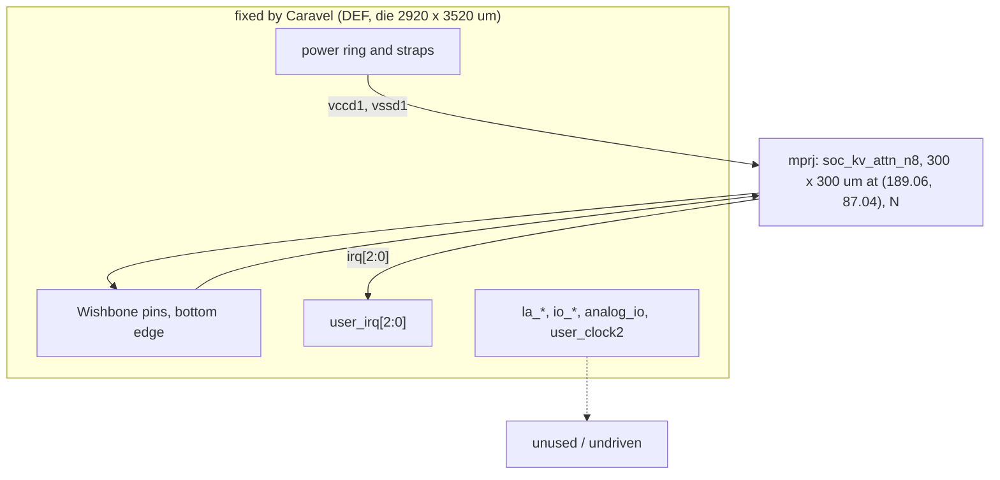
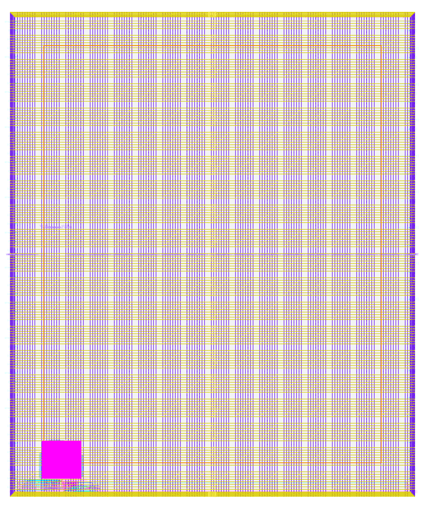

# user_project_wrapper_soc_kv: design notes

## What it is

The third "one build per experiment" Caravel wrapper (`docs/SOC_PLAN.md`, `UPSTREAM.txt`): the fixed `user_project_wrapper` shell of `designs/user_project_wrapper`, with a single macro `mprj` = `soc_kv_attn_n8` (`shared/rtl/wb_stream_adapter.v` + the `kv_attn_n8` KV-cache attention engine, `designs/soc_kv_attn_n8/rtl/soc_kv_attn_n8.v`). Module name stays `user_project_wrapper` (Caravel requires it), the port list is the template's, and the body is one instance with no glue logic. The macro keeps the 109-pin interface (Wishbone slave, `irq[2:0]`) and the S-edge pin order of tiny_ai_core and soc_image_text_match, but it is larger: 300 x 300 um (`designs/soc_kv_attn_n8/output/metrics.json` `design__die__bbox` 0 0 300 300; the 250 um die was ruled out as about 75 percent dense by the `//DIE_AREA` estimate in `designs/soc_kv_attn_n8/config.json`), where the soc_itm and tiny_ai_core macros are 250 x 250 um. It is placed at (189.06, 87.04) N like the others, so it covers x 189.06..489.06, y 87.04..387.04 (`config.json` MACROS `instances`, my addition of 300).
Result (`output/metrics.json`): Magic and KLayout DRC 0, LVS 0, XOR 0, antenna 0, route DRC 0, max-slew/cap/fanout 0, power-grid violations 0, worst setup +1.448 ns (max_ss_100C_1v60), worst hold +0.105 ns (min_ff_n40C_1v95) (`output/reports/timing_summary.rpt`). Testbench `PASS user_project_wrapper_soc_kv_tb: 1521 records ... 31647 checks` on RTL, the synthesised and the routed wrapper netlists (`build/flow/user_project_wrapper_soc_kv/stage_simulate.log`, `stage_gl_synth.log`, `stage_gl_final.log`).

## Architecture

Connections as in the other wrappers: `wb_clk_i`, `wb_rst_i`, `wbs_*` to/from `mprj`; `irq` to `user_irq`; la_data_in, la_oenb, io_in unused; la_data_out, io_out, io_oeb (204 bits) undriven and accepted in `scripts/flow/signoff_allowances.json` (key `user_project_wrapper_soc_kv`); analog_io, user_clock2 unused. No registers in the wrapper: `check_signoff.py` says "registers: RTL 0 (allowance 0), surviving sequential cells 0" (`build/flow/user_project_wrapper_soc_kv/stage_check.log`). The macro's own 570 sequential cells and 4514 std cells are inside it (`designs/soc_kv_attn_n8/output/metrics.json`: `design__instance__count__class:sequential_cell`, `design__instance__count__stdcell`).

## Data flow

Identical to the other wrappers at the pins: a Wishbone write at 0x3000_xxxx enters on `wbs_*`, the macro answers with one `wbs_ack_o` pulse per access, results come back on `wbs_dat_o`, completion on `user_irq[0]`. Inside the macro the adapter FIFOs carry KV-attention command frames (TXDATA/TXLAST) and response beats (RXDATA), CYCLES reports the engine latency (`designs/soc_kv_attn_n8/rtl/soc_kv_attn_n8.v` header, `firmware/kv/main.c` register offsets, `model/kv_attention/spec.md`). The wrapper adds nothing and removes nothing between pad and macro. Per-edge replay of an attention command is not repeated here (macro-level behaviour; see `designs/kv_attn_n8/NOTES.md`).

## Verification

`tb/user_project_wrapper_soc_kv_tb.v` instantiates `user_project_wrapper` by ports only (analog_io unconnected, user_clock2 low, la/io inputs tied, `user_irq` to `irq`) and holds the body of `designs/soc_kv_attn_n8/tb/soc_kv_attn_n8_tb.v`, run with `+VEC=tb/vectors.hex` (a copy of `designs/kv_attn_n8/tb/vectors.hex`, `UPSTREAM.txt`). It runs all 1521 records: 1515 commands with every response beat, `m_last`, CYCLES and one irq pulse each, 6 CLEARs of which 2 with a response pending, plus registers (ID, CAPS, CTRL, unmapped reads, ack one clock wide, irq[2:1] = 0), with `!==` so X never passes. Results (stage logs in `build/flow/user_project_wrapper_soc_kv/`): RTL `simulate` PASS, 31647 checks; gl_synth PASS 8 s (netlist 0 cells, `stage_gl_synth.log`); gl_final PASS 6 s (routed netlist 0 cells; the macro netlist from `build/macros/soc_kv_attn_n8/nl/` is added through MACROS). `defines.v` is compiled first (`--pre`). The vectors contain negative cases for the engine (CLEAR mid-frame and with a response pending); there are no negative tests of the wrapper itself (it has no logic).
`check_signoff.py`: PASS (`stage_check.log`: 0 RTL registers, 204 undriven outputs accepted, slew/cap 0). The macro views come from `build/macros/soc_kv_attn_n8/SOURCE.txt` (macro run `RUN_2026-10-06_08-09-32`, sha256 of every view listed there). Not verified: full Caravel simulation with management firmware on this wrapper (see the last section), real pad configuration, behaviour of the floating io_oeb.

## Layout (GDSII)

Die 2920 x 3520 um (`design__die__area` 10,278,400 um^2), core bbox 5.52 10.88 2914.1 3508.8 (`design__core__bbox`); the one macro is 300 x 300 um = 90,000 um^2 (`design__instance__area__macros`), instance utilization 0.0088461 (`design__instance__utilization`; 0.00614312 for the 250 um wrappers: 62,500 um^2). Placement x 189.06..489.06, y 87.04..387.04, directly above the Wishbone pads, which sit at the bottom edge, as in the other wrappers. The macro's 109 pins are on its S edge, so the wires from pads to pins are short.

## From RTL to GDSII: what each step did

### Synthesis
Elaboration only (`SYNTH_ELABORATE_ONLY`): one cell, `soc_kv_attn_n8`, area unknown to yosys, 0 standard cells (`design__instance__count__stdcell` 0). Lint 0 errors, 8 warnings (`design__lint_error__count`, `design__lint_warning__count`; the same 8 as the soc_itm wrapper), run against the macro's powered netlist (`pnl`). Synth check errors 0 (`synthesis__check_error__count`). [synth_stat.rpt](output/reports/synth_stat.rpt), [synth_checks.rpt](output/reports/synth_checks.rpt)

### Floorplan
Fixed die and pin positions from the template DEF; the macro placed manually at (189.06, 87.04), N. [floorplan.txt](output/reports/floorplan.txt)

### Placement
Nothing to place besides the macro (global placement: "All instances are FIXED/FIRM. No need to perform global placement", `runs/RUN_2026-10-06_08-13-27/*globalplacement/` log). [placement_global.txt](output/reports/placement_global.txt)

PDN: the Caravel met5 straps are horizontal, 3.1 um wide, 18.6 um apart per net, groups every 180 um (`config.json` `PDN_HPITCH` 180, `PDN_HOFFSET` 5). The wrapper-build skill's calculation puts group k=1 at y 195.88 .. 344.68 (estimate: first strap 15.88 + 180). I read the strap centres from the final DEF (`runs/RUN_2026-10-06_08-13-27/final/def/user_project_wrapper.def`, SPECIALNETS met5, my extraction): vccd1 at y 195.88 and 375.88, vssd1 at 214.48 (and 394.48), vccd2 233.08, vssd2 251.68, and vdda1/vssa1/vdda2/vssa2 at 90.28..146.08 and 270.28..326.08. All eight nets of group k=1 (195.88 .. 326.08, the last one 326.08 plus half width below 387.04) lie fully inside the macro span y 87.04..387.04. The 300 um macro also swallows four straps of group k=0 and vccd1 of group k=2 at 375.88; vssd1 at 394.48 is 7.4 um above the macro top (my subtraction). So vccd1 is crossed at y 195.88 and 375.88 and vssd1 at y 214.48 only, versus the 250 um macros where only group k=1 (vccd1 at 195.88, vssd1 at 214.48) is crossed. PDN step results: `PSM-0040 All shapes on net ... are connected` for all eight nets, `design__power_grid_violation__count` 0, LVS clean. New in this run: four `PDN-0110 No via inserted between met4 and met5` warnings (`flow__warnings__count:PDN-0110` 4: two on vdda1 at (263.37, 88.73), two on vccd1 at (210.10, 374.33) and (363.70, 374.33)); the soc_itm and tiny_ai_core wrappers have none (`metrics.json` of each). They sit at the macro's top and bottom edges, I did not look at them in the layout, and LVS and the power-grid check pass.

### Clock tree
Not run (`RUN_CTS` false): the wrapper has no flip-flops; the macro's own clock tree (387 clock buffers, 15 clock inverters, `designs/soc_kv_attn_n8/output/metrics.json` `design__instance__count__class:clock_buffer`) is inside the macro. `wb_clk_i` goes straight to the macro pin.

### Routing
637 nets, 8 special. Global route wirelength 28738 um (`global_route__wirelength`); detailed route wirelength 27069 um, 224 vias, route DRC errors per iteration 63, 6, 3, 0 (soc_itm: 50, 5, 0; tiny_ai_core: 51, 6, 1, 0); maximum wire length 2540.12 um (`route__wirelength__max`; soc_itm 2589.12). The wire lengths are set by the fixed pad positions on the bottom edge and the macro pin positions, not by the macro size; one more detail-route iteration than soc_itm. [routing_global.txt](output/reports/routing_global.txt), [routing_detailed.txt](output/reports/routing_detailed.txt)

### Timing
No violations at any of the 9 corners (`timing__setup_vio__count` 0, `timing__hold_vio__count` 0). Worst setup per corner is +1.448 (max_ss_100C_1v60) to +8.302 ns (min_ff), worst hold +0.1048 ns (min_ff_n40C_1v95) (`timing_summary.rpt`). Comparison:

| | worst setup (max_ss) | worst hold (min_ff) | source |
|---|---|---|---|
| soc_kv wrapper | +1.4481 ns | +0.1048 ns | `output/reports/timing_summary.rpt` |
| soc_kv_attn_n8 macro alone | +1.4424 ns | +0.1048 ns | `designs/soc_kv_attn_n8/output/reports/timing_summary.rpt` |
| soc_itm wrapper | +2.965 ns | +0.110 ns | `designs/user_project_wrapper_soc_itm/NOTES.md` |
| tiny_ai_core wrapper | +1.461 ns | +0.105 ns | `.claude/skills/wrapper-build/SKILL.md` section 6 |

The wrapper adds almost nothing: +1.4481 against the macro's +1.4424 is 0.0057 ns apart (my subtraction), and the hold numbers are equal to four digits. The soc_itm wrapper shows the same pattern (wrapper +2.965 against the soc_image_text_match macro's +2.956, `designs/soc_image_text_match/output/reports/timing_paths_max_ss.rpt`). The reason is geometric: the 109 pins are on the macro's S edge directly above the pad row, so the wrapper contributes only short pad-to-pin wires. Worst setup path in both reports is the same (`output/reports/timing_paths_max_ss.rpt`, `designs/soc_kv_attn_n8/runs/RUN_2026-10-06_08-09-32/56-openroad-stapostpnr/max_ss_100C_1v60/max.rpt`): startpoint `wb_rst_i` (input port), endpoint `mprj/_3048_` (a `dfxtp_2` flip-flop), input external delay 12.5 ns (`signoff.sdc`: `set_input_delay [expr $::env(CLOCK_PERIOD) * 0.5] ... wb_rst_i`), data arrival 29.571 ns, so about 11.5 ns of data delay after the port (my subtraction from 18.070). That delay is the macro's reset network: `wb_rst_i` goes through a chain of `clkdlybuf4s25_1` fan-out buffers (about 0.4 to 1.1 ns each), nor2, nand2, or3, buf_1, a mux2 and a `dlygate4sd3_1` hold buffer before reaching the flop D pin. So the margin is set inside the macro by how `wb_rst_i` fans out to its registers against the Caravel 12.5 ns input delay; the wrapper changes only the wire at the port (input pin cap 0.047 pF on the wrapper path versus 0.007 pF in the macro-alone report). The soc_itm macro's worst path was an address input (`wbs_adr_i[18]`), not reset, and I did not check its `wb_rst_i` slack, so I cannot say how much worse the reset path is than in the smaller macro; the larger macro has 570 flip-flops to reach. Worst hold is register to register inside the macro (`mprj/_3246_` to `mprj/_3238_`, +0.104768 ns, `timing_paths_min_ff.rpt`) with the SDC clock latency range 4.65 to 5.57 ns applied; the same value as the macro alone. Neither number depends on the wrapper. [timing_summary.rpt](output/reports/timing_summary.rpt), [timing_paths_max_ss.rpt](output/reports/timing_paths_max_ss.rpt), [timing_paths_min_ff.rpt](output/reports/timing_paths_min_ff.rpt)

### DRC
Magic 0 and KLayout 0 (`magic__drc_error__count`, `klayout__drc_error__count`; `drc_magic.rpt` COUNT 0), XOR 0 (`design__xor_difference__count`). [drc_magic.rpt](output/reports/drc_magic.rpt), [drc_klayout.json](output/reports/drc_klayout.json)

### LVS
0 differences, 0 unmatched devices/nets/pins (`design__lvs_*` keys); `lvs_netgen.rpt`: "Final result: Circuits match uniquely." [lvs_netgen.rpt](output/reports/lvs_netgen.rpt)

### Power
`power__total` 3.64 mW (internal 2.78 mW, switching 0.86 mW, leakage 9.0e-8 W, `metrics.json`); the same as the macro alone (`designs/soc_kv_attn_n8/output/metrics.json` `power__total` 0.0036387 W), i.e. all of it is the macro's. The soc_itm wrapper reports 2.46 mW. Unlike the macro's own run, no IR-drop report is run in the wrapper (`RUN_IRDROP_REPORT` false).

### Antenna
0 violating nets/pins, 0 route antenna violations (`antenna__violating__nets`, `route__antenna_violation__count`); `RUN_ANTENNA_REPAIR` is false in the wrapper, so no unpowered diodes are added (the input-port diodes, 48 antenna cells, are inside the macro: `designs/soc_kv_attn_n8/output/metrics.json` `design__instance__count__class:antenna_cell`). Max slew/cap/fanout violations 0 in every corner (`metrics.json`); the macro alone reports 836 max-slew entries at max_ss in its own summary (`designs/soc_kv_attn_n8/output/reports/timing_summary.rpt`, with its 0.75 ns default limit) but the wrapper uses `MAX_TRANSITION_CONSTRAINT` 1.5 and the macro-pin slews seen by the wrapper count 0; I did not trace the difference. Slew is therefore not classified here.

## Run time and memory

`make flow-all DESIGN=user_project_wrapper_soc_kv` (`build/flow_user_project_wrapper_soc_kv.log`): simulate 1 s, gds 1 s (the stage reused the finished run, `stage_gds.log`: "REUSED ... no flow run"; the real flow took `wall_s_total` 76 s in `output/resources.json`, peak 0.954 GB, profile tight: 2 CPUs, 8 GB), check 0 s, gl_synth 8 s, gl_final 6 s, collect 4 s. Per-experiment cost, from each design's `output/resources.json` `wall_s_total` and `container_peak_mem_gb`:

| wrapper | macro | flow wall | peak memory |
|---|---|---|---|
| user_project_wrapper | tiny_ai_core | 59 s | 0.619 GB |
| user_project_wrapper_soc_itm | soc_image_text_match | 60 s (66 s first run) | 0.875 GB (0.79 first run) |
| user_project_wrapper_soc_kv | soc_kv_attn_n8 | 76 s | 0.954 GB |

Hardening the macro itself is the expensive part: `designs/soc_kv_attn_n8` 181 s, 1.099 GB (`resources.json`). The slowest wrapper steps are KLayout DRC 14.5 s, Magic DRC 8.5 s, post-PnR STA 10.9 s, Magic spice extraction 5.6 s and KLayout XOR 3.9 s; global plus detailed routing together 3.2 s. The 72 s sum of per-step times (my sum) is close to the 76 s total. The cost grows with the macro's GDS size (more DRC/XOR shapes and bigger SPEF, lib and netlist to read), not with the routing, which has the same 637 nets.

## Reproduce

    make views DESIGN=soc_kv_attn_n8
    make flow-all DESIGN=user_project_wrapper_soc_kv

Needs the allowance entry for `user_project_wrapper_soc_kv` in `scripts/flow/signoff_allowances.json` (present; its reason text still says "here soc_image_text_match", which is a copy of the soc_itm wording and does not name soc_kv_attn_n8). Editing `UPSTREAM.txt` or any non-.md file after a run makes the run not current.

## Using this wrapper in the full Caravel sims (not done)

Described only; nothing was run. `make caravel-rtl`, `caravel-gl`, `caravel-fullgl` and `caravel-sdf-wrapper` (`Makefile`, `caravel_sim/`, `docs/CARAVEL_SIM.md`) are wired for the tiny_ai_core wrapper, not for soc_itm or soc_kv, as far as I can see in the files:
- `caravel_sim/includes.rtl.user` lists `designs/user_project_wrapper/rtl/user_project_wrapper.v` and the tiny_ai_core, vision and text RTL; `run_rtl.sh` and `run_gl.sh` take `user_defines.v` from `designs/user_project_wrapper/rtl/`; `run_gl.sh` takes the newest `designs/user_project_wrapper/runs/*/final/pnl/user_project_wrapper.pnl.v` (override `WRAP_PNL=`) and `MACRO_PNL=` (default `build/macros/tiny_ai_core/pnl/tiny_ai_core.pnl.v`). The gate-level sim could be pointed at this wrapper with `WRAP_PNL=designs/user_project_wrapper_soc_kv/runs/RUN_2026-10-06_08-13-27/final/pnl/user_project_wrapper.pnl.v MACRO_PNL=build/macros/soc_kv_attn_n8/pnl/soc_kv_attn_n8.pnl.v`, but the RTL list and defines paths are hard-coded.
- The firmware `caravel_sim/tiny_ai_wb.c` checks `ID == 0x54414901` (tiny_ai_core) and drives tiny_ai_core's frames, and `tiny_ai_wb_tb.v` is its testbench. For soc_kv a new firmware and testbench are needed, based on `firmware/kv/main.c` (`make soc-kv`, register offsets R_ID 0x00 ... R_CYCLES 0x1C at 0x3000_0000) with the expected ID 0x5354_5201 (the adapter's `ID_VALUE`), and `firmware/kv/gen_expected.py` for the expected beats.
- RTL list: replace `designs/user_project_wrapper/...` and `tiny_ai_core.v` by `designs/user_project_wrapper_soc_kv/rtl/user_project_wrapper.v`, `shared/rtl/wb_stream_adapter.v`, `shared/rtl/kv_attn_core.v`, `designs/kv_attn_n8/rtl/kv_attn_n8_rom.v`, `kv_attn_n8.v`, `designs/soc_kv_attn_n8/rtl/soc_kv_attn_n8.v` (the list `stage_simulate.log` compiles). The `user_defines.v` is identical to the soc_itm wrapper's (`cmp` equal) and to the tiny_ai_core wrapper's template copy.
- The Caravel downloads (`build/caravel/`: caravel, mgmt_core_wrapper; for SDF also the CVC image) must be present; I did not check whether they are. The full-chip and SDF flows use the wrapper's SDF/pnl and would need the same path edits; the SDF files exist in the wrapper's `runs/*/final/sdf/` only if the flow wrote them (not checked).
- Because the macro is 300 um and spans y up to 387.04 um, nothing in the Caravel sim depends on the footprint, but the ChipFoundry precheck (`make precheck`, 14/14 PASS for the tiny_ai_core wrapper) would have to be re-run for this wrapper; not done.

## Intuitions and insights

1. **The wrapper is nearly transparent to timing.** Wrapper setup +1.4481 ns against the macro-alone +1.4424 ns, hold +0.1048 against +0.1048 (`timing_summary.rpt` of each). With all pins on the S edge above the pad row the wrapper adds short wires only, so the margin is decided by how the macro was hardened, here the `wb_rst_i` fan-out tree against the 12.5 ns Caravel input delay (`timing_paths_max_ss.rpt`: about 11.5 ns of data delay). If you want more setup margin, fix the macro's reset fan-out; nothing in the wrapper helps.
2. **Bigger macro, same wrapper recipe.** Going from 250 to 300 um changed only the footprint numbers (utilization 0.0088461 vs 0.00614312, instance area 90,000 vs 62,500 um^2) and the PDN overlap; the placement origin, pad order, routing (637 nets, max wire 2540 um against 2589 um) and signoff counts are the same. The PDN crossing still worked because the 300 um macro covers a whole k=1 strap group (195.88 .. 326.08) and more; the cost is four PDN-0110 via warnings and one more detail-route iteration (63, 6, 3, 0 against 50, 5, 0), neither a signoff failure.
3. **The 76 s per experiment is mostly signoff checks, not implementation.** KLayout DRC, Magic DRC, STA and XOR take about 38 s of the 72 s step sum; the wrapper route is about 3 s (`resources.json`). Per experiment the cost rose from 59 s / 0.62 GB (tiny_ai_core) to 66 s / 0.79 GB (soc_itm) to 76 s / 0.95 GB (soc_kv) as the macro grew.
4. **The flow's `gds` stage reuses runs.** Here `flow-all` printed "gds: PASS in 1 s" because it found the finished run current (`stage_gds.log`); the 76 s comes from `resources.json`. Do not quote the stage time as the run time.
5. **Documentation edits are safe, flow inputs are not.** `UPSTREAM.txt` is a flow input (the wrapper-build skill step 7); this NOTES.md and README.md are `.md` files excluded from the run-reuse check.
6. **The 204 undriven outputs are a learning-build shortcut** shared with the other two wrappers; drive io_oeb high (and io_out/la_data_out low) from the macro, or configure the user GPIOs as inputs (`rtl/user_defines.v` sets `USER_CONFIG_GPIO_5..34_INIT` to `GPIO_MODE_MGMT_STD_INPUT_NOPULL` and is byte-identical to the soc_itm wrapper's) before any tapeout. The allowance's reason text in `signoff_allowances.json` still names soc_image_text_match; the entry is accepted because it is keyed by the folder name.
