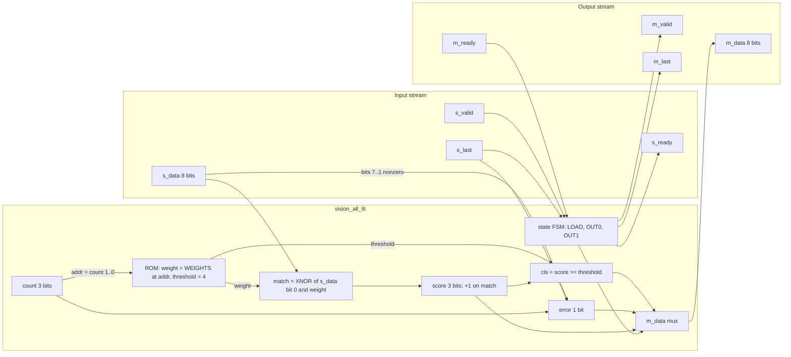
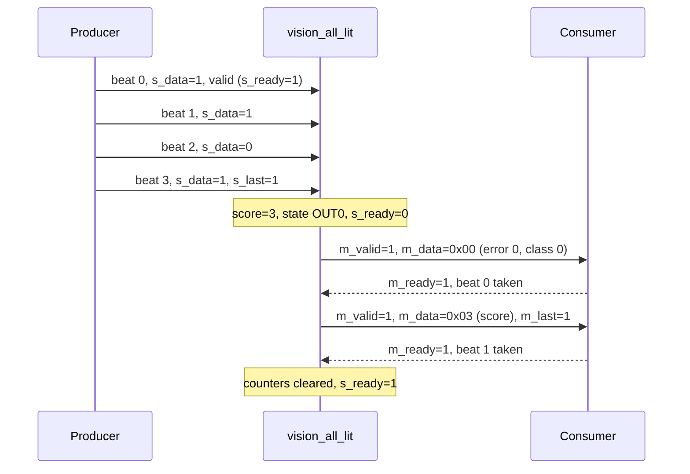
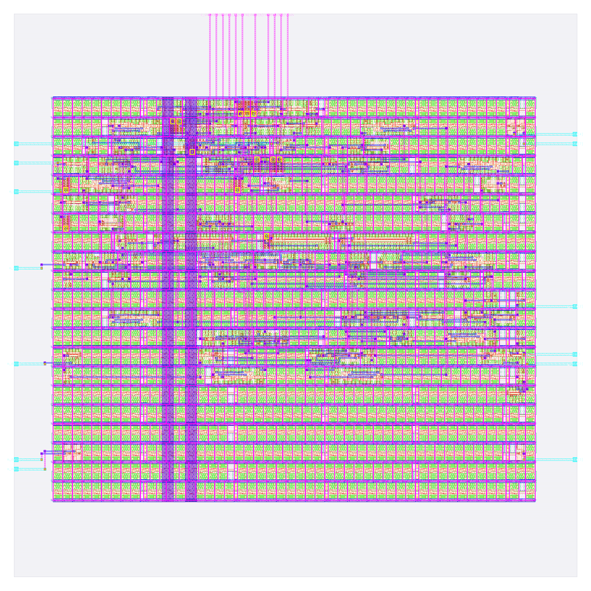

# vision_all_lit: design notes

Every number below is copied from a file under `output/` (named next to it), from the RTL in `rtl/`, or from
`python3 model/tiny_ai/golden.py`. "Not reported" means the file does not contain it.
Re-verified on 2026-10-06 against the current `output/` (run `runs/RUN_2026-10-05_18-14-33`, `output/resources.json`
`run_dir`). The testbench and checks are in the "Verification" section. The Reproduce commands are in the "Reproduce" section below; the last section is "Intuitions and insights".

## What it is

A tiny neural-network chip for a 2 x 2 one-bit image: it answers 1 when all four pixels are lit (`README.md`).
It is one binary neuron: each pixel is compared with its 1-bit weight (XNOR), the matches are counted
(score 0..4), and the neuron fires when the count reaches the threshold. The fitted values are weights 1,1,1,1 and
threshold 4 (`rtl/vision_all_lit_rom.v`). Pixels arrive one per clock beat and are used immediately, so no image is stored.

It is AI and not just a gate because the weights and threshold were learned from labelled examples and sit in a
generated ROM, inside a general neuron structure. See [../../docs/WHY_AI.md](../../docs/WHY_AI.md).

## Architecture

The RTL is `rtl/vision_all_lit.v` (engine) plus `rtl/vision_all_lit_rom.v` (generated parameters).



Registers (declared in `rtl/vision_all_lit.v`, all reset synchronously by `rst`):

| Register | Width | Purpose |
|---|---|---|
| `state` | 2 | FSM: `ST_LOAD`=0 (accepting pixels), `ST_OUT0`=1 (sending beat 0), `ST_OUT1`=2 (sending beat 1) |
| `count` | 3 | beats received this frame; saturates at N=4; its low 2 bits address the weight ROM |
| `score` | 3 | number of pixels that matched their weight so far, 0..4 |
| `error` | 1 | set by an out-of-range beat (`s_data > 1`), a frame that is not exactly 4 beats, or extra beats |

Declared bits: 2 + 3 + 3 + 1 = 9. The synthesised design has **10** flip-flops: `output/metrics.json` key
`design__instance__count__class:sequential_cell` = 10 (also 10 `dfxtp_2` in `output/reports/synth_stat.rpt` and
`output/reports/cell_usage.rpt`). The extra flop is because Yosys re-encoded the 3-state `state` register as one-hot
(3 flops instead of 2); this is in the synthesis log (`runs/.../06-yosys-synthesis/yosys-synthesis.log`, "mapping auto
encoding to `one-hot`"), and the netlist shows flops driving `s_ready`, `m_last` and `state[2]`. So 3 + 3 + 3 + 1 = 10,
which equals the surviving sequential cells. Flop area is 212.704 um^2 (34.62 % of synthesised area, `synth_stat.rpt`).

Outputs: `s_ready` = state is LOAD; `m_valid` = state is OUT0 or OUT1; `m_last` = state is OUT1;
`m_data` = `{5'b0, score}` in OUT1, else `{6'b0, error, cls}`.

## Data flow

Example input frame: pixels `1 1 0 1` (one pixel is dark). Expected from
`python3 model/tiny_ai/golden.py vision_all_lit 1 1 0 1`: `beat0=0x00 beat1=0x03 latency=1`.
By the RTL rules: pixels 0, 1, 3 equal their weight 1 (3 matches), pixel 2 does not; 3 < threshold 4, so class 0, error 0.
The table assumes no gaps in `s_valid` and `m_ready` held high. "After edge n" values are the register contents once clock
edge n has happened.

| Edge | Input handshake (s_valid and s_ready) | Output handshake | State after edge | count | score | error | Output |
|---|---|---|---|---|---|---|---|
| reset | n/a | n/a | LOAD | 0 | 0 | 0 | s_ready=1, m_valid=0 |
| 1 | pixel 1 accepted (s_data=1, weight[0]=1, match) | none | LOAD | 1 | 1 | 0 | s_ready=1 |
| 2 | pixel 1 accepted (match) | none | LOAD | 2 | 2 | 0 | s_ready=1 |
| 3 | pixel 0 accepted (weight 1, no match) | none | LOAD | 3 | 2 | 0 | s_ready=1 |
| 4 | pixel 1 accepted with s_last (match) | none | OUT0 | 4 | 3 | 0 | s_ready drops to 0, m_valid rises (latency 1) |
| 5 | s_ready=0, none | beat 0 taken (m_valid and m_ready) | OUT1 | 4 | 3 | 0 | m_data=0x00 was shown (error 0, cls 0) |
| 6 | s_ready=0 | beat 1 taken, m_last=1 | LOAD | 0 | 0 | 0 | m_data=0x03 was shown (score 3) |
| 7 | s_ready=1 again | none | LOAD | 0 | 0 | 0 | ready for the next frame |

For comparison, `golden.py vision_all_lit 1 1 1 1` gives `beat0=0x01 beat1=0x04 latency=1` (all lit: class 1, score 4).



The testbench (`tb/vision_all_lit_tb.v`, body in `shared/tb/stream_tb.vh`) runs 29 vectors from `tb/vectors.hex` with random
input gaps and output stalls (README), and the same bench is reused on the synthesised and routed netlists.

## Verification

Testbench: `designs/vision_all_lit/tb/vision_all_lit_tb.v` (a 9-line wrapper that defines `DUT
vision_all_lit`) includes the shared body `shared/tb/stream_tb.vh`, run with
`+VEC=designs/vision_all_lit/tb/vectors.hex -I shared/tb`. Per case it sends the frame with random gaps on
`s_valid`, takes the two result beats under random `m_ready` stalls and compares beat 0, beat 1, `m_last`
(beat 1 only) and the latency with the golden values. It also checks that `m_valid`/`m_data`/`m_last` hold
while stalled, that `s_ready` is low from the last input beat until the result is taken, and that reset in
mid-frame and with a result waiting returns to an empty, ready state. All comparisons use `!==`, so X never
passes; a 200,000,000 ns hard timeout and `$fatal(1, "FAIL ...")` on the first failure.
Fresh `make simulate DESIGN=vision_all_lit`: `PASS vision_all_lit_tb: 29 cases, 158 checks (results, latency,
back-pressure, protocol errors, reset)`

Vectors: `designs/vision_all_lit/tb/vectors.hex` is generated by `model/tiny_ai/gen_rom.py` from
`model/tiny_ai/weights.json` and `model/tiny_ai/golden.py` (29 cases: all 16 inputs of the truth table, then
13 protocol cases (short frames, two long frames, out-of-range items)). Expected beats and latency are
produced by the bit-exact golden model, never written by hand.

Model-level: `python3 model/tiny_ai/golden.py --check` prints `golden: vision_all_lit    16 cases, 0
mismatches`, so the golden model agrees with its own truth table (the training line says "exact"). `make
check-generated` (`scripts/check_generated.sh`) regenerates weights, ROMs and vectors in a scratch copy and
prints `check-generated: PASS (regeneration reproduces every file)`, so the committed `vision_all_lit_rom.v`
and `vectors.hex` are reproducible.

Gate-level: the same testbench file runs on the synthesised netlist (`make gl DESIGN=vision_all_lit`:
synthesis-only run, netlist `build/gl/vision_all_lit/runs/gl/final/nl/vision_all_lit.nl.v`, 60 cells) and on
the routed post-PnR netlist (`make gl-final DESIGN=vision_all_lit`:
`designs/vision_all_lit/runs/RUN_2026-10-05_18-14-33/final/nl/vision_all_lit.nl.v`, 963 cells), compiled by
`scripts/flow/gl_sim.sh` against the sky130_fd_sc_hd functional models with a unit gate delay of `#0.01`
(`GL_UNIT_DELAY`, default in gl_sim.sh; it must be above 0 to avoid flip-flop races and below the 1 ns sample
point). Results on disk: `build/flow/vision_all_lit/stages.txt` lists `gl_synth PASS` and `gl_final PASS` (the `stage_*.log`
files there hold only the recipe command lines, not simulator output); `build/gl/vision_all_lit/result.txt` reads `vision_all_lit |
final:vision_all_lit.nl.v | every case of tb/vectors.hex | PASS | 0 s`.
`build/gl/vision_all_lit/synth_checks.txt` reads `synthesis__check_error__count = 0`.

Signoff checks that are verification (`python3 scripts/flow/check_signoff.py vision_all_lit`,
the `check` stage in `build/flow/vision_all_lit/stages.txt`): no logic lost, RTL 10 registers, 10 surviving sequential cells,
allowance 0 (the declared 9 bits become 10 flip-flops because Yosys recoded the 3-state FSM to one-hot); Yosys
driver warnings (multiple drivers / no driver) 0, synthesis check errors 0 (`synth_checks.txt`).

Negative tests (`tests/run_tests.sh`, section "negative", all PASS in a fresh run; mutations are made in a
temp dir and asserted to have applied): Corrupted vector: bit 0 of expected beat 0 of the first case flipped;
the testbench stops at `FAIL case 1` and prints no PASS. Broken RTL: `(score >= threshold)` mutated to `(score
> threshold)`; the testbench stops at `FAIL case 16` (stream_tb.vh:69). The model check is also shown to fail:
a copy of `model/tiny_ai` with the vision_all_lit threshold changed makes `golden.py --check` report
`vision_all_lit 16 cases, 4 mismatches`. The README/NOTES record no further negative tests.

## Layout (GDSII)



- Die: `design__die__bbox` = `0.0 0.0 80.0 80.0` um (area 6400 um^2). Core: `design__core__bbox` = `5.52 10.88 74.06 68.0` um
  (area 3915 um^2) (`output/metrics.json`).
- Standard-cell rows: `design__rows` = 21 (3129 sites). In the image the 21 horizontal bands filling the core are the rows;
  the vertical and horizontal magenta/purple grid on top is the power network (vccd1 and vssd1), with two thicker purple
  vertical straps on the left-centre of the core. Rows are mostly green/white filler and tap cells, with the logic as
  small clusters of coloured shapes.
- Utilization: `design__instance__utilization` = 0.277 (instance area 1084.79 um^2 of 3915 um^2 core, `metrics.json`).
  The floorplan log reported 0.157 before buffers, tap and fill were added (`output/reports/floorplan.txt`).
- Pins: `design__io` = 26 in `metrics.json` (`floorplan__design__io` = 24 signal pins). In the picture, thin vertical wires
  run to the top edge (a group of about 11 pins), and short horizontal stubs reach pins on the left and right edges.
  Most of the die outside the core is empty.
- Fill: 794 fill/decap cells (713 `decap_3`, 39 `fill_1`, 42 `fill_2`, `cell_usage.rpt`), area 2830.21 um^2, plus 57 tap cells
  (`metrics.json`). This is why total instances are 963 although the logic is only 60 synthesised cells.

## From RTL to GDSII: what each step did

### Synthesis

Yosys mapped the RTL to sky130_fd_sc_hd cells: **60 cells, 614.339 um^2** (`output/reports/synth_stat.rpt`). By type: 10
`dfxtp_2` flops (212.704 um^2), 6 `inv_2`, 5 `conb_1` tie cells, 3 `mux2_1`, 7 `nand2_2`, 3 `a21oi_2`, 3 `o211a_2`, 2 `o31a_2`,
2 `or4_2`, and 1 each of about 20 other AND/OR/AOI/OAI cells. `metrics.json` splits them as 6 inverters, 10 sequential and
44 multi-input combinational cells. The check pass found 0 problems (`output/reports/synth_checks.rpt`);
`synthesis__check_error__count` = 0, `design__inferred_latch__count` = 0, `design__lint_error__count` = 0
(`design__lint_warning__count` = 446). Report: [synth_stat.rpt](output/reports/synth_stat.rpt),
[synth_checks.rpt](output/reports/synth_checks.rpt).

### Floorplan

Fixed 80 x 80 um die (`config.json`), core 5.52 10.88 to 74.06 68.0 um, 21 rows of 149 sites, core area 3915.005 um^2, initial
effective utilization 0.157 with 60 instances (`output/reports/floorplan.txt`). Timing constraints used: 5 ns input and output
delay and 0.25 ns clock uncertainty (flow defaults, printed in `floorplan.txt`), 25 ns clock (`config.json`). Report: [floorplan.txt](output/reports/floorplan.txt).

### Placement

Global placement finished at iteration 351 with routing overflow 0.0000 and 0 overflowed tiles; final routability congestion 0.7772,
placed cell area 692.70 um^2, minimum feasible density 0.19 (`output/reports/placement_global.txt`). Detailed placement: total, average
and max displacement 0.0 um, HPWL 1623.5 um after mirroring 39 instances (`output/reports/placement_detailed.txt`).
`metrics.json` also lists `design__instance__displacement__total` 62.88 um, max 10.88 um, from the overall flow.
Reports: [placement_global.txt](output/reports/placement_global.txt), [placement_detailed.txt](output/reports/placement_detailed.txt).

### Clock tree

CTS inserted 3 `clkbuf_16` buffers for 10 sinks on 1 clock root (`output/reports/cts.rpt`; `metrics.json` `design__instance__count__class:clock_buffer` = 3,
area 75.072 um^2). Worst clock skew over all corners: setup 0.2512 ns, hold -0.2511 ns (`clock__skew__worst_setup`,
`clock__skew__worst_hold`). Timing repair added 36 buffers (`design__instance__count__class:timing_repair_buffer`), of which 8 are hold buffers
(`design__instance__count__hold_buffer`). Report: [cts.rpt](output/reports/cts.rpt).

### Routing

Global routing: total wirelength 3022 um, 111 routed nets, 567 vias, congestion 0 overflow with total usage 7.04 %
(`output/reports/routing_global.txt`); the final `metrics.json` values after repair are `global_route__wirelength` 3146 and `global_route__vias` 586.
Detailed routing: DRC violations 7, 7, then 0 over three iterations (`route__drc_errors__iter:0/1/2`), final wirelength 1954 um over 112 nets,
599 vias (all single-cut), longest wire 113.73 um (`metrics.json`; log in `output/reports/routing_detailed.txt`, which ends
"Number of violations = 0"). Routing used met1 to met4 (`config.json`, `RT_MAX_LAYER`). Reports:
[routing_global.txt](output/reports/routing_global.txt), [routing_detailed.txt](output/reports/routing_detailed.txt).

### Timing

All 9 analysed corners meet both setup and hold with zero violations (`output/reports/timing_summary.rpt`).

| Corner | Worst setup slack (ns) | Worst hold slack (ns) |
|---|---|---|
| nom_tt_025C_1v80 | 18.0739 | 0.3315 |
| nom_ss_100C_1v60 | 16.0755 | 0.8984 |
| nom_ff_n40C_1v95 | 18.6850 | 0.1103 |
| overall (worst of all corners) | 16.0691 | 0.1083 |

(The report also lists min_ and max_ variants of each corner; the extremes are the overall row.) Worst setup path
(`output/reports/timing_paths_max_ss.rpt`, slack 16.069 ns MET): starts at input port `s_data[3]`, goes through
`or4_2`, `o31a_2`, `a211o_2`, `o211a_2` (the bad-item and error/score logic) and ends at flop `_091_` (by netlist order the `score[2]`
flop; this name mapping is inferred from the netlist, not stated in the report). Worst hold path
(`output/reports/timing_paths_min_ff.rpt`, slack 0.108 ns MET): from flop `_089_` back to its own D input (a register feeding itself).
At a 25 ns clock the design has a lot of slack. Reports: [timing_summary.rpt](output/reports/timing_summary.rpt),
[timing_paths_max_ss.rpt](output/reports/timing_paths_max_ss.rpt), [timing_paths_min_ff.rpt](output/reports/timing_paths_min_ff.rpt).

### DRC

DRC (design rule check) tests the drawn shapes against the foundry's spacing, width and enclosure rules.
Magic: `magic__drc_error__count` = 0 (`output/reports/drc_magic.rpt`, "COUNT: 0"). KLayout: `klayout__drc_error__count` = 0, and all 257
rule entries in `output/reports/drc_klayout.json` are 0. XOR difference between the two GDS writers: 0
(`design__xor_difference__count`); illegal overlaps: 0. Reports: [drc_magic.rpt](output/reports/drc_magic.rpt),
[drc_klayout.json](output/reports/drc_klayout.json).

### LVS

LVS (layout versus schematic) extracts the transistors and nets from the layout and checks they match the synthesised netlist, so routing
did not short or open anything. Result lines in `output/reports/lvs_netgen.rpt`: "Netlists match uniquely", "Final result: Circuits match uniquely."
Both circuits have 116 devices and 119 nets, and the pin lists are equivalent. All `design__lvs_*` counts in `metrics.json` are 0.
Report: [lvs_netgen.rpt](output/reports/lvs_netgen.rpt).

### Power / IR drop

Total power 6.37e-05 W (internal 4.91e-05, switching 1.45e-05, leakage 3.9e-09 W; `metrics.json`). IR drop is the voltage lost in the power
grid wires: worst 1.36e-04 V on vccd1 (0.01 %) and 1.06e-04 V ground bounce on vssd1, average 1.3e-05 V (`output/reports/irdrop.rpt`).
Power grid violations: 0. Report: [irdrop.rpt](output/reports/irdrop.rpt).

### Antenna, slew, capacitance

Antenna violations (charge build-up on long wires during manufacturing): 0 nets and 0 pins after repair; 13 antenna diode cells were inserted
(32.5312 um^2, `design__instance__count__class:antenna_cell`). Max slew, max capacitance and max fanout violations are 0 in every corner
(`metrics.json`; `MAX_FANOUT_CONSTRAINT` is 8 in `config.json`). `manufacturability.rpt` lists Antenna, LVS and DRC all "Passed".
Report: [manufacturability.rpt](output/reports/manufacturability.rpt). `timing__unannotated_net__count` = 5 (and 0 after filtering), and
`timing__drv__floating__nets` = 2 in `metrics.json`.

## Run time and memory

From `output/resources.json` (limits 2 CPUs, 8 GB):

- Total wall time: 45 s (`wall_s_total`) for 78 steps, exit code 0.
- Peak container memory: 720,592,896 bytes = 0.671 GB; largest per-step process RSS 514,850,816 bytes (`peak_rss_bytes_flow_stats_max`), from the detailed-routing step (the LVS step is next at 500,170,752 bytes).
- Three slowest steps: `46-openroad-detailedrouting` 4.047 s, `35-openroad-cts` 3.975 s, `57-openroad-stapostpnr` 2.552 s
  (next: `67-klayout-drc` 2.339 s). Most other steps take under 1 s.

## Reproduce

```bash
make flow-all DESIGN=vision_all_lit    # simulate, gds, check, gate-level (synthesised and routed), collect
make simulate DESIGN=vision_all_lit    # RTL simulation only; prints PASS vision_all_lit_tb: 29 cases, 158 checks (...)
make collect DESIGN=vision_all_lit     # refresh output/ (metrics, resources, flow.log, reports, layout.png) from the last run
python3 model/tiny_ai/golden.py vision_all_lit 1 1 0 1   # reference result for one frame
```

Both `make` targets exist in the current `Makefile`; `make simulate DESIGN=vision_all_lit` was re-run on 2026-10-06 and passed.

## Intuitions and insights

Plain-language lessons, each tied to a file. See also `docs/WHY_AI.md` (sections 3.1, 4, 5), `docs/ARCHITECTURE.md` and the
"Intuitions and insights" section of `SPEC.md`.

**A neural network, not a rule.** The RTL contains no "all four lit" test. It counts pixels that equal their weight and
compares the count with a threshold; the numbers come from the generated ROM (`rtl/vision_all_lit_rom.v`:
`WEIGHTS = 4'b1111`, threshold 4), fitted by `model/tiny_ai/train.py` from all 16 labelled images
(`model/tiny_ai/weights.json`, `"cases": 16`). With other labels the same circuit computes a different rule
(`docs/WHY_AI.md` section 4): "at least three lit" gives threshold 3, "any pixel lit" threshold 1, "top row lit"
weights 1,1,0,0, "all dark" weights 0,0,0,0, each with no hardware change. A hand-wired AND gate would need a new
circuit each time. The flip side (section 5): one neuron cannot learn "exactly two lit" (an XOR-like rule needs a second
layer), and the fitter finds no solution. Choosing the structure is the design decision.

**The dense lesson: weights grow with the inputs.** A dense neuron needs one weight per input: four pixels, four
weight bits, selected by `count[1:0]` (`rtl/vision_all_lit_rom.v`). A 3 x 3 image would need nine. No pixel is stored: each
is scored as it arrives, which is why the whole engine is 10 flip-flops (`metrics.json`) and 60 synthesised cells,
614.339 um^2 (`synth_stat.rpt`). `vision_block` handles nine pixels with 24 flip-flops and 168 synthesised cells,
1726.656 um^2, about 2.8 times as much.

**Where the area goes.** The 169 standard cells (1084.79 um^2, `metrics.json`) are only 60 cells of logic: by class,
synthesised logic 614.34 um^2 (56.6 %, including the 10 flip-flops at 212.70 um^2), 36 timing-repair buffers 291.53 um^2
(26.9 %), 3 clock buffers 75.07 um^2 (6.9 %), 57 tap cells 71.32 um^2 (6.6 %), 13 diode cells 32.53 um^2 (3.0 %). Those
classes add up to the stated total. The design has 24 signal pins (`floorplan__design__io` 24) and the flow added 36 repair buffers
to 60 logic cells; the files do not say which nets those buffers serve. The 80 x 80 um die is mostly empty:
utilisation 0.277 and 794 decap and fill cells covering 2830.21 um^2, 2.6 times the cell area.

**The slew and fanout settings.** `config.json` tightens repair rather than loosening any limit:
`MAX_FANOUT_CONSTRAINT` 8, `PL_RESIZER_MAX_SLEW_MARGIN` 40, `GRT_DESIGN_REPAIR_MAX_SLEW_PCT` 40 and
`RUN_POST_GRT_DESIGN_REPAIR` true, with no `MAX_TRANSITION_CONSTRAINT`. The margins make the resizer fix slew with
headroom, because repair judges at one corner while the slow corner is worse (the explanation in `SPEC.md`, which that file
says is not separately proven). Result: 0 max-slew, max-cap and max-fanout violations in every corner (`metrics.json`).
`RUN_HEURISTIC_DIODE_INSERTION` is true here and the engine carries 13 diode cells; the larger `tiny_ai_core` sets it
false because diodes on buffered outputs inflated fanout (`designs/tiny_ai_core/config.json`, `SPEC.md`), with antenna
repair still on. The repository does not record a before-state for this engine, so what the tightening changed here is
not measured.

**Timing headroom at 25 ns.** Worst setup slack is +16.069 ns and worst hold +0.108 ns (`timing_summary.rpt`, 9 corners).
The worst setup path leaves the `s_data[3]` port 5.02 ns in (5 ns input delay) and reaches the flop at 8.946 ns, so about
3.9 ns of buffer and logic at the slow corner (`timing_paths_max_ss.rpt`). Speed is not what limits this design; the
repair buffers are for fanout, slew and hold (`design__instance__count__hold_buffer` 8, setup buffers 0), not for setup.
The thin margin is hold, 0.108 ns at the fast corner. A first-order estimate, not a run: the logic would still close
setup at a period near 25 - 16.07 = 8.9 ns if the I/O delays did not scale.

**Latency and throughput.** Latency is 1 cycle (`model/tiny_ai/spec.json`; `golden.py` prints `latency=1`). A frame costs
4 input beats plus 2 output beats, 6 clocks, then `s_ready` is high again (the data-flow table above). At the
constrained 25 ns clock that is 150 ns per frame, about 6.7 million frames per second with no stalls (derived: 1 / (6 x 25 ns)).

**Verification lessons.** The 16 possible images are all tested, so "tested" means every input, plus 13 protocol cases
(3 short frames, 2 long, 8 out-of-range items; `model/tiny_ai/gen_rom.py` `cases()`): 29 cases, 158 checks, passing on the
RTL, the synthesised netlist and the routed netlist (`build/sim/vision_all_lit/sim.log`, and the `gl_synth` / `gl_final` PASS lines in
`build/flow/vision_all_lit/stages.txt`). The negative tests in `tests/run_tests.sh` corrupt an expected vector, break a copy of the RTL and
mutate a threshold, and each asserts the mutation applied, so the checks are shown able to fail. The first ROM was an
`always @(*)` block whose inputs never changed, so simulation never evaluated it; `gen_rom.py` now emits only continuous
assignments (comment at line 27), and the ROM here is `assign weight = WEIGHTS[addr]`. Finally, flip-flop counts need
synthesis in mind: Yosys recoded the 3-state FSM as one-hot, so 9 declared bits became 10 flip-flops (`synth_stat.rpt`,
`yosys-synthesis.log`), and the signoff check compares against the elaborated count, not the declared bit count.
