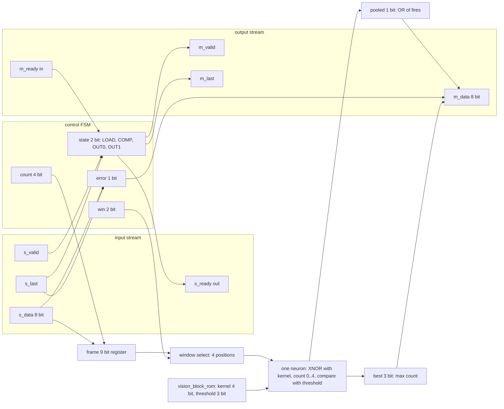
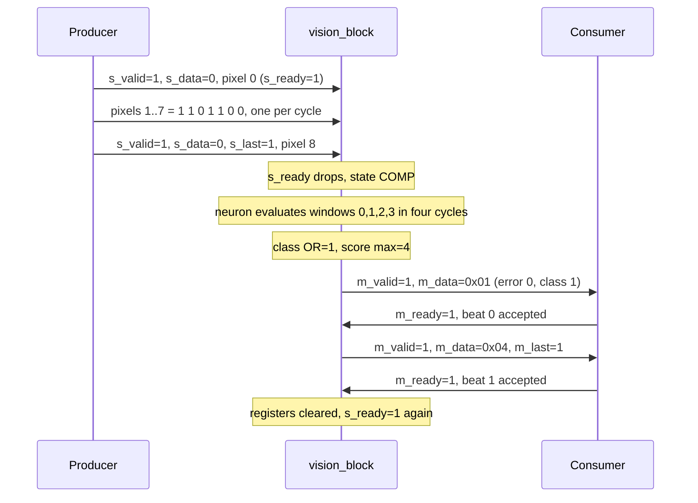
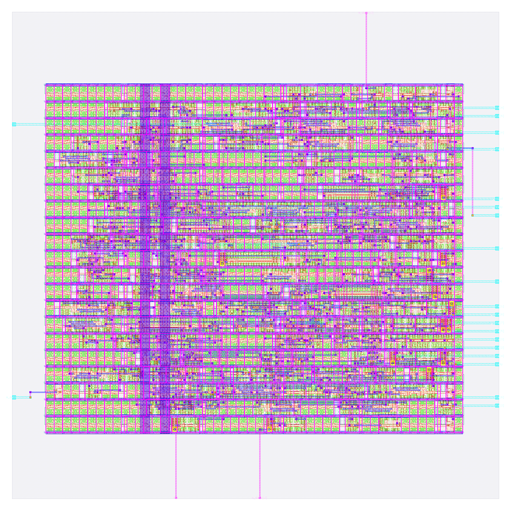

# vision_block: design notes

## What it is

`vision_block` is a tiny convolution engine. It reads a 3 x 3 one-bit image (9 pixels, one per clock beat) and answers 1 when some 2 x 2 window is fully lit (source: `README.md`).
A single 2 x 2 kernel neuron (kernel 1,1,1,1, threshold 4, from `rtl/vision_block_rom.v`) is reused at the four window positions, one per clock cycle, and the results are combined by OR max-pooling.
Output is two stream beats: beat 0 = `{6'b0, error, class}`, beat 1 = score (largest window match count, 0..4). Latency is 5 clock edges after the last input beat (`model/tiny_ai/spec.json`).
It is AI, not a hand-written rule, because the kernel and threshold are learned weights stored in a generated ROM module, while the structure (XNOR, count, compare) is a general neuron. See [../../docs/WHY_AI.md](../../docs/WHY_AI.md).
Simulation: `make simulate DESIGN=vision_block` printed `PASS vision_block_tb: 540 cases, 2713 checks`.

## Architecture



Registers (all in `rtl/vision_block.v`, synchronous active-high reset, clocked by `clk`):

| Register | Width | Purpose |
|---|---|---|
| `state` | 2 | FSM: LOAD=0 (s_ready high), COMP=1, OUT0=2, OUT1=3 (m_valid high in OUT0/OUT1) |
| `count` | 4 | beats received in this frame, saturates at 9 |
| `frame` | 9 | pixels in raster order, `frame[count] <= s_data[0]` |
| `win` | 2 | which 2 x 2 window is being evaluated (0..3) |
| `pooled` | 1 | OR of the window results so far (the class) |
| `best` | 3 | largest window match count so far (the score) |
| `error` | 1 | out-of-range item (`s_data > 1`) or frame not exactly 9 beats |

RTL flip-flop bits: 2+4+9+2+1+3+1 = 22. The ROM (`kernel = 4'b1111`, `threshold = 3'd4`) is constants, not flip-flops.
`metrics.json` (`design__instance__count__class:sequential_cell`) reports 24 sequential cells, and `synth_stat.rpt` shows 24 `dfxtp_2`. That is 2 more than the 22 RTL bits. Synthesis re-encoded the 4-state `state` from 2 binary flops to 4 one-hot flops (the run's `06-yosys-synthesis/yosys-synthesis.log`: "mapping auto encoding to `one-hot` for this FSM"), so 22 - 2 + 4 = 24. `scripts/flow/check_signoff.py` counts the same 24 when it elaborates the RTL (its breakdown names the one-hot bits `state`, `s_ready` and `m_last`).

## Data flow

Example input: pixels in raster order `0 1 1 0 1 1 0 0 0` (image rows `011`, `011`, `000`), no input gaps, `m_ready` always 1. `python3 model/tiny_ai/golden.py vision_block 0 1 1 0 1 1 0 0 0` gives `beat0=0x01 beat1=0x04 latency=5`: class 1, error 0, score 4.

The final `frame` bits (bit 8 down to bit 0) are `000110110`. Windows (bit order TL, TR, BL, BR, kernel 1111, so match count = number of lit pixels, fire = count >= 4):

| win | pixels used | window value | match count | fire |
|---|---|---|---|---|
| 0 | frame 0,1,3,4 | 0,1,0,1 | 2 | 0 |
| 1 | frame 1,2,4,5 | 1,1,1,1 | 4 | 1 |
| 2 | frame 3,4,6,7 | 0,1,0,0 | 1 | 0 |
| 3 | frame 4,5,7,8 | 1,1,0,0 | 2 | 0 |

Cycle by cycle (a row is the state after that clock edge; the same neuron hardware does every window):

| Edge | Input handshake | Output handshake | State | frame[8:0] | count | win | pooled | best | Output |
|---|---|---|---|---|---|---|---|---|---|
| E0 | beat 0 pixel 0 | none | LOAD | 000000000 | 1 | 0 | 0 | 0 | s_ready=1 |
| E1 | beat 1 pixel 1 | none | LOAD | 000000010 | 2 | 0 | 0 | 0 | |
| E2 | beat 2 pixel 1 | none | LOAD | 000000110 | 3 | 0 | 0 | 0 | |
| E3 | beat 3 pixel 0 | none | LOAD | 000000110 | 4 | 0 | 0 | 0 | |
| E4 | beat 4 pixel 1 | none | LOAD | 000010110 | 5 | 0 | 0 | 0 | |
| E5 | beat 5 pixel 1 | none | LOAD | 000110110 | 6 | 0 | 0 | 0 | |
| E6 | beat 6 pixel 0 | none | LOAD | 000110110 | 7 | 0 | 0 | 0 | |
| E7 | beat 7 pixel 0 | none | LOAD | 000110110 | 8 | 0 | 0 | 0 | |
| E8 | beat 8 pixel 0, s_last | none | COMP | 000110110 | 9 | 0 | 0 | 0 | s_ready drops |
| E9 | none | none | COMP | 000110110 | 9 | 1 | 0 | 2 | window 0: count 2, no fire |
| E10 | none | none | COMP | 000110110 | 9 | 2 | 1 | 4 | window 1: count 4, fire |
| E11 | none | none | COMP | 000110110 | 9 | 3 | 1 | 4 | window 2: count 1, no change |
| E12 | none | none | OUT0 | 000110110 | 9 | 0 | 1 | 4 | window 3: count 2; m_valid=1, m_data=0x01 |
| E13 | none | beat 0 accepted | OUT1 | 000110110 | 9 | 0 | 1 | 4 | m_data=0x04, m_last=1 |
| E14 | none | beat 1 accepted | LOAD | 000000000 | 0 | 0 | 0 | 0 | registers cleared, ready for next frame |

The COMP rows show the registers after the edge that finishes the evaluation of the window named in the last column (the window evaluated is the one selected by `win` before the edge). Latency 5 means edges E8 through E12 (both counted) before `m_valid` rises, matching `latency=5` from golden.py. Values are derived by hand from the RTL rules and the golden model, not read from a waveform.



## Layout (GDSII)



The picture (`output/layout.png`, rendered by KLayout) shows the 80 x 80 um die (`design__die__bbox` = `0.0 0.0 80.0 80.0`, die area 6400 um^2) as the grey square. Inside it is the core, `design__core__bbox` = `5.52 10.88 74.06 68.0`, core area 3915 um^2, with 21 standard-cell rows (`design__rows`) of 3129 sites in total.
The horizontal stripes are the standard-cell rows; the green and red patterns are the cell transistors and local wiring, and the dense magenta grid is the power distribution (vccd1/vssd1 straps and rails). Two wider vertical purple bands near the left third are vertical power straps.
Pins are the small cyan squares on the die edge with thin wires to the core: most sit on the right edge, with a few on the left, bottom and top. `floorplan.txt` reports 24 I/O; `design__io` in `metrics.json` is 26: the 24 signal pins plus the two power pins `vccd1` and `vssd1` (both listed as PINs in `output/vision_block.lef`).
Fill and tap cells fill the empty row space: 474 fill cells and 57 tap cells (`design__instance__count__class:fill_cell`, `...:tap_cell`); `cell_usage.rpt` also lists 358 `decap_3`. Small yellow squares are the 13 antenna diodes.
Core utilization: `design__instance__utilization` = 0.602748 (about 60 %) after placement and repair. Stdcell area 2359.76 um^2 across 297 cells (`design__instance__area__stdcell`, `design__instance__count__stdcell`).

## From RTL to GDSII: what each step did

### Synthesis

Yosys mapped the RTL to sky130_fd_sc_hd cells: 168 cells, area 1726.656 um^2, of which 510.49 um^2 (29.57 %) is sequential (`output/reports/synth_stat.rpt`). Main cell types: 24 `dfxtp_2` flip-flops, 15 `and2_2`, 13 `nand2_2`, 12 `nor2_2`, 9 `o21ai_2`, 8 each of `a21oi_2`, `a32o_2`, `o21a_2`, 7 `inv_2`, 5 `mux2_1`, 5 `conb_1` (tie cells), plus about 30 other gate types.
`synth_checks.rpt`: "Found and reported 0 problems"; `synthesis__check_error__count` = 0, `design__inferred_latch__count` = 0, `design__instance_unmapped__count` = 0. Lint: 0 errors, 446 warnings (`design__lint_warning__count`).
Report: [synth_stat.rpt](output/reports/synth_stat.rpt), [synth_checks.rpt](output/reports/synth_checks.rpt).

### Floorplan

The die is fixed at 80 x 80 um by `config.json`; the requested core was snapped to `5.52 10.88 74.06 68.0`. OpenROAD added 21 rows of 149 sites, core area 3915.005 um^2, instance area 1726.656 um^2, effective utilization 0.441 with 168 instances (before buffers, taps and repair). Power straps and tap cells are added in following steps.
Report: [floorplan.txt](output/reports/floorplan.txt).

### Placement

Global placement finished at iteration 368 with routability-mode iteration count 66, final weighted congestion 1.0105, minimum feasible density 0.5400 (`placement_global.txt`). The routing-overflow estimate was 0.0073 with 1 overflowed tile (0.83 %).
Detailed placement legalised with total displacement 0.0 u in its own analysis; HPWL 3548.9 u (`placement_detailed.txt`). Across the flow `design__instance__displacement__total` = 39.86, mean 0.117, max 7.32 um (`metrics.json`). Timing repair before this added buffers (42 timing repair buffers at this point).
Reports: [placement_global.txt](output/reports/placement_global.txt), [placement_detailed.txt](output/reports/placement_detailed.txt).

### Clock tree

TritonCTS built one clock root with 5 `clkbuf_16` buffers and 24 sinks (the 24 flip-flops) (`cts.rpt`). Worst clock skew in `metrics.json`: setup 0.2522 ns, hold -0.2523 ns (all corners about 0.25 ns). After CTS, repair added hold buffers: 8 hold buffers (`design__instance__count__hold_buffer`), 0 setup buffers; total 54 timing repair buffers.
Report: [cts.rpt](output/reports/cts.rpt).

### Routing

Global routing: 236 nets, wire length 7389 um in `routing_global.txt` (`global_route__wirelength` = 7472, `global_route__vias` = 1514 in metrics), total overflow 0, usage 16.62 % (met1 24.81 %, met2 25.50 %, met3 1.90 %, met4 0.40 %).
Detailed routing: DRC violations per iteration 59, 43, 20, 0 (`route__drc_errors__iter:0..3`), final `route__drc_errors` = 0. Final wire length 4306 um (`route__wirelength`), longest net 109.4 um (`route__wirelength__max`), 1499 vias, all single-cut (761 li1, 705 met1, 33 met2). 240 routed nets (`route__net`).
Reports: [routing_global.txt](output/reports/routing_global.txt), [routing_detailed.txt](output/reports/routing_detailed.txt).

### Timing

Clock period 25 ns (`config.json`); input and output delay 5 ns each. All three process corners (and min/max RC variants) pass: zero setup and hold violations, TNS 0 (`timing_summary.rpt`).

| Corner | Worst setup slack (ns) | Worst hold slack (ns) |
|---|---|---|
| nom_tt_025C_1v80 | 16.8162 | 0.3065 |
| nom_ss_100C_1v60 | 13.5578 | 0.8476 |
| nom_ff_n40C_1v95 | 17.9602 | 0.1122 |
| Overall worst | 13.5300 (max_ss_100C_1v60) | 0.1103 (min_ff_n40C_1v95) |

Worst setup path (`timing_paths_max_ss.rpt`, slack 13.529954 ns): starts at input port `s_data[2]` and ends at flip-flop `_281_` D pin. It runs through an `or4`, `nor4`, `and3` and other gates (the "is the item out of range" check feeding the control logic). Worst hold path (`timing_paths_min_ff.rpt`, slack 0.110304 ns): from flip-flop `_279_` (`frame[1]`) back to its own D pin `_279_`. Register-to-register setup slack is not reported (`Infinity` / N/A, since no pure reg-to-reg path is the limit).
Reports: [timing_summary.rpt](output/reports/timing_summary.rpt), [timing_paths_max_ss.rpt](output/reports/timing_paths_max_ss.rpt), [timing_paths_min_ff.rpt](output/reports/timing_paths_min_ff.rpt).

### DRC

DRC (design rule check) verifies the drawn shapes obey the foundry's spacing, width and enclosure rules so the chip can be manufactured. Magic: `COUNT: 0` (`drc_magic.rpt`). KLayout: all 257 rule entries in `drc_klayout.json` are 0 (sum 0). `manufacturability.rpt`: DRC Passed.
Reports: [drc_magic.rpt](output/reports/drc_magic.rpt), [drc_klayout.json](output/reports/drc_klayout.json), [manufacturability.rpt](output/reports/manufacturability.rpt).

### LVS

LVS (layout versus schematic) extracts the transistors and connections from the layout and checks they are the same circuit as the synthesised netlist. Result in `lvs_netgen.rpt`: "Circuits match uniquely." with 244 devices and 247 nets on both sides; `manufacturability.rpt`: LVS Passed.
Report: [lvs_netgen.rpt](output/reports/lvs_netgen.rpt).

### Power / IR drop

Total power 1.267e-04 W (`power__total` in `metrics.json`: internal 9.47e-05, switching 3.20e-05, leakage 4.06e-09 W). IR drop (voltage lost in the power grid, `irdrop.rpt`, nom_tt corner): vccd1 worst drop 9.43e-05 V (0.01 %), average 2.92e-05 V; vssd1 worst 9.12e-05 V (0.01 %). Power grid violations: 0.
Report: [irdrop.rpt](output/reports/irdrop.rpt).

### Antenna, slew, capacitance

Antenna (charge buildup on long wires during manufacturing): 0 violating nets and pins (`antenna__violating__nets`, `route__antenna_violation__count`) after inserting 13 antenna diode cells (`design__instance__count__class:antenna_cell`). Max slew, max capacitance and max fanout violations are all 0 in every corner (`metrics.json`; `MAX_FANOUT_CONSTRAINT` is 8). `manufacturability.rpt`: Antenna Passed. Flow warnings: 1, flow errors: 0.
Reports: [manufacturability.rpt](output/reports/manufacturability.rpt), [cell_usage.rpt](output/reports/cell_usage.rpt).

## Run time and memory

From `output/resources.json` (profile "tight": 2 CPUs, 8 GB limit, exit code 0): total wall time 49 s; container peak memory 597,786,624 bytes (0.557 GB); peak per-step RSS 551,550,976 bytes (netgen LVS step). 78 steps.
Slowest steps:

| Step | Wall time (s) |
|---|---|
| 46-openroad-detailedrouting | 9.256 |
| 35-openroad-cts | 4.049 |
| 67-klayout-drc | 2.564 |

(`57-openroad-stapostpnr` is a close fourth at 2.534 s.)

## Reproduce

```bash
make simulate DESIGN=vision_block    # RTL simulation, 540 cases
make flow-all DESIGN=vision_block    # simulate, gds, check, gate-level, collect
make collect DESIGN=vision_block     # refresh output/ (metrics, reports, layout, LEF)
```

`rtl/vision_block_rom.v` is generated from `model/tiny_ai/weights.json` by `model/tiny_ai/gen_rom.py` (`make generate`). The same testbench `tb/vision_block_tb.v` (body in `shared/tb/stream_tb.vh`) runs on the RTL, the synthesised netlist and the routed netlist.
