# Architecture of the AI hardware

This page describes the three tiny neural-network engines and the `tiny_ai_core` macro that wraps them: trained models
running inference in hardware, with numbers learned from labelled examples rather than written by a designer.
Sources: `SPEC.md`, `docs/WHY_AI.md`, `designs/*/NOTES.md`, `designs/*/rtl/*.v`, `model/tiny_ai/`, and
`../open-ai-silicon/docs/ARCH_STUDY_PLAN.md` sections 2 and 3.

## 1. Overview
Learning happens offline in Python; only the finished numbers reach silicon, as ROM constants. The chip never learns.

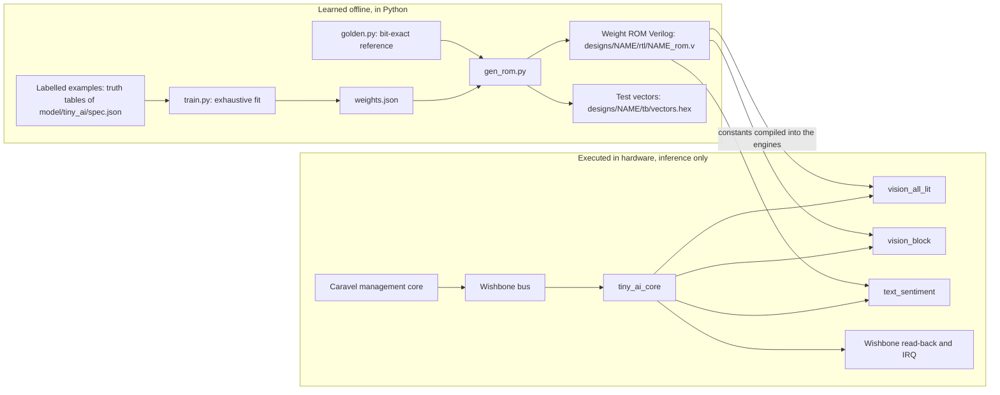

Steps, from the files: `spec.json` gives each task's label rule, input size, stream behaviour and latency.
`train.py` fits the smallest exact integer parameters by exhaustive search over the complete truth table and writes
`weights.json` (non-zero exit if no exact fit). `gen_rom.py` writes one ROM module per engine and the test vectors,
each stamped with the sha256 of its inputs. `golden.py` is the bit-exact, cycle-visible reference the testbenches
compare against, also on the synthesised and routed netlists. Learned values (`weights.json`): `vision_all_lit`
weights 1,1,1,1, threshold 4; `vision_block` kernel 1,1,1,1, threshold 4; `text_sentiment` embeddings PAD 0, GOOD 1,
FINE 0, BAD -1, threshold 0.

Left of the ROM arrow a model is fitted; right of it a fixed circuit applies whatever numbers the ROM holds.

## 2. Neural network vs generic program
| Question | Generic program or hand-designed logic | Neural network (these engines) |
|---|---|---|
| Where does the rule live? | In the code or the wiring: an AND of four pixels, an `if` on a word | In a table of learned numbers (`weights.json`, then `*_rom.v`) |
| New task with the same shape | Rewrite the code, or redraw the logic | Change the examples, re-run `make generate`; the engine RTL is unchanged |
| What it can express | Anything you can write down | Only what its structure can represent |
| Evidence of this | None needed | `train.py` finds no fit for some labels (below) |

Same circuit, different data (`docs/WHY_AI.md` section 4): "at least three lit" learns threshold 3, "top row lit"
weights 1,1,0,0, "one BAD outweighs two GOOD" BAD = -2. Each is a ROM change only.

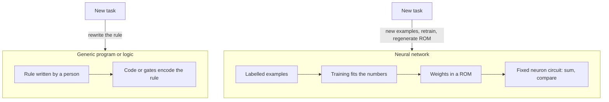

Evidence that this is a model with an architecture and not arbitrary logic (`docs/WHY_AI.md` section 5): the
trainer finds no solution for some label rules, because one neuron draws one straight dividing line.

- "Exactly two of four pixels lit" needs two dividing lines (the XOR problem); the remedy is a second layer.
- "GOOD directly before BAD" cannot be expressed by summing word scores (order is ignored); the remedy is
  attention (`docs/WHY_AI.md` section 7).
A program can be made to do anything you can write down; a network does what its structure can represent.

Honest limits (`docs/WHY_AI.md` section 9): the tasks are tiny and have trivial hand-written equivalents (the learned
`vision_all_lit` neuron behaves exactly like an AND gate); training is exhaustive search, not gradient descent; the
chip is a digital circuit doing inference only. The method (structure, examples, training, weights in memory) is what
scales to tasks nobody can write by hand.

## 3. The three engines
All three share one interface from `ARCH_STUDY_PLAN.md` section 3 and `model/tiny_ai/spec.json`:

- Input `s_valid`, `s_data[7:0]`, `s_last`, `s_ready`: one item per beat, `s_last` on the final beat. Output `m_valid`,
  `m_data[7:0]`, `m_last`, `m_ready`: two beats, beat 0 = `{6'b0, error, class}`, beat 1 = score (two's complement).
  Plus `clk` and synchronous active-high `rst`. A beat transfers when `valid` and `ready` are both high.
- `error` is set by an item above `input_max` or a frame of the wrong length. Latency runs from the edge that accepts
  the last input beat to the edge that raises `m_valid`, counting both.

The IO, MEMORY, COMPUTE, CONTROL split below is by role (`ARCH_STUDY_PLAN.md` section 2), not by Verilog module.

### 3.1 vision_all_lit: a dense neuron
Task (`spec.json`): 2x2 one-bit image, label 1 when all four pixels are 1; one binary neuron, one 1-bit weight per pixel.
(a) The network as an ML person draws it:
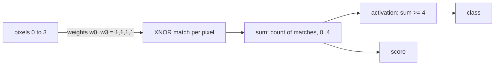

(b) The hardware, by construct (registers from `designs/vision_all_lit/rtl/vision_all_lit.v`):
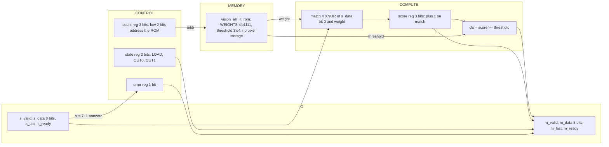

(c) Network concept to RTL:

| Network concept | RTL |
|---|---|
| input pixel | `s_data[0]` |
| weight | `weight` from `vision_all_lit_rom` (`WEIGHTS[addr]`) |
| multiply (1-bit) | `match = ~(s_data[0] ^ weight)` |
| weighted sum, weight index | `score` (3 bits, +1 on match); `count[1:0]` addresses the ROM |
| activation | `cls = (score >= threshold)` |

(d) Stream: 4 input beats, 2 output beats, `input_max` 1, latency 1 (`spec.json`). The score is unsigned 0..4.

### 3.2 vision_block: convolution with weight reuse and pooling
Task (`spec.json`): 3x3 one-bit image, label 1 when some 2x2 window is fully lit; one 2x2 binary kernel neuron reused
at four positions, then OR max-pooling.
(a) The network:
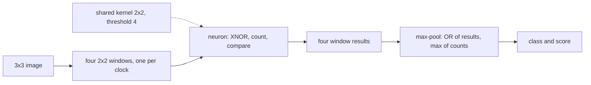

(b) The hardware (`designs/vision_block/rtl/vision_block.v`); one neuron used four times, one window per clock:
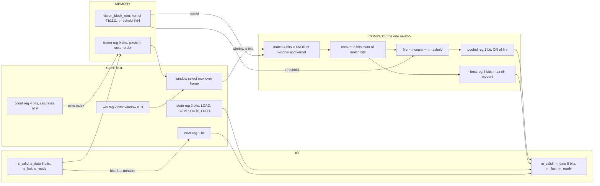

(c) Network concept to RTL:

| Network concept | RTL |
|---|---|
| input image | `frame[8:0]`, filled at `frame[count]` |
| kernel (shared weights) | `kernel[3:0]` from `vision_block_rom` |
| multiply | `match = ~(window ^ kernel)` |
| sum, threshold, activation | `mcount`; `fire = (mcount >= threshold)` |
| max-pooling | class: `pooled` ORs `fire`; score: `best` keeps the largest `mcount`; `win` steps the windows |

(d) Stream: 9 input beats, 2 output beats, `input_max` 1, latency 5 (`spec.json`): the accepting edge plus the four
`ST_COMP` window evaluations. Score is the largest window match count, 0..4.

### 3.3 text_sentiment: embedding lookup and accumulation
Task (`spec.json`): four tokens (PAD, GOOD, FINE, BAD); label 1 when GOOD outnumbers BAD; a signed embedding per token,
a four-term sum, class = sum > 0.
(a) The network:
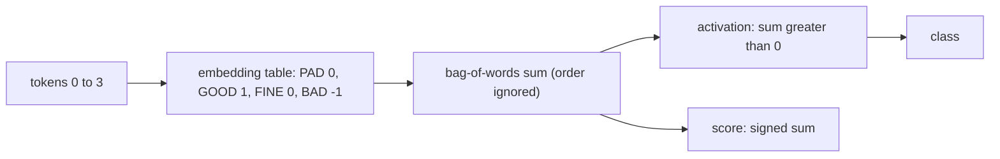

(b) The hardware (`designs/text_sentiment/rtl/text_sentiment.v`):
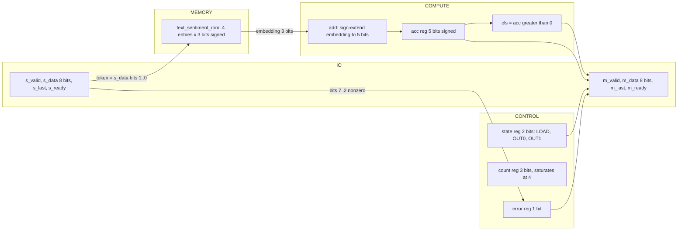

(c) Network concept to RTL:

| Network concept | RTL |
|---|---|
| token id | `s_data[1:0]` |
| embedding table | `text_sentiment_rom`: `E0..E3`, 3-bit signed |
| bag-of-words sum | `acc <= acc + sign-extended embedding` |
| activation | `cls = (acc > 5'sd0)` (a sum of 0 is negative) |

(d) Stream: 4 input beats, 2 output beats, `input_max` 3, latency 1 (`spec.json`). Accumulator range -16..12 by
width, so four 3-bit signed terms cannot overflow.

## 4. tiny_ai_core
**Build status: hardened, and placed in `user_project_wrapper`, both signoff-clean** (`designs/tiny_ai_core/output/`,
`designs/user_project_wrapper/output/`). Simplified for learning (owner decision 2026-10-06): only the Wishbone bus and
the interrupt leave the core (109 signal pins), on a 250 x 250 um die hardened against the template's Caravel macro
constraints. Core: Magic and KLayout DRC 0, LVS 0, XOR 0, antenna 0, worst setup +1.46 ns and hold +0.105 ns over all
corners, 109 of 109 RTL registers surviving; 195 max-slew violations reported, mostly on nets driven directly by
Wishbone input ports whose Caravel input transition already exceeds the limit. Wrapper: all of these 0, including
max-slew. The Wishbone testbench (784 cases, 39,956 checks) passes on the RTL, synthesised and routed netlists of the
core and of the wrapper. Not yet done: full-Caravel simulation and the ChipFoundry precheck.

`tiny_ai_core` puts the three engines (instances `u_vision_all_lit`, `u_vision_block`, `u_text_sentiment`, unchanged)
behind one Wishbone register window: exactly three compute nodes (`SPEC.md`, chip hierarchy).

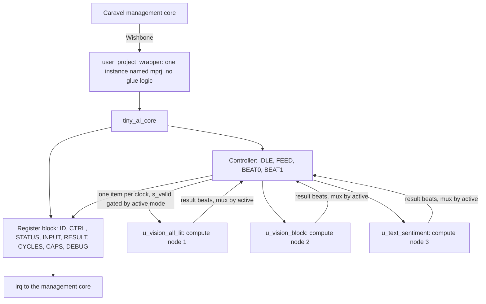

The register block and controller share one module (`tiny_ai_core.v`); they are split here by role. Only the engine
selected by `active` (the mode latched at START) gets `s_valid` and `m_ready`; results are muxed by `active`. The 18-bit
`buffer` (9 inputs x 2 bits) lets software push inputs at bus speed while an engine consumes one per clock.

### Register map
Base `0x3000_0000`, 256-byte window, byte offsets (header of `tiny_ai_core.v`):
| Offset | Name | Access | Fields |
|---|---|---|---|
| 0x00 | ID | R | 0x54414901 |
| 0x04 | CTRL | RW | [1:0] mode (byte lane 0). Write bit 8 START, bit 9 CLEAR (byte lane 1, self-clearing, read 0) |
| 0x08 | STATUS | R | [0] BUSY, [1] DONE, [2] ERROR, [5:4] active mode, [11:8] input count |
| 0x0C | INPUT | W | [7:0] one input, pushed only while idle (byte lane 0) |
| 0x10 | RESULT | R | [0] class, [15:8] signed debug score |
| 0x14 | CYCLES | R | clock edges from the edge that accepts START to the edge that commits the result (8 bits used) |
| 0x18 | CAPS | R | [2:0] supported modes 3'b111, [11:8] maximum inputs 9, [23:16] RTL version 1 |
| 0x1C | DEBUG | R | [17:0] the input buffer, 2 bits per input, input 0 in bits [1:0] |

Modes: 0 = vision_all_lit (4 inputs), 1 = vision_block (9), 2 = text_sentiment (4); mode 3 is invalid. Protocol
violations (START or INPUT while busy, wrong input count, out-of-range input, a tenth input) set the sticky ERROR bit.

Observability: results are read over Wishbone (RESULT, STATUS, CYCLES) and `irq[0]` signals completion. The GPIO and
logic-analyser mirrors that `SPEC.md` describes were removed to keep the core simple (owner decision 2026-10-06).
`irq[0]`: one-clock pulse on commit.

### Run sequence
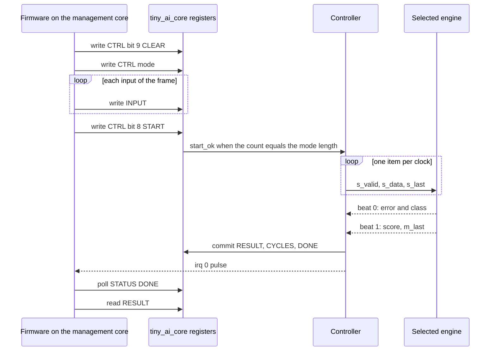

### Controller states
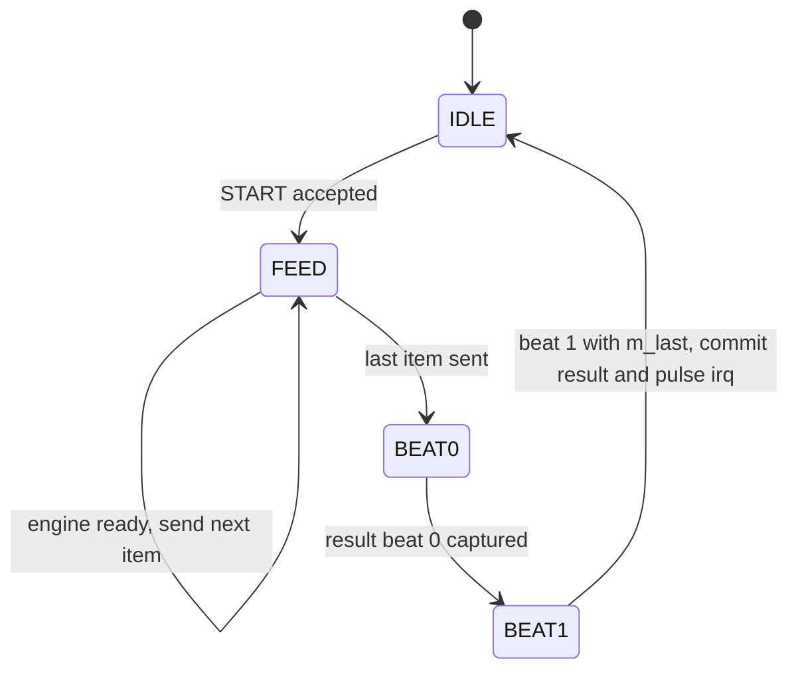

`ST_IDLE` waits for START, `ST_FEED` streams the buffer, `ST_BEAT0` waits for `{error, class}`, `ST_BEAT1` for the score.

## 5. Where the area goes
From `designs/<engine>/output/metrics.json`: std cells = `design__instance__count__stdcell` (includes tap cells, excludes
fill), flip-flops = `design__instance__count__class:sequential_cell`, die 80 x 80 um for all three (`design__die__bbox`).

| Engine | Std cells | Std-cell area (um^2) | Flip-flops (surviving) | RTL register bits |
|---|---|---|---|---|
| vision_all_lit | 169 | 1084.79 | 10 | 9 |
| vision_block | 297 | 2359.76 | 24 | 22 |
| text_sentiment | 200 | 1367.56 | 12 | 11 |

Surviving flip-flops exceed the RTL bit count because synthesis re-encoded `state` as one-hot (each `NOTES.md`).

Registers from each `NOTES.md`: vision_all_lit state 2, count 3, score 3, error 1; vision_block state 2, count 4,
frame 9, win 2, pooled 1, best 3, error 1; text_sentiment state 2, count 3, acc 5, error 1.

Qualitative reading (the repository records no per-construct area numbers; the register lists above are the only
split). MEMORY: the weight ROMs are constants (no flip-flops); the only data storage is `frame` (9 bits) in
`vision_block`, also the largest engine in cells and flip-flops. COMPUTE: an XNOR with a small counter or adder;
`vision_block` reuses one neuron over four cycles instead of replicating it. CONTROL: the FSM, `count`, `win` and
`error` are a large share of the flip-flops in every engine (read from the register lists, not measured).
`tiny_ai_core` (`designs/tiny_ai_core/output/metrics.json`): 1809 standard cells, of which 765 are tap cells
(physical-only; set by the 250 x 250 um die) and 1044 are logic: 573 combinational, 109 flip-flops, 245 timing-repair
buffers, 34 clock buffers, 31 inverters, 3 buffers, 49 antenna cells. Within the `SPEC.md` budgets of at most 2,500
standard cells excluding fill and at most 128 sequential cells. (The earlier 400 x 400 um version with the full Caravel
pin list had 3,521 cells, 2,115 of them tap cells: shrinking the interface shrank the die and halved the cell count.)

## 6. Scaling to real networks
The mappings follow `docs/WHY_AI.md` section 10; no figures are given because none are measured here.

| In this repository | In a large accelerator |
|---|---|
| Weight ROM (`*_rom.v`, a few constants) | Weights in on-chip SRAM or off-chip DRAM; moving weights is the dominant cost of real AI chips |
| One neuron (XNOR, count, compare) | A multiply-accumulate (MAC) unit with multi-bit weights |
| `vision_all_lit`: one neuron over all inputs | A dense (fully connected) layer: many neurons, each with its own weight per input, as a MAC array |
| `vision_block`: one kernel reused at four windows, one per clock | A convolution layer: one kernel slid over the image; compute, time and memory trade off |
| OR max-pooling over window results | Pooling layers |
| `text_sentiment` embedding lookup and sum | Embedding tables in language models; the sum is a bag-of-words reduction |

- MAC and systolic arrays: `vision_block` is the serial extreme (one neuron, four cycles); four neurons would finish
  in one cycle, trading area for time. `frame` plus the window mux is the small form of systolic data movement.
- Attention: summing embeddings ignores word order; attention restores it (`docs/WHY_AI.md` section 7, a tiny
  transformer). Audio on a stream: `docs/WHY_AI.md` section 6 (computed, not built). Precision: section 8 compares
  fp32, bf16, fp16, fp8, int8, int4 and 1-bit on one trained model.
