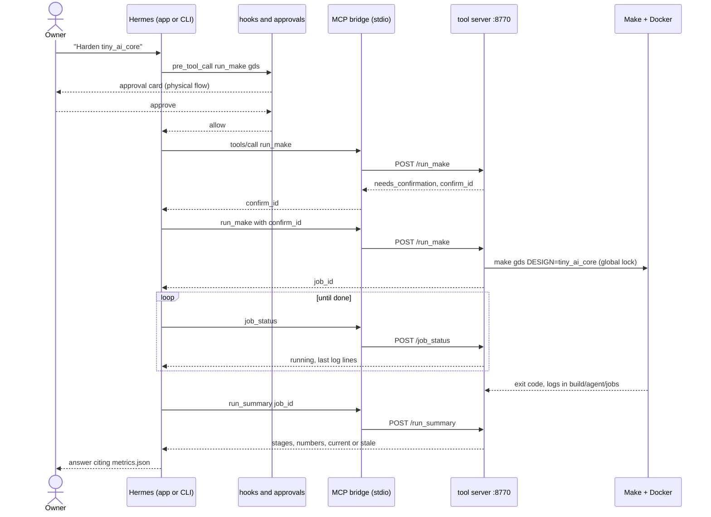

# Hermes Agent and open-ai-chip: integration map and workflow

How the owner's installed Nous Research Hermes Agent (CLI, TUI, desktop app, ACP) is meant to work with this repo, which
Hermes feature maps to which repo artefact, and the day-to-day workflow. Written from the vendored Hermes docs and
`hermes <cmd> --help` on this Mac, plus read-only dry runs (`hermes verify --detect-only`, `hermes approvals test`).
Nothing under `~/.hermes` was changed to produce it.

**Start with [hermes-agents.md](../hermes-agents.md)**: the same integration top down (goal, mental model, the chip-design loop with the agent at each step, the four speeds of a request, every part, workflows, measured numbers). This page is the reference below it: Hermes feature by feature, the exact config, the hook decision table.

**Status vocabulary** (used in every table): `verified` = tried on this Mac and seen to work; `built` = file exists in this
repo but not yet exercised through Hermes Agent; `planned` = nothing exists yet. Two more for the `chip` profile work:
`verified in isolated home` = applied to a throw-away Hermes home (`build/hermes_test_home/`, selected with `HERMES_HOME`) and
checked with the real `hermes` binary, and `pending owner apply` = needs the owner to run `bash scripts/hermes_agent_setup.sh --apply`
against the real `~/.hermes`. The real `~/.hermes` has not been modified by any of this work.

Narrated demos to run inside Hermes.app ("run demo 4"): [HERMES_DEMOS.md](HERMES_DEMOS.md).

### Status of the `chip` profile work (setup script, hook, cron, recipe)

| Item | File | Status |
|---|---|---|
| Setup script (dry-run diff, `--apply` with backup, `--uninstall`, idempotent) | `scripts/hermes_agent_setup.sh`, `scripts/hermes/setup_profile.py` | built; verified in isolated home (apply, re-run unchanged, uninstall, re-apply); pending owner apply |
| Profile `chip`: model `qwen3.5-64k:9b` on the local Ollama URL, toolsets `skills` `session_search` only (no `file`, no terminal), `tools.tool_search.enabled: "off"` (measured: 1/8 -> 8/8 tool-calling cases, `build/agent/tool_eval_PLAN.md` section 6) | written by the script into `<home>/profiles/chip/config.yaml` | verified in isolated home (`hermes -p chip status`, `tools list`); pending owner apply |
| `mcp_servers.chip` (bridge) with `tools.include` = the `core` list (38) plus the `ask_claude` / `claude_status` aliases from `tools/hermes_tools.json` (`--demo-tools` adds 5: log_digest, param_info, propose_change, whatif_run, whatif_result) | same config, bridge `tools/hermes_mcp_bridge.py` | verified in isolated home (`hermes -p chip mcp test chip` lists the 36 tools); pending owner apply |
| `skills.external_dirs` to `.claude/skills` | same config | built; pending owner apply |
| Approvals: `mode: manual`, deny globs (`cf`, `git push`, `rm -rf`, `docker run`, direct `make gds/flow-all/precheck/...`, edits under `designs/ shared/ model/`) | same config | verified in isolated home (`hermes -p chip approvals test` returns `user-deny`, exit 3); pending owner apply |
| `pre_tool_call` hook | `scripts/hermes/hooks/pre_tool_call.py`, tests `tests/tools/test_hermes_hook.py` | built; verified in isolated home (`hermes -p chip hooks test`, `hooks doctor`, a live session); pending owner apply |
| Hook consent entry (pre-approves exactly the one hook command for the profile) | `<home>/profiles/chip/shell-hooks-allowlist.json` | verified in isolated home; pending owner apply |
| Project `open-ai-chip` (repo as primary folder; `../open-ai-silicon` not added, reference only) | `hermes project create` | verified in isolated home; pending owner apply |
| Cron: nightly 02:30 `make test`, Sunday 03:00 `make test-full`, `--no-agent`, `--deliver local` | `scripts/hermes/cron_run.sh`, wrappers in `<home>/profiles/chip/scripts/` | built; jobs created and listed in isolated home; the scheduler needs a running Hermes gateway (not started); pending owner apply |
| `hermes verify` recipe = `make test` only | `.hermes/environment.json` (repo, written by the script) | built |
| "For Hermes" section | `CLAUDE.md` | built |
| `.hermes.md` (the one context file Hermes reads; generated, checked by `make test`) | `scripts/docs/make_hermes_context.py`, `make master-prompt` | built; verified in isolated home |
| Confirm guard: a gated call with a `confirm_id` is blocked unless the USER's latest message says "yes, run <id>" | `scripts/hermes/hooks/confirm_guard.py`, called first by `pre_tool_call.py`; tests `tests/tools/test_hermes_confirm_guard.py`, `tests/tools/test_hermes_hook.py` | built; verified live in isolated home `build/hermes_final_home`: the model's own `confirm_run` was blocked 3 times, the user's "yes, run <id>" passed (`build/agent/hermes_hook.log`) |
| Demo models selectable in the picker (`providers.ollama-local`) | `scripts/hermes/setup_profile.py` | verified in isolated home (picker data lists the 5 models); see "Models for demos" |
| Plugin `open-ai-chip`: slash commands (`/klayout /magic /gds /synth /timing /drc /lvs /signoff /run /rebuild /jobs ...`, no model turn) and a `pre_llm_call` router (opens layouts, number facts, run confirm ids) | `scripts/hermes/plugin/open-ai-chip/`, tool server `POST /quick` (`quick_tools.py`), linked by the setup script (`plugins.enabled`) | verified in isolated home through Hermes's own command dispatch (0.1 to 2.5 s) and `hermes -z`; pending owner apply |
| Loop and harness demos `/loop signoff|layers|sim`, `/harness names|facts` (existing designs only, trace printed as PLAN/ACT/OBSERVE/CHECK/STOP) | `quick_tools.py` (`loop_*`, `harness_*`), plugin commands `loop`, `harness` | verified in process (`tests/tools/test_quick_tools.py`; `/loop layers` 7.2 s and `/loop sim` 2.0 s live, `examples/hermes_desktop/eval_tools/speed_results.json`) |
| RAG speed: index and embedding model warmed at tool-server start, no blocking re-embed on the first question, `keep_alive` 30 min | `rag_tools.py` (`warm`, `install`, `_ensure`, `_background_build`) | verified: first question 1.13 s cold, 0.12 s warm (`speed_results.json`) |
| Fifteen demos by name (12 to 15: instant commands, GUI tour, loop, harness) | `.claude/skills/chip-demos/SKILL.md`, [HERMES_DEMOS.md](HERMES_DEMOS.md) | built; demos 1 to 3 verified in isolated home |
| Local Grafana (Homebrew, 127.0.0.1:3000) with 3 dashboards of the repo evidence, and a read-only Grafana MCP server entry (`mcp_servers.grafana`, Viewer token from the Keychain) | `scripts/grafana/`, `scripts/hermes/grafana_mcp.{sh,json}`, [GRAFANA.md](GRAFANA.md), `tests/tools/test_grafana_export.py` | built; verified in isolated home `build/hermes_grafana_home` (`hermes mcp test grafana`, two live questions); merged as `scripts/hermes_agent_setup.sh --grafana` (opt-in; hook allows only the four read tools); pending owner apply |

## 1. What Hermes Agent is, and what is installed here

Hermes Agent is Nous Research's open-source (MIT) self-improving agent: a tool-calling loop with a TUI/CLI, a native
Electron desktop app, a messaging gateway (Telegram, Discord, Slack, WhatsApp, Signal, ...), skills, memory, cron, MCP client
and server, hooks, plugins, kanban and subagents. It is a different program from this repo's own "Hermes chip agent"
(Open WebUI + `hermes3:8b`, `docs/HERMES_DESKTOP.md`); the name overlap is only the model family.

| Fact | Value | Source |
|---|---|---|
| Version | v0.21.5+8146.g80cf518 (2026.9.24), git install | `hermes --version` |
| Binaries / app | `hermes`, `hermes-agent`, `hermes-acp` in `~/.local/bin`; `/Applications/Hermes.app` | owner |
| Source and docs | `~/.hermes/hermes-agent` (docs under `website/docs/`) | read-only |
| Default model now | `qwen3.5-64k:9b`, provider `custom`, base URL `http://127.0.0.1:11434/v1` | `~/.hermes/config.yaml` keys `model.*` (names only) |
| Local or cloud | **local** (Ollama on loopback). No cloud provider is the default. A second custom provider entry points at local `qwen3-vl:8b`. | same |
| `hermes3:8b` | installed in Ollama (`ollama list`) but it is the repo's Open WebUI model, not Hermes Agent's configured default | `ollama list` |
| Memory | `memory_enabled: false` (built-in MEMORY.md/USER.md off) | `config.yaml` `memory:` |
| Disabled toolsets | `code_execution`, `computer_use`, `delegation`, `kanban`, `image_gen`, Discord/Feishu/Home Assistant | `config.yaml` `agent.disabled_toolsets` |
| CLI toolsets enabled | `browser`, `connections`, `file`, `skills`, `todo` (no `terminal`, no `web`) | `config.yaml` `platform_toolsets.cli` |
| Hooks, user skills in `~/.hermes/hooks` and `desktop-plugins` | empty; `~/.hermes/skills` holds the bundled catalog | `ls ~/.hermes` |
| MCP servers configured | none (`mcp_servers` key absent) | `grep mcp config.yaml` |

Repo rule: local by default. The current default satisfies it. Any cloud provider (`hermes model`, `hermes fallback add`,
`hermes portal`) or messaging gateway would be an owner decision, and the repo should keep a test that fails if a
cloud base URL becomes the default for repo sessions (planned, `hermes config get model.base_url`).

## 2. Architecture

```mermaid
flowchart TB
  subgraph FE[Front ends, same agent core]
    APP[Hermes.app desktop]
    CLI[hermes CLI / --tui]
    ACP[hermes acp, editors]
  end
  APP --> CORE
  CLI --> CORE
  ACP --> CORE
  CORE[Hermes Agent loop<br/>local Ollama model, 127.0.0.1:11434]
  CORE -->|reads from cwd| CTX[.hermes.md context file in repo<br/>repo skills via skills.external_dirs]
  CORE -->|MCP client, mcp_servers.chip| BR[tools/hermes_mcp_bridge.py<br/>stdio MCP server]
  BR -->|HTTP 127.0.0.1:8770| TS[examples/hermes_desktop/tool_server<br/>about 45 tools]
  TS --> F[(repo files: designs/*/output,<br/>docs, NOTES.md)]
  TS --> J[make jobs, one flow at a time]
  J --> D[LibreLane in Docker]
  TS --> G[KLayout and Magic windows]
  TS --> M[(build/agent/memory)]
  CORE -. pre_tool_call .-> H[hooks: block / escalate<br/>HARD RULES]
  CORE -. approvals.deny, command_allowlist .-> AP[approvals]
  CORE -. cron, hermes send .-> CR[nightly checks, opt-in notify]
```

Notes on the picture:

- **Context file.** Hermes loads exactly one project context file per session, first match wins:
  `.hermes.md`, `AGENTS.override.md`, `AGENTS.md`, `CLAUDE.md`, `.cursorrules` (`user-guide/features/context-files.md`).
  `HERMES.md` is also accepted at the top priority. This repo has only `CLAUDE.md`, so today Hermes already reads
  `CLAUDE.md` (HARD RULES included) when started in the repo. Adding `AGENTS.md` or `.hermes.md` would *replace* it, not add
  to it, so a new file must itself carry the HARD RULES summary or tell the agent to read `CLAUDE.md`.
- **Skills.** Hermes reads agentskills.io-style `SKILL.md` (frontmatter `name`, `description`). The repo's ten
  `.claude/skills/*/SKILL.md` use that shape. Hermes scans `<repo>/.hermes/skills` and `<repo>/.agents/skills` only for
  *trusted* repos (`hermes skills trust`), not `.claude/skills`; the way to load them is `skills.external_dirs`.
- **MCP.** Hermes is an MCP client (`mcp_servers:` in `~/.hermes/config.yaml`, stdio or HTTP, `tools.include/exclude`
  filters, `${workspaceFolder}` substitution). There is no per-project MCP file. The repo tool server speaks OpenAPI/HTTP,
  which Hermes does not consume, so a stdio MCP bridge is needed.
- **Terminal toolset is off** in the owner's CLI profile, so a Hermes session cannot run `make` or `docker` by itself;
  every action goes through the gated MCP tools. This is the safest default and the plan keeps it.

## 3. Feature map

Columns: repo artefact needed, change needed in `~/.hermes` (owner approval), risk, effort (S under 1 h, M a few hours,
L a day or more), status.

| Hermes feature | How it applies to open-ai-chip | Repo-local artefact | `~/.hermes` change | Risk | Effort | Status |
|---|---|---|---|---|---|---|
| Chat modes: CLI, `--tui`, desktop app, ACP (`hermes acp`) | All four share one core. Start in the repo with `hermes --in <repo>` or open the folder in Hermes.app. ACP lets an editor (Zed, VS Code, JetBrains) use the same agent with the `hermes-acp` toolset (no cron, no kanban). | none | none | low | S | planned |
| Models and providers (`hermes model`, `fallback`, `moa`) | Keep local Ollama. Repo needs a model that can tool-call reliably; the repo's own eval found `hermes3:8b` 13/15 in prompt mode and 6/15 native (`docs/HERMES_AGENT.md`), so measure `qwen3.5-64k:9b` with the same eval before trusting it. | `tools/eval/` run against Hermes Agent via `hermes -z` | none | medium: small local models mis-call tools | M | planned |
| Toolsets (`hermes tools`, `-t`) | Run repo sessions with `file`, `skills`, `todo` plus MCP `chip`; leave `terminal`, `code_execution`, `delegation` off. | none | none (already so for `cli`) | low | S | built; verified in isolated home; pending owner apply |
| MCP client | Register the repo bridge as `mcp_servers.chip` (stdio). `tools.include` lists the read tools and the gated run tools; `tools.exclude` hides `claude_task`. Also register the existing `tools/mcp_server.py` (10 read-only EDA tools) as the zero-effort first step. | `tools/hermes_mcp_bridge.py` (new); config snippet in `scripts/hermes_agent_setup.sh` | add `mcp_servers.chip` | medium: bridge must not widen the tool server's gates | M | built; verified in isolated home; pending owner apply |
| MCP server (`hermes mcp serve`) | Exposes Hermes conversations to other agents. Not needed for the repo. | none | none | n/a | n/a | not used |
| Skills | The ten `.claude/skills` load unchanged through `skills.external_dirs` (no conversion). Slash use: `/harden-design`, `/tune-timing-sdc`, `/whatif-experiment`. Caveat: Hermes's own authoring standard wants short descriptions (60 chars) but loading is not blocked by longer ones (`SKILL_PROMPT_DESC_LIMIT` truncates in the prompt index), so the long trigger descriptions get cut in the index. `hermes skills trust` is only for `.hermes/skills` / `.agents/skills`. | optional symlink `.agents/skills -> ../.claude/skills` as an alternative | add `skills.external_dirs: [<repo>/.claude/skills]` | low | S | built; pending owner apply (config key written by the setup script) |
| `hermes import-agent claude-code` | One-shot import of `~/.claude` skills, `Bash(...)` allow/deny into `command_allowlist` / `approvals.deny`, MCP servers, global CLAUDE.md into memory. Use `--dry-run` first. Broader than needed, so prefer the explicit snippets in section 6. | none | writes many keys | medium: imports the owner's other Claude settings | S | planned, optional |
| Context file | Today `CLAUDE.md` is read. Planned: a short generated `.hermes.md` (or `AGENTS.md`) from `tools/prompts/master_prompt.txt` plus `docs/AGENT_CONTEXT.md`, containing the HARD RULES, the MCP tool names, "one flow at a time". Subdirectory `AGENTS.md` files are discovered progressively when the agent reads those dirs (candidate: `designs/AGENTS.md`). `SOUL.md` is global (`~/.hermes/SOUL.md`), leave alone. Hermes scans context files for prompt injection and truncates to `context_file_max_chars`. | `.hermes.md`, generator step in `make master-prompt` | none | low: file must stay in sync with CLAUDE.md | S | decided (owner): no `.hermes.md`/`AGENTS.md`, because it would shadow `CLAUDE.md`; a short "For Hermes" section in `CLAUDE.md` is built |
| Memory (MEMORY.md, USER.md, `hermes memory`) | Global per `HERMES_HOME`, 2,200 and 1,375 chars, off in this install, not per project. Do not rely on it for project facts. Use the repo's own `remember`/`recall` tools (`build/agent/memory/`, never committed) for decisions and run history, and `session_search` for past chats. | none (tool server memory tools exist) | none | low | S | built (tool server), not exercised via Hermes |
| Projects (`hermes project`) | Named multi-folder workspaces that group desktop sessions. Create `open-ai-chip` with the repo as primary folder; optionally add `../open-ai-silicon` as a folder (reference only; the repo rule says never edit it, so keep it out). State is a per-profile DB (`~/.hermes/projects.db`). | none | creates a project row | low | S | built; verified in isolated home; pending owner apply |
| Worktrees (`hermes -w`, `/worktree new`, `hermes worktree list/prune`) | Isolated branch checkout per session. Good for edits that change `config.json` or RTL (staleness rules). Not a replacement for `build/whatif/` copies, which also avoid committed-run staleness. Needs a git repo (this one has `.git`). Hermes keeps worktrees under `.worktrees/` in the repo: add it to `.gitignore`. | `.gitignore` line | none | medium: `designs/*/runs` and `build/` are git-ignored, so a fresh worktree has no runs, no GDS, no Docker state | M | planned |
| Hooks: shell hooks (`hooks:` in config.yaml, `hermes hooks list/test/doctor`) | `pre_tool_call` hook with `fail_closed: true` that blocks edits touching HARD-RULE keys (`MAX_TRANSITION_CONSTRAINT`, `CLOCK_PERIOD`, `DISABLE_LVS`, `SYNTH_STRATEGY DELAY`, `fixed_dont_change`, generated ROM/`vectors.hex`, absolute home paths) and escalates `run_make` of physical targets to approval (`{"action":"approve"}`). `post_tool_call` hook after a finished job writes the run summary line. `pre_verify` hook can force `make test` before a session ends. Exit code 2 or `{"decision":"block"}` blocks. | `scripts/hermes/hooks/*.sh` (new) | add `hooks:` block; first-use consent in `~/.hermes/shell-hooks-allowlist.json` | medium: a buggy fail-closed hook blocks everything | M | built; verified in isolated home; pending owner apply |
| Approvals (`approvals.mode`, `approvals.deny`, `command_allowlist`, `hermes approvals test/suggest`) | Verified by dry run: `make gds`, `make test`, `docker run` and `cf push` all return `allow, no guard matched`; only `git push --force` asks. So the defaults do not protect this repo; add `approvals.deny` globs (`cf *`, `git push*`, `*DISABLE_LVS*`, `docker rm*`, `docker system prune*`) and rely on the hook for physical flows. `--yolo` and `-z` one-shot mode bypass prompts but not deny rules or the hardline list. | rule list in `scripts/hermes_agent_setup.sh` | add `approvals.deny`, keep `mode: manual` for repo sessions | high if skipped | S | built; verified in isolated home; pending owner apply |
| `hermes verify` | Verified: `hermes verify --detect-only` reads the Makefile and proposes recipe kind `make`, test `["make test","make check"]`, no start command, no port. `make check` needs a design and Docker results, so the saved recipe should be `make test` only. `--save` writes `.hermes/environment.json` into the repo (add to `.gitignore` or commit as the recipe). | `.hermes/environment.json` with `test: ["make test"]` | none | low | S | built (`.hermes/environment.json`, test = `make test` only) |
| Cron (`hermes cron create ... --workdir <repo>`) | Nightly `make test` (about 65 s, no Docker) and weekly `make test-full`; also script-only (no-LLM) jobs that run a command and deliver stdout. With `--workdir` the cron run loads the repo context file. Cron runs headless with `approvals.cron_mode: deny`, so it can only use allowed/non-dangerous commands; physical flows must stay manual. Needs the gateway scheduler or `hermes cron tick`; owner decides whether a gateway runs at all. | `scripts/hermes/nightly_test.sh` | creates `~/.hermes/cron/jobs.json` entries | medium: unattended runs, model cost is zero locally | M | built; jobs created in isolated home; needs a running scheduler; pending owner apply |
| Gateway, `hermes send`, webhooks, peer | Notify flow or nightly results to the owner's phone/channel with `hermes send -t <platform> -f build/...`. Strictly opt-in: it sends repo data to a third-party service and needs platform credentials. `webhook` could trigger a review job on events; `peer` links two machines' Hermes gateways. | `scripts/hermes/notify.sh` | needs configured platform (secrets, owner action) | high privacy; nothing leaves the Mac otherwise | M | planned, owner opt-in |
| Kanban (`hermes kanban`) | Work-item board per design (harden, notes, what-if sweeps) with worker profiles and a verifier lane. Disabled in the owner's config today, and the repo rule of one physical flow at a time makes parallel workers a poor fit. Use for non-flow tasks (NOTES refresh, doc checks). | board name `open-ai-chip` | enable `kanban` toolset | medium | L | planned, low priority |
| Subagents (`delegate_task`) and Mixture of Agents (`hermes moa`, `/moa`) | MoA: several local reference models advise, one aggregator acts; use for reviewing a failed run or a NOTES draft (`/moa review run_summary for kv_attn_n8`). Local models only; the aggregator carries the cost and tool calls. Subagents run in parallel, so they must never share the Docker flow. | MoA preset named `chip-review` | `hermes moa configure` | medium: 2 CPUs and 8 GB are shared with the flow container | M | planned |
| Checkpoints and `/rollback` | File-snapshot rollback of edits the agent made in a session; complements `git`. | none | none | low | S | planned |
| LSP | Post-write semantic diagnostics for `write_file`/`patch` when in a git repo (pyright etc., ~20 servers). Helps the Python models and scripts; no Verilog server is in the supported set per the docs summary read, so RTL still relies on `make test` lint. | none | `hermes lsp install pyright` | low | S | planned, optional |
| Desktop app plugins (`~/.hermes/desktop-plugins/<id>/plugin.js`, `@hermes/plugin-sdk`) | A plugin can add panes, pages with sidebar nav, status-bar items, palette commands, keybinds, themes, composer extensions, session-row decorations, settings pages, embedded external content and transcript directives; it can also ship a Python `plugin_api.py` backend. Repo uses: (a) a "Layout tools" pane embedding `tool_server/layout_panel.html` (already exists), (b) a status-bar chip showing the current job and last run verdict via the tool server `job_list`, (c) palette commands "Run make test", "Open GDS in KLayout". | `examples/hermes_desktop/hermes_plugin/plugin.js` (new, ESM, no build) | one file in `~/.hermes/desktop-plugins/chip/` | medium: plugin code runs in the app | M | planned |
| Plugins (Python, `~/.hermes/plugins`, `hermes plugins`) | Alternative to MCP: register the tool server's tools as native Hermes tools via `ctx.register_tool`. More coupling to Hermes internals than MCP; choose MCP unless a hook needs in-process access. | none | none | medium | M | not chosen |
| `--in DIR`, resume (`-c`, `--resume latest`), sessions | `hermes --in <repo> --resume latest` returns to the repo's last session; sessions are workspace-scoped; `hermes sessions export`, `hermes insights`, `hermes logs` give history and usage. | none | none | low | S | planned |
| Profiles (`hermes profile create chip --clone`) | A separate profile `chip` keeps the repo's MCP server, deny rules, hooks and local-only model away from the owner's other uses of Hermes (memory, gateway, cloud keys). **Recommended** over editing the default profile. `hermes -p chip` or a `chip` alias. | none | creates `~/.hermes/profiles/chip` | low | S | built; verified in isolated home; pending owner apply |
| Safe mode / yolo | `--safe-mode` disables config, rules, plugins and MCP (troubleshooting). `--yolo` must not be used with this repo; document it. | none | none | n/a | S | planned (doc only) |
| Egress, secrets, `hermes security audit` | `hermes security audit` scans the Hermes venv, plugins and pinned npx/uvx MCP servers via OSV.dev (network call, run only with owner consent). `egress` (iron-proxy) and `secrets` matter only if cloud keys are added. The bridge needs no secrets. | none | none | n/a | S | planned |
| `hermes status`, `doctor`, `dump`, `prompt-size` | Health checks; `prompt-size` tells how much of a small local model's context the repo context file plus 45 tool schemas costs. The tool schema count matters: use `tools.include` to expose only what a session needs. | none | none | low | S | planned |
| Voice, TTS, vision, image gen, browser, computer use, pets, skins, Spotify, X search | Not related to chip work. Vision could read `layout.png` with `qwen3-vl:8b` (local), but KLayout screenshots are served by the tool server already. | none | none | n/a | n/a | not applicable |

## 4. What is not applicable, and why

- Cloud providers, Nous Portal and its Tool Gateway: break the local-by-default rule; no repo need.
- Messaging platforms as a control surface (Telegram, Discord, WhatsApp, Slack): would put the ability to start Docker flows behind an
  external chat account. Notification only, and only if the owner opts in; never as a way to approve a run.
- `computer_use` (cua-driver desktop control), `code_execution`, `delegation` for flows: bypass the gated tools.
- Remote terminal backends (Docker, SSH, Modal, Daytona): the flow already uses the local Docker/colima socket and
  `FLOW_TIMEOUT`; moving it adds nothing.
- Hermes memory providers (honcho, mem0 ...): external services; the repo has its own local memory tools.
- Kanban swarms with parallel workers: conflicts with "one physical flow at a time".
- `hermes serve`, `dashboard`, `proxy`: duplicate what the tool server and Open WebUI already give, and widen the
  listening surface.
- Anything that publishes or submits: Hermes must never run `cf login/init/push/confirm` or change repo visibility
  (CLAUDE.md HARD RULES). These are denied by rule, not merely unlisted.

## 5. The owner's workflow

### 5.1 One-time setup (`built`; verified in an isolated home; pending owner apply)

The helper is `scripts/hermes_agent_setup.sh` (logic in `scripts/hermes/setup_profile.py`, Python standard library only). It
defaults to a dry run, never reads `.env`, `auth.json`, `pairing/` or any secret, copies no key (from the existing config it
takes only `provider` and `base_url`, and only when the URL is loopback), and changes only the new `chip` profile.

```bash
bash scripts/hermes_agent_setup.sh                       # 1. review: unified diff of every file + the exact hermes commands, writes nothing
bash scripts/hermes_agent_setup.sh --apply               # 2. backup to ~/.hermes/backups/open-ai-chip-<timestamp>/, then apply
bash scripts/hermes_agent_setup.sh --uninstall           # plan the undo from the latest backup
bash scripts/hermes_agent_setup.sh --uninstall --apply   # undo (cron jobs removed, profile deleted if the script created it, files restored)
# to rehearse without touching ~/.hermes, add: --hermes-home build/hermes_test_home
```

What `--apply` does, in order: backup of every file it will touch (with a manifest); `hermes profile create chip --no-alias
--no-skills` if the profile is missing; write `<home>/profiles/chip/config.yaml` (a marked managed block replaces the keys
`model agent platform_toolsets mcp_servers skills approvals hooks memory`, other keys are kept), the hook consent file and two
cron wrapper scripts; `hermes -p chip project create open-ai-chip <repo> --primary <repo>`; two `hermes -p chip cron create`
jobs (`--no-agent --deliver local --workdir <repo>`); write `<repo>/.hermes/environment.json`. Re-running changes nothing.
It warns (does not refuse) when a Hermes process looks active.

Then check:

```bash
hermes -p chip status
hermes -p chip tools list                       # file, skills, session_search on; terminal off; MCP chip with the include list
hermes -p chip mcp test chip                    # starts the bridge, lists the tools
hermes -p chip hooks doctor                     # hook allowlisted, valid JSON
hermes -p chip approvals test -- "cf push"      # expect user-deny, exit 3
hermes -p chip --in "$PWD"                      # start a read-only repo session (or open the folder in Hermes.app)
hermes -p chip cron list                        # the two jobs; hermes -p chip cron run <id> runs one on the next tick
```

Cron jobs fire only while a Hermes scheduler is running (the gateway process ticks every 60 s; `hermes -p chip cron status`).
Starting a gateway with no messaging platform configured is the owner's decision (`hermes -p chip gateway`); until then
`hermes -p chip cron tick` or `bash scripts/hermes/cron_run.sh test` run the same job by hand. Results go to
`build/agent/cron/<kind>_<timestamp>.log` and one line in the repo run history (`build/agent/memory/runs.md`); nothing is sent anywhere.
To use the profile in Hermes.app, pick the `chip` profile; `--no-alias` was used so no wrapper is added to `~/.local/bin`
(`hermes profile alias chip` adds one).

### 5.2 Typical sessions

Each walk-through lists the prompt, then what happens. Tool names are the real names from
`examples/hermes_desktop/tool_server/README.md`. Whole-workflow status: `planned` until the bridge exists.

**A. Ask about a design (status: planned; the underlying tools are built)**
1. Prompt: "Which design has the lowest worst setup slack, and is its committed run current?"
2. Hermes reads `.hermes.md`/`CLAUDE.md`, picks `compare_designs` and `run_summary`.
3. The bridge forwards each call to `127.0.0.1:8770`; results come from `designs/*/output/metrics.json`.
4. The answer cites the file; `notes_section` quotes NOTES.md when asked "why".

**B. Look at a layout (planned)**
1. Prompt: "Open kv_attn_n8 in KLayout, show met3 and met4."
2. `klayout_view` renders offscreen and returns a PNG URL (shown in the desktop app transcript); `open_gds` opens the real
   KLayout or Magic window on the Mac.
3. No approval is needed (read-only). Needs `build/results/<d>/<top>.gds`.

**C. Run a flow (planned)**
1. Prompt: "Harden tiny_ai_core."
2. Hermes loads the `harden-design` skill and calls `skill_plan`, then `run_make {target: "gds", design: "tiny_ai_core"}`.
3. The `pre_tool_call` hook sees a physical target and answers `{"action":"approve"}`; Hermes.app shows an approval card
   (CLI: Y/N prompt). Deny or timeout (300 s default) means nothing runs.
4. The tool server's own two-step gate returns `needs_confirmation` and a `confirm_id`; Hermes calls again with it. (Two
   gates: Hermes approval for the human, confirm id for the tool server. The planned bridge keeps the second one.)
5. Job starts (`job_id`); the global lock allows one physical flow at a time; Docker runs LibreLane under `FLOW_TIMEOUT`.
6. Hermes polls `job_status`; on `done`, `run_summary {job_id}` returns stages, key numbers, stale-or-current and the diff
   against committed metrics. A `post_tool_call` hook appends one line to `build/agent/memory/runs.md`.

**D. A flow failed (planned)**
1. Prompt: "That failed, why?"
2. `diagnose {job_id}` matches the logs to the harden-design failure table (`reference.md`) with evidence and fix;
   `read_log {which, grep, around}` and `log_digest` show the raw lines.
3. `suggest {design}` proposes next steps. It never edits anything. Edits go through the owner or through a Claude Code
   session; Hermes sessions have `file` tools but the hook blocks HARD-RULE edits.

**E. Skill plus what-if (planned)**
1. Prompt: "/tune-timing-sdc what happens to kv_attn_n8 if PL_RESIZER_SETUP_SLACK_MARGIN goes up a bit?"
2. The skill says to use the whatif path: `param_info` (is the key allowed), `propose_change` (HARD-RULE check, nothing
   written), then the owner confirms, then `whatif_run` on a copy under `build/whatif/<design>__<tag>/` (a physical flow,
   so same approval as C), `whatif_result` for the comparison table. `designs/<d>/` and its committed run are never touched.
3. A sweep uses `whatif_sweep`; flows run one after another.

**F. Memory of decisions and run history (built tools, planned wiring)**
1. Prompt: "Remember that we chose density 60 for prec_fp16 because of congestion."
2. `remember {note, topic}` writes `build/agent/memory/<topic>.md` (git-ignored); `recall`/`memory_digest`/`context_brief`
   feed later sessions; `show_context` and `proof_local` show what the model was given and that nothing left the Mac.
3. Hermes's own MEMORY.md stays off (global, 2,200 chars); `session_search` finds old chats.

**G. Scheduled nightly check (built; pending owner apply; needs a running Hermes scheduler)**
1. The setup script runs `hermes -p chip cron create '30 2 * * *' --name 'open-ai-chip nightly make test' --no-agent --script
   chip_nightly_test.sh --deliver local --workdir <repo>` and the same for Sunday 03:00 with `make test-full`. The wrapper in
   `<home>/profiles/chip/scripts/` calls `scripts/hermes/cron_run.sh`; no-agent mode delivers script stdout without the LLM.
2. `cron_run.sh` runs `make test` (about 65 s, no Docker) under a 900 s cap (`test-full` 7200 s), prints a short verdict, keeps the
   log in `build/agent/cron/` and appends one line to `build/agent/memory/runs.md`.
3. Delivery is local (`~/.hermes/profiles/chip/cron/output`); the owner can later add `hermes send` to a platform.
4. Cron has `approvals.cron_mode: deny`, so it cannot start a physical flow even if the script were changed.

**H. Optional notification (planned, opt-in)**
`hermes send -t <platform> -s "open-ai-chip nightly" -f build/agent/nightly.txt` from the end of the nightly script, only
after the owner configures a platform. Message text is the verdict and numbers, never files or logs with paths.

### 5.3 One request end to end



## 6. Safety: allowed, approval, denied

| Class | Actions | Enforced by | Status |
|---|---|---|---|
| Allowed, no prompt | read tools (`list_designs`, `read_metrics`, `compare_designs`, `layout_summary`, `layer_stats`, `find_pins`, `signoff_summary`, `search_docs`, `notes_section`, `explain`, `list_logs`, `read_log`, `log_digest`, `run_summary`, `diagnose`, `suggest`, `capability_map`, `proof_local`, memory tools), view tools (`klayout_view`, `render_png`, `open_gds`), `run_make` targets `doctor test simulate model-check check-generated` | MCP `tools.include`; tool server allow-list | planned |
| Needs approval | `run_make` targets `gds flow-all check gl gl-final views collect test-full soc-sim soc-kv adapter-test caravel-rtl caravel-gl`; `whatif_run`, `whatif_sweep`, `run_experiment`; any `write_file`/`patch` in `designs/` or `model/` | `pre_tool_call` hook returns `approve`; tool server `confirm_id` | planned |
| Denied | `cf login/init/push/confirm`, `git push*`, repo visibility changes, `docker rm/system prune`, `claude_task` from Hermes, edits containing `MAX_TRANSITION_CONSTRAINT`, `CLOCK_PERIOD` changes, `DISABLE_LVS`, `SYNTH_STRATEGY` DELAY, `ERROR_ON_SYNTH_CHECKS` false, writes to `designs/user_project_wrapper*/fixed_dont_change`, generated ROM `.v`, `vectors.hex`, `weights.json`, `../open-ai-silicon`, `tests/upstream.sha256` files, any absolute home path written into a committed file | `approvals.deny` globs (terminal-level) and a `fail_closed` hook (tool-level, argument inspection); tool server refuses non-listed targets and design names | planned |
| Never overridable by Hermes | `rm -rf /`, fork bombs, raw disk writes | Hermes hardline blocklist | verified in docs |
| Not a protection | `--yolo`, `approvals.mode: off`, `hermes -z` auto-bypass: they skip prompts but not deny rules or the hardline floor; still, do not use them in this repo | owner discipline | doc |

Why a hook and not only `approvals`: the dry run `hermes approvals test "make gds DESIGN=x"` printed `verdict: allow`,
so the built-in dangerous-command list does not know this repo's expensive commands. The HARD RULES are about file content
(config keys) as much as commands, which only a hook on `write_file`/`patch` arguments can see.

Config the setup script writes (`scripts/hermes/setup_profile.py` is the source of truth; no secrets; `<repo>` is the real
repo path at apply time; the full list of deny globs is in the script and in the dry-run diff):

```yaml
# <home>/profiles/chip/config.yaml (managed block, abridged)
model: {default: "qwen3.5-64k:9b", provider: "ollama-local", base_url: "http://127.0.0.1:11434/v1", context_length: 65536, ollama_num_ctx: 65536}
providers:
  ollama-local: {name: "Local Ollama (demo models)", api: "http://127.0.0.1:11434/v1", default_model: "qwen3.5-64k:9b", discover_models: false,
                 models: [qwen3.5-64k:9b, hermes3:8b, gemma3:4b-it-qat, gemma4:12b, mistral-nemo:latest]}
agent: {max_turns: 40, disabled_toolsets: [terminal, code_execution, delegation, memory, todo, cronjob, browser, web, ...]}
tools: {tool_search: {enabled: "off"}}
platform_toolsets: {cli: [skills, session_search], tui: [...same], acp: [...same]}
mcp_servers:
  chip:
    command: "<repo>/build/agent/venv/bin/python"
    args: ["<repo>/tools/hermes_mcp_bridge.py"]
    timeout: 300
    tools: {prompts: false, resources: false, include: [read_metrics, compare_designs, ..., run_make, confirm_run, ..., ask_claude, claude_status]}   # core (38) + aliases
skills: {external_dirs: ["<repo>/.claude/skills"]}
approvals:
  mode: manual
  cron_mode: deny
  deny: ["cf", "cf *", "git push*", "rm -rf*", "docker run*", "make gds*", "make flow-all*", "make precheck*",
         "*DISABLE_LVS*", "sed -i*designs/*", "*> designs/*", "..."]
hooks:
  pre_tool_call:
    - {command: "<repo>/scripts/hermes/hooks/pre_tool_call.py", timeout: 10, fail_closed: true}   # no matcher: sees every tool
```

The `include` list is `core` (38 names) plus the aliases of `tools/hermes_tools.json`. The `file` toolset is OFF: with it on, the model read
files instead of calling the MCP tools (measured, `build/agent/tool_eval_PLAN.md` section 6); the hook still blocks `write_file` and `patch` as defence in depth.
Hermes names MCP tools `mcp__chip__<tool>` (seen in `build/agent/hermes_hook.log`); the hook and the guard accept `mcp_chip_<tool>` too.
After any edit of `pre_tool_call.py` or `confirm_guard.py`, re-run the setup script with `--apply` (it refreshes the hook consent entry's mtime).

### Hook decisions (`scripts/hermes/hooks/pre_tool_call.py`, tests `tests/tools/test_hermes_hook.py`, 66 cases)

Protocol (read from `agent/shell_hooks.py`): JSON on stdin `{hook_event_name, tool_name, tool_input, session_id, cwd, profile,
extra}`; stdout `{}` allow, `{"action":"block","message":...}`, `{"action":"approve","message":...}` (escalate to the human
approval card); exit code 0; `fail_closed: true` so a crash blocks. The script also catches its own errors and answers block.
Every decision is appended to `build/agent/hermes_hook.log` (one JSON line: time, session, tool, decision, reason, short
summary; never file contents).

| Call | Decision | Why |
|---|---|---|
| `run_make`, `confirm_run`, `whatif_run`, `whatif_sweep`, `run_experiment`, `ask_claude`, `claude_task` WITH a `confirm_id` | block unless the user's latest message in that session says "yes, run <id>" (fail closed if state.db is unreadable) | the model confirmed its own run in 3 of 6 eval variants; `confirm_guard.py` reads the session from Hermes `state.db` and runs first |
| `write_file`, `patch` (any path, including `designs/ shared/ model/`, frozen files, `../open-ai-silicon`) | block | Hermes sessions do not edit repo files; the message names extra reasons (frozen, weakened key) |
| `skill_manage`, `execute_code`, `delegate_task`, `computer_use`, `cronjob_manage`, `manage_connections`, `send_message`, `memory`, `claude_task` | block | not part of the read-only profile |
| `read_file` / `search_files` on `.env`, `auth.json`, `pairing/`, `.ssh`, `.netrc`, `shell-hooks-allowlist.json` | block | secrets are never read by an agent |
| other `read_file`, `search_files`, `mcp_chip_*` read tools, `job_status`, `ask_claude`, `claude_status` | allow | `ask_claude` has its own confirm gate in the bridge (`ASK_CLAUDE_DECISION` in the hook switches it to approve) |
| `mcp_chip_run_make` with a physical target (`gds flow-all flow check gl gl-final views wrapper collect test-full soc-sim soc-kv adapter-test caravel-* precheck ...`) | approve (block if the design is frozen) | one flow at a time; the bridge confirm gate follows |
| `mcp_chip_run_make` with `test`, `doctor`, `simulate`, `check-generated`, ... | allow | cheap, no Docker |
| `mcp_chip_run_make` with any other target (`generate`, `table`, `clean`, unknown) | block | writes repo files or not on the allow-list |
| `mcp_chip_whatif_run`, `whatif_sweep`, `run_experiment` | approve (block if args set `DISABLE_LVS`, `SYNTH_STRATEGY DELAY`, `ERROR_ON_SYNTH_CHECKS` false) | physical flow on a copy; frozen designs are allowed because the copy lives in `build/whatif/` |
| `terminal` (not enabled in the profile; defence in depth): `cf ...`, `git push`, `git commit/add/...`, `rm -r/-f`, `docker run/exec/rm/system`, `gh repo edit/visibility` | block | HARD RULES and owner-only actions |
| `terminal`: `make gds/flow-all/precheck/...` | block, "use run_make" | physical flows go through the gated tool |
| `terminal`: `make generate/table/clean/freeze` | block | writes repo files |
| `terminal`: `make test`, `make doctor`, `make check-generated`, `ls`, `cat`, `grep` | allow | read-only |
| `terminal`: unknown `make <target>` | approve | not on the read-only list |
| `terminal`: sets `CLOCK_PERIOD`/`MAX_TRANSITION_CONSTRAINT`, mentions `DISABLE_LVS`, `SYNTH_STRATEGY DELAY`, `ERROR_ON_SYNTH_CHECKS` false | block | HARD RULES |
| `terminal`: `sed -i`, `tee`, `cp`, `mv`, redirects into the repo (outside `build/`) or `../open-ai-silicon` | block | no repo edits |
| any path that `scripts/flow/frozen.py is_frozen()` reports frozen, in a mutating command | block | freeze guard (when the module exists; no manifest means nothing is frozen) |

`approvals.deny` (Hermes core, terminal commands only) is a second layer for the same commands; `hermes approvals test`
shows its verdict without running anything.

### Models for demos

The owner wants a few more local models selectable "just for demo". Hermes (v0.21.5 source, `hermes_cli/model_switch_providers.py`, `website/docs/user-guide/configuring-models.md`):
a `providers:` entry of the config with `models: [...]` and `discover_models: false` is listed in the picker (`hermes model`, `/model`, the desktop model picker)
exactly as configured. The old `provider: custom` + `base_url` shows one "Custom endpoint" row with a live `/models` probe only for the current endpoint, so the setup script now writes
`providers.ollama-local` and points `model.provider` at it. Nothing is pulled and no cloud model is listed; the default stays `qwen3.5-64k:9b`.
Check (isolated home, picker data via `list_authenticated_providers`): one row "Local Ollama (demo models)", current, 5 models. Switch with the picker, `/model`, or `hermes -p chip -m <model> -z "..."`.

| Model (`ollama list`) | Size | Measured notes (2026-10-07, isolated home, prompt "How many standard cells does vision_block have?", `hermes -p chip -m <model> -z`) |
|---|---|---|
| `qwen3.5-64k:9b` (default) | 6.6 GB | The evaluated model: 51 of 58 cases = 87.9 % (`examples/hermes_desktop/eval_tools/results_summary_hermes.json`). Here: read_metrics, correct answer 297 (matches `metrics.json`), 65 s on a cold load |
| `hermes3:8b` | 4.7 GB | Not evaluated on this profile. Here: called skill_view, no answer (23 s). Hermes prints a warning that Hermes 3 is not agentic. Eval of the older Open WebUI path used it (`results_summary_direct.json`) |
| `gemma3:4b-it-qat` | 4.0 GB | No tool calls possible: Ollama answers HTTP 400 "registry.ollama.ai/library/gemma3:4b-it-qat does not support tools" (5 s). Use it only for plain chat, not for the demos |
| `gemma4:12b` | 7.6 GB | Not evaluated. Here: no tool call, answered about skills (39 s) |
| `mistral-nemo:latest` | 7.1 GB | Not evaluated. Here: no tool call, answered "73" (wrong; the real value is 297) (19 s). `ollama ps` showed context 4096, because the 65536 setting only matches the qwen3.5-64k Modelfile |

Take-away for a demo: use the default model for anything with tools; the others show the picker and how much the model matters.
Not tuned: per-model context length or tool settings for the four demo models.

## 7. Recommended integration plan, in order

Repo-local first (nothing outside the repo changes):

1. `tools/hermes_mcp_bridge.py` and `tools/hermes_tools.json`: built (another agent); `hermes -p chip mcp test chip` lists its tools (isolated home).
2. `scripts/hermes/hooks/pre_tool_call.py` with `tests/tools/test_hermes_hook.py`: built; verified in isolated home. (A `post_run` hook was
   dropped: run history is written by `scripts/hermes/cron_run.sh` and by the tool server's job manager.)
3. `.hermes.md`: not built, by decision (it would shadow `CLAUDE.md`); `CLAUDE.md` has a short "For Hermes" section.
4. `.hermes/environment.json` (test = `make test` only): built (written by the setup script). Decide whether to commit it or ignore `.hermes/`.
5. `scripts/hermes_agent_setup.sh` (dry-run diff, `--apply`, backup, `--uninstall`): built; verified in isolated home.
6. `scripts/hermes/cron_run.sh` (nightly and weekly job body): built; the scheduler is not started by the script.
7. `examples/hermes_desktop/hermes_plugin/plugin.js` (Layout tools pane, job status chip, palette commands): planned.
8. Add `.worktrees/` to `.gitignore`: planned.

Then the owner step (the setup script does everything in one go, section 5.1):

```bash
bash scripts/hermes_agent_setup.sh          # review the diff
bash scripts/hermes_agent_setup.sh --apply  # backs up first, then applies
hermes -p chip status
hermes -p chip mcp test chip
hermes -p chip approvals test -- "cf push"  # expect user-deny, exit 3
hermes -p chip hooks doctor
hermes -p chip --in "$PWD"                  # or open the folder in Hermes.app
```

### Top 10 items

| # | Item | Effort | Needs owner approval for `~/.hermes` |
|---|---|---|---|
| 1 | Register existing `tools/mcp_server.py` (10 read-only tools) as `mcp_servers.chip-eda`; try a design question | S | yes (one config key) |
| 2 | `skills.external_dirs` to `.claude/skills`; `/harden-design` in Hermes | S | yes |
| 3 | `approvals.deny` list and `approvals.mode: manual` for the `chip` profile | S | yes |
| 4 | MCP bridge for the tool server's gated tools (`tools/hermes_mcp_bridge.py`) | M | no to build, yes to register |
| 5 | `pre_tool_call` hook enforcing HARD RULES and approvals for physical flows | M | yes (hooks block, consent file) |
| 6 | Generated `.hermes.md` (or confirm `CLAUDE.md` alone is enough) | S | no |
| 7 | `hermes verify --save` recipe `make test` | S | no |
| 8 | Profile `chip` plus project `open-ai-chip` in the desktop app | S | yes |
| 9 | Desktop plugin: Layout tools pane, job chip, palette commands | M | yes (one file under `desktop-plugins/`) |
| 10 | Cron nightly `make test` with local delivery; optional `hermes send` later | M | yes (cron entry; gateway only if notifications) |

## 8. How the existing pieces relate

| Existing piece (`examples/hermes_desktop`) | Keep | What Hermes Agent replaces or adds |
|---|---|---|
| Tool server (`tool_server/`, about 45 tools, gates, jobs, memory, what-if, proof) | **Keep, it is the back end.** All repo logic and safety gates live here. | Hermes Agent is a new client of it through the MCP bridge. |
| `tools/eda_tools.py`, `tools/mcp_server.py` | Keep; the ten read-only tools are the quickest MCP registration. | none |
| "Hermes Chip Agent.app" (WKWebView over Open WebUI, `desktop/make_app.sh`) | Keep as the fully scripted, locked-down, offline-audited UI (`audit_config.py`, `hermes3:8b`). | Hermes.app replaces it only if the owner wants a richer UI (approval cards, projects, sessions, plugins, subagent view). The two can coexist because both use the same tool server and local Ollama. |
| Open WebUI + `hermes-chip-agent` preset | Keep for browser use and the scripted demos (`bash scripts/hermes.sh demo`). | Hermes Agent adds skills, hooks, cron and approvals that Open WebUI lacks. |
| Slash prompts (`install_prompts.py`, `capability_map`) | Keep for Open WebUI. | In Hermes the equivalents are skills (`/harden-design`) and `quick_commands` in config.yaml (planned, optional). |
| `claude_task` (Claude Code CLI bridge) | Keep in Open WebUI. | Hide from Hermes (`tools.exclude`): editing stays with Claude Code, which reads `CLAUDE.md` and `.claude/skills` directly. |
| `docs/HERMES_AGENT.md` evals (`tools/eval`) | Keep as the model-quality gate. | Re-run against the Hermes Agent model (`qwen3.5-64k:9b`) before relying on it. |

## 9. Open questions for the owner

1. Model: the brief mentioned `hermes3:8b`, but Hermes Agent's configured default is `qwen3.5-64k:9b` (local). Which should the
   `chip` profile use? Either way it stays on Ollama loopback.
2. Use a separate profile `chip` (recommended) or edit the default profile?
3. Is a `.hermes.md` wanted, or is today's automatic reading of `CLAUDE.md` enough (single source of truth, no drift)?
4. Should Hermes sessions be allowed any file edits in the repo, or read-only plus Claude Code for edits?
5. May a gateway/scheduler run in the background for cron, and is any messaging platform acceptable for notifications?
6. Is the `hermes security audit` network call (OSV.dev) acceptable?
7. Terminal toolset: keep it off in the `chip` profile (recommended), since `make` is reachable only through gated tools?
8. Desktop plugin: wanted now, or after the bridge works?
9. Does the owner want `../open-ai-silicon` added as a read-only project folder?

## Mini RAG

The tool server (`examples/hermes_desktop/tool_server/rag_tools.py`, auto-mounted) adds three read-only tools that answer "why / how / what fixed
it" questions from the repo's own text, locally: `rag_search`, `rag_answer`, `rag_index`. `search_docs` is unchanged (BM25 only) and stays for
back-compat. Over MCP the bridge exposes them as `mcp_chip_rag_search`, `mcp_chip_rag_answer`, `mcp_chip_rag_index`.

What it indexes (git-tracked files only; `build/`, `runs/`, generated ROM `.v`, `vectors.hex`, `weights.json` are never read):
- markdown: `designs/*/NOTES.md` and `README.md`, `README.md`, `docs/*.md`, `model/*/spec.md`, example READMEs, skill `SKILL.md` and `reference.md`,
  chunked by heading (the chunker of `examples/hermes_rag/rag.py`); a chunk keeps file, heading path and line range;
- the `Docs:`/purpose header of every script and tool (`scripts/`, `tools/`, `examples/`, `.py` and `.sh`), one chunk per file;
- one "key facts" chunk per `designs/*/output/metrics.json` (cells, flip-flops, slack, DRC, power, area, rendered as sentences). For why/fix/limit
  questions these chunks are left out of the candidates, because they match design names strongly but never explain a cause.
- left out on purpose: `CLAUDE.md`, agent config, and the Hermes pages that quote the evaluation questions (`docs/HERMES_AGENT.md`, `docs/HERMES_AGENT_INTEGRATION.md`, `docs/HERMES_DEMOS.md`, `hermes-agents.md`,
  `examples/hermes_rag/README.md`), so the evaluation does not read its own answers.

How it retrieves: BM25 (the v2 scoring of `rag.py`) and cosine similarity of Ollama embeddings (`/api/embed`, `qwen3-embedding:0.6b`, override with
`RAG_EMBED_MODEL=bge-m3:latest`), fused by reciprocal rank (k=60). Designs named in the question (or the `design` argument) restrict the candidates.
The index is cached under `build/agent/rag/` (`chunks.json`, `emb_<model>.json`): chunks are keyed by the sha256 of their text, so an edited file
re-chunks and re-embeds only itself; the first build embeds every chunk and takes minutes (`rag_index` with `rebuild` forces it; numbers in
`examples/hermes_rag/README.md`, "Hybrid mini RAG for Hermes Agent"). If Ollama is down, the reply has `mode: "bm25-fallback"` and a `note`.

How it answers with quotes: `rag_answer` retrieves, splits the best passages into sentences and picks the three with the most question-term
weight, in code. The reply has `answer` (each sentence quoted verbatim with `file:line` and its heading), `quotes` (the same as data),
`passages` (top chunks, each with a `markdown` citation) and `found`. When nothing matches, `found` is false and the answer says to say "I do not know".

Speed: first question 1.13 s, then 0.12 s (`examples/hermes_desktop/eval_tools/speed_results.json`); the chat router (`quick_tools.py`) hands a why/how question its quotes before the model runs, so no tool round trip is needed (details in `examples/hermes_rag/README.md`, "Speed in the Hermes desktop app").

How Hermes uses it: ask "Why does kv_attn_n8_int4 have more flip-flops than kv_attn_n8?" and the model calls `rag_answer`, then repeats the quoted
lines and citations as they are. For a number ("what is the setup slack of X") it should use `read_metrics`; for a section it should use
`notes_section`; `rag_search` is for exploring (it returns longer passages). The model must not add facts that are not in the quotes.

## 10. Sources

Hermes docs under `~/.hermes/hermes-agent/website/docs/`: `user-guide/features/{context-files,mcp,skills,hooks,cron,memory,delegation,mixture-of-agents,kanban,lsp,acp}.md`,
`user-guide/{security,git-worktrees,cli,desktop,import-from-other-agents}.md`, `developer-guide/desktop-plugin-sdk.md`,
`reference/toolsets-reference.md`; source `agent/skill_utils.py` (project skill roots and trust); `hermes <cmd> --help`;
dry runs `hermes verify --detect-only <repo>` and `hermes approvals test`. Repo: `CLAUDE.md`, `tools/README.md`,
`examples/hermes_desktop/tool_server/README.md`, `docs/HERMES_DESKTOP.md`, `docs/HERMES_AGENT.md`, `.claude/skills/`.
Research notes: none beyond this page.
