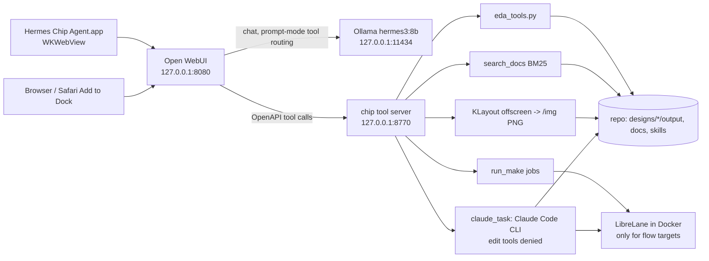
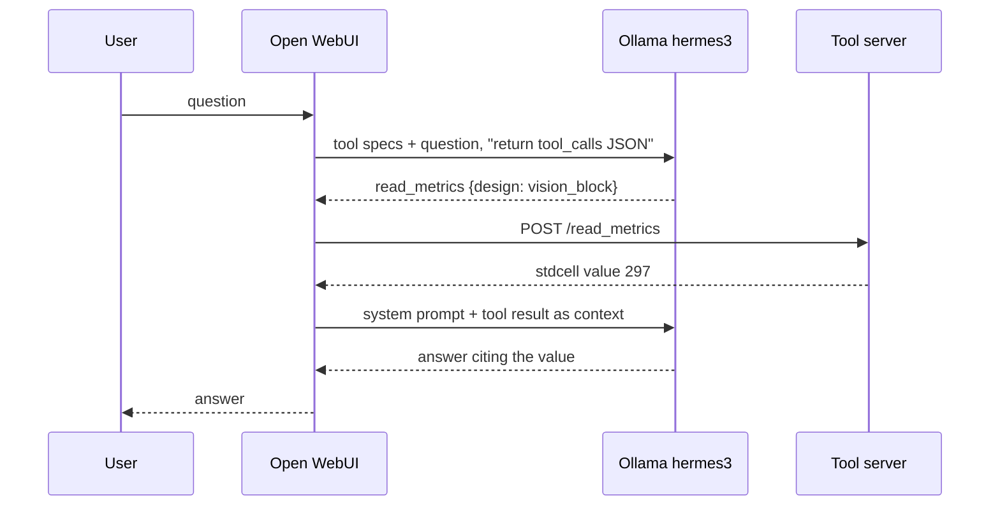
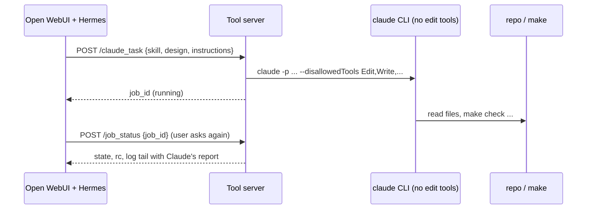

# Hermes chip agent: browser and Mac desktop app

Hermes 3 8B (local Ollama, `hermes3:8b`) with a chat UI and the chip tools, all on this Mac. Two front ends share
one back end: Open WebUI in a browser, and a native macOS window "Hermes Chip Agent.app" that shows the same page.
Terminal-only use of the agents: [HERMES_FROM_TERMINAL.md](HERMES_FROM_TERMINAL.md); the agent itself:
[HERMES_AGENT.md](HERMES_AGENT.md); the tool server: `examples/hermes_desktop/tool_server/README.md`.
Files: `examples/hermes_desktop/` (README.md there is the short version).

## One command

```bash
bash scripts/hermes.sh            # (or: make hermes) set up what is missing, start, open the desktop app (browser if not built)
bash scripts/hermes.sh demo       # (or: make demo) numbered menu of demos; `demo 2` / `demo kv` runs one (make demo-kv)
bash scripts/hermes.sh demo showcase   # scripted showcase (examples/hermes_desktop/demo.py): query, gated run, run summary,
                                       # suggestions, skill plan, memory note, KLayout and Magic; saved as an Open WebUI chat
                                       # and examples/hermes_desktop/demo_transcript.md
bash scripts/hermes.sh status     # what is up, config audit result
bash scripts/hermes.sh stop       # (or: make hermes-stop)
```

Setup is automatic and only for what is missing: the Open WebUI venv (`setup_webui.sh`), `ollama pull hermes3:8b` (the only
model this repo uses), the preset, the slash prompts. The agent is scoped to this repo: Ollama on 127.0.0.1 only, one
tool connector (`chip`), offline, no telemetry. Your other Ollama models stay installed but are hidden here.

### Config lock-down and audit

`start.sh` sets these env vars on every Open WebUI start (config is not persisted, so the env is authoritative);
`install_preset.py` marks every other model `meta.hidden` (Open WebUI 0.11.4 has no MODEL_FILTER_LIST; the entries stay
active because the preset's base model hermes3:8b must stay resolvable).

| setting | value | how |
|---|---|---|
| default model | `hermes-chip-agent` preset | `DEFAULT_MODELS` |
| models in the picker | the preset only | `install_preset.py`: `meta.hidden` on all base models |
| code execution / interpreter | off | `ENABLE_CODE_EXECUTION`, `ENABLE_CODE_INTERPRETER`, `USER_PERMISSIONS_FEATURES_CODE_INTERPRETER` |
| web search, image generation | off | `ENABLE_WEB_SEARCH`, `ENABLE_IMAGE_GENERATION` + the matching permissions |
| direct connections, OpenAI API | off | `ENABLE_DIRECT_CONNECTIONS`, `ENABLE_OPENAI_API` |
| signup, community sharing, webhooks, API keys | off | `ENABLE_SIGNUP`, `ENABLE_COMMUNITY_SHARING`, `ENABLE_USER_WEBHOOKS`, `ENABLE_API_KEYS` |
| arena models, channels, Open WebUI memories | off | `ENABLE_EVALUATION_ARENA_MODELS`, `ENABLE_CHANNELS`, `ENABLE_MEMORIES` (the repo has its own memory tools) |
| Ollama | 127.0.0.1:11434 only | `OLLAMA_BASE_URL` |
| tool connectors | exactly one: `chip` at 127.0.0.1:8770 | `TOOL_SERVER_CONNECTIONS` |
| telemetry, updates, downloads | off | `ANONYMIZED_TELEMETRY`, `DO_NOT_TRACK`, `SCARF_NO_ANALYTICS`, `OFFLINE_MODE`, `ENABLE_VERSION_UPDATE_CHECK` |

Not possible: blocking "pull a model" in the Open WebUI admin UI (Ollama pulls go through the Ollama API, which must stay on);
single user on 127.0.0.1, so it is not reachable from other machines.

```bash
build/agent/venv/bin/python examples/hermes_desktop/audit_config.py   # table: setting, expected, actual; exit 1 on drift
```

`hermes.sh` runs it after start and restarts Open WebUI once if it finds drift (env only applies at Open WebUI start).

### The desktop app

`bash examples/hermes_desktop/desktop/make_app.sh --install` builds `build/desktop/Hermes Chip Agent.app` (icon drawn by
`desktop/make_icon.py`, converted with sips/iconutil) and copies it to `~/Applications`. It opens straight into the preset
(`/?models=hermes-chip-agent`), stops the services when the window closes, and shows a dialog if Ollama or `hermes3:8b` is missing.

## Architecture



One tool call (prompt mode, "How many standard cells does vision_block have?"):



A `claude_task` hand-off:



## Setup and run (Mac terminal, from the repo root)

```bash
bash examples/hermes_desktop/setup_webui.sh          # once: Open WebUI venv (python3.12) + pywebview
bash examples/hermes_desktop/start.sh                # Ollama if needed, tool server, Open WebUI, preset
open http://127.0.0.1:8080                           # pick model "Hermes chip agent"
bash examples/hermes_desktop/stop.sh                 # stops only what start.sh started (pid files)

bash examples/hermes_desktop/desktop/make_app.sh     # builds build/desktop/Hermes Chip Agent.app
open "build/desktop/Hermes Chip Agent.app"           # starts everything, shows a window; closing it stops them
bash examples/hermes_desktop/desktop/make_app.sh --install   # also copies to ~/Applications (only if you want it)
```

Zero-install alternative: run `start.sh`, open http://127.0.0.1:8080 in Safari, File > Add to Dock. Stop with `stop.sh`.

What `start.sh` sets for Open WebUI: data dir `build/webui/data`, `WEBUI_AUTH=False` (single local user, bound to
127.0.0.1), `OLLAMA_BASE_URL=http://127.0.0.1:11434`, OpenAI API off, `ANONYMIZED_TELEMETRY=false`, `DO_NOT_TRACK=true`,
`SCARF_NO_ANALYTICS=true`, `OFFLINE_MODE=True`, `HF_HUB_OFFLINE=1`, RAG model auto-update off, community sharing and
version check off. Nothing downloads at run time (Open WebUI's own document-RAG embedding model is never used here:
the preset has no files; document search goes through `search_docs`).

Tool registration is by configuration: `start.sh` exports `TOOL_SERVER_CONNECTIONS` from
`examples/hermes_desktop/tool_server_connection.json` (id `chip`, shown as tool `server:chip`), checked with
`GET /api/v1/configs/tool_servers`. Manual fallback: Settings > Admin > External Tools > + > URL
`http://127.0.0.1:8770`, path `openapi.json`, Save. `ENABLE_PERSISTENT_CONFIG=False` makes the env authoritative at each start.
The preset `examples/hermes_desktop/preset.json` (plus `system_prompt.txt`) is created through the API by
`install_preset.py` (idempotent, run by `start.sh`): base `hermes3:8b`, temperature 0, seed 42, tool `server:chip` on by default.
`install_preset.py --model <tag>` adds one extra preset "Hermes chip agent (<tag>)" for another Ollama model; see [AGENT_MODELS.md](AGENT_MODELS.md).

## Function-calling mode

Open WebUI 0.11.4 has two modes: native (the model's own tool-call format, default) and "legacy" (prompt-based: Open WebUI
asks the model for a `tool_calls` JSON from the tool specs, runs the tools, then answers with the results as context).
The preset uses `function_calling: legacy`, matching the repo result (prompt mode 13/15, native 6/15, see HERMES_AGENT.md):
Ollama's hermes3 template drops the system message when `tools` is set, so native mode loses the preset's rules.
Through the API, native mode returned `tool_calls` that nobody executed (the loop belongs to the UI session), legacy ran the
tool and returned the final answer. The routing prompt for legacy mode is `examples/hermes_desktop/tools_prompt.txt`
(env `TOOLS_FUNCTION_CALLING_PROMPT_TEMPLATE`); with it the tool choice worked for the four direct prompts below. It sees only
tool specs and the user text, not the system prompt.

## Master prompt (repo context for every query)

The preset's system prompt is `tools/prompts/master_prompt.txt` followed by `examples/hermes_desktop/system_prompt.txt` (tool-use
details only, no repeated facts). The master prompt tells the model what the repo is (learning build toward a ChipFoundry
Caravel tapeout, 25 designs by family, sky130A, LibreLane 3.0.2, 25 ns / 40 MHz, signoff-clean), where things live (NOTES.md,
`output/metrics.json`, `docs/RESULTS.md`, `docs/VALIDATION.md`, `docs/LESSONS.md`), the key make commands, which tool answers which kind of
question, the safety rules, an off-topic rule and the answer style. It is generated, so it follows the repo:
`make master-prompt` (`scripts/docs/make_master_prompt.py`; template `tools/prompts/master_prompt.template.txt`; design list from the
Makefile and the README table, LibreLane version from `versions.lock`, clock from a design config); `make test` checks it is up to
date. `start.sh` regenerates it before installing the preset (`install_preset.py`, also for `--model <tag>` presets). Open WebUI's
default prompt suggestions come from `prompt_suggestions.json` (env `DEFAULT_PROMPT_SUGGESTIONS`, set by `start.sh`).
The legacy tool-routing step (`tools_prompt.txt`) is a separate model call: Open WebUI sends it the tool list, the last user text and
the recent chat history, which includes the preset system prompt. It has its own short routing hints (a question starting with
How/What/Which/Why is no `run_make` order; off-topic and unknowable questions get no tool).

Measured answers for five repo questions through the API, and the known routing weakness (the 8B routing call can still start `run_make` for a
"how do I run ..." question), are in `examples/hermes_desktop/README.md` (section "Master prompt check").

## Experiments and demos

Everything the repo can run is reachable from the chat, and seven short demos show it off. Tools (`tool_server/experiments_tools.py`):
`list_experiments {group?}` (the catalog: id, title, what it shows, command, expected time, physical flow yes/no, docs link; 26 entries:
5 per-design experiments that take any of the 25 designs, 8 families, 9 system items, 4 picture items), `run_experiment {id, design?}`,
`experiment_result {id, design?, job_id?}`, `engine_pictures {design?, view?}`, `list_demos`, `demo_steps {name}`. A run never starts by
itself: `run_experiment` goes through the gated `run_make` (same allow-list, one physical flow at a time, "yes, run <id>"), so the model
shows the confirm step and waits. Not runnable from the chat, said honestly: `precheck` (writes outside `build/`; the committed 14/14 summary
is shown), the live OpenROAD heat-map window (needs XQuartz, `scripts/gui/open_gui.sh heatmaps`), `caravel-rtl/gl` without `build/caravel`.
Results are parsed by code, not by the model: soc-kv (prefill cycles per token, decode round trip), soc-sim (software against accelerator),
precision (7 formats: accuracy from `docs/PRECISION_STUDY.md`, cells, area, die, slack from each `metrics.json`), kv-cache (nominal cache bits
against flip-flops built), adapter-test (14 engines), precheck, and for per-design flows the `run_summary` tool. Without a `job_id` the committed
results are used and the reply says so.

### Run a demo

```bash
python3 examples/hermes_desktop/demos.py            # the numbered menu
python3 examples/hermes_desktop/demos.py 2          # same as: demos.py kv
python3 examples/hermes_desktop/demos.py kv --pace 6 --yes   # --pace S: pause after each narration line (default 6); --yes starts the runs
bash scripts/hermes.sh demo kv                      # same thing through hermes.sh (when present)
```

No setup knowledge needed: if Open WebUI and the tool server are up, each act is a chat turn to the preset "Hermes chip agent" and the
conversation is saved as an Open WebUI chat plus `examples/hermes_desktop/demos/<name>.md`; if not, the tool server is started for the demo and
the same tool calls run directly (the one command for the chat version is `bash examples/hermes_desktop/start.sh`; `--direct` forces direct mode).
In the chat: `/demo` shows the numbered menu (answer with "2" or "kv"), `/demo-kv` etc. run one, `/experiments` lists the catalog; the start
screen has three demo suggestions. Install them with `python3 examples/hermes_desktop/install_prompts.py` (`start.sh` does).

| # | name | what it shows | time (measured through Open WebUI, 2026-10-07) | physical flow |
|---|---|---|---|---|
| 1 | `precision` | 7 number formats: table, why ternary and int4 win, bin vs fp16 layouts | 85 s | no |
| 2 | `kv` | `make soc-kv` (gated), prefill vs decode tables | 94 s (the run itself 16 s) | no |
| 3 | `rtl2gds` | gated `flow-all vision_block`, run summary, suggestions, layout picture | 73 s here because the current run was reused (flow 12.7 s); a fresh flow is about 1 to 3 minutes | yes |
| 4 | `int4` | why int4 has more flip-flops: table and the quoted NOTES.md point | 44 s | no |
| 5 | `heatmaps` | OpenROAD placement density, routing congestion, IR drop of kv_attn_n8 | 36 s | no |
| 6 | `soc` | `make soc-sim` (gated), software vs accelerator table, the lesson | 59 s (the run itself 28 s) | no |
| 7 | `gui` | KLayout and Magic windows side by side (`demos/gui_demo.py`, needs XQuartz) | see `demos/GUI_DEMO.md` | no |

Direct mode (no model) takes 0 s for the table demos plus the run time. The model's prose is its own; every table and number in a
transcript comes from the tool result.

### What you see, what to say

1. **precision.** Seven copies of one 9-input neuron, one per format, each taken to clean GDSII. Show the table: accuracy is 94.0 to 94.25 percent
   for everything except bin (88.95), but cell area grows from 1474 to 11913 um2. Say: ternary costs 1.7x and int4 2.2x of bin for full accuracy, fp16 8.1x;
   the floats also use up the 25 ns clock (setup slack 0.111 and 0.044 ns). Then the quoted reason (zero is the weight bin lacks) and the two layouts.
2. **kv.** Say: this is the tiny version of "prefill is compute-bound, decode is memory-bound". Show prefill falling from 328 to 90.6 clocks per token as one
   frame carries more prompt tokens, and decode flat at 670 clocks with 502 of them bus reads; the engine's own growth with the cache (7 to 14 clocks) is hidden.
3. **rtl2gds.** Say: this is the whole chip flow for one small design, in Docker, and the agent asked first. After the run: DRC, LVS, antenna clean, setup and
   hold slack, then the rule-based suggestions (it never advises loosening a constraint) and the layout picture.
4. **int4.** Say: halving the bits did not shrink the flip-flops. The table shows 256 nominal bits but 96 cache flip-flops against 72 for the int8 engine; the quoted
   note explains that the int8 baseline was already pruned because the ROM is constant. Quantisation saves bits only where the data has entropy.
5. **heatmaps.** Three engines, three pictures: gpl spreads cells until density is even, grt shows routing demand per tile (hot columns are power stripes, no tile over
   100 percent), psm shows the voltage sag (worst 2.16e-04 V: microvolts, the scale is stretched). Numbers are quoted from `metrics.json`.
6. **soc.** Say: the accelerator computes in 6 to 15 clocks but the round trip is 490 to 728, 84 to 89 percent of it bus traffic; software wins for two of the three
   networks, only the convolution wins on the accelerator (1.8x). Moving data costs more than computing on it.
7. **gui.** Run by `demos/gui_demo.py` (paced KLayout and Magic tour); see `demos/GUI_DEMO.md`.

Measured rough edges (8B model): the "yes, run <id>" turn is sometimes answered without calling `run_make`; the runner repeats it once, and `run_make` also
accepts a pending id placed in `target`. `tools_prompt.txt` has a hint for it (read when Open WebUI starts). Asks are worded "Call the X tool ..." because
"Use the X tool ..." was routed to `claude_task`. Tests: `tests/tools/test_experiments.py` (catalog covers all 25 designs and the system targets, docs links exist,
the gate is respected, parsers run on `tests/tools/fixtures/*`, demo steps name served tools).

## Safety model

- Everything listens on 127.0.0.1; no login, so do not expose the ports.
- Read-only tools by default; `run_make` only runs allow-listed targets as jobs, one physical flow at a time.
- `claude_task` runs the Claude Code CLI with edit tools denied (`dontAsk` mode): it can read and run `make`, not edit files, commit or push.
  It uses the owner's Claude plan. Never run `cf` commands, never publish: owner only (CLAUDE.md HARD RULES).
- The model is 8B: it can pick a wrong tool or invent text around a correct tool result. Trust the quoted tool result, not the prose.

## Measured results (2026-10-06, Apple M4 Pro, hermes3:8b, temperature 0, through `POST /api/chat/completions` with `tool_ids=["server:chip"]`)

Install: `pip install open-webui` 0.11.4: 314 s, `build/webui` 2.2 GB (all in the venv); `pip install pywebview` about 11 s.
`start.sh` from cold (Ollama already up): about 53 s to a healthy Open WebUI.

| Question | Tools called | Time | Result |
|---|---|---|---|
| How many standard cells does vision_block have? | read_metrics | 1.8 s warm (9.5 s first, model load) | 297, equal to `designs/vision_block/output/metrics.json` |
| Show kv_attn_n8 met1 and li1 lower-left 50x50 um | first try (no routing prompt): layer_stats x2, wrong, invented URLs; with `tools_prompt.txt`: klayout_view | 13.6 s | PNG URL `http://127.0.0.1:8770/img/...png` returned, view bbox [-8.3, 0, 58.3, 50] um; the answer quoted the URL in prose rather than as an inline image |
| List the skills | list_skills | 10.6 s | all 6 skills listed |
| Run make simulate for vision_block | run_make, then (next question) job_status | 2.5 s + 3.8 s | job done, rc 0, log shows the vision_block testbench passing (540 cases, 2713 checks) |
| "Use harden-design to check whether kv_attn_n8's run is current ..." | get_skill, read_metrics (first); search_docs, signoff_summary (second) | 19 s, 23 s | claude_task NOT chosen; the answer was an unsupported "current and clean" claim |
| "Hand this to Claude with claude_task, skill harden-design, design kv_attn_n8: ..." | claude_task | job 47.4 s, rc 0 | Claude ran `make check DESIGN=kv_attn_n8` (PASS), reported signoff clean, currency "not proven" (`find_reusable_run.py` blocked by the no-edit permission mode). Hermes' own summary of the start was wrong (invented a make target and an S3 URL). |

Reading: simple fact, view and make requests work; an indirect "use skill X" request is not routed to `claude_task` by the 8B
model, an explicit "claude_task" request is; its prose after a tool result can be unreliable. One `claude_task` was run.

## Operating KLayout and Magic from the chat

The tool server (`examples/hermes_desktop/tool_server/gui_tools.py`) lets the agent open and drive the REAL KLayout and Magic
windows on the Mac, read-only, so a presenter can say "show met4 and met5" and watch the window change.

| tool | what it does |
|---|---|
| `gui_start {tool: klayout or magic, design}` | opens the window (KLayout through `examples/hermes_klayout_gui/start_live.sh`, bridge `127.0.0.1:8765`; Magic in the LibreLane container on XQuartz, bridge `127.0.0.1:8766`); returns pid, port, ready |
| `klayout_live {action: open, zoom, layers, markers, measure, snapshot, state}` | the `view_api` contract on the live window |
| `magic_live {action: open, zoom, layers, drc, find, measure, snapshot, state}` | the Magic bridge (`examples/hermes_desktop/magic_bridge/`) |
| `gui_status`, `gui_stop {tool}` | state; close only the window this module started |

Every `klayout_live` / `magic_live` reply carries `png_url` and a `markdown` line to paste verbatim, so the picture shows in the chat.
Setup: XQuartz (one-time line in the header of `scripts/gui/open_gui.sh`: `nolisten_tcp false`, `xhost +localhost`), the KLayout app, Colima.
Safety: localhost only, allow-listed commands, no save or write command exists (checked by `tests/tools/test_gui_tools.py`), one window
per tool, `gui_stop` kills only the recorded pid (KLayout ignores SIGTERM: its admin quit, then SIGKILL of that pid) or its own container
(`quit -noprompt`, then `docker kill chip_magic_<port>`). Details and the Magic protocol: `examples/hermes_desktop/magic_bridge/README.md`.
The narrated tour of all of this is demo 7: `examples/hermes_desktop/demos/GUI_DEMO.md`.

Measured 2026-10-06 (build/agent/gui_demo/run.json): KLayout start 2.9 s, each live action 0.3 to 0.6 s including the PNG; Magic start 1.2 s warm
(19 s cold), each action 0.5 to 2.9 s; `gui_stop` 0.5 s (Magic), 6.3 s (KLayout, the SIGKILL fallback). Magic snapshots are `plot pnm` renders of the
window's region (xwd of XQuartz windows is blank here).

## Troubleshooting

| Symptom | Fix |
|---|---|
| `start.sh`: "Open WebUI not installed" | run `setup_webui.sh` |
| Open WebUI slow to start (first start 1 to 4 min) | wait; `build/webui/logs/webui.log` |
| No "Hermes chip agent" model | `build/agent/venv/bin/python examples/hermes_desktop/install_preset.py` |
| Tool not called / `Chip tools` missing | `curl 127.0.0.1:8770/health`; `build/webui/logs/tool_server.log`; add the connection by hand (above) |
| Port 8080, 8770 or 11434 busy | stop the other process; `stop.sh` only stops its own pids |
| Image does not show | open the quoted `png_url` in a browser tab; the server serves `/img/` |
| Desktop app does not open | `build/webui/logs/desktop_app.log`; run `build/agent/venv/bin/python examples/hermes_desktop/desktop/app.py "$PWD"` |
| App window stays after `kill` | close the window (that runs `stop.sh`); a plain SIGTERM does not stop the services: run `stop.sh` |
| macOS blocks the app | it is unsigned and local: right-click > Open once, or run it from the terminal as above |

## Limits

- 8B tool choice is imperfect (see the table); the prompt hints in `tools_prompt.txt` help but are not a guarantee.
- `claude_task` costs plan usage and may run flows (`make *` is allowed to it); keep tasks short.
- Open WebUI is large (2.2 GB venv) and pins its own Python 3.12 stack, kept apart in `build/webui/venv`.
- Open WebUI 0.11.4 only; env names and API paths used here were checked against that version.
- The app is an unsigned wrapper around `build/agent/venv`, bound to this checkout path; rebuild it after moving the repo.
