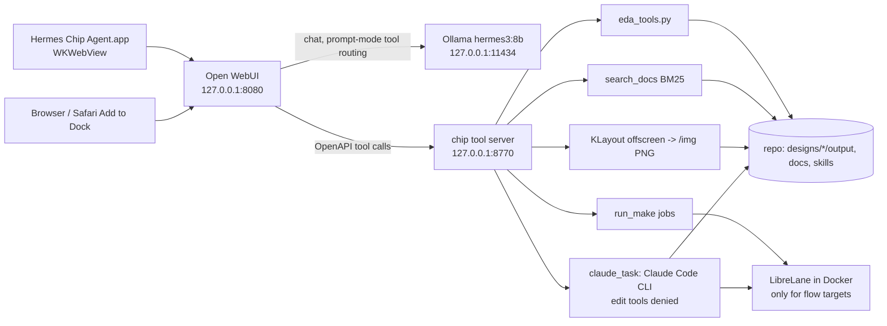
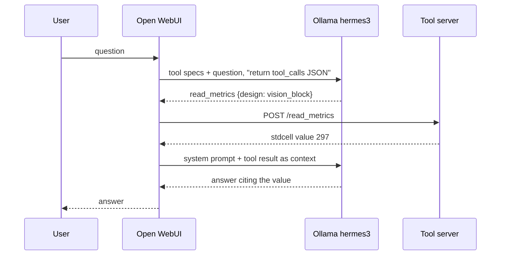
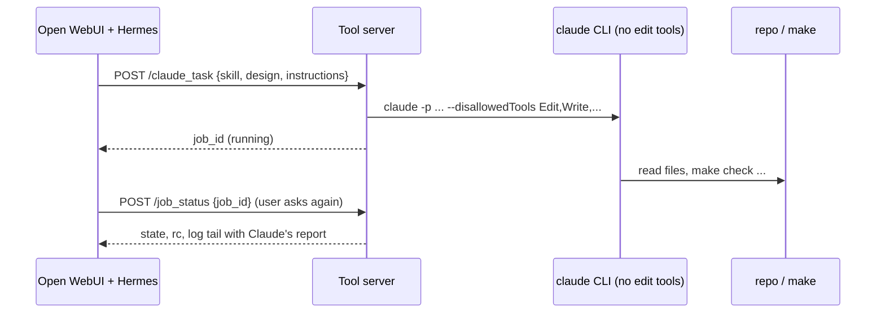

# Hermes chip agent: browser and Mac desktop app

Hermes 3 8B (local Ollama, `hermes3:8b`) with a chat UI and the chip tools, all on this Mac. Two front ends share
one back end: Open WebUI in a browser, and a native macOS window "Hermes Chip Agent.app" that shows the same page.
Terminal-only use of the agents: [HERMES_FROM_TERMINAL.md](HERMES_FROM_TERMINAL.md); the agent itself:
[HERMES_AGENT.md](HERMES_AGENT.md); the tool server: `examples/hermes_desktop/tool_server/README.md`.
Files: `examples/hermes_desktop/` (README.md there is the short version).

## Architecture



One tool call (prompt mode, "How many standard cells does vision_block have?"):



A `claude_task` hand-off:



## Setup and run (Mac terminal, from the repo root)

```bash
bash examples/hermes_desktop/setup_webui.sh          # once: Open WebUI venv (python3.12) + pywebview
bash examples/hermes_desktop/start.sh                # Ollama if needed, tool server, Open WebUI, preset
open http://127.0.0.1:8080                           # pick model "Hermes chip agent"
bash examples/hermes_desktop/stop.sh                 # stops only what start.sh started (pid files)

bash examples/hermes_desktop/desktop/make_app.sh     # builds build/desktop/Hermes Chip Agent.app
open "build/desktop/Hermes Chip Agent.app"           # starts everything, shows a window; closing it stops them
bash examples/hermes_desktop/desktop/make_app.sh --install   # also copies to ~/Applications (only if you want it)
```

Zero-install alternative: run `start.sh`, open http://127.0.0.1:8080 in Safari, File > Add to Dock. Stop with `stop.sh`.

What `start.sh` sets for Open WebUI: data dir `build/webui/data`, `WEBUI_AUTH=False` (single local user, bound to
127.0.0.1), `OLLAMA_BASE_URL=http://127.0.0.1:11434`, OpenAI API off, `ANONYMIZED_TELEMETRY=false`, `DO_NOT_TRACK=true`,
`SCARF_NO_ANALYTICS=true`, `OFFLINE_MODE=True`, `HF_HUB_OFFLINE=1`, RAG model auto-update off, community sharing and
version check off. Nothing downloads at run time (Open WebUI's own document-RAG embedding model is never used here:
the preset has no files; document search goes through `search_docs`).

Tool registration is by configuration: `start.sh` exports `TOOL_SERVER_CONNECTIONS` from
`examples/hermes_desktop/tool_server_connection.json` (id `chip`, shown as tool `server:chip`), checked with
`GET /api/v1/configs/tool_servers`. Manual fallback: Settings > Admin > External Tools > + > URL
`http://127.0.0.1:8770`, path `openapi.json`, Save. `ENABLE_PERSISTENT_CONFIG=False` makes the env authoritative at each start.
The preset `examples/hermes_desktop/preset.json` (plus `system_prompt.txt`) is created through the API by
`install_preset.py` (idempotent, run by `start.sh`): base `hermes3:8b`, temperature 0, seed 42, tool `server:chip` on by default.
`install_preset.py --model <tag>` adds one extra preset "Hermes chip agent (<tag>)" for another Ollama model; see [AGENT_MODELS.md](AGENT_MODELS.md).

## Function-calling mode

Open WebUI 0.11.4 has two modes: native (the model's own tool-call format, default) and "legacy" (prompt-based: Open WebUI
asks the model for a `tool_calls` JSON from the tool specs, runs the tools, then answers with the results as context).
The preset uses `function_calling: legacy`, matching the repo result (prompt mode 13/15, native 6/15, see HERMES_AGENT.md):
Ollama's hermes3 template drops the system message when `tools` is set, so native mode loses the preset's rules.
Through the API, native mode returned `tool_calls` that nobody executed (the loop belongs to the UI session), legacy ran the
tool and returned the final answer. The routing prompt for legacy mode is `examples/hermes_desktop/tools_prompt.txt`
(env `TOOLS_FUNCTION_CALLING_PROMPT_TEMPLATE`); with it the tool choice worked for the four direct prompts below. It sees only
tool specs and the user text, not the system prompt.

## Safety model

- Everything listens on 127.0.0.1; no login, so do not expose the ports.
- Read-only tools by default; `run_make` only runs allow-listed targets as jobs, one physical flow at a time.
- `claude_task` runs the Claude Code CLI with edit tools denied (`dontAsk` mode): it can read and run `make`, not edit files, commit or push.
  It uses the owner's Claude plan. Never run `cf` commands, never publish: owner only (CLAUDE.md HARD RULES).
- The model is 8B: it can pick a wrong tool or invent text around a correct tool result. Trust the quoted tool result, not the prose.

## Measured results (2026-10-06, Apple M4 Pro, hermes3:8b, temperature 0, through `POST /api/chat/completions` with `tool_ids=["server:chip"]`)

Install: `pip install open-webui` 0.11.4: 314 s, `build/webui` 2.2 GB (all in the venv); `pip install pywebview` about 11 s.
`start.sh` from cold (Ollama already up): about 53 s to a healthy Open WebUI.

| Question | Tools called | Time | Result |
|---|---|---|---|
| How many standard cells does vision_block have? | read_metrics | 1.8 s warm (9.5 s first, model load) | 297, equal to `designs/vision_block/output/metrics.json` |
| Show kv_attn_n8 met1 and li1 lower-left 50x50 um | first try (no routing prompt): layer_stats x2, wrong, invented URLs; with `tools_prompt.txt`: klayout_view | 13.6 s | PNG URL `http://127.0.0.1:8770/img/...png` returned, view bbox [-8.3, 0, 58.3, 50] um; the answer quoted the URL in prose rather than as an inline image |
| List the skills | list_skills | 10.6 s | all 6 skills listed |
| Run make simulate for vision_block | run_make, then (next question) job_status | 2.5 s + 3.8 s | job done, rc 0, log shows the vision_block testbench passing (540 cases, 2713 checks) |
| "Use harden-design to check whether kv_attn_n8's run is current ..." | get_skill, read_metrics (first); search_docs, signoff_summary (second) | 19 s, 23 s | claude_task NOT chosen; the answer was an unsupported "current and clean" claim |
| "Hand this to Claude with claude_task, skill harden-design, design kv_attn_n8: ..." | claude_task | job 47.4 s, rc 0 | Claude ran `make check DESIGN=kv_attn_n8` (PASS), reported signoff clean, currency "not proven" (`find_reusable_run.py` blocked by the no-edit permission mode). Hermes' own summary of the start was wrong (invented a make target and an S3 URL). |

Reading: simple fact, view and make requests work; an indirect "use skill X" request is not routed to `claude_task` by the 8B
model, an explicit "claude_task" request is; its prose after a tool result can be unreliable. One `claude_task` was run.

## Troubleshooting

| Symptom | Fix |
|---|---|
| `start.sh`: "Open WebUI not installed" | run `setup_webui.sh` |
| Open WebUI slow to start (first start 1 to 4 min) | wait; `build/webui/logs/webui.log` |
| No "Hermes chip agent" model | `build/agent/venv/bin/python examples/hermes_desktop/install_preset.py` |
| Tool not called / `Chip tools` missing | `curl 127.0.0.1:8770/health`; `build/webui/logs/tool_server.log`; add the connection by hand (above) |
| Port 8080, 8770 or 11434 busy | stop the other process; `stop.sh` only stops its own pids |
| Image does not show | open the quoted `png_url` in a browser tab; the server serves `/img/` |
| Desktop app does not open | `build/webui/logs/desktop_app.log`; run `build/agent/venv/bin/python examples/hermes_desktop/desktop/app.py "$PWD"` |
| App window stays after `kill` | close the window (that runs `stop.sh`); a plain SIGTERM does not stop the services: run `stop.sh` |
| macOS blocks the app | it is unsigned and local: right-click > Open once, or run it from the terminal as above |

## Limits

- 8B tool choice is imperfect (see the table); the prompt hints in `tools_prompt.txt` help but are not a guarantee.
- `claude_task` costs plan usage and may run flows (`make *` is allowed to it); keep tasks short.
- Open WebUI is large (2.2 GB venv) and pins its own Python 3.12 stack, kept apart in `build/webui/venv`.
- Open WebUI 0.11.4 only; env names and API paths used here were checked against that version.
- The app is an unsigned wrapper around `build/agent/venv`, bound to this checkout path; rebuild it after moving the repo.
