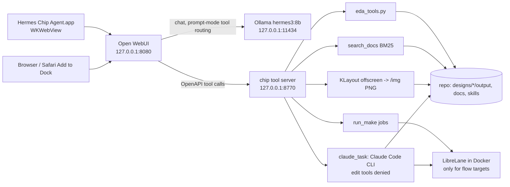
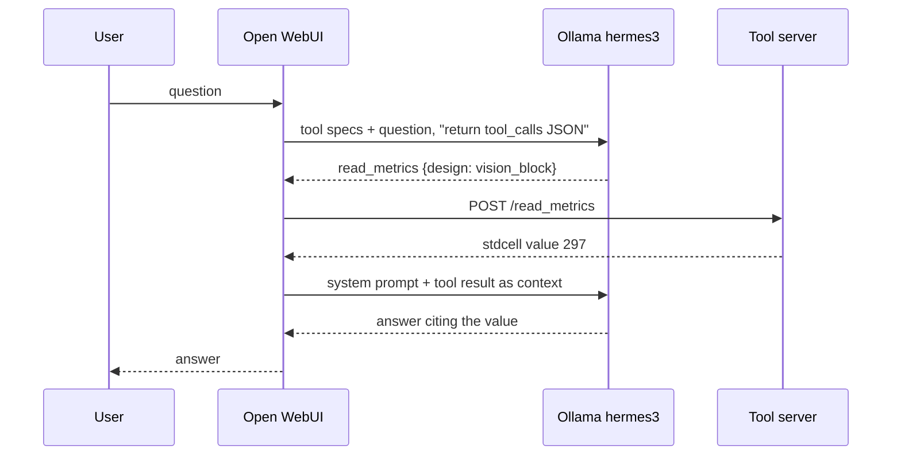
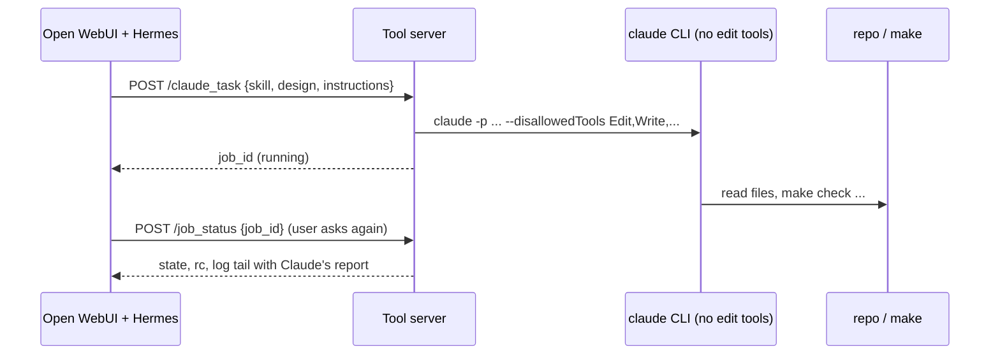

# Hermes chip agent: browser and Mac desktop app

Hermes 3 8B (local Ollama, `hermes3:8b`) with a chat UI and the chip tools, all on this Mac. Two front ends share
one back end: Open WebUI in a browser, and a native macOS window "Hermes Chip Agent.app" that shows the same page.
Terminal-only use of the agents: [HERMES_FROM_TERMINAL.md](HERMES_FROM_TERMINAL.md); the agent itself:
[HERMES_AGENT.md](HERMES_AGENT.md); the tool server: `examples/hermes_desktop/tool_server/README.md`.
Files: `examples/hermes_desktop/` (README.md there is the short version).

## One command

```bash
bash scripts/hermes.sh            # (or: make hermes) set up what is missing, start, open the desktop app (browser if not built)
bash scripts/hermes.sh demo       # (or: make demo) numbered menu of demos; `demo 2` / `demo kv` runs one (make demo-kv)
bash scripts/hermes.sh demo showcase   # scripted showcase (examples/hermes_desktop/demo.py): query, gated run, run summary,
                                       # suggestions, skill plan, memory note, KLayout and Magic; saved as an Open WebUI chat
                                       # and examples/hermes_desktop/demo_transcript.md
bash scripts/hermes.sh status     # what is up, config audit result
bash scripts/hermes.sh stop       # (or: make hermes-stop)
```

Setup is automatic and only for what is missing: the Open WebUI venv (`setup_webui.sh`), `ollama pull hermes3:8b` (the only
model this repo uses), the preset, the slash prompts. The agent is scoped to this repo: Ollama on 127.0.0.1 only, one
tool connector (`chip`), offline, no telemetry. Your other Ollama models stay installed but are hidden here.

### Config lock-down and audit

`start.sh` sets these env vars on every Open WebUI start (config is not persisted, so the env is authoritative);
`install_preset.py` marks every other model `meta.hidden` (Open WebUI 0.11.4 has no MODEL_FILTER_LIST; the entries stay
active because the preset's base model hermes3:8b must stay resolvable).

| setting | value | how |
|---|---|---|
| default model | `hermes-chip-agent` preset | `DEFAULT_MODELS` |
| models in the picker | the preset only | `install_preset.py`: `meta.hidden` on all base models |
| code execution / interpreter | off | `ENABLE_CODE_EXECUTION`, `ENABLE_CODE_INTERPRETER`, `USER_PERMISSIONS_FEATURES_CODE_INTERPRETER` |
| web search, image generation | off | `ENABLE_WEB_SEARCH`, `ENABLE_IMAGE_GENERATION` + the matching permissions |
| direct connections, OpenAI API | off | `ENABLE_DIRECT_CONNECTIONS`, `ENABLE_OPENAI_API` |
| signup, community sharing, webhooks, API keys | off | `ENABLE_SIGNUP`, `ENABLE_COMMUNITY_SHARING`, `ENABLE_USER_WEBHOOKS`, `ENABLE_API_KEYS` |
| arena models, channels, Open WebUI memories | off | `ENABLE_EVALUATION_ARENA_MODELS`, `ENABLE_CHANNELS`, `ENABLE_MEMORIES` (the repo has its own memory tools) |
| Ollama | 127.0.0.1:11434 only | `OLLAMA_BASE_URL` |
| tool connectors | exactly one: `chip` at 127.0.0.1:8770 | `TOOL_SERVER_CONNECTIONS` |
| chat and message id to the tool server | on (local only, for the call log) | `ENABLE_FORWARD_USER_INFO_HEADERS` (see "Proof: local, repo, context") |
| telemetry, updates, downloads | off | `ANONYMIZED_TELEMETRY`, `DO_NOT_TRACK`, `SCARF_NO_ANALYTICS`, `OFFLINE_MODE`, `ENABLE_VERSION_UPDATE_CHECK` |

Not possible: blocking "pull a model" in the Open WebUI admin UI (Ollama pulls go through the Ollama API, which must stay on);
single user on 127.0.0.1, so it is not reachable from other machines.

```bash
build/agent/venv/bin/python examples/hermes_desktop/audit_config.py   # table: setting, expected, actual; exit 1 on drift
```

`hermes.sh` runs it after start and restarts Open WebUI once if it finds drift (env only applies at Open WebUI start).

### The desktop app

`bash examples/hermes_desktop/desktop/make_app.sh --install` builds `build/desktop/Hermes Chip Agent.app` (icon drawn by
`desktop/make_icon.py`, converted with sips/iconutil) and copies it to `~/Applications`. It opens straight into the preset
(`/?models=hermes-chip-agent`), stops the services when the window closes, and shows a dialog if Ollama or `hermes3:8b` is missing.

## Architecture



One tool call (prompt mode, "How many standard cells does vision_block have?"):



A `claude_task` hand-off:



## Setup and run (Mac terminal, from the repo root)

```bash
bash examples/hermes_desktop/setup_webui.sh          # once: Open WebUI venv (python3.12) + pywebview
bash examples/hermes_desktop/start.sh                # Ollama if needed, tool server, Open WebUI, preset
open http://127.0.0.1:8080                           # pick model "Hermes chip agent"
bash examples/hermes_desktop/stop.sh                 # stops only what start.sh started (pid files)

bash examples/hermes_desktop/desktop/make_app.sh     # builds build/desktop/Hermes Chip Agent.app
open "build/desktop/Hermes Chip Agent.app"           # starts everything, shows a window; closing it stops them
bash examples/hermes_desktop/desktop/make_app.sh --install   # also copies to ~/Applications (only if you want it)
```

Zero-install alternative: run `start.sh`, open http://127.0.0.1:8080 in Safari, File > Add to Dock. Stop with `stop.sh`.

What `start.sh` sets for Open WebUI: data dir `build/webui/data`, `WEBUI_AUTH=False` (single local user, bound to
127.0.0.1), `OLLAMA_BASE_URL=http://127.0.0.1:11434`, OpenAI API off, `ANONYMIZED_TELEMETRY=false`, `DO_NOT_TRACK=true`,
`SCARF_NO_ANALYTICS=true`, `OFFLINE_MODE=True`, `HF_HUB_OFFLINE=1`, RAG model auto-update off, community sharing and
version check off. Nothing downloads at run time (Open WebUI's own document-RAG embedding model is never used here:
the preset has no files; document search goes through `search_docs`).

Tool registration is by configuration: `start.sh` exports `TOOL_SERVER_CONNECTIONS` from
`examples/hermes_desktop/tool_server_connection.json` (id `chip`, shown as tool `server:chip`), checked with
`GET /api/v1/configs/tool_servers`. Manual fallback: Settings > Admin > External Tools > + > URL
`http://127.0.0.1:8770`, path `openapi.json`, Save. `ENABLE_PERSISTENT_CONFIG=False` makes the env authoritative at each start.
The preset `examples/hermes_desktop/preset.json` (plus `system_prompt.txt`) is created through the API by
`install_preset.py` (idempotent, run by `start.sh`): base `hermes3:8b`, temperature 0, seed 42, tool `server:chip` on by default.
`install_preset.py --model <tag>` adds one extra preset "Hermes chip agent (<tag>)" for another Ollama model; see [AGENT_MODELS.md](AGENT_MODELS.md).

## Function-calling mode

Open WebUI 0.11.4 has two modes: native (the model's own tool-call format, default) and "legacy" (prompt-based: Open WebUI
asks the model for a `tool_calls` JSON from the tool specs, runs the tools, then answers with the results as context).
The preset uses `function_calling: legacy`, matching the repo result (prompt mode 13/15, native 6/15, see HERMES_AGENT.md):
Ollama's hermes3 template drops the system message when `tools` is set, so native mode loses the preset's rules.
Through the API, native mode returned `tool_calls` that nobody executed (the loop belongs to the UI session), legacy ran the
tool and returned the final answer. The routing prompt for legacy mode is `examples/hermes_desktop/tools_prompt.txt`
(env `TOOLS_FUNCTION_CALLING_PROMPT_TEMPLATE`); with it the tool choice worked for the four direct prompts below. It sees only
tool specs and the user text, not the system prompt.

## Master prompt (repo context for every query)

The preset's system prompt is `tools/prompts/master_prompt.txt` followed by `examples/hermes_desktop/system_prompt.txt` (tool-use
details only, no repeated facts). The master prompt tells the model what the repo is (learning build toward a ChipFoundry
Caravel tapeout, 25 designs by family, sky130A, LibreLane 3.0.2, 25 ns / 40 MHz, signoff-clean), where things live (NOTES.md,
`output/metrics.json`, `docs/RESULTS.md`, `docs/VALIDATION.md`, `docs/LESSONS.md`), the key make commands, which tool answers which kind of
question, the safety rules, an off-topic rule and the answer style. It is generated, so it follows the repo:
`make master-prompt` (`scripts/docs/make_master_prompt.py`; template `tools/prompts/master_prompt.template.txt`; design list from the
Makefile and the README table, LibreLane version from `versions.lock`, clock from a design config); `make test` checks it is up to
date. `start.sh` regenerates it before installing the preset (`install_preset.py`, also for `--model <tag>` presets). Open WebUI's
default prompt suggestions come from `prompt_suggestions.json` (env `DEFAULT_PROMPT_SUGGESTIONS`, set by `start.sh`).
The legacy tool-routing step (`tools_prompt.txt`) is a separate model call: Open WebUI sends it the tool list, the last user text and
the recent chat history, which includes the preset system prompt. It has its own short routing hints (a question starting with
How/What/Which/Why is no `run_make` order; off-topic and unknowable questions get no tool).

Measured answers for five repo questions through the API, and the known routing weakness (the 8B routing call can still start `run_make` for a
"how do I run ..." question), are in `examples/hermes_desktop/README.md` (section "Master prompt check").

## Experiments and demos

Everything the repo can run is reachable from the chat, and eight short demos show it off. Tools (`tool_server/experiments_tools.py`):
`list_experiments {group?}` (the catalog: id, title, what it shows, command, expected time, physical flow yes/no, docs link; 26 entries:
5 per-design experiments that take any of the 25 designs, 8 families, 9 system items, 4 picture items), `run_experiment {id, design?}`,
`experiment_result {id, design?, job_id?}`, `engine_pictures {design?, view?}`, `list_demos`, `demo_steps {name}`. A run never starts by
itself: `run_experiment` goes through the gated `run_make` (same allow-list, one physical flow at a time, "yes, run <id>"), so the model
shows the confirm step and waits. Not runnable from the chat, said honestly: `precheck` (writes outside `build/`; the committed 14/14 summary
is shown), the live OpenROAD heat-map window (needs XQuartz, `scripts/gui/open_gui.sh heatmaps`), `caravel-rtl/gl` without `build/caravel`.
Results are parsed by code, not by the model: soc-kv (prefill cycles per token, decode round trip), soc-sim (software against accelerator),
precision (7 formats: accuracy from `docs/PRECISION_STUDY.md`, cells, area, die, slack from each `metrics.json`), kv-cache (nominal cache bits
against flip-flops built), adapter-test (14 engines), precheck, and for per-design flows the `run_summary` tool. Without a `job_id` the committed
results are used and the reply says so.

### Run a demo

```bash
python3 examples/hermes_desktop/demos.py            # the numbered menu
python3 examples/hermes_desktop/demos.py 2          # same as: demos.py kv
python3 examples/hermes_desktop/demos.py kv --pace 6 --yes   # --pace S: pause after each narration line (default 6); --yes starts the runs
bash scripts/hermes.sh demo kv                      # same thing through hermes.sh (when present)
```

No setup knowledge needed: if Open WebUI and the tool server are up, each act is a chat turn to the preset "Hermes chip agent" and the
conversation is saved as an Open WebUI chat plus `examples/hermes_desktop/demos/<name>.md`; if not, the tool server is started for the demo and
the same tool calls run directly (the one command for the chat version is `bash examples/hermes_desktop/start.sh`; `--direct` forces direct mode).
In the chat: `/demo` shows the numbered menu (answer with "2" or "kv"), `/demo-kv` etc. run one, `/experiments` lists the catalog; the start
screen has three demo suggestions. Install them with `python3 examples/hermes_desktop/install_prompts.py` (`start.sh` does).

| # | name | what it shows | time (measured through Open WebUI, 2026-10-07) | physical flow |
|---|---|---|---|---|
| 1 | `precision` | 7 number formats: table, why ternary and int4 win, bin vs fp16 layouts | 85 s | no |
| 2 | `kv` | `make soc-kv` (gated), prefill vs decode tables | 94 s (the run itself 16 s) | no |
| 3 | `rtl2gds` | gated `flow-all vision_block`, run summary, suggestions, layout picture | 73 s here because the current run was reused (flow 12.7 s); a fresh flow is about 1 to 3 minutes | yes |
| 4 | `int4` | why int4 has more flip-flops: table and the quoted NOTES.md point | 44 s | no |
| 5 | `heatmaps` | OpenROAD placement density, routing congestion, IR drop of kv_attn_n8 | 36 s | no |
| 6 | `soc` | `make soc-sim` (gated), software vs accelerator table, the lesson | 59 s (the run itself 28 s) | no |
| 7 | `gui` | KLayout and Magic windows side by side (`demos/gui_demo.py`, needs XQuartz) | see `demos/GUI_DEMO.md` | no |
| 8 | `proof` | local, repo and context proof: `proof_local`, a receipt checked with `shasum` and `git`, memory read live, `show_context` (`demos/proof_demo.py`, `make demo-proof`) | 50 s (`--pace 0`), see `demos/PROOF_DEMO.md` | no |

Direct mode (no model) takes 0 s for the table demos plus the run time. The model's prose is its own; every table and number in a
transcript comes from the tool result.

### What you see, what to say

1. **precision.** Seven copies of one 9-input neuron, one per format, each taken to clean GDSII. Show the table: accuracy is 94.0 to 94.25 percent
   for everything except bin (88.95), but cell area grows from 1474 to 11913 um2. Say: ternary costs 1.7x and int4 2.2x of bin for full accuracy, fp16 8.1x;
   the floats also use up the 25 ns clock (setup slack 0.111 and 0.044 ns). Then the quoted reason (zero is the weight bin lacks) and the two layouts.
2. **kv.** Say: this is the tiny version of "prefill is compute-bound, decode is memory-bound". Show prefill falling from 328 to 90.6 clocks per token as one
   frame carries more prompt tokens, and decode flat at 670 clocks with 502 of them bus reads; the engine's own growth with the cache (7 to 14 clocks) is hidden.
3. **rtl2gds.** Say: this is the whole chip flow for one small design, in Docker, and the agent asked first. After the run: DRC, LVS, antenna clean, setup and
   hold slack, then the rule-based suggestions (it never advises loosening a constraint) and the layout picture.
4. **int4.** Say: halving the bits did not shrink the flip-flops. The table shows 256 nominal bits but 96 cache flip-flops against 72 for the int8 engine; the quoted
   note explains that the int8 baseline was already pruned because the ROM is constant. Quantisation saves bits only where the data has entropy.
5. **heatmaps.** Three engines, three pictures: gpl spreads cells until density is even, grt shows routing demand per tile (hot columns are power stripes, no tile over
   100 percent), psm shows the voltage sag (worst 2.16e-04 V: microvolts, the scale is stretched). Numbers are quoted from `metrics.json`.
6. **soc.** Say: the accelerator computes in 6 to 15 clocks but the round trip is 490 to 728, 84 to 89 percent of it bus traffic; software wins for two of the three
   networks, only the convolution wins on the accelerator (1.8x). Moving data costs more than computing on it.
7. **gui.** Run by `demos/gui_demo.py` (paced KLayout and Magic tour); see `demos/GUI_DEMO.md`.
8. **proof.** Run by `demos/proof_demo.py`: the stack is local, an answer is tied to a file and commit you can hash yourself, and the context is read live;
   see "Proof: local, repo, context" below and `demos/PROOF_DEMO.md`.

Measured rough edges (8B model): the "yes, run <id>" turn is sometimes answered without calling `run_make`; the runner repeats it once, and `run_make` also
accepts a pending id placed in `target`. `tools_prompt.txt` has a hint for it (read when Open WebUI starts). Asks are worded "Call the X tool ..." because
"Use the X tool ..." was routed to `claude_task`. Tests: `tests/tools/test_experiments.py` (catalog covers all 25 designs and the system targets, docs links exist,
the gate is respected, parsers run on `tests/tools/fixtures/*`, demo steps name served tools).

## What-if experiments: change constraints safely

The agent can answer "what if we set X?" for synthesis, timing constraints and OpenROAD engine settings without ever touching a design. An experiment is a
COPY of the design under `build/whatif/<design>__<tag>/` (git-ignored); the committed `designs/<d>/` files and its committed run are never modified, so
`scripts/flow/find_reusable_run.py` still reports the committed run current. Tools (`tool_server/whatif_tools.py`, tests `tests/tools/test_whatif.py`):

| tool | what it does |
|---|---|
| `param_info {design, key?, engine?}` | one setting: current value and where it comes from, library default, engine, meaning, safe range, symptom it fixes, how to verify, the repo's choice and the design's own `//KEY` reasoning, the rule that applies, the doc link. No key: the 157 curated tunable keys grouped by engine with current values. Read-only |
| `propose_change {design, changes}` | each key `allowed` or `blocked` with rule id and reason; a unified diff of `config.json` as PATCH TEXT, saved under `build/whatif/patches/`. Never applied |
| `whatif_run {design, changes, tag}` | gated like `run_make` ("yes, run <id>"): the first call returns the plan and starts nothing. After the yes: copy the design (without `runs/`, `output/`, `tb/`, `*.md`), rewrite every `dir::` path so it still resolves from the copy, apply the changes, run LibreLane in Docker on the copy with the Makefile's container setup (tight profile, 2 CPUs, 8 GB, 600 s cap), then `check_signoff.py` on the new metrics. Shares the tool server's one-physical-flow lock and refuses while any flow container runs |
| `whatif_result {tag \| job_id \| sweep_id}` | code-built table against `designs/<d>/output/metrics.json`: cells, flip-flops, die, utilisation, worst setup and hold slack (and all nine corners), DRC magic/KLayout/route, LVS, XOR, antenna, slew/cap/fanout violations, power, wall time, peak memory; a verdict; `committed_run_still_current` |
| `whatif_sweep {design, key, values}` | 2 to 6 values, gated, one job that runs the copies one after the other; `whatif_result {sweep_id}` gives one table |
| `whatif_list`, `whatif_clean {tag \| all}` | list copies and patches; delete only inside `build/whatif/` (a running copy is kept) |

Slash prompts: `/param <design> [key]`, `/whatif <design> <KEY=value>` (checks the rules, shows the patch, asks, runs, compares), `/sweep <design> <KEY> <v1,v2,...>`.

### The rules, enforced in code (`check_key`)

The CLAUDE.md HARD RULES are checked before anything is copied; a blocked key is reported with its rule id and the text, and the run is refused.

| rule | blocked |
|---|---|
| R1 | `CLOCK_PERIOD` above the current 25 ns, `MAX_TRANSITION_CONSTRAINT` above the current value (0.75 ns for a macro); tightening is allowed. Other constraints may only move in their tight direction (`MAX_FANOUT_CONSTRAINT` lower, `CLOCK_UNCERTAINTY_CONSTRAINT`, `TIME_DERATING_CONSTRAINT`, `IO_DELAY_CONSTRAINT`, `OUTPUT_CAP_LOAD` higher) |
| R2 | `DISABLE_LVS`, `RUN_LVS` false, any LVS or NETGEN key |
| R3, R4, R7 | `SYNTH_STRATEGY` `DELAY n`; `ERROR_ON_SYNTH_CHECKS` false; `SYNTH_ELABORATE_ONLY` true |
| R5, R11 | a signoff, repair or check `RUN_*` flag switched off, `ERROR_ON_*` false, corner lists, DRC/extraction/STA tool settings, negative slack margins, `*_ALLOW_SETUP_VIOS` true |
| R6 | on the Caravel wrappers: `DIE_AREA`, `FP_*`, `IO_PIN*`, `PDN_*`, `RT_*` (fixed geometry and pins) |
| R8, R9, R10 | design files, nets and identity keys; names that are not LibreLane 3.0.2 variables (411 known, `whatif_keys.json`); wrong type or enum |

Deprecated spellings are accepted and mapped (`PL_RESIZER_MAX_SLEW_MARGIN` is `DESIGN_REPAIR_MAX_SLEW_PCT` in 3.0.2). Wrapper and macro-bearing designs are refused by `whatif_run`
(they need exported macro views); run the macro itself.

### Measured (2026-10-07, `vision_block`, committed: 297 cells, 24 flip-flops, 80 x 80 um, 60.27 % utilisation, setup +13.53 ns at max_ss, hold +0.110 ns at min_ff, 51 s)

| what-if | cells | util % | setup ws ns | hold ws ns | DRC/LVS/XOR/antenna | flow s | verdict |
|---|---|---|---|---|---|---|---|
| `PL_TARGET_DENSITY_PCT` 70 | 297 | 60.40 | 13.589 | 0.1135 | 0/0/0/0 | 86 | clean; placement moved slightly (setup +0.06, hold +0.003 ns), same cell count |
| `CLOCK_PERIOD` 20 | 297 | 60.27 | 9.530 | 0.1103 | 0/0/0/0 | 66 | clean; setup -4.00 ns, hold unchanged, power 0.158 mW against 0.127 mW |
| `CLOCK_PERIOD` 30 | refused, R1: loosening | | | | | | |
| `MAX_TRANSITION_CONSTRAINT` 1.0 | refused, R1: loosening (0.75 ns) | | | | | | |

After both runs `designs/vision_block/` had no changed file and `find_reusable_run.py vision_block` exited 0. Evidence while it exists: `build/whatif/vision_block__dens70/` and `__clk20/`
(`runs/<tag>/final/metrics.json`, `whatif_resources.json`, `signoff.txt`, job logs `build/agent/jobs/`).

### Files and skills

`scripts/flow/whatif_flow.sh` (the runner), `scripts/flow/gen_whatif_keys.py` (regenerates `whatif_keys.json`, the 411 LibreLane variables with defaults, from the pinned image),
`tool_server/whatif_notes.json` (curated meaning, safe range, symptom, verification per key, 157 keys). Skills with the full key tables: `.claude/skills/tune-synthesis`,
`tune-timing-sdc`, `tune-openroad-engines`, `whatif-experiment` ([SKILLS.md](SKILLS.md) sections 2.7 to 2.10). Terminal route for Claude Code:
`python3 examples/hermes_desktop/tool_server/whatif_tools.py prepare <design> <tag> KEY=VALUE ...` then `bash scripts/flow/whatif_flow.sh --dir build/whatif/<design>__<tag> --design <design> --tag <tag>`.

Limits: no new simulation (the RTL does not change), no gate-level or precheck in a what-if; SDC files are not what-if knobs from the agent (edit a copy by hand in Claude Code if needed);
a patch is only text, the owner applies it, after which `make gds` reruns the flow because the config changed.

## Proof: local, repo, context

Three claims a user can doubt, each with evidence the agent produces from code (not from the model) and a command you can run yourself.

| claim | what shows it | where |
|---|---|---|
| 1. everything runs locally | the `proof_local` tool, the status line of the desktop app, `make demo-proof` act 1 | `tool_server/proof_tools.py` |
| 2. answers are tied to this repo | the receipt under every answer, the sources (citations) of each answer, the call log | `receipt_filter.py`, `proof_tools.py` |
| 3. how the context is taken | the receipt's context line, the `show_context` tool, the "Context" window of the desktop app | `proof_tools.py`, `memory_filter.py`, `desktop/app.py` |

**Call log.** `tool_server/proof_tools.py` (auto-mounted like the other `*_tools.py`; `tool_server.py` only calls its `install(app)` hook) adds an ASGI
middleware that records every tool call: time, chat id and message id, tool, arguments, result size, and every file the call opened for reading.
Chat and message id arrive as `X-OpenWebUI-Chat-Id` / `X-OpenWebUI-Message-Id` because `start.sh` sets `ENABLE_FORWARD_USER_INFO_HEADERS=true`
(Open WebUI then also sends the local user name and email to the tool server on 127.0.0.1; nothing leaves the machine). `builtins.open` and `io.open`
are wrapped, scoped by a contextvar to the running call, so no tool module had to change. Per file: repo-relative path, sha256, git blob id, whether it is
tracked and unchanged against `HEAD`; per entry the repo commit and dirty flag. A retrieval tool such as `search_docs` opens the whole corpus, so for
it the log lists the cited files (from the `file` and `lines` of its hits) with `via: cited`. Kept in memory (last 1000) and appended to
`build/agent/proof/calls.jsonl` (git-ignored). Tool `call_log {limit}` shows the latest entries.

**Receipt.** `receipt_filter.py` is an Open WebUI filter (global, installed and activated by `install_prompts.py`, checked by `audit_config.py`). Its outlet asks the
tool server for the turn's data (`POST /proof_turn`, hidden from the model) and appends a block built by plain code (`build_receipt`): model and Ollama digest, the
endpoint `127.0.0.1:11434`, repo commit (and dirty count), the tools called with the files and short sha256, the passages as `file:lines`, the context (master
prompt sha256, system prompt token estimate, memory digest entries and sha256) and tokens per second and seconds from Ollama's eval counters. It never raises; if the
tool server is down the reply is unchanged. Its inlet removes earlier receipts from the history so the model never sees or imitates them. An example (measured, demo 8):

```
---
**Receipt** (built by code from the local call log, not written by the model)
- Model: hermes3:8b digest 4f6b83f30b62, run by Ollama at 127.0.0.1:11434 (local)
- Repo: commit 811c87d (dirty: 16 changed files)
- Tools called: read_metrics
  - read_metrics read designs/kv_attn_n8/output/metrics.json sha256 5ebfd66c
- Context: master prompt sha256 5d0efe38, system prompt ~1468 tokens (estimate); memory digest 7 entries sha256 97b7d4e8
- Speed: 47.4 tokens/s, 5.8 s
```

Screenshot: `examples/hermes_desktop/demos/img/proof_receipt.png`. `*` after a sha means the file differs from the committed version.
Open WebUI 0.11.4 facts this relies on (read from `build/webui/venv/.../open_webui`): outlet filters run inline after the answer
(`utils/middleware.py` `outlet_filter_handler`) and the UI renders the message's `output` list when present, so the filter edits both `content` and `output`;
the system prompt of the model preset is added after the inlet filters (so the filter reads `__metadata__["system_prompt"]` in the outlet). Chats without a saved
chat id (a plain API call without `chat_id`) get no outlet receipt; `proof_demo.py` uses real saved chats.

**Citations.** The outlet emits one `source` event per repo passage (`file:lines @ commit`, the cited lines as the document text, sha256 and tool in
the metadata); Open WebUI shows them as source chips and a "Sources" list under the answer (screenshot above). The receipt lists the same passages, so nothing depends on
the UI rendering them.

**`proof_local`.** Measures now: listening sockets of the stack (Ollama and its runner, tool server, Open WebUI, Magic bridge) and their bind address (expect
127.0.0.1), `ollama ps` (model, size, GPU or CPU), the offline and telemetry env of the running Open WebUI process (`ps eww`), the config audit result, outbound TCP connections
of the stack processes to non-loopback hosts (expect none), the repo commit, and one verdict line (`LOCAL: ...` or `CHECK: ...`). A measurement of this moment (TCP
only), not a guarantee; the strict test is yours: turn Wi-Fi off and rerun demo 2.

**`show_context`.** For the last turn: the preset system prompt (first lines, length, sha256, whether it starts with `tools/prompts/master_prompt.txt`), the tools prompt
(`tools_prompt.txt` sha256), the memory digest the memory filter injected (counts, sha256, first lines; `memory_filter.py` reports it to the tool server with `POST /proof_record`),
the retrieved passages and the tools and files of the turn.

**Desktop app.** The window title and a small badge at the bottom right show `Local - hermes3:8b - repo 811c87d+dirty - offline` (green; red `NOT VERIFIED` when
the tool server does not answer), re-measured every 30 s from `proof_local`. Clicking the badge, or the menu Proof > Show context of the last turn, opens a "Context"
window with `show_context` (`examples/hermes_desktop/demos/img/proof_context.png`). Rebuild the app after pulling (`bash examples/hermes_desktop/desktop/make_app.sh --install`)
because `app.py` is copied into the bundle. In the browser the same data is available by asking "prove it is local" (`proof_local`) or "what context did you get" (`show_context`).

**Verify by hand** (any terminal, repo root):

```bash
shasum -a 256 designs/kv_attn_n8/output/metrics.json   # first 8 hex digits = the receipt's sha256
git rev-parse HEAD                                      # first 7 = the receipt's commit; git status --short = the dirty count
git diff --stat HEAD -- designs/kv_attn_n8/output/metrics.json   # empty: the file equals the committed version (no *)
shasum -a 256 tools/prompts/master_prompt.txt           # = master prompt sha256 in the receipt
ollama ps                                               # model, size, 100% GPU
lsof -nP -iTCP -sTCP:LISTEN | grep -E ':(11434|8770|8080) '      # all 127.0.0.1
lsof -nP -iTCP -sTCP:ESTABLISHED | grep -v '127.0.0.1->127.0.0.1'   # no line from ollama, open-webui or tool_server.py
tail -3 build/agent/proof/calls.jsonl                   # the call log: tool, files, sha256, chat id
```

Demo 8 (`make demo-proof`, `/demo-proof`) runs these in order and compares; narrated steps: `examples/hermes_desktop/demos/PROOF_DEMO.md`. Tests: `tests/tools/test_proof.py`.

## Safety model

- Everything listens on 127.0.0.1; no login, so do not expose the ports.
- Read-only tools by default; `run_make` only runs allow-listed targets as jobs, one physical flow at a time.
- `claude_task` runs the Claude Code CLI with edit tools denied (`dontAsk` mode): it can read and run `make`, not edit files, commit or push.
  It uses the owner's Claude plan. Never run `cf` commands, never publish: owner only (CLAUDE.md HARD RULES).
- The model is 8B: it can pick a wrong tool or invent text around a correct tool result. Trust the quoted tool result, not the prose.

## Measured results (2026-10-06, Apple M4 Pro, hermes3:8b, temperature 0, through `POST /api/chat/completions` with `tool_ids=["server:chip"]`)

Install: `pip install open-webui` 0.11.4: 314 s, `build/webui` 2.2 GB (all in the venv); `pip install pywebview` about 11 s.
`start.sh` from cold (Ollama already up): about 53 s to a healthy Open WebUI.

| Question | Tools called | Time | Result |
|---|---|---|---|
| How many standard cells does vision_block have? | read_metrics | 1.8 s warm (9.5 s first, model load) | 297, equal to `designs/vision_block/output/metrics.json` |
| Show kv_attn_n8 met1 and li1 lower-left 50x50 um | first try (no routing prompt): layer_stats x2, wrong, invented URLs; with `tools_prompt.txt`: klayout_view | 13.6 s | PNG URL `http://127.0.0.1:8770/img/...png` returned, view bbox [-8.3, 0, 58.3, 50] um; the answer quoted the URL in prose rather than as an inline image |
| List the skills | list_skills | 10.6 s | all 6 skills listed |
| Run make simulate for vision_block | run_make, then (next question) job_status | 2.5 s + 3.8 s | job done, rc 0, log shows the vision_block testbench passing (540 cases, 2713 checks) |
| "Use harden-design to check whether kv_attn_n8's run is current ..." | get_skill, read_metrics (first); search_docs, signoff_summary (second) | 19 s, 23 s | claude_task NOT chosen; the answer was an unsupported "current and clean" claim |
| "Hand this to Claude with claude_task, skill harden-design, design kv_attn_n8: ..." | claude_task | job 47.4 s, rc 0 | Claude ran `make check DESIGN=kv_attn_n8` (PASS), reported signoff clean, currency "not proven" (`find_reusable_run.py` blocked by the no-edit permission mode). Hermes' own summary of the start was wrong (invented a make target and an S3 URL). |

Reading: simple fact, view and make requests work; an indirect "use skill X" request is not routed to `claude_task` by the 8B
model, an explicit "claude_task" request is; its prose after a tool result can be unreliable. One `claude_task` was run.

## Operating KLayout and Magic from the chat

The tool server (`examples/hermes_desktop/tool_server/gui_tools.py`) lets the agent open and drive the REAL KLayout and Magic
windows on the Mac, read-only, so a presenter can say "show met4 and met5" and watch the window change.

| tool | what it does |
|---|---|
| `gui_start {tool: klayout or magic, design}` | opens the window (KLayout through `examples/hermes_klayout_gui/start_live.sh`, bridge `127.0.0.1:8765`; Magic in the LibreLane container on XQuartz, bridge `127.0.0.1:8766`); returns pid, port, ready |
| `klayout_live {action: open, zoom, layers, markers, measure, snapshot, state}` | the `view_api` contract on the live window |
| `magic_live {action: open, zoom, layers, drc, find, measure, snapshot, state}` | the Magic bridge (`examples/hermes_desktop/magic_bridge/`) |
| `gui_status`, `gui_stop {tool}` | state; close only the window this module started |

Every `klayout_live` / `magic_live` reply carries `png_url` and a `markdown` line to paste verbatim, so the picture shows in the chat.
Setup: XQuartz (one-time line in the header of `scripts/gui/open_gui.sh`: `nolisten_tcp false`, `xhost +localhost`), the KLayout app, Colima.
Safety: localhost only, allow-listed commands, no save or write command exists (checked by `tests/tools/test_gui_tools.py`), one window
per tool, `gui_stop` kills only the recorded pid (KLayout ignores SIGTERM: its admin quit, then SIGKILL of that pid) or its own container
(`quit -noprompt`, then `docker kill chip_magic_<port>`). Details and the Magic protocol: `examples/hermes_desktop/magic_bridge/README.md`.
The narrated tour of all of this is demo 7: `examples/hermes_desktop/demos/GUI_DEMO.md`.

Measured 2026-10-06 (build/agent/gui_demo/run.json): KLayout start 2.9 s, each live action 0.3 to 0.6 s including the PNG; Magic start 1.2 s warm
(19 s cold), each action 0.5 to 2.9 s; `gui_stop` 0.5 s (Magic), 6.3 s (KLayout, the SIGKILL fallback). Magic snapshots are `plot pnm` renders of the
window's region (xwd of XQuartz windows is blank here).

## Everything you can ask

The agent reaches every part of the repo through the tool server (`examples/hermes_desktop/tool_server/`, 50+ tools: `capability_map` lists them all, grouped
Ask, Run, Analyse, Logs, Layout/GUI, Skills, Memory, Experiments/Demos, Proof). Each capability also has a slash prompt, installed by
`install_prompts.py` (`CHIP_PROMPTS`); type `/` in the chat and pick one, or use the desktop app's Prompts menu (it types the command into the chat input, or copies it
to the clipboard if the input is not found). A prompt with `{{x}}` fields asks you for them. The prompt texts say "Call the X tool" because the 8B model routes explicit asks best.
`/help` calls `capability_map`, which is generated from the mounted operations plus this library, so a new tool or prompt shows up without a doc edit.

| prompt | example | tool | what you get |
|---|---|---|---|
| `/help` | `/help` | `capability_map` | a table: what you can ask, an example, the tool |
| `/designs` | `/designs` | `list_designs` | every design with family and one headline number |
| `/metrics <design>` | `/metrics kv_attn_n8` | `read_metrics` | cells, area, slack, power, DRC of one design from metrics.json |
| `/compare <metric>` | `/compare design__instance__count__stdcell` | `compare_designs` | one metric across all designs, sorted |
| `/why <design> <topic>` | `/why kv_attn_n8_int4 flip-flops` | `explain` `search_docs` | the quoted NOTES.md paragraphs with file, heading and lines |
| `/run <target> <design>` | `/run simulate vision_block` | `run_make` `job_status` | starts a make job after your 'yes, run <id>' |
| `/status` | `/status` | `job_list` `job_status` | running and finished jobs with state, seconds and the last log lines |
| `/summary <design>` | `/summary kv_attn_n8` | `run_summary` | stages, key numbers, current-or-stale, diff vs committed metrics |
| `/diagnose <design>` | `/diagnose vision_block` | `diagnose` | the failure matched to the harden-design table, with evidence and fix |
| `/suggest <design>` | `/suggest kv_attn_n8` | `suggest` | rule-based advice (never loosens a constraint) |
| `/log <design> [which]` | `/log kv_attn_n8 error` | `read_log` `list_logs` | the tail of flow, error, warning, a stage, a step, sim, gl or a job log |
| `/log-errors <design>` | `/log-errors kv_attn_n8` | `log_digest` | errors and warnings grouped by step, the slowest steps, stage outcomes |
| `/open-gds <design> [viewer]` | `/open-gds kv_attn_n8 klayout-app` | `open_gds` | opens the GDS: klayout-app (full KLayout), klayout, magic or png |
| `/klayout <sentence>` | `/klayout open kv_attn_n8 and show only met1 and met2` | `gui_command` | opens and drives the real KLayout window from one plain sentence (no model routing) |
| `/magic <sentence>` | `/magic open kv_attn_n8 and run drc` | `gui_command` | opens and drives the real Magic window (DRC, find, measure) from one plain sentence |
| `/open <file>` | `/open designs/kv_attn_n8/NOTES.md` | `open_file` | the text of a doc, NOTES, report or json with a line range |
| `/skills` | `/skills` | `list_skills` | the project skills with one line each |
| `/skill <name> [design]` | `/skill harden-design vision_block` | `skill_plan` | the ordered steps of a skill with the tool per step |
| `/param <design> [key]` | `/param vision_block PL_TARGET_DENSITY_PCT` | `param_info` | current value, default, engine, meaning, safe range, rule and doc link of a setting |
| `/whatif <design> <KEY=value>` | `/whatif vision_block CLOCK_PERIOD=20` | `propose_change` `whatif_run` `whatif_result` | rules checked, patch text shown, flow run on a COPY after your yes, compared with the committed metrics |
| `/sweep <design> <KEY> <v1,v2,...>` | `/sweep vision_block PL_TARGET_DENSITY_PCT 50,60,70` | `whatif_sweep` `whatif_result` | one what-if per value, one comparison table |
| `/remember <note>` | `/remember I prefer kv_attn_n8 for demos` | `remember` | saves one short note in local memory |
| `/recall [query]` | `/recall kv` | `recall` | the newest notes and runs, or those matching a word |
| `/experiments` | `/experiments` | `list_experiments` `run_experiment` | everything the repo can run, with expected time |
| `/demo [n]` | `/demo 2` | `list_demos` `demo_steps` | the numbered demos, then step by step |
| `/proof` | `/proof` | `proof_local` | sockets, model, offline settings, outbound connections, verdict |
| `/context` | `/context` | `show_context` | what the model was sent: system prompt, tools prompt, memory digest, passages |

The skill prompts `/harden`, `/soc-run`, `/wrapper`, `/notes`, `/precision`, `/add-engine`, the GUI prompts `/klayout`, `/magic`, and `/demo-<name>` are in the same library (see `/help`).

**Logs and files** (`tool_server/logs_tools.py`, read-only). `read_log {design, which}`: `flow`, `error`, `warning` (newest complete run's `flow.log` etc.), `make`
(`build/flow_<d>.log`), `stages`, `stage:<name>` (`build/flow/<d>/stage_<name>.log`), `step:<NN or name>` (the step directory's log, with its `runtime.txt`), `sim`
(`build/sim/<d>/sim.log`), `gl`, `job:<id>` (`build/agent/jobs/<id>.log`), `precheck`, or a repo-relative path; plus `tail` (default 60, max 300), `grep` (regex), `around` (a line number).
`log_digest` is built by code: error and warning lines grouped by step with the first example, `error.log` line count, the slowest steps from each step's `runtime.txt`, the stage
outcomes from `stages.txt`. Safety: repo-relative paths only, `..`, absolute paths outside the repo, symlinks out of the repo, `.git` and secret names are refused, only text extensions,
300 lines and 24 KB per reply; the proof call log (`call_log`) records which files each call read.

**Open the layout** (`open_gds {design, viewer}`). `klayout-app` starts the KLayout desktop application with the design's GDS and the sky130 layer file (`open -n -a /Applications/KLayout/klayout.app --args <gds> -l <lyp>` on macOS, `klayout` on Linux);
`klayout` and `magic` start the controllable windows (`gui_start`, then `gui_command`); `png` returns a rendered picture. No confirmation: opening a viewer is read-only. Each launch is one line in
`build/agent/proof/opens.jsonl`. `open_file {path, start, end, viewer}` returns the text of a doc, NOTES or report with a line range, or `viewer: os` hands it to the system viewer.

## Operate KLayout and Magic by text

`gui_command {text, tool?}` (in `examples/hermes_desktop/tool_server/gui_tools.py`) turns ONE plain sentence into one or more window actions with a
regex parser (no model), starts the window if needed, and returns `did` (actions with args), `results` (per action), `markdown` (a picture after the last
visual action: paste it), `understood` and, when not understood, a `hint` with examples. Nothing runs if any part of the sentence is not understood.
Default tool: the one named in the sentence (`in klayout` / `in magic`), else the window already open, else KLayout; `find` is Magic only. `gui_examples` lists the sentences.
The 8B model routes this unreliably when it must pick among many tools, so the preferred routes bypass the choice: the Open WebUI slash prompts
`/klayout <sentence>` and `/magic <sentence>` (`install_prompts.py`: they tell the model to call `gui_command` with `tool` and the text verbatim), the
routing rule in `tools_prompt.txt`, and the model-free panel below.

| what you type | what happens | what you see |
|---|---|---|
| `open kv_attn_n8 in klayout` | KLayout starts (or reuses its window) on kv_attn_n8 | the whole engine, 260 x 260 um |
| `show only met1 and met2` | those layers stay visible, the rest are hidden (`also` adds instead) | rails and routing only |
| `hide met5` / `show all` | one layer off / every layer on | the same view with or without it |
| `zoom to the lower-left 50 um` | view = [0,0,50,50] um (also `upper-right`, `center N um`) | the standard-cell rows |
| `zoom to 0 0 100 100` | view = that box in um | a 100 x 100 um window |
| `zoom to the macro mprj` | KLayout zooms to that cell or instance (wrapper designs) | our engine in the Caravel user area |
| `zoom out` (`fit`, `full`) | whole design | the whole die |
| `open kv_attn_n8 in magic and run drc` | Magic starts, runs its own DRC | the Magic picture and `drc_errors=0` with the reason text |
| `run drc` (KLayout) | markers from the run's DRC report (`.lyrdb`) | 0 markers: these designs are clean |
| `measure from 0,0 to 100,0` | ruler between two points (um) | dx, dy, distance |
| `find clk` | Magic moves the box to that pin or net label | the pin in view |
| `snapshot`, `status` | a picture of the open window / which windows are open | |
| `close klayout`, `close magic`, `close all` | closes only windows this tool opened | the windows go away |

Sentences chain with `and` or `then`: `open user_project_wrapper_soc_kv in klayout and zoom to the macro mprj`. Nothing in the parser can save or write a
layout (`save`, `write gds`, `export` give `understood: false`); `tests/tools/test_gui_tools.py` checks this and 26 sentences. The text-driven tour is
`python3 examples/hermes_desktop/demos/gui_demo.py --text --pace 2` (14 sentences, `build/agent/gui_demo/run_text.json`: 56 s in total with a 2 s pause per
step, Magic start 15 s, every other sentence 0.5 to 1.1 s).

Measured 2026-10-07 through Open WebUI (`/api/chat/completions`, preset, legacy function calling; the API does not expand slash commands, so the slash rows
sent the text the `/klayout` and `/magic` prompts expand to; `build/agent/gui_demo/route_results.json`): the six slash requests all called `gui_command`
(25 to 146 s each, the model's own turns dominate; the window action itself takes 0.5 to 3 s) but the model's closing prose was sometimes wrong
(for `/magic close all` it said it had no query). Four free-form sentences without a slash: the first run called `gui_command` for 3 of 4 (`show met4 and met5`
went to `klayout_view`); after the routing rule in `tools_prompt.txt` was changed to prefer `gui_command` for window requests, all 4 called `gui_command`,
but the 8B model still added a stray extra tool call in 3 of them (`run_summary`, `skill_plan`, `run_make`) and may misreport the result. For a reliable demo use the
slash prompt or the panel.

## Layout tools window

`GET http://127.0.0.1:8770/gui` is a small self-contained page served by the tool server (`gui_tools.py`, page in `tool_server/layout_panel.html`, no external
assets, works with Ollama down). It has: a design dropdown (from `list_designs`), Open in KLayout / Open in Magic, a switch for the tool the buttons act on,
layer toggles (li1, met1 to met5, all), zoom presets (full, lower-left 50 um, center, macro by name), Run DRC, Measure with two point fields, Snapshot,
Close KLayout / Magic / all, a "type a command" box that sends the sentence to `gui_command`, an inline latest snapshot and a log of calls with seconds.
Open it in any browser; verified live 2026-10-07 by real clicks through the macOS accessibility API on the wrapper window (open kv_attn_n8 in KLayout, met1, met2,
lower-left 50 um, snapshot, open in Magic, DRC, snapshot, close all; the tool server log shows each call). `examples/hermes_desktop/desktop/app.py`
(the repo's own wrapper window) also loads it as a second window with a Layout menu (`HERMES_LAYOUT_PANEL=0` turns the auto-open off); embedding the URL in another
front end is just that URL.

## Troubleshooting

| Symptom | Fix |
|---|---|
| `start.sh`: "Open WebUI not installed" | run `setup_webui.sh` |
| Open WebUI slow to start (first start 1 to 4 min) | wait; `build/webui/logs/webui.log` |
| No "Hermes chip agent" model | `build/agent/venv/bin/python examples/hermes_desktop/install_preset.py` |
| Tool not called / `Chip tools` missing | `curl 127.0.0.1:8770/health`; `build/webui/logs/tool_server.log`; add the connection by hand (above) |
| Port 8080, 8770 or 11434 busy | stop the other process; `stop.sh` only stops its own pids |
| Image does not show | open the quoted `png_url` in a browser tab; the server serves `/img/` |
| Desktop app does not open | `build/webui/logs/desktop_app.log`; run `build/agent/venv/bin/python examples/hermes_desktop/desktop/app.py "$PWD"` |
| App window stays after `kill` | close the window (that runs `stop.sh`); a plain SIGTERM does not stop the services: run `stop.sh` |
| macOS blocks the app | it is unsigned and local: right-click > Open once, or run it from the terminal as above |

## Limits

- 8B tool choice is imperfect (see the table); the prompt hints in `tools_prompt.txt` help but are not a guarantee.
- `claude_task` costs plan usage and may run flows (`make *` is allowed to it); keep tasks short.
- Open WebUI is large (2.2 GB venv) and pins its own Python 3.12 stack, kept apart in `build/webui/venv`.
- Open WebUI 0.11.4 only; env names and API paths used here were checked against that version.
- The app is an unsigned wrapper around `build/agent/venv`, bound to this checkout path; rebuild it after moving the repo.
