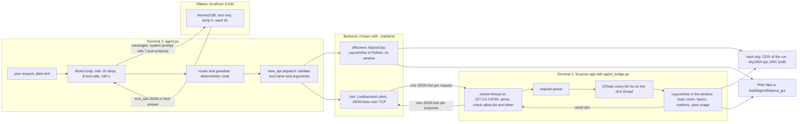
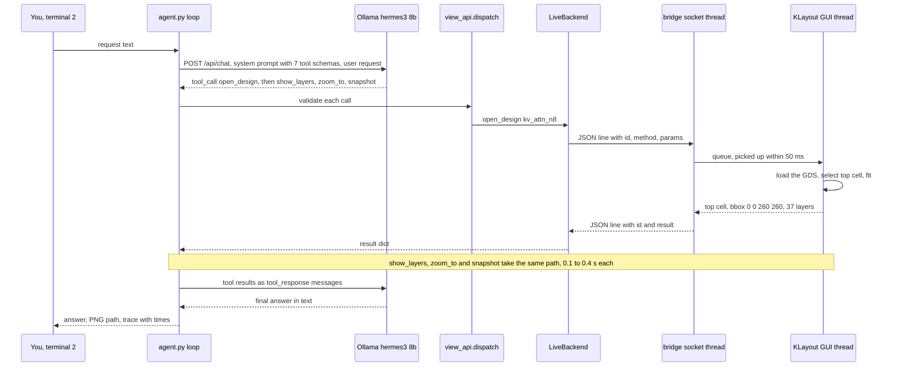

# Running the Hermes agents from the Mac terminal

How to invoke every Hermes example of this repo from a macOS terminal, with the KLayout GUI workflow in detail: the
one-time setup, the commands, an architecture diagram and the data flow of one request from your words to a moved
KLayout window. Everything runs locally on the Mac: the model (Hermes 3 8B in Ollama), the tools, KLayout. Nothing
leaves the machine.

All commands are run from the repository root (`cd <repo>`). Measured numbers are from 2026-10-06 on this Mac
(Apple M4 Pro, 24 GB), `hermes3:8b`, temperature 0, seed 42.

## 1. Quick start (copy, paste)

```bash
# one-time (section 2 explains each line)
ollama pull hermes3:8b
python3 -m venv build/agent/venv && build/agent/venv/bin/pip install klayout mcp pytest

# every session
ollama serve >/dev/null 2>&1 &            # skip if `curl -s localhost:11434/api/tags` already answers
PY=build/agent/venv/bin/python

# ask questions about the chips (10 read-only EDA tools)
$PY tools/hermes_agent.py "How many standard cells does vision_block have?"

# drive a KLayout view, no window (PNG files)
$PY examples/hermes_klayout_gui/agent.py "open kv_attn_n8, show li1 and met1, zoom to the lower-left 50x50 um, snapshot"
open build/agent/klayout_gui/*.png

# drive the real KLayout window: terminal 1 starts the window, terminal 2 talks to it
bash examples/hermes_klayout_gui/start_live.sh                                   # terminal 1
$PY examples/hermes_klayout_gui/agent.py --backend live "open user_project_wrapper_soc_kv, show only met4 and met5, zoom to the macro mprj"   # terminal 2
$PY examples/hermes_klayout_gui/demo.py --live --backend live                   # terminal 2: all 5 scripted scenarios
```

## 2. One-time setup

| Step | Command | Check |
|---|---|---|
| Ollama (local model server) | already installed here (`/usr/local/bin/ollama`); otherwise `brew install ollama` or the app from ollama.com | `ollama --version` |
| The model, 4.7 GB | `ollama pull hermes3:8b` | `ollama list` shows `hermes3:8b` |
| Python venv for the tools | `python3 -m venv build/agent/venv && build/agent/venv/bin/pip install klayout mcp pytest` | `build/agent/venv/bin/python -c "import klayout.lay, mcp"` (here: klayout 0.30.12, mcp 2.3.0, pytest 9.1.1) |
| KLayout desktop app (live window only) | `brew install --cask klayout` | `/Applications/KLayout/klayout.app` exists |
| Allow KLayout past Gatekeeper (once) | Finder: right-click `klayout.app` > Open > Open, or `xattr -dr com.apple.quarantine /Applications/KLayout` | a fresh install hangs at launch with 0 CPU until this is done |
| sky130 layer colours (optional) | the PDK under `~/.volare/sky130A` (installed by the flow setup) | `ls ~/.volare/sky130A/libs.tech/klayout/tech/sky130A.lyp` |
| The design's GDS | nothing to do: the tools take `designs/<d>/output/*.gds`, else `build/results/<d>/<top>.gds` (`make collect DESIGN=<d>`), else the newest `designs/<d>/runs/*/final/gds/` | `ls build/results/kv_attn_n8/` |

`build/` is git-ignored: the venv, PNGs, traces and eval results stay local.

## 3. Every Hermes entry point

`PY=build/agent/venv/bin/python`. Each needs `ollama serve` running except where it says "no model".

| What | Command | Tools the model gets | Measured |
|---|---|---|---|
| Ask about the chips | `$PY tools/hermes_agent.py "question"` (no question: interactive, empty line quits; `--mode native` for Ollama's tool API) | 10 read-only EDA tools (`tools/eda_tools.py`: metrics, compare, layout summary, layer stats, pins, precheck ...) | 13/15 on the eval set ([docs/HERMES_AGENT.md](HERMES_AGENT.md)) |
| Same, with harness features | `$PY examples/hermes_harness/harness.py "question" --all` (or `--guardrails --grounding --pick-extreme --plan`) | the 10 tools + `pick_extreme` | 15/15 ([harness README](../examples/hermes_harness/README.md)) |
| Ask "why / what fixed" (RAG over the docs) | `$PY examples/hermes_rag/rag_agent.py "Why does kv_attn_n8_int4 have more flip-flops than kv_attn_n8?" --router --guardrail` | 10 tools + `search_docs` (BM25 over 68 markdown files) | 6/10 answerable ([RAG README](../examples/hermes_rag/README.md)) |
| Minimal KLayout + Hermes demo | `$PY examples/hermes_klayout_demo/demo.py` (`--dry-run`: no model) | 4 small layout tools | [demo README](../examples/hermes_klayout_demo/README.md) |
| Drive a KLayout view, no window | `$PY examples/hermes_klayout_gui/agent.py "request"` (`--dry-run`: scripted, no model; `--scenario <name>`; `--with-metrics`) | 7 view tools (section 5) | 5/5 scenarios |
| Drive the KLayout window | `bash examples/hermes_klayout_gui/start_live.sh` then `$PY examples/hermes_klayout_gui/agent.py --backend live "request"` | the same 7 view tools | 5/5 scenarios, 3 to 11 s each |
| All 5 KLayout scenarios | `$PY examples/hermes_klayout_gui/demo.py --live [--backend live]` (`--dry-run`: no model) | 7 view tools | section 7 |
| Scored evals | `$PY tools/eval/run_eval.py`, `$PY examples/hermes_harness/eval_harness.py [--gate 15]`, `$PY examples/hermes_rag/eval_rag.py` | as above | results in `build/agent/*.json` |
| The same tools for any MCP client | `$PY tools/mcp_server.py` (stdio; e.g. `claude mcp add open-ai-chip-eda -- <repo>/build/agent/venv/bin/python <repo>/tools/mcp_server.py`) | 10 EDA tools | [tools/README.md](../tools/README.md) |

## 4. Architecture of the KLayout GUI workflow



What each part is, and why it is there:

| Part | File | Role |
|---|---|---|
| ReAct loop | `examples/hermes_klayout_gui/agent.py` `run_episode` | alternates model turns and tool calls until the model answers in text; limits 10 steps, 8 calls, 240 s |
| Prompt and parser | `agent.py` (format of `tools/hermes_agent.py`) | the system prompt lists the 7 tools as JSON schemas inside `<tools>` tags; the model replies with `<tool_call>{"name": ..., "arguments": ...}</tool_call>`; the parser also accepts a missing closing tag |
| Router and guardrail | `agent.py` `route()` | plain code, no model: if a view request ("show", "zoom", "highlight", "snapshot", a design name) is answered without any view tool, the answer is rejected once and the router names the right first call; on a second miss the router makes that call itself (marked `[router]` in the trace) |
| Dispatch | `examples/hermes_klayout_gui/view_api.py` `dispatch` | checks tool name, required and unknown arguments, types and ranges before anything runs; a bad call comes back to the model as an error message, not an exception |
| Offscreen backend | `offscreen_backend.py` | KLayout's own viewer (`klayout.lay.LayoutView`) inside the Python process; renders PNGs without a display |
| Live backend | `live_backend.py` | connects to the bridge, sends one JSON line per call, 60 s timeout, one reconnect |
| Bridge | `klayout_macro/agent_bridge.py` (run by `start_live.sh` inside the KLayout app) | localhost-only server; socket threads only parse and queue; a `QTimer` on the GUI thread does all KLayout work, because Qt objects may only be touched from the GUI thread; allow-list of 7 view methods plus `ping` (`quit` only with `KLAYOUT_AGENT_ALLOW_QUIT=1`); optional token `KLAYOUT_AGENT_TOKEN`; never saves a layout |

The model never sees pixels. It gets JSON back (bounding box, visible layers, marker count, PNG path) and decides the
next command from that. The PNG is for you.

## 5. The 7 view tools

| Tool | Arguments | Returns |
|---|---|---|
| `open_design` | `design` (one of the 25 designs) | top cell, die bbox in um, number of layers |
| `zoom_to` | `target`: `{"cell": "mprj"}` (instance or cell name), `{"bbox": [x1, y1, x2, y2]}` in um, or `{"full": true}` | the view bbox |
| `show_layers` | `layers` such as `["met4", "met5"]`, `"68/20"`, `"met1/drawing"`; `only` (hide the rest, default true) | the visible layers |
| `highlight_drc` | `design`; `demo_markers` (true: 5 labelled example boxes that are not real errors) | number of markers and the DRC report file used |
| `measure` | `a`, `b`: points in um | distance in um |
| `snapshot` | optional `path` (under `build/agent/klayout_gui/` only), `width`, `height` | PNG path, view bbox, visible layers |
| `state` | none | open design, view bbox, visible layers |

## 6. Data flow of one request, in detail

Request: `open kv_attn_n8, show li1 and met1, zoom to the lower-left 50x50 um, snapshot`, live backend.



Step by step, with what is in each message:

| # | From -> to | Content | Typical time |
|---|---|---|---|
| 1 | you -> `agent.py` | the request text (command-line argument) | - |
| 2 | `agent.py` -> Ollama | `POST http://localhost:11434/api/chat`: system prompt (role, rules, the 7 tool schemas in `<tools>`), the user message; options temperature 0, seed 42, num_ctx 8192, num_predict 400 | first call of a session 5 to 8 s (model load), later 1 to 3 s |
| 3 | Ollama -> `agent.py` | text with one or more `<tool_call>{...}</tool_call>` blocks; here 4 calls in one turn | included above |
| 4 | `agent.py` -> `view_api.dispatch` | each call is parsed and validated (name, required arguments, types, ranges); invalid calls go back to the model as errors | microseconds |
| 5 | `LiveBackend` -> bridge | one JSON line `{"id": n, "method": "open_design", "params": {"design": "kv_attn_n8"}}` to `127.0.0.1:8765` | - |
| 6 | socket thread -> queue -> GUI thread | the thread checks the allow-list (and token), queues the request; the `QTimer` drains the queue every 50 ms and runs the method on the GUI thread | under 50 ms wait |
| 7 | GUI thread | KLayout work in the window: `load_layout` of the run's GDS (read only), `zoom_box`, layer visibility, `pya.Marker`, `save_image` | 0.1 to 0.4 s per call |
| 8 | bridge -> `LiveBackend` | one JSON line `{"id": n, "result": {...}}` | - |
| 9 | `agent.py` -> Ollama | all tool results of the turn as `<tool_response>` messages | 1 to 3 s |
| 10 | Ollama -> `agent.py` | a plain-text answer and no tool call: the loop ends (if the request needed a view tool and none was called, the guardrail rejects once, step 2 repeats) | - |
| 11 | `agent.py` -> you | `ANSWER`, `PNG`, `STATS` (seconds, steps, tool sequence) | total 4.6 to 11.5 s |

With `--backend offscreen`, steps 5 to 8 are replaced by direct calls into `klayout.lay.LayoutView` in the same Python
process (no window, no socket). Every other step is identical, which is why the two backends share one interface.

## 7. The demo, as measured on this Mac (live window)

`$PY examples/hermes_klayout_gui/demo.py --live --backend live`, with the window started by `start_live.sh`:

| Scenario | Tool sequence chosen by Hermes | Time |
|---|---|---|
| user_project_wrapper_soc_kv: only met4 and met5, zoom to the macro `mprj`, snapshot | open_design > show_layers > zoom_to > snapshot | 11.48 s (includes the model load) |
| kv_attn_n8: li1 and met1, lower-left 50 x 50 um, snapshot | open_design > show_layers > zoom_to > snapshot | 4.59 s |
| tiny_ai_core: highlight DRC markers (honest: 0, the design is clean) | open_design > highlight_drc | 2.34 s |
| tiny_ai_core: demo markers, snapshot | open_design > highlight_drc > snapshot | 9.78 s |
| vision_block: full view, measure (10, 10) to (70, 50) um | open_design > zoom_to > measure (72.111 um) | 3.71 s |

Pictures: [live wrapper met4 and met5](../examples/hermes_klayout_gui/img/live_wrapper_met4_met5_mprj.png),
[live kv_attn_n8 corner](../examples/hermes_klayout_gui/img/live_kv_attn_n8_li1_met1_corner.png),
[tiny_ai_core demo markers](../examples/hermes_klayout_gui/img/tiny_ai_core_demo_markers.png).

Requests to try (any of the 25 design names works):

```bash
$PY examples/hermes_klayout_gui/agent.py --backend live "open soc_kv_attn_n8 and show only met1 and met2"
$PY examples/hermes_klayout_gui/agent.py --backend live "zoom to the box 0 0 100 100 and take a snapshot"
$PY examples/hermes_klayout_gui/agent.py --backend live "open prec_fp16 and measure from 0,0 to 220,220"
$PY examples/hermes_klayout_gui/agent.py --backend live "what is open now?"
```

## 8. Stopping and cleaning up

| What | How |
|---|---|
| The KLayout window | close it with its window button. KLayout ignores a plain `kill`/`pkill`; from a terminal use `pkill -9 -f klayout.app` |
| The model | `ollama stop hermes3:8b` frees about 5.8 GB of memory (it also unloads itself 5 minutes after the last request) |
| Ollama itself | quit the Ollama app, or stop the `ollama serve` you started |
| Generated files | `build/agent/klayout_gui/*.png`, traces in `build/agent/traces/`; safe to delete |

## 9. Troubleshooting

| Symptom | Cause and fix |
|---|---|
| `KLayout is not running ... start it with start_live.sh` | start terminal 1 first; wait for `listening on 127.0.0.1:8765` |
| `port 8765 is already in use` | a bridge is already running (maybe an old window): use it, or `pkill -9 -f klayout.app` and start again; another port: `KLAYOUT_AGENT_PORT=8766` in both terminals |
| KLayout hangs at launch, 0 CPU | Gatekeeper has not approved the app yet (section 2) |
| The first launch is slow | KLayout's first-start dialog; later launches listen within about 2 s |
| `KLayout did not answer within 60 s` | a modal dialog is open in the KLayout window; close it |
| `connection refused` on localhost:11434 | `ollama serve &` (or open the Ollama app) |
| `no cell or instance matches` | use the instance name (`mprj` in the wrappers) or a cell name of that design |
| No GDS found for a design | `make collect DESIGN=<d>`, or check that the run is complete (`python3 scripts/flow/find_reusable_run.py <d>`) |
| The answer is right but no PNG | the request did not ask for a snapshot; add "take a snapshot" |

## 10. Tests

```bash
$PY -m pytest -q tests/tools                                           # all agent and tool tests, no model, no window (about 4 s)
KLAYOUT_LIVE=1 $PY -m pytest -q tests/tools/test_klayout_live.py       # opens the real KLayout window (11 tests, about 19 s)
HERMES_LIVE=1 $PY -m pytest -q tests/tools/test_live_smoke.py          # one live Hermes call per agent example (about 41 s)
```

Related: [docs/HERMES_AGENT.md](HERMES_AGENT.md) (model choice and scores),
[examples/hermes_klayout_gui/README.md](../examples/hermes_klayout_gui/README.md) (option A, offscreen),
[README_live.md](../examples/hermes_klayout_gui/README_live.md) (option B, the window bridge),
[docs/GUI_AND_LOGS.md](GUI_AND_LOGS.md) (all GUIs and logs).

Browser chat UI and a Mac desktop app for the same agent and tools: [HERMES_DESKTOP.md](HERMES_DESKTOP.md).

Other local models (`HERMES_MODEL` / `--model`): [AGENT_MODELS.md](AGENT_MODELS.md).
