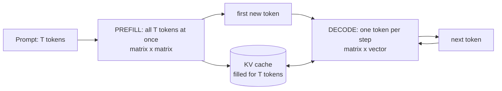
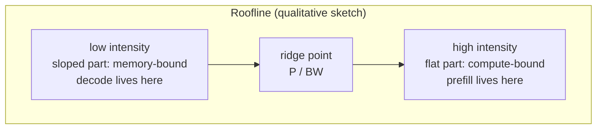
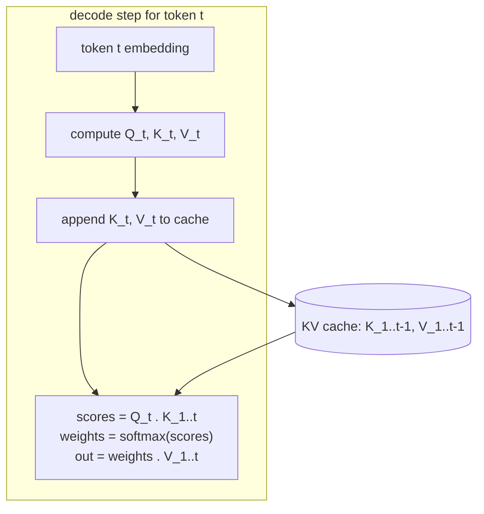
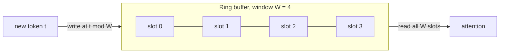
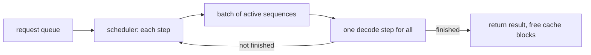
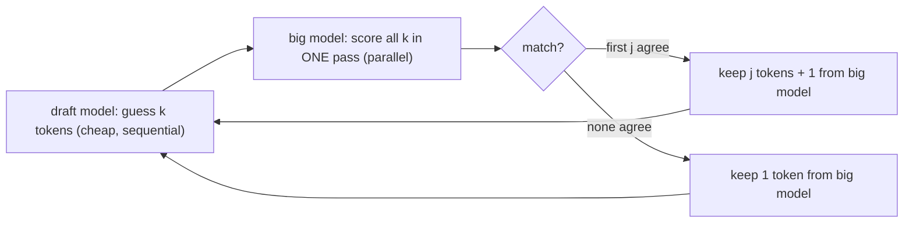
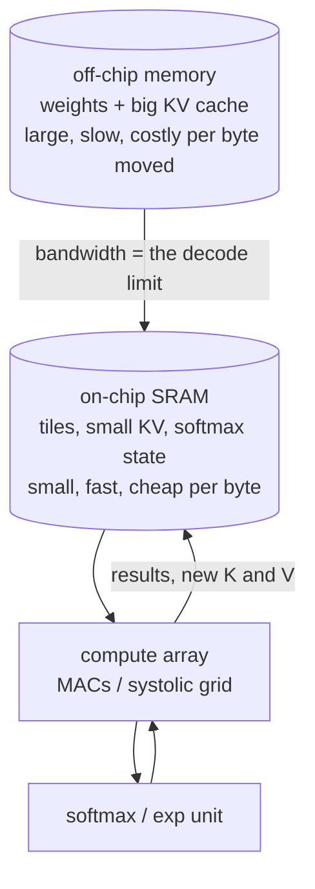

# LLM inference concepts, mapped to chip design

This page is for a reader who has finished `docs/WHY_AI.md` (especially section 7, the tiny transformer, and
section 8, number formats) and the repository `README.md`. It explains how a large language model (LLM) is *run*
once it is trained, and what each idea means for the silicon underneath.

**Honest status, read first.**

- Numbers marked **(illustrative computation)** are worked out in this page from a formula that is shown. They are
  arithmetic on made-up toy or generic parameters. They are not measurements and not claims about any real chip
  or any named commercial model.
- Numbers marked with a file path are read from this repository's own files.
- A tiny KV-cache attention engine is being built (see `model/kv_attention/spec.md` and `designs/kv_attn_*`).
  This page does not quote numbers from it; read those files once they land.

Contents: 1 two phases, 2 KV cache, 3 batching / speculation / tiling / softmax, 4 hardware consequences,
5 built here versus explained only, 6 intuitions and glossary.

---

## 1. The two phases: prefill and decode

Running an LLM on a prompt has two very different phases.



| | Prefill | Decode |
|---|---|---|
| Input per step | the whole prompt, T tokens | exactly 1 token (the one just produced) |
| Main operation | matrix x matrix (T rows share each weight) | matrix x vector (1 row per weight) |
| Weights reused | each weight is used T times | each weight is used once |
| Limited by | arithmetic (compute-bound) | reading weights and cache (memory-bound) |
| Sequential? | parallel across tokens | strictly one step after another |

The reason decode is sequential is the loop from `WHY_AI.md` section 7, step 1: generating text is a loop, and token
n+1 cannot be chosen before token n exists. You cannot parallelise across the future.

### 1.1 Arithmetic intensity

**Arithmetic intensity** = FLOPs performed per byte moved from memory.

```
intensity  =  FLOPs / bytes moved
```

A multiply-accumulate (MAC) is 2 FLOPs (one multiply, one add). Take one weight matrix W of size d x d.

**Worked toy example (illustrative computation).** Assume d = 64 and weights stored as int8 (1 byte each), and
ignore everything except this one matrix and its input and output vectors (2 bytes... see below).

Weight bytes: `d * d * 1 = 64 * 64 = 4096 bytes`.

*Decode* (1 token, matrix x vector). Each weight is used in exactly one MAC.

```
FLOPs  = 2 * d * d           = 2 * 64 * 64        = 8192
bytes  = d*d (weights) + d (input) + d (output)
       = 4096 + 64 + 64                            = 4224
intensity = 8192 / 4224                            = 1.94 FLOP/byte   (about 2)
```

*Prefill* (T = 32 tokens, matrix x matrix). The same 4096 weight bytes are read once and reused for 32 tokens.

```
FLOPs  = 2 * d * d * T       = 2 * 64 * 64 * 32   = 262144
bytes  = d*d + T*d (inputs) + T*d (outputs)
       = 4096 + 2048 + 2048                        = 8192
intensity = 262144 / 8192                          = 32 FLOP/byte
```

So the same matrix gives about 2 FLOP/byte in decode and 32 FLOP/byte in prefill. The ratio is roughly T,
because T tokens share one read of the weights. As d grows, the weight bytes dominate the traffic and the
intensity approaches `2*T*d*d / (d*d) = 2*T` FLOP per weight-byte (for 1-byte weights). For 2-byte weights, halve it.

### 1.2 The roofline idea

A chip has two limits: a compute peak P (FLOP/s the arithmetic array can do) and a memory bandwidth BW (bytes/s it
can fetch). A workload with intensity I can achieve at most:

```
attainable FLOP/s  =  min( P ,  BW * I )
ridge point        =  P / BW      (the intensity where the two limits meet)
```

**Illustrative computation with made-up chip numbers** (not any real chip): P = 100 GFLOP/s, BW = 10 GB/s.
Ridge point = 100 / 10 = 10 FLOP/byte.

| Workload | Intensity (from 1.1) | Attainable = min(P, BW x I) | Bound by |
|---|---|---|---|
| Decode, d = 64 int8 | 1.94 | min(100, 10 x 1.94) = 19.4 GFLOP/s | memory (19% of peak) |
| Prefill, T = 32 | 32 | min(100, 10 x 32) = 100 GFLOP/s | compute (at peak) |



In words: at low intensity the arithmetic units sit idle waiting for data, so adding more multipliers does
nothing; only more bandwidth (or fewer bytes) helps. At high intensity the memory is fast enough and more
multipliers help. Decode is on the sloped side, which is why LLM serving is mostly a memory problem.

---

## 2. The KV cache

### 2.1 What is stored and why

Attention (`WHY_AI.md` section 7) lets the newest token look at all earlier tokens. Each earlier token i
contributes a **key** K_i (what it offers for matching) and a **value** V_i (what it hands over when matched). The
new token makes a **query** Q and scores it against every K_i, then mixes the V_i.

The key fact: K_i and V_i depend only on token i and the (fixed) weights. They do not change when later tokens
arrive. Recomputing them at every step would repeat the same work again and again, so we compute them once and
**store** them. That store is the KV cache. `WHY_AI.md` section 7 (the line "This KV cache grows with every
token. It is memory, not arithmetic.") counts the entries in a toy; this page turns it into bytes.



Cost without the cache: step t recomputes t keys and values, so the total over n steps is about n^2/2 projections.
With the cache each step computes 1 and reads t cached entries. Compute is traded for storage and bandwidth.

### 2.2 Size formula

```
KV bytes = 2 x layers x heads x head_dim x seq_len x bytes_per_element x batch
           ^ K and V
```

**Tiny model (illustrative computation).** layers = 2, heads = 2, head_dim = 8, seq_len = 16, int8 (1 byte), batch = 1.

```
2 * 2 * 2 * 8 * 16 * 1 * 1  =  1024 bytes
```

That is 64 bytes per token (1024 / 16). A table of this size fits in a few hundred flip-flops' worth of
SRAM-style storage; it is the scale a teaching design can hold on chip.

**Generic mid-size configuration (illustrative computation).** These are assumed round parameters for the
arithmetic, not a description of any specific model: layers = 32, heads = 32, head_dim = 128 (so model width
32 x 128 = 4096), fp16 (2 bytes), sequence length 4096.

```
per token  = 2 * 32 * 32 * 128 * 2 bytes      = 524,288 bytes  = 512 KiB
per seq    = 512 KiB * 4096                    = 2,147,483,648 bytes = 2 GiB   (batch 1)
batch 8    = 8 * 2 GiB                         = 16 GiB
```

For comparison, the weights of such a configuration are about `12 x layers x width^2` parameters
(a common rule of thumb for a standard transformer block): `12 * 32 * 4096^2 = 6,442,450,944` parameters,
about 12.9 GB at 2 bytes each. The weights are shared by every sequence; the KV cache is **per sequence**.

### 2.3 Why it becomes the memory bottleneck

- It grows linearly with sequence length and with batch, while weights do not.
- At batch 8 and 4096 tokens the cache (16 GiB) in the assumed configuration exceeds the weights (12.9 GB).
- Every decode step must read the *entire* cache of its sequence (all K and V so far) to compute attention.
  Per step, attention does about `2 * 2 * seq_len * width` FLOPs per layer over `2 * seq_len * width * bytes`
  bytes. Each cached fp16 element is used in one MAC (2 FLOPs) and costs 2 bytes, so intensity is about
  1 FLOP/byte. Batching does **not** raise this: each sequence has its own cache, so
  no cache byte is shared between sequences. This is the opposite of weights (section 3.1).

So at long context, cache bandwidth and cache capacity, not arithmetic, set the speed and the number of users.

### 2.4 Techniques that shrink or tame the cache

| Technique | Idea | Effect on the formula | Cost |
|---|---|---|---|
| KV quantisation (int8 / int4) | store K and V in fewer bits (same idea as `WHY_AI.md` section 8, applied to activations) | bytes_per_element 2 -> 1 -> 0.5 (fp16 to int8 to int4: 2x and 4x smaller; 2 GiB -> 512 MiB at int4 in the example) | rounding error in scores; needs a scale per group; dequantise before use |
| Sliding window / ring buffer | keep only the last W tokens; the oldest slot is overwritten | seq_len replaced by W (fixed) | tokens older than W are forgotten; the model must work with that |
| Paged attention | allocate the cache in fixed-size blocks, mapped through a table, like virtual-memory pages | no change to total size; removes fragmentation and over-reservation | a block table and an indirection per access |
| Multi-query / grouped-query attention (MQA / GQA) | many query heads share few K/V heads | `heads` in the formula becomes the number of K/V heads: 32 -> 8 divides the example by 4 (2 GiB -> 512 MiB) | slight quality trade, trained in from the start |
| Cache eviction | drop entries judged unimportant (for example low attention mass) | seq_len effectively smaller | may drop something later needed |



A ring buffer is attractive in hardware because the write address is a small counter that wraps, and the
memory never grows. Paged attention is attractive in software because requests have unpredictable lengths and
fixed-size blocks avoid wasting space; it costs an extra table lookup per access.

---

## 3. Batching, speculation, tiling, softmax

### 3.1 Batching and scheduling

Decode is memory-bound because each weight is read to serve one token (section 1). If B different sequences are
decoded in the same step, the same weight read serves B tokens, so the weight-side intensity becomes about
B times higher.

**Illustrative computation.** Using the toy matrix of section 1.1 (d = 64, int8), a batch of B sequences:

```
FLOPs  = 2 * d * d * B
bytes  = d*d + 2*d*B
B = 1  : 8192   / 4224  = 1.94 FLOP/byte
B = 8  : 65536  / 5120  = 12.8 FLOP/byte
B = 32 : 262144 / 8192  = 32 FLOP/byte
```

With the made-up ridge point of 10 FLOP/byte, B = 8 is already past the ridge for the weight part. Batching is
decode's way of borrowing prefill's efficiency. It does not help the attention-over-cache part (section 2.3).

| | Static batching | Continuous (iteration-level) batching |
|---|---|---|
| Rule | collect B requests, run them together until **all** finish | every decode step, finished sequences leave and waiting ones join |
| Problem / benefit | short requests wait for the longest; slots sit idle | slots stay full; no waiting for the longest |
| Needs | nothing special | per-sequence cache management (so paged allocation helps) |



### 3.2 Speculative decoding

Idea: a small, fast **draft** model guesses the next k tokens; the big model then **verifies** all k guesses in
one parallel pass (which looks like a short prefill: k tokens share one weight read). Accepted guesses are kept;
at the first mismatch the big model's own token is used and drafting restarts.



The output distribution is designed to match the big model's, so quality does not change; only the number of
sequential big-model steps drops when guesses are often right. In roofline terms it converts several
memory-bound decode steps into one higher-intensity verify step.

### 3.3 FlashAttention-style tiling

Naive attention writes the full score matrix (T x T) to memory, reads it back for softmax, writes the
probabilities, reads them again to multiply by V. For long sequences those intermediate round trips dominate.

Tiling idea: process K and V in blocks small enough to sit in on-chip SRAM; for each block compute scores,
update a *running* softmax (running max and running sum, rescaling earlier partial results), and accumulate the
output, never writing the full T x T matrix to off-chip memory. The result is the same up to rounding; the
off-chip traffic falls because the intermediates stay on chip.

```
running state per query row:   m (max so far),  l (sum of exp so far),  o (output so far)
for each block of K, V:
    s     = q . K_block
    m_new = max(m, max(s))
    o     = o * exp(m - m_new) + exp(s - m_new) . V_block
    l     = l * exp(m - m_new) + sum(exp(s - m_new))
    m     = m_new
result = o / l
```

This is why softmax must be fusable with the matrix multiplies, and why the on-chip SRAM size sets the best tile size.

### 3.4 Softmax in hardware

`softmax(s_i) = exp(s_i) / sum_j exp(s_j)`. Three hardware problems:

1. **exp** is not a cheap operation (no small closed form in adders and shifters).
2. **Overflow:** exp of a large score overflows. The standard fix is **max-subtraction**: use
   `exp(s_i - max_j s_j)`. The result is mathematically identical, and every exponent is now <= 0, so every
   value is in (0, 1]. Hardware needs a max-finding pass (or the running max of section 3.3).
3. **Normalisation** needs a sum and a division (or a reciprocal multiply) per row.

Cheap approximations, in rising order of aggressiveness:

| Approximation | How | Trade |
|---|---|---|
| Base-2 and shift | use 2^x instead of e^x (fold ln 2 into the score scale); 2^integer part is a shift, 2^fraction a tiny table or polynomial | small table, no multiplier for the integer part; the model must tolerate the change (train or calibrate with it) |
| Piecewise linear | approximate exp by a few straight segments (slope and offset per segment) | one multiply-add and a small lookup; error depends on the segment count |
| Hard attention (argmax) | skip exp and division; pick the single best-scoring key and copy its value | no exp, no sum, no divide; but loses blending of several tokens (`WHY_AI.md` section 7, step 2, builds exactly this) |

`WHY_AI.md` section 7 goes from hard attention (step 2) to soft attention (step 3): the hardware difference
between them is precisely this section.

---

## 4. Mapping to chip design

Each concept leaves a footprint on the silicon. Statements here are qualitative on purpose: the real numbers depend
on the process, the design and the memory technology, and none are claimed here.

| Concept | Hardware consequence |
|---|---|
| Decode is memory-bound | Memory bandwidth, not multiplier count, sets speed. Spend area and power on wide, close, fast memory interfaces rather than more MACs. |
| Prefill is compute-bound | Wants a large, dense MAC array (for example a systolic array: a grid where operands flow between neighbours) that is kept fed. |
| One chip for both phases | The array shape is a compromise: tall and wide for matrix x matrix, but a matrix x vector uses only one row/column of it and leaves the rest idle. Designs differ in how they handle this. |
| Weights read once per token | Weights are far larger than any on-chip SRAM, so they stream from off-chip memory (or from a separate memory die); weight bandwidth is a headline spec. |
| KV cache size | Capacity: the cache for many sequences does not fit on chip, so most lives in off-chip memory. Small caches (tiny models, short windows) can live in on-chip SRAM, which is exactly the regime a small teaching chip can inhabit. |
| KV cache bandwidth | Each decode step re-reads the sequence's whole cache; bandwidth demand grows with context and batch. GQA/MQA and KV quantisation cut bytes read per step directly. |
| KV quantisation | Narrower SRAM words and datapaths (see `WHY_AI.md` section 8 and `docs/PRECISION_STUDY.md`: fewer bits moved per inference); extra dequantise/scale logic at the array input. |
| Ring buffer | A wrapping write pointer and fixed-size SRAM: tiny control logic, no allocator. |
| Paged attention | A block table (a small memory) plus an address-translation step in the cache read path: like a miniature MMU. |
| Continuous batching | Mostly software/scheduler, but the hardware must support many independent cache regions and fast switching between sequences. |
| Speculative decoding | Needs the chip to run a short parallel verify efficiently (a mini prefill) and to hold two models' weights. |
| FlashAttention tiling | On-chip SRAM capacity bounds the tile; softmax must sit close to the array (running max/sum registers, exp unit) so intermediates never leave the die. |
| Softmax | Needs an exp unit (table / piecewise linear / shift), a max compare tree, a sum accumulator and a reciprocal or divider. Hard attention replaces all of it with a comparator. |
| Data movement energy | Moving a byte from off-chip memory costs much more energy than a MAC on that byte, and on-chip SRAM sits between the two. The ordering (arithmetic cheapest, off-chip most expensive) is a well-established qualitative fact; the ratios depend on the process and are not quoted here. This is why every technique above aims to move fewer bytes. |
| Interconnect | Multi-chip serving (a model split over chips) adds chip-to-chip links; the KV cache of a sequence and its weights then compete for link bandwidth too. |



---

## 5. What this repository builds versus explains

The repository rule (see `README.md`) is that every design is small, hardens in under about ten minutes and is
verified exhaustively. Concepts that cannot be shrunk to that size stay as explanation.

| Concept | Built here | Explained only (and why) |
|---|---|---|
| Prefill (many tokens at once) | `tiny_kv_attention` variants, being built: `designs/kv_attn_*` with spec in `model/kv_attention/spec.md` | |
| Decode (one token at a time) | same family, being built (`designs/kv_attn_*`) | |
| KV cache (store K and V) | same family, being built (`designs/kv_attn_*`; `model/kv_attention/spec.md`); concept and toy entry counts in `docs/WHY_AI.md` section 7 | |
| int4 KV cache | an int4-KV variant in the same family, being built; the number-format study of weights is `docs/PRECISION_STUDY.md` (int4 moves 83 bits per inference against 356 for fp32, "bits moved per inference" table) | |
| Ring-buffer cache | a ring-buffer variant in the same family, being built (`designs/kv_attn_*`) | |
| Quantisation (number formats) | seven precision engines `designs/prec_{bin,tern,int4,int8,fp8,fp16,bf16}/`; results in `docs/PRECISION_STUDY.md` (Study table A: int4 94.25 % vs bf16 94.00 % accuracy on its 2000-image test set; this is a tiny image neuron, not an LLM) | |
| Data-movement cost | `firmware/README.md`: about 55 CPU clocks per bus write; accelerator round trip 490 to 728 clocks against 6 to 15 clocks of computation (cycle table in that file) | |
| Interface glue dominating | `designs/soc_image_text_match/NOTES.md`: the Wishbone adapter FIFOs and logic are 354 of 393 flip-flops (90.1 %), the engine 39 | |
| Hard attention, soft attention | computed in Python in `docs/WHY_AI.md` section 7 (script, no chip) | |
| Paged attention | | Needs a block table, an allocator and variable-length sequences: dynamic memory management, not a small fixed datapath; hard to cover exhaustively. |
| MQA / GQA | | A change to head sharing that only matters with many heads and large caches; the tiny engines do not have enough heads for it to show anything. |
| Continuous batching | | A scheduler over many live requests with a large state space; it is system software and queueing, not a small block. |
| Speculative decoding | | Needs two models and an accept/reject protocol over distributions; far outside a tiny exhaustively checkable block. |
| FlashAttention tiling | | Pays off only when the sequence exceeds on-chip SRAM; the tiny sequences here fit entirely on chip, so there is nothing to tile. |
| Multi-head, multi-layer | | Multiplies area and verification space by heads x layers; the repository keeps one head, one layer. |

Why "explained only": each of those items would break at least one of the three rules (small enough to
harden in under about ten minutes, small enough to verify exhaustively, small enough to read in an afternoon).
The point of the built family is to show the *kernel* (store K and V, read them back, attend) honestly;
the techniques around it are system-scale.

Note on the data-movement rows: they are measurements of different, smaller systems (a PicoRV32 CPU and a
generic Wishbone adapter), not of an LLM. They illustrate the same lesson in miniature: moving data costs more
than computing on it, and interface storage can dwarf the engine.

---

## 6. Intuitions and glossary

### Intuitions

1. Decode is a stream of tiny matrix x vector jobs; the chip spends most of its time waiting for memory, not
   multiplying.
2. Prefill and decode have the same math but different shapes; the shape (T rows versus 1 row) sets the arithmetic
   intensity, and intensity sets which limit you hit.
3. Arithmetic intensity (FLOPs per byte) is the single most useful number for guessing where a design is stuck.
   In the toy computation it was about 2 (decode) versus 32 (prefill) for the same weights.
4. The KV cache is "compute traded for memory": it removes repeated work but creates a capacity and bandwidth
   problem that grows with every token and every user.
5. Weights are shared across users; the cache is not. Batching amortises weight reads but not cache reads.
6. Every cache-shrinking trick is a trade: fewer bits (quantisation), fewer tokens (window, eviction), fewer
   heads (GQA). None is free; each moves a quality or flexibility cost somewhere else.
7. A ring buffer is the hardware-friendly cache: a wrapping counter and a fixed SRAM. Paged attention is the
   software-friendly cache: flexible, but it needs a table and a lookup.
8. Softmax is the awkward non-multiply in the pipeline. Subtract the max first, then use any exp
   approximation the model tolerates; the cheapest extreme (argmax) removes it entirely.
9. Keeping intermediates on chip (tiling) is worth more than faster arithmetic whenever the alternative is a trip
   to off-chip memory. Energy follows bytes moved.
10. Small teaching designs live in the regime where everything fits on chip, so they show the kernel but not the
    bottlenecks of the real thing. State that limit every time (as `WHY_AI.md` does in its honest-limits sections).
11. Glue can dominate: in this repository a generic bus adapter was 90 % of a macro's flip-flops
    (`designs/soc_image_text_match/NOTES.md`). Data movement and storage are the expensive primitives.
12. A roofline picture beats a spec sheet: place the workload on it first, then decide whether to buy compute,
    bandwidth or capacity.

### Glossary

| Term | Meaning |
|---|---|
| Prefill | Processing the whole prompt in parallel; fills the KV cache. |
| Decode | Generating one token at a time, each using the cache. |
| FLOP | One floating-point operation; a MAC counts as 2. |
| MAC | Multiply-accumulate, `acc = acc + a * b`. |
| Arithmetic intensity | FLOPs per byte moved from memory. |
| Roofline | Model: attainable speed = min(compute peak, bandwidth x intensity). |
| Ridge point | Intensity where the compute and bandwidth limits meet (peak / bandwidth). |
| Compute-bound / memory-bound | Limited by arithmetic units / by data supply. |
| Query, key, value (Q, K, V) | The three projections of a token used by attention. |
| KV cache | Stored K and V of all earlier tokens of one sequence. |
| head, head_dim | One independent attention unit, and the width of its vectors. |
| MQA / GQA | Multi-query / grouped-query attention: many query heads share one / a few K,V heads. |
| Ring buffer | Fixed-size store where the newest entry overwrites the oldest; write index wraps. |
| Sliding window | Attending only to the last W tokens. |
| Paged attention | KV cache allocated in fixed blocks via a block table, like virtual-memory pages. |
| Eviction | Dropping cache entries judged least useful. |
| Quantisation | Storing numbers with fewer bits plus a scale (see `WHY_AI.md` section 8). |
| Static / continuous batching | Fixed groups run to completion / sequences join and leave every step. |
| Speculative decoding | Draft model guesses, big model verifies in one parallel pass. |
| FlashAttention (tiling) | Attention computed block by block in on-chip SRAM with a running softmax. |
| Softmax | `exp(s_i) / sum_j exp(s_j)`; turns scores into weights that sum to 1. |
| Max-subtraction | Subtract the largest score before exp to avoid overflow; result unchanged. |
| Hard attention | Pick the single best-scoring key (argmax) instead of a weighted mix. |
| SRAM | Fast on-chip memory made of small cells (the FIFOs in this repository are built from flip-flops). |
| Systolic array | Grid of MACs where data flows between neighbours each clock. |
| Wishbone | The bus used between CPU and accelerator in this repository's SoC. |
