# OpenROAD engines: what each one does and how they connect

OpenROAD is a single executable (`openroad`) that holds one in-memory database, OpenDB (`odb`), and a set of
engines (called modules or tools) that all read and write that database. Each engine registers Tcl commands
(and, for the database, a Python API) in its own namespace: `ifp::`, `gpl::`, `drt::`, and so on. A flow is just a
script that loads LEF, liberty, a netlist and an SDC, then calls engine commands in order. Timing questions from
any engine are answered by the embedded OpenSTA (`sta`), which sits on the same database.

This repo drives OpenROAD through LibreLane 3.0.2 (image `ghcr.io/librelane/librelane:3.0.2`). Verified inside
that image:

| Item | Value (how checked) |
|------|---------------------|
| `openroad -version` | `dcf36133a369abc8f3c5e5738cd4d82e4903c0e0` (ran the image) |
| OpenROAD package in the image | `openroad-2026-02-17-python3-3.13.9-env` (from `which openroad`) |
| Standalone OpenSTA `sta -version` | `2.7.0` (ran the image; used by the STA steps, see below) |
| Python in the image | 3.13.9, with the LibreLane `scripts/odbpy` helpers run through `openroad -python` |

Evidence used for this part: `designs/kv_attn_n8/runs/RUN_2026-10-06_07-00-35/` (78 steps; per step `COMMANDS`,
`runtime.txt`, `state_in.json`, `state_out.json`, `*.log`), the LibreLane scripts inside the image
(`librelane/scripts/openroad/*.tcl`, `scripts/odbpy/*.py`), and
`designs/user_project_wrapper_soc_kv/runs/RUN_2026-10-06_08-13-27/`. Run directories are git-ignored, so these
paths exist only on the machine that ran the flow.

## How to read this page

- Sections: [The engine map](#the-engine-map), [System diagram](#system-diagram),
  [LibreLane step -> engine table](#librelane-step---engine-table), [Shared infrastructure](#shared-infrastructure),
  [Floorplan and placement engines](#floorplan-and-placement-engines),
  [Clock tree, routing and signoff engines](#clock-tree-routing-and-signoff-engines), [Unverified items](#unverified-items).
- Every engine section has the same parts: purpose and origin, meta features (knobs and Tcl commands), where it sits in
  the LibreLane flow, inputs -> outputs, a diagram, and what it did in this repository with numbers cited to files.
- Example runs used throughout (the placement part calls them KV / SOC / WR, the routing part Run A / B / W):
  - KV = Run A: `designs/kv_attn_n8/runs/RUN_2026-10-06_07-00-35` (a plain 260 x 260 um engine, 78 steps).
  - SOC = Run B: the `soc_kv_attn_n8` run (300 x 300 um Caravel macro with `pin_order.cfg` and the Caravel SDC).
  - WR = Run W: the `user_project_wrapper_soc_kv` run (the fixed Caravel wrapper; elaborate-only synthesis, manual macro
    placement, no CTS or resizer).
- Origin and algorithm statements that could not be checked against the binary or a log are marked "not verified".
- Pictures of these engines' results (placement density, congestion, IR drop, clock tree, worst path) from OpenROAD's own GUI, rendered off-screen: [examples/openroad_gui/README.md](../examples/openroad_gui/README.md).
- Related: the EDA open-source vs proprietary table in the [README](../README.md#eda-perspective-open-source-vs-proprietary),
  the [harden-design skill](../.claude/skills/harden-design/SKILL.md) for failures and fixes.

## The engine map

Namespaces found in the binary by listing `namespace children ::` and counting `info commands ::<ns>::*`
(the count is the number of Tcl procs and commands in that namespace, a rough size indicator, not a feature
count). The "origin" column is the project the module is based on, from general knowledge of OpenROAD; where the
binary itself does not prove it, the entry says "unverified". No algorithm is described beyond what a command
name or log message shows.

| Code | Name / origin | One-line purpose | Procs | Used in this repo's flow? |
|------|---------------|------------------|------:|---------------------------|
| `ord` | OpenROAD application core | Read/write LEF, DEF, ODB, Verilog; thread count; version | 53 | yes, every `openroad-*` step |
| `odb` | OpenDB | The design database and its C++/Tcl/Python API | 3691 | yes, every step (the `.odb` file) |
| `utl` | Utilities | Logger (message IDs such as GPL-0001), metrics (`-metrics or_metrics_out.json`), output redirection | 30 | yes, every step |
| `sta` | OpenSTA (Parallax Software) | Static timing analysis, liberty/SDC/SPEF, power | 1247 | yes: `staprepnr`, `stamidpnr*`, `stapostpnr`, plus inside rsz/cts/gpl |
| `est` | Parasitics estimation (split out of the resizer; unverified history) | `estimate_parasitics -placement` / `-global_routing`, layer RC | 24 | yes: gpl, rsz, cts, grt, sta steps |
| `stt` | Steiner tree library (FLUTE and PD trees; commands `report_flute_tree`, `report_pd_tree` prove both exist) | Net topologies for estimation and routing | 22 | indirectly (used by est/rsz/grt/cts; usage inside them unverified) |
| `ifp` | InitFloorplan | Die/core area, rows, tracks, tie cells | 13 | yes: `floorplan` |
| `ppl` | ioPlacer (pin placer) | Assign I/O pins to boundary slots | 32 | yes: `ioplacement` |
| `pdn` | PDN generator (pdngen) | Rings, stripes, rails, vias for power grid | 55 | yes: `generatepdn` |
| `tap` | Tapcell | Row cutting, well taps, endcaps | 12 | yes: `cutrows`, `tapendcapinsertion` |
| `mpl` | Hierarchical macro placer (mpl2; commands `rtl_macro_placer_cmd`, `place_macro`) | Macro placement | 8 | no: kv_attn_n8 has no macros; wrapper places its macro manually (`odb-manualmacroplacement`) |
| `gpl` | RePlAce | Analytical global placement (Nesterov), timing and routability driven options | 20 | yes: `globalplacementskipio`, `globalplacement` |
| `dpl` | OpenDP | Legalise placement, fillers, placement checks | 17 | yes: `detailedplacement`, and inside rsz/cts/fill steps |
| `rsz` | Resizer | Buffering, sizing, repair_design, repair_timing, tie fanout | 82 | yes: `repairdesignpostgpl`, `resizertimingpostcts`, `repairdesignpostgrt` |
| `rmp` | Restructure (blif and annealing commands; ABC-based, unverified) | Logic restructuring / resynthesis | 15 | no |
| `cts` | TritonCTS | Clock tree synthesis | 77 | yes: `cts` |
| `grt` | Global router (FastRoute 4.1 based, unverified) | Global routing, congestion, route guides | 54 | yes: `globalrouting` |
| `drt` | TritonRoute | Detailed routing, DRC-aware | 28 | yes: `detailedrouting` |
| `ant` | Antenna checker | Antenna ratio check (`check_antennas`) | 4 | yes: `checkantennas`, `checkantennas-1` |
| `fin` | Finale | Metal density fill (`density_fill`); not the same as std-cell filler | 2 | no (LibreLane uses `dpl::filler_placement` and signoff fill elsewhere) |
| `rcx` | OpenRCX | Parasitic extraction to SPEF from process rules | 18 | yes: `rcx` |
| `psm` | PDNSim | IR drop and power-grid connectivity | 12 | yes: `generatepdn` (connectivity), `irdropreport` |
| `pad` | ICeWall (unverified name) | Pad ring, bump arrays, RDL routing for chip-level pads | 27 | no (Caravel supplies the padring) |
| `par` | TritonPart | Hypergraph/design partitioning | 17 | no |
| `dft` | Design for test | Scan replace/optimize/stitch (`scan_replace`, `execute_dft_plan`) | 9 | no |
| `dst` | Distributed computing support | Workers and load balancer (used by `detailed_route -distributed`) | 3 | no |
| `cgt` | Clock gating | `clock_gating` command (new module; purpose from command name) | 3 | no |
| `upf` | UPF power intent | Power domains, level shifters, `write_upf` | 23 | no |
| `ram` | RAM generator | `generate_ram_netlist` and ram filler/pdn/routing helpers | 15 | no |
| `gui` | Qt GUI and Tcl GUI commands | Layout viewer, heat maps, debug | 82 | no (headless; `scripts/openroad/gui.tcl` exists but no step runs it) |
| `exa` | Example module | Template for writing a new module (unverified) | 3 | no |

Also present but not OpenROAD modules: `oo`, `tcl`, `zlib` (Tcl/runtime internals). Standalone tools used next to
OpenROAD in the same image: `yosys` (synthesis), `magic`, `klayout`, `netgen`, and a separate `sta` binary
(`which sta` gives an OpenSTA package, version 2.7.0).

## System diagram

How the whole flow runs here. Each box is a LibreLane step group; edge labels name the artefact handed on.
Every OpenROAD box opens the previous `.odb`, works through engines on one OpenDB, and writes a new `.odb`
(plus `.def`, `.nl.v`, `.sdc` copies, see the state files). Timing queries from every stage go through
OpenSTA with parasitics from `est` (placement or global-route estimate) until RCX writes SPEF.

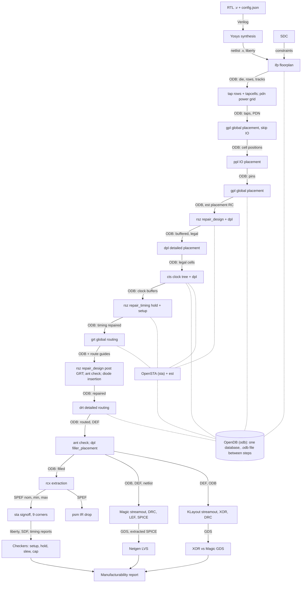

Data formats on the edges: liberty (`.lib`, 9 timing corners at signoff, 3 `nom_*` corners mid-flow), SDC
(`.sdc`), LEF/tech LEF (read at each step start), netlist (`.nl.v`, powered `.pnl.v`), `.odb` (the carrier), `.def`
(written next to each ODB), SPEF (`56-openroad-rcx`), SDF (`57-openroad-stapostpnr`), GDS (Magic and KLayout).

## LibreLane step -> engine table

Run: `designs/kv_attn_n8/runs/RUN_2026-10-06_07-00-35/`, 78 steps in total. Below are the 46 `openroad-*` and
`odb-*` steps (the other 32 are Verilator, Yosys, checkers, Magic, KLayout and Netgen). "Engines and commands"
comes from the step's `COMMANDS` file and the LibreLane script it names (`scripts/openroad/*.tcl`, or
`scripts/odbpy/*.py` run with `openroad -python`); steps with no `COMMANDS` file spawn no process, so the
engine column says what LibreLane's Python code does instead. In/out is the state change taken from
`state_in.json` / `state_out.json` (a changed `odb` path means the step wrote a new database). Time is
`runtime.txt` (hh:mm:ss.mmm).

| # | Step | Engines and commands | State in -> out | Wall time |
|--:|------|----------------------|-----------------|-----------|
| 10 | `openroad-checksdcfiles` | none (LibreLane Python check of SDC files; no COMMANDS file) | nl -> nl | 00:00:00.002 |
| 11 | `openroad-checkmacroinstances` | none run (no COMMANDS file; sta/check_macro_instances.tcl exists for designs with macros) | nl -> nl | 00:00:00.001 |
| 12 | `openroad-staprepnr` | standalone OpenSTA `sta` x3 nom corners, sta/corner.tcl: read_timing_info (netlist + SDC + liberty), report_checks, report_power | nl -> reports | 00:00:00.740 |
| 13 | `openroad-floorplan` | ifp: initialize_floorplan, insert_tiecells; reads LEF/liberty/netlist | nl -> odb, def, sdc | 00:00:00.519 |
| 14 | `openroad-dumprcvalues` | est/sta: dump_rc.tcl (set_wire_rc, est::layer_resistance/capacitance, report_units); report only | odb -> same | 00:00:00.424 |
| 15 | `odb-checkmacroantennaproperties` | odb Python (check_antenna_properties.py); no COMMANDS file | odb -> same | 00:00:00.001 |
| 16 | `odb-setpowerconnections` | odb Python API via `openroad -python` (power_utils.py set-power-connections) | odb -> odb, def | 00:00:00.415 |
| 17 | `odb-manualmacroplacement` | odb Python (placers.py); no COMMANDS file, no macros in this design | odb -> same | 00:00:00.001 |
| 18 | `openroad-cutrows` | tap: cut_rows | odb -> odb, def | 00:00:00.417 |
| 19 | `openroad-tapendcapinsertion` | tap: tapcell (endcaps and well taps) | odb -> odb, def | 00:00:00.518 |
| 20 | `odb-addpdnobstructions` | odb Python (defutil.py), no COMMANDS file | odb -> same | 00:00:00.002 |
| 21 | `openroad-generatepdn` | pdn: pdngen (define_pdn_grid, add_pdn_stripe, add_pdn_connect, ...); psm: check_power_grid | odb -> odb, def | 00:00:00.524 |
| 22 | `odb-removepdnobstructions` | odb Python (defutil.py), no COMMANDS file | odb -> same | 00:00:00.001 |
| 23 | `odb-addroutingobstructions` | odb Python (defutil.py), no COMMANDS file | odb -> same | 00:00:00.001 |
| 24 | `openroad-globalplacementskipio` | gpl: global_placement -skip_io | odb -> odb, def | 00:00:00.623 |
| 25 | `openroad-ioplacement` | ppl: place_pins | odb -> odb, def | 00:00:00.519 |
| 26 | `odb-customioplacement` | odb Python (io_place.py); no COMMANDS file, not used here | odb -> same | 00:00:00.001 |
| 27 | `odb-applydeftemplate` | odb Python (apply_def_template.py); no COMMANDS file, not used here | odb -> same | 00:00:00.001 |
| 28 | `openroad-globalplacement` | gpl: global_placement (+ -timing_driven, -routability_driven per config), est: estimate_parasitics -placement | odb -> odb, def | 00:00:00.621 |
| 29 | `odb-writeverilogheader` | odb Python (power_utils.py write-verilog-header) | odb -> vh | 00:00:00.419 |
| 31 | `openroad-stamidpnr` | openroad corner.tcl: est estimate_parasitics -placement, sta reports (nom corners) | odb -> reports | 00:00:00.723 |
| 32 | `openroad-repairdesignpostgpl` | rsz: buffer_ports, repair_design, repair_tie_fanout (remove_buffers when configured); est; dpl legalization | odb -> odb, def, nl, sdc | 00:00:02.454 |
| 33 | `odb-manualglobalplacement` | odb Python (placers.py); no COMMANDS file | odb -> same | 00:00:00.001 |
| 34 | `openroad-detailedplacement` | dpl: detailed_placement, check_placement | odb -> odb, def | 00:00:00.519 |
| 35 | `openroad-cts` | cts: clock_tree_synthesis, repair_clock_inverters, repair_clock_nets; est; then dpl legalization | odb -> odb, def, nl, sdc | 00:00:04.787 |
| 36 | `openroad-stamidpnr-1` | openroad corner.tcl (est placement + sta) | odb -> reports | 00:00:00.729 |
| 37 | `openroad-resizertimingpostcts` | rsz: repair_timing (hold and setup); est; dpl legalization | odb -> odb, def, nl, sdc | 00:00:03.072 |
| 38 | `openroad-stamidpnr-2` | openroad corner.tcl (est placement + sta) | odb -> reports | 00:00:00.723 |
| 39 | `openroad-globalrouting` | grt: global_route (+ write_guide); set_routing_layers, set_global_routing_layer_adjustment; est: estimate_parasitics -global_routing | odb -> odb, def, route guides | 00:00:00.525 |
| 40 | `openroad-checkantennas` | ant: check_antennas -verbose | odb -> report | 00:00:00.839 |
| 41 | `openroad-repairdesignpostgrt` | rsz: repair_design with global-route parasitics; grt re-run; dpl | odb -> odb, def, nl, sdc | 00:00:02.656 |
| 42 | `odb-diodesonports` | odb Python (diodes.py); no COMMANDS file | odb -> same | 00:00:00.003 |
| 43 | `odb-heuristicdiodeinsertion` | composite: odb Python fuzzy diode placement, then dpl, then grt (3 sub-step dirs) | odb -> odb, def, nl, sdc | 00:00:01.709 |
| 44 | `openroad-repairantennas` | composite: ant/grt repair_antennas (diode insertion), then check_antennas (2 sub-step dirs) | odb -> odb, def | 00:00:02.212 |
| 45 | `openroad-stamidpnr-3` | openroad corner.tcl (est global routing + sta) | odb -> reports | 00:00:00.829 |
| 46 | `openroad-detailedrouting` | drt: detailed_route (+ check_antennas/repair_antennas loop up to DRT_ANTENNA_REPAIR_ITERS) | odb -> odb, def, nl, sdc | 00:00:19.220 |
| 47 | `odb-removeroutingobstructions` | odb Python (defutil.py); no COMMANDS file | odb -> same | 00:00:00.001 |
| 48 | `openroad-checkantennas-1` | ant: check_antennas -verbose | odb -> report | 00:00:00.718 |
| 50 | `odb-reportdisconnectedpins` | odb Python (disconnected_pins.py) via `openroad -python` | odb -> odb, def | 00:00:00.522 |
| 52 | `odb-reportwirelength` | odb Python (wire_lengths.py) via `openroad -python` | odb -> report | 00:00:00.422 |
| 54 | `openroad-fillinsertion` | dpl: filler_placement | odb -> odb, def, nl, sdc | 00:00:00.620 |
| 55 | `odb-cellfrequencytables` | odb Python (cell_frequency.py) + buffer_list.tcl (read_liberty) | odb -> odb, def | 00:00:01.039 |
| 56 | `openroad-rcx` | rcx: define_process_corner, extract_parasitics, write_spef; run 3 times (nom, min, max) | def -> spef | 00:00:00.631 |
| 57 | `openroad-stapostpnr` | standalone OpenSTA `sta` x9 corners (sta/corner.tcl; reads netlist + SDC + SPEF); odb Python filter_unannotated.py x9 via `openroad -python` | nl, sdc, spef -> sdf, lib, reports | 00:00:04.425 |
| 58 | `openroad-irdropreport` | psm: analyze_power_grid on vccd1 and vssd1; read_spef; set_wire_rc | odb, spef -> irdrop.rpt, net-*.csv | 00:00:01.037 |
| 63 | `odb-checkdesignantennaproperties` | odb Python (check_antenna_properties.py) on the final design; no COMMANDS file | odb -> same | 00:00:00.526 |

Notes on the table:

- All OpenROAD scripts start with `common/io.tcl`: it loads tech LEF and cell LEFs, liberty per corner, the netlist
  or `.odb`, the SDC, then applies `set_global_connections` (power pins) before the real work, and ends with
  `write_views` (writes `.odb`, `.def`, `.nl.v`, `.pnl.v`, `.sdc`).
- Steps 12 `staprepnr` and 57 `stapostpnr` run the standalone `sta` binary, not `openroad`. Because
  there is no `::ord` namespace there, `corner.tcl` takes the `read_timing_info` branch (netlist plus SDC plus SPEF).
  The mid-flow `stamidpnr*` steps (31, 36, 38, 45) run inside `openroad`, read the `.odb`, and use `est`.
- Steps 43 and 44 are composite steps: their sub-step directories are `43-.../1-odb-fuzzydiodeplacement`,
  `2-openroad-detailedplacement`, `3-openroad-globalrouting` and `44-.../1-openroad-diodeinsertion`,
  `2-openroad-checkantennas`.
- Largest time: step 46 `detailedrouting` at 00:00:19.220 (the table). Step 35 `cts` is 00:00:04.787 and 57
  `stapostpnr` is 00:00:04.425.
- Counts quoted from step logs: 13 floorplan reports core area 58890.230 um^2 and 87 rows
  (`13-openroad-floorplan/openroad-floorplan.log`); 19 inserted 174 endcaps and 845 tapcells; 25 placed 24 I/O
  pins; 28 saw 1792 instances (773 movable, 1019 fixed); 32 inserted 12 input and 11 output buffers and 100
  buffers in 45 nets; 35 created 49 clock buffers for 208 sinks; 37 inserted 172 hold buffers for 173 endpoints
  with hold violations; 39 global route wirelength 52412 um; 40 found 1 antenna net violation and 48 found 0;
  46 ended with 0 DRC violations; 54 placed 11810 fillers.

### How the wrapper run differs

`designs/user_project_wrapper_soc_kv/runs/RUN_2026-10-06_08-13-27/` has 69 numbered step directories against 78.
Its `config.json` sets `SYNTH_ELABORATE_ONLY` true (Yosys only elaborates the hand-written wrapper, no technology
mapping), `RUN_CTS` false, `RUN_POST_GPL_DESIGN_REPAIR` false, `RUN_POST_CTS_RESIZER_TIMING` false,
`DESIGN_REPAIR_BUFFER_INPUT_PORTS` false, `RUN_ANTENNA_REPAIR` false, `RUN_FILL_INSERTION` false,
`RUN_TAP_ENDCAP_INSERTION` false, `RUN_IRDROP_REPORT` false, `PDN_ENABLE_RAILS` false, and
`ERROR_ON_SYNTH_CHECKS` false (the one allowed exception in CLAUDE.md). The die is the fixed 2920 x 3520 um
Caravel user area with a fixed DEF template (`FP_DEF_TEMPLATE` under `fixed_dont_change/`), so the IO steps
(`23-openroad-globalplacementskipio`, `24-openroad-ioplacement`) take 00:00:00.001 each and do nothing. The
macro is placed by hand (`odb-manualmacroplacement` / `odb-manualglobalplacement`) rather than by `mpl`. Missing
compared with kv_attn_n8: tap/endcap insertion, `repairdesignpostgpl`, `cts`, `resizertimingpostcts`,
`repairdesignpostgrt`, the heuristic diode steps, `repairantennas`, `fillinsertion`, `irdropreport`.
Present: floorplan, cutrows, generatepdn (with `PDN_CORE_RING` true), gpl, dpl, grt, drt, rcx, and the 9-corner
`stapostpnr` (49, 00:00:10.870 there). Runtimes of the OpenROAD steps are in
`runs/*/<step>/runtime.txt`; for example wrapper `39-openroad-detailedrouting` took 00:00:01.939.

## Shared infrastructure

### odb: OpenDB

Purpose: the single in-memory design database every engine reads and edits: technology (layers, vias, rules from
tech LEF), library (masters from cell LEF), and design (block, instances, nets, pins, rows, tracks, shapes, blockages,
route guides). The `odb::` namespace has 3691 procs, the largest of all, because it exposes the whole C++ object
model to Tcl and Python.

Meta features: loadable from and writable to a binary `.odb` file (`read_db`/`write_db`), also LEF, DEF and Verilog
via `ord`; Python scripts in LibreLane (`scripts/odbpy/*.py`) use the same objects through `openroad -python`, which
is how steps such as `odb-setpowerconnections` and `odb-reportwirelength` work; DEF and abstract LEF writers
(`ord::write_def_cmd`, `ord::write_abstract_lef_cmd`) are present in the binary.

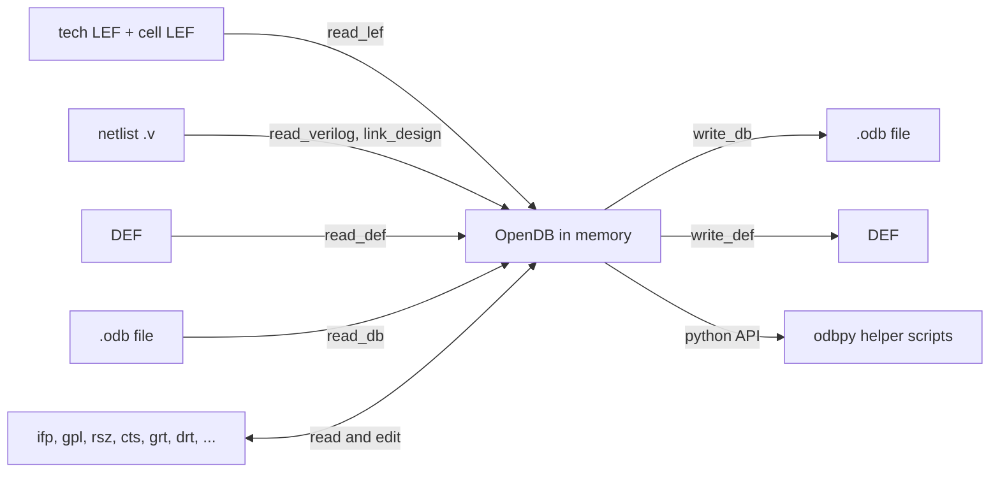

In this repo: the carrier between steps. `state_out.json` of step 57 points `odb` at
`55-odb-cellfrequencytables/kv_attn_n8.odb` and `def` at the same directory: the `.odb` chain is rewritten by
steps that edit the design (for example 13, 16, 18, 19, 21, 24, 25, 28, 32, 34, 35, 37, 39, 41, 43, 44, 46, 50, 54,
55, per the changed paths in the state files); other steps pass the path through unchanged.

### sta: OpenSTA

Purpose: static timing analysis engine: reads liberty (`read_liberty -corner`), SDC (`read_sdc`), netlist, SPEF
(`read_spef`), computes arrival, required and slack, slews and capacitances, clock skew, power (`report_power`),
and checks max slew / capacitance / fanout (`report_check_types`). It is both embedded in `openroad` (`::sta`, 1247
procs) and shipped as a separate `sta` binary (2.7.0 here).

Meta features: multiple corners (`define_corners`), SDF and liberty writers, path reports (`report_checks`,
`report_clock_skew`, `report_wns`, `report_tns`), unannotated-net reports (`report_parasitic_annotation`).
LibreLane's `sta/corner.tcl` loops over corners and writes per corner `min.rpt`, `max.rpt`, `wns.*`, `tns.*`, `ws.*`,
`skew.*`, `power.rpt`, `checks.rpt`, `violator_list.rpt` and metrics such as `timing__setup__ws__corner:<name>`.

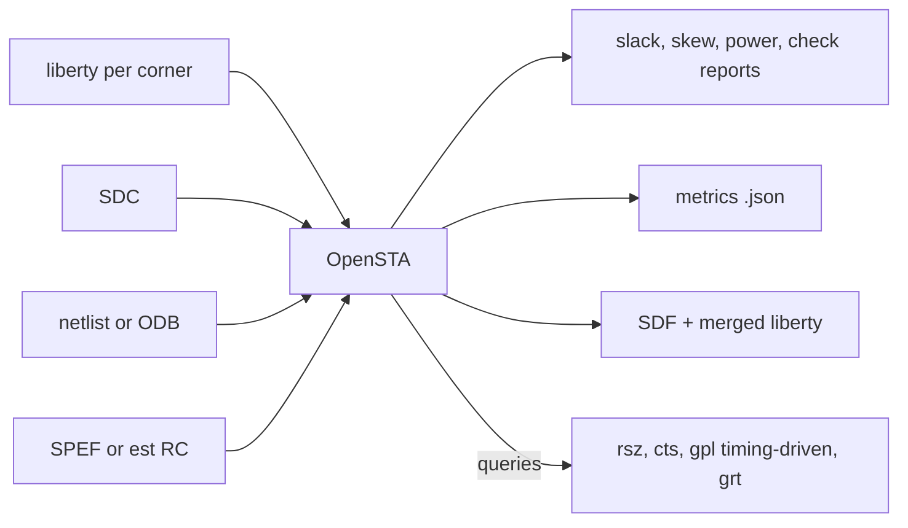

In this repo: 9 corners, `{nom,min,max} x {tt_025C_1v80, ss_100C_1v60, ff_n40C_1v95}`, listed in the
`57-openroad-stapostpnr/` directory and its `summary.rpt`. The summary row "Overall" reports worst hold slack
0.1052, worst setup slack 10.7398, hold and setup violation counts 0 and 0 (the worst setup comes from
`max_ss_100C_1v60` at 10.7398 and the worst hold from `min_ff_n40C_1v95` at 0.1052). Mid-flow STA (steps 12, 31, 36,
38, 45) runs only the 3 `nom_*` corners; step 12 reports overall worst hold 0.0460 and setup 15.1989
(`12-openroad-staprepnr/summary.rpt`, before any placement, so no wire parasitics). The clock constraint is 25 ns.
The summary also lists max-slew and max-cap violation counts (551 and 1 overall in step 57); how these are
judged against the repo's gates is outside this part (see `checker-maxslewviolations`, steps 76 and 77).

### est: parasitics estimation

Purpose: gives STA wire RC before real extraction exists. `estimate_parasitics -placement` builds Steiner trees
from cell positions and applies per-layer unit R and C; `-global_routing` instead uses the global router's
routes. `est::set_layer_rc_cmd`, `set_wire_rc`, `layer_resistance` and `layer_capacitance` are among its commands.

Meta features: separate clock and signal wire RC (`set_h_wire_clk_rc`, `set_h_wire_signal_rc`), per-corner layer RC,
`check_corner_wire_caps`, `have_estimated_parasitics`. LibreLane's `common/set_rc.tcl` wraps `set_wire_rc`
(per corner when custom RC is given, via `_LAYER_RC_<i>` variables) and `dump_rc.tcl` prints the values.

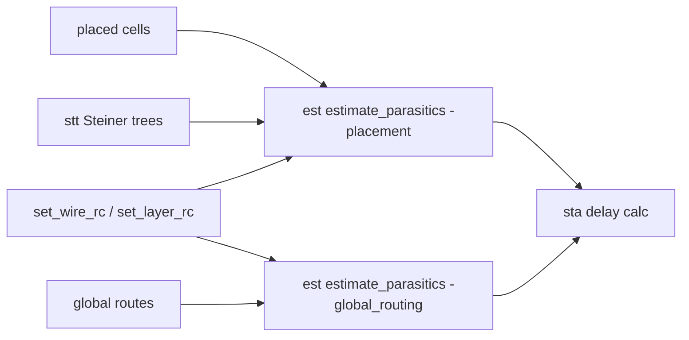

In this repo: called at the end of gpl (`gpl.tcl` line `estimate_parasitics -placement`), in rsz and cts steps, in
`grt.tcl` (`-global_routing`) and in `sta/corner.tcl`, which picks `-global_routing` when
`grt::have_routes` is true and `-placement` otherwise. Step 14 `dumprcvalues` (00:00:00.424) only prints the RC
numbers it will use. After step 56 the SPEF from `rcx` replaces estimates for signoff STA.

### stt: Steiner trees

Purpose: builds rectilinear Steiner trees for a net's pins. The binary exposes both FLUTE trees
(`report_flute_tree`, `highlight_flute_tree`) and PD trees (`report_pd_tree`), plus `set_routing_alpha_cmd` to tune
the radius/wirelength trade-off of the PD construction and `filter_clk_nets`.

Meta features: net-specific alpha (`set_net_alpha`), minimum fanout and HPWL alpha thresholds
(`set_min_fanout_alpha`, `set_min_hpwl_alpha`). Which engines call it and with which tree type is not shown by this
run (not verified); the likely users are est, rsz and grt.

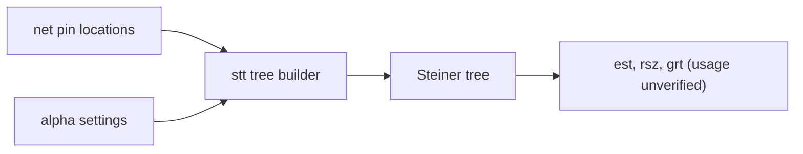

In this repo: no LibreLane script calls `stt::` directly (grep of `scripts/openroad` finds no `stt` use), so it runs
only as a library behind other commands. No stt-specific metric is recorded.

### utl: utilities, logger and metrics

Purpose: common services: the message logger (`utl::info`, `warn`, `error`, message IDs like `GPL-0001` or `RSZ-0038`
that appear throughout the step logs), output redirection and tee (`redirectFileBegin`, `teeFileBegin`), and the
metrics store (`utl::metric`, `open_metrics`, `push_metrics_stage`). The `-metrics <file>` flag on `openroad` seen in
every `COMMANDS` line makes it write `or_metrics_out.json` into the step directory.

Meta features: per-module message suppression, a Prometheus endpoint (`startPrometheusEndpoint`, present in the
binary, not used here), per-stage metric scopes.

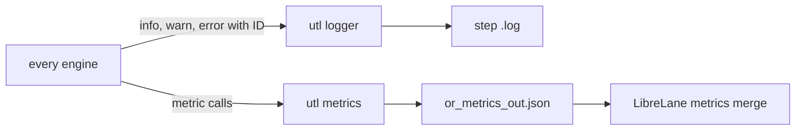

In this repo: every `openroad-*` step directory in the run has `or_metrics_out.json` (e.g.
`58-openroad-irdropreport/or_metrics_out.json`), and LibreLane merges them into the per-run metrics that the repo
later copies to `designs/<d>/output/metrics.json`.

### gui

Purpose: the Qt-based layout viewer and its Tcl commands (82 procs: `add_label`, `create_menu_item`,
`create_toolbar_button`, heat maps, selection, debug drawing). It lets a person see DB state, congestion, timing
paths, and DRC markers.

Meta features: whether the binary has the GUI compiled in is reported by `ord::openroad_gui_compiled` (not queried
here); `scripts/openroad/gui.tcl` in LibreLane loads liberty, SDC and per-corner SPEF so a run can be inspected
interactively.

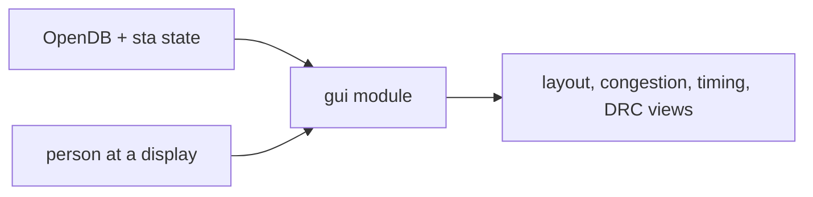

In this repo: not used by any of the 78 steps; flows run headless (`-no_splash -exit` in every `COMMANDS` line). The
layout picture `output/layout.png` comes from KLayout (`61-klayout-render`), not from the OpenROAD GUI.

## Floorplan and placement engines

This part covers the OpenROAD engines that turn a synthesised netlist into a legal, powered, placed design:
ifp, ppl, pdn, tap, mpl, gpl, dpl, rsz, rmp and dft. LibreLane 3.0.2 calls them through small Tcl scripts (and a few
Python odb scripts) in `librelane/scripts/openroad/` inside the container image `ghcr.io/librelane/librelane:3.0.2`;
every script starts with `common/io.tcl`, reads the previous step's `.odb` and writes a new one with `write_views`.

Notation used below.

- `KV` = `designs/kv_attn_n8/runs/RUN_2026-10-06_07-00-35` (the real kv_attn_n8 run; `KV/<step>/<tool>.log`).
- `WR` = `designs/user_project_wrapper_soc_kv/runs/RUN_2026-10-06_08-13-27` (the Caravel wrapper around soc_kv_attn_n8).
- `SOC` = `designs/soc_kv_attn_n8/runs/RUN_2026-10-06_08-09-32`.
- Reports in `designs/<d>/output/reports/` are copies of step logs; `designs/<d>/output/metrics.json` is the flow-final metric set.
- Resolved configuration values come from `KV/resolved.json`. Flow-step numbers are those of the `KV` run.
- Script and class facts (step ids, variables, deprecated names) were read from the container image
  (`librelane/steps/openroad.py`, `steps/odb.py`, `scripts/openroad/*.tcl`, `scripts/odbpy/*.py`) with read-only docker commands.

Step order of these engines in the `KV` run (step directory names are the numbers and names in `KV/`):

| # | Step dir | LibreLane id | Engine call |
|---|---|---|---|
| 13 | openroad-floorplan | OpenROAD.Floorplan | ifp |
| 16 | odb-setpowerconnections | Odb.SetPowerConnections | odb (power pins to nets) |
| 17 | odb-manualmacroplacement | Odb.ManualMacroPlacement | odb (replaces mpl), skipped here |
| 18 | openroad-cutrows | OpenROAD.CutRows | ifp (cut_rows) |
| 19 | openroad-tapendcapinsertion | OpenROAD.TapEndcapInsertion | tap |
| 20 / 22 | odb-add / removepdnobstructions | Odb.AddPDNObstructions / RemovePDNObstructions | odb (keep-outs around pdngen) |
| 21 | openroad-generatepdn | OpenROAD.GeneratePDN | pdn (+ psm check_power_grid) |
| 24 | openroad-globalplacementskipio | OpenROAD.GlobalPlacementSkipIO | gpl (-skip_io) |
| 25 | openroad-ioplacement | OpenROAD.IOPlacement | ppl |
| 26 | odb-customioplacement | Odb.CustomIOPlacement | odb (pin_order.cfg), skipped for kv_attn_n8 |
| 28 | openroad-globalplacement | OpenROAD.GlobalPlacement | gpl |
| 32 | openroad-repairdesignpostgpl | OpenROAD.RepairDesignPostGPL | rsz (repair_design) + dpl |
| 33 | odb-manualglobalplacement | Odb.ManualGlobalPlacement | odb, skipped here |
| 34 | openroad-detailedplacement | OpenROAD.DetailedPlacement | dpl |
| 37 | openroad-resizertimingpostcts | OpenROAD.ResizerTimingPostCTS | rsz (repair_timing) + dpl |
| 41 | openroad-repairdesignpostgrt | OpenROAD.RepairDesignPostGRT | rsz (repair_design) + dpl |

Steps 14, 15, 23, 27, 29 to 31, 35, 36 and 38 to 40 are not engines of this part (RC dump, antenna property check,
routing obstructions, DEF template, verilog header, power-grid checker, STA, CTS, GRT, antenna check).

---

### ifp (initialize_floorplan, rows, tracks, cut_rows)

**Purpose.** ifp defines the die and core boxes, creates the placement rows of the standard-cell site (`unithd`, 0.46 x 2.72 um),
and the routing tracks. `cut_rows` then removes row sites under macros and their halos.
Origin: the "ifp" module (InitFloorplan) of the OpenROAD project; the row/track model follows the LEF/DEF site and
track conventions. A named paper or upstream project beyond that: not verified.

**Meta features (Tcl).**

- `initialize_floorplan -site unithd -die_area x0 y0 x1 y1 -core_area ...` (absolute sizing), or
  `-utilization U -aspect_ratio R -core_space ...` (relative sizing). Extra: `-additional_sites`, `-flip_sites`.
- `make_tracks` is run through `source $::env(TRACKS_INFO_FILE_PROCESSED)` (the `tracks.info` of the PDK).
- `insert_tiecells` (Tcl proc in the script) places `sky130_fd_sc_hd__conb_1` tie cells for constant nets.
- `cut_rows -halo_width_x -halo_width_y -endcap_master [-row_min_width]`.
- Floorplan obstructions (`FP_OBSTRUCTIONS`) and soft placement blockages (`PL_SOFT_OBSTRUCTIONS`) are created through odb calls in the same script.

**Where it sits.** Step 13 (`floorplan.tcl`) is the first step that changes geometry, after synthesis (06) and the pre-PnR STA (12).
Step 18 (`cut_rows.tcl`) follows macro placement (17) and precedes tap insertion (19).
Config variables (from `KV/resolved.json`): `FP_SIZING` = absolute, `DIE_AREA` = [0, 0, 260, 260], `CORE_AREA` = None (derived from the
margins), `FP_CORE_UTIL` 50 and `FP_ASPECT_RATIO` 1 (used only by relative sizing), `FP_MACRO_HORIZONTAL_HALO` / `FP_MACRO_VERTICAL_HALO` = 10 (used by cut_rows),
`PLACE_SITE` = unithd, `FP_TRACKS_INFO`, `FP_OBSTRUCTIONS`, `FP_PRUNE_THRESHOLD`.
Wrapper designs set `FP_SIZING` absolute with `DIE_AREA` 2920 x 3520 and `FP_DEF_TEMPLATE` (`designs/user_project_wrapper_soc_kv/config.json`).

**Inputs -> outputs.** In: `06-yosys-synthesis/kv_attn_n8.nl.v` (netlist, via state `nl`) plus the SDC. Out (`KV/13-openroad-floorplan/state_out.json`):
`odb`, `def`, `nl`, `pnl`, `sdc`; metrics `design__die__bbox`, `design__core__bbox`. `cut_rows` reads and writes only `odb`/`def`.

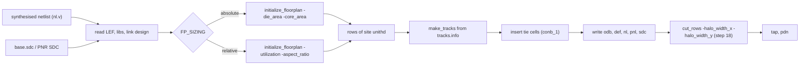

**What it did in this repo.**

- kv_attn_n8, step 13 (`KV/13-openroad-floorplan/openroad-floorplan.log`, same text in `designs/kv_attn_n8/output/reports/floorplan.txt`):
  `initialize_floorplan -site unithd -die_area 0 0 260 260 -core_area 5.52 10.88 254.48 249.12`, then
  IFP-0001 "Added 87 rows of 541 site unithd", core area 58890.230 um^2, total instances area 10034.624 um^2,
  effective utilization 0.170, 773 instances, 0 tie cells inserted (IFP-0030).
  The core box is reported as 5.52 10.88 to 254.38 247.52 (`design__core__bbox` in `designs/kv_attn_n8/output/metrics.json`).
- The core is much larger than the logic: flow-final `design__instance__utilization` = 0.278688 (`metrics.json`), well under the 50 % default of `FP_CORE_UTIL`,
  because the die was set absolutely and the 260 um square was chosen as an estimate (`//DIE_AREA` in `designs/kv_attn_n8/config.json`).
- Wrapper (WR step 13): 2920 x 3520 um die, 1286 rows of 6323 sites, one instance (the 90000 um^2 macro), effective utilization 0.009 (`WR/13-openroad-floorplan/*.log`).
  Step 18 then reports "The initial 1286 rows (8131378 sites) were cut with 1 shape for a total of 1404 rows (8049250 sites)" (ODB-0303), i.e. the macro and its 10 um halo split rows (`WR/18-openroad-cutrows/*.log`).
- For kv_attn_n8 `cut_rows` runs (step 18, 0.417 s in `runtime.txt`) but there is no macro, so it only inserts the endcap master name for the later tap step; counts do not change (773 instances before and after in the cell type report).

---

### ppl (pin placement, place_pins; LibreLane ioplacement and pin_order.cfg)

**Purpose.** ppl (the I/O placer) assigns every top-level port to a slot on the die edge, on a legal track, on the horizontal or vertical metal layer, so that I/O wirelength is short.
Origin: OpenROAD "ioPlacer" (module ppl). It uses a Hungarian-matching assignment of pins to slot sections, with an optional simulated-annealing mode; details of the original paper: not verified.

**Meta features (Tcl).**

- `place_pins -hor_layers L -ver_layers L [-corner_avoidance d] [-min_distance d] [-min_distance_in_tracks] [-exclude region] [-annealing] [-random]`.
- `set_pin_length`, `set_pin_length_extension`, `set_pin_thick_multiplier` (set before `place_pins` by `ioplacer.tcl`).
- Companion in LibreLane, `Odb.CustomIOPlacement` (`scripts/odbpy/io_place.py`): not an OpenROAD engine, it places pins from a `pin_order.cfg` with regex lines, one direction marker per side (`#S`, `#N`, `#E`, `#W`), and spaces them equally along the side on track positions.
- `Odb.ApplyDEFTemplate` copies pin placement from a DEF template (the wrapper case).

**Where it sits.** Steps 24 -> 25 -> 26: a global placement without I/O (24), then `place_pins` (25) that matches pins to where their cells landed, then the custom placement (26).
Variables: `IO_PIN_PLACEMENT_MODE` = matching (alternative `annealing`), `IO_PIN_H_LAYER` met3, `IO_PIN_V_LAYER` met2, `IO_PIN_H/V_THICKNESS_MULT` 2, `IO_PIN_H/V_LENGTH` None,
`IO_PIN_MIN_DISTANCE` None (default 2 tracks), `IO_PIN_CORNER_AVOIDANCE`, `IO_EXCLUDE_PIN_REGION`, `IO_PIN_ORDER_CFG`, `ERRORS_ON_UNMATCHED_IO` = unmatched_design, `FP_DEF_TEMPLATE`.
Skip rules (read from `steps/openroad.py`): step 25 is skipped when `IO_PIN_ORDER_CFG` or `FP_DEF_TEMPLATE` is set; step 24 is skipped in the same cases;
step 26 is skipped when `IO_PIN_ORDER_CFG` is None (`KV/26-odb-customioplacement/runtime.txt` = 0.001 s).

**Inputs -> outputs.** In: `.odb` of step 24 with all cells globally placed and pins unplaced. Out: `.odb`, `.def`, `.nl.v`, `.pnl.v`, `.sdc` of step 25 (`KV/25-openroad-ioplacement/state_out.json`).

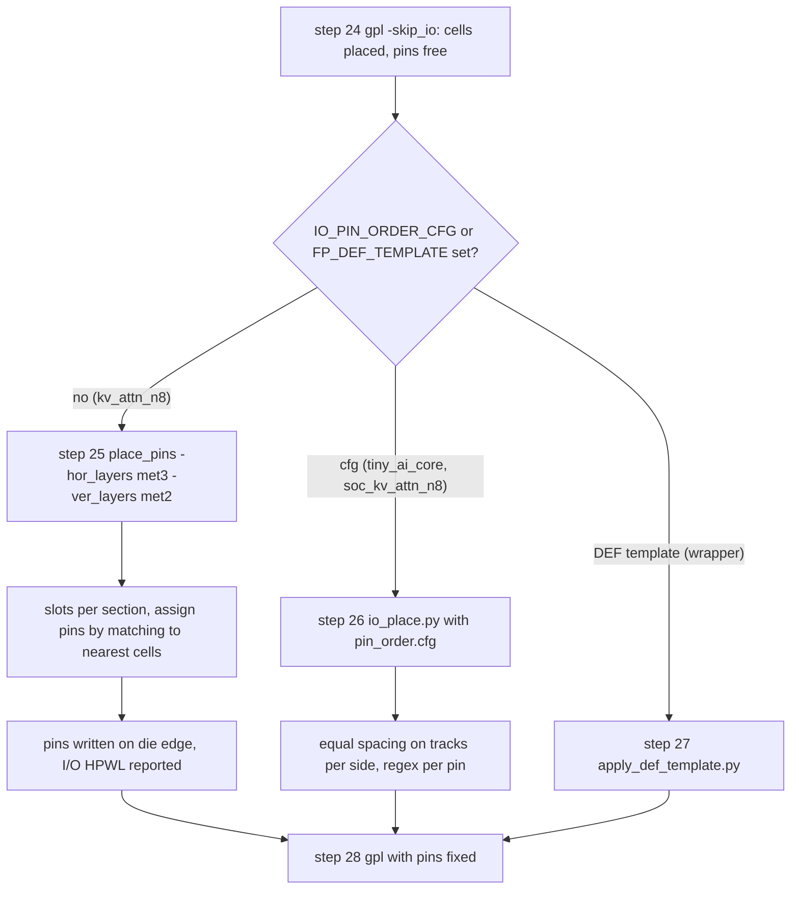

**What it did in this repo.**

- kv_attn_n8 (no pin_order.cfg; `IO_PIN_ORDER_CFG` None in `KV/resolved.json`): step 25 ran `place_pins -hor_layers met3 -ver_layers met2`:
  PPL-0001 "Number of available slots 936", PPL-0002 "Number of I/O 24", PPL-0003 24 with sinks, "Slots per section 200",
  PPL-0012 "I/O nets HPWL: 2083.14 um" (`KV/25-openroad-ioplacement/openroad-ioplacement.log`). `design__io__hpwl` = 2083140 in `designs/kv_attn_n8/output/metrics.json` (database units, the same 2083.14 um).
  "Found 0 macro blocks" confirms there is no macro to avoid.
- soc_kv_attn_n8 (109 Wishbone pins, `designs/soc_kv_attn_n8/pin_order.cfg`, 110 lines: one `#S` marker and 109 regex lines):
  step 24 and 25 are skipped; step 26 `io_place.py` reports "Actual pin count: 109", "Tracks count: 652", "Tracks per pin: 5", "Used tracks count: 541", "Unused track count: 111" (`SOC/26-odb-customioplacement/*.log`).
  The reason is physical: the macro's pins must come out in the order of the wrapper's pads, left to right, so wires from the macro to the pads do not cross (`//IO_PIN_ORDER_CFG` in `designs/soc_kv_attn_n8/config.json`; the congestion lesson is in `docs/SKILLS.md`, GRT-0116 entry).
- tiny_ai_core uses the same method (`designs/tiny_ai_core/pin_order.cfg`, `#S` then `wb_clk_i`, `wb_rst_i`, `wbs_ack_o`, ... in the wrapper pad order).
- Wrapper (WR step 24 and 25 skipped, runtime 0.001 s each): pins come from the fixed template, step 26 `Odb.ApplyDEFTemplate` reports "Found 637 block terminals in existing database", "Found 645 template_bterms" and writes pins on met2/met3 at the DEF positions (`WR/26-odb-applydeftemplate/*.log`).
  The template is `designs/user_project_wrapper_soc_kv/fixed_dont_change/user_project_wrapper.def` (never edited).

---

### pdn (pdngen power grid)

**Purpose.** pdn builds the power distribution network: rails on the cell rows, vertical and horizontal stripes, optional core rings, and connections into macro power pins.
Origin: OpenROAD "pdngen" (module pdn), a Tcl-configured generator; the original author or paper: not verified.

**Meta features (Tcl).**

- Configuration commands: `set_voltage_domain`, `define_pdn_grid` (core grid, macro grids), `add_pdn_stripe` (with `-followpins` for rails), `add_pdn_ring`, `add_pdn_connect`, `add_pdn_pin`/`-pins`.
- `pdngen [-skip_trim]` builds the grid in odb. `check_power_grid -net N -error_file F` (an psm command) verifies connectivity after the build.
- LibreLane writes the config itself (`common/pdn_cfg.tcl`) from the variables, unless `PDN_CFG` points to a custom file.

**Where it sits.** Step 21 `pdn.tcl` (after tap insertion 19); steps 20 and 22 (`Odb.AddPDNObstructions` and `RemovePDNObstructions`) wrap it with temporary obstructions listed in `PDN_OBSTRUCTIONS`.
Step 30 (`Checker.PowerGridViolations`) reads the resulting metrics, `ERROR_ON_PDN_VIOLATIONS` = True.
Variables for kv_attn_n8 (`KV/resolved.json`): `PDN_MULTILAYER` False (set in `designs/kv_attn_n8/config.json`), `PDN_ENABLE_RAILS` True, `PDN_RAIL_LAYER` met1, `PDN_RAIL_WIDTH` 0.48,
`PDN_VERTICAL_LAYER` met4, `PDN_VWIDTH` 1.6, `PDN_VSPACING` 1.7, `PDN_VPITCH` 153.6, `PDN_VOFFSET` 16.32, `PDN_ENABLE_PINS` True, `PDN_CORE_RING` False, `PDN_CONNECT_MACROS_TO_GRID` True, `PDN_MACRO_CONNECTIONS` None.
The horizontal layer (met5, pitch 153.18) is only used when `PDN_MULTILAYER` is true; here it is not, since `RT_MAX_LAYER` is met4.
Wrappers use the template values: `PDN_VWIDTH/HWIDTH` 3.1, pitch 180, `PDN_CORE_RING` true, four power domains, `PDN_ENABLE_RAILS` false, `PDN_MACRO_CONNECTIONS` "mprj vccd1 vssd1 vccd1 vssd1" (`designs/user_project_wrapper_soc_kv/config.json`).

**Inputs -> outputs.** In: odb of tap step. Out: odb with special (power) wires and vias, plus `vccd1-grid-errors.rpt` and `vssd1-grid-errors.rpt` in the step dir.

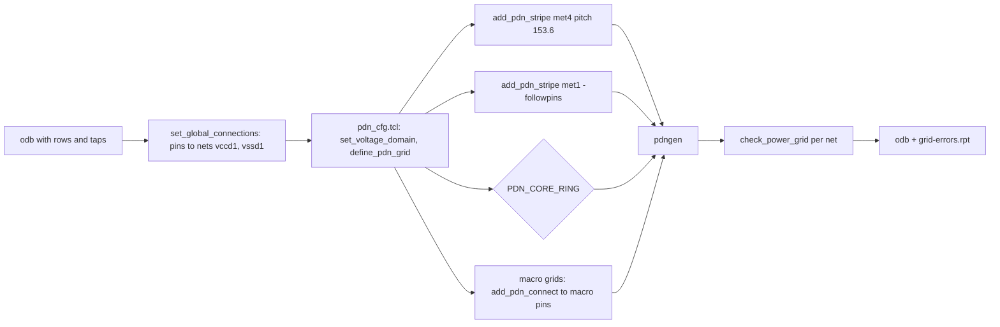

**What it did in this repo.**

- kv_attn_n8 step 21 log (`KV/21-openroad-generatepdn/openroad-generatepdn.log`): `pdngen`, "PDN-0001 Inserting grid: stdcell_grid", then
  "PSM-0040 All shapes on net vccd1 are connected." and the same for vssd1. `vccd1-grid-errors.rpt` has 0 non-empty lines.
  Flow-final `design__power_grid_violation__count` = 0 (`designs/kv_attn_n8/output/metrics.json`); the IR drop report (step 58) gives worst vccd1 drop 0.000216 V.
- Wrapper step 20 (`WR/20-openroad-generatepdn/*.log`): grids "stdcell_grid" and "macro - mprj" are inserted;
  warnings PDN-0239 "Ring shape falls outside the die bounds" and four PDN-0110 "No via inserted between met4 and met5" (on vdda1 and vccd1) appear; the wrapper config sets `ERROR_ON_PDN_VIOLATIONS` false for this reason.
  PSM-0040 reports connected shapes on the nets that follow in the log.

---

### tap (tapcell, endcap insertion)

**Purpose.** tap inserts well-tap cells at a fixed spacing (to keep latch-up safe) and endcap cells at row ends.
Origin: OpenROAD "tap" module (tapcell); early tapcell flows came from Tcl scripts of the OpenROAD flow scripts. Further provenance: not verified.

**Meta features (Tcl).** `tapcell -distance D -tapcell_master M -endcap_master E [-halo_width_x -halo_width_y] [-tap_nwintie -tap_nwin2_master ...]`; `cut_rows` (see ifp) prepares the rows; `placement_cell` removal of conflicting cells is automatic.

**Where it sits.** Step 19 (`tapcell.tcl`), after cut_rows (18) and before pdn (21).
Variables: `RUN_TAP_ENDCAP_INSERTION` True, `FP_TAPCELL_DIST` 13 (um), `WELLTAP_CELL` = `sky130_fd_sc_hd__tapvpwrvgnd_1`, `ENDCAP_CELL` = `sky130_fd_sc_hd__decap_3` (both PDK defaults visible in the step's command line), `FP_MACRO_*_HALO` 10.
The wrapper sets `RUN_TAP_ENDCAP_INSERTION` false (no standard cells), so step 19 of the wrapper flow is absent from `WR`.

**Inputs -> outputs.** In: odb with rows (step 18). Out: odb plus netlists in which tap cells are fixed instances; power pins of new cells are connected by `set_global_connections` (ODB-0403 "2386 connections made").

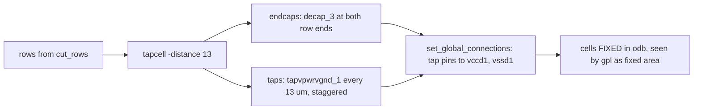

**What it did in this repo.**

- kv_attn_n8 step 19 (`KV/19-openroad-tapendcapinsertion/openroad-tapendcapinsertion.log`):
  `tapcell -halo_width_x 10 -halo_width_y 10 -distance 13 -tapcell_master sky130_fd_sc_hd__tapvpwrvgnd_1 -endcap_master sky130_fd_sc_hd__decap_3`,
  TAP-0004 "Inserted 174 endcaps", TAP-0005 "Inserted 845 tapcells". Cell type report: Fill cell 174 (653.13 um^2), Tap cell 845 (1057.26 um^2), total instances 773 -> 1792, total area 10034.62 -> 11745.01 um^2.
  Flow-final: `design__instance__count__class:tap_cell` = 845 (`metrics.json`). 845 taps for 87 rows is about 9.7 per row (core width 249 um, 13 um distance, staggered).
- These fixed cells are why GPL-0008 later says "Fixed instances: 1019" (174 + 845) and "Movable instances: 773" (`KV/24-openroad-globalplacementskipio/*.log`).
- soc_kv_attn_n8 (`SOC/19-openroad-tapendcapinsertion/*.log`): 204 endcaps and 1144 tapcells on the 300 x 300 um die.
- tiny_ai_core: 765 `tapvpwrvgnd_1` cells (`designs/tiny_ai_core/NOTES.md`, placement section).

---

### mpl (macro placer)

**Purpose.** mpl places hard macros inside the floorplan, before global placement.
Origin: OpenROAD "mpl" (the earlier engine) and "mpl2" (hierarchical RTL-MP style macro placer, from the TILOS/UCSD line of work); exact versions inside this container's OpenROAD: not verified.

**Meta features (Tcl).** `macro_placement -halo {x y} -channel {x y} -fence_region ... -snap_layer ...`, `rtl_macro_placer` (mpl2 options such as `-area_weight`, `-wirelength_weight`, `-boundary_weight`, `-keepout`), `place_macro`.

**Is mpl used here? No.** LibreLane 3.0.2 has no OpenROAD macro placement step: the list of OpenROAD step ids in `steps/openroad.py` contains no mpl/macro_placement entry (checked in the container image).
Macros are placed by hand with `Odb.ManualMacroPlacement` (`steps/odb.py`, script `scripts/odbpy/placers.py manual-macro-placement`), which writes locations with odb calls and fixes them.

**Where it sits.** Step 17 (`odb-manualmacroplacement`), after SetPowerConnections (16) and before cut_rows (18), so that rows are cut around the fixed macro.
Variables: `MACROS` (dictionary: per macro `instances` with `location` [x, y] and `orientation`, plus `gds`, `lef`, `nl`, `pnl`, `spef`, `lib` views) or the deprecated `MACRO_PLACEMENT_CFG` (lines `instance X Y orientation`); `FP_MACRO_HORIZONTAL_HALO`, `FP_MACRO_VERTICAL_HALO` 10.
If no macro instance has a location the step prints "No instances found, skipping" and returns.

**Inputs -> outputs.** In: odb with macro instance unplaced (from synthesis, step 06 used `MACROS` blackbox views). Out: odb with the instance PLACED/FIXED at the configured location.

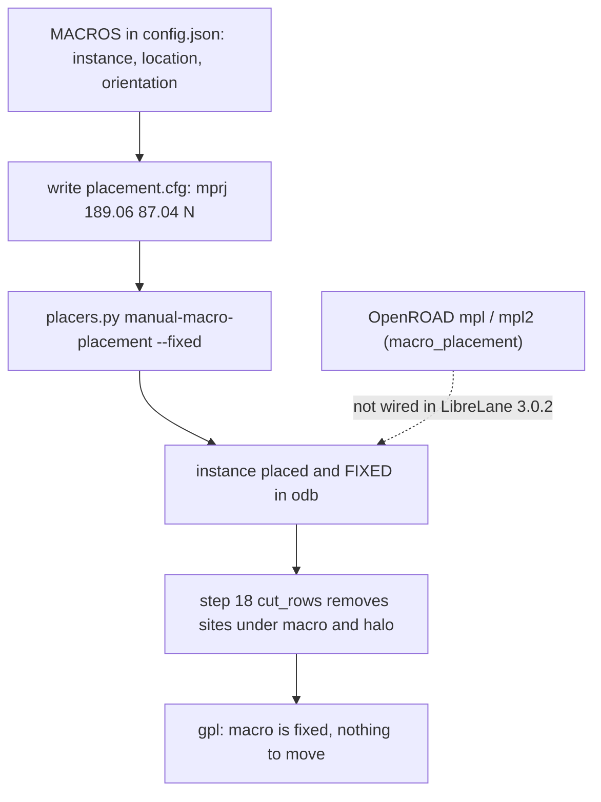

**What it did in this repo.**

- kv_attn_n8 has no macros (`MACROS` None in `KV/resolved.json`; GPL log: "Found 0 macro blocks" in step 25), so step 17 was skipped (`KV/17-odb-manualmacroplacement/runtime.txt` = 0.001 s).
- Wrapper `user_project_wrapper_soc_kv`: `MACROS.soc_kv_attn_n8.instances.mprj` has location [189.06, 87.04] and orientation N (`designs/user_project_wrapper_soc_kv/config.json`).
  Step 17 log: "Placing the following macros: {'mprj': ['mprj', 189060, 87040, 'N']} ... Successfully placed 1 instances." (`WR/17-odb-manualmacroplacement/*.log`, 0.412 s).
  The placement is chosen to face the pads, to keep macro-to-pad wires short (congestion lesson in `docs/SKILLS.md`, wrapper section); the chosen coordinates themselves are a hand decision recorded in the wrapper config, not an optimisation result.
- Because the one macro is fixed, the wrapper's step 27 `GlobalPlacement` prints "All instances are FIXED/FIRM. No need to perform global placement. Skipping" (`WR/27-openroad-globalplacement/*.log`).

---

### gpl (RePlAce global placement)

**Purpose.** gpl spreads standard cells over the core so that wirelength is small and cell density is below a target, without caring about exact legality (overlap is left for dpl).
Origin: RePlAce, from the UCSD/UCSC line of work (Cheng, Kahng, Kang, Wang, Wang), built on the electrostatics-based placer family ePlace (Lu et al.) with Nesterov's accelerated gradient method. The OpenROAD implementation is module "gpl".

**How it works (well-established parts).**

- The netlist wirelength is approximated by a smooth weighted-average model of half-perimeter wirelength (HPWL).
- Cell density is modelled as electric charge on a bin grid (here 32 x 32 bins, 7.777 x 7.395 um each); the field is solved with a FFT, giving a density penalty that pushes cells apart.
- Placement minimises wirelength + lambda * density penalty with Nesterov steps; `overflow` is the fraction of cell area above target density and the run stops when it falls to about 0.10 (the logs end at overflow 0.0998).
- A conjugate-gradient "initial placement" (quadratic wirelength) seeds the positions; in the kv_attn_n8 logs all 773 cells start at the core centre (GPL-0051 "Core center = 773").

**Meta features (Tcl).**

- `global_placement -density D | -routability_driven | -timing_driven | -skip_io | -skip_initial_place | -init_wirelength_coef C | -pad_left/-pad_right | -min_phi_coef | -max_phi_coef | -keep_resize_below_overflow | -routability_check_overflow`.
- Timing-driven mode calls the resizer/STA to find critical nets, then raises their weight (virtual `repair_design` passes at overflow checkpoints). Routability-driven mode calls the global router for a congestion estimate (RUDY-like tile usage) and inflates cell areas in congested tiles, then continues from a saved snapshot.
- `-skip_io` ignores pins in the wirelength term (for the first pass that precedes pin placement).

**Where it sits.** Two steps: 24 `GlobalPlacementSkipIO` (feeds ppl) and 28 `GlobalPlacement` (final), both through `gpl.tcl`. Step 24 returns the state unchanged if `IO_PIN_ORDER_CFG` or `FP_DEF_TEMPLATE` is set.
Variables (`KV/resolved.json`): `PL_TARGET_DENSITY_PCT` None (then computed in `steps/openroad.py` as utilisation of the incoming state + 5 * `GPL_CELL_PADDING` + 10; logged as `-density 0.288349`), `GPL_CELL_PADDING` 0, `PL_WIRE_LENGTH_COEF` 0.25,
`PL_ROUTABILITY_DRIVEN` True, `PL_ROUTABILITY_OVERFLOW_THRESHOLD` None, `PL_TIMING_DRIVEN` False, `PL_SKIP_INITIAL_PLACEMENT` False, `PL_MIN_PHI_COEFFICIENT`/`PL_MAX_PHI_COEFFICIENT` None, `PL_KEEP_RESIZE_BELOW_OVERFLOW` None,
routing layer variables (`RT_MIN/MAX_LAYER` met1/met4, global adjustment 30 % in the GRT lines of step 41).

**Inputs -> outputs.** In: odb of pdn (step 21) for 24; odb of ioplacement (25/26/27) for 28. Out: odb with cells at global (overlapping) positions; `estimate_parasitics -placement` is run at the end so later STA has wire RC.

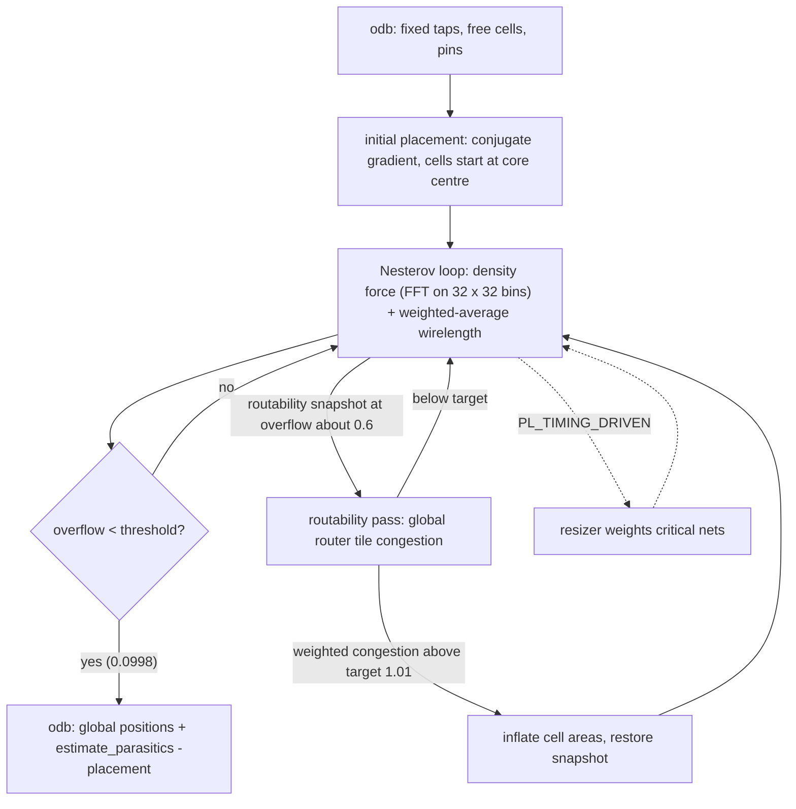

**What it did in this repo.**

- Skip-IO pass, step 24 (`KV/24-openroad-globalplacementskipio/openroad-globalplacementskipio.log`): `global_placement -density 0.288349 -skip_io -pad_right 0 -pad_left 0 -init_wirelength_coef 0.25`;
  movable instances 773, fixed 1019, nets 786, utilisation 19.635 %; 32 x 32 bins; HPWL goes 2274.96 um (iteration 0) -> 17695.33 um at iteration 409, overflow 0.9942 -> 0.0998; GPL-1004 "Minimum Feasible Density 0.2000".
  There is no routability pass in this log (the command has no `-routability_driven`).
- Final pass, step 28 (`KV/28-openroad-globalplacement/...log`, copy `designs/kv_attn_n8/output/reports/placement_global.txt`): `global_placement -density 0.288349 -routability_driven -pad_right 0 -pad_left 0 -init_wirelength_coef 0.25`;
  pins counted: 3019 (2995 in the skip-IO pass; the difference of 24 equals the number of I/O pins, which now take part). A routability snapshot is saved at iteration 261; routability iteration 1 gives total routing overflow 0.0000, 0 overflowed tiles, average top 0.5 % congestion 0.8212,
  weighted congestion 0.8071, below the target 1.0100, so GPL-0090 "Routability finished. Target routing congestion achieved". Finished at iteration 415 with HPWL 18821.22 um, routability iteration count 73, final weighted congestion 0.7770, artificial inflation 0.00 (+0.00 %).
  Placed cell area 11227.47 um^2 against a free area of 57179.84 um^2.
- Timing-driven mode is off (`PL_TIMING_DRIVEN` False); timing is handled by rsz after placement instead.
- soc_kv_attn_n8 is more crowded: target density 0.450568, routability iteration 1 shows total routing overflow 0.0334 in 1 tile (0.05 %) and top 0.5 % congestion 0.9498; it finishes at iteration 455 with 65 routability iterations and weighted congestion 0.8974 (`SOC/28-openroad-globalplacement/*.log`).
- tiny_ai_core congestion history (runs under `designs/tiny_ai_core/runs/`, 7 runs on 2026-10-05): GPL routability always ended well: final weighted congestion 0.7753 (76 routability iterations) and 0.7794 (72) in the two 70 % runs, 0.7794 (72) at 30 %, 0.8011 (63) at 20 % (GPL-1005 and GPL-1003 lines of `designs/tiny_ai_core/runs/*/*globalplacement/*.log`); the slew margin does not change placement, only the later repair.
  The true congestion problem of the project was not in the core placer but in global routing of the wrapper (361 macro pins, GRT-0116, `docs/SKILLS.md`), which is part 3 territory.
- Wrapper: the step 27 global placement is skipped because the only instance is FIXED (see mpl).

---

### dpl (detailed placement, legalisation)

**Purpose.** dpl takes the overlapping global placement and moves each cell to a legal site: on a row, on the site grid, no overlap, correct orientation, within a displacement limit.
Origin: OpenDP ("OpenDP: an open-source detailed placement engine", Do, Woo, Kahng and coauthors, from the OpenROAD project); that attribution is from memory of the OpenROAD documentation, the paper details: not verified.

**Meta features (Tcl).**

- `detailed_placement -max_displacement {x y} [-disallow_one_site_gaps]`.
- `optimize_mirroring`: flips cells (orientation MX/R0) to shorten HPWL where the legal site allows.
- `check_placement -verbose` (fails the script on overlaps, off-grid or off-row cells); `set_placement_padding -global -left -right` (from `DPL_CELL_PADDING`); `remove_fillers`; `filler_placement` is a separate step (fill, part 3).
- Cell reports: "Placement Analysis" block with total/average/max displacement and HPWL before and after.

**Where it sits.** LibreLane's `common/dpl.tcl` (padding, `remove_fillers`, `detailed_placement`, `optimize_mirroring`, `check_placement`) is sourced from the DPL step 34 itself and also from every step that moves cells: 32 (repair design post-GPL), 35 (CTS), 37 (post-CTS timing), 41 (post-GRT repair).
Variables: `PL_MAX_DISPLACEMENT_X` 500, `PL_MAX_DISPLACEMENT_Y` 100, `PL_OPTIMIZE_MIRRORING` True, `DPL_CELL_PADDING` 0, `CELL_PAD_EXCLUDE`, `DIODE_PADDING`.

**Inputs -> outputs.** In: odb with global positions (+ repair buffers). Out: odb with legal positions, same netlist (apart from what the calling step added).

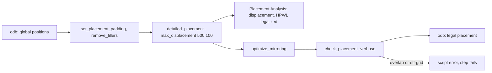

**What it did in this repo.**

- kv_attn_n8, step 34 (`KV/34-openroad-detailedplacement/openroad-detailedplacement.log`, copy `designs/kv_attn_n8/output/reports/placement_detailed.txt`): `detailed_placement -max_displacement 500 100`;
  total/average/max displacement 0.0 u (the cells were already legal after the DPL inside step 32), original HPWL 25740.9 u, legalized HPWL 26199.9 u (+2 %); then DPL-0020 "Mirrored 244 instances" and DPL-0021..23 HPWL 26199.9 -> 25740.9 u (-1.8 %), which exactly recovers the legalisation loss.
  Cell report after the step: 1915 instances, area 12938.66 um^2, including 123 timing repair buffers.
- Later legalisations (CTS, hold buffers) move more: in step 37 DPL reports total displacement 530.2 u, average 0.2 u, max 6.8 u, HPWL 30141.8 -> 29052.3 u (-3.6 %), "Mirrored 444 instances" (`KV/37-openroad-resizertimingpostcts/*.log`).
  Flow-final `design__instance__displacement__total` = 512.5 um, mean 0.187 um, max 5.52 um (`designs/kv_attn_n8/output/metrics.json`).
- soc_kv_attn_n8: step 34 mirrors 648 instances, HPWL 60979.7 -> 59713.4 u (-2.1 %); after post-CTS hold buffers 1408 instances mirrored, HPWL 76045.1 -> 72845.0 u (-4.2 %) (`SOC/34-...`, `SOC/37-...`).
- Wrapper (WR step 32): one fixed macro, displacement 0.0 u, HPWL 27265.2 u unchanged, delta 0 % (`WR/32-openroad-detailedplacement/*.log`).

---

### rsz (Resizer: repair_design, repair_timing, buffering)

**Purpose.** rsz is the netlist optimiser that lives inside OpenROAD next to OpenSTA: it fixes electrical violations (max slew, max cap, max fanout, long wires) and timing violations (setup, hold) by resizing, buffering, cloning and pin swapping.
Origin: the Resizer, written by James Cherry (the OpenSTA author) at Parallax Software for the OpenROAD project; the repair move names printed in the logs are from the current OpenROAD release in the image (version string: not verified).

**Meta features (Tcl).**

- `repair_design [-max_wire_length L] [-slew_margin %] [-cap_margin %] [-max_utilization] [-buffer_gain] [-verbose]`: fixes max slew, max cap, max fanout and long wires; the margins tighten the library limits by that percent.
- `repair_timing -setup | -hold [-setup_margin ns] [-hold_margin ns] [-max_buffer_percent %] [-repair_tns %] [-allow_setup_violations] [-skip_buffering] [-skip_buffer_removal] [-skip_gate_cloning] [-max_utilization]`.
  Setup moves (printed at RSZ-0100): UnbufferMove, SizeUpMove, SwapPinsMove, BufferMove, CloneMove, SplitLoadMove. Hold repair inserts delay buffers.
- `buffer_ports -inputs | -outputs` (RSZ-0027/0028), `remove_buffers`, `repair_tie_fanout`, `set_dont_touch`, `estimate_parasitics -placement | -global_routing`, `report_floating_nets`.
- `rsz_timing_postcts.tcl` sets `set_propagated_clock [all_clocks]` first, so setup and hold use the real clock tree.

**Where it sits (three steps, three roles).**

- 32 `RepairDesignPostGPL` (`repair_design.tcl`): after global placement and before DPL. Port buffers, `repair_design`, `repair_tie_fanout`, then legalisation (`common/dpl.tcl`). `RUN_POST_GPL_DESIGN_REPAIR` True.
- 37 `ResizerTimingPostCTS` (`rsz_timing_postcts.tcl`): after CTS (35). Setup repair and hold repair (order set by `PL_RESIZER_FIX_HOLD_FIRST` False: setup first), then legalisation. `RUN_POST_CTS_RESIZER_TIMING` True.
- 41 `RepairDesignPostGRT` (`repair_design_postgrt.tcl`): runs `global_route`, `estimate_parasitics -global_routing`, `repair_design` with GRT margins, legalisation, and re-routes. `RUN_POST_GRT_DESIGN_REPAIR` True. The related setup repair after GRT (`ResizerTimingPostGRT`) is off: `RUN_POST_GRT_RESIZER_TIMING` False.
- The wrapper turns the first two off (`RUN_POST_GPL_DESIGN_REPAIR` false, `RUN_POST_CTS_RESIZER_TIMING` false, `DESIGN_REPAIR_BUFFER_INPUT_PORTS` false); no resizer step of 32/37 exists in `WR`.

Variables (`KV/resolved.json`):

| Variable | Value | Used by |
|---|---|---|
| `DESIGN_REPAIR_MAX_SLEW_PCT` (deprecated alias `PL_RESIZER_MAX_SLEW_MARGIN`) | 20 | `repair_design -slew_margin` in step 32 |
| `DESIGN_REPAIR_MAX_CAP_PCT` (alias `PL_RESIZER_MAX_CAP_MARGIN`) | 20 | `-cap_margin` in step 32 |
| `GRT_DESIGN_REPAIR_MAX_SLEW_PCT` | 20 | `-slew_margin` in step 41 |
| `GRT_DESIGN_REPAIR_MAX_CAP_PCT` | 10 | `-cap_margin` in step 41 |
| `DESIGN_REPAIR_MAX_WIRE_LENGTH`, `GRT_DESIGN_REPAIR_MAX_WIRE_LENGTH` | 0 (no long-wire limit) | `-max_wire_length` |
| `DESIGN_REPAIR_BUFFER_INPUT_PORTS`, `..._OUTPUT_PORTS` | True, True | `buffer_ports` |
| `DESIGN_REPAIR_REMOVE_BUFFERS` | False | `remove_buffers` |
| `DESIGN_REPAIR_TIE_FANOUT` / `..._TIE_SEPARATION` | True / False | `repair_tie_fanout` |
| `PL_RESIZER_SETUP_SLACK_MARGIN` | 0.05 ns | setup and hold command `-setup_margin` |
| `PL_RESIZER_HOLD_SLACK_MARGIN` | 0.1 ns | `-hold_margin` |
| `PL_RESIZER_SETUP_MAX_BUFFER_PCT`, `PL_RESIZER_HOLD_MAX_BUFFER_PCT` | 50, 50 | `-max_buffer_percent` |
| `PL_RESIZER_SETUP_BUFFERING`, `..._BUFFER_REMOVAL`, `..._GATE_CLONING` | True, True, True | inverse of `-skip_*` flags |
| `PL_RESIZER_ALLOW_SETUP_VIOS`, `PL_RESIZER_FIX_HOLD_FIRST` | False, False | order and trade-off |
| `RSZ_DONT_TOUCH_RX`, `RSZ_DONT_TOUCH_LIST` | `$^`, None | `set_dont_touch` (nothing matches) |

A naming detail found while reading the config: `designs/kv_attn_n8/config.json` sets `PL_RESIZER_MAX_SLEW_MARGIN` 20.
In LibreLane 3.0.2 that name is only a deprecated alias of `DESIGN_REPAIR_MAX_SLEW_PCT` (`steps/openroad.py`, `deprecated_names=["PL_RESIZER_MAX_SLEW_MARGIN"]`), which is why `KV/resolved.json` shows `DESIGN_REPAIR_MAX_SLEW_PCT` 20 and no `PL_RESIZER_MAX_SLEW_MARGIN`.
Note that 20 is also the LibreLane default, so for these designs the setting equals the default; the same applies to the post-GRT value 20.

**Inputs -> outputs.** In: odb (placed; routed for 41) and the SDC; for 37 also the clock tree. Out: odb with extra cells (class `timing_repair_buffer` in the cell type report), resized cells, re-legalised placement; metrics counted in `design__instance__count__class:timing_repair_buffer`.

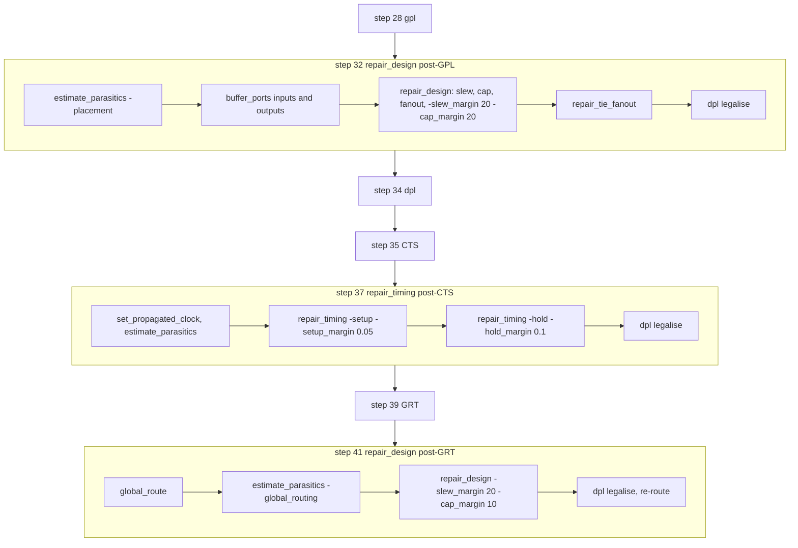

**What it did in this repo (kv_attn_n8).**

- Step 32 (`KV/32-openroad-repairdesignpostgpl/*.log`): RSZ-0027 and RSZ-0028 insert 12 input and 11 output `sky130_fd_sc_hd__clkdlybuf4s25_1` port buffers;
  `repair_design -verbose -max_wire_length 0 -slew_margin 20 -cap_margin 20` finds 17 slew violations (RSZ-0034) and 42 fanout violations (RSZ-0035; `MAX_FANOUT_CONSTRAINT` is 8 in `designs/kv_attn_n8/config.json`),
  inserts 100 buffers in 45 nets (RSZ-0038), and warns RSZ-0020 "found 2 floating nets". Area grew in steps up to about +4.5 % in the progress table; the cell report after step 34 shows 123 `Timing Repair Buffer` cells (23 port buffers + 100 repair buffers), 1193.64 um^2.
- Step 37 (`KV/37-openroad-resizertimingpostcts/*.log`): setup repair says RSZ-0098 "No setup violations found" (`timing__setup__ws` = 10.74 ns at worst corner in `metrics.json`, since the clock is 25 ns);
  hold repair finds 173 endpoints with hold violations (RSZ-0046) and inserts 172 hold buffers (RSZ-0032), area +14.0 %, worst hold slack at the endpoint column rising from 0.025 to 0.101 ns, which is just above the 0.1 ns `PL_RESIZER_HOLD_SLACK_MARGIN`.
  After the step: `Timing Repair Buffer` 295 cells, 2915.30 um^2; `Clock buffer` 57 cells (1106.06 um^2, those come from CTS, part 3).
- Step 41 (`KV/41-openroad-repairdesignpostgrt/*.log`): after `global_route` (final congestion usage 11.84 %, 0 overflow), `repair_design -slew_margin 20 -cap_margin 10` finds 35 slew violations, resizes 35 instances (RSZ-0039) and inserts 4 buffers in 35 nets (RSZ-0038).
  Flow-final `design__instance__count__class:timing_repair_buffer` = 299 and `design__instance__area__class:timing_repair_buffer` = 2732.62 um^2 (`designs/kv_attn_n8/output/metrics.json`), which equals 295 + 4. The area is lower than the 2915.30 um^2 after step 37; the post-GRT progress table shows small negative area deltas from resizing (-0.1 %), but I did not trace the full difference.
- Flow-final max-slew violations: 144 at nom_tt, 551 at the worst corner nom_ss (`design__max_slew_violation__count`, `metrics.json`); those are reported by signoff STA (part 3), after the margins above did what they could.

**What it did in other designs.**

- The 70 % slew-margin OOM (`designs/kv_attn_n8/config.json` key `//SLEW`, repeated in the other kv_attn configs): "with 40 the post-placement repair step ran out of the 8 GB container memory twice (at 80 and at 120 um); tiny_ai_core showed the same pattern and was fixed the same way".
  In the audio engines the margin is still 40 (`designs/audio_pitch/config.json`, `designs/audio_onset/config.json`, `designs/prec_fp8/config.json`, `designs/prec_fp16/config.json`).
- tiny_ai_core: seven runs on 2026-10-05; `resolved.json` shows `DESIGN_REPAIR_MAX_SLEW_PCT` 70, 70, 30, 20, 40, 20, 20 in chronological order. The first 70 % run (`RUN_2026-10-05_18-54-48`) has all steps up to 77; the second 70 % run (`RUN_2026-10-05_19-12-52`) stops after step 32 (`repairdesignpostgpl`) with no later step directory, which is consistent with the OOM story in `designs/tiny_ai_core/config.json` `//SLEW` ("a 70% margin made repair chase those unfixable nets until the container ran out of memory, and 40% gave more violations (247) than 20% (195)"); the logs I read do not themselves print an out-of-memory message, so the cause is taken from that config comment.
  The post-GPL repair numbers by margin: 172 slew violations and 300 buffers in 186 nets (margin 70, first run); 391 slew violations, 140 buffers in 139 nets (margin 30); 95 slew violations, 90 buffers in 98 nets (margin 20; `designs/tiny_ai_core/runs/*/*repairdesignpostgpl/*.log`).
  Cause named in the config: input transitions of 0.84 ns on `wbs_dat_i` and 0.92 ns on `wbs_adr_i` from the Caravel macro SDC exceed the 0.75 ns limit, so those nets are unfixable by repair, and the loop keeps trying.
- prec_fp16 repair_timing (`designs/prec_fp16/runs/RUN_2026-10-05_20-09-08` and `..._20-25-56`, step `*resizertimingpostcts`): this design is the only one with a real setup problem at 40 MHz.
  With `PL_RESIZER_SETUP_SLACK_MARGIN` 0.05, repair starts at WNS -20.728 ns, TNS -323.0, 16 violating endpoints, and ends at WNS -5.292 ns, TNS -81.0, with 404 gates resized, 86 buffers inserted, 68 pin swaps, 9 buffers removed, area +11.0 %; it did not close.
  The later run sets margin 0.5 (`designs/prec_fp16/config.json`: `PL_RESIZER_SETUP_SLACK_MARGIN` 0.5 and the `GRT_RESIZER_*` twins) on a changed netlist (start WNS -8.491, TNS -128.3, same 16 endpoints) and ends at WNS +0.578 ns, 0 violating endpoints, 202 resized, 27 buffers, 18 pin swaps, 2 removed, area +4.1 %; hold repair then adds 12 buffers.
  Flow-final (`designs/prec_fp16/output/metrics.json`): `timing__setup__ws` 0.1106 ns, `timing_repair_buffer` 180 cells, 1223.67 um^2.
  The two runs differ in more than the margin (start WNS differs by 12 ns), so the margin alone is not shown to be the cause; the comparison is evidence, not an experiment with one variable changed.
- soc_kv_attn_n8 (`SOC/32-...`, `SOC/37-...`, `SOC/41-...`): post-GPL repair inserts 47 input and 28 output port buffers, finds 132 slew and 117 fanout violations, resizes 28 instances, inserts 283 buffers in 188 nets;
  post-CTS: no setup violations, 528 endpoints with hold violations, 590 hold buffers; post-GRT: 143 slew violations, 78 resized, 7 buffers in 118 nets.

---

### rmp (restructure)

**Purpose.** rmp (restructure) re-synthesises a slice of the netlist with ABC after placement, to cut area or delay, using a mapped-to-AIG-to-mapped round trip.
Origin: OpenROAD module "rmp" built on ABC (Berkeley logic synthesis); module history: not verified.

**Meta features (Tcl).** `restructure -liberty_file F -target area|delay [-slack_threshold] [-depth_threshold] [-workdir D]`; newer releases add `rmp::` helpers (e.g. a timing-aware resynthesis). The exact command set in this container's OpenROAD: not verified.

**Is rmp used here? No.** LibreLane 3.0.2 has no step that calls `restructure`: the OpenROAD step ids in `steps/openroad.py` (list at the top of this part) contain none, and no script in `scripts/openroad/` calls it.
Logic restructuring in this flow happens only in Yosys/ABC at synthesis (step 06, `SYNTH_STRATEGY` = AREA 0 in `KV/resolved.json`), which is outside OpenROAD.
The project rule "never SYNTH_STRATEGY DELAY" (`CLAUDE.md`) therefore guards the only restructuring there is.

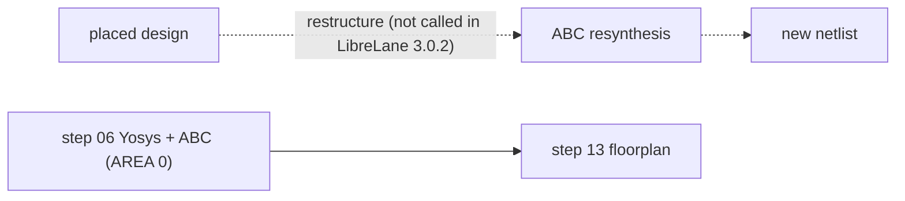

**What it did in this repo.** Nothing: no step, no log, no metric.

---

### dft (scan insertion)

**Purpose.** dft inserts scan chains (replaces flops by scan flops, stitches them, adds scan enable/in/out ports) for manufacturing test.
Origin: a recent OpenROAD module "dft" (scan-chain architect on top of a scan-cell replacement); authorship and status in the container's OpenROAD: not verified.

**Meta features (Tcl).** Commands such as `set_dft_config`, `scan_replace`, `preview_dft`, `insert_dft`; exact set: not verified.

**Is dft used here? No.** LibreLane 3.0.2 has no scan step among its OpenROAD step ids, none of the designs here has scan ports (every engine uses the 24-pin stream interface or the 109-pin Wishbone interface), and the physical-test goal of this repo is gate-level simulation, LVS and DRC, not ATE test.
The Caravel harness does its own test access outside the user macro.

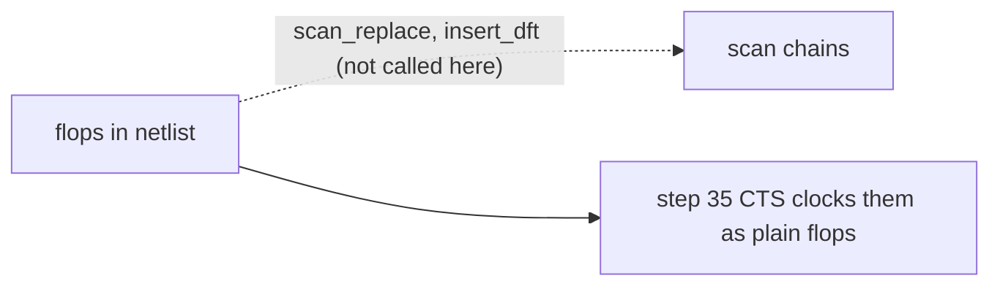

**What it did in this repo.** Nothing: no step, no log, no metric. The 200 sequential cells of kv_attn_n8 (`design__instance__count__class:sequential_cell` in `designs/kv_attn_n8/output/metrics.json`) are plain D flops.

---

### Placement engines in one picture

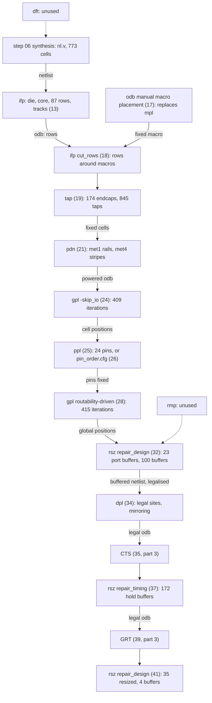

Handoffs in words: ifp hands rows and tracks; tap and pdn hand fixed cells and power wires that gpl treats as obstacles; gpl 24 hands cell positions to ppl, which hands fixed pin positions back to gpl 28;
gpl hands overlapping positions to rsz (32), which buffers port nets and slews and legalises through dpl; dpl hands a legal placement to CTS; rsz repairs hold after CTS (37) and slew after global routing (41), each time ending with a dpl legalisation.
Evidence for all of the counts is in the sections above (`KV/*` logs and `designs/kv_attn_n8/output/metrics.json`).

## Clock tree, routing and signoff engines

This part covers the engines that run after placement: clock tree synthesis (cts), global routing (grt), antenna checking and repair (ant), detailed routing (drt), filler insertion (fin), parasitic extraction (rcx), power-grid analysis (psm) and signoff timing (sta), then the three engines OpenROAD itself does not contain but the flow needs to close the chip (Magic, KLayout, Netgen).

Conventions used below.

- "Run A" is `designs/kv_attn_n8/runs/RUN_2026-10-06_07-00-35` (78 steps, a plain 260 x 260 um design). Its numbers come from `designs/kv_attn_n8/output/metrics.json` and `designs/kv_attn_n8/output/reports/`.
- "Run B" is `designs/soc_kv_attn_n8/runs/RUN_2026-10-06_08-09-32` (the macro that is later put in the Caravel wrapper; it sets the CTS and diode keys explicitly). Numbers come from `designs/soc_kv_attn_n8/output/metrics.json`.
- "Run W" is `designs/user_project_wrapper_soc_kv/runs/RUN_2026-10-06_08-13-27` (69 steps, the wrapper around the macro).
- Step names are LibreLane step ids: `NN-tool-name`. The Tcl scripts are those in the container image `ghcr.io/librelane/librelane:3.0.2` under `librelane/scripts/openroad/` (read with `docker run ... find`, no flow was run). Every step directory holds `state_in.json`, `state_out.json`, `config.json`, `COMMANDS`, a log and `or_metrics_out.json`.
- A "view" in `state_out.json` is one design representation: `odb`, `def`, `nl`, `pnl`, `sdc`, `spef`, `sdf`, `lib`, `gds`, `lef`, `spice`.

### cts: clock tree synthesis (TritonCTS)

**Purpose and origin.** cts turns the single ideal `clk` net into a buffered tree so that all flip-flop clock pins see the edge at nearly the same time. TritonCTS is the OpenROAD clock tree engine; its tree is built as an H-tree (the log says "Generating H-Tree topology"), with sink clustering, from the OpenROAD project (TritonCTS lineage from UCSD/UMich; exact paper not verified here).

**Meta features.**

- Tcl commands used by LibreLane (`scripts/openroad/cts.tcl`): `repair_clock_inverters`, `configure_cts_characterization`, `clock_tree_synthesis`, `set_propagated_clock`, `repair_clock_nets`, then `detailed_placement` through `common/dpl.tcl`, and `report_cts`.
- Knobs (LibreLane variables, defaults from `resolved.json` of Run A): `CTS_ROOT_BUFFER` `sky130_fd_sc_hd__clkbuf_16`, `CTS_CLK_BUFFERS` (a list of `clkbuf_*` patterns), `CTS_SINK_CLUSTERING_ENABLE` true, `CTS_SINK_CLUSTERING_SIZE` and `CTS_SINK_CLUSTERING_MAX_DIAMETER` (null = TritonCTS default), `CTS_DISTANCE_BETWEEN_BUFFERS` (0 = not passed), `CTS_CLK_MAX_WIRE_LENGTH` (0), `CTS_APPLY_NDR` "half", `CTS_MAX_CAP`, `CTS_MAX_SLEW`, `CTS_BALANCE_LEVELS`, `CTS_OBSTRUCTION_AWARE`, `CTS_MACRO_CLUSTERING_*`, `CTS_DISABLE_POST_PROCESSING`, `RUN_CTS` (the Wrapper config sets it false).
- Sink clustering groups nearby flip-flops under one leaf buffer: size is the maximum sinks per cluster, max diameter is the cluster span in um. A non-default `CTS_DISTANCE_BETWEEN_BUFFERS` (um) makes the tree insert buffers along long wires.

**Where it sits.** Run A: `35-openroad-cts`, between `34-openroad-detailedplacement` and `36-openroad-stamidpnr-1`; it is followed by `37-openroad-resizertimingpostcts` (rsz, part 2) which repairs setup and hold on the now-real clock. Run B: also `35-openroad-cts`. Run W: no cts step, because `RUN_CTS` is false and the macro already contains its tree (`designs/user_project_wrapper_soc_kv/config.json`, comment `//2` in the wrapper docs).

**Config in this repo.** Run A (`designs/kv_attn_n8/config.json`) sets none of the CTS keys, so all stay at LibreLane defaults. Four designs set them: `tiny_ai_core`, `soc_image_text_match` and `soc_kv_attn_n8` use `CTS_SINK_CLUSTERING_SIZE` 8, `CTS_SINK_CLUSTERING_MAX_DIAMETER` 20 and `CTS_DISTANCE_BETWEEN_BUFFERS` 30 (the macros that go into Caravel); `user_proj_example` sets only `CTS_CLK_MAX_WIRE_LENGTH` 500. The command Run B actually ran (`35-openroad-cts/openroad-cts.log`) was `clock_tree_synthesis -buf_list clkbuf_8 clkbuf_4 clkbuf_2 -root_buf clkbuf_16 -sink_clustering_size 8 -sink_clustering_max_diameter 20 -sink_clustering_enable -apply_ndr half -distance_between_buffers 30`. Why 8/20/30 were chosen is not written in a config comment; I do not claim a reason beyond "the template macro recipe in `.claude/skills/harden-design/reference.md`".

**Inputs and outputs.** In: `odb`, `sdc` from `34-openroad-detailedplacement` (placement parasitics via `estimate_parasitics -placement`). Out: new `odb`, `def`, `nl`, `pnl`, `sdc` (the SDC gains propagated clocks), plus `cts.rpt` (copied to `designs/<d>/output/reports/cts.rpt`).

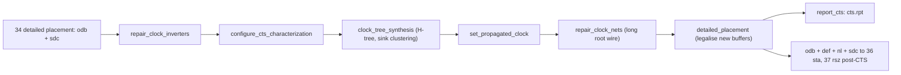

**What it did in this repo.**

- Run A, defaults: 1 clock root, 200 sinks, 49 buffers (16 `clkbuf_8`, 33 `clkbuf_16`) plus 8 dummy `clkbuf_4` loads (`designs/kv_attn_n8/output/reports/cts.rpt`). The log (`35-openroad-cts/openroad-cts.log`) shows the H-tree halving sinks per sub-region 100, 50, 25, 13, 7 and stopping because "Max number of sinks is 8", with 3 buffers on every clock path (CTS-0012 and CTS-0013, both 3).
- Run B, explicit knobs: 570 sinks, 253 buffers (252 `clkbuf_8`, 1 `clkbuf_16`) plus dummies (`designs/soc_kv_attn_n8/output/reports/cts.rpt`). That is 570 / 253 = 2.3 sinks per buffer overall, including the interior tree levels (my division).
- Result on skew, Run A (`metrics.json`): `clock__skew__worst_setup` 0.2615 ns and `clock__skew__worst_hold` -0.2612 ns, worst over nine corners. Run A worst setup slack 10.7398 ns and worst hold +0.1052 ns (`reports/timing_summary.rpt`).
- Instructive: in Run W the cts step does not exist, yet hold had to be fixed. The wrapper takes its clock latency from the Caravel SDC (latencies 4.65 to 5.57 ns, `.claude/skills/wrapper-build/reference.md` item 3), not from a tree built here. That SDC is what moved hold from -0.894 ns to +0.105 ns.

### grt: global routing (FastRoute)

**Purpose and origin.** grt plans each net as a path through coarse routing cells (gcells) and layers, before any exact geometry exists. It answers "will this fit?" (congestion) and gives the router guides. FastRoute is the algorithm family (Pan and Chu, FastRoute 4); OpenROAD's grt module is derived from it (the module is named FastRoute in OpenROAD; paper details not verified here).

**Meta features.**

- Tcl: `set_routing_layers`, `set_global_routing_layer_adjustment` (via `common/set_layer_adjustments.tcl`), `set_macro_extension`, `global_route -congestion_iterations N -verbose [-allow_congestion]`, `estimate_parasitics -global_routing`, `write_guide`.
- Knobs: `RT_MIN_LAYER` met1, `RT_MAX_LAYER` met4 (Run A `resolved.json`), `GRT_ADJUSTMENT` 0.3 (30 % of every layer's tracks reserved), `GRT_LAYER_ADJUSTMENTS` (per layer), `GRT_OVERFLOW_ITERS` 50, `GRT_ALLOW_CONGESTION` false, `GRT_MACRO_EXTENSION` 0, `RT_CLOCK_MIN_LAYER` and `RT_CLOCK_MAX_LAYER` (null).
- Same engine, other roles: `repair_antennas` (see ant) and `repair_design` after routing use grt for wire lengths; `estimate_parasitics -global_routing` supplies the RC for `38`, `45` stamidpnr steps and the post-GRT resizer.

**Where it sits.** Run A: `39-openroad-globalrouting` (script `grt.tcl`), then `41-openroad-repairdesignpostgrt` (script `repair_design_postgrt.tcl`, which re-sources `common/grt.tcl` when `GRT_DESIGN_REPAIR_RUN_GRT` is true) and `43-odb-heuristicdiodeinsertion/3-openroad-globalrouting` (a sub-step that re-routes after diodes were placed). Run B: `39-openroad-globalrouting`. Run W: `35-openroad-globalrouting`.

**Inputs and outputs.** In: `odb` with placed cells and (post-CTS) clock tree. Out: `odb` (route guides stored), `def`, and `after_grt.guide` in the step directory. `routing_global.txt` in the committed reports is the step log.

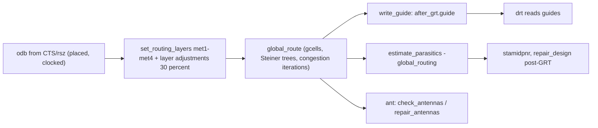

**What it did in this repo.**

- Run A (`designs/kv_attn_n8/output/reports/routing_global.txt`): global adjustment 30 %, 50 clock nets, 1130 routed nets, degree 2 to 17, blockages 3230. Resources after derating: met1 13394, met2 13117, met3 9294, met4 5910 tracks (33.27 %, 33.57 %, 31.50 %, 39.92 % reduction). Final usage 11.84 % in total (met1 18.71 %, met2 18.06 %, met3 0.54 %, met4 0.24 %), overflow 0 on every layer. Estimated wire length 52412 um (GRT-0018); `metrics.json` records `global_route__wirelength` 54889 and `global_route__vias` 8443 (the metric is the value after the later post-GRT passes, so it differs from this first log; I did not reconcile the two).
- Run B: `global_route__wirelength` 130548, `global_route__vias` 21851 (`designs/soc_kv_attn_n8/output/metrics.json`).
- Run W: `global_route__wirelength` 28738 and `global_route__vias` 246 (`designs/user_project_wrapper_soc_kv/output/metrics.json`): the wrapper only routes about 109 Wishbone nets to the macro.
- Instructive, GRT-0116: the first `tiny_ai_core` macro had 361 signal pins on its bottom edge, 16 um above the wrapper's own pin row, in a 400 x 400 um die. Global routing failed on congestion. The fix was a 109-pin macro (Wishbone and irq), pins in the order of the wrapper pads, 250 x 250 um, placed at (189.06, 87.04) um (`designs/user_project_wrapper/README.md` item 2; `.claude/skills/wrapper-build/reference.md` item 2). The lesson: congestion is a placement and pin problem, so the cure is fewer, ordered pins and shorter wires, never a looser setting (`GRT_ALLOW_CONGESTION` stays false).

### ant: antenna checker and repair

**Purpose and origin.** Long metal wires attached only to a gate collect charge during plasma etching and can break the gate oxide. The antenna checker computes the ratio of metal area to gate area per net and layer (partial and required ratios, the PDK rule) and flags violators. The repair inserts a protective diode next to the gate or a jumper to a higher layer. The checker (`ant`, `check_antennas`) is OpenROAD's antenna module from the OpenROAD project; the repair (`repair_antennas`) lives in the grt module. Algorithm papers not verified.

**Meta features.**

- Tcl: `check_antennas -verbose` (report to `reports/antenna.rpt` and `antenna_summary.rpt`), `repair_antennas <diode_cell> -iterations N -ratio_margin M [-jumper_only | -diode_only]`.
- LibreLane knobs: `DIODE_CELL` `sky130_fd_sc_hd__diode_2/DIODE`; `RUN_ANTENNA_REPAIR`; `GRT_ANTENNA_REPAIR_ITERS` 3; `GRT_ANTENNA_REPAIR_MARGIN` 10 (percent); `DRT_ANTENNA_REPAIR_ITERS` 3; `DRT_ANTENNA_REPAIR_MARGIN` 10; `*_JUMPER_ONLY`, `*_DIODE_ONLY`; `DIODE_ON_PORTS` (`none`, `in`, `out`, `both`; default `none`); `RUN_HEURISTIC_DIODE_INSERTION`; `HEURISTIC_ANTENNA_THRESHOLD` 90.
- LibreLane has three diode mechanisms. (1) `odb-diodesonports` (`DiodesOnPorts` in `librelane/steps/odb.py`): unconditionally places a diode on every design port of the chosen polarity, built for macros "where ports may get long wires unaccounted for when hardening a top-level chip". (2) `odb-heuristicdiodeinsertion` (`FuzzyDiodePlacement`, script by Sylvain "tnt" Munaut): places diodes where a Manhattan-length estimate of a not-yet-existing wire exceeds `HEURISTIC_ANTENNA_THRESHOLD`; it needs `GPL_CELL_PADDING` greater than 0. (3) `openroad-repairantennas`: after global routing, uses real route guides.
- Note that `check_antennas` runs again after `drt` (steps `48-openroad-checkantennas-1`), and `drt.tcl` itself loops `check_antennas` and `repair_antennas` followed by a re-route if violations remain.

**Where it sits.** Run A: `15-odb-checkmacroantennaproperties` (macro LEF has antenna data), `40-openroad-checkantennas`, `42-odb-diodesonports` (skipped, `DIODE_ON_PORTS` is `none`), `43-odb-heuristicdiodeinsertion` (3 sub-steps: fuzzy placement, detailed placement, global routing), `44-openroad-repairantennas` (sub-steps `1-openroad-diodeinsertion`, `2-openroad-checkantennas`), `48-openroad-checkantennas-1`, `63-odb-checkdesignantennaproperties`. Run B has `42-odb-diodesonports` (sub-steps `1-odb-portdiodeplacement`, DPL, GRT) and no heuristic step. Run W: `36-openroad-checkantennas`, `37-odb-diodesonports`, `41-openroad-checkantennas-1`; no repair step (`RUN_ANTENNA_REPAIR` false).

**Inputs and outputs.** In: `odb` after GRT. Out: `odb` with diode instances and, for check steps, `reports/antenna.rpt`, `antenna_summary.rpt`; metrics `antenna__violating__nets`, `antenna__violating__pins`, `route__antenna_violation__count`, `design__instance__count__class:antenna_cell`.

```mermaid
flowchart LR
  ant_grt["39 grt: guides"] --> ant_chk["40 check_antennas"]
  ant_chk --> ant_ports["42 diodesonports (DIODE_ON_PORTS)"]
  ant_ports --> ant_heur["43 heuristic diode insertion (threshold 90)"]
  ant_heur --> ant_rep["44 repair_antennas (diode_2, 3 iters, margin 10)"]
  ant_rep --> ant_chk2["check_antennas again"]
  ant_chk2 --> ant_drt["46 drt"]
  ant_drt --> ant_chk3["48 check_antennas post-route"]
  ant_chk3 -.->|"violations: diode + re-route loop in drt.tcl"| ant_drt
```

**Why our macros use `DIODE_ON_PORTS` "in".** A macro's input pins connect to long wires that exist only in the top level, where the macro's own flow cannot see them. A diode on each input port, placed inside the macro with its power pins connected, protects the gate whatever the top-level wire does. In the wrapper, a router-added diode lands in the wrapper's own row space with no power connection. That produced 40 unpowered diodes, 70 LVS errors and an nwell DRC error (`designs/user_project_wrapper/README.md` item 3; `.claude/skills/wrapper-build/SKILL.md` failure table). The fix pair is: macro with `DIODE_ON_PORTS` "in", `RUN_HEURISTIC_DIODE_INSERTION` false, `RUN_ANTENNA_REPAIR` true; wrapper with `RUN_ANTENNA_REPAIR` false (`.claude/skills/wrapper-build/SKILL.md` line 15). The set of keys appears in `designs/tiny_ai_core/config.json`, `designs/soc_image_text_match/config.json` and `designs/soc_kv_attn_n8/config.json`. The wrapper `.claude/skills/wrapper-build/reference.md` also says the later soc_itm wrapper had `RUN_ANTENNA_REPAIR` false so nothing was inserted.

**What it did in this repo.**

- Run A (no port diodes, heuristic on): before repair, `40-openroad-checkantennas/reports/antenna_summary.rpt` lists 1 net and 1 pin violation: net `net114` at pin `fanout111/A` on met3, partial ratio 419.94 against required 400.00 (P/R 1.05). The heuristic step logged "Inserted 488 diodes" (`43-odb-heuristicdiodeinsertion/1-odb-fuzzydiodeplacement/odb-fuzzydiodeplacement.log`). `repair_antennas` then found 0 violations (GRT-0012), and the post-route check found 0 nets and 0 pins (ANT-0002, ANT-0001 in `48-openroad-checkantennas-1`). The metric `design__instance__count__class:antenna_cell` is 592 (area 1481.42 um^2), while the log counts 488 from the heuristic step; I did not trace the other 104 cells, so treat the 592 as the metric of record. `antenna_diodes_count` 0 in the same file means the metrics key is not the diode total.
- Run B (port diodes): `42-odb-diodesonports/1-odb-portdiodeplacement` inserted 48 diodes (log). The post-GRT repair then found 2 antenna violations, fixed them with 2 jumpers (GRT-0302 "Inserted 2 jumpers for 2 nets") and the later checks show 0 nets and 0 pins. The metrics record 48 antenna cells, 120.115 um^2 (`designs/soc_kv_attn_n8/output/metrics.json`).
- `tiny_ai_core`: 49 diode cells with `DIODE_ON_PORTS` "in" (`designs/tiny_ai_core/NOTES.md`, antenna paragraph).

### drt: detailed routing (TritonRoute)

**Purpose and origin.** drt places the real metal shapes and vias, following the guides, obeying the DRC rules of the technology. TritonRoute is the detailed router in OpenROAD (Kahng, Wang and Xu, ICCAD 2018, as a published reference; I did not re-verify the citation in this repo). It works by pin-access planning, then repeated rip-up-and-reroute optimization passes.

**Meta features.**

- Tcl: `detailed_route -droute_end_iter N -or_seed 42 -verbose 1 -output_drc <file>`, `set_thread_count`, `create_ndr`, `assign_ndr`, `detailed_route_debug` (snapshots), `write_db`.
- Knobs: `DRT_THREADS` 2, `DRT_OPT_ITERS` 64 (maximum iterations), `DRT_SAVE_SNAPSHOTS` false, `DRT_SAVE_DRC_REPORT_ITERS`, `DRT_ASSIGN_NDR` (non-default rule per net regex), `DRT_ANTENNA_REPAIR_ITERS` 3 (post-route antenna loop, see ant).
- Seed fixed at 42, so results are reproducible for the same input.

**Where it sits.** Run A: `46-openroad-detailedrouting`, then `47-odb-removeroutingobstructions` (drops the routing blockages added by `23-odb-addroutingobstructions`), `48-openroad-checkantennas-1`, `49-checker-trdrc` (fails the flow if `route__drc_errors` is not 0). Run B: `45-openroad-detailedrouting`, `48-checker-trdrc`. Run W: `39-openroad-detailedrouting`, `42-checker-trdrc`.

**Inputs and outputs.** In: `odb` with guides from grt. Out: routed `odb`, `def`, `nl`, `pnl`, `sdc`, `kv_attn_n8.drc` and `.drc.xml` (the DRC marker list), `drt-run-0/` (copy of the odb and DRC of each run). `routing_detailed.txt` in the committed reports is the step log.

```mermaid
flowchart LR
  drt_in["odb + route guides"] --> drt_pin["pin access analysis"]
  drt_pin --> drt_i0["iteration 0: initial route, 274 DRC"]
  drt_i0 --> drt_i1["iteration 1: rip-up and reroute, 90"]
  drt_i1 --> drt_i2["iteration 2: 35"]
  drt_i2 --> drt_i3["iteration 3: 0, done"]
  drt_i3 --> drt_ant["check_antennas, repair loop if needed"]
  drt_ant --> drt_out["routed odb + def + drc report"]
  drt_out --> drt_chk["49 checker-trdrc: route__drc_errors must be 0"]
```

**What it did in this repo.**

- DRC convergence in Run A (`metrics.json` keys `route__drc_errors__iter:0..3`): 274, 90, 35, 0, with wire length 34819, 34558, 34470, 34465 um (`route__wirelength__iter:*`). The log gives the same violation counts (DRT-0199) and wire length by layer for iteration 0: met1 18106 um, met2 16249 um, met3 384 um, met4 79 um, li1 and met5 0 (`designs/kv_attn_n8/output/reports/routing_detailed.txt`). Final: `route__wirelength` 34465 um, `route__vias` 8691 (all single-cut, `route__vias__singlecut` 8691, `route__vias__multicut` 0), `route__wirelength__max` 532.88 um, `route__net` 1134, `route__net__special` 2, `route__drc_errors` 0.
- Pin access in the Run A log: 1267 pins, 167 unique instance patterns, 9112 guides, a 37 x 37 gcell grid with 6900 dbu steps (DRT-0157, DRT-0176, DRT-0177).
- Run B: 546, 135, 74, 0 (`designs/soc_kv_attn_n8/output/metrics.json`), wire length 82391 um, 20877 vias. Run W: 63, 6, 3, 0 with 27069 um and 224 vias (`designs/user_project_wrapper_soc_kv/output/metrics.json`). In all three runs the count falls by roughly a factor 2.5 to 5 each iteration and reaches 0 at iteration 3 (my reading of the numbers).
- Antenna loop: in Run A `drt.tcl` ran `check_antennas`, found nothing, and skipped the repair-and-reroute (log line `+ check_antennas`, no "Running antenna repair iteration").
- Warnings: DRT-0349 "LEF58_ENCLOSURE with no CUTCLASS is not supported" appears for the via layers (`mcon`, `via`, `via2`, `via3`, `via4`) in Run A's log. It is a sky130 tech-LEF feature OpenROAD skips; DRC is then confirmed independently by Magic and KLayout, which find 0 errors.

### fin: filler insertion

**Purpose and origin.** Fills every empty site in the standard-cell rows with filler and decap cells, so that the nwell and implant layers are continuous and the foundry density rules hold. This is `filler_placement` in OpenROAD's `dpl` module (there is no separate "fin" tool; the label here is the LibreLane step `fillinsertion`).

**Meta features.**

- Tcl: `filler_placement <list of cell patterns>`; LibreLane passes `DECAP_CELLS` followed by `FILL_CELLS` (PDK variables, `FILL_CELLS` in `resolved.json`).
- Knob: `RUN_FILL_INSERTION` (true; the wrapper config sets false).
- Metal fill for density (a different thing) is not done by OpenROAD here; I did not find a metal-fill step in the 78-step list of Run A.

**Where it sits.** Run A: `54-openroad-fillinsertion`, after the last timing-relevant placement change and before rcx, so the extracted SPEF sees the final layout. Run B: `53-openroad-fillinsertion`. Run W: no step (`RUN_FILL_INSERTION` false); the macro brings its own filler inside its GDS.

**Inputs and outputs.** In: routed `odb`. Out: `odb`, `def`, `nl`, `pnl` with extra instances. The `nl` and `pnl` views then contain the filler cells, which matters for the gate-level simulation (`designs/soc_kv_attn_n8/NOTES.md`: the routed netlist has 15565 cells, "fill, tap and diodes included").

```mermaid
flowchart LR
  fin_in["routed odb (46)"] --> fin_list["DECAP_CELLS + FILL_CELLS list"]
  fin_list --> fin_run["filler_placement: fill empty sites"]
  fin_run --> fin_out["odb + def + nl + pnl with filler"]
  fin_out --> fin_rcx["56 rcx"]
  fin_out --> fin_gds["59 Magic streamout"]
```

**What it did in this repo.** Run A: "Placed 11810 filler instances" (DPL-0001 in `54-openroad-fillinsertion/openroad-fillinsertion.log`) on top of 174 fill cells already present (cell-type table in `routing_global.txt`), so `metrics.json` shows `design__instance__count__class:fill_cell` 11984 with area 42478.2 um^2 (my sum 174 + 11810 = 11984). Run B: 11051 fill cells, 37726.2 um^2. By cell type, `tiny_ai_core` shows 10780 `decap_3`, 639 `fill_1`, 422 `fill_2` (`designs/tiny_ai_core/NOTES.md`, cells paragraph; `cell_usage.rpt`), so most of the area is decap, not plain fill.

### rcx: parasitic extraction (OpenRCX)

**Purpose and origin.** rcx extracts resistance and capacitance of the routed wires into SPEF files so that signoff timing uses real parasitics instead of estimates. OpenRCX is the extraction engine of OpenROAD, a rewrite of the extractor from the Chip and Systems group at UCSD, which it describes as a "Calibre-compatible" flow (the ruleset file names end in `.calibre`).

**Meta features.**

- Tcl: `define_process_corner`, `extract_parasitics -ext_model_file <rules> -lef_res [-no_merge_via_res]`, `write_spef` (done by `write_views`).
- Knobs: `RUN_SPEF_EXTRACTION` true, `RCX_RULESETS` (a dictionary min, nom, max to files `rules.openrcx.sky130A.<min|nom|max>.calibre` under the PDK `libs.tech/openlane` directory), `RCX_MERGE_VIA_WIRE_RES` true, `RCX_SDC_FILE` null.
- LibreLane runs the three extractions in parallel (three `_env_ThreadPoolExecutor-3_N.tcl` files in the step dir).

**Where it sits.** Run A: `56-openroad-rcx`, directly before `57-openroad-stapostpnr`. Run B: `55-openroad-rcx`. Run W: `48-openroad-rcx`.

**Inputs and outputs.** In: routed `odb`/`def` plus LEFs. Out: `spef` view with three keys `nom_*`, `min_*`, `max_*` (`state_out.json`), files `56-openroad-rcx/{min,nom,max}/kv_attn_n8.<corner>.spef`, and a `rcx.log` per corner (RCX-0431 to RCX-0436 messages, "RC segment generation ... max_merge_res 50.0").

```mermaid
flowchart LR
  rcx_in["routed odb + def + LEFs"] --> rcx_min["extract with rules min"]
  rcx_in --> rcx_nom["extract with rules nom"]
  rcx_in --> rcx_max["extract with rules max"]
  rcx_min --> rcx_smin["kv_attn_n8.min.spef"]
  rcx_nom --> rcx_snom["kv_attn_n8.nom.spef"]
  rcx_max --> rcx_smax["kv_attn_n8.max.spef"]
  rcx_smin --> rcx_sta["57 sta: 9 corners"]
  rcx_snom --> rcx_sta
  rcx_smax --> rcx_sta
```

**What it did in this repo.** Run A produced three SPEFs (one per RC corner); STA then pairs each RC corner with three PVT corners (see sta). The SPEFs of a hardened macro are exported into `build/macros/<m>/spef/{min,nom,max}/` and the wrapper config maps `min_*`, `nom_*`, `max_*` to them (`designs/user_project_wrapper_soc_kv/config.json`, `MACROS.soc_kv_attn_n8.spef`). That is how the wrapper's STA (`49-openroad-stapostpnr`) sees the macro's internal RC without re-extracting it. I did not read RCX run times; the step time is in `56-openroad-rcx/runtime.txt`.

### psm: power-grid analysis (PDNSim)

**Purpose and origin.** psm checks the power grid: are all shapes of a power net connected, and how much does the voltage sag when the cells draw current (IR drop)? PDNSim (module `psm`) is OpenROAD's static IR-drop solver; origin: OpenROAD project (published reference not verified here).

**Meta features.**

- Tcl: `analyze_power_grid -net <net> -voltage_file <csv> [-vsrc <file>]`, `set_pdnsim_net_voltage -net <net> -voltage <V>`, `check_power_grid` (connectivity; used by the PDN step).
- Knobs: `RUN_IRDROP_REPORT` true, `VSRC_LOC_FILES` (supply bump locations; unset here, so the script uses the lib voltage `LIB_VOLTAGE` for VDD and 0 V for GND), `VDD_NETS` `vccd1`, `GND_NETS` `vssd1`.
- Uses the nominal-corner SPEF (`CURRENT_SPEF_DEFAULT_CORNER`) for the power numbers.
- Two LibreLane checks involve psm: `30-checker-powergridviolations` (Run A) checks the power grid right after PDN generation (metric name not verified), and `58-openroad-irdropreport` is the post-route report.

**Where it sits.** Run A: `30-checker-powergridviolations`, `58-openroad-irdropreport`. Run B: `57-openroad-irdropreport`. Run W: neither IR step ran (`RUN_IRDROP_REPORT` false, `PDN_ENABLE_RAILS` false); `29-checker-powergridviolations` still ran.

**Inputs and outputs.** In: routed `odb`, SPEF, nets. Out: `irdrop.rpt`, `net-vccd1.csv`, `net-vssd1.csv` (voltage per node); metrics `ir__voltage__worst`, `ir__drop__avg`, `ir__drop__worst`.

```mermaid
flowchart LR
  psm_in["routed odb + nom SPEF"] --> psm_set["set_pdnsim_net_voltage: vccd1 1.8 V, vssd1 0 V"]
  psm_set --> psm_run["analyze_power_grid per net"]
  psm_run --> psm_conn["connectivity: all shapes connected?"]
  psm_run --> psm_ir["IR drop per node"]
  psm_conn --> psm_rep["irdrop.rpt"]
  psm_ir --> psm_rep
  psm_ir --> psm_csv["net-vccd1.csv, net-vssd1.csv"]
```

**What it did in this repo.** Run A (`designs/kv_attn_n8/output/reports/irdrop.rpt`): "PSM-0040 All shapes on net vccd1 are connected" and the same for vssd1; vccd1 total power 9.72e-04 W, worst voltage 1.80 V, average IR drop 3.97e-05 V, worst IR drop 2.16e-04 V (0.01 %). `metrics.json`: `ir__drop__avg` 3.97e-05, `ir__drop__worst` 0.000216. Run B: worst IR drop 6.74e-04 V on vccd1 (`designs/soc_kv_attn_n8/runs/RUN_2026-10-06_08-09-32/57-openroad-irdropreport/irdrop.rpt`), `ir__drop__worst` 0.000674 in its `metrics.json`. These drops are tiny because the design is small and sits on a power-strap grid with 153.6 / 153.18 um pitch (`PDN_VPITCH`, `PDN_HPITCH` in Run A `resolved.json`). The report is a static estimate at one corner (nom_tt); it does not model switching events.

### sta at signoff: stapostpnr (OpenSTA, 9 corners)

**Purpose and origin.** The final timing verdict. OpenSTA, written by James Cherry (Parallax Software), is the static timing engine inside OpenROAD (see part 1, shared infra: sta). Here it runs standalone (`sta -no_splash -exit .../sta/corner.tcl`, in `57-openroad-stapostpnr/COMMANDS`) once per corner, on the routed netlist with extracted parasitics.

**Meta features.**

- Corner naming `<rc>_<process>_<temp>_<voltage>`; with `STA_CORNERS` in `resolved.json` there are nine: `{nom, min, max}` x `{tt_025C_1v80, ss_100C_1v60, ff_n40C_1v95}`. The RC part (`nom`, `min`, `max`) picks the SPEF from rcx; the rest picks the Liberty file.
- Reports per corner (step dir `57-openroad-stapostpnr/<corner>/`): `max.rpt`, `min.rpt`, `ws.*.rpt`, `wns.*.rpt`, `tns.*.rpt`, `skew.*.rpt`, `clock.rpt`, `power.rpt`, `checks.rpt`, `violator_list.rpt`, `unpropagated.rpt`; a Liberty model `<design>__<corner>.lib` and an SDF `<design>__<corner>.sdf` (used by gate-level SDF simulation).
- Knobs: `STA_CORNERS`, `STA_THREADS`, `STA_MACRO_PRIORITIZE_NL` true, `STA_MAX_VIOLATOR_COUNT`, `STA_EXTRA_CORNER_TCL_FILE`. Constraint knobs that matter for the result: `CLOCK_PERIOD` 25 (fixed by repo rule), `MAX_TRANSITION_CONSTRAINT`.

**Where it sits.** Run A: `57-openroad-stapostpnr`; later checkers read its metrics: `74-checker-setupviolations`, `75-checker-holdviolations`, `76-checker-maxslewviolations`, `77-checker-maxcapviolations`. Run B: `56-openroad-stapostpnr`. Run W: `49-openroad-stapostpnr`. There are also mid-flow STA steps `31-openroad-stamidpnr` .. `45-openroad-stamidpnr-3` that use estimated parasitics (part 1).

**Inputs and outputs.** In: `nl`, `pnl`, `sdc`, `spef` (3 keys), macro `lib` views. Out: `lib` and `sdf` views (9 keys each), `summary.rpt` (committed as `output/reports/timing_summary.rpt`) and worst paths (`timing_paths_max_ss.rpt`, `timing_paths_min_ff.rpt`).

```mermaid
flowchart LR
  sta_nl["nl + pnl + sdc"] --> sta_run["OpenSTA per corner"]
  sta_spef["SPEF min / nom / max (rcx)"] --> sta_run
  sta_lib["Liberty tt / ss / ff"] --> sta_run
  sta_run --> sta_rpt["per-corner reports: ws, tns, skew, checks"]
  sta_run --> sta_sdf["9 SDF files (gate-level sim)"]
  sta_run --> sta_lib2["9 timing .lib models (macro use)"]
  sta_rpt --> sta_sum["summary.rpt = timing_summary.rpt"]
  sta_sum --> sta_chk["74 setup, 75 hold, 76 slew, 77 cap checkers"]
```

**What it did in this repo.** Run A (`designs/kv_attn_n8/output/reports/timing_summary.rpt`): overall worst setup +10.7398 ns (at `max_ss_100C_1v60`, with 25 ns period) and worst hold +0.1052 ns (at `min_ff_n40C_1v95`); 0 setup violations, 0 hold violations; 551 max-slew violations (144 at tt, 511 at ss for the nom RC corner, 0 at ff), 1 max-cap violation (at `max_ss_100C_1v60`). Per-corner values: nom_tt setup 15.2450 / hold 0.3191; nom_ss 10.9487 / 0.8594; nom_ff 16.8563 / 0.1066. Run B overall: worst setup +1.4424 ns, worst hold +0.1048 ns (`designs/soc_kv_attn_n8/output/metrics.json`). Run W: worst setup +1.4481 ns and worst hold +0.1048 ns (`designs/user_project_wrapper_soc_kv/output/metrics.json`).

Instructive: the slew violations are reported but do not fail the repo flow. In `signoff_allowances.json` and in the notes, they are called environment-limited: Caravel input transitions of 0.84 / 0.92 ns on `wbs_dat_i` / `wbs_adr_i` exceed the 0.75 ns limit (`.claude/skills/wrapper-build/reference.md` item 4). Chasing them with a 70 % margin ran the container out of memory; 20 % is the setting (`GRT_DESIGN_REPAIR_MAX_SLEW_PCT` 20 in `designs/kv_attn_n8/config.json`). The same Caravel SDC fixed the Run W hold failure (-0.894 ns to +0.105 ns, `designs/user_project_wrapper/README.md` item 3).

### pad: ICeWall pad ring (unused here)

**Purpose and origin.** `pad` (ICeWall, from the OpenROAD project) builds I/O pad rings and bump arrays for a chip that owns its pads. LibreLane exposes it as `scripts/openroad/pad.tcl` (`read_pad_cfg`) and `common/pad_cfg.tcl`, with the variable `PAD_FILLERS` and padring step support.

**Status in this repo: unused.** In Run A `resolved.json` `PAD_FILLERS` is null and no `pad`-named step exists in the 78-step list. All our designs are macros or sit inside Caravel's `user_project_wrapper`, whose pads belong to the Caravel harness (`design__instance__count__padcells` 0 in Run A `or_metrics_out.json`). There is nothing to show for this engine beyond that.

### par: TritonPart partitioner (unused here)

**Purpose and origin.** `par` is OpenROAD's hypergraph partitioner (TritonPart, from the OpenROAD project; algorithmic details not verified here), used for tasks like clustering netlists or splitting designs.

**Status in this repo: unused.** The container's `librelane/scripts/openroad/` directory has no partitioning script and no step of Run A calls it. No metric in `metrics.json` mentions partitioning. Not verified beyond that file listing.

### dst: distributed routing (unused here)

**Purpose and origin.** `dst` is OpenROAD's utility for distributing work, mainly detailed-routing jobs, over several machines (a balancer and workers). Origin: OpenROAD project; not verified beyond that.

**Status in this repo: unused.** `DRT_THREADS` is 2 (Run A `resolved.json`), the container is capped at 2 CPUs and 8 GB (`PROFILE=tight`, `CLAUDE.md`), and the `drt.tcl` of LibreLane 3.0.2 only calls `set_thread_count`, with no distributed-routing calls.

### Beyond OpenROAD: the signoff neighbours

OpenROAD ends at an ODB/DEF with metal shapes. Three other tools turn it into mask data and check it independently. They are the only way the repo proves DRC 0, LVS 0 and XOR 0 (`designs/kv_attn_n8/output/metrics.json`).

#### Magic

- Steps (Run A): `59-magic-streamout` (DEF + tech LEF + PDK GDS to `kv_attn_n8.magic.gds` and `.mag`, also exposes `gds`), `62-magic-writelef` (abstract LEF from the layout, `lef.tcl`, with `lef nocheck vccd1 vssd1`; this is the LEF committed as `designs/kv_attn_n8/output/kv_attn_n8.lef` and used for macro integration), `66-magic-drc` (`drc.tcl`, GDS-based because `MAGIC_DRC_USE_GDS` is true in `config.json`), `70-magic-spiceextraction` (`extract_spice.tcl`, writes `kv_attn_n8.spice` for LVS), `68-checker-magicdrc`, `71-checker-illegaloverlap`.
- Takes: `def`/`odb` plus the PDK; returns: `gds`, `mag`, `lef`, `spice` and the metrics `magic__drc_error__count` (0), `magic__illegal_overlap__count` (0) (Run A `metrics.json`).
- It is slower than the routers but is the foundry-style DRC deck for sky130 and the source of the abstract LEF.

#### KLayout

- Steps (Run A): `60-klayout-streamout` (second GDS, `kv_attn_n8.klayout.gds`), `61-klayout-render` (the picture, committed as `designs/kv_attn_n8/output/layout.png`), `64-klayout-xor` (XOR of the Magic GDS against the KLayout GDS, a cross-check that the two stream-out paths agree; `xor.drc`), `67-klayout-drc` (PDK DRC deck), `69-checker-klayoutdrc`, `65-checker-xor`.
- Takes: `def`/`odb` or the Magic GDS; returns `klayout_gds`, `render`, and `klayout__drc_error__count` (0), `design__xor_difference__count` (0) in `metrics.json`.

#### Netgen

- Step: `72-netgen-lvs` followed by `73-checker-lvs`. It compares the Magic-extracted SPICE (`spice` view from step 70) with the powered netlist `pnl` and reports through `lvs_netgen.rpt`.
- Result for Run A (`designs/kv_attn_n8/output/reports/lvs_netgen.rpt`): "Cell pin lists are equivalent", "Device classes kv_attn_n8 and kv_attn_n8 are equivalent", "Final result: Circuits match uniquely." `metrics.json`: all `design__lvs_*` counters 0.
- LVS needs a powered netlist, which is why unpowered router diodes broke it: 70 errors in the first wrapper run (see ant).

### Routing and signoff in one picture

```mermaid
flowchart LR
  pic_place["placed odb (34 dpl)"] -->|"odb + sdc"| pic_cts["cts: TritonCTS"]
  pic_cts -->|"odb, cts.rpt, propagated clock"| pic_grt["grt: global route"]
  pic_grt -->|"guides, odb"| pic_ant["ant: check + diodes + repair_antennas"]
  pic_ant -->|"odb with diodes"| pic_rsz["rsz: repair_design post-GRT"]
  pic_rsz -->|"odb"| pic_drt["drt: detailed route"]
  pic_drt -->|"routed odb, def, drc"| pic_fin["fin: filler_placement"]
  pic_fin -->|"odb, nl, pnl"| pic_rcx["rcx: OpenRCX"]
  pic_rcx -->|"SPEF min nom max"| pic_sta["sta: 9 corners"]
  pic_rcx -->|"nom SPEF"| pic_psm["psm: IR drop"]
  pic_sta -->|"timing_summary.rpt, SDF, lib"| pic_chk["setup, hold, slew, cap checkers"]
  pic_psm -->|"irdrop.rpt"| pic_chk
  pic_fin -->|"def, odb"| pic_magic["Magic: streamout, DRC, SPICE, LEF"]
  pic_magic -->|"gds, mag, lef, spice"| pic_klayout["KLayout: render, XOR, DRC"]
  pic_magic -->|"spice"| pic_netgen["Netgen: LVS vs pnl"]
  pic_klayout -->|"klayout.gds, layout.png, xor and drc counts"| pic_done["metrics.json + output/ evidence"]
  pic_netgen -->|"lvs_netgen.rpt"| pic_done
  pic_chk -->|"pass or fail"| pic_done
```

## Unverified items

- Origin names for `est`, `rmp`, `grt`, `pad`, `exa` and `cgt` purposes are from general knowledge or command
  names, not proven by the binary.
- Whether `stt` is called by est/rsz/grt in this run is not shown by any log.
- Steps 11, 15, 17, 20, 22, 23, 26, 27, 33, 42, 47 have no `COMMANDS` file; the stated reason (feature not
  configured or no macros) is inferred from the missing file and the config, not from a log line.
