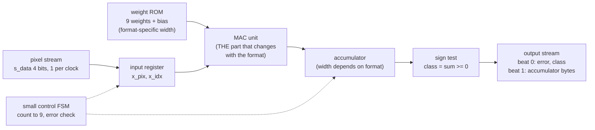

# Number formats in silicon: one neuron, seven formats

How many bits does a neuron need? `docs/WHY_AI.md` section 8 answers it in software
(`model/examples/precision.py`). This page answers it in **silicon**: the same tiny neuron was built seven times,
each in a different number format, and every copy was taken through the full open-source flow (simulate, layout,
signoff, gate-level re-simulation). All numbers below come from files in this repository, or are printed by
`model/precision_hw/report.py`. Run it yourself:

```bash
python3 model/precision_hw/report.py     # prints the tables in this page (standard library only, deterministic)
```

---

## 1. The setup

**Task.** A 3 x 3 image of 4-bit pixels (0..15) holds either a vertical bar (class 1) or a horizontal bar
(class 0). The model is one neuron: `sum = bias + w0*x0 + ... + w8*x8`, `class = (sum >= 0)`. That is 9 weights
plus a bias. Data and training are in `model/precision_hw/golden.py`: 400 training images, 2000 held-out test
images. The weights are trained once, in fp32, and then **converted** (quantised) to each format after training.

**Seven engines**, directories `designs/prec_{bin,tern,int4,int8,fp8,fp16,bf16}/`:

| fmt | weight format | accumulator (from `report.py`) |
|---|---|---|
| bin | 1 bit (+1 / -1), pixels binarised, XNOR + popcount | 4-bit count |
| tern | ternary {-1, 0, +1} (2 bits) | 10-bit integer |
| int4 | 4-bit signed integer | 12-bit integer |
| int8 | 8-bit signed integer | 17-bit integer |
| fp8 | E4M3 float, products exact in fp16 | fp16 |
| fp16 | IEEE binary16 | fp16 |
| bf16 | bfloat16 | bf16 |

**Why identical structure.** The contract `model/precision_hw/spec.md` fixes everything except the format: the same
24 pins, the same stream protocol (9 pixel beats in, 2 result beats out), the same 25 ns clock (40 MHz), the same
sky130 high-density library, the same flow settings. When the only variable is the number format, any difference in
area, timing or power is caused by the format. This is the point of the experiment.

**One MAC, reused serially.** Each engine has exactly one multiply-accumulate (MAC) unit. The 9 pixels arrive
one per clock; the unit multiplies pixel by weight and adds into an accumulator. The weight for pixel `i` comes from
a small generated ROM (`designs/prec_<fmt>/rtl/prec_<fmt>_rom.v`, written by `model/precision_hw/gen.py`). A
parallel engine would have nine MACs and cost roughly nine times more arithmetic; serial reuse keeps the arithmetic
the dominant, easily compared part.



**What changes per format:** the ROM word width, the arithmetic inside the MAC box, the accumulator width, and (for
the floating-point formats only) a pipeline register between the multiplier and the adder, giving latency 3
instead of 2 (section 6). The control FSM, pins and protocol do not change.

---

## 2. The results

Generated by `python3 model/precision_hw/report.py` (the "Study table" blocks; the file also prints the
full model table and the quantised parameters). Paste of the output:

```text
Study table A (accuracy, memory, latency; test set of 2000 images)
format   acc %  =fp32 %  param b  moved b        accum  latency  flow s
bin      88.95    90.30       13       22  4-bit count        2      45
tern     94.15    98.80       27       63   10-bit int        2      47
int4     94.25    98.90       47       83   12-bit int        2      65
int8     94.05   100.00       88      124   17-bit int        2      59
fp8      94.15    98.30       80      116         fp16        3     101
fp16     94.05   100.00      160      196         fp16        3     104
bf16     94.00    99.95      160      196         bf16        3      93

Study table B (hardened layout; setup@ss = setup slack at max_ss_100C_1v60, ns; clock 25 ns)
format std cells synth cells  flops  cell um2   die um  util %  wire um   vias  setup@ss  hold ns  power mW
bin          199          83     19      1474    80x80    37.6     2154    787    16.396    0.114     0.105
tern         293         160     28      2485    80x80    63.5     3895   1363    16.346    0.112     0.144
int4         377         230     30      3263    80x80    83.3     6171   2092    13.457    0.115     0.188
int8         642         352     35      4860  120x120    45.7     8187   2948    11.387    0.111     0.240
fp8         1404         709     49      9225  170x170    39.6    21106   6350     0.259    0.107     1.017
fp16        1932         905     52     11913  220x220    29.1    28736   7872     0.111    0.111     1.929
bf16        1754         776     51     10170  220x220    24.9    23952   6681     0.044    0.110     1.271

std-cell area relative to bin: bin 1.0x  tern 1.7x  int4 2.2x  int8 3.3x  fp8 6.3x  fp16 8.1x  bf16 6.9x
```

The fp32 reference (exact weights, exact sum) scores 94.05% on the same test set (`report.py` header).

**Column guide.**

- `acc %`: test accuracy over 2000 images. `=fp32 %`: share of test images where the format makes the same decision as fp32.
- `param b`: bits of parameters (9 weights + bias or threshold). `moved b`: input bits into the MAC (9 x 1 for bin,
  9 x 4 otherwise) plus the parameter bits read once.
- `latency`: cycles after the last input beat (from each `designs/prec_<fmt>/README.md`).
- `flow s`: wall time of the full flow, `output/resources.json` field `wall_s_total` (2 CPUs, 8 GB limit; one run per design).
- `std cells`, `cell um2`, `flops`, `util %`, `wire um`, `vias`, `hold ns`, `power mW`: `output/metrics.json` after
  routing. Std cells and cell area include tap cells, clock buffers, antenna diodes and timing-repair buffers.
- `synth cells`: cell count of the synthesised netlist before placement, `output/reports/synth_stat.rpt`.
- `power mW`: the flow's estimate (`power__total`), not a measurement.

**Read the area numbers correctly.** The weights are constants, and synthesis folds constants into logic: a
multiplier by a known constant is much smaller than a general multiplier, and the ROM becomes a few gates. So the
areas above are for an engine with **baked-in weights**. A programmable engine would also need memory, which these
numbers leave out. The column `param b` is the memory a programmable version would need to hold the parameters
(section 4). Treat `cell um2` as "arithmetic plus control with the weights hard-wired", and `param b` as "what you
would have to store if weights could change".

Die size is a human choice in `config.json` (80, 80, 80, 120, 170, 220, 220 um square), picked so the flow routes;
it is not a measured minimum. Utilisation varies for that reason, so compare **cell area**, not die area.

---

## 3. Compute: what one MAC is in gates

Each MAC is one multiply and one add. What that costs depends entirely on what the numbers look like.

| fmt | The MAC is | Evidence |
|---|---|---|
| bin | XNOR each pixel bit with a weight bit, count the ones (popcount), compare with a threshold | 0 xor/xnor cells in `synth_stat.rpt`: the weight is a ROM constant, so each XNOR collapses to a wire or inverter; what remains is a 4-bit counter |
| tern | add, subtract or skip the pixel: weight +1 adds, -1 subtracts, 0 does nothing | 17 xor/xnor (add/subtract conditional inversion), no multiplier |
| int4 | small signed multiply (4-bit weight by 4-bit pixel) and a 12-bit add | 15 xor/xnor, 230 synthesised cells |
| int8 | 8 x 5 bit signed multiply and a 17-bit add (`designs/prec_int8/README.md`) | 40 xor/xnor, 352 synthesised cells |
| fp8 / fp16 / bf16 | float multiply (significand multiply and normalise), then float add: compare and swap, align shifter, add/subtract, leading-zero count, normalise shifter, round-to-nearest-even, pack | many mux cells (shifters) plus xor/xnor: see table |

Synthesised cell mix, printed by `report.py` from each `output/reports/synth_stat.rpt`:

```text
format    xor/xnor         mux        flop     inv/buf other gates       total
bin              0           3          19           2          59          83
tern            17           3          28           6         106         160
int4            15           3          30           9         173         230
int8            40           4          35          11         262         352
fp8             45          61          49          45         509         709
fp16            63          92          52          44         654         905
bf16            52          63          51          41         569         776
```

What the evidence shows:

- **Multiplexers are the fingerprint of floating point.** The integer and binary engines use 3 to 4 `mux2`/`mux4`
  cells; fp8 uses 61, fp16 92, bf16 63. Muxes build the barrel shifters (alignment before the add, normalisation
  after it) that integers do not need.
- **No full-adder or half-adder cells appear** in any report: yosys builds adders out of xor/xnor and and-or-invert
  gates, so the "other gates" column holds the carry logic. Do not read "no adder cell" as "no adder".
- **Flops grow slowly** (19 to 52): they hold the accumulator, the pixel register, the index, state, and for floats
  the product register. The logic around them grows much faster.
- Area ratios (std-cell area, `metrics.json`, relative to bin; printed by `report.py`): tern 1.7x, int4 2.2x, int8
  3.3x, fp8 6.3x, fp16 8.1x, bf16 6.9x. Power estimate ratios follow the same order: 0.105 mW (bin) to 1.929 mW (fp16).
- fp16 versus bf16: same 16 bits of storage, but bf16 is 14.6% smaller (11913 - 10170 = 1743 um2) because its
  mantissa is shorter: the multiplier is 8 x 4 instead of 11 x 4 (`designs/prec_bf16/README.md` versus
  `designs/prec_fp16/README.md`). bf16 spends bits on range (8-bit exponent) instead of precision.
- int8 versus fp8: both have 8-bit weights, but the fp8 engine is 1.9x the area of int8 (9225 vs 4860 um2). Same
  bits per weight, very different cost: float hardware pays for alignment and normalisation whatever the width.

---

## 4. Memory and data movement

The `param b` and `moved b` columns of the table in section 2 (computed in `report.py` from `golden.py`):

| fmt | param bits | bits moved per inference | relative to fp32 (356 bits moved, 320 param bits) |
|---|---|---|---|
| bin | 13 | 22 | 0.06x |
| tern | 27 | 63 | 0.18x |
| int4 | 47 | 83 | 0.23x |
| int8 | 88 | 124 | 0.35x |
| fp8 | 80 | 116 | 0.33x |
| fp16 / bf16 | 160 | 196 | 0.55x |

(The fp32 row of `report.py` counts 10 x 32 = 320 parameter bits and 356 bits moved; the fp32 engine itself was not
built. Ratios are plain division of the printed values.)

Points to take from it:

- Parameter bits scale with the format width (13 to 160 here), and **a programmable version of any of these
  engines would need to store and fetch them**. With weights folded into logic they cost no memory, which is why
  the area columns do not show it.
- Bits moved is the sum of pixel bits in and parameter bits read. The fp8 and int8 cases are close (116 vs 124)
  because fp8 spends 8 bits per parameter like int8 does.
- Parameters are read once per inference here. In a real network each weight is used many times and activations
  and weights move between memory and compute units constantly. Fewer bits per value means fewer bits to fetch,
  fewer wires to drive and less memory to build. That is the general reason data movement, not arithmetic,
  dominates the cost of real accelerators: the study shows the arithmetic cost (section 3) and the bits-to-move
  cost (this section) shrinking together as the format narrows, but it does not measure energy, so it puts no
  number on the memory side.
- Honest caveat: the stream pins carry 9 x 8 bits in and 2 x 8 bits out per inference for **every** format
  (`report.py` note) because the protocol is fixed for comparability. The "bits moved" column counts what the
  arithmetic needs, not what the pins carry.

---

## 5. On-chip communication

Routed wirelength and vias, from `output/metrics.json` (`route__wirelength`, `route__vias`):

| fmt | wirelength um | vias | wire per std cell um | max single wire um |
|---|---|---|---|---|
| bin | 2154 | 787 | 10.8 | 112 |
| tern | 3895 | 1363 | 13.3 | 137 |
| int4 | 6171 | 2092 | 16.4 | 130 |
| int8 | 8187 | 2948 | 12.8 | 176 |
| fp8 | 21106 | 6350 | 15.0 | 184 |
| fp16 | 28736 | 7872 | 14.9 | 206 |
| bf16 | 23952 | 6681 | 13.7 | 252 |

(Last two columns: wire per std cell is `route__wirelength` divided by `design__instance__count__stdcell`;
max single wire is `route__wirelength__max`; both from `metrics.json`.)

**Honest framing.** A single tiny engine has no network-on-chip: there is no router, no packet, no bus between
blocks. Its "communication" is the wiring between gates, and that is all this table measures. Within that limit:

- **Wirelength tracks cell count.** 2154 um for bin and 28736 um for fp16 is a 13.3x ratio, against a 9.7x ratio in
  standard cells and 8.1x in cell area. Wire per cell stays between about 11 and 16 um: more logic mostly means
  proportionally more wire, with the larger designs a little worse (longer paths across a bigger die).
- **Vias follow wirelength** (roughly 270 to 365 vias per mm of wire; the float designs sit at the low end because
  they use longer wires per via). Each via is a layer change and adds resistance, so more vias is more delay and
  more routing congestion risk.
- **Longest wires grow with the die** (112 um on 80 x 80, 206-252 um on 220 x 220). Long wires are slow wires;
  that matters for the float timing in section 6.
- **How it would scale.** If you instantiate N engines, wirelength inside each stays the same, and the new cost is
  the wiring *between* engines and memory: a bus or a network-on-chip, whose length grows with the span of the
  floorplan and whose bits are what section 4 counted. Narrower formats shrink both the engines and the width of
  those connections. This study does not build that interconnect, so it cannot say how large it gets.

---

## 6. Timing: the accumulate loop

All designs target 25 ns (40 MHz). The integers and binary close with huge margin; floats did not.

Worst setup slack at `max_ss_100C_1v60` (slow-slow corner, 100 C, 1.60 V; positive = passes), `metrics.json`:

| fmt | setup slack ns | what limits it (per `designs/prec_<fmt>/NOTES.md` / README) |
|---|---|---|
| bin | 16.396 | an input pin (`m_ready`) to a flop, not the arithmetic |
| tern | 16.346 | a register to an output pin |
| int4 | 13.457 | the accumulator itself (add loop) |
| int8 | 11.387 | the accumulator (8 x 5 multiply plus 17-bit add in one stage) |
| fp8 | 0.259 | float add, after pipelining and tool timing repair |
| fp16 | 0.111 | same |
| bf16 | 0.044 | same |

Hold slack is a positive 0.107 to 0.115 ns for every design (`timing__hold__ws`).

**The story of the floats**, from the saved runs `designs/prec_<fmt>/runs/RUN_*/final/metrics.json`
(`timing__setup__ws`) and `model/precision_hw/spec.md` section 6:

| fmt | single-stage MAC | two-stage MAC (product registered) | final, after tool timing repair |
|---|---|---|---|
| fp8 | -2.144 ns (16 failing endpoints per ss corner, `spec.md`) | -1.141 ns | +0.259 ns |
| fp16 | -6.667 ns | -1.318 ns | +0.111 ns |
| bf16 | not found in repo files | -0.927 ns | +0.044 ns |

**The insight.** Integer arithmetic composes: a multiplier by a small constant feeding a carry-propagate add is
11.7 to 13.8 ns of data arrival at the slow corner (int4, int8 worst paths in `NOTES.md`) and fits in 25 ns. A float MAC in one stage chains a multiply, an exponent
compare, an alignment shift, an add, a leading-zero count, a normalising shift and a rounding increment, each
depending on the previous. Because the accumulator feeds back into the next add, that whole chain sits in the
**accumulate loop**: it must finish before the next input can be added. You can cut the multiply from the add with a
pipeline register (this is why the float engines have latency 3, `designs/prec_fp8/README.md`), but you **cannot**
pipeline the add-and-normalise part itself without slowing the loop, because the next sum needs the previous one.
Pipelining took fp8 from -2.144 to -1.141 ns and fp16 from -6.667 to -1.318 ns, and still failed; closure needed the
tool's own timing repair (`PL_RESIZER_SETUP_BUFFERING`, gate cloning, `design__instance__count__class:timing_repair_buffer`
of 125 / 180 / 133 for fp8 / fp16 / bf16 against 35 to 79 for the integer designs) and the result sits at a thin
+0.044 to +0.259 ns margin.

---

## 7. Accuracy versus cost

Test accuracy against std-cell area (`metrics.json`) for the seven designs, with the fp32 reference at 94.05%.
The bar is cell area (one `#` is about 250 um2):

```text
format  acc %   area um2  area (# = 250 um2)
bin     88.95     1474    ######
tern    94.15     2485    ##########
int4    94.25     3263    #############
int8    94.05     4860    ###################
fp8     94.15     9225    #####################################
fp16    94.05    11913    ###############################################
bf16    94.00    10170    ########################################
```

Accuracy is flat from tern upward (94.00 to 94.25%) while area grows 4.8x from tern to fp16.

**The sweet spot is ternary or int4.** Ternary reaches 94.15% (fp32: 94.05%) with no multiplier at all: each weight
adds, subtracts or skips. Its learned weights are `+0 +1 +0 -1 +0 -1 +0 +1 +0` (printed by `report.py`): the
network found a bar detector that ignores the corners and the centre, which is exactly what ternary can express.
int4 reaches 94.25%. They cost 1.7x and 2.2x the binary area, but fp16 costs 4.8x tern and 3.7x int4 (11913 / 2485
and 11913 / 3263; int8 is 2.5x less than fp16), at equal or worse accuracy.

**Binary loses accuracy, and the reason matters.** bin scores 88.95% and agrees with fp32 on 90.30% of test
images, about 5 points down. The binary weights here come from **quantising the already-trained fp32 neuron**
(`+1`/`-1` from the sign of each weight; `report.py` prints them), not from training for 1-bit. A network trained
with 1-bit weights in the loop (binary-aware training) is the usual remedy, but it was not tried here: one fp32 training run, converted after. Conclude "1-bit after the fact loses
accuracy on this task", not "1-bit cannot work".

**More bits did not buy accuracy.** int8, fp16 and bf16 sit at 94.05, 94.05, 94.00%, within a few images of the
fp32 reference. For a task this easy, beyond a few bits you are paying for precision the task does not use.

---

## 8. Honest limits and what to try next

**Limits.**

- **Tiny task, one neuron.** Three-by-three bars is easy; real networks have millions of weights, layers and
  activations whose ranges differ. The float formats exist because of those ranges, and this task never stresses them.
- **Test-set size.** 2000 images: one image is 0.05 percentage points, and the binomial standard error at 94%
  accuracy is sqrt(0.94 x 0.06 / 2000) = 0.53 points (arithmetic). The spread 94.00% to 94.25% among six designs is
  five images, so it is **noise**; only bin (88.95%) is clearly different. Do not rank tern, int4, int8, fp8, fp16
  and bf16 by accuracy.
- **ROM folding.** Areas are for weights hard-wired into logic (section 2). A programmable engine would also pay for
  parameter memory and its read ports, which would add about `param b` bits of storage; this study did not build
  that and cannot give its area.
- **Single run per design.** Placement and routing can shift with seeds and settings, so small differences (for
  example fp16 versus bf16 wirelength) are weak evidence.
- **Thin float slack.** The float designs pass by 0.044 to 0.259 ns at the slow corner and rely on tool repair. A
  different tool version or a small RTL change could break closure. Treat "closes at 40 MHz" for floats as fragile.
- **Power is an estimate** from the flow's analysis, not a silicon measurement, and it assumes the flow's default
  activity; the float designs' 4x to 18x higher figures than int8 and bin indicate ordering, not absolute milliwatts.
- **No NoC and no memory block** (section 5): those costs are discussed, not measured.

**What to try next.**

1. **Train for the format**: binary-aware and ternary-aware training, then re-run the table; see whether bin
   closes the 5-point gap.
2. **A harder task** with more inputs or more classes, so range and precision matter and the floats can earn their cost.
3. **A parallel engine** (nine MACs) to see how the area ratio and wirelength change, and where routing congestion
   starts to dominate.
4. **A programmable version** with a real weight memory (a small SRAM or register file) to replace ROM folding and
   measure the memory cost the `param b` column only predicts.
5. **A faster float** (or a slower clock): interleaved accumulators, or integer accumulation behind a float multiply,
   to relieve the accumulate loop of section 6.
6. **More runs**: several flow seeds per design to put error bars on area, wirelength and slack.

---

## Sources

- `model/precision_hw/spec.md` (contract, timing finding), `golden.py` (data, training, reference), `gen.py` (ROM and
  vectors), `report.py` (tables above)
- `designs/prec_<fmt>/README.md`, `NOTES.md` (all seven formats), `config.json`, `rtl/`, `output/metrics.json`,
  `output/resources.json`, `output/reports/synth_stat.rpt`, `runs/RUN_*/final/metrics.json`
- `docs/WHY_AI.md` section 8 and `model/examples/precision.py` (the software version of the same question)
