# Measured results

This page is the results view of the repository. GitHub renders it directly (tables, pictures, links); locally, `make results`
builds the same content as a web page (`build/site/index.html`) and opens it.

What is measured: for every design, the signoff numbers of one LibreLane run on sky130A (cells, flip-flops, die, worst setup and
hold slack over 9 corners, DRC/LVS/XOR/antenna, power, area) read from `designs/<name>/output/metrics.json`; the layout pictures;
OpenROAD and KLayout views of the finished layouts; and the measured results of the local Hermes agents that read them.
Everything between `<!-- results:begin NAME -->` and `<!-- results:end NAME -->` is generated by `make table`
(`scripts/docs/tables.py`, `scripts/docs/results_page.py`) from committed files and checked by `make test`: do not edit it by hand.
How every run was validated: [VALIDATION.md](VALIDATION.md). What it taught: [LESSONS.md](LESSONS.md).

## Layout gallery

<!-- results:begin gallery -->
<table>
<tr><td align="center"><a href="../designs/user_proj_example/NOTES.md">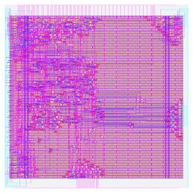</a> <a href="../designs/user_proj_example/NOTES.md">user_proj_example</a> (<a href="../designs/user_proj_example/output/layout.png">full</a>)</td><td align="center"><a href="../designs/vision_all_lit/NOTES.md">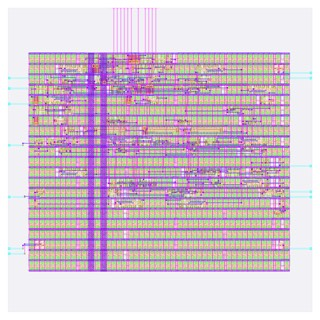</a> <a href="../designs/vision_all_lit/NOTES.md">vision_all_lit</a> (<a href="../designs/vision_all_lit/output/layout.png">full</a>)</td><td align="center"><a href="../designs/vision_block/NOTES.md">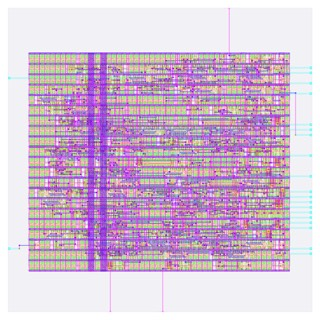</a> <a href="../designs/vision_block/NOTES.md">vision_block</a> (<a href="../designs/vision_block/output/layout.png">full</a>)</td><td align="center"><a href="../designs/text_sentiment/NOTES.md">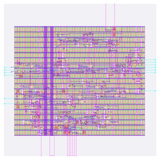</a> <a href="../designs/text_sentiment/NOTES.md">text_sentiment</a> (<a href="../designs/text_sentiment/output/layout.png">full</a>)</td><td align="center"><a href="../designs/tiny_ai_core/NOTES.md">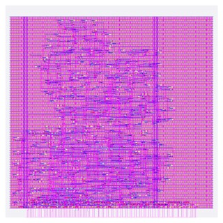</a> <a href="../designs/tiny_ai_core/NOTES.md">tiny_ai_core</a> (<a href="../designs/tiny_ai_core/output/layout.png">full</a>)</td></tr>
<tr><td align="center"> <a href="../designs/user_project_wrapper/NOTES.md">user_project_wrapper</a> (<a href="../designs/user_project_wrapper/output/layout.png">full</a>)</td><td align="center"><a href="../designs/audio_pitch/NOTES.md">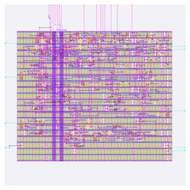</a> <a href="../designs/audio_pitch/NOTES.md">audio_pitch</a> (<a href="../designs/audio_pitch/output/layout.png">full</a>)</td><td align="center"><a href="../designs/audio_onset/NOTES.md">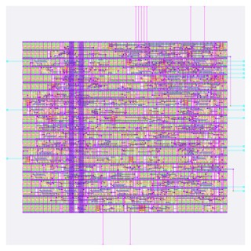</a> <a href="../designs/audio_onset/NOTES.md">audio_onset</a> (<a href="../designs/audio_onset/output/layout.png">full</a>)</td><td align="center"><a href="../designs/image_text_match/NOTES.md">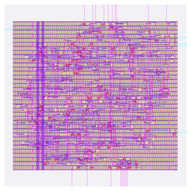</a> <a href="../designs/image_text_match/NOTES.md">image_text_match</a> (<a href="../designs/image_text_match/output/layout.png">full</a>)</td><td align="center"><a href="../designs/prec_bin/NOTES.md">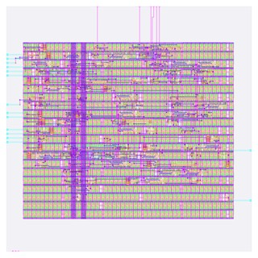</a> <a href="../designs/prec_bin/NOTES.md">prec_bin</a> (<a href="../designs/prec_bin/output/layout.png">full</a>)</td></tr>
<tr><td align="center"><a href="../designs/prec_tern/NOTES.md">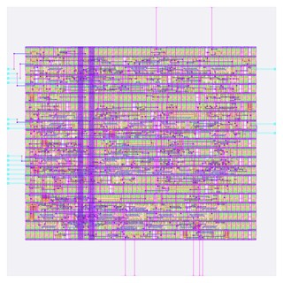</a> <a href="../designs/prec_tern/NOTES.md">prec_tern</a> (<a href="../designs/prec_tern/output/layout.png">full</a>)</td><td align="center"><a href="../designs/prec_int4/NOTES.md">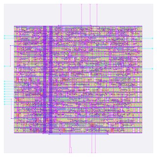</a> <a href="../designs/prec_int4/NOTES.md">prec_int4</a> (<a href="../designs/prec_int4/output/layout.png">full</a>)</td><td align="center"><a href="../designs/prec_int8/NOTES.md">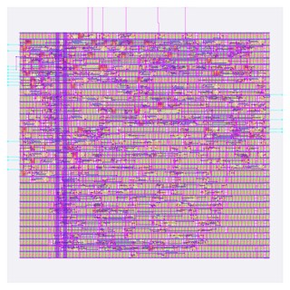</a> <a href="../designs/prec_int8/NOTES.md">prec_int8</a> (<a href="../designs/prec_int8/output/layout.png">full</a>)</td><td align="center"><a href="../designs/prec_fp8/NOTES.md">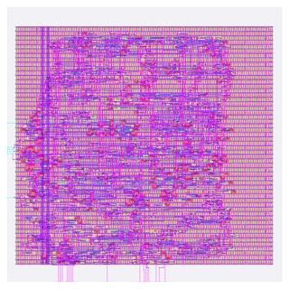</a> <a href="../designs/prec_fp8/NOTES.md">prec_fp8</a> (<a href="../designs/prec_fp8/output/layout.png">full</a>)</td><td align="center"><a href="../designs/prec_fp16/NOTES.md">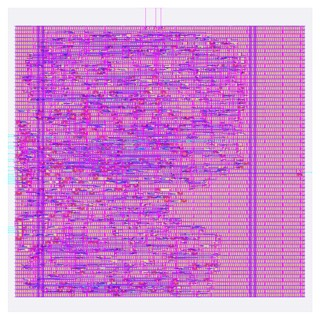</a> <a href="../designs/prec_fp16/NOTES.md">prec_fp16</a> (<a href="../designs/prec_fp16/output/layout.png">full</a>)</td></tr>
<tr><td align="center"><a href="../designs/prec_bf16/NOTES.md">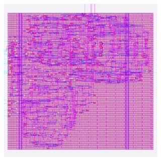</a> <a href="../designs/prec_bf16/NOTES.md">prec_bf16</a> (<a href="../designs/prec_bf16/output/layout.png">full</a>)</td><td align="center"><a href="../designs/soc_image_text_match/NOTES.md">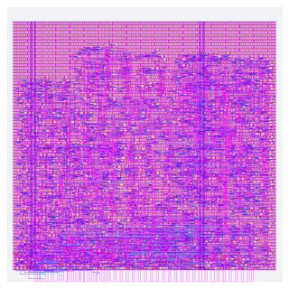</a> <a href="../designs/soc_image_text_match/NOTES.md">soc_image_text_match</a> (<a href="../designs/soc_image_text_match/output/layout.png">full</a>)</td><td align="center"><a href="../designs/user_project_wrapper_soc_itm/NOTES.md">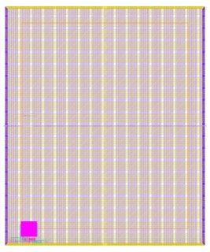</a> <a href="../designs/user_project_wrapper_soc_itm/NOTES.md">user_project_wrapper_soc_itm</a> (<a href="../designs/user_project_wrapper_soc_itm/output/layout.png">full</a>)</td><td align="center"><a href="../designs/kv_attn_n4/NOTES.md">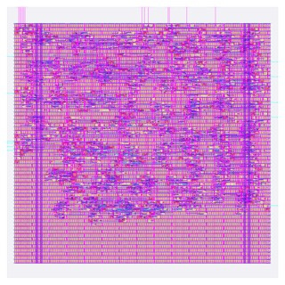</a> <a href="../designs/kv_attn_n4/NOTES.md">kv_attn_n4</a> (<a href="../designs/kv_attn_n4/output/layout.png">full</a>)</td><td align="center"><a href="../designs/kv_attn_n8/NOTES.md">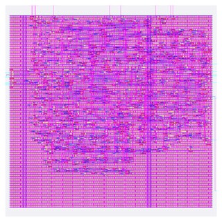</a> <a href="../designs/kv_attn_n8/NOTES.md">kv_attn_n8</a> (<a href="../designs/kv_attn_n8/output/layout.png">full</a>)</td></tr>
<tr><td align="center"><a href="../designs/kv_attn_n16/NOTES.md">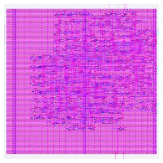</a> <a href="../designs/kv_attn_n16/NOTES.md">kv_attn_n16</a> (<a href="../designs/kv_attn_n16/output/layout.png">full</a>)</td><td align="center"><a href="../designs/kv_attn_n8_int4/NOTES.md">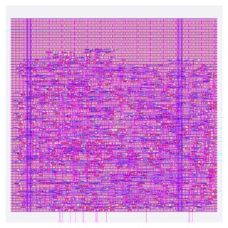</a> <a href="../designs/kv_attn_n8_int4/NOTES.md">kv_attn_n8_int4</a> (<a href="../designs/kv_attn_n8_int4/output/layout.png">full</a>)</td><td align="center"><a href="../designs/kv_attn_n8_ring/NOTES.md">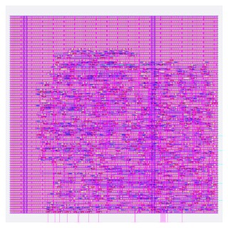</a> <a href="../designs/kv_attn_n8_ring/NOTES.md">kv_attn_n8_ring</a> (<a href="../designs/kv_attn_n8_ring/output/layout.png">full</a>)</td><td align="center"><a href="../designs/soc_kv_attn_n8/NOTES.md">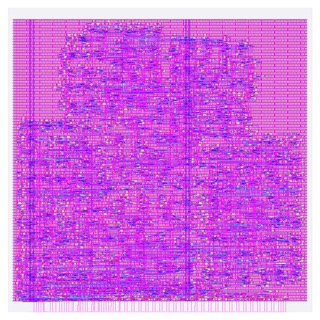</a> <a href="../designs/soc_kv_attn_n8/NOTES.md">soc_kv_attn_n8</a> (<a href="../designs/soc_kv_attn_n8/output/layout.png">full</a>)</td><td align="center"><a href="../designs/user_project_wrapper_soc_kv/NOTES.md">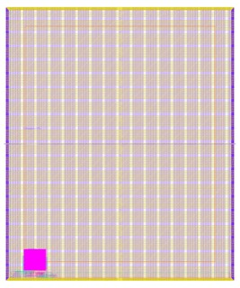</a> <a href="../designs/user_project_wrapper_soc_kv/NOTES.md">user_project_wrapper_soc_kv</a> (<a href="../designs/user_project_wrapper_soc_kv/output/layout.png">full</a>)</td></tr>
</table>

Each picture is the KLayout render of the design's GDSII (`output/layout.png`, thumbnails in `docs/img/thumbs/`); click it for the design page, "full" for the full-size render.
<!-- results:end gallery -->

## Signoff and budget tables

Generated by `make table` (`scripts/docs/tables.py`) from `designs/<name>/output/metrics.json`, `resources.json` and
`config.json`; do not edit between the markers. All runs: PROFILE=tight (2 CPUs / 8 GB container), Colima `osl` VM, arm64.
Slack is the worst over all 9 corners (the corner is named). Max-slew / max-cap / max-fanout violations are reported by
`make check`, not failed on. Flow time and memory are one fresh LibreLane run (`resources.json`).

<!-- results:begin signoff -->
| design | std cells (incl. tap) | flip-flops | die um | worst setup ns (corner) | worst hold ns (corner) | DRC/LVS/XOR/antenna | slew/cap/fanout viol. | flow s | peak GB |
|---|---|---|---|---|---|---|---|---|---|
| [user_proj_example](../designs/user_proj_example/NOTES.md) | 1,421 | 33 | 200 x 200 | +5.99 (max_ss_100C_1v60) | +0.40 (min_ff_n40C_1v95) | 0/0/0/0 | 482/1/3 | 77 | 0.764 |
| [vision_all_lit](../designs/vision_all_lit/NOTES.md) | 169 | 10 | 80 x 80 | +16.07 (max_ss_100C_1v60) | +0.11 (min_ff_n40C_1v95) | 0/0/0/0 | 0/0/0 | 45 | 0.671 |
| [vision_block](../designs/vision_block/NOTES.md) | 297 | 24 | 80 x 80 | +13.53 (max_ss_100C_1v60) | +0.11 (min_ff_n40C_1v95) | 0/0/0/0 | 0/0/0 | 51 | 0.691 |
| [text_sentiment](../designs/text_sentiment/NOTES.md) | 200 | 12 | 80 x 80 | +14.75 (max_ss_100C_1v60) | +0.11 (min_ff_n40C_1v95) | 0/0/0/0 | 0/0/0 | 45 | 0.554 |
| [tiny_ai_core](../designs/tiny_ai_core/NOTES.md) | 1,809 | 109 | 250 x 250 | +1.46 (max_ss_100C_1v60) | +0.11 (min_ff_n40C_1v95) | 0/0/0/0 | 195/0/0 | 99 | 0.642 |
| [user_project_wrapper](../designs/user_project_wrapper/NOTES.md) | 0 | - | 2920 x 3520 | +1.46 (max_ss_100C_1v60) | +0.11 (min_ff_n40C_1v95) | 0/0/0/0 | 0/0/0 | 59 | 0.619 |
| [audio_pitch](../designs/audio_pitch/NOTES.md) | 234 | 21 | 80 x 80 | +13.35 (max_ss_100C_1v60) | +0.10 (min_ff_n40C_1v95) | 0/0/0/0 | 18/0/1 | 47 | 0.624 |
| [audio_onset](../designs/audio_onset/NOTES.md) | 316 | 25 | 80 x 80 | +13.21 (max_ss_100C_1v60) | +0.11 (min_ff_n40C_1v95) | 0/0/0/0 | 14/0/1 | 49 | 0.567 |
| [image_text_match](../designs/image_text_match/NOTES.md) | 551 | 39 | 120 x 120 | +13.42 (max_ss_100C_1v60) | +0.11 (min_ff_n40C_1v95) | 0/0/0/0 | 61/0/6 | 56 | 0.708 |
| [prec_bin](../designs/prec_bin/NOTES.md) | 199 | 19 | 80 x 80 | +16.40 (max_ss_100C_1v60) | +0.11 (min_ff_n40C_1v95) | 0/0/0/0 | 0/0/1 | 45 | 0.650 |
| [prec_tern](../designs/prec_tern/NOTES.md) | 293 | 28 | 80 x 80 | +16.35 (max_ss_100C_1v60) | +0.11 (min_ff_n40C_1v95) | 0/0/0/0 | 9/0/0 | 47 | 0.559 |
| [prec_int4](../designs/prec_int4/NOTES.md) | 377 | 30 | 80 x 80 | +13.46 (max_ss_100C_1v60) | +0.12 (min_ff_n40C_1v95) | 0/0/0/0 | 9/0/0 | 65 | 0.849 |
| [prec_int8](../designs/prec_int8/NOTES.md) | 642 | 35 | 120 x 120 | +11.39 (max_ss_100C_1v60) | +0.11 (min_ff_n40C_1v95) | 0/0/0/0 | 27/0/4 | 59 | 0.598 |
| [prec_fp8](../designs/prec_fp8/NOTES.md) | 1,404 | 49 | 170 x 170 | +0.26 (max_ss_100C_1v60) | +0.11 (min_ff_n40C_1v95) | 0/0/0/0 | 82/0/29 | 101 | 0.821 |
| [prec_fp16](../designs/prec_fp16/NOTES.md) | 1,932 | 52 | 220 x 220 | +0.11 (max_ss_100C_1v60) | +0.11 (min_ff_n40C_1v95) | 0/0/0/0 | 36/0/26 | 104 | 0.707 |
| [prec_bf16](../designs/prec_bf16/NOTES.md) | 1,754 | 51 | 220 x 220 | +0.04 (max_ss_100C_1v60) | +0.11 (min_ff_n40C_1v95) | 0/0/0/0 | 45/0/29 | 93 | 0.832 |
| [soc_image_text_match](../designs/soc_image_text_match/NOTES.md) | 3,201 | 393 | 250 x 250 | +2.96 (max_ss_100C_1v60) | +0.11 (min_ff_n40C_1v95) | 0/0/0/0 | 421/0/0 | 163 | 0.980 |
| [user_project_wrapper_soc_itm](../designs/user_project_wrapper_soc_itm/NOTES.md) | 0 | - | 2920 x 3520 | +2.96 (max_ss_100C_1v60) | +0.11 (min_ff_n40C_1v95) | 0/0/0/0 | 0/0/0 | 60 | 0.875 |
| [kv_attn_n4](../designs/kv_attn_n4/NOTES.md) | 1,679 | 159 | 200 x 200 | +9.35 (max_ss_100C_1v60) | +0.10 (min_ff_n40C_1v95) | 0/0/0/0 | 415/0/29 | 82 | 0.655 |
| [kv_attn_n8](../designs/kv_attn_n8/NOTES.md) | 2,566 | 200 | 260 x 260 | +10.74 (max_ss_100C_1v60) | +0.11 (min_ff_n40C_1v95) | 0/0/0/0 | 551/1/64 | 105 | 0.848 |
| [kv_attn_n16](../designs/kv_attn_n16/NOTES.md) | 4,169 | 277 | 340 x 340 | +8.77 (max_ss_100C_1v60) | +0.10 (min_ff_n40C_1v95) | 0/0/0/0 | 1190/3/147 | 142 | 0.865 |
| [kv_attn_n8_int4](../designs/kv_attn_n8_int4/NOTES.md) | 2,394 | 222 | 220 x 220 | +9.67 (max_ss_100C_1v60) | +0.11 (min_ff_n40C_1v95) | 0/0/0/0 | 554/0/83 | 93 | 0.722 |
| [kv_attn_n8_ring](../designs/kv_attn_n8_ring/NOTES.md) | 2,621 | 198 | 260 x 260 | +10.70 (max_ss_100C_1v60) | +0.11 (min_ff_n40C_1v95) | 0/0/0/0 | 666/0/67 | 103 | 0.725 |
| [soc_kv_attn_n8](../designs/soc_kv_attn_n8/NOTES.md) | 4,514 | 570 | 300 x 300 | +1.44 (max_ss_100C_1v60) | +0.10 (min_ff_n40C_1v95) | 0/0/0/0 | 836/0/0 | 181 | 1.099 |
| [user_project_wrapper_soc_kv](../designs/user_project_wrapper_soc_kv/NOTES.md) | 0 | - | 2920 x 3520 | +1.45 (max_ss_100C_1v60) | +0.10 (min_ff_n40C_1v95) | 0/0/0/0 | 0/0/0 | 76 | 0.954 |
<!-- results:end signoff -->

Area, power and clock:

<!-- results:begin budget -->
| design | clock period ns | std-cell area um2 (excl. fill) | utilisation % | total power uW (nom_tt) | clock buffers | routed wire um |
|---|---|---|---|---|---|---|
| user_proj_example | 25 | 8046 | 24.1 | 387.4 | 7 | 23502 |
| vision_all_lit | 25 | 1085 | 27.7 | 63.7 | 3 | 1954 |
| vision_block | 25 | 2360 | 60.3 | 126.7 | 5 | 4306 |
| text_sentiment | 25 | 1368 | 34.9 | 72.4 | 3 | 2252 |
| tiny_ai_core | 25 | 11579 | 21.5 | 469.8 | 34 | 32323 |
| user_project_wrapper | 25 | 0 | 0.6 | 470.1 | - | 28365 |
| audio_pitch | 25 | 1744 | 44.6 | 112.1 | 8 | 2700 |
| audio_onset | 25 | 2794 | 71.4 | 806.6 | 8 | 4211 |
| image_text_match | 25 | 3856 | 36.3 | 208.4 | 10 | 7832 |
| prec_bin | 25 | 1474 | 37.6 | 105.5 | 6 | 2154 |
| prec_tern | 25 | 2485 | 63.5 | 143.9 | 5 | 3895 |
| prec_int4 | 25 | 3263 | 83.3 | 187.9 | 11 | 6171 |
| prec_int8 | 25 | 4860 | 45.7 | 240.4 | 14 | 8187 |
| prec_fp8 | 25 | 9225 | 39.6 | 1016.8 | 16 | 21106 |
| prec_fp16 | 25 | 11913 | 29.1 | 1928.9 | 13 | 28736 |
| prec_bf16 | 25 | 10170 | 24.9 | 1271.5 | 14 | 23952 |
| soc_image_text_match | 25 | 29686 | 55.1 | 2459.7 | 269 | 61165 |
| user_project_wrapper_soc_itm | 25 | 0 | 0.6 | 2460.0 | - | 28359 |
| kv_attn_n4 | 25 | 12708 | 38.1 | 1009.5 | 50 | 23906 |
| kv_attn_n8 | 25 | 16412 | 27.9 | 1136.1 | 57 | 34465 |
| kv_attn_n16 | 25 | 23406 | 22.4 | 1281.6 | 58 | 55238 |
| kv_attn_n8_int4 | 25 | 16680 | 40.8 | 1003.3 | 42 | 32319 |
| kv_attn_n8_ring | 25 | 16654 | 28.3 | 1146.8 | 55 | 35749 |
| soc_kv_attn_n8 | 25 | 42421 | 52.9 | 3638.7 | 387 | 82391 |
| user_project_wrapper_soc_kv | 25 | 0 | 0.9 | 3639.0 | - | 27069 |
<!-- results:end budget -->

Test coverage (what each testbench drives, on the RTL and again on both gate-level netlists) is in each design's NOTES.md,
section Verification. The Wishbone testbench of `tiny_ai_core` drives all 784 inputs of the three engines (16 + 512 + 256)
through the register interface, plus registers, byte lanes, protocol errors, back-to-back runs and reset, and again through
the wrapper's ports on the wrapper's netlists with the core's routed netlist inside.

How it got here, in short (details in `designs/user_project_wrapper/README.md`):
- The core is hardened with the template's macro constraints (`designs/tiny_ai_core/base_tiny_ai_core.sdc`: Caravel
  clock latencies, Wishbone input delays and transitions), so hold is checked against the real bus timing.
- Its 109 pins all sit on its bottom edge in the wrapper's Wishbone pad order, and it is placed just above those pads
  (`mprj` at 189.06, 87.04 um) with one full power-strap group crossing it: short wires, no congestion, no antenna diodes.
- The core's max-slew violations (count in the table above) are reported, not hidden: most are on nets driven directly by the
  `wbs_adr_i` / `wbs_dat_i` input ports, whose Caravel input transition (0.84-0.92 ns) already exceeds the 0.75 ns
  limit (environment-limited); a 70% repair margin made the repair step run out of memory chasing them, 40% gave 247,
  20% gives the count in the table. At wrapper level, max-slew, max-cap and max-fanout are 0.
- The wrapper's GPIO and logic-analyser outputs are left unconnected (owner decision for this learning build; listed
  with the reason in `scripts/flow/signoff_allowances.json`). Resolved 2026-10-06: every user GPIO 5..37 starts as a
  management-owned input (`GPIO_MODE_MGMT_STD_INPUT_NOPULL`, `designs/user_project_wrapper/rtl/user_defines.v`), so the floating `io_oeb`
  passes the precheck OEB check (14 of 14 PASS, `docs/PRECHECK.md`).

Max-slew reached 0 by tightening design repair, not by loosening the limit: `MAX_FANOUT_CONSTRAINT` 8,
`PL_RESIZER_MAX_SLEW_MARGIN` 40, `GRT_DESIGN_REPAIR_MAX_SLEW_PCT` 40, `RUN_POST_GRT_DESIGN_REPAIR`.

## Engine views

<!-- results:begin views -->
Committed screenshots of the OpenROAD GUI ([how](../examples/openroad_gui/README.md)) and of KLayout driven by a Hermes agent ([how](../examples/hermes_klayout_gui/README.md)).

**Placement density: where the standard cells sit (OpenROAD GUI)**  

**Routing congestion: global-route usage per tile**  

**IR drop on the power grid**  

**Clock tree: root, buffers and sinks**  

**The worst setup path highlighted on the layout**  

**KLayout window driven by the agent: li1 + met1, lower-left corner of kv_attn_n8**  
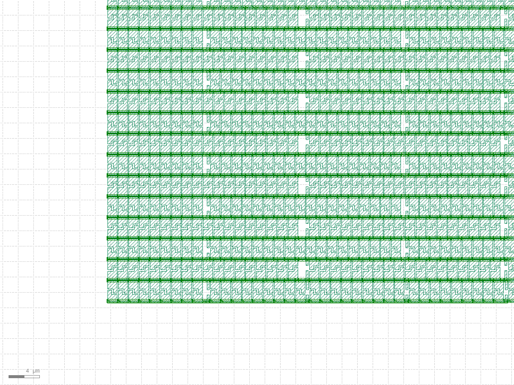

**KLayout window driven by the agent: met4 + met5, macro mprj in the wrapper**  
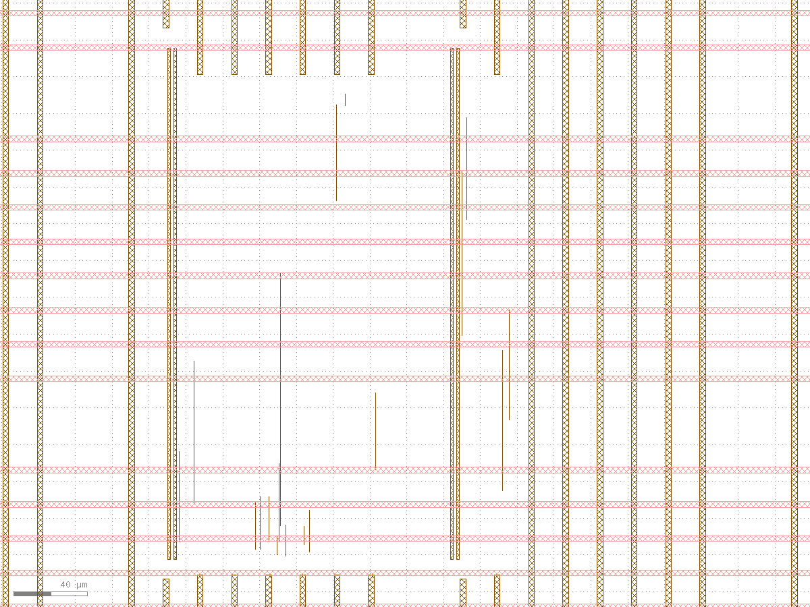

**Offscreen render: li1 + met1, lower-left 50 x 50 um of kv_attn_n8**  
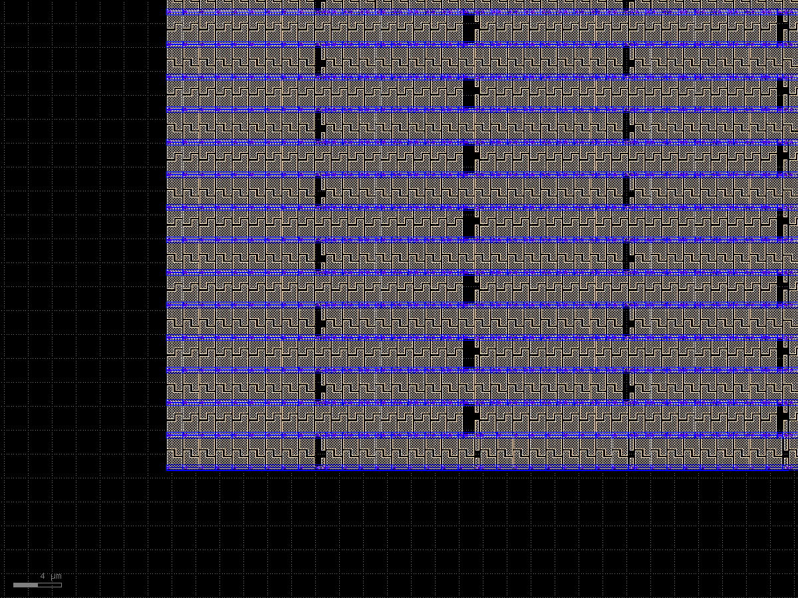

**Offscreen render: met4 + met5 of user_project_wrapper_soc_kv, zoom to mprj**  
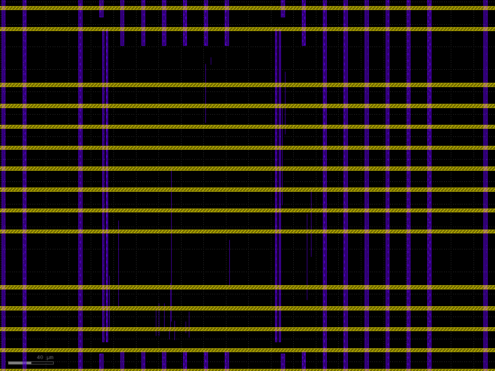

**tiny_ai_core with demo markers (red boxes are demo markers, not errors)**  
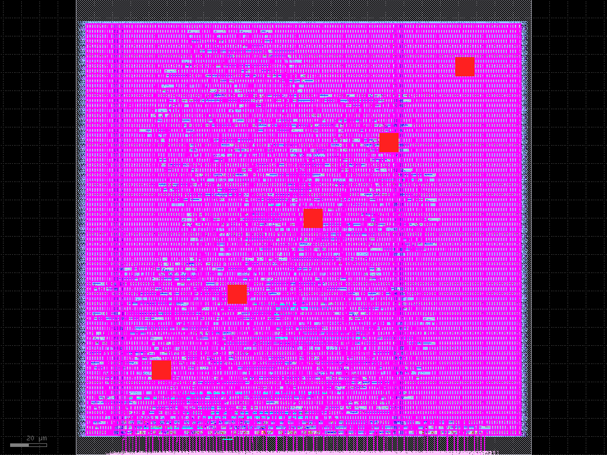
<!-- results:end views -->

## Agent results

Local Hermes agents (model hermes3:8b, temperature 0, seed 42) reading and driving these results. Small samples: read each table
with its source file's own caveats.

<!-- results:begin agents -->
### Tool-use harness (Hermes hermes3:8b, 15 questions)

| configuration | passed | median latency s | tool calls / question | retries | failed |
|---|---|---|---|---|---|
| baseline | 13/15 | 2.67 | 0.87 | 0 | q02, q04 |
| +guardrails | 13/15 | 2.62 | 0.87 | 0 | q02, q04 |
| +grounding | 13/15 | 3.1 | 0.87 | 1 | q02, q04 |
| +pick_extreme | 15/15 | 3.69 | 0.87 | 0 | - |
| all | 15/15 | 3.72 | 0.87 | 0 | - |
| all+plan | 13/15 | 4.19 | 1.13 | 1 | q03, q04 |

Source: `examples/hermes_harness/results_summary.json`; method in [the harness README](../examples/hermes_harness/README.md).

### Retrieval-augmented answers (Hermes hermes3:8b, 1087 chunks of 68 files)

| retrieval | questions | recall@1 | recall@4 | recall@8 | evidence in top 4 |
|---|---|---|---|---|---|
| v1 | 10 | 5/10 | 8/10 | 10/10 | 4/10 |
| v1_heldout | 5 | 3/5 | 5/5 | 5/5 | 5/5 |
| v2 | 10 | 8/10 | 9/10 | 10/10 | 5/10 |
| v2_heldout | 5 | 4/5 | 5/5 | 5/5 | 4/5 |

| configuration | main passed | held-out passed | main hand-checked | main median s |
|---|---|---|---|---|
| tools-only | 4/12 | 2/5 | 2/12 | 3.65 |
| rag | 5/12 | 3/5 | 3/12 | 5.99 |
| rag+v2search | 6/12 | 3/5 | 4/12 | 8.26 |
| rag+router | 8/12 | 4/5 | 7/12 | 9.52 |
| rag+router+guardrail | 8/12 | 4/5 | 7/12 | 9.62 |
| rag+router+guardrail+grounding | 8/12 | 4/5 | 7/12 | 9.65 |

Source: `examples/hermes_rag/results_summary.json`; method in [the RAG README](../examples/hermes_rag/README.md).

### KLayout driven by the agent (live Hermes, 5 scenarios)

| scenario | tool sequence | right sequence | seconds |
|---|---|---|---|
| wrapper user_project_wrapper_soc_kv: only met4+met5, zoom to macro mprj, snapshot | open_design, show_layers, zoom_to, snapshot | yes | 4.7 |
| kv_attn_n8: li1+met1, lower-left 50x50 um, snapshot | open_design, show_layers, zoom_to, snapshot | yes | 4.4 |
| tiny_ai_core: highlight DRC markers | open_design, highlight_drc (0 markers, reported as DRC-clean) | yes | 2.5 |
| tiny_ai_core: demo markers + snapshot | open_design, highlight_drc(demo), snapshot | yes | 3.6 |
| vision_block: full view, measure two points | open_design, zoom_to, measure (72.111 um) | yes | 3.5 |

Source: results table of [the KLayout GUI README](../examples/hermes_klayout_gui/README.md).

### Other models

| model | answers_that_called_a_tool | memory_ollama_ps | note |
|---|---|---|---|
| gemma4:e2b | 13/15 answers used >=1 tool | 250 MB 100% | prompt mode: after the tool result the reply is empty with think=false (and with thinking on it invented a tool result, 1500 cells vs 297); native mode works |
| granite4.1:3b | 14/15 answers used >=1 tool | 2.9 GB 100% | works in prompt mode; harness guardrails made it worse (all 8/15 < baseline 11/15); KLayout 1/5 |
| qwen3.5:4b | 0/15 answers used >=1 tool | 3.4 GB 100% | prompt mode: Ollama 0.35.1 returns HTTP 500 ("qwen3.5 tool call parsing failed") for every reply that contains the Hermes <tool_call> JSON; native mode works |
| hermes3:8b | 13/15 answers used >=1 tool | 6.0 GB 100% | None |

Source: `examples/models_results.json`.
<!-- results:end agents -->

## Design notes and reports

One page per design: architecture (block diagram, every register), data flow cycle by cycle, verification, the GDSII layout
picture, and what each step from RTL to GDSII did, read from that design's own reports.

| Design | Notes | Layout | Reports |
|---|---|---|---|
| user_proj_example | [NOTES.md](../designs/user_proj_example/NOTES.md) | [layout.png](../designs/user_proj_example/output/layout.png) | [output/reports/](../designs/user_proj_example/output/reports/) |
| vision_all_lit | [NOTES.md](../designs/vision_all_lit/NOTES.md) | [layout.png](../designs/vision_all_lit/output/layout.png) | [output/reports/](../designs/vision_all_lit/output/reports/) |
| vision_block | [NOTES.md](../designs/vision_block/NOTES.md) | [layout.png](../designs/vision_block/output/layout.png) | [output/reports/](../designs/vision_block/output/reports/) |
| text_sentiment | [NOTES.md](../designs/text_sentiment/NOTES.md) | [layout.png](../designs/text_sentiment/output/layout.png) | [output/reports/](../designs/text_sentiment/output/reports/) |
| tiny_ai_core | [NOTES.md](../designs/tiny_ai_core/NOTES.md) | [layout.png](../designs/tiny_ai_core/output/layout.png) | [output/reports/](../designs/tiny_ai_core/output/reports/) |
| user_project_wrapper | [NOTES.md](../designs/user_project_wrapper/NOTES.md) | [layout.png](../designs/user_project_wrapper/output/layout.png) | [output/reports/](../designs/user_project_wrapper/output/reports/) |
| audio_pitch | [NOTES.md](../designs/audio_pitch/NOTES.md) | [layout.png](../designs/audio_pitch/output/layout.png) | [output/reports/](../designs/audio_pitch/output/reports/) |
| audio_onset | [NOTES.md](../designs/audio_onset/NOTES.md) | [layout.png](../designs/audio_onset/output/layout.png) | [output/reports/](../designs/audio_onset/output/reports/) |
| image_text_match | [NOTES.md](../designs/image_text_match/NOTES.md) | [layout.png](../designs/image_text_match/output/layout.png) | [output/reports/](../designs/image_text_match/output/reports/) |
| prec_bin | [NOTES.md](../designs/prec_bin/NOTES.md) | [layout.png](../designs/prec_bin/output/layout.png) | [output/reports/](../designs/prec_bin/output/reports/) |
| prec_tern | [NOTES.md](../designs/prec_tern/NOTES.md) | [layout.png](../designs/prec_tern/output/layout.png) | [output/reports/](../designs/prec_tern/output/reports/) |
| prec_int4 | [NOTES.md](../designs/prec_int4/NOTES.md) | [layout.png](../designs/prec_int4/output/layout.png) | [output/reports/](../designs/prec_int4/output/reports/) |
| prec_int8 | [NOTES.md](../designs/prec_int8/NOTES.md) | [layout.png](../designs/prec_int8/output/layout.png) | [output/reports/](../designs/prec_int8/output/reports/) |
| prec_fp8 | [NOTES.md](../designs/prec_fp8/NOTES.md) | [layout.png](../designs/prec_fp8/output/layout.png) | [output/reports/](../designs/prec_fp8/output/reports/) |
| prec_fp16 | [NOTES.md](../designs/prec_fp16/NOTES.md) | [layout.png](../designs/prec_fp16/output/layout.png) | [output/reports/](../designs/prec_fp16/output/reports/) |
| prec_bf16 | [NOTES.md](../designs/prec_bf16/NOTES.md) | [layout.png](../designs/prec_bf16/output/layout.png) | [output/reports/](../designs/prec_bf16/output/reports/) |

`make collect DESIGN=<name>` refreshes `output/`: `metrics.json`, `resources.json`, `flow.log`, LEF, `layout.png`
(KLayout render of the GDS) and `reports/`. The reports are synthesis (`synth_stat.rpt`, `synth_checks.rpt`), floorplan, placement (global, detailed),
clock tree (`cts.rpt`), routing (global, detailed), cell usage, timing (summary and the worst paths at the slow and
fast corners), DRC (Magic, KLayout), LVS (Netgen), IR drop and manufacturability. Home paths are written as `~`. The
GDS itself stays out of Git (`build/results/<name>/<name>.gds`).

## What each flow stage checks

| Stage | What passes means |
|---|---|
| simulate | the self-checking testbench on the RTL: the counter's checks; every input of each engine plus protocol cases, with random stalls |
| gds | LibreLane finished (`Flow complete.`); an unchanged, complete earlier run is reused |
| check | Magic/KLayout/route DRC, LVS, XOR, antenna all 0; setup and hold slack non-negative at every corner; zero synthesis check errors; surviving flip-flops = RTL registers |
| gl / gl-final | the same testbench passes on the synthesised and on the routed netlist |
| collect | GDS, LEF, netlists, reports, `layout.png` in `build/results/<design>/`; metrics, resources, flow.log, LEF in `designs/<design>/output/` |
