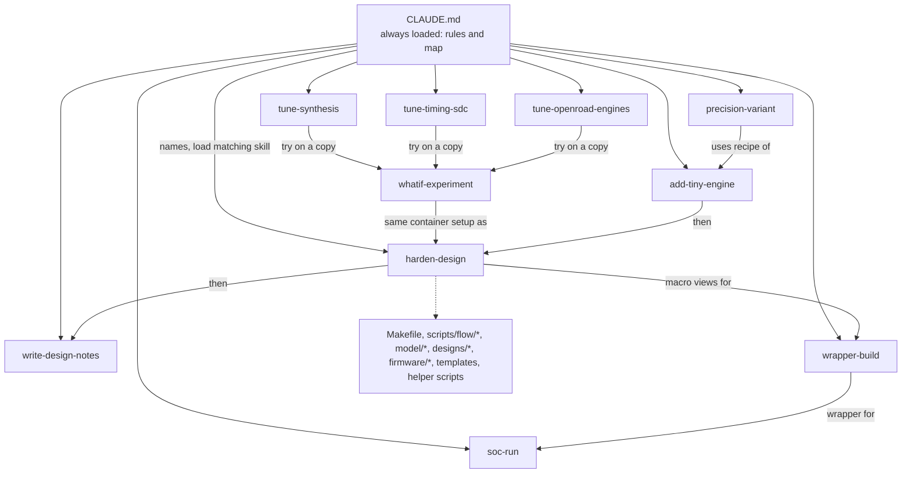
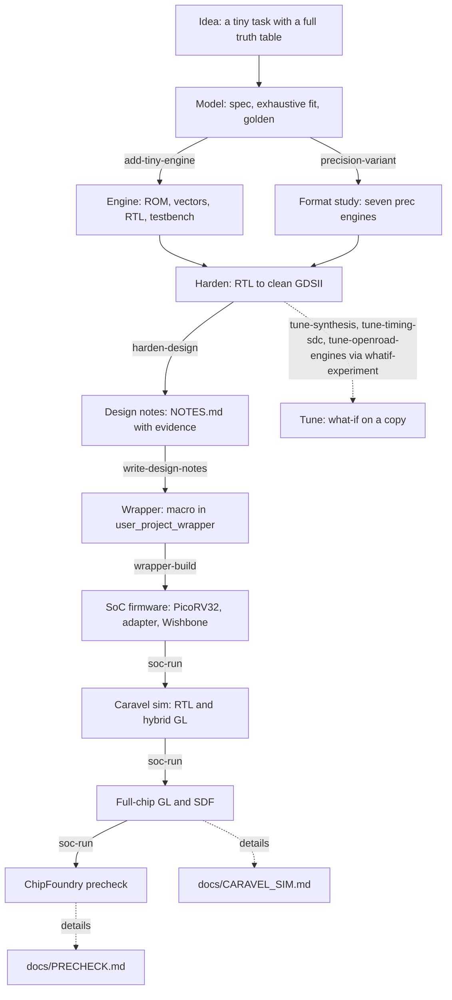

# Skills for this repository: what they encode and why

This page is for a reader who can program but is new to chip design and to Claude Code "skills". It explains
what a skill is, then walks through the ten project skills in `.claude/skills/` (plus `chip-demos`, the Hermes demos). For each one it teaches the
engineering ideas behind the steps (so the checklist makes sense), summarises the workflow, and lists the
non-obvious lessons with the evidence numbers from this repository. Every number names the file it comes from.
The skills themselves are the authority on the steps; this page explains the reasons.

---

## 1. Fundamentals of skills

### 1.1 What a project skill is

A Claude Code **project skill** is a folder inside the repository:

```text
.claude/skills/<name>/
    SKILL.md        required: YAML frontmatter (name, description) + the workflow in Markdown
    reference.md    optional: long tables, evidence, failure history
    <script>        optional: helper scripts (classify_slew.py, check_notes.py, new_wrapper.sh)
    templates/      optional: file skeletons to copy (add-tiny-engine/templates/)
```

The top of `SKILL.md` is frontmatter with exactly two fields that matter:

```yaml
---
name: harden-design
description: Take a design in this repo from RTL to clean sky130 GDSII ... Use when hardening a new design, ...
---
```

- `name` is the identifier (and the slash command, section 1.3).
- `description` is the **trigger**. Claude Code keeps only the name and description of every skill in its
  working context; the description is what the model reads to decide "does the task in front of me match this
  skill?". A good description therefore says what the skill does AND the situations that should load it
  ("Use when ..."). Every description in this repo ends with a "Use when" list of concrete phrases.
- The body of `SKILL.md` is loaded only after that decision.

### 1.2 Progressive disclosure

Skills are loaded in layers so the context stays small:

1. Always visible: the name and description (one or two sentences per skill).
2. On a match: the whole `SKILL.md` (50 to 115 lines each in this repo).
3. Only when a step needs it: `reference.md`, a helper script, or a template. `SKILL.md` links to them
   (for example `harden-design/SKILL.md` says "Long tables are in `reference.md`"), so the failure table with
   its evidence is read only when something has actually failed.

### 1.3 How CLAUDE.md differs from a skill

| | `CLAUDE.md` | skill (`SKILL.md`) |
|---|---|---|
| Loaded | always, at the start of every session | on demand, when the description matches or you invoke it |
| Contains | rules and a map: what the repo is, the layout, first commands, HARD RULES, conventions | a workflow for one kind of task: ordered steps, commands, failure tables |
| Size pressure | high (it costs context every time) | low (paid only when used) |
| Example here | "Never loosen `MAX_TRANSITION_CONSTRAINT` or `CLOCK_PERIOD` (25 ns)" | the 12-row failure table of `harden-design` |

Rule of thumb used in this repo: if every task must obey it, it is in `CLAUDE.md` (the HARD RULES, the
layout). If only one kind of task needs it, it is in a skill. `CLAUDE.md` ends its workflow list with "Load the
matching skill before starting that kind of task", which is the bridge between the two.

### 1.4 How a user invokes a skill

Ask for the task in your own words (Claude matches it to a description) or type `/<name>`, for example
`/harden-design`. Both load the same file.

### 1.5 How to edit or add a skill

Skills are ordinary text in the repository: edit them like code. Keep `SKILL.md` short and move tables and evidence to
`reference.md`. To add one, create `.claude/skills/<new-name>/SKILL.md` with the two frontmatter fields and write the
description last: would a plausible request contain the words in your "Use when" list? Put facts next to their
evidence (a file path), because skills go stale (`precision-variant/reference.md` has a "Stale text to verify"
section). Global rules belong in `CLAUDE.md`. Scripts must run from the repo root and say so in their header.

### 1.6 Why this repository has skills

This project was built across many sessions and several agents working in the same tree (`CLAUDE.md`: "Other
agents may work in the same tree"). Without skills, each lesson lives only in one conversation: the slew margin
that ran out of memory, the vector-count limit, the comment line that breaks pin placement. A skill turns
a lesson into a checklist the next session loads automatically, which keeps different agents consistent and
stops the same failure from being rediscovered. The failure tables are the clearest example: each row is a
mistake that already cost a run (`harden-design/reference.md`).

### 1.7 How the pieces relate



---

## 2. The ten skills (plus chip-demos)

### 2.1 harden-design

**Purpose and triggers.** Description (from `.claude/skills/harden-design/SKILL.md`): "Take a design in this
repo from RTL to clean sky130 GDSII with `make flow-all DESIGN=<d>`, and diagnose a failing stage (out of
memory, GPL-0301, GRT-0116 congestion, hold/setup/slew violations, "logic lost", lint PINNOTFOUND, timeouts).
Use when hardening a new or changed design, re-running a flow, reading metrics.json / checks.rpt, or fixing a
failed make gds / check / gl stage."

**Fundamentals you need first.** "Hardening" means turning a hardware description (RTL, Verilog text) into
the geometric drawing a factory can print (GDSII). The open-source tool LibreLane runs the standard steps; the
skill's failure table is indexed by which step failed, so you need the vocabulary:

- **Synthesis** (Yosys): maps RTL onto the cells of a standard-cell library, here `sky130_fd_sc_hd`
  (`CLAUDE.md` Conventions). A cell is a pre-drawn gate or flip-flop. Synthesis also deletes logic that cannot
  affect an output, which matters below ("logic lost").
- **Floorplan**: choose the die size and the pin positions. `DIE_AREA` is set by hand in `config.json`
  (`FP_SIZING: absolute`).
- **Placement**: give every cell an x,y position. Utilisation is cell area divided by core area; above 100 % it
  cannot succeed (error `GPL-0301`).
- **CTS (clock tree synthesis)**: build a tree of buffers so the clock edge reaches all flip-flops at nearly the
  same time. The difference between arrival times is skew.
- **Routing**: draw the wires on metal layers; global routing plans corridors, detailed routing draws them. Too
  many wires for a corridor is congestion (`GRT-0116`).
- **STA (static timing analysis)** at several **corners**. A corner is a combination of process speed,
  temperature and supply voltage; this flow checks nine: `{min,nom,max}_{tt_025C_1v80, ss_100C_1v60,
  ff_n40C_1v95}` (`harden-design/SKILL.md` section 3). Slow (`ss`, 100 C, 1.60 V) is the worst for **setup**;
  fast (`ff`, -40 C, 1.95 V) is the worst for **hold**.
- **Setup slack**: how much earlier than the next clock edge the data arrives (positive passes). With a 25 ns
  clock, a path of 11.7 ns leaves 13 ns of slack. **Hold slack**: whether new data arrives too early and
  overwrites what the flip-flop should still be holding; fixed by adding delay buffers, not by changing the clock.
- **Slew** is the rise or fall time of a signal edge; the limit here is 0.75 ns (`MAX_TRANSITION_CONSTRAINT`,
  `harden-design/reference.md` item 1). Slow edges are slow and power-hungry.
- **DRC** (design rule check) asks "does the drawing obey the factory's geometry rules"; **LVS** (layout versus
  schematic) asks "does the drawn circuit equal the synthesised netlist"; **XOR** compares the produced GDS
  with the reference layout geometrically; **antenna** rules limit the charge a long wire collects during
  manufacturing before a protecting diode is connected. Each is a separate gate because each catches a
  different class of mistake, and a drawing can pass three and fail one.
**Workflow in short** (`SKILL.md` sections 0 to 6): preconditions (`make doctor`, `make test`, no other flow running,
nearest sibling `config.json`, die for about 40 % utilisation); `make flow-all DESIGN=<d>` runs
`simulate -> gds -> check -> gl_synth -> gl_final -> collect` and stops at the first failure; read
`designs/<d>/output/metrics.json` and `build/flow/stage_check.log` (`scripts/flow/check_signoff.py`); on failure find the
signature in the failure table and change ONE thing; finish with `make table`, notes, `make test`, then a commit.

The helper script `classify_slew.py <design>` splits slew violations into **port-driven** (the net comes
straight from an input port, so only the environment can fix it) and **internal** (driven by a cell, so repair
could in principle fix it).

**Insights and intuitions.**

- *Never loosen limits to pass.* Relaxing `CLOCK_PERIOD` or `MAX_TRANSITION_CONSTRAINT` would buy a clean number; `tests/run_tests.sh` forbids it (`SPEC.md` Intuitions). The logic-lost check requires surviving flip-flops >= RTL registers minus an allowance.
- *More repair margin made it worse.* Slew-repair margin 70 % ran out of memory on `tiny_ai_core`, 40 % left 247
  violations, 20 % left 195 (`designs/tiny_ai_core/config.json` `//SLEW`). The repair step chases nets it cannot
  fix, so the last 20 % margin is both cheaper and better. Rule: slew margin 20 (`harden-design/SKILL.md` table).
- *Some slew violations are the environment's.* Caravel drives `wbs_dat_i` with a 0.84 ns transition and
  `wbs_adr_i` with 0.92 ns against the 0.75 ns limit (`harden-design/reference.md` item 1). On the
  `tiny_ai_core` run at `max_ss_100C_1v60`, `classify_slew.py` found 80 port-driven and 51 internal of 131
  listed cell pins; adding the 64 input-port pins themselves gives 144 environment-limited + 51 internal = 195
  (`designs/tiny_ai_core/NOTES.md`, `harden-design/SKILL.md` section 3). No amount of resizing fixes the 144.
- *Placement above 100 % means the die is too small.* `image_text_match` at 80 x 80 um was at 82 %, and repair
  ran out of memory; 120 um gave about 36 %. `prec_int8` was at 115 % and global placement refused
  (`harden-design/reference.md` item 2; `designs/image_text_match/config.json` `//DIE_AREA`). Target about 40 %
  and compare cell area, not die area.
- *Pins facing the pads fix congestion.* A first macro with 361 pins on its bottom edge, 16 um above the
  wrapper's own pin row, failed global routing. A 109-pin macro with the pins ordered like the wrapper's pads,
  placed at (189.06, 87.04) um, built in 53 s using 0.62 GB (`harden-design/reference.md` item 5;
  `designs/user_project_wrapper/README.md`). The same change roughly halved the cell count: 3521 standard cells
  for the earlier 400 x 400 um macro, 1809 for the 250 um one (`wrapper-build/reference.md` failure history item 2).
- *Floats need extra effort at 40 MHz*: see section 2.3.
- *Run-reuse watches whole directories, so adding a file can make a run stale.* `find_reusable_run.py` treats a run as
  reusable only if nothing in the directory of any input file changed after the run started. Adding
  `shared/rtl/kv_attn_core.v` to `shared/rtl/` made `soc_image_text_match` and `user_project_wrapper_soc_itm`
  stale; both were re-run on 2026-10-06 with identical metrics (163 s / 0.98 GB and 60 s / 0.875 GB,
  `output/resources.json`). Markdown edits never make a run stale (`harden-design/SKILL.md` section 2).
- *Where the time goes.* The biggest flow is the macro `soc_kv_attn_n8` at 181 s and 1.099 GB, then
  `soc_image_text_match` 163 s, `kv_attn_n16` 142 s (`output/resources.json` of each). All 25 designs stay under
  1.1 GB peak, far from the 8 GB cap; the 600 s timeout is not close.

---

### 2.2 add-tiny-engine

(Scope today: 13 classifier-style stream engines built with this recipe plus the five `kv_attn_*` KV-cache attention
engines, which show a non-classifier shape: a command/response protocol, a shared core `shared/rtl/kv_attn_core.v`, hand-picked
parameters from `model/kv_attention/` and their own testbench body `shared/tb/kv_attn_tb.vh`. `make adapter-test` covers 14
engines: the 13 plus `kv_attn_n8`.)

**Purpose and triggers.** Description (from `.claude/skills/add-tiny-engine/SKILL.md`): "Add a new tiny AI
inference engine (one small neural-network block with the 24-pin valid/ready stream interface) to the
open-ai-chip repo, end to end ... Use when asked to "add an engine/design/model", "make a new
vision/text/audio/prec engine", or to copy the vision_block / text_sentiment / image_text_match recipe."

**Fundamentals you need first.**

- **A tiny neural network as a truth table.** For a small enough task every possible input can be listed.
  `vision_block` takes a 3x3 binary image, so there are 2^9 = 512 inputs; the three engines together have
  16 + 512 + 256 = 784 inputs (`SPEC.md` Intuitions, "Verification lessons"). A labelled list of every
  input with its correct answer is a **truth table**, and it is the ground truth.
- **Exhaustive fitting.** Instead of gradient training, `train.py` searches the whole (small) parameter space
  (96, 96 and 4096 settings, `add-tiny-engine/reference.md`) against the full truth table and keeps the first
  exact fit. Zero mismatches on a complete table means correct everywhere, with no test set to worry about.
  The search order is fixed and uses no randomness, so it is reproducible.
- **Golden model.** `golden.py` is a Python reference that computes the engine's output using only the learned
  `weights.json`. "Bit-exact" means the RTL must produce the same bytes and the same latency, not "close".
- **Generated ROM and vectors.** `gen_rom.py` writes a Verilog ROM (the weights as constants) and
  `tb/vectors.hex` (inputs plus expected outputs). The ROM is constants, not memory: synthesis folds them into
  logic. Because these files are generated, they are never edited by hand: change the model, regenerate, and
  `make check-generated` proves regeneration reproduces every file (`CLAUDE.md` HARD RULES).
- **Valid/ready streams.** Data moves in beats. A beat transfers on a clock edge when the sender's `valid` and
  the receiver's `ready` are both high. The engine has 24 pins: `clk`, `rst`, `s_valid`, `s_data[7:0]`,
  `s_last`, `s_ready`, `m_valid`, `m_data[7:0]`, `m_last`, `m_ready` (`add-tiny-engine/SKILL.md`, "Stream
  protocol"). Rules include "while `m_valid` is high and `m_ready` low, the outputs must hold" and "`s_ready`
  is low from the beat that carried `s_last` until the result was taken".
- **Latency** is counted in clock edges from the edge that accepts the last input beat to the edge that raises
  `m_valid`, both counted; it is part of the contract in `spec.json`.
- **Self-checking testbench.** The shared `shared/tb/stream_tb.vh` drives random input gaps and random
  `m_ready` stalls, checks every beat against `vectors.hex` with `!==` (an unknown X never passes), and runs
  unchanged on RTL and both gate-level netlists.

**Workflow in short** (checklist in `SKILL.md`): spec.json contract; `train.py` exhaustive fit; `golden.py --check`
printing `<n> cases, 0 mismatches`; `gen_rom.py` (continuous `assign` only, write-if-changed, source hash header, at
most 1023 cases); RTL in IO / MEMORY / COMPUTE / CONTROL sections; a five-line testbench including `stream_tb.vh`;
`config.json` from a neighbour; README and later NOTES; wire into `Makefile`, `tests/run_tests.sh`,
`scripts/check_generated.sh`, `scripts/docs/tables.py`, `tests/adapter/run.sh`; then the gates in order (model check,
`make simulate`, negative test, `make adapter-test`, `make flow-all`, `make test`, `make check-generated`).

**Why the rules exist.**

- *Never hand-edit generated files.* If the ROM and the model disagree, the model is the truth; editing the ROM
  silently creates a design that no regeneration can reproduce (`CLAUDE.md`).
- *Continuous `assign` in the ROM.* The first ROM was an `always @(*)` block whose inputs never changed, so the
  simulator never evaluated it and it kept its initial value (`SPEC.md` Intuitions, "Verification lessons").
  `gen_rom.py` now emits continuous assignments only and says why in a comment.
- *Write-if-changed.* The flow's stale-run check compares timestamps; rewriting an identical ROM would make
  every run look stale (`add-tiny-engine/SKILL.md` step 4).
- *Case limit 1023.* `stream_tb.vh` has `MAXREC = 1024`. `image_text_match` has 2,079 cases, so it carries its
  own `stream_tb_big.vh` with `MAXREC = 4096` (`add-tiny-engine/reference.md`).
- *Negative tests.* Corrupt one expected value and break one RTL line in a temporary copy; the testbench must
  fail. A check that has never been seen failing proves nothing (`tests/run_tests.sh` negative section, which
  asserts every mutation really applied).

**Insights and intuitions.**

- *Not every engine is a classifier.* `kv_attn_n8` holds a KV cache in 512 register bits and serves PREFILL (1 cycle per
  token) and DECODE (n + 3 cycles for n cached entries, `model/kv_attention/spec.md`). Its testbench replays 1521 records
  with a record layout of its own, so the recipe's wiring (Makefile `MODELS`, `check_generated.sh`, adapter format `KV`) is
  reused but the model step is `gen.py`, not `train.py`.
- *The weights are the knowledge.* Training found weights 1,1,1,1 with threshold 4 for the vision example and
  PAD 0, GOOD +1, FINE 0, BAD -1 for text (`SPEC.md` Intuitions; `model/tiny_ai/weights.json`). Different
  labels through the same RTL give a different rule (`docs/WHY_AI.md` section 4).
- *Structure decides what can be learned.* One neuron cannot learn an XOR-like rule such as "exactly two
  pixels lit"; a sum of word scores ignores word order (`SPEC.md` Intuitions; `docs/WHY_AI.md` section 5). The
  exhaustive fitter reports no solution, which is the proof.
- *Zero weights are pruned by synthesis.* `image_text_match` declares 41 register bits, one-hot recoding adds 2
  and two never-read pooled counters are removed, so 41 + 2 - 4 = 39 flip-flops survive
  (`designs/image_text_match/NOTES.md`; `stage_check.log` reads "registers: RTL 39 (allowance 0), surviving 39").
  The trained weights pruned the hardware.

---

### 2.3 precision-variant

**Purpose and triggers.** Description (from `.claude/skills/precision-variant/SKILL.md`): "Add or change a
number-format variant of the precision study (the seven prec_<fmt> engines bin, tern, int4, int8, fp8, fp16,
bf16 - one neuron, same 24 pins, only the arithmetic differs) ... Use when asked to add a format (fp4, int2,
e5m2, tf32 ...), change a format's rounding/accumulator/latency, re-quantise the weights, fix a float timing
failure at 40 MHz, resize a prec_* die, regenerate the prec ROMs and vectors, or extend
docs/PRECISION_STUDY.md with a new row."

**Fundamentals you need first.**

- **Number formats.** A neuron computes `sum = bias + w0*x0 + ... + w8*x8`. The weights may be stored as 1 bit
  (+1/-1, `bin`), ternary {-1, 0, +1} (`tern`), 4- or 8-bit signed integers (`int4`, `int8`), or floating point
  (`fp8` E4M3, `fp16` IEEE binary16, `bf16` bfloat16) (`docs/PRECISION_STUDY.md` section 1). A float stores a
  sign, an exponent (range) and a mantissa (precision); `bf16` spends 8 bits on exponent and fewer on mantissa.
- **Quantisation** is converting weights trained in fp32 to a narrower format after training. Integer formats
  use a scale (`Q` 7 or 127) and clamp; the ternary rule is TWN with delta = 0.7 mean|w|
  (`precision-variant/reference.md`, spec section 3).
- **Accumulator.** The running sum. It must be wide enough that the sum cannot overflow: 4 bits for `bin` up to
  17 bits for `int8`. The skill requires a proof that no overflow, NaN or Inf can occur, so the RTL needs no
  such logic, and the proof's precondition is asserted in `gen.py`.
- **Rounding to nearest even (RNE).** When a result does not fit, round to the closest representable value;
  a tie goes to the value whose last bit is 0. It is unbiased, so errors do not drift in one direction. This
  repo also flushes tiny values to zero (FTZ) and treats exact zero as +0, never -0.
- **MAC.** Multiply-accumulate: `acc = acc + w * x`. Each engine has one MAC reused over 9 pixel beats.
- **Why a float accumulate loop limits clock speed.** The next addition needs the previous sum. A float add
  must align exponents, add, count leading zeros, normalise and round, in sequence, inside one clock period;
  those steps cannot be pipelined without slowing the loop. Only the multiply can be cut off from the add.
- **Pipelining** inserts a register in the middle of a long combinational path so each half fits a clock;
  it costs latency (3 clocks instead of 2 for the floats) and flip-flops.

**Workflow in short.** Spec first in `model/precision_hw/spec.md`, then `golden.py`, `gen.py` (at most 1023 cases),
RTL from the nearest sibling, a README line `Latency <n>`, wire-in as in add-tiny-engine, gates, then `report.py`.
The golden model wins if spec and golden disagree (`spec.md` header). All seven engines share pins, protocol, clock
and flow, so any difference is caused by the format alone (`docs/PRECISION_STUDY.md` section 1); never raise
`CLOCK_PERIOD` for one failing float.

**Insights and intuitions.**

- *Little precision is needed here.* On 2000 held-out images fp32 scores 94.05 %, ternary 94.15 %, int4
  94.25 %, int8 94.05 %, fp8 94.15 %, fp16 94.05 %, bf16 94.00 %; only 1-bit `bin` drops to 88.95 %
  (`docs/PRECISION_STUDY.md` section 2). The honest limit is a 0.53-point standard error, so rank only by
  "same decision as fp32" (`precision-variant/SKILL.md`).
- *Ternary and int4 reach fp32 accuracy at 1.7x and 2.2x binary's area* (std-cell area relative to `bin`:
  1.0 / 1.7 / 2.2 / 3.3 / 6.3 / 8.1 / 6.9 for bin, tern, int4, int8, fp8, fp16, bf16;
  `docs/PRECISION_STUDY.md` section 2). Floats cost 6 to 8 times as much for no accuracy gain on this task.
- *Floats need two pipeline stages at 40 MHz, and then tool repair.* Single-stage setup at `max_ss_100C_1v60`:
  fp8 -2.144 ns, fp16 -6.667 ns. Two-stage (product registered, latency 3): -1.141, -1.318, -0.927 (fp8, fp16,
  bf16). After tool timing repair only (`RUN_POST_GRT_RESIZER_TIMING`, setup slack margin 0.5, buffering and
  gate cloning, no RTL change): +0.259, +0.111, +0.044 ns (`precision-variant/reference.md`, which cites
  `docs/PRECISION_STUDY.md` section 6 and `model/precision_hw/spec.md` section 6). Integer MACs close in one
  stage: int8 +11.387 ns. The float margins are thin; recheck on another machine (`designs/prec_fp16/NOTES.md`).
- *Provably dead bits are caught by signoff.* Every bf16 weight has biased exponent 0x74..0x7D, so exponent
  bit 6 always equals NOT bit 7; synthesis deleted that flop and signoff failed "logic lost" (52 RTL
  registers, 51 cells). The honest fix was to make the RTL 15 bits and rebuild the bit as `~p_bits_r[13]`
  (`precision-variant/reference.md`; `designs/prec_bf16/NOTES.md`). Regenerating the ROM with larger exponents
  would break that coupling.

---

### 2.4 write-design-notes

**Purpose and triggers.** Description (from `.claude/skills/write-design-notes/SKILL.md`): "Write or refresh
designs/<d>/NOTES.md the way this repo does (required headings, per-section sources, every number cited to a
file, valid mermaid, flip-flop and slew reconciliation, "Intuitions and insights"). Use when a design has just
been hardened and output/metrics.json exists, when the "== notes" check in tests/run_tests.sh fails, or when a
re-run changed the numbers in an existing NOTES.md."

**Fundamentals you need first.**

- **Evidence-based documentation.** A number in a document is a claim. The rule is that the same sentence
  names the file it was read from (`synth_stat.rpt`, a `metrics.json` key, `config.json`); a number you
  computed yourself says "my sum" or "my division". Unknown values are written as "not reported" or
  "not verified", never estimated.
- **The evidence files.** After a flow, `designs/<d>/output/` holds `metrics.json` (hundreds of keys),
  `resources.json` (wall time, memory), `layout.png`, `flow.log` and `reports/` (`synth_stat.rpt`,
  `timing_summary.rpt`, `drc_magic.rpt`, `lvs_netgen.rpt`, ...). The skill has a table mapping each NOTES section
  to its source files.
- **Reconciling counts.** The declared register bits, the synthesised flip-flop count and the signoff count can
  differ for explainable reasons. The reader must be able to follow the arithmetic.
- **One-hot recoding.** Synthesis may re-encode a small state machine with one flip-flop per state instead of
  ceil(log2 n) bits; this is why surviving flops can exceed RTL bits (Yosys log: "mapping auto encoding to
  `one-hot`").
- **Mermaid.** Diagrams in text. They break easily, so labels containing special characters are quoted, ids
  are unique, and `check_notes.py` lints this.

**Workflow in short.** Confirm `output/metrics.json` exists (this skill never runs flows), read an example
(`designs/prec_int8/NOTES.md`), fill sections from the skill's source table, run `check_notes.py`, then
`tests/run_tests.sh` "== notes". Required headings: Architecture, Data flow, Verification, Layout, Synthesis, Floorplan,
Placement, Clock tree, Routing, Timing, DRC, LVS, Power, Antenna, Run time, Reproduce, Intuitions and insights. Stale
numbers are the usual defect (`SKILL.md` rule 3); notes are Markdown, so editing them never makes a flow run stale.

**Insights and intuitions.**

- *Reconcile before you explain.* `soc_image_text_match` totals 144 + 128 + 26 + 23 + 16 + 9 + 8 + 39 = 393
  flip-flops, equal to the metric; the notes admit that "I could not attribute the last bits exactly by name"
  and that the "about 420" in the README was an estimate and 393 is measured
  (`designs/soc_image_text_match/NOTES.md`).
- *Classify slew honestly.* In that design 142 of 421 violating pins (34 %) are environment-limited and appear at
  every corner; 279 (66 %) appear only at the slow corner on internal nets (A number without a class invites the wrong fix.

---

### 2.5 wrapper-build

**Purpose and triggers.** Description (from `.claude/skills/wrapper-build/SKILL.md`): "Put a 109-pin Wishbone
macro into Caravel's fixed user_project_wrapper in this repo (new designs/user_project_wrapper_<tag>/ folder,
macro requirements, views export, MACROS config, placement, signoff allowance, gate-level and RTL tests, known
failure modes). Use when you add a new macro to a Caravel wrapper, copy designs/user_project_wrapper_soc_itm
as a template, debug a wrapper flow failure (lint, GRT congestion, hold, LVS from unpowered diodes, OOM,
undriven outputs), or make the tests/run_tests.sh "== wrapper" checks pass."

**Fundamentals you need first.**

- **Caravel.** ChipFoundry's fixed harness chip: a management core, pads, and a rectangle called
  `user_project_wrapper` where your design lives. The wrapper's pin positions and geometry are fixed
  (`fixed_dont_change/user_project_wrapper.def`: die 2920 x 3520 um) and never edited.
- **Macro.** A block hardened on its own (here `tiny_ai_core`, `soc_image_text_match` or `soc_kv_attn_n8`, 109 signal pins:
  Wishbone slave, `irq[2:0]`, power) and then placed as a single instance, `mprj`, inside the wrapper. The
  wrapper has no logic of its own: exactly one instance, no `assign`, no `always` (`tests/run_tests.sh`
  "== wrapper").
- **PDN straps.** The power delivery network is a grid of wide metal stripes. The wrapper's horizontal met5
  straps repeat every 180 um in groups of 8 nets; the macro must be placed so one complete group (including
  `vccd1` and `vssd1`) crosses it. The skill gives the arithmetic: group 1 spans y = 195.88 to 329.18 um, inside
  the macro's y = 87.04 to 337.04 um.
- **Views of a macro.** `make views DESIGN=<macro>` exports what the wrapper tools need into
  `build/macros/<macro>/`: `gds` (the layout), `lef` (outline and pin geometry, no internals), `nl` (netlist),
  `pnl` (netlist with power pins; lint needs this one), `spef` (extracted parasitics, per min/nom/max) and `lib`
  (Liberty timing models per corner).
- **Signoff allowances.** Some check failures are accepted deliberately, in
  `scripts/flow/signoff_allowances.json`, with a reason a reviewer can verify. The wrapper's 204 undriven
  output bits (`io_out`, `io_oeb`, `la_data_out` = 128 + 38 + 38) are accepted because the macro has no such
  outputs; the recorded tapeout caveat is that a floating `io_oeb` leaves the pad enable undefined.

**Workflow in short.** Check the macro (109 pins on the S edge in pad order, `base_<macro>.sdc`, `DIODE_ON_PORTS "in"`,
250 x 250 um, or 300 x 300 um as `soc_kv_attn_n8`, slew margin 20); `make views`; `bash .claude/skills/wrapper-build/new_wrapper.sh <macro> <tag>` (folder name
must start with `user_project_wrapper`, `DESIGN_NAME` stays `user_project_wrapper`, only MACROS changes); add the
undriven-output allowance; a ports-only testbench; `make flow-all DESIGN=user_project_wrapper_<tag>` and expect DRC, LVS,
XOR, antenna all 0 and setup/hold >= 0. The wrapper is fixed so many designs fit one harness; the macro's netlist is
passed as `--netlist-extra` at gate level because the wrapper netlist only instantiates it.

**Insights and intuitions.**

- *The five-step path to clean* (`designs/user_project_wrapper/README.md`): lint needs `pnl`; congestion was
  361 pins 16 um above the pad row; hold was -0.894 ns plus 40 unpowered antenna diodes (70 LVS errors) from a
  macro hardened with default constraints; the macro build ran out of memory at slew margin 70; 204 undriven
  outputs needed an allowance. Each is a row of the skill's failure table.
- *A copy is cheap.* `soc_image_text_match` reused the same footprint and pin order: setup +2.965 ns, hold
  +0.110 ns versus +1.461 / +0.105 ns for `tiny_ai_core`; first run whole flow 83 s, peak 0.8 GB
  (`wrapper-build/SKILL.md` section 6; `wrapper-build/reference.md` "Results to compare against").
- *A bigger macro still fits.* `user_project_wrapper_soc_kv` wraps the 300 x 300 um `soc_kv_attn_n8` at the same origin:
  setup +1.448 ns, hold +0.105 ns, all signoff counts 0, flow 76 s and 0.954 GB (`output/metrics.json`,
  `output/resources.json`). The 300 um macro swallows more PDN straps (four `PDN-0110` via warnings, no failure) and needed
  one more detail-route iteration (63, 6, 3, 0 against 50, 5, 0). Three wrappers now exist; full-Caravel sims and the
  precheck ran for the `tiny_ai_core` wrapper only.

---

### 2.6 soc-run

**Purpose and triggers.** Description (from `.claude/skills/soc-run/SKILL.md`): "Run, debug and extend
firmware on the open-ai-chip SoC. Use when running or debugging RISC-V firmware against tiny_ai_core on the
local PicoRV32 SoC (make soc-sim), the KV-cache attention firmware (make soc-kv), adding a firmware test case, putting a stream engine behind
shared/rtl/wb_stream_adapter.v (make adapter-test), measuring CPU-vs-accelerator cycles, or running the
full-Caravel RTL / hybrid / full-chip gate-level sims (make caravel-rtl, caravel-gl, caravel-fullgl), SDF runs (caravel-sdf-wrapper), or the local ChipFoundry precheck (make precheck)."

**Fundamentals you need first.**

- **SoC.** System on chip: a CPU plus peripherals on a bus. Caravel's CPU is the management core (VexRiscv);
  the local stand-in is PicoRV32, a small RISC-V core (`firmware/README.md`).
- **Wishbone.** A simple bus: the master puts an address and optionally data on `wbs_adr_i` / `wbs_dat_i`,
  raises `wbs_cyc_i`/`wbs_stb_i`, and the slave answers `wbs_ack_o` (one acknowledge per transaction); `sel`
  chooses byte lanes. Our macros are Wishbone slaves.
- **Memory-mapped registers.** The CPU talks to the accelerator by reading and writing addresses. For
  `tiny_ai_core` at base `0x3000_0000`: 0x00 ID, 0x04 CTRL, 0x08 STATUS, 0x0C INPUT, 0x10 RESULT,
  0x14 CYCLES (`soc-run/SKILL.md` section 5). Firmware is C code that does exactly those reads and writes.
- **Firmware** is the program the CPU runs, compiled by `riscv64-elf-gcc` for `rv32i`. The CPU has no multiply
  or divide instruction, so firmware never multiplies or divides at run time.
- **FIFO adapter.** `shared/rtl/wb_stream_adapter.v` bridges Wishbone to the 24-pin stream: a TX FIFO and an RX
  FIFO (16 entries each), status flags, a cycle timer and an interrupt. A FIFO is a queue that decouples the
  bus speed from the engine speed.
- **The verification ladder** (`docs/SOC_PLAN.md` section 4, `soc-run/SKILL.md` section 1), cheapest first:
  engine RTL (`make simulate`) -> local PicoRV32 SoC (`make soc-sim`, about 25 s) and `make adapter-test`
  (about 9 s; 14 engines) and `make soc-kv` (about 14 s; the KV firmware in `firmware/kv`) -> full Caravel RTL with real VexRiscv firmware from a flash model (`make caravel-rtl`, about
  53 s) -> hybrid gate level (`make caravel-gl`, about 59 s) -> full-chip GL with SDF -> precheck. Cheap rungs
  catch most bugs quickly; expensive rungs prove integration.
- **Simulation levels.** **RTL** simulates the source text. **GL (gate level)** simulates the synthesised or
  routed netlist of real cells, here with unit delay. **SDF** back-annotates the real extracted wire and cell
  delays onto the netlist; that is the first level where timing behaviour is simulated (done for wrapper + macro with
  `make caravel-sdf-wrapper`; full-chip GL+SDF with firmware is not done; section 3).

**Workflow in short.** `make soc-sim` passes only with the line `PASS`, `SOC_SIM: firmware exit PASS after N cycles` and no
`FAIL` line (log `soc_sim/build/sim.log`). New firmware tests take expected values from the golden model via
`firmware/gen_expected.py`, never typed by hand, and are negative-checked once. To put an engine behind the adapter add
`name:FORMAT` to `tests/adapter/run.sh` and run `ONLY=<name> make adapter-test`. Caravel runs need `build/caravel/` (about
5 GB) and read pass or fail from `mprj_io[31:16]` (0xAB61 pass, 0xE0xx fail).

**Why the rules exist.**

- *Local PicoRV32 is not Caravel.* It has no VexRiscv, flash boot, housekeeping or padframe
  (`firmware/README.md`), so passing `make soc-sim` says the register sequences are right, not that Caravel
  integration works; that is the Caravel rung.
- *`sel` on reads.* `picorv32_wb` drives `sel = 0` on reads and the core masks read data by `sel`, so the
  testbench forces `sel = 1111`, as Caravel's master does (`soc_sim/soc_tb.v` lines 34-36). A new slave
  testbench must do the same.
- *Back-to-back stores need inline assembly.* "While busy" tests need two stores in consecutive instructions;
  plain C adds loads and branches and the engine (6 to 15 clocks) finishes first (`firmware/main.c`).
**Insights and intuitions.**

- *Bus transactions dominate.* The engines compute in 6 to 15 clocks, but a PicoRV32 bus transaction costs about
  55 clocks. Measured averages (`firmware/README.md`): `vision_all_lit` software 153.0 vs accelerator round trip
  490.0 (0.3x); `text_sentiment` 351.0 vs 490.0 (0.7x); `vision_block` 1318.6 vs 728.0 (1.8x). Software beats the
  accelerator for the 4-input networks; only the 9-pixel convolution wins. This says nothing about large
  networks.
- *The KV session is bus-bound too.* On `make soc-kv` (`firmware/README.md`): PREFILL as one frame costs 328 CPU clocks per
  token at P = 1 and 90.6 at P = 7; one DECODE round trip is 670 clocks for every cache fill n = 0..7, while the engine needs
  n + 3 cycles. Reading the 8-beat answer is 502 of the 670.
- *The adapter is the data-movement cost.* In `soc_image_text_match`, 354 of 393 flip-flops (90.1 %) are bus
  interface and FIFOs; the matching network is 10 %. The engine alone is 39 flip-flops and 551 cells; wrapped
  it is 393 flip-flops and 3201 cells (10.1x the flops, 5.8x the cells, 11.8x the power)
  (`designs/soc_image_text_match/NOTES.md`). Flip-flop storage is the expensive primitive: 21.0 um2 per
  `dfxtp_2`, 45.55 % of synthesised area.

### 2.7 tune-synthesis

**Purpose and triggers.** Description (from `.claude/skills/tune-synthesis/SKILL.md`): change and judge the synthesis settings (`SYNTH_*` variables of LibreLane 3.0.2:
`SYNTH_STRATEGY` AREA 0..3, flatten or keep hierarchy, ABC buffering and sizing, `MAX_FANOUT_CONSTRAINT`, adder and multiplier mapping, synthesis checks), read `synth_stat.rpt` and
`synth_checks.rpt`, and handle "logic lost" and `signoff_allowances.json`. Use it to shrink or speed up the synthesised netlist, compare strategies, see which block uses the area, or understand a flip-flop count below the RTL.

**Fundamentals you need first.**

- **ABC.** The logic optimiser inside Yosys. It rewrites the logic network (balance, rewrite, refactor, choice) and maps it to library cells. `SYNTH_STRATEGY` selects one of nine scripts the image builds
  (`librelane/scripts/pyosys/construct_abc_script.py`): `AREA 0..3` and `DELAY 0..4`. DELAY scripts favour speed and are forbidden here (`CLAUDE.md`).
- **Flatten.** Yosys dissolves module boundaries so ABC sees the whole design; `SYNTH_HIERARCHY_MODE keep` gives per-module area tables at the price of cross-module optimisation.
- **Fanout and buffering.** `MAX_FANOUT_CONSTRAINT` (8 in 21 designs) bounds how many gates one output drives; `SYNTH_ABC_BUFFERING` and `SYNTH_SIZING` let ABC add buffers or upsize drivers. Later steps repair what is left.
- **Synthesis checks and "logic lost".** Steps 07 to 09 fail on unmapped cells, multiple drivers, latches and `assign` statements; `check_signoff.py` fails when fewer flip-flops survive than the RTL elaborates to.

**Workflow in brief.** Read `config.json` and its `//KEY` comments, the committed `synth_stat.rpt`, then `param_info`; change one key via `propose_change` and `whatif_run`; judge the final metrics (a synthesis change moves everything downstream).

**Insights.**
- Every committed design uses the defaults (`AREA 0`, flatten): only `user_proj_example` sets `SYNTH_ABC_BUFFERING` false. No strategy comparison has been measured in this repo yet; the skill says so and points to `whatif_sweep` instead of inventing a ranking.
- A tighter clock does not change an AREA netlist: `vision_block` has 297 cells at 25 ns and at 20 ns (`whatif` run 2026-10-07, `docs/HERMES_DESKTOP.md`), because the generated ABC scripts do not use the period placeholder (`abc -D` is passed, the scripts contain no `{D}`).
- `SYNTH_ABC_DFF` true can merge identical flip-flops and trip the register-count check; an allowance needs a reason that can be verified in the RTL (`scripts/flow/signoff_allowances.json`, `kv_attn_n8_int4`).
- Files: `.claude/skills/tune-synthesis/SKILL.md`, `reference.md` (strategy table, 25 `SYNTH_*` keys with defaults, repo value, symptom, how to verify).

### 2.8 tune-timing-sdc

**Purpose and triggers.** Description (from `.claude/skills/tune-timing-sdc/SKILL.md`): change and judge timing constraints (`CLOCK_PERIOD` and its rule, the Caravel macro SDC `base_*.sdc`, `PNR_SDC_FILE` versus `SIGNOFF_SDC_FILE`,
setup and hold slack margins, the nine corners) and read `timing_summary.rpt` and the path reports. Use it to try a faster clock, explain thin slack, compare corners or understand why a macro uses the Caravel template SDC.

**Fundamentals you need first.**

- **SDC.** Synopsys Design Constraints: the Tcl file that tells the timer the clock, the input and output delays, the loads and the limits. Without it nothing is checked.
- **Setup and hold slack.** Setup: data must arrive before the next edge (slack = required - arrival; larger is better). Hold: data must stay after the edge; hold slack does not depend on the clock period.
- **Corners.** Process, voltage, temperature and interconnect combinations; sign-off checks nine (`nom/min/max` x `tt/ss/ff`). Setup is worst at `ss` (slow), hold at `ff` (fast).
- **Slack margin.** How far past zero the resizer repairs (`PL_RESIZER_SETUP_SLACK_MARGIN` 0.05 ns, hold 0.1 ns). A negative margin is a weaker target and is blocked.

**Workflow in brief.** Read `timing_summary.rpt` and the worst path files, choose one question (a faster clock? more margin?), `whatif_run`, then read the limiting path in the copy.

**Insights.**
- The rule is asymmetric on purpose: a shorter `CLOCK_PERIOD` or a lower `MAX_TRANSITION_CONSTRAINT` is an experiment, a longer or higher one is a way to cheat a gate (`CLAUDE.md`). The tools allow 20 ns for `vision_block` and refuse 30 ns (rule R1).
- Measured: `vision_block` at 20 ns instead of 25 ns loses exactly 4.00 ns of setup slack (13.53 to 9.53 ns at max_ss) and none of hold (0.1103 ns); the worst setup path is an input port (`s_data[2]`) whose external delay is 20 percent of the period, so 5 ns less period costs 0.8 x 5 = 4 ns. Power rose from 0.127 to 0.158 mW.
- Hold is the thin one on every committed design (0.10 to 0.9 ns). The Caravel macro SDC (clock latency 4.65 to 5.57 ns, input transitions 0.84 and 0.92 ns on `wbs_dat_i` / `wbs_adr_i`) is environment, not a knob: harden with it or the wrapper fails hold by -0.894 ns.
- Files: `.claude/skills/tune-timing-sdc/SKILL.md`, `reference.md` (constraint variables and the SDC statement each one drives, the Caravel SDC table, margins, corners, how to read each report).

### 2.9 tune-openroad-engines

**Purpose and triggers.** Description (from `.claude/skills/tune-openroad-engines/SKILL.md`): change and judge the parameters of the OpenROAD engines LibreLane runs: floorplan, IO pins, PDN, global placement, the resizer, clock tree synthesis,
global and detailed routing, antenna and diodes, fill. Use it for congestion, slew or cap violations, thin slack after routing, an out-of-memory repair step, utilisation, clock skew, antenna violations or post-route DRC.

**Fundamentals you need first.** The engines are in `docs/OPENROAD_ENGINES.md`: ifp (floorplan), ppl (pins), pdn, gpl (RePlAce placement), dpl, rsz (resizer), cts (TritonCTS), grt (FastRoute), drt (TritonRoute), ant (antenna), fin (fill).
Each step reads some variables; the skill's tables name the variable, the default, the repo's value and the reason, a safe range, the symptom it fixes and the file that proves it.

- **Target density.** `PL_TARGET_DENSITY_PCT`, unset means `FP_CORE_UTIL + 5 * GPL_CELL_PADDING + 10`. It tells the placer how tightly to pack; below the real utilisation it cannot be met.
- **Slew and cap margins.** `DESIGN_REPAIR_MAX_SLEW_PCT` (post-placement, alias `PL_RESIZER_MAX_SLEW_MARGIN`) and `GRT_DESIGN_REPAIR_MAX_SLEW_PCT` (post-routing) tighten the limit by a percentage while repair runs.

**Workflow in brief.** Name the symptom, find the evidence in the reports, read the key's `//KEY` comment and `param_info`, change one key, `whatif_run` or `whatif_sweep`, judge by numbers.

**Insights.**
- The 70 percent slew margin lesson in one sentence: the Caravel SDC makes two input ports arrive above the slew limit, repair cannot fix them, and a large margin makes it try until the 8 GB container dies; 20 percent gave 195 violations, 40 percent 247 (`designs/tiny_ai_core/config.json` `//SLEW`). The tools warn above 40.
- Congestion is a placement and pin problem: the wrapper's GRT-0116 was cured by 109 ordered pins, never by `GRT_ALLOW_CONGESTION`, which stays false.
- Measured: `PL_TARGET_DENSITY_PCT` 70 on `vision_block` changed utilisation by 0.13 points, setup slack by +0.06 ns and hold by +0.003 ns, with the same 297 cells: on a die that is 40 percent empty, the density target is a weak lever.
- 157 keys carry notes in `examples/hermes_desktop/tool_server/whatif_notes.json`; all key names were checked against the 411 variables of the pinned image (`tests/tools/test_whatif.py` re-checks every key named in the four skills).
- Files: `.claude/skills/tune-openroad-engines/SKILL.md`, `reference.md` (11 engine tables, 122 keys).

### 2.10 whatif-experiment

**Purpose and triggers.** Description (from `.claude/skills/whatif-experiment/SKILL.md`): safely try a changed synthesis, timing-constraint or OpenROAD-engine setting on a COPY of a design and compare with the committed metrics,
without touching `designs/<d>/` or its committed run. Use it for "what if we set X", "try a tighter clock", "sweep this parameter".

**Fundamentals you need first.**

- **Staleness.** Any non-markdown edit in a design directory makes its committed run stale (`scripts/flow/find_reusable_run.py`), so the next `make gds` reruns the flow. An agent that edits a config to "try something" silently destroys the committed evidence. The copy avoids that.
- **`dir::` paths.** LibreLane resolves `dir::<relative path>` against the config's directory; after a copy to another directory every `..` means something else, so the copy's paths are rewritten (the same trick as `scripts/flow/gl_sim.sh prepare`).
- **Confirm gate.** The tool server never starts a flow on the first call; it returns a `confirm_id` and the exact plan and starts only after the user writes `yes, run <id>`. The same rule and the same lock cover `run_make`.

**Workflow in brief.** `param_info`, `propose_change` (rules and patch text), `whatif_run` (gate), `job_status`, `whatif_result` (table and verdict, committed run still current), cleanup. Terminal route: `whatif_tools.py prepare` then `whatif_flow.sh`.

**Insights.**
- The rules are code, not advice: `check_key` blocks the loosening of `CLOCK_PERIOD` and `MAX_TRANSITION_CONSTRAINT`, DISABLE_LVS, DELAY, `ERROR_ON_SYNTH_CHECKS` false, weaker signoff settings, fixed wrapper geometry and unknown keys; 25 blocked and 16 allowed combinations are pinned by tests.
- Unknown keys are refused because LibreLane would ignore a typo silently: a "fix" that changes nothing looks like a result.
- Two real runs (2026-10-07) took 86 s and 66 s against 51 s for the committed flow; after them `designs/vision_block/` had no changed file and `find_reusable_run.py` still exited 0.
- A patch is only text. The owner applies it by hand; this keeps "no agent edits committed design files" true.
- Files: `.claude/skills/whatif-experiment/SKILL.md`, `reference.md` (tool arguments, rule table, files, the measured example, failure table), `examples/hermes_desktop/tool_server/whatif_tools.py`, `scripts/flow/whatif_flow.sh`.

---

## 3. How the skills fit together

The skills cover the chain from an idea to an almost-tapeout-ready chip. Skill names label the steps they own.



| Step | Skill | Key command | Evidence it produces |
|---|---|---|---|
| model and engine | `add-tiny-engine` | `make generate`, `make simulate DESIGN=<e>` | `weights.json`, ROM, `vectors.hex`, PASS line |
| number format | `precision-variant` | `python3 model/precision_hw/gen.py` | `designs/prec_<fmt>/`, study tables |
| harden | `harden-design` | `make flow-all DESIGN=<d>` | `output/metrics.json`, GDS, reports |
| tune a setting | `tune-synthesis`, `tune-timing-sdc`, `tune-openroad-engines`, `whatif-experiment` | `param_info`, `propose_change`, `whatif_run`, `whatif_result` (or `whatif_tools.py prepare` + `whatif_flow.sh`) | `build/whatif/<d>__<tag>/` comparison table and patch text; `designs/<d>/` untouched |
| notes | `write-design-notes` | `check_notes.py` | `designs/<d>/NOTES.md` |
| wrapper | `wrapper-build` | `make views`, `make flow-all DESIGN=user_project_wrapper_<tag>` | wrapper `output/` |
| firmware and Caravel | `soc-run` | `make soc-sim`, `make soc-kv`, `make caravel-rtl`, `make caravel-gl` | `soc_sim/build/sim.log`, `soc_sim/kv/build/sim.log`, `build/caravel/work/` |
| full-chip GL, SDF, precheck | `soc-run` (section 8) | `make caravel-fullgl`, `make caravel-sdf-wrapper`, `make precheck` | `build/caravel/work/run_fullgl.log`, `precheck/results/summary.tsv` |

**Covered by soc-run (section 8).** Full-chip gate-level simulation (`make caravel-fullgl`, PASS in 14 m 23 s), SDF back-annotation
on wrapper + macro (`make caravel-sdf-wrapper`, CVC in an amd64 container) and the local ChipFoundry precheck (`make precheck`, 14 of 14
PASS, our own container). Details stay in `docs/CARAVEL_SIM.md` and `docs/PRECHECK.md`. Still not covered: full-chip GL+SDF with firmware
(too slow emulated; needs an x86 Linux host) and ChipFoundry's own precheck image. Human-only steps (`cf login`, `cf init`, `cf push`,
submission) are never run by an agent (`CLAUDE.md` HARD RULES).

**Cross-cutting lessons the skills share.** Every number cites a file; flows run one at a time (8 GB, 2 CPUs, 600 s cap);
never weaken a check; negative tests (a corrupted vector, a broken RTL copy, a mutated threshold, a counter that
increments by 2; `SPEC.md` Intuitions) show that a PASS means something; generated files come from the model.

---

## 4. Glossary

| Term | Meaning |
|---|---|
| Antenna | Manufacturing-time charge collected by a long wire; limited by rules and fixed with diodes. |
| bf16 / fp16 / fp8 | Floating-point formats: bfloat16, IEEE binary16, 8-bit E4M3. |
| Caravel | ChipFoundry's fixed harness chip with a management core and a user area. |
| DRC | Design rule check on the layout geometry. |
| GL | Gate-level simulation of a synthesised or routed netlist. |
| Hardening | Taking RTL through the physical flow to a clean GDSII. |
| Hold | Requirement that data stays stable long enough after the clock edge. |
| LVS | Layout versus schematic: layout circuit equals the netlist. |
| Macro | A separately hardened block placed as one instance. |
| Memory-mapped register | A register accessed as a bus address. |
| Placement utilisation | Cell area divided by core area; aim for about 40 % here. |
| Progressive disclosure | Loading only the name, then `SKILL.md`, then references as needed. |
| RTL | Register-transfer-level Verilog source. |
| SDC | Synopsys Design Constraints: the Tcl file with the clock, I/O delays, loads and limits the timer checks against. |
| Corner | One process/voltage/temperature (and interconnect) combination for timing; sign-off uses nine. |
| Slack margin | How far past zero slack the resizer keeps repairing (`PL_RESIZER_*_SLACK_MARGIN`). |
| What-if | An experiment on a copy of a design under `build/whatif/`, never on the committed files. |
| SDF | Standard Delay Format: delays back-annotated onto a netlist. |
| Setup | Requirement that data arrives before the next clock edge. |
| Slew | Transition time of a signal edge; limited by `MAX_TRANSITION_CONSTRAINT` (0.75 ns). |
| Skill | A folder `.claude/skills/<name>/SKILL.md` with name and description, loaded on demand. |
| Valid/ready | Handshake: a beat moves when both signals are high on a clock edge. |
| Wishbone | Simple bus used between the CPU and the macros. |
