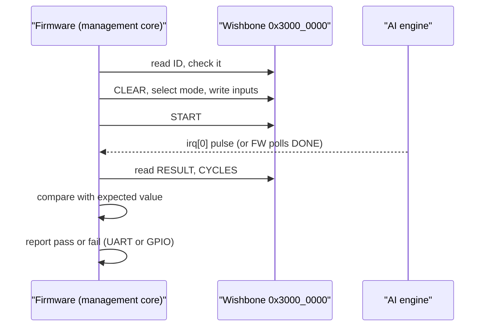

# How every example runs functionally on the Caravel SoC

Status: plan, largely executed (updated 2026-10-06). The "Status" section below says what is done; sections 1 to 6
keep the original plan and reasoning, with "Outcome" notes where reality differs. Every "exists" claim cites a file,
every number that is not measured is labelled "estimate". Owner decisions respected: (1) simple and for learning; (2) every GDSII run
under 10 minutes; (3) the Caravel RISC-V management core is the CPU, no RISC-V core in the user area, a user-area core is
a separate later study never mixed into the AI macro; (4) exactly one macro in `user_project_wrapper` (`SPEC.md`,
"Project decision" and "Architecture").

## Status (2026-10-06)

Ladder of section 4, all measured on this Mac without Docker:

| Step | State | Evidence |
|---|---|---|
| (i) RTL unit tests | Done | `make test` |
| (ii) wrapper RTL + GL with our Wishbone testbench | Done (784 cases, RTL, synthesised and routed) | `designs/user_project_wrapper/README.md` |
| (iii) fake management core | Done, as a real PicoRV32 running compiled RISC-V firmware instead of a replay testbench: all 784 cases on accelerator and in pure C, 15 protocol negatives, irq; about 25 s | `make soc-sim`, `firmware/README.md`, `soc_sim/` |
| (iv) full-Caravel RTL with real firmware | Done with iverilog and the real VexRiscv core instead of cocotb: one case per mode, PASS in about 53 s | `make caravel-rtl`, `caravel_sim/`, `docs/CARAVEL_SIM.md` |
| (v) full-Caravel GL | Done functionally: hybrid PASS 59 s (`make caravel-gl`); full-chip GL (caravel_core incl. management SoC + wrapper + macro) PASS 14 m 23 s (`make caravel-fullgl`); SDF PASS on wrapper + macro at 3 corners (`make caravel-sdf-wrapper`); full-chip GL+SDF with firmware not completed (emulated CVC too slow) | `docs/CARAVEL_SIM.md`, `build/gpio_fix_chain.log` |
| (vi) `cf precheck` | Done locally: 14 of 14 PASS in 61 s, in our own container (not ChipFoundry's image) | `make precheck`, `precheck/results/summary.tsv`, `docs/PRECHECK.md` |

Also done (adapter path):

- The generic adapter `shared/rtl/wb_stream_adapter.v` is verified with 14 engines: 13 stream engines (`vision_all_lit`,
  `vision_block`, `text_sentiment`, `image_text_match`, `audio_pitch`, `audio_onset`, the seven `prec_*`) plus `kv_attn_n8`
  (`make adapter-test`, `tests/adapter/run.sh`, `tests/adapter/adapter_tb.v`).
- Two adapter macros are hardened clean (109 pins, DRC / LVS / XOR / antenna 0, all five flow stages pass):
  `designs/soc_image_text_match` (3,201 cells, 393 flip-flops, 250 x 250 um, setup +2.956 ns) and
  `designs/soc_kv_attn_n8` (4,514 cells, 570 flip-flops, 300 x 300 um, setup +1.442 ns) (`output/metrics.json` of each).
- Each macro sits in its own Caravel wrapper build, `designs/user_project_wrapper_soc_itm` (setup +2.965 ns) and
  `designs/user_project_wrapper_soc_kv` (setup +1.448 ns), both signoff-clean, with the macro testbench passing on RTL and
  on the synthesised and routed wrapper netlists (`output/metrics.json`, each `NOTES.md`).
- Firmware: `firmware/` (tiny_ai_core, 784 cases) and `firmware/kv/` + `soc_sim/kv/` (KV-cache attention behind the adapter:
  prefill cost per token 328 -> 90.6 CPU clocks for P = 1 -> 7, decode round trip 670 clocks, engine latency n + 3;
  `make soc-kv`, `firmware/README.md`).
- GPIO startup modes are set (owner decision 2026-10-06: `GPIO_MODE_MGMT_STD_INPUT_NOPULL` for 5..37 in `user_defines.v`).

Not done: full-chip GL+SDF with firmware; confirming the precheck with ChipFoundry's tooling (human); full-Caravel simulations
(`make caravel-rtl`, `caravel-gl`, `caravel-fullgl`, `caravel-sdf-wrapper`) and the local precheck for the adapter wrappers
(`user_project_wrapper_soc_itm`, `user_project_wrapper_soc_kv`): those ran for `user_project_wrapper` (`tiny_ai_core`) only
(`docs/CARAVEL_SIM.md`, `docs/PRECHECK.md`); `release/manifest.json`; the choice of the single tapeout macro (section 6).
No multi-engine macro with an engine-select register (option (b)) and no `soc_audio_onset` / `soc_prec_int8` macro were built.
Finding: bus transactions dominate; software beats the accelerator for the 4-input networks and only `vision_block` wins (1.8x); for
KV attention one decode round trip is 670 CPU clocks against an engine latency of 3 to 10 clocks.

## 1. What "runs on the SoC" means

The management core (a RISC-V CPU inside Caravel, not part of this repository) runs C firmware. For one example the
firmware does the same five things every time:



Pass criterion for an example: every vector from the golden model gives the expected class; the firmware prints one
PASS or FAIL line and sets a GPIO flag the cocotb test watches.

### What the template's DV flow looks like

Inspected in `build/template/verilog/dv/` (template `chipfoundry/caravel_user_project` @ `b510613`, `versions.lock`):

| Piece | File | What it is |
|---|---|---|
| Firmware C | `dv/cocotb/<test>/<test>.c`, e.g. `hello_world_uart.c`, `gpio_test.c` | bare-metal C, `#include <defs.h>`, configures GPIO with `reg_mprj_io_N = GPIO_MODE_...; reg_mprj_xfer = 1;`, flags test phases through `reg_mprj_datal` |
| Python test | `dv/cocotb/<test>/<test>.py`, collected by `dv/cocotb/cocotb_tests.py` | `@cocotb.test()` using `caravel_cocotb` (`test_configure`, `release_csb`, `wait_mgmt_gpio`, `monitor_gpio`) |
| Test lists | `dv/cocotb/user_proj_tests/user_proj_tests.yaml` (+ `_gl.yaml`) | which tests run at RTL / gate level |
| Design info | `dv/cocotb/design_info.yaml` | `CARAVEL_ROOT`, `MCW_ROOT`, `PDK_ROOT`, `USER_PROJECT_ROOT`, `clk: 25` (period in ns) |
| Legacy iverilog DV | `dv/wb_port/{wb_port.c,wb_port_tb.v,Makefile}`, `io_ports`, `la_test1`, `la_test2`, `mprj_stimulus` | firmware plus a Verilog testbench; `wb_port.c` is the nearest example to ours: `#define reg_mprj_slave (*(volatile uint32_t*)0x30000000)`, enable `reg_wb_enable`, write then read the slave |
| Run commands | `dv/cocotb/README.md`, `dv/local-install.md`, `Makefile` (`verify-*`, `cocotb-verify-*`) | `caravel_cocotb -t <test> -tag <tag>`; `SIM=RTL|GL make verify-<test>` |

Tools this flow needs (from `dv/local-install.md`, `build/template/Makefile`, `LOCAL_RUN_PLAN.md`). The last column is the state at
planning time. Outcome: steps (iv) and (v) ran natively on this Mac with `riscv64-elf-gcc` 16.2.0 (Homebrew;
`-march=rv32i_zicsr`), iverilog 13, the caravel-lite and management-core RTL cloned into `build/caravel`, and iverilog-driven
simulations instead of cocotb; no amd64 Docker image was needed except for the SDF simulator (`docs/CARAVEL_SIM.md`).

| Need | Why | This Apple-silicon machine today |
|---|---|---|
| Caravel RTL + management-core wrapper RTL (`CARAVEL_ROOT`, `MCW_ROOT`) | the SoC under test; installed by the template's `make setup`, not present in `build/template` | not present; cloning is a large download, needs owner go-ahead |
| RV32I GCC (`GCC_PATH`) | compile firmware to a hex the management core's flash model loads | `which riscv32-unknown-elf-gcc` and `riscv64-unknown-elf-gcc`: not found. Homebrew has `riscv64-elf-gcc` 16.2.0 (not installed); whether its multilib covers `-march=rv32i -mabi=ilp32` is unverified |
| cocotb + `caravel_cocotb` (`venv-cocotb`) | Python test driver | `pip3 list` shows no cocotb |
| iverilog 10.2+ (or Verilator) | simulator | iverilog installed (`/opt/homebrew/bin/iverilog`); verilator not found |
| Docker images `chipfoundry/dv:latest`, `chipfoundry/dv:cocotb` (`build/template/Makefile` lines 125-163), and `efabless/dv:*` in the older plan | the template's default way to get all of the above | `LOCAL_RUN_PLAN.md` line 59 records the `efabless/dv` images as `linux/amd64`. I did not check the manifest of the `chipfoundry/dv` images (no pulls allowed); run `docker manifest inspect chipfoundry/dv:cocotb` before assuming either way |
| `mpw_precheck` image (`build/template/Makefile` line 244) | step (vi) | not checked; treat as amd64 until proven otherwise |

What amd64-only means here: the Colima VM `osl` is `aarch64` (`colima list`: 6 CPUs, 16 GiB, 60 GiB disk), so
those images either fail with `exec format error` or run under QEMU emulation. `LOCAL_RUN_PLAN.md` (troubleshooting
table) therefore prescribes a separate x86-64 profile named `chipignite`. Emulated simulation of a whole Caravel SoC
is slow (estimate: several times to tens of times slower than native); budget accordingly and keep firmware short.
The LibreLane image used for hardening (`versions.lock`, `ghcr.io/librelane/librelane:3.0.2`) is a separate
matter and already works on this machine (all hardening runs so far).

## 2. Getting the stream engines onto the SoC

Facts (cited):
- `tiny_ai_core` is on Wishbone with 109 macro pins (Wishbone + irq) and a 250 x 250 um die (`SPEC.md` Status update
  2026-10-06, `designs/tiny_ai_core/output/metrics.json`: die 62,500 um^2, reported instance area 53,897.9 um^2,
  13,650 instances counting all classes incl. fill and tap; 1,809 standard cells, `design__instance__count__stdcell`).
- Each standalone stream engine is 24 pins, valid/ready, and a die of 80 x 80 um = 6,400 um^2 with reported instance
  area 3,915 um^2 in `designs/{audio_pitch,audio_onset,prec_bin,vision_all_lit,vision_block,text_sentiment}/output/metrics.json`
  (identical 3,915 for all six: it looks like the reported core area rather than a per-design cell area, so use
  instance counts instead, 669 to 963 each in the same files; a precise per-engine area needs a re-read of the
  synthesis reports). `image_text_match` and `prec_{tern,int4,int8,fp8,fp16,bf16}` were hardened later and now have metrics too (for example
  standard-cell area `design__instance__area__stdcell`: `audio_onset` 2,793.9, `image_text_match` 3,856.2, `prec_int8` 4,859.7 um^2).
- The user area is 10,278,400 um^2 (`designs/user_project_wrapper/output/metrics.json`, die area); one
  `tiny_ai_core` is 0.6 percent of it. Area is not the constraint. The constraints are the one-macro rule, pins on
  the macro edge (`designs/user_project_wrapper/README.md`, item 2: 361 pins congested, 109 routed), and build time.
- Stream contracts: `audio_pitch` / `audio_onset`: one input beat gives one result beat (after 7 / 3 warm-up
  samples), `s_last` ends a recording (`designs/audio_pitch/README.md`, `designs/audio_onset/README.md`);
  `image_text_match`: 10 input beats, 2 result beats (`designs/image_text_match/README.md`); `prec_*`: 9 input beats,
  2 result beats `{error,class}` then `acc` (`designs/prec_bin/README.md`).

### Options

| | (a) generic Wishbone-to-stream adapter | (b) widen `tiny_ai_core` (engine-select register) | (c) one wrapper build per experiment |
|---|---|---|---|
| Idea | new `wb_stream_adapter.v`: registers, small FIFOs, valid/ready handshake, irq; any 24-pin engine plugs in unchanged | add engines as modes 3..N in `tiny_ai_core.v`, same register block | build a different macro for each experiment; only one ever goes to tapeout |
| New RTL | one adapter (estimate 100 to 200 flops, a few hundred lines; estimate, not measured) | per-engine glue inside the core, input buffer sizes differ (frames of 9 or 10, streams unbounded) | none beyond a top per engine |
| Pins | macro stays Wishbone + irq = 109, wrapper config unchanged | same 109 | same 109 |
| Build time | macro about 2 min, wrapper 53 s (`SPEC.md` update, `designs/user_project_wrapper/README.md`); estimate 3 to 5 min per experiment, under 10 | grows with cell count; the 3-engine core already is 13,650 instances; estimate a few minutes more, still under 10 but the margin shrinks | 3 to 5 min each (estimate), many builds |
| Engines unchanged | yes, verified RTL reused as is | no, each engine re-wrapped and re-verified | yes |
| One-macro rule | yes | yes | yes, per build |
| Learning value | high: one adapter, one driver, every engine | medium: bigger single file, mode explosion | high but repetitive |
| Cost | adapter must handle a streaming engine and a frame engine honestly | most invasive, risks the signoff-clean core | many GDS runs to review |

### Recommendation

Do (a) first, delivered as option (c) (one build per experiment), then decide a final subset with (b) built on top of
(a), not by editing `tiny_ai_core`:

1. Write `wb_stream_adapter` once. A thin per-experiment top (`soc_<engine>.v`, adapter + one engine, the macro
   port list identical to `tiny_ai_core`) makes each engine a separate, small, quick build that never touches the
   signoff-clean `tiny_ai_core` and keeps `user_project_wrapper` unchanged except for the macro name.
2. Only after the engines work through the adapter, the owner picks the single tapeout macro (see Open decisions):
   either keep `tiny_ai_core` as is, or a "multi-engine" top that holds a chosen subset behind an engine-select
   register in the adapter (unselected engines held in reset). This is where (b) lands, with engines still
   unchanged. Candidate subset (owner to confirm): the 3 current engines through the existing `tiny_ai_core` block
   plus `audio_onset`, `image_text_match` and `prec_int8` through the adapter; an estimate, not a measured size.

Outcome: step 1 was done twice, as `soc_image_text_match` and `soc_kv_attn_n8` (adapter + one engine, same 109 pins as
`tiny_ai_core`), each with its own wrapper build; step 2 (the owner's choice of the single tapeout macro, or a multi-engine
macro) is still open (section 6).

Why: simplest to learn (one register map for 10 engines), keeps every builds under 10 minutes (each experiment is
about one engine of 24 pins plus glue), respects the one-macro rule, and does not risk the finished core.

### Adapter register map: original proposal (superseded by the built map below)

| Offset | Name | Access | Definition |
|---|---|---|---|
| 0x00 | ID | R | `0x5354_5201` (new, distinct from `0x54414901`) |
| 0x04 | CTRL | RW | byte 0: engine select (0 when only one engine); byte 1: bit 8 CLEAR (self-clearing: resets engine and both FIFOs, clears ERROR) |
| 0x08 | STATUS | R | [0] TX_FULL, [1] RX_NONEMPTY, [2] ERROR (sticky: result FIFO overflow), [3] LAST_SEEN (an `m_last` beat was popped or is queued), [11:8] TX level, [19:16] RX level |
| 0x0C | DATA_IN | W | [7:0] `s_data`, [8] `s_last`. Pushed into the TX FIFO; ignored and ERROR if full |
| 0x10 | DATA_OUT | R | [7:0] `m_data`, [8] `m_last`, [9] valid. Reading pops the RX FIFO; empty reads return valid = 0 |
| 0x14 | LATENCY | R | clocks from the last accepted `s_valid` beat to the first result beat of this run (8 bits) |
| 0x18 | CAPS | R | [7:0] RTL version, [15:8] beats per frame the engine expects (0 = streaming) |

Behaviour: the TX FIFO drives `s_valid`/`s_data`/`s_last` and pops on `s_ready`; `m_ready` is high whenever the RX
FIFO has room, so the engine never stalls on a slow CPU unless the FIFO fills. `irq[0]` pulses when a beat with
`m_last` is pushed into the RX FIFO. FIFOs of depth 4 (TX) and 8 (RX) are enough to run every engine (frames are 9
or 10 beats, results at most 2 beats per frame); depths are an estimate to adjust.

### Adapter register map as built (`shared/rtl/wb_stream_adapter.v` header; base 0x3000_0000)

The built adapter differs from the proposal above: no engine-select byte and no LATENCY / DATA_IN / DATA_OUT registers; TX FIFO and
RX FIFO are 16 entries of 9 bits each (CAPS reports the depths); the run timer is `CYCLES`.

| Offset | Name | Access | Definition |
|---|---|---|---|
| 0x00 | ID | R | `0x5354_5201` |
| 0x04 | CTRL | RW | [0] irq enable; W bit 8 CLEAR (self-clearing: resets both FIFOs, the engine, BUSY, DONE, errors, CYCLES) |
| 0x08 | STATUS | R | [0] TX_FULL [1] TX_EMPTY [2] RX_EMPTY [3] BUSY [4] DONE [5] ERR_OVF [6] ERR_UF, [15:8] TX level, [23:16] RX level |
| 0x0C | TXDATA | W | [7:0] pushed with `s_last` = 0 |
| 0x10 | TXLAST | W | [7:0] pushed with `s_last` = 1 |
| 0x14 | RXDATA | R | [7:0] `m_data`, [8] `m_last`, [9] valid; the read pops the RX FIFO (empty read: 0 and ERR_UF) |
| 0x18 | RXSTATUS | R | [0] EMPTY [1] HEAD_LAST [2] DONE, [15:8] RX level (no side effect) |
| 0x1C | CYCLES | R | cycles from the first accepted TX beat to the captured `m_last` result beat (16 bits, saturating) |
| 0x20 | CAPS | R | [7:0] RTL version, [15:8] TX depth, [23:16] RX depth |

`irq[0]` pulses when a beat with `m_last` is captured, if CTRL[0] is set; `irq[2:1]` = 0. `m_ready` = RX FIFO not full, so a slow CPU
back-pressures the engine instead of losing beats.

### Mapping streaming and frame engines to registers

- Frame engines (`prec_*`, `image_text_match`): firmware writes beats 0..8 (or 0..9) to TXDATA, the last one to TXLAST
  (plan wording: DATA_IN with bit 8 set); then waits for irq or RXSTATUS.DONE; pops 2 beats from RXDATA. Same shape as `tiny_ai_core`'s
  "INPUT x N, START, RESULT", with START replaced by `s_last`.
- Streaming engines (`audio_pitch`, `audio_onset`): firmware writes one sample per DATA_IN write. Do not assume one
  result per write: `audio_pitch` gives none for the first 7 samples and `audio_onset` none for the first 3
  (their READMEs), so firmware drains DATA_OUT while RX_NONEMPTY after every write. Because a Wishbone write takes
  more than one clock and `audio_pitch`'s result is registered on the accept edge (README), the result is readable
  on the next bus read; polling RX_NONEMPTY keeps it correct without depending on that.
- Sample FIFO plus result FIFO is the recommended form (the one-write-one-read form is its special case with depth 1).
  The sample FIFO also lets a later test push a whole recording and measure sustained throughput.

## 3. Firmware design

Plan (the `sw/` tree and `scripts/gen_sw_vectors.py` below were never created):

```
sw/include/tai_regs.h        register offsets, bit masks for tiny_ai_core and the adapter
sw/include/tai_drv.h         inline driver: tai_run(mode, in[], n, &res, &cyc)
sw/model_c/models.c          C implementation of the tiny models (generated constants)
sw/tests/tai_all.c           loop over vectors, compare, report
scripts/gen_sw_vectors.py    reads model/*/golden.py and weights.json, writes sw/include/vectors.h, weights.h
```

Outcome: the firmware lives in `firmware/` (`main.c`, `start.S`, `link.ld`, `gen_expected.py`: constants generated from
`model/tiny_ai/golden.py` and `weights.json`; the pure-C networks and the cycle table are in `main.c`) and `firmware/kv/` (`main.c`,
`gen_expected.py` from `model/kv_attention/golden.py`), run by the PicoRV32 SoC simulations in `soc_sim/` (`make soc-sim`,
`make soc-kv`); `docs/CARAVEL_SIM.md` and `caravel_sim/` hold the Caravel-management-core versions for `tiny_ai_core`.

### tiny_ai_core (register map from `designs/tiny_ai_core/rtl/tiny_ai_core.v` header)

```c
#define TAI_BASE   0x30000000u
#define REG(o)     (*(volatile uint32_t *)(TAI_BASE + (o)))
#define ID 0x00
#define CTRL 0x04     /* [1:0] mode, bit8 START, bit9 CLEAR */
#define STATUS 0x08   /* [0] BUSY [1] DONE [2] ERROR [5:4] mode [11:8] count */
#define INPUT 0x0C
#define RESULT 0x10   /* [0] class, [15:8] signed score */
#define CYCLES 0x14

int tai_run(unsigned mode, const uint8_t *in, int n, int *cls, int *score, unsigned *cyc)
{
    if (REG(ID) != 0x54414901u) return -1;
    REG(CTRL) = (1u << 9);                       /* CLEAR (CTRL byte lane 1) */
    REG(CTRL) = mode;                            /* mode in byte lane 0 */
    for (int i = 0; i < n; i++) REG(INPUT) = in[i];
    REG(CTRL) = (1u << 8) | mode;                /* START */
    while (!(REG(STATUS) & 2u)) ;                /* poll DONE; irq variant below */
    if (REG(STATUS) & 4u) return -2;             /* sticky ERROR */
    uint32_t r = REG(RESULT);
    *cls = r & 1; *score = (int8_t)(r >> 8); *cyc = REG(CYCLES);
    return 0;
}
```

Details to check against the RTL when writing the real file: START is accepted only when the input count equals
the mode's length (4, 9, 4; header, "Protocol rules"), and `mode` 3 is an error.
IRQ variant: the management core's user-irq enable bits live in the Caravel repository (not in `build/template`);
read `defs.h` there before writing it. First version polls DONE.

### Adapter (frame and streaming forms)

Sketch from the plan, with the register names of the original proposal (the built names are TXDATA / TXLAST / RXSTATUS / RXDATA):

```c
/* frame engine, e.g. prec_int8: 9 beats, 2 result beats */
for (int i = 0; i < 9; i++) A_REG(DATA_IN) = pix[i] | (i == 8 ? 0x100 : 0);
while (!(A_REG(STATUS) & 2)) ;
uint32_t b0 = A_REG(DATA_OUT), b1 = A_REG(DATA_OUT);   /* {error,class}, acc */

/* streaming engine, e.g. audio_onset */
for (int i = 0; i < n; i++) {
    A_REG(DATA_IN) = e[i] | (i == n - 1 ? 0x100 : 0);
    while (A_REG(STATUS) & 2) { uint32_t o = A_REG(DATA_OUT); check(o, expect[k++]); }
}
```

The code that actually runs (`firmware/kv/main.c`, `run_frame()`, against the built map):

```c
for (int i = 0; i < nb - 1; i++) wr(R_TXDATA, beats[i]);
wr(R_TXLAST, beats[nb - 1]);
while (!(rd(R_RXSTAT) & RXS_DONE)) { }
do { v = rd(R_RXDATA); resp[n++] = (uint8_t)v; } while (!(v & 0x100) && n < 16);   /* bit 8 = m_last */
f->reg = rd(R_CYCLES);
```

### CPU versus accelerator (the "neural network accelerator vs generic program" comparison, `docs/WHY_AI.md`)

The management core is already on the chip, so the software baseline costs zero extra area. Plan:

1. `scripts/gen_sw_vectors.py` writes constants from `model/tiny_ai/weights.json` and the vectors from
   `model/*/golden.py` (functions `run`, `core_run`, `params`), so C and RTL cannot drift apart.
2. `sw/model_c/models.c` re-implements the same three tiny models and the audio engines in plain C: all_lit (AND of
   4 inputs by weights), vision_block (2x2 kernel at 4 positions, max-pool), text_sentiment (embedding table sum),
   audio_onset (4-tap weighted sum). Integer only, same arithmetic as the golden model.
3. Time both on the same inputs with one cycle counter: the management SoC timer (name of the register comes from
   the Caravel `defs.h`, to confirm) read before and after. Report CPU cycles per inference, accelerator
   `CYCLES` register (hardware cycles from START to commit), and the bus cost (Wishbone writes of inputs). The
   honest expectation to test, not assume: for 4 to 10 inputs the bus transfers dominate, so the CPU may well win
   on wall time (measured, `firmware/README.md`: software 153.0 CPU clocks against a 490.0 clock accelerator round trip for
   `vision_all_lit`, 351.0 against 490.0 for `text_sentiment`, 1318.6 against 728.0 for `vision_block`; the accelerator's own
   CYCLES register reads 6 to 15); the accelerator's value is that the answer comes from learned stored numbers in fixed hardware
   (`docs/WHY_AI.md`). Record whatever the measurement says. Caution: the management core fetches code over QSPI
   flash by default, so CPU-cycle numbers depend on the cache and flash model in simulation; state which setup was
   used next to every number.
4. Report format: one table per engine: CPU cycles, accelerator cycles, bus cycles, same expected output.

## 4. Verification ladder

Times are budgets to hold, not measurements, except where cited. The table is the plan; the "Status" section at the top gives
the outcome of each step (all six reached for `tiny_ai_core`: (iii) as a PicoRV32 SoC sim, (iv) to (v) natively with iverilog and
no cocotb, (vi) 14 of 14 in 61 s; for the adapter macros the ladder stopped at the wrapper RTL / gate-level testbench plus the PicoRV32
firmware sims).

| Step | What | Budget | Pass criterion | Runs on this machine today? |
|---|---|---|---|---|
| (i) RTL unit tests | `make simulate DESIGN=<d>`; `make test` | seconds to 1 min each | each testbench prints PASS (e.g. `PASS prec_bin_tb: 931 cases` in `designs/prec_bin/README.md`) | Yes (iverilog) |
| (ii) wrapper RTL + GL with our Wishbone testbench | 784 cases, 39,956 checks through wrapper ports on RTL, synthesised and routed netlists (`designs/user_project_wrapper/README.md`) | under 10 min with GL | zero mismatches | Yes; the Docker-based flow is the batch already running, do not start another |
| (iii) "fake management core" testbench | new `designs/<x>/tb/mgmt_fw_tb.v`: a Wishbone master task that replays the firmware's exact register sequence (same `tai_run` steps and vectors from `vectors.h`), checks results, prints PASS | under 1 min per engine | PASS, and the sequence file is generated from the same vectors as the C firmware | Yes (iverilog only). This is the first new step to build |
| (iv) full-Caravel RTL cocotb with real firmware | `caravel_cocotb -t tai_all -tag tai`; test in `dv/cocotb/tai_all/` with a `design_info.yaml` copy | estimate 5 to 20 min native, longer emulated; keep firmware to a handful of vectors per engine | firmware sets the GPIO "pass" flag, cocotb sees it before timeout, UART shows PASS | No: needs caravel + mgmt core RTL, RV32 GCC, cocotb |
| (v) full-Caravel GL | `SIM=GL` / `user_proj_tests_gl.yaml`, needs wrapper GL netlists | longer than (iv), estimate; first only 1 vector per engine | same as (iv) on the netlists | No, same plus PDK cell models |
| (vi) `cf precheck` | `make precheck` / `mpw_precheck` (`build/template/Makefile` lines 243-260) | tens of minutes (estimate) | all checks pass, `lvs_config.json` used (`designs/user_project_wrapper/README.md`) | No; human `cf` setup comes first (Phase 5 in `SPEC.md`) |

### What must be installed for (iv) to (vi), and the three ways round amd64-only images

Outcome: option A was used and worked (`docs/CARAVEL_SIM.md`: `riscv64-elf-gcc` 16.2.0 with `-march=rv32i_zicsr`, iverilog 13,
caravel-lite and the management core cloned into `build/caravel`, sky130A from volare); cocotb and the Docker images were not needed.
Only the SDF simulator (Open Verilog CVC) needs an amd64 container. The text below is the original plan.

Exact tools: `brew install riscv64-elf-gcc` (check `riscv64-elf-gcc -print-multi-lib` lists `rv32i/ilp32`; if not,
build `riscv-gnu-toolchain` at commit `411d134` as in `build/template/verilog/dv/local-install.md`, a long compile),
`pip3 install cocotb` (version as pinned by `caravel_cocotb`, read its `requirements`), `brew install verilator`
only if the owner wants it (iverilog is already there), the caravel + `mgmt_core_wrapper` repositories
(`build/template/Makefile` lines 56-75 name `chipfoundry/caravel` / `caravel-lite`), and the sky130A PDK
(`PDK_ROOT`; `versions.lock` pins commit `8afc834...`).

| Option | How | Cost |
|---|---|---|
| A. native toolchain path | brew RV32 GCC + iverilog + caravel RTL, run the template's non-Docker flow (`dv/local-install.md`: `export GCC_PATH`, `export PDK_PATH`, `SIM=RTL make verify-<test>`) | needs caravel clone and PDK (large downloads, owner approval), macOS quirk: upstream Makefiles use GNU `realpath --relative-to` (`LOCAL_RUN_PLAN.md` line 59), so install `coreutils` and put `grealpath` on PATH as `realpath`; fastest runs |
| B. x86-64 Colima profile | `LOCAL_RUN_PLAN.md` step 2 (`colima start chipignite --arch x86_64 ...` per that file), then the template's Docker targets | works with official images, QEMU emulation is slow (estimate), more disk (60 GiB VM today) |
| C. a Linux x86 machine or CI | run the template flow natively there | cleanest, needs access; also a natural home for (v) and (vi) |

Recommendation: do (i) to (iii) now; try option A for (iv); fall back to C for (v) and (vi).

## 5. Task list (owner-sized steps)

All physical builds run through `scripts/flow/run_capped.sh` (`FLOW_TIMEOUT`, default 600 s, stops a runaway run;
header of the script). Use `FLOW_TIMEOUT=600` explicitly; any step whose estimate approaches it gets a smaller design,
not a longer timeout. Run one flow at a time.

| # | Step | Files touched | Commands | Expected time |
|---|---|---|---|---|
| 1 | Generate the shared vectors and C constants | `scripts/gen_sw_vectors.py`, `sw/include/{vectors,weights}.h` | `python3 scripts/gen_sw_vectors.py` | seconds |
| 2 | Fake-management-core testbench for `tiny_ai_core` (replays `tai_run`) | `designs/tiny_ai_core/tb/mgmt_fw_tb.v` | `make simulate DESIGN=tiny_ai_core` (adjust to select the new tb) | under 1 min |
| 3 | `wb_stream_adapter` + a testbench against `audio_onset` and `prec_int8` | `shared/rtl/wb_stream_adapter.v`, `designs/<x>/tb/` | `iverilog`, via a new `make simulate` target | under 1 min |
| 4 | One experiment top per engine: `soc_audio_onset` first (adapter + engine, macro ports identical to `tiny_ai_core`) | `designs/soc_audio_onset/{rtl,config.json,tb}` | `scripts/flow/run_capped.sh --design soc_audio_onset` (reads `config.json`), then `make wrapper` equivalent | macro about 2 min + wrapper about 1 min (estimates from `SPEC.md` update, `designs/user_project_wrapper/README.md`); cap 10 min |
| 5 | Repeat step 4 for `image_text_match`, `prec_int8` | as step 4 | as step 4, one at a time | same |
| 6 | C firmware and the CPU-versus-accelerator measurement (in step (iii) first, as a Verilog-simulated count, only later on real Caravel) | `sw/`, `docs/WHY_AI.md` pointer | host `gcc` build of `sw/model_c` against the vectors | seconds |
| 7 | Install RV32 GCC and cocotb; clone caravel + mgmt core (owner OK for downloads) | none in repo; `docs/` note | `brew install riscv64-elf-gcc`; `pip3 install cocotb`; template `make setup` equivalents | tens of minutes download (estimate) |
| 8 | Full-Caravel RTL cocotb: one hello-world, then `tai_all` | `dv/cocotb/tai_all/{tai_all.c,tai_all.py,tai_all.yaml}`, `cocotb_tests.py`, `design_info.yaml` | `caravel_cocotb -t tai_all -tag tai` | estimate 5 to 20 min; cap each run |
| 9 | Full-Caravel GL, one vector per engine | `user_proj_tests_gl.yaml` | `SIM=GL ...` | longer; estimate |
| 10 | Wrapper housekeeping: drive `io_oeb` high or set GPIO startup modes in `user_defines.v` | `designs/user_project_wrapper/rtl/user_defines.v` or macro | see Open decisions | seconds, then one wrapper rebuild |
| 11 | Local precheck, then bundle | `release/manifest.json` | `make precheck` equivalent | tens of minutes (estimate) |

Status of the task list (2026-10-06): step 1 replaced by `firmware/gen_expected.py` and `firmware/kv/gen_expected.py` (no
`scripts/gen_sw_vectors.py`); step 2 replaced by the PicoRV32 SoC sim (`make soc-sim`); step 3 done (`make adapter-test`, 14 engines);
step 4 done for `image_text_match` and `kv_attn_n8` (`soc_image_text_match`, `soc_kv_attn_n8`, with wrapper builds), not for
`audio_onset`; step 5 partly (`image_text_match` yes, `prec_int8` only through the adapter test, no macro); step 6 done in
`firmware/README.md`; steps 7 and 8 done natively (iverilog, not cocotb; `tiny_ai_core` firmware, one case per mode); step 9 done
(hybrid and full-chip GL, SDF on wrapper + macro); step 10 done (GPIO 5..37 management-owned inputs); step 11 local precheck done,
`release/manifest.json` not.

Human-only checkpoints (`SPEC.md`, "What is next" items 1, Phases 5 and 11): `cf login`, `cf init`, `cf gpio-config`,
`cf push` / `cf confirm`, and submission are never run by an agent; the agent stops before step 11's submission and
before any cf command. Steps 1-6 need none of them. Steps 7 and 8 need no cf login but do need owner approval for
large downloads.

## 6. Open decisions for the owner

1. OPEN. Which engines go into the single macro: only `tiny_ai_core` (3 engines, done), a single-engine adapter macro that now
   exists (`soc_image_text_match`, `soc_kv_attn_n8`, each with its wrapper build), or a multi-engine macro with an
   engine-select register built on the adapter (not built); and which subset (candidate in section 2). One macro only, so
   every added engine competes for the same 109 pins and the same wrapper placement.
2. GPIO startup modes and `io_oeb` before tapeout: `designs/user_project_wrapper/README.md` item 5 and `SPEC.md`
   Status update say the wrapper's unconnected `io_oeb` must be driven high or all user GPIO set to inputs in
   `user_defines.v`. RESOLVED 2026-10-06: all GPIO 5..37 are management-owned inputs (`GPIO_MODE_MGMT_STD_INPUT_NOPULL`); precheck OEB PASS.
3. Slew budget interpretation (`SPEC.md` Status update, open decision 1): count only internal nets, or accept
   Caravel's 0.84-0.92 ns input transitions on `wbs_adr_i` / `wbs_dat_i` (limit 0.75 ns) as environment-limited.
   Affects whether every new macro build reports "slew 0".
4. Mostly resolved: steps (iv) to (vi) ran on the native toolchain (option A) with the caravel and PDK downloads done. Still open:
   the host for full-chip SDF with firmware (emulated CVC too slow) and the full-Caravel sims / precheck for the adapter wrappers.
5. RESOLVED in the built adapter: FIFO depths 16 and 16 (4 and 8 were proposed), a separate `ID` `0x5354_5201`, and a `CYCLES`
   register instead of `LATENCY` (`shared/rtl/wb_stream_adapter.v` header).
6. RESOLVED for the numbers in `firmware/README.md`: they are measured on the PicoRV32 simulation with code in RAM and the
   testbench cycle counter, not the Caravel flash-fetch setup; the Caravel firmware (`caravel_sim/`) checks results, not CPU-versus-
   accelerator cycles.
7. Later and separate: a user-area RISC-V core is a different study with its own macro; it does not enter this plan.
