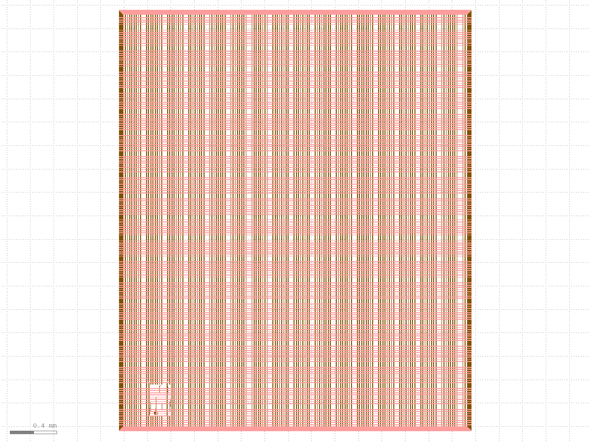
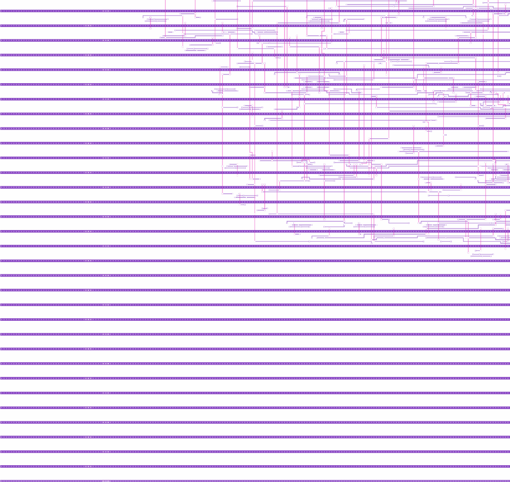
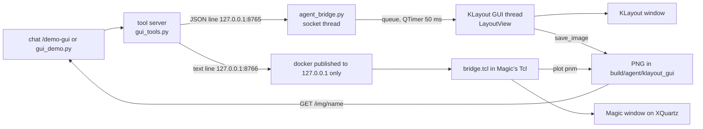

# Demo 7: operate the real KLayout and Magic windows

Two real layout tools open on your screen and the agent drives them with simple, read-only acts while you explain what
you are looking at. Runner: `examples/hermes_desktop/demos/gui_demo.py`. Docs: docs/HERMES_DESKTOP.md,
examples/hermes_desktop/magic_bridge/README.md

## What you need

- XQuartz running and reachable by the container (one time, from the header of `scripts/gui/open_gui.sh`):
  `open -a XQuartz`, `defaults write org.xquartz.X11 nolisten_tcp -bool false` (restart XQuartz), and
  `DISPLAY=:0 /opt/X11/bin/xhost +localhost`. Undo later with `DISPLAY=:0 /opt/X11/bin/xhost -localhost`.
- The KLayout app at `/Applications/KLayout/klayout.app` (approved once for Gatekeeper).
- Colima profile `osl` running (Magic runs in the LibreLane container), the GDS of `kv_attn_n8` and
  `user_project_wrapper_soc_kv` (committed or collected; `make collect DESIGN=<d>` if missing).
- Nothing else: the demo uses the tool server on 8770 if it serves the GUI tools, else starts a private one on 8783.

## Run it

```
make demo-gui                                  # or: bash scripts/hermes.sh demo 7
python3 examples/hermes_desktop/demos/gui_demo.py --pace 6        # direct, narrated, 6 s pause per step
python3 examples/hermes_desktop/demos/gui_demo.py --chat          # same steps as one Open WebUI conversation (preset)
```

or type `/demo-gui` in the chat. Each step prints `Step N: ...` before acting, then the tool, seconds and result, and the
snapshot path `build/agent/gui_demo/NN_<name>.png`; `build/agent/gui_demo/run.json` has the timings. Windows are always closed at the end.

## The steps

Presenter notes use the layer facts of sky130: li1 is the local interconnect, met1 to met5 the five metals (thin and
fine at the bottom, thick and coarse at the top).

| # | agent does (tool, args) | you see | say |
|---|---|---|---|
| 1 | `gui_start {tool: klayout, design: kv_attn_n8}` + zoom full | a KLayout window with the whole engine, 260 x 260 um | Every colour is a mask layer; this is the real GDS the foundry would receive. |
| 2 | `klayout_live zoom bbox [0,0,50,50]` | the lower-left corner: regular horizontal strips | Standard cells sit in rows; a row is a strip of the same height (2.72 um) where cells are placed side by side. |
| 3 | `klayout_live layers [li1, met1]` | cell-internal wiring and long horizontal rails | Rails along each row carry VDD and VSS alternately; li1 wires transistors inside a cell. |
| 4 | `klayout_live layers [met2, met3]` | sparse vertical and horizontal wires | Signal routing between cells; routing metals alternate direction so wires cross without touching. |
| 5 | `klayout_live layers [diff, poly, li1, met1..met3, vias]` | everything stacked | Transistors (diff and poly) at the bottom, then contacts, local interconnect and metals: the full stack of this corner. |
| 6 | `klayout_live open user_project_wrapper_soc_kv` | the Caravel user area, 2.9 x 3.5 mm | This is the fixed frame a ChipIgnite design lives in; our engine is a macro inside it. |
| 7 | `klayout_live layers [met4, met5]` | a coarse grid of straps | The power grid: top metals are thick, so they carry large current with little voltage drop; straps are on met4 and met5 because those are the thickest, least dense layers, kept free of signal routing. |
| 8 | `klayout_live zoom cell mprj` | the macro zoomed with straps over it | The macro is placed as one block (instance mprj); the straps pass over and connect to its power pins. The macro sits in the middle of the user area, inside the frame the pad ring and management SoC leave free. |
| 9 | `klayout_live measure a=(x0, y) b=(x0+300, y)` | same view | The ruler reports 300 um: the macro width from its LEF (`build/macros/soc_kv_attn_n8/lef`). |
| 10 | `gui_start {tool: magic, design: kv_attn_n8}` | a second window, Magic, with its own toolbox | A different tool, same GDS; Magic runs in a container and draws on your screen through XQuartz; the agent talks to it over a localhost-only socket. |
| 11 | `magic_live zoom bbox [0,0,50,50]` | the same corner in Magic | Same coordinates in micrometres. |
| 12 | `magic_live layers [met1, met2]` | rails and routing (Magic names: m1, m2) | Same layers as KLayout step 3 and 4, in Magic's colours. |
| 13 | `magic_live drc` | `drc_errors=0` | DRC (design rule check) compares every shape with the foundry minimum width, spacing and enclosure; 0 means the layout can be made. The flow's own Magic and KLayout DRC also report 0 for this design. |
| 14 | `magic_live measure (10,10.88) to (10,13.6)` | `distance_um=2.72` | One row height, rail to rail; it is the height of every sky130_fd_sc_hd cell. |
| 15 | `gui_stop {tool: magic}` | Magic window closes | `quit -noprompt`, then only its own container is removed. |
| 16 | `gui_stop {tool: klayout}` | KLayout window closes | KLayout ignores a polite stop, so the recorded pid is killed. |

Snapshot files: `build/agent/gui_demo/01_klayout_open.png` ... `14_magic_row.png` (steps 15 and 16 take no picture). Examples:

| step 3: li1 + met1 | step 7: met4 + met5 | step 8: zoom to mprj | step 12: Magic met1 + met2 |
|---|---|---|---|
|  |  |  |  |

Magic pictures are `plot pnm` renders of the same region and layers, not pixel copies of the window (xwd of XQuartz windows is blank here).

## Try it

Type these in the chat (or send them to the `gui_command` tool; `/klayout <sentence>` and `/magic <sentence>` call it directly). Full table:
docs/HERMES_DESKTOP.md "Operate KLayout and Magic by text"; the list itself: tool `gui_examples`.

```
/klayout open kv_attn_n8 and show only met1 and met2
/klayout zoom to the lower-left 50 um
/klayout hide met2 and zoom out
/magic open kv_attn_n8
/magic run drc
/magic measure from 0,0 to 100,0
open user_project_wrapper_soc_kv in klayout and zoom to the macro mprj
close all
```

Or without any model: `python3 examples/hermes_desktop/demos/gui_demo.py --text --pace 2` runs the whole tour as sentences, and
`http://127.0.0.1:8770/gui` is a click panel for the same actions.

## How the control path works



Both bridges are read-only with an allow-list of commands (no save, no write); each tool has one window and `gui_stop`
only kills what `gui_start` recorded in `build/agent/gui/gui_state.json`.

## Measured (2026-10-06, `--pace 2`, M4 Pro; source `build/agent/gui_demo/run.json`)

Total 72 s with a 2 s pause per step (about 30 s is the pause). Seconds per act: step 1 KLayout start 2.9, steps 2 to 9 0.3 to 0.6 each, step 10 Magic start
19.2 (cold container; 1.2 s when it was already warm), steps 11 to 14 2.9, 2.4, 2.3, 1.4, step 15 0.5, step 16 6.3 (KLayout stop falls back to SIGKILL).
At the default `--pace 6` plan on about 2 minutes. The `--chat` mode (Hermes 3 8B through Open WebUI) took 77 s and 26 s for its first two steps: the model
picks the tools, so it is slower and may phrase things differently.

## Troubleshooting

- `XQuartz is not listening on TCP 6000` or `xhost` does not list localhost: do the one-time setup above (the tool says which one is missing).
- `Cannot connect to the Docker daemon`: start Colima (`colima start -p osl`) or export `DOCKER_HOST=unix://$HOME/.colima/osl/docker.sock`.
- KLayout does not start (no window, CPU idle): the first launch needs the Gatekeeper approval in System Settings, Privacy and Security.
- `port 8765 (8766) is in use by something this tool did not start`: close that window yourself; the tool never kills a window it did not open.
- A window you closed by hand: `gui_status` shows running false; `gui_start` again.
- Magic zoom looks off-aspect in the window: known quirk without a console (see magic_bridge/README.md); the snapshot is exact.
