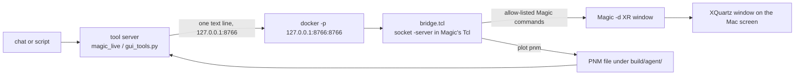

# Magic bridge: operate the real Magic window from the chat (read-only)

Educational. The Hermes agent can open and drive a real Magic window on the Mac (XQuartz) through the tool server's
`gui_start` and `magic_live` tools (`examples/hermes_desktop/tool_server/gui_tools.py`). This directory holds the bridge.

Files: `bridge.tcl` (server inside Magic's Tcl interpreter), `client.py` (protocol, launcher, PNM/xwd to PNG),
`start_magic.sh` (stand-alone start without the tool server).

## How it works

Magic runs in the LibreLane container exactly as `scripts/gui/open_gui.sh magic` does (`DISPLAY=192.168.5.2:0` on
macOS/Colima, `-T sky130A.tech`, `-d XR`), with `-noconsole` and its stdin kept open. The tool server writes
`source bridge.tcl` to that stdin; Magic quits at EOF, so a dead tool server does not leave a window behind.
`bridge.tcl` runs `socket -server` in Magic's own interpreter (the Tk event loop serves it) and the container port is
published only as `127.0.0.1:<port>:<port>`.

## Protocol (text, one request line, one reply line)

Request: `[<token> ]<COMMAND> <word> ...`. Reply: `OK <text>` or `ERR <text>` (newlines escaped as `\n`).
The command word picks one proc of an allow-list; every other word must match `[A-Za-z0-9_./,*<>:+=@[]-]` (max 250
characters), so no space, quote, brace, `$` or `;` can reach Tcl. Request text is never evaluated. A random token
per start is required when `MAGIC_BRIDGE_TOKEN` is set (the tool server always sets one).

| command | effect in Magic |
|---|---|
| `PING` | liveness |
| `LOAD <gds> <top>` | `gds read`, `load`, `expand`, `view`; the GDS must be a `.gds` under the repo |
| `VIEW x1 y1 x2 y2` (um) | `box values`, `findbox zoom`; remembers the region |
| `FULL` | `view` (whole cell) |
| `SEE m1,m2` | `see no *`, then `see` the listed layers |
| `DRC` | `drc check`, `drc catchup`, `drc listall why`, `drc listall count`; reports errors and reasons (0 is reported as 0) |
| `FIND <label>` | `findlabel`; reports the label box |
| `MEASURE x1 y1 x2 y2` | sets the box, reports dx, dy, distance (um) |
| `PLOT <pnm> [width]` | `plot pnm` of the remembered region and the visible layers, file under `build/agent/` only |
| `STATE` | top cell, region, box |
| `QUIT` | `quit -noprompt` (after replying) |

There is no `save`, `writeall`, `gds write`, `cif write`, `extract`, shell or `source` command. The only file written
is the PNM of `PLOT`. `tests/tools/test_gui_tools.py` checks this (and runs the Tcl handler in `tclsh`).

## Snapshots

`magic_live` returns a PNG (served at `/img/<name>`, `markdown` field to paste in the chat). Magic's picture comes from
`plot pnm` of the region the window was last pointed at, converted to PNG by `client.pnm_to_png`. Why not a
screenshot of the window: `xwd` of an XQuartz window (`/opt/X11/bin/xwd`, converted by `client.xwd_to_png`) returned a
blank image here, as the windows are GPU-composited; `GUI_MAGIC_XWD=1` turns the xwd attempt on, with the plot as
fallback. `screencapture` needs a screen-recording permission this setup does not have. The plot shows the same layout
region and layers as the window, not a pixel copy of it.

Known quirk: without a console Magic misreports its window height (`windowpositions`), so `view get` is not
meaningful and the bridge tracks the requested region itself. The window zoom is therefore approximate in aspect;
the snapshot is exact for the requested region.

## Run

With the tool server: `gui_start {tool: "magic", design: "kv_attn_n8"}`, then `magic_live {action: ...}`, then
`gui_stop {tool: "magic"}` (sends `QUIT`, then `docker kill chip_magic_8766`, only that container).
Stand-alone: `bash examples/hermes_desktop/magic_bridge/start_magic.sh kv_attn_n8 [port]`.
Env: `MAGIC_BRIDGE_PORT` (8766), `MAGIC_BRIDGE_TOKEN`, `GUI_DISPLAY`, `DOCKER_HOST`, `MAGIC_BRIDGE_TIMEOUT`.

One-time macOS setup (see the header of `scripts/gui/open_gui.sh`): `open -a XQuartz`, XQuartz listening on TCP 6000
(`defaults write org.xquartz.X11 nolisten_tcp -bool false`), and `DISPLAY=:0 /opt/X11/bin/xhost +localhost`. Undo the
access afterwards with `DISPLAY=:0 /opt/X11/bin/xhost -localhost`.

## Measured (2026-10-06, Apple M4 Pro, kv_attn_n8)

`gui_start` magic 1.2 s with a warm container, 19.2 s once cold (image start, Magic startup, GDS read of 3.3 MB);
`magic_live` zoom 1.2 to 2.9 s, layers 0.5 to 2.4 s, drc 1.4 to 2.3 s (0 errors, as the committed flow evidence), measure 0.5 to 1.4 s
(each includes the PNG), `gui_stop` 0.4 s. Tests: `tests/tools/test_gui_tools.py`.

Docs: docs/HERMES_DESKTOP.md ("Operating KLayout and Magic from the chat"), docs/GUI_AND_LOGS.md
