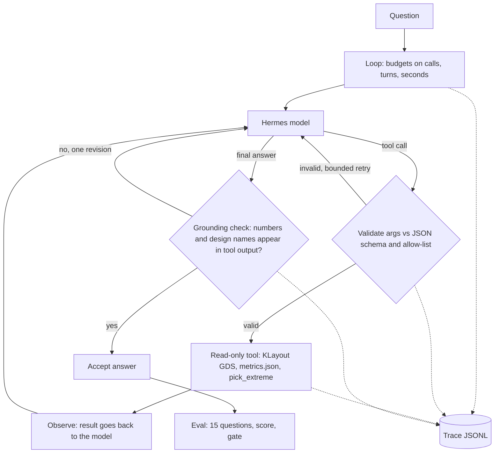

# Loop and harness engineering with Hermes and KLayout

A small, readable demonstration (not a product) of one idea: **a weak local model plus a strong harness beats the same model alone.**
The model is `hermes3:8b` in Ollama. It never changes here. We change only what is around it, and measure the effect on the 15
repo questions in `tools/eval/questions.json`.

Files in this folder:

| File | What it is |
|---|---|
| `harness.py` | The harness: loop, guardrails, grounding check, deterministic helper tool, tracing (about 270 lines, sectioned). |
| `eval_harness.py` | Runs the 15 questions under 6 configurations, scores with `tools/eval/run_eval.py:score`, prints a table, optional CI gate. |
| `results_summary.json` | The measured results quoted below (copy of `<repo>/build/agent/harness_eval_20261006_143403.json` minus per-question answers). |

It reuses, unchanged: `tools/eda_tools.py` (10 read-only KLayout/metrics tools), `tools/hermes_agent.py` (Hermes prompt format,
HTTP, the system prompt), and `tools/eval/` (questions and scorer). Background: `docs/HERMES_AGENT.md`.

## Concepts

**The model** only maps text to text. It cannot read a GDS or a metrics file, and it is poor at comparing a list of 12 numbers.

**A loop** repeats: ask the model, run what it asked for, show it the result, ask again, until it answers.
- *ReAct* (reason, act, observe): the model decides one step at a time, using each observation to choose the next. Flexible.
- *Plan-then-execute* (`--plan`): the model first writes the whole list of tool calls, code runs them, then the model writes the answer.
  Cheaper and easier to inspect, but the plan cannot depend on results it has not seen yet.
- Every loop needs **budgets** or it can run forever: here 6 tool calls, 10 model turns, 120 s wall clock.

**A harness** is everything around the model: the tool list, argument validation, budgets, checks of the answer, tracing, an
evaluation set, and a pass/fail gate. The model proposes; the harness disposes.

**Key intuition: move work the model is bad at into deterministic tools.** An 8B model reading a sorted table often picks the wrong end,
or invents a number. Code never does. So instead of asking the model to find a minimum, give it a tool that returns the minimum.
Improving a tool is cheaper and more reliable than a bigger model or a longer prompt, and it can be unit tested.



## The features (each is a few lines in `harness.py`)

| Flag | Section in `harness.py` | Idea |
|---|---|---|
| (always) loop | `run_episode` | ReAct act/observe loop, budgets on tool calls, model turns and wall clock. |
| `--plan` | `run_episode`, `PLAN_PROMPT` | The model writes `<plan>[tool calls]</plan>`; code executes it; the normal loop then writes the answer. |
| `--guardrails` | `validate_args` | Tool allow-list and JSON-schema validation (`jsonschema`) of arguments. On error the message goes back as the tool result and the model retries, at most 3 times per episode. Read-only holds by construction: only `eda_tools.call` and `pick_extreme` can execute. |
| `--grounding` | `grounding_check` | After the final answer: every number must appear (within 0.5 percent or 0.006) in some tool result of this episode, or be a sum, difference or ratio of two of them; every design name must appear in a tool result or the question. If not, one correction turn: "these numbers do not appear in any tool output ...". |
| `--pick-extreme` | `pick_extreme` | A harness-provided tool `pick_extreme(metric, which, designs, scope)`. Code computes the min or max over `read_metrics` results (zero counts and areas are ignored, since they mean "no cells"). It replaces `compare_designs` in the tool list and in the prompt recipes. |
| (always) tracing | `Tracer` | One JSONL line per event (start with prompt hash, plan, each model output, each tool call with args, result size and time, validation errors, grounding verdict, end) in `build/agent/traces/<timestamp>[_config].jsonl`. |

Try it (needs `ollama serve` and `hermes3:8b`):

```
build/agent/venv/bin/python examples/hermes_harness/harness.py --all "Which prec_* design has the most standard cells?"
build/agent/venv/bin/python examples/hermes_harness/harness.py --all --plan "What is the worst setup slack of prec_fp16, and in which corner?"
build/agent/venv/bin/python examples/hermes_harness/eval_harness.py --gate 15      # all configs, about 5.5 minutes (--only all: about 45 s); exit 1 if "all" scores below 15
```

## Measured results

Source: `results_summary.json` (full run, 6 configurations x 15 questions, temperature 0, seed 42, 333 s total on an Apple M-series Mac;
the saved copy of `<repo>/build/agent/harness_eval_20261006_143403.json`, without the per-question answers).
Scoring is the repo's own scorer, `tools/eval/run_eval.py:score`. Latency is the median per question.

| Configuration | Score | Median latency (s) | Tool calls / question | Retries (total) | Failed |
|---|---|---|---|---|---|
| baseline (same as `hermes_agent.py` prompt mode) | 13/15 | 2.67 | 0.87 | 0 | q02, q04 |
| + guardrails | 13/15 | 2.62 | 0.87 | 0 | q02, q04 |
| + grounding | 13/15 | 3.10 | 0.87 | 1 | q02, q04 |
| + pick_extreme | 15/15 | 3.69 | 0.87 | 0 | none |
| all features | 15/15 | 3.72 | 0.87 | 0 | none |
| all features + `--plan` | 13/15 | 4.19 | 1.13 | 1 | q03, q04 |

Run `build/agent/harness_eval_20261006_143403.json` (2026-10-06), after `tools/eval/ground_truth.py` regenerated q03: the design with
the most flip-flops is now `soc_kv_attn_n8` (570), not `soc_image_text_match` (393). The previous run, scored against the stale q03
(`harness_eval_20261006_121338.json`), gave the same scores except all + `--plan` 14/15. The baseline reproduces the 13/15 and the two
failures of prompt mode in `docs/HERMES_AGENT.md` (`build/agent/eval_20261006_143402.json`).

**History: the scorer under-counted.** An earlier run of this harness (`harness_eval_20261006_120657.json`) reported baseline 12/15
and 14/15 with `pick_extreme`. `strip_source` in `tools/eval/run_eval.py` cut the whole answer whenever the answer itself began with a
"Source:" line, so correct answers such as q12 ("Source: pick_extreme ... 1932 - 642 = 1290") and the old baseline q05 scored as
failures. The scorer was fixed (not the model, not the harness) and every run was re-scored; the table above is the re-scored run.

### Discussion (honest)

- **pick_extreme is the only feature that moved the score** (+2, 13/15 to 15/15): it fixed q02 (worst-corner slack: 0.110 ns at
  `max_ss_100C_1v60`) and q04 (smallest std-cell area among designs with cells: `vision_all_lit`). These are exactly the comparison
  failures: the model no longer compares, code does. In the baseline q05 passes only by keyword: the answer names `prec_fp16` but
  its counts (12345, 54321) are invented after a tool error; with `pick_extreme` the answer is grounded (1932, then 1754, 1404, 642).
  Cost: the median latency goes up from 2.67 s to 3.69 s (longer prompt; latencies also vary from run to run on this machine).
- **Prompt-side features gave nothing.** Guardrails and grounding left the score at 13/15. With these 15 questions the model never
  produced schema-invalid arguments (0 validation errors in the traces), so guardrails had nothing to catch: cheap insurance, not a
  measured gain. Grounding did fire (1 retry in this run, 2 in the previous one): in q02 the model answered "-16.93 ns, max_ff_n40C_1v95"; that value is not in the
  tool result, the check flagged it, and the model then said it did not have enough information. Still a failure, but a refusal
  instead of a confident wrong number. In q04 the wrong answer stayed wrong, because it names a design that does appear in the tool
  output (grounded in text, just the wrong row). Grounding catches invented numbers, not misreading of real ones.
- **A new tool can be misused.** In the two `pick_extreme` configurations the model also used it for q12 and q13 (a two-design
  difference and a ratio); both passed, but it is a "max" picker, not an arithmetic tool.
- **Plan-then-execute did not help and cost a tool call**: 13/15 with tool calls per question up from 0.87 to 1.13, failing q03 and q04
  where ReAct passed: the model derailed (q04: "My apologies for the confusion ..."; q03 after a grounding retry: "I understand. I will
  only provide information from the tool outputs ...") instead of answering. Median latency 4.19 s against 3.72 s for ReAct: slower too.
- **Iterations that did not work (kept for honesty, not in the table):** (1) Adding `pick_extreme` *alongside* `compare_designs`: the model
  kept calling `compare_designs` because the prompt recipes told it to; 13/15 (that run: `build/agent/harness_eval_v1_pick_extreme_added_only.json`,
  not copied to the repo, and scored by the old scorer). The fix was to replace the old tool and rewrite its name in the recipes. (2) A prompt example with `scope='prec_'`
  leaked into unrelated questions until the examples were reworded. (3) The first grounding check flagged the "2" in "um^2" as an
  invented number and turned a correct q04 answer into "unknown"; fixed by ignoring `^digit`. (4) The keyword scorer can be fooled both ways:
  it passes the baseline q05 with invented counts, and (before the fix) it failed correct answers.
- Run-to-run caution: temperature 0 and a fixed seed make a run repeatable, but any prompt change shifts which questions flip.
  One run per configuration on 15 questions is an anecdote, not a statistic; differences of one question are not significant.

## What to try next

- Add more deterministic tools: `ratio(a, b)` or `diff(design_a, design_b, metric)` for q12/q13-style arithmetic; `worst_corner(design)`.
- Put the harness answer through a unit-test style gate in CI: `eval_harness.py --gate 15` fails the build when a prompt or tool
  change regresses the score. Add questions whenever a real failure is found.
- Make the scorer stricter: it passes a keyword even when the cited numbers are invented (baseline q05). (The "Source:"-first-line defect is fixed.)
- Let the grounding check also verify units and corner names, or return the offending tool row instead of a generic message.
- Try a bigger model or `--plan` with a tool that accepts a list of sub-queries; compare under the same gate.
- Use the traces: replay an episode, or diff two configurations' traces to see where they diverge.

## Limits

- q03's expected answer was regenerated (`tools/eval/ground_truth.py`: now `soc_kv_attn_n8 (570)`, it predated that design) and the table above is the re-run against it; regenerate again whenever results change.
- 15 questions, one model, one run each; the questions were also what we tuned the prompt against, so the 15/15 is optimistic.
- The harness only answers; it cannot act. Everything is read-only by design (no flows, no file writes except traces).
- `pick_extreme` ignores zero counts and areas by a regex on the metric name; that is a heuristic that suits these questions.
- Grounding is lexical: it cannot tell a misread real number from a right one.
- Latencies are for one local machine with the model already loaded.

See also `examples/hermes_rag/README.md`: the same loop plus a `search_docs` RAG tool and a citation/number grounding check for why/how questions.
