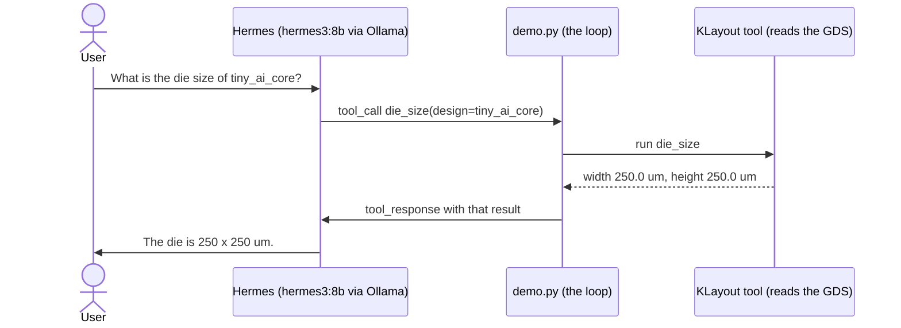

# Hermes + KLayout: a tiny agentic example

A learner's walkthrough. Everything is in one file, `demo.py` (99 lines, heavily
commented). It is deliberately minimal: it shows the possibility, it is not a
fully functional product (two tools, read-only, three steps at most). The full
system lives in `tools/eda_tools.py`, `tools/hermes_agent.py` and
`docs/HERMES_AGENT.md`; this demo imports none of them.

## The 30-second idea

A small local language model plus one precise tool is an assistant that answers
from the actual layout instead of guessing. The model never "remembers" a die
size; it asks KLayout, which reads the GDS file, and then repeats what it saw.



## Run it

```
make collect DESIGN=tiny_ai_core        # once, produces build/results/tiny_ai_core/tiny_ai_core.gds
ollama serve &                          # if curl -s localhost:11434/api/tags fails
ollama pull hermes3:8b                  # one time, 4.7 GB
build/agent/venv/bin/python examples/hermes_klayout_demo/demo.py            # live
build/agent/venv/bin/python examples/hermes_klayout_demo/demo.py --dry-run  # no model needed
```

`--dry-run` replaces the model with a scripted reply but still runs the real
KLayout tools, so the example teaches even when Ollama or the model is absent.
Both console outputs are saved: `transcript_live.txt`, `transcript_dry_run.txt`.

## Basics

- **Hermes** is an open model family from Nous Research trained to call
  functions. The 8B Q4_0 build (`hermes3:8b`) is 4.7 GB on disk and generates
  about 49 tokens/s on this Apple M4 Pro (source: `docs/HERMES_AGENT.md`,
  "Model, memory, speed").
- **Ollama** downloads the model and serves it on `localhost:11434`. `demo.py`
  talks to its `/api/chat` endpoint with plain `urllib`; nothing leaves the machine.
- **KLayout's Python API** (`import klayout.db as db`) turns a GDS file into
  data: a `Layout` holds cells, a cell has a bounding box (`dbbox()`, microns)
  and shapes per layer (GDS layer/datatype pairs such as met4 = 71/20). Two
  short functions in `demo.py` (`die_size`, `count_shapes`) are all it takes.
- **Agentic** here means three things: the model chooses an action, the
  program (not the model) executes it, and the model sees the result and
  decides again. That cycle is the loop in `run()`.

## Intuitions

1. **Tools beat model memory.** The numbers in the answer come from the file.
   A model cannot hallucinate a die size it was just handed in a
   `<tool_response>`. The system prompt says "answer only from tool results".
2. **The loop matters.** The default question has two parts (die size, then a
   shape count). One tool call cannot answer it; the loop lets the model gather
   what it needs, then stop. Our run needed two calls and a final answer.
3. **Read-only and a step cap.** A small model should look at a chip, not
   change it. Both tools only read, errors are returned to the model as data,
   and `range(3)` guarantees the loop ends even if the model keeps calling tools.
4. **The prompt format matters.** In the full system's eval, Ollama's native
   `tools` field scored 6/15 while the Hermes prompt format (tools as JSON in
   `<tools>`, replies in `<tool_call>` tags) scored 12/15, because the hermes3
   template drops the system prompt when `tools` is set (source:
   `docs/HERMES_AGENT.md`, evaluation table). `demo.py` therefore uses the
   prompt format.
5. **Small models: good at lookups, shaky at comparisons.** The same eval had
   3 failures out of 15, all of them comparisons or condition-filtering (worst
   slack picked the wrong corner, smallest area ignored a filter, most
   std cells compared only two designs; source: `docs/HERMES_AGENT.md`).
   Single-fact lookups like this demo's passed. Measure before trusting.

## Productivity

By hand: launch the KLayout GUI, open the GDS, find the top cell, use the ruler
or bbox to read the size, open the layer list, select met4, and count shapes
(or write a script). With the agent: one sentence, answer in seconds (the full
system's median is 2.4 s per question, `docs/HERMES_AGENT.md`). It runs offline
and private, since the model, the GDS and the loop are all local.

Where it stops: it does not change designs, debug failing flows, or reason
reliably over many designs at once. It is a fast, honest reader of facts.

## Walkthrough of the live transcript

`transcript_live.txt` (from a real run, `temperature 0`):

```
QUESTION: What is the die size of tiny_ai_core, and how many met4 shapes does it have?

[1] ACT     die_size({"design": "tiny_ai_core"})
[1] OBSERVE {"width_um": 250.0, "height_um": 250.0}
[1] ACT     count_shapes({"design": "tiny_ai_core", "layer": "met4"})
[1] OBSERVE {"layer": "met4", "shapes": 4}
[2] ANSWER  The die size of the design tiny_ai_core is 250 um in width and 250 um in height. ...
```

1. **THINK (step 1, not printed):** the model reads the question and the tool
   list and replies with text containing two `<tool_call>` blocks. Its
   reasoning is implicit; what we see is its decision.
2. **ACT:** `demo.py` parses each call and runs the matching Python function.
   Note the model asked for both tools in one reply; the parser accepts several
   calls and tolerates a missing closing tag (Ollama can swallow it).
3. **OBSERVE:** the real KLayout results are appended as `<tool_response>`
   messages. 250.0 x 250.0 um matches the die size in `docs/HERMES_AGENT.md`.
4. **ANSWER (step 2):** the model sees both results and replies without a tool
   call, which the loop treats as the final answer.

The dry-run transcript shows the same shape, but the "model" is a script with
one call per step, so it takes three steps.

## Where this is not enough (read this)

- The model reply format is parsed with a regex; malformed calls become errors.
- Only four metal layers, one GDS per design, no cell selection.
- No evaluation here. Trust the full system's eval, not this demo.

## Going further

- `tools/eda_tools.py`: the real tool set (10 tools: metrics, layout summary, comparisons).
- `tools/hermes_agent.py`: the full agent with both modes and the rules prompt.
- `tools/mcp_server.py`: the same tools over MCP, usable from any MCP client.
- `tools/eval/`: questions with ground truth and a runner. Measure before trusting.
- `docs/HERMES_AGENT.md`: setup, scores and honest failures.
