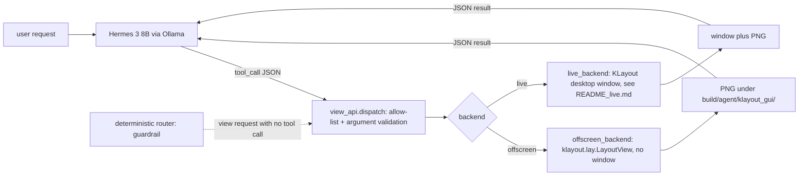

# Hermes drives a KLayout view (educational)

A local text-only model (`hermes3:8b` through Ollama) controls a layout viewer with seven coarse, read-only commands:
"open kv_attn_n8, show only li1 and met1, zoom to the lower-left 50 x 50 um, snapshot". The model does not click and does not
see pixels; it chooses commands, code executes them, and the result comes back as JSON (bounding box, visible layers, PNG path).
Educational only; nothing here changes a layout or a design file.

## What it can and cannot do

| Can | Cannot |
|---|---|
| open any design's GDS (`open_design`) | edit, route, fix or write any layout file (read-only by construction; tested by a GDS sha256 check) |
| zoom to a cell, an instance name (`mprj`), a um box, or the full design | look at the picture: it is a text model, it reasons only from numbers and file names |
| show only chosen layers (`met4`, `li1`, `68/20`, `met4/drawing`) | find a feature "that looks wrong": no vision, no geometry search |
| mark DRC violations from the flow's KLayout report (0 here: the designs are DRC-clean) or demo boxes | invent errors: demo markers are labelled demo, never real |
| measure a distance between two um points, render a PNG snapshot, report state | click GUI menus, run flows, use Docker, leave `build/agent/klayout_gui/` for output |

## Architecture



Files:

- `view_api.py`: the shared interface. `ViewBackend` (7 methods, all return `{ok, ...}` dicts and never raise), `TOOLS` (Ollama/OpenAI style schemas), `dispatch(backend, name, args)` (tool allow-list, required/unknown arguments, types, ranges), plus shared helpers (layer parsing reuses `tools/eda_tools.py`).
- `offscreen_backend.py`: option A, `klayout.lay.LayoutView` with the sky130A layer properties (`.lyp` from the PDK if installed, otherwise default colours). Needs no display.
- `agent.py`: the ReAct loop in the style of `examples/hermes_harness/harness.py` (prompt-mode Hermes function calling, parser and HTTP helper reused from `tools/hermes_agent.py`), the router guardrail, `--dry-run`, `--backend offscreen|live`.
- `demo.py`: five scripted scenarios. `tests/tools/test_klayout_gui.py`: pytest, no Ollama.

The router guardrail: if a request is about the view (words like show, zoom, highlight, snapshot, a met layer) and the model answers without any view tool call, the answer is rejected once with the suggested tool; if it misses again, the router makes that first call itself (`[router]` in the trace). Non-view questions are left alone.

## Run it (option A, offscreen)

```bash
make doctor                                   # tools, PDK
make collect DESIGN=tiny_ai_core              # GDS under build/results/ (git-ignored); the demos use the committed flow outputs if collected
build/agent/venv/bin/python examples/hermes_klayout_gui/agent.py --dry-run               # scripted calls, no Ollama
build/agent/venv/bin/python examples/hermes_klayout_gui/agent.py "open kv_attn_n8, show li1 and met1, zoom to the lower-left 50x50 um, take a snapshot"
build/agent/venv/bin/python examples/hermes_klayout_gui/demo.py --dry-run --save-img     # 5 scenarios -> transcript_dry_run.txt
build/agent/venv/bin/python examples/hermes_klayout_gui/demo.py --live                   # same with hermes3:8b -> transcript_live.txt
build/agent/venv/bin/python -m pytest -q tests/tools/test_klayout_gui.py
```

Option B (a real KLayout desktop window driven by the same seven commands, `--backend live`) is described in [README_live.md](README_live.md).

## Results (measured)

Scenarios (`agent.SCENARIOS`; expected = the tool names in order, extra calls allowed). Transcripts: `transcript_live.txt` (hermes3:8b, temperature 0, seed 42) and `transcript_dry_run.txt` (scripted).

| Scenario | Live Hermes tool sequence | Right sequence | Seconds |
|---|---|---|---|
| wrapper `user_project_wrapper_soc_kv`: only met4+met5, zoom to macro `mprj`, snapshot | open_design, show_layers, zoom_to, snapshot | yes | 4.7 |
| `kv_attn_n8`: li1+met1, lower-left 50x50 um, snapshot | open_design, show_layers, zoom_to, snapshot | yes | 4.4 |
| `tiny_ai_core`: highlight DRC markers | open_design, highlight_drc (0 markers, reported as DRC-clean) | yes | 2.5 |
| `tiny_ai_core`: demo markers + snapshot | open_design, highlight_drc(demo), snapshot | yes | 3.6 |
| `vision_block`: full view, measure two points | open_design, zoom_to, measure (72.111 um) | yes | 3.5 |

5 of 5 scenarios completed with the right tool sequence and valid arguments, with no router intervention and no rejection. Latency is 2.5 to 4.7 s per scenario (2 model turns each) on this machine after the model is loaded; the very first live run paid 11 s for loading the model into memory. Tool execution itself takes 0.00 to 0.15 s per call. An earlier first run scored 4/5 only because my expected sequence for the DRC scenario wrongly required a snapshot that the request never asked for; the expectation was corrected, the model behaved the same. These are five easy, single-pass requests at temperature 0: an anecdote about plumbing, not an evaluation of Hermes. The deterministic parts are covered by pytest instead (`tests/tools/test_klayout_gui.py`).

Representative images (in `img/`, each under 300 KB): `wrapper_met4_met5_mprj.png`, `kv_attn_n8_li1_met1_corner.png`, `tiny_ai_core_demo_markers.png` (red boxes are the demo markers, not errors).

## Honest limits

- Text-only: the model reports what the tools returned (bbox, layers, file path). It cannot judge a picture; a vision model would be a different experiment.
- DRC "highlight" shows what the flow's KLayout DRC report contains. The committed designs are DRC-clean, so the honest result is 0 markers (source: the newest `*klayout-drc/reports/drc.klayout.lyrdb` of the design's runs, cross-checked against `output/reports/drc_klayout.json`). The demo box overlay exists only to make the feature visible.
- Needs the local GDS (`build/results/<d>/<top>.gds`, from `make collect`, git-ignored) or a committed `output/*.gds` (none are). Without it the tool returns an error dict.
- The zoomed window follows the 4:3 snapshot aspect, so `view_bbox_um` can be wider than the requested box.
- Marker layer 1000/0 exists only in memory; layer names come from the small map in `tools/eda_tools.py`, so unnamed layers show as `L/D` only.
- Small model: it can pass a bad argument; `dispatch` returns the error and the model may retry (step cap 10, tool-call cap 8, 240 s).
