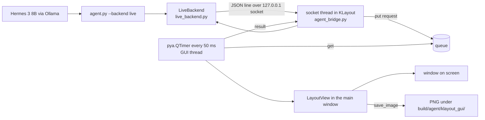

# Live KLayout window bridge (option B)

Educational example. A local Hermes 3 8B model drives a real KLayout desktop window through the same
seven coarse, read-only commands as the offscreen backend (`view_api.py`): `open_design`, `zoom_to`,
`show_layers`, `highlight_drc`, `measure`, `snapshot`, `state`.

## How it works



Protocol: one JSON object per line. Request `{"id", "method", "params", "token"?}`, reply
`{"id", "result": {...}}` or `{"id", "error": "..."}`. The method names and parameters are exactly
the `ViewBackend` methods, so `view_api.dispatch()` and the tool schemas are shared with option A.
The bridge reuses `view_api` helpers (GDS lookup, layer parsing, bbox checks, PNG path rule), so both
backends accept and refuse the same inputs.

## Why the GUI-thread queue matters

Qt and KLayout's `pya` objects (main window, layout view, markers) may only be touched from the GUI
thread. A socket server needs its own thread to block on `accept` and `readline`. If that thread called
`view.zoom_box(...)` directly, the result would be random crashes or silent corruption. So socket
threads only parse text and put `(method, params, slot)` on a queue, then wait on an event. A
`pya.QTimer` firing on the GUI thread every 50 ms drains the queue, runs the pya calls, and sets the
event; the socket thread then writes the reply. A side effect: a modal dialog in the window pauses the
timer, and the client sees a clear timeout instead of a hang. This build path uses a Python `socket`
thread rather than `pya.QTcpServer` because it needs no optional Qt network bindings.

## Security

- Binds `127.0.0.1` only (never `0.0.0.0`); not reachable from other machines.
- Optional shared secret: set `KLAYOUT_AGENT_TOKEN` in both processes; it is checked on every request
  with a constant-time compare.
- Read-only: the bridge never saves a layout, never runs shell commands, never evals received text. The
  only file it writes is a PNG, and only under `build/agent/klayout_gui/` (same rule as option A).
  Designs are opened by name from the repo, not by arbitrary path.
- Method allow-list: anything except the seven view methods (plus `ping`) is refused. `quit` exists only for
  test harnesses and only if the window was started with `KLAYOUT_AGENT_ALLOW_QUIT=1`.
- Request lines are capped at 1 MB; each request has a 60 s timeout.

## How to run

```
bash examples/hermes_klayout_gui/start_live.sh [design]        # opens the window, prints the port (8765)
build/agent/venv/bin/python examples/hermes_klayout_gui/agent.py --backend live "open kv_attn_n8 and show only met1 and met2"
```

`start_live.sh` runs `klayout -e -rm examples/hermes_klayout_gui/klayout_macro/agent_bridge.py`
(`-e` = GUI edit mode, `-rm` = run this macro at startup and keep the window). Environment:
`KLAYOUT_AGENT_PORT`, `KLAYOUT_AGENT_TOKEN`, `KLAYOUT_BIN`. Close the window to stop the bridge.
If KLayout is not running, `LiveBackend` fails at once with: "KLayout is not running or the bridge is not
listening on 127.0.0.1:8765 ...; start it with: bash examples/hermes_klayout_gui/start_live.sh".

Tests (no window needed): `build/agent/venv/bin/python -m pytest -q tests/tools/test_klayout_live.py`.
Opt-in with a real window: `KLAYOUT_LIVE=1 build/agent/venv/bin/python -m pytest -q tests/tools/test_klayout_live.py`.

## What was measured

Measured 2026-10-06 on the build Mac (KLayout 0.30.12 app, after the owner approved it for Gatekeeper), hermes3:8b local.

- `KLAYOUT_LIVE=1 pytest -q tests/tools/test_klayout_live.py`: 11 passed in 18.7 s, including the real-window test
  (start the app with the bridge, open `kv_attn_n8`, zoom, layers, PNG snapshot).
- Direct client calls on the live window, 0.10 to 0.40 s each: `open_design`, `show_layers`, `zoom_to` (cell, bbox, full),
  `highlight_drc` (0 markers from `67-klayout-drc/reports/drc.klayout.lyrdb`, the design is DRC-clean), `snapshot`, `state`.
- Live Hermes requests through `agent.py --backend live`, right tool sequence each time, no router intervention:

| Request | Tool calls | Time |
|---|---|---|
| user_project_wrapper_soc_kv: only met4 and met5, zoom to the macro `mprj`, snapshot | open_design > show_layers > zoom_to > snapshot | 11.3 s (first call, model load) |
| kv_attn_n8: li1 and met1, lower-left 50 x 50 um, snapshot | open_design > show_layers > zoom_to > snapshot | 4.7 s |
| tiny_ai_core: highlight the DRC markers, how many | highlight_drc (0 markers) | 1.9 s |

  Pictures from the live window: `img/live_wrapper_met4_met5_mprj.png` (the wrapper's met4 / met5 straps over the
  300 um KV macro) and `img/live_kv_attn_n8_li1_met1_corner.png`.

Bugs found and fixed while measuring:
- `zoom_to {"cell": "mprj"}` failed in the window: the bridge matched cell names only, while `mprj` is an instance name
  (GDS property 61 on the instance). The bridge now checks instance names first, like `offscreen_backend.py`.
- The opt-in test never saw the bridge: the test module sets `KLAYOUT_AGENT_NOSTART=1` for the offline tests and the
  real window inherited it. The test now removes it from the child's environment and keeps the window's output in
  `build/agent/klayout_gui/live_test_klayout.log`.
- KLayout ignores SIGTERM: a plain `pkill` leaves windows open (several piled up during debugging, and the first one kept
  the port with old code). Stop it with the window's close button, the `quit` admin call (`KLAYOUT_AGENT_ALLOW_QUIT=1`),
  or `pkill -9 -f klayout.app`. After the test's `quit` one window still remained open; not investigated further.
- First launch after the Gatekeeper approval was slow (first-start dialog); later launches listen within about 2 s.

## Limits

- Hermes 3 8B is text only: it cannot see the window or the PNG. It reasons from the numbers the
  commands return (bbox, visible layers, marker count), not from pixels.
- One window, one open design at a time; `open_design` replaces the current layout.
- macOS permissions: the first launch of a downloaded app needs a Gatekeeper approval; the window
  must be on a logged-in desktop session. A modal dialog in KLayout blocks the bridge (timeout error).
- Layer names: the default layer list has no sky130 `.lyp`, so the window shows GDS numbers (68/20 ...).
- The designs are DRC-clean, so `highlight_drc` honestly shows 0 markers; `demo_markers=true` draws
  five labelled demo boxes that are not real errors.
