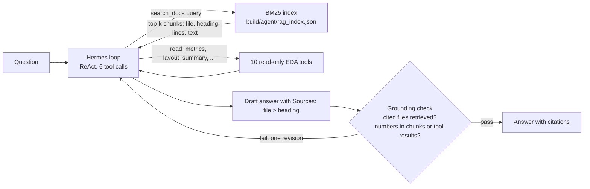

# Hermes + RAG: answering "why" questions from the repo's own documents

The existing Hermes agent answers number questions by calling read-only tools on `metrics.json` and the layouts. Many
useful questions are not numbers: why a design has more flip-flops, what fixed a congestion error, why a setting is 20
and not 70. The answers are written in `NOTES.md`, `README.md` and `docs/`. This example adds RAG so the agent can find
and cite them. Everything is local: BM25 in the Python standard library, the same `hermes3:8b` in Ollama, no embedding
model, no download, no network beyond localhost.

## Three ideas, three layers

| Idea | What it is | Where it lives here |
|---|---|---|
| Tool calling | The model asks code to run a function and reads the result | `tools/eda_tools.py` (10 read-only tools) |
| RAG | Retrieve the relevant text first, then answer from it and cite it | `rag.py` (index + BM25 + the `search_docs` tool) |
| Harness loop | The code around the model: loop, budgets, validation, grounding check, trace | `examples/hermes_harness/harness.py`, reused by `rag_agent.py` |

RAG is itself exposed as one more tool, so the model decides when to retrieve. The harness decides when to stop and
whether the answer is grounded.



## Files

- `rag.py`: the index and the tool. Corpus = `git ls-files '*.md'` minus `.claude/`, `CLAUDE.md`, `examples/` and
  `docs/HERMES_AGENT.md` (the agent's own docs quote the eval questions), 67 files. Each file is split at markdown
  headings (long sections at 30 lines): 1023 chunks, each with file path, heading path and line range. BM25
  (k1 1.5, b 0.75) over lower-cased tokens; identifiers such as `kv_attn_n8_int4` are indexed whole and in parts; heading
  words count double; at most 2 chunks per file in one result; the returned text is the best 800-character window of the
  chunk for the query. Ties break by file and line, so results are deterministic. The cache
  `build/agent/rag_index.json` stores the sha256 of every file and is rebuilt only when a file is added, removed or changed.
  API `search_docs(query, k=4)` returns a list of `{file, heading, lines, score, text}`; `TOOL` is its schema in the style
  of `eda_tools.TOOLS`; `call(args)` never raises.
- `rag_agent.py`: the harness ReAct loop with the 10 EDA tools plus `search_docs`, a prompt paragraph, and `rag_grounding`.
- `eval_rag.py`, `questions_rag.json`: the evaluation (12 questions, expected source files and keyword checks).
- `results_summary.json` (prompt v2) and `results_summary_prompt_v1.json`: committed measured results.
- `tests/tools/test_rag.py`: deterministic tests (index, search, recall floor, grounding check).

## Grounding check for RAG answers

`rag_grounding` returns a list of problems; any problem triggers one revision turn (as in the harness):
1. every cited `*.md` path must be one of the files returned by a `search_docs` call in this episode;
2. an answer that is not "unknown" must cite at least one file when chunks were retrieved (file + heading in `Sources:`);
3. every number in the answer (the `Sources:` tail is removed) must appear in a retrieved chunk or a tool result, or be a
   sum, difference or ratio of two of them (`harness.grounding_check`, reused), and design names must appear in them.

## How to run

```
python3 examples/hermes_rag/rag.py "why slew margin 20 not 70"            # ranked hits, no LLM
build/agent/venv/bin/python examples/hermes_rag/rag_agent.py "What fixed GRT-0116 congestion for tiny_ai_core?"
build/agent/venv/bin/python examples/hermes_rag/rag_agent.py "..." --no-rag       # EDA tools only
python3 examples/hermes_rag/eval_rag.py --retrieval-only                  # recall@k, deterministic
build/agent/venv/bin/python examples/hermes_rag/eval_rag.py --summary     # + end-to-end, 3 configs (about 6 min)
build/agent/venv/bin/python -m pytest tests/tools/test_rag.py
```

`rag_agent.py` prints on stderr each tool call, the retrieved chunk ids and files, the citations and any grounding
problems; the answer goes to stdout; a JSONL trace goes to `build/agent/traces/`. Run only one Ollama job at a time.

## Measured results

Questions: 10 "why / how / what fixed" questions whose answers are in the docs (not in `metrics.json`) plus 2
unanswerable controls (`questions_rag.json`; each expected answer was checked in the named source file). Model
`hermes3:8b`, temperature 0, seed 42. Files: `results_summary.json` (run `build/agent/rag_eval_20261006_144926.json`) and
`results_summary_prompt_v1.json` (run `build/agent/rag_eval_20261006_144444.json`).

(a) Retrieval only, the question text as the query, 10 answerable questions (deterministic):

| recall@1 | recall@2 | recall@4 | recall@8 |
|---|---|---|---|
| 6/10 | 6/10 | 9/10 | 10/10 |

Rank of the first expected source file per question: r01 4, r02 7, r03 4, r04 1, r05 1, r06 1, r07 1, r08 1, r09 1, r10 3.
Questions r01, r02 and r03 need k above 2 because several `kv_attn_*` or wrapper documents share the same words.

(b) End to end, keyword checks (`tools/eval/run_eval.score`, the "Source" tail removed). Prompt v2 (adds routing rules
written after the v1 run); prompt v1 gave the same pass counts:

| Config | Total /12 | Answerable /10 | Controls /2 | Called search_docs | Cited an expected file | Median s |
|---|---|---|---|---|---|---|
| tools-only (no RAG) | 4 | 2 | 2 | 0 | 0 | 5.21 |
| rag | 5 | 4 | 1 | 6 of 12 | 5 | 7.70 |
| rag + grounding | 5 | 3 | 2 | 6 of 12 | 5 | 7.45 |

Reading it: RAG raised the answerable passes (2 to 4 and 3; the 2 of tools-only are r06 and r07, which I believe pass by keyword, not by explaining anything; not checked answer by answer) and every answer that used it cited a real, retrieved file,
but half of the questions never called `search_docs`: the 8B model used `read_metrics`, `signoff_summary` or
`precheck_summary` for r02, r05 and r08 even after the routing rules of v2. The grounding check removed a false "unknown"
failure (control u01: 1/2 without, 2/2 with) but also lost one pass (r06). That r06 pass in the other two configs is a keyword accident: the answer lists check names such as `gpio_defines` from `precheck_summary` and does not explain the change, so the true answerable scores are lower than shown. Of the
searched questions, r03, r09 and r10 retrieved the right file but a chunk that did not contain the answer, so the
answer was wrong. 

## Honest limits

- BM25 is lexical: a question and a document must share words. Paraphrases ("halved" vs "3521 to 1809") miss; the
  right file is retrieved often (9 of 10 within 4) but the right chunk less often.
- 8B model at 4 bits: it picks tools unreliably, writes weak search queries and sometimes ignores the prompt's routing
  rules. One run per configuration on 12 questions is an anecdote: one question is 8 points, and the 5 vs 4 differences are
  within noise.
- The questions were written by us, after reading the docs, and the v2 prompt was written after seeing v1 failures on the
  same questions, so v2 is not a held-out result (it scored the same as v1 anyway).
- Keyword checks pass or fail on single words; they can pass a wrong answer and fail a right one.
- The grounding check is lexical: a cited file that was retrieved can still not support the claim, and it cannot judge
  headings. Retrieved text is untrusted data; the model cannot execute anything it contains.
- The corpus is the committed markdown at the time of the run; it excludes the Hermes docs on purpose.
