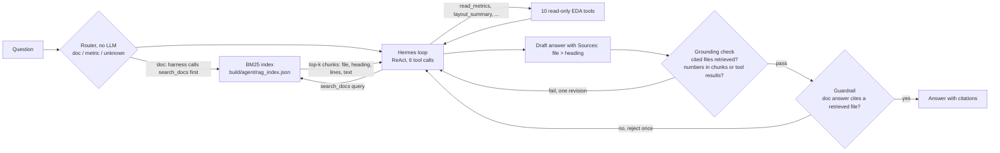

# Hermes + RAG: answering "why" questions from the repo's own documents

The existing Hermes agent answers number questions by calling read-only tools on `metrics.json` and the layouts. Many
useful questions are not numbers: why a design has more flip-flops, what fixed a congestion error, why a setting is 20
and not 70. The answers are written in `NOTES.md`, `README.md` and `docs/`. This example adds RAG so the agent can find
and cite them. Everything is local: BM25 in the Python standard library, the same `hermes3:8b` in Ollama, no embedding
model, no download, no network beyond localhost.

## Three ideas, three layers

| Idea | What it is | Where it lives here |
|---|---|---|
| Tool calling | The model asks code to run a function and reads the result | `tools/eda_tools.py` (10 read-only tools) |
| RAG | Retrieve the relevant text first, then answer from it and cite it | `rag.py` (index + BM25 + the `search_docs` tool) |
| Harness loop | The code around the model: loop, budgets, validation, grounding check, trace | `examples/hermes_harness/harness.py`, reused by `rag_agent.py` |

RAG is exposed as one more tool, but the first measurement showed that the 8B model does not reliably choose it (it called
`search_docs` on 6 of 12 questions). So the default for why/how questions is now classic RAG decided in code: a router
classifies the question and the harness retrieves before the first model turn (`--router`). The old model-chosen tool
configs are kept and reproducible.



## Files

- `rag.py`: the index and the tool. Corpus = `git ls-files '*.md'` minus `.claude/`, `CLAUDE.md`, `examples/` and
  `docs/HERMES_AGENT.md` (the agent's own docs quote the eval questions), 67 files. Each file is split at markdown
  headings (long sections at 30 lines): 1023 chunks, each with file path, heading path and line range. BM25
  (k1 1.5, b 0.75) over lower-cased tokens; identifiers such as `kv_attn_n8_int4` are indexed whole and in parts; heading
  words count double; at most 2 chunks per file in one result; the returned text is the best 800-character window of the
  chunk for the query. Ties break by file and line, so results are deterministic. The cache
  `build/agent/rag_index.json` stores the sha256 of every file and is rebuilt only when a file is added, removed or changed.
  API `search_docs(query, k=4)` returns a list of `{file, heading, lines, score, text}`; `TOOL` is its schema in the style
  of `eda_tools.TOOLS`; `call(args)` never raises.
- `rag_agent.py`: the harness ReAct loop with the 10 EDA tools plus `search_docs`, a prompt paragraph, and `rag_grounding`.
- `router.py`: the deterministic router (regular expressions, no LLM): `doc` (why, explain, what fixed/caused/limits, reason,
  lesson, knee), `metric` (how many cells, worst slack, which design has the most ...), otherwise `unknown`. Doc patterns win.
- `rag.py` also has `search_docs_v2` (see "Better retrieval"); `search_docs` (v1) is unchanged and is what the old configs use.
- `rag_agent.py` flags: `--router` (v2 search + retrieve-first for doc-type + the short prompt v3), `--guardrail`.
- `eval_rag.py`, `questions_rag.json`: the evaluation: 12 main questions and 5 held-out ones (`"heldout": true`), each with
  expected source files, a keyword check, a `route` label and `evidence` strings (the answer sentence).
- `results_summary.json`: committed measured results of the new run (with hand-check notes); `results_summary_v1.json` is the
  first run (before the router) and `results_summary_prompt_v1.json` its prompt-v1 variant.
- `tests/tools/test_rag.py`: deterministic tests (index, search v1 and v2, recall floors, router decisions, guardrail and
  retrieve-first with a stub model, grounding check).

## Grounding check for RAG answers

`rag_grounding` returns a list of problems; any problem triggers one revision turn (as in the harness):
1. every cited `*.md` path must be one of the files returned by a `search_docs` call in this episode;
2. an answer that is not "unknown" must cite at least one file when chunks were retrieved (file + heading in `Sources:`);
3. every number in the answer (the `Sources:` tail is removed) must appear in a retrieved chunk or a tool result, or be a
   sum, difference or ratio of two of them (`harness.grounding_check`, reused), and design names must appear in them.

## How to run

```
python3 examples/hermes_rag/rag.py "why slew margin 20 not 70"            # ranked hits, no LLM
build/agent/venv/bin/python examples/hermes_rag/rag_agent.py "What fixed GRT-0116 congestion for tiny_ai_core?"
build/agent/venv/bin/python examples/hermes_rag/rag_agent.py "..." --no-rag       # EDA tools only
build/agent/venv/bin/python examples/hermes_rag/rag_agent.py "Why ...?" --router --guardrail   # retrieve first + guardrail
python3 examples/hermes_rag/eval_rag.py --retrieval-only                  # recall@k v1 and v2, router accuracy, no LLM
build/agent/venv/bin/python examples/hermes_rag/eval_rag.py               # + end-to-end, 6 configs x 17 questions (about 17 min)
build/agent/venv/bin/python examples/hermes_rag/eval_rag.py --make-summary build/agent/rag_eval_<ts>.json --handcheck <file>
build/agent/venv/bin/python -m pytest tests/tools/test_rag.py
```

`rag_agent.py` prints on stderr each tool call, the retrieved chunk ids and files, the citations and any grounding
problems; the answer goes to stdout; a JSONL trace goes to `build/agent/traces/`. Run only one Ollama job at a time.

## What changed and why

The first run (`results_summary_v1.json`) had four findings: the model called `search_docs` on only 6 of 12 questions, recall@1
was 6/10, in r03, r09 and r10 the right file was retrieved but the 800-character window missed the answer, and the end-to-end
answerable score went 2/10 -> 4/10. Changes (old configs keep their behaviour; every change is a new config or flag):

1. **Router + retrieve-first** (`router.py`, `--router`). Why/how/what-fixed questions are classified in code. For `doc` the
   harness runs `search_docs(question)` before the first model turn and puts the result into the conversation as a tool
   response (trace event `auto_retrieve`; the model may still call `search_docs` itself). Reason: the model does not reliably
   choose tools, so whether to retrieve is decided by code, and usage is guaranteed and visible in the trace.
2. **Guardrail** (`--guardrail`, `guardrail_problem`). A `doc` answer that cites no retrieved file (and is not "unknown") is
   rejected once with "call search_docs or cite a retrieved file".
3. **Better retrieval** (`rag.search_docs_v2`, standard library, deterministic): question words and filler removed and light
   stemming; file-path and heading tokens as a boosted field; a bonus for a query identifier (`kv_attn_n8_int4`, `wb_rst_i`,
   `GRT-0116`) that occurs verbatim in the chunk, and for chunks of `designs/<identifier>/`; a phrase bonus for adjacent query
   words; a bonus for "Intuitions and insights"-style headings when the question asks why or what limits (the repo's NOTES
   convention); near-duplicate chunks removed; two windows of about 600 characters per hit instead of one of 800 (a long table
   row is cut around the query words).
4. **Prompt v3**, short: use the retrieved text, 1 to 3 sentences, state the cause, cite `Sources: <file> > <heading>`, else unknown.

Held-out guard: 5 new doc questions (h01 to h05) were written and their answers located in the docs before any retrieval
tuning, and are reported separately. The weights of v2 were set by looking at the 10 original questions (and I looked at the
held-out recall afterwards, so it is a weak guard, not a clean test).

## Measured results

Model `hermes3:8b` (Ollama), temperature 0, seed 42, one run per config. Corpus: 1087 chunks from 68 files (1023 from 67 in the first run; it grew since the first run,
so v1 recall was re-measured: 5/10 now, 6/10 then). Files: `results_summary.json` (run `build/agent/rag_eval_20261006_160952.json`,
retrieval re-check `build/agent/rag_eval_20261006_161659.json`, hand-check `build/agent/rag_handcheck_20261006.json`).

(a) Retrieval only, question text as the query, deterministic. "evidence" = an answer string occurs in the text of the top-4
hits from an expected file (is the answer inside what the model sees).

| Search | Set | recall@1 | @2 | @4 | @8 | evidence in top-4 text |
|---|---|---|---|---|---|---|
| v1 (old) | 10 main | 5/10 | 5/10 | 8/10 | 10/10 | 4/10 |
| v2 (new) | 10 main | 8/10 (7/10 on 2026-10-07*) | 8/10 | 9/10 | 10/10 | 5/10 |
| v1 (old) | 5 held-out | 3/5 | 5/5 | 5/5 | 5/5 | 5/5 |
| v2 (new) | 5 held-out | 4/5 | 4/5 | 5/5 | 5/5 | 4/5 |

\* Re-measured 2026-10-07 after new markdown pages entered the BM25 corpus: v2 recall@1 dropped from 8/10 to 7/10;
the other columns and the router (16/17) are unchanged. Retrieval depends on the docs corpus, so it moves when docs are added.

recall@1 improves on both sets; the windows did not: evidence in the text is 4 -> 5 of 10 and 5 -> 4 of 5. Most evidence misses
are the right file but another chunk (r02, r09), or a paraphrase gap ("knee" versus "sweet spot" in r07). Router accuracy:
16/17 on the RAG questions (r08 "how many CPU cycles" is only in the firmware README but reads like a number question, so it is
routed `unknown`), 15/15 on the independent `tools/eval/questions.json` (13 `metric`, 2 unanswerable `unknown`).

(b) End to end. Keyword score = `tools/eval/run_eval.score`; hand-checked = I read every PASS answer and counted it only if it
states the documented cause (notes in the results json). "Main" = 12 questions (10 answerable + 2 controls), "held-out" = 5.
Context = questions where retrieved text was in the conversation; auto = injected by the harness; model = the model called
`search_docs` itself. Cited = the answer names an expected source file (answerable questions only: 10 main, 5 held-out).

| Config | Main /12 keyword | Main hand-checked | Answerable /10 | Controls /2 | Held-out /5 keyword | Held-out hand-checked | Context main + held-out | auto | model-called | Cited expected | Median s main |
|---|---|---|---|---|---|---|---|---|---|---|---|
| tools-only | 4 | 2 | 2 | 2 | 2 | 0 | 0 + 0 | 0 | 0 | 0 + 0 | 3.65 |
| rag (old, v1 search, model decides) | 5 | 3 | 4 | 1 | 3 | 2 | 6 + 5 | 0 | 11 | 6 + 5 | 5.99 |
| rag + v2 search (ablation) | 6 | 4 | 4 | 2 | 3 | 3 | 8 + 5 | 0 | 13 | 5 + 4 | 8.26 |
| rag + router | 8 | 7 | 6 | 2 | 4 | 4 | 9 + 5 | 14 | 0 | 7 + 5 | 9.52 |
| rag + router + guardrail | 8 | 7 | 6 | 2 | 4 | 4 | 9 + 5 | 14 | 0 | 7 + 5 | 9.62 |
| rag + router + guardrail + grounding | 8 | 7 | 6 | 2 | 4 | 4 | 9 + 5 | 14 | 0 | 7 + 5 | 9.65 |

Reading it:
- Usage: the old tool-only RAG had context on 6 of 12 main questions (model-called); the router gives 9 of 12 (all `doc`
  questions except r08, which is routed `unknown`) and 5 of 5 held-out, at no cost in model choice. The model never made a second
  `search_docs` call after the injected one (0 model-called in the router configs).
- Answerable keyword score 2 -> 4 -> 6 of 10 (tools-only, old rag, rag + router); hand-checked answerable 5 of 10 for the router
  configs (7 of 12 minus the 2 controls). Held-out 4/5 against 3/5 for old rag (2/5 hand-checked) and 0/5 hand-checked for tools-only.
- Keyword accidents: tools-only passes r06, r07, h02, h03 by words only; old rag passes r06, r07, h02, and the router configs
  still pass r07 (it describes the plot and never names tern or int4). The hand-checked column is the one to trust.
- The v2 search alone (no router) already helps the model-chosen config (4 of 12 hand-checked vs 3) because the model's own
  queries hit better chunks; most of the gain comes from forcing retrieval (7 of 12).
- Guardrail and grounding: no effect in this run. With retrieve-first and the short prompt every doc answer already cited a
  retrieved file (0 guardrail rejections, 0 grounding problems), so the three router configs gave identical answers. They are
  safety nets, tested with a stub model, not measured gains. The grounding check helped in the first run (a false "unknown" on a
  control) but is not needed here.
- Cost: the injected chunks make each doc answer slower (median 9.5 s vs 6.0 s old rag, 3.7 s tools-only).
- Still failing in the router configs: r02 (the answer blames hold time; the real limit is the 12.5 ns input delay on wb_rst_i),
  r05 (unpowered diodes become "unpowered netlist"), r09 (retrieved the right file, not the "Run time and memory" chunk) and
  r08 (routed `unknown`, the model used `read_metrics` and got an error). h01 retrieved the right file but the model invented
  a cause (attention head size) instead of the saturating 5-bit position counter.

## Honest limits

- Small and noisy: 12 + 5 questions, one run per config at temperature 0; one question is 8 points (6 points held-out). The
  8, 7 and 4 vs 5 vs 6 differences between neighbouring configs are within noise; the gap from 4 or 5 to 8 (7 hand-checked) is
  larger but still a single run.
- The router is a set of regular expressions I wrote after seeing the questions. It scored 16/17 on the RAG set and 15/15 on the
  tool questions, but novel phrasings will fall into `unknown`. It does not understand questions; "how many cycles" slipped.
- The v2 search weights were set by looking at the 10 original questions; the held-out five were looked at afterwards, so
  they are a weak guard. recall@1 gains (5 -> 8 of 10, 3 -> 4 of 5) are real on this corpus but small samples. The answer is
  inside the window for only 5 of 10 (4 of 5) questions; BM25 is lexical and misses paraphrases.
- Keyword checks pass wrong answers and fail right ones; the hand-check is one reader's judgement (me), notes are in the json.
- 8B model at 4 bits: it still misreads retrieved text (r02, r05, h01) and mixes neighbouring chunks; retrieval does not make
  it reason. Retrieved text is untrusted data; the model cannot execute anything it contains.
- The corpus is the committed markdown at the time of the run (root `README.md` is in it, so editing it can move recall);
  it excludes the Hermes docs on purpose.
