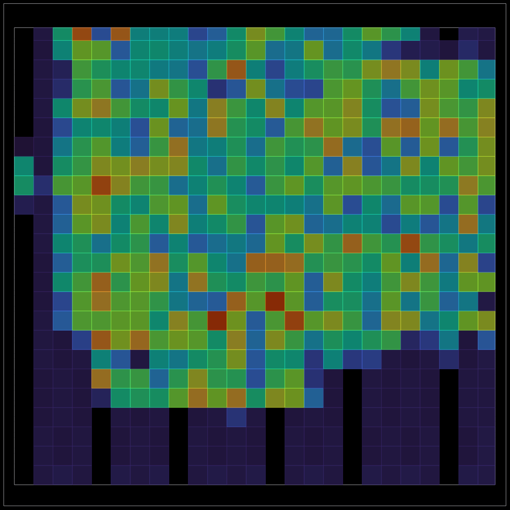
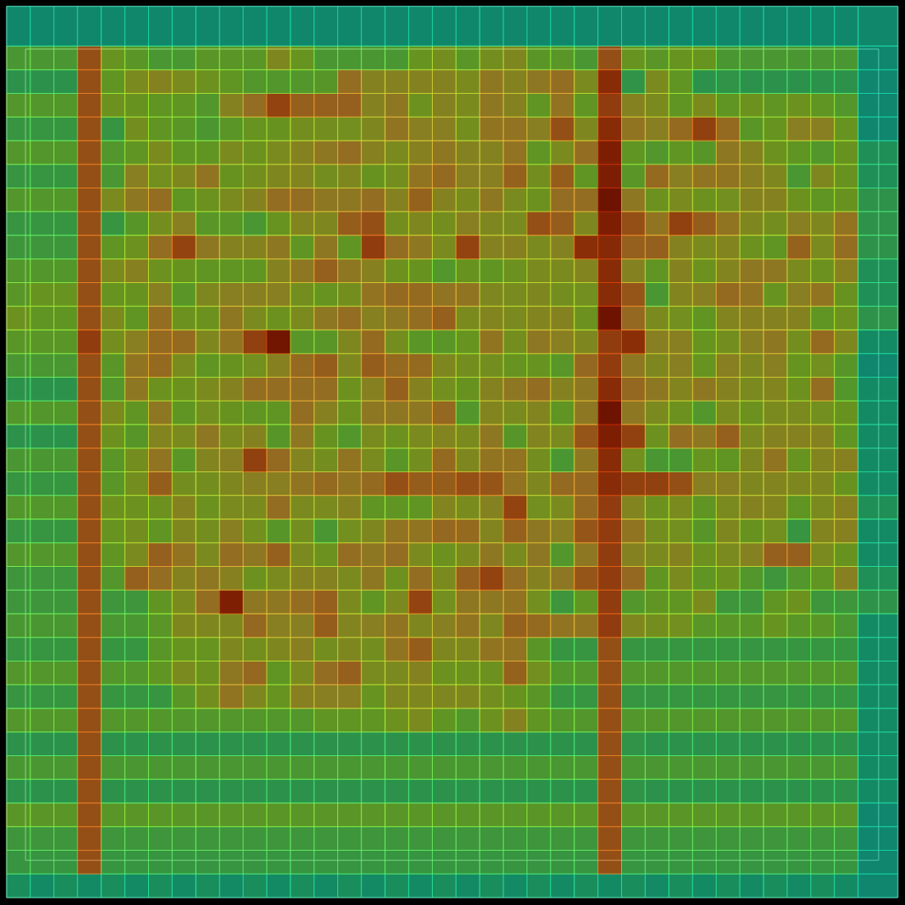
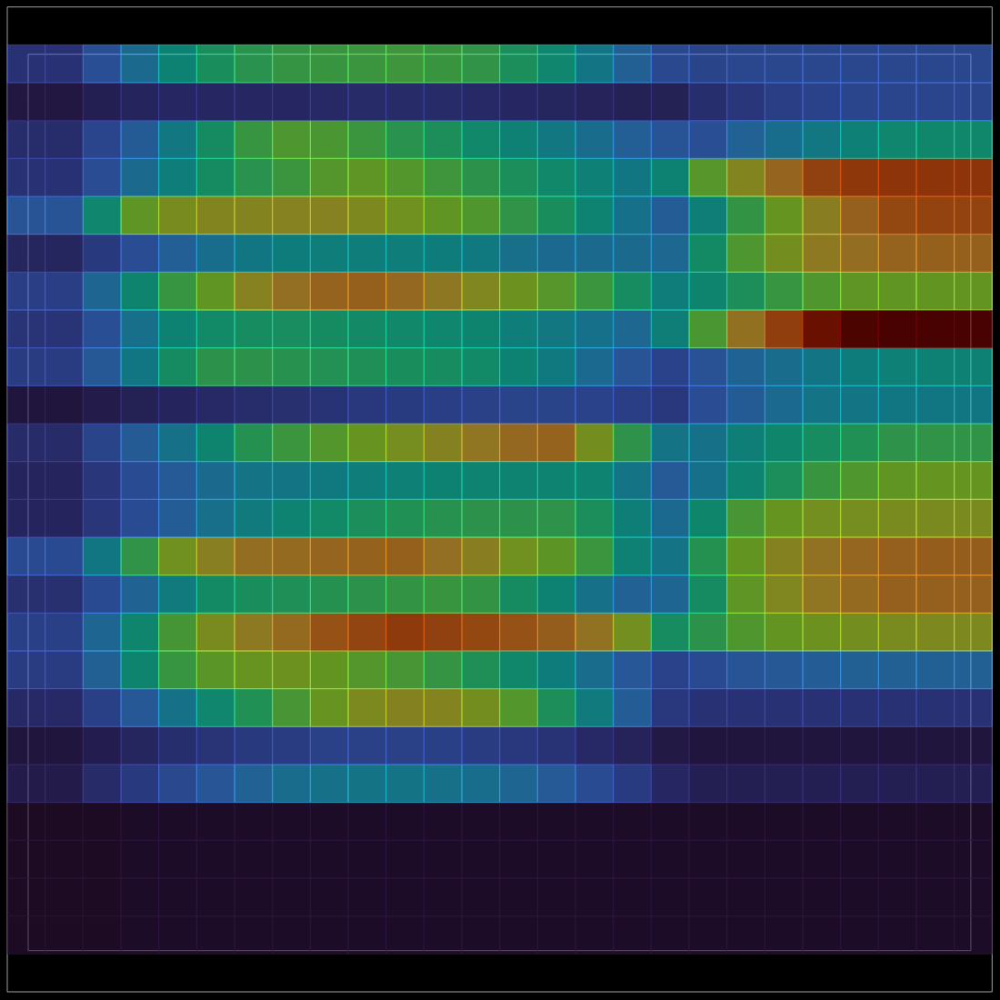
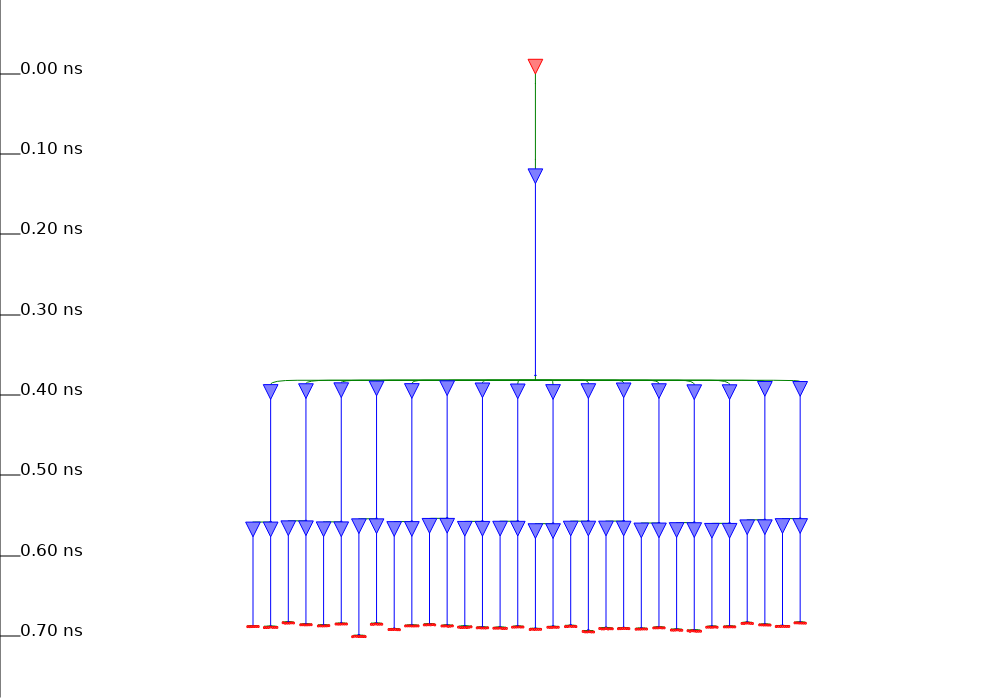
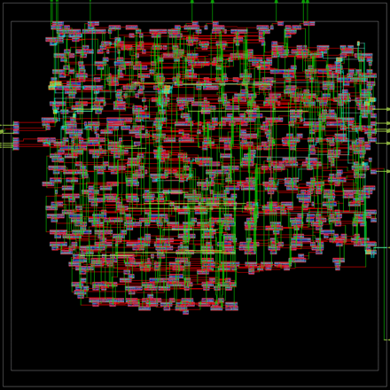

# OpenROAD's own GUI views, rendered off-screen

Educational example: open the final database (`final/odb/<top>.odb`) of a finished LibreLane run in OpenROAD's
Qt GUI, without a window, and save the pictures the GUI would show for each engine: gpl, grt, psm, cts, sta.
Nothing here runs a flow step, edits a design, or writes outside `build/agent/openroad_gui/`.
Background on the engines: [docs/OPENROAD_ENGINES.md](../../docs/OPENROAD_ENGINES.md). The interactive
viewing notes are also in [docs/GUI_AND_LOGS.md](../../docs/GUI_AND_LOGS.md) section 3.

## Run it

```bash
export DOCKER_HOST=unix://$HOME/.colima/osl/docker.sock      # mac/Colima only, same as the Makefile
examples/openroad_gui/render_views.sh                         # default design kv_attn_n8, newest finished run
examples/openroad_gui/render_views.sh soc_kv_attn_n8          # the Caravel macro
examples/openroad_gui/render_views.sh kv_attn_n8 designs/kv_attn_n8/runs/RUN_2026-10-06_07-00-35   # a chosen run
open build/agent/openroad_gui/kv_attn_n8/                     # mac; Linux: xdg-open
```

It takes about 30 s per design. Output: `build/agent/openroad_gui/<design>/*.png` plus `render.log` (git-ignored).
Small copies of the kv_attn_n8 pictures are in `img/`. Files:

| File | Role |
|---|---|
| `render_views.sh` | picks the run, finds ODB/SPEF/SDC, mounts the repo and the PDK, runs one container with `timeout` |
| `views.tcl` | the OpenROAD script: loads the data, switches display controls, calls `save_image`, prints `VIEW <name> OK/FAIL` |

The container gets `QT_QPA_PLATFORM=offscreen`; no X server is needed. The script is
`openroad -no_splash -gui views.tcl`: the GUI module is compiled into this image (`ord::openroad_gui_compiled` = 1,
OpenROAD 2026-02-17 build). The command is always wrapped in `timeout` because a Tcl error that escapes leaves the Qt
event loop running forever; `views.tcl` ends with `exit` and wraps every view in `catch`. The script refuses to start
if another container is running (one container at a time).

Inputs per design (read-only): `final/odb/<top>.odb` (the routed database, carries tech, cells, PDN, routing),
`final/spef/nom/<top>.nom.spef` and `final/sdc/<top>.sdc` (timing), and the nominal-corner liberty
`sky130_fd_sc_hd__tt_025C_1v80.lib` from `$PDK_ROOT` (the macro's own `final/lib` file has only the macro, not the
standard cells the SDC refers to). Timing therefore matches the `nom_tt_025C_1v80` corner.

## Things that were learned the hard way

- `save_image <file>` alone fails with `[WARNING GUI-0078] Failed to write image` off-screen: there is no visible viewer
  to "fit". It is not the Qt image plugins, the directory, or permissions. Always pass the area:
  `save_image -area {x0 y0 x1 y1} -width 1100 file.png` (microns; `views.tcl` uses the die area plus 2 um).
  `gui::save_image` is the low-level form with another signature; use the `save_image` wrapper.
- Heat maps are `gui::set_heatmap <Placement|Routing|Power|Pin|RUDY|IRDrop> rebuild` (settings: `Layer`, `Net`,
  `GridX`, `GridY`, `DisplayMin`, `DisplayMax`, `LogScale`, `ShowLegend`, `ShowNumbers`, `Alpha`) followed by
  `gui::set_display_controls "Heat Maps/<name>" visible true` with these names: `Placement Density`,
  `Routing Congestion`, `Power Density`, `IR Drop`, `Pin Density`. `gui::dump_heatmap <Name> file.csv` writes the same
  grid as numbers.
- Tcl 8.6 already has a `try` command; a helper with that name silently misbehaves. `views.tcl` calls it `view`.
- The IR drop heat map defaults to layer `li1`, which has no data; set `Layer met1` (the standard-cell rails).

## What renders and what does not

| View | Result | File |
|---|---|---|
| Full layout | rendered | `01_layout.png` |
| gpl: placement density | rendered | `02_placement_density.png` |
| grt: routing congestion | rendered | `03_routing_congestion.png` |
| Power density | rendered (static, from liberty and activity defaults) | `04_power_density.png` |
| psm: IR drop | rendered; `analyze_power_grid` is run first, as `irdrop.tcl` does | `05_ir_drop.png` |
| cts: clock nets and clock cells highlighted on the layout | rendered | `06_clock_tree_highlight.png` |
| cts: clock tree viewer (time vs. tree depth) | rendered with `save_clocktree_image -clock clk` | `06_clock_tree_viewer.png` |
| sta: worst setup path highlighted | rendered by walking `find_timing_paths`, `highlight_inst`, `highlight_net` | `07_worst_setup_path.png` |
| RUDY heat map | not possible from a script in this build: `gui::set_heatmap RUDY rebuild` works, but no `Heat Maps/RUDY` display control exists (GUI-0013), so it cannot be switched on. The grt `Routing Congestion` map is used instead. | none |
| `gui::show_worst_path`, timing report widget | not used: it fills a docked widget, which `save_image` does not capture; the highlight walk replaces it | none |

## How to read each picture

Pictures from `kv_attn_n8` (260 x 260 um die, utilisation 0.279 in `designs/kv_attn_n8/output/metrics.json`).
In every heat map hot (red/brown) means more, cool (blue/purple) means less; the legend is off in the PNG, so
use `gui::dump_heatmap` for numbers. The cells are the heat map grid (10 um by default), not the cells of the design.

### Placement density (gpl, [docs section](../../docs/OPENROAD_ENGINES.md#gpl-replace-global-placement))



RePlAce spreads cells by solving an electrostatic problem: cells are charges, density is the field to even out.
The map shows how full each bin is after placement. Look for a compact cloud with no dark-red bins (those would be
overfilled and cause congestion), and for empty margin (the blue bottom third here: the 0.288 target density in
`output/reports/placement_global.txt` leaves room, and utilisation is only 0.279). Numbers from this repo: the
`global_placement -density 0.288349 -routability_driven` command and HPWL per iteration in `placement_global.txt`.

### Routing congestion (grt, [docs section](../../docs/OPENROAD_ENGINES.md#grt-global-routing-fastroute))



FastRoute lays every net on a coarse grid of tiles with finite track capacity. The colour is demand against capacity
per tile. Vertical hot columns are the power stripes eating routing tracks; scattered hot tiles are dense logic.
A tile at 100 % or more is overflow, which is what the GRT-0116 failure in the harden-design skill is about. The
design routed clean: `global_route__wirelength` 54889 and `global_route__vias` 8443 in `metrics.json`, and detailed
routing ended at `route__drc_errors` 0. `output/reports/routing_global.txt` has the per-layer usage table.

### IR drop (psm, [docs section](../../docs/OPENROAD_ENGINES.md#psm-power-grid-analysis-pdnsim))



PDNSim builds a resistor network from the power-grid shapes (rails and stripes) and injects each cell's
current. The map is the voltage sag on net `vccd1`, layer met1. The bands follow the cell rows because the thin met1
rails carry the current; the bottom rows are empty and show nothing. The absolute numbers are tiny: worst drop 2.16e-04 V,
average 3.97e-05 V (0.01 %) in `output/reports/irdrop.rpt` and `ir__drop__worst`, `ir__drop__avg` in `metrics.json`.
The colour scale stretches the range, so a hot cell here is still microvolts. For `soc_kv_attn_n8` the worst drop is
6.74e-04 V (its `metrics.json`). The picture needs `analyze_power_grid` to have run in the same session, which `views.tcl` does.

### Clock tree (cts, [docs section](../../docs/OPENROAD_ENGINES.md#cts-clock-tree-synthesis-tritoncts))



The clock tree viewer plots time (vertical) against the tree: the red triangle is the root buffer, blue triangles are
buffers, red bars are flip-flop clock pins. Read it as a balance check: all leaf pins sit at about 0.69-0.70 ns, so the
skew is small. The repo numbers: `output/reports/cts.rpt` reports 49 buffers and 200 sinks; `metrics.json`
`clock__skew__worst_setup` is 0.2615 ns over all nine corners. `06_clock_tree_highlight.png` (not copied to `img/`, 0.9 MB) marks the same nets and the
cells on them over the layout.

### Worst setup path (sta, [docs section](../../docs/OPENROAD_ENGINES.md#sta-opensta))



OpenSTA finds the path with the least slack; the script highlights every instance and net on it (cyan/yellow on the
layout with the power grid hidden). A long path is physically long: the highlight shows where the logic depth and the
wire length come from. For the nominal corner the script prints `worst setup slack (ns): 15.245` which equals
`timing__setup__ws__corner:nom_tt_025C_1v80` 15.245 in `metrics.json` (the sign-off worst over all nine corners is
10.74 ns, `timing__setup__ws`; the clock period is 25 ns). That matches the flow's own number, a good check that the
inputs loaded correctly. For `soc_kv_attn_n8` the same line gives 6.50 ns.

The full layout (`01_layout.png`) and the power-density map (`04_power_density.png`) are in the build directory only.

## Open the OpenROAD GUI interactively

OpenROAD exists only inside `ghcr.io/librelane/librelane:3.0.2` (no `openroad` on the host). The GUI is Qt and needs
a display.

LibreLane flow names, verified in this image (`librelane --help` and the flow registry list `Classic`, `Chip`,
`OpenInOpenROAD`, `OpenInKLayout`, `OpenInMagic`, `Optimizing`, `VHDLClassic`, `SynthesisExploration`):

```bash
# same container recipe as the Makefile (run_librelane), plus a display
librelane designs/kv_attn_n8/config.json --flow OpenInOpenROAD --last-run      # opens the last run in the OpenROAD GUI
librelane designs/kv_attn_n8/config.json --flow OpenInKLayout  --last-run      # same, KLayout
```

These flows only open a viewer on the final state of a finished run. They were NOT executed here (no display on
the build host, and the viewer would wait for a window); only the flow names and the `--last-run` option are verified.
Use the Makefile's `docker run` line (`grep -n 'docker run' Makefile`) for the mounts and PDK variables, and add the
display options below.

### Linux (not tested)

```bash
xhost +local:docker
docker run --rm -it -e DISPLAY=$DISPLAY -v /tmp/.X11-unix:/tmp/.X11-unix \
  -v $HOME:$HOME -v $PWD:$PWD -w $PWD -e PDK_ROOT=$HOME/.volare -e PDK=sky130A \
  ghcr.io/librelane/librelane:3.0.2 \
  python3 -m librelane --manual-pdk --pdk-root $HOME/.volare --design-dir $PWD/designs/kv_attn_n8 \
  --flow OpenInOpenROAD --last-run $PWD/designs/kv_attn_n8/config.json
xhost -local:docker
```

Or open the database by hand inside the container: `openroad -gui`, then in the Tcl console
`read_db designs/kv_attn_n8/runs/<RUN>/final/odb/kv_attn_n8.odb`. Over ssh use `ssh -X host` first.

### macOS with Colima (verified 2026-10-06, XQuartz 2.8.6)

`bash scripts/gui/open_gui.sh openroad <design>` opens the final ODB of the current run in the OpenROAD GUI on XQuartz
(windows "OpenROAD - kv_attn_n8" and "OpenROAD - user_project_wrapper" were opened this way). One-time setup and the
details (TCP setting, `xhost +localhost`, `DISPLAY=192.168.5.2:0` inside Colima, harmless `qt.glx` warning) are in
[docs/GUI_AND_LOGS.md](../../docs/GUI_AND_LOGS.md) section 3. In the window, the heat maps of this page are under
View > Heat Maps (needs the run's SPEF/liberty for timing and IR views, which `views.tcl` loads; the plain opener loads
only the ODB).

## Tests

`tests/tools/test_openroad_gui.py`: always-on checks (files exist, `bash -n`, `views.tcl` has the needed commands, the
README paths exist, images are small PNGs); one opt-in render: `OPENROAD_GUI=1 build/agent/venv/bin/python -m pytest -q tests/tools/test_openroad_gui.py`
(needs Docker and a finished `kv_attn_n8` run).
