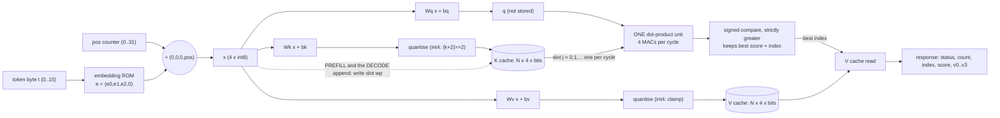

# tiny_kv_attention: specification of the `kv_attn_*` engines

One attention head, model dimension d = 4, a KV cache in registers, and the two phases of LLM inference: **PREFILL**
(a prompt streams in, keys and values are written to the cache) and **DECODE** (one token: query the cache serially with
ONE dot-product unit, pick the best entry, append). Five variants share one micro-architecture and differ in three
parameters.

This file is the **contract**: the RTL must match `model/kv_attention/golden.py` bit for bit and cycle for cycle on every
record of `designs/kv_attn_<v>/tb/vectors.hex`. If this text and `golden.py` ever disagree, `golden.py` is the reference
and the disagreement is a bug to report.

| file | role |
|---|---|
| `model/kv_attention/golden.py` | parameters, bit-exact + cycle-exact reference (`Engine.command`), task metrics (`--check`), per-step trace (`--trace [variant]`) |
| `model/kv_attention/gen.py` | writes `designs/kv_attn_<v>/rtl/kv_attn_<v>_rom.v` and `designs/kv_attn_<v>/tb/vectors.hex` (write-if-changed, sha256 header) |

Commands: `python3 model/kv_attention/golden.py --check`, `... --trace kv_attn_n8_int4`, `python3 model/kv_attention/gen.py`.
Python 3.9 standard library only, deterministic.

## 1. Variants

| design | N (cache entries) | KV bits | ring | cache bits = N x 2 x d x bits | DECODE latency (cycles, section 6) |
|---|---|---|---|---|---|
| `kv_attn_n8` (base) | 8 | 8 | 0 | 512 | n + 3, n = 0..7 |
| `kv_attn_n4` | 4 | 8 | 0 | 256 | n + 3, n = 0..3 |
| `kv_attn_n16` | 16 | 8 | 0 | 1024 | n + 3, n = 0..15 |
| `kv_attn_n8_int4` | 8 | 4 | 0 | 256 | n + 3, n = 0..7 |
| `kv_attn_n8_ring` | 8 | 8 | 1 | 512 | n + 3, n = 0..8 (n = 8 once wrapped) |

One RTL module with parameters `N` (4, 8, 16), `KV_BITS` (8, 4) and `RING` (0, 1); each design directory instantiates
it with its own `kv_attn_<v>_rom` (the five ROMs hold identical constants). The cache holds only the 4 key and 4 value
components per entry; the position is not stored separately (it is component 3 of k and v, section 2).

Top-level ports of every `kv_attn_<v>` (the 24-pin engine interface, same as the other stream engines):
`clk, rst` (synchronous, active high), `s_valid, s_data[7:0], s_last, s_ready` (input), `m_valid, m_data[7:0], m_last,
m_ready` (output). Plus the 24-pin budget as in the other designs (unused pins as in `designs/prec_int8`). Behind
`shared/rtl/wb_stream_adapter.v` the engine needs nothing else: software pushes the command bytes (TXDATA, the last one
with TXLAST) and drains the response with RXDATA; the engine never needs more than what the 24 ports carry.

## 2. Model, task and parameters (hand-picked, not trained)

**Vocabulary and task.** 16 tokens, `t = 4*a + b`: key id `a = t >> 2` (0..3, "A".."D"), value `b = t & 3` (0..3).
The prompt is a list of key-value tokens. A DECODE token `t` is a *query*: "what value was last stored under key `a`?"
The engine returns the value vector of the cached entry whose key best matches `a`, **the most recent one if several
tokens carry that key** (latest write wins), and then appends `t` itself (so a later query can find the new value). The
query never attends to its own token: it scores against the `n` entries cached **before** its own append. Order
matters: `[A1, A2]` and `[A2, A1]` give different answers to the query `A`.

**Why hand-picked.** The task needs a key match (a dot product of two 2-D sign vectors) and a recency preference
(a position term), both of which are exactly representable with tiny integers; a fit would only rediscover them with
less margin. The matrices have a clear structure, listed here and held in the ROM:

```
x      = EMB[t] + (0, 0, 0, pos)            pos = number of tokens cached since the last reset, saturating at 31
EMB[t] = ( e0, e1, e2, 0 )                  e0 = +1 if a & 2 else -1;  e1 = +1 if a & 1 else -1;  e2 = 2*b - 3  (-3,-1,1,3)
q = Wq x + bq,  k = Wk x + bk,  v = Wv x + bv        (all int8, matrices row-major, out_r = sum_c W[r][c]*x[c] + b[r])

Wq = diag(4, 4, 0, 0)            bq = (0, 0, 0, 1)      -> q = (4 e0, 4 e1, 0, 1)
Wk = diag(4, 4, 0, 1)            bk = 0                 -> k = (4 e0, 4 e1, 0, pos)
Wv rows: (0,0,1,0) (1,0,0,0) (0,1,0,0) (0,0,0,1)       -> v = (e2, e0, e1, pos)        bv = 0
```

* `score = q . k = 16 * (e . e') + pos_entry`, with `e . e' = +2` (same key), `0` (one key bit differs), `-2` (both differ).
  So a same-key entry scores `32 + pos` (32..63) and any other entry at most `31`: **a key match always beats a mismatch,
  and among matches the larger position (the more recent token) wins.** `HIT` (a key match exists) is `score >= 32`.
* The score range is exactly **-32 .. 63** (exhaustive check in `golden.py --check`; int4 K: -32 .. 60). It fits int8; the
  accumulator needs no saturation. RTL: signed 8-bit accumulate is enough (or 10 bits and truncate; the value never exceeds 8).
* `v0 = e2` is the value level; the recalled value is `b = (v0 + 3) / 2`. `v1, v2` repeat the entry's key bits, `v3` its position.
  The output carries all four so a human can see which entry was selected.
* The position table is the identity `x3 = pos` (nothing stored). Position is **not** wrapped: `pos` is a 5-bit saturating
  counter (`pos <= 31`). In the ring variant, recency therefore resolves only the first 32 tokens after a reset; beyond that
  all new entries carry pos 31 and tie (the lowest slot wins), see section 8.

## 3. KV storage format

* **int8** (default): the cache stores k and v as computed (int8).
* **int4** (`kv_attn_n8_int4`, KV_BITS = 4): each stored component is 4 bits signed (-8..7).
  * K: `k4 = clamp((k + 2) >> 2, -8, 7)` (arithmetic shift, i.e. divide by 4 rounding half up, saturate). The dot unit
    dequantises with `k_hat = k4 << 2` (`k4 * 4`, a wiring change) and multiplies with the unmodified int8 `q`.
    Key components `+-4` are exact (`+-1`); the position `pos` becomes `4 * min(7, (pos+2)>>2)`: **4 neighbouring positions
    collapse into one** and 30..31 saturate to 28. The key match margin is intact (`HIT` still means `score >= 32`).
  * V: `v4 = clamp(v, -8, 7)` stored as is (scale 1: `e2`, `e0`, `e1` are exact; `pos` saturates at 7). The V bytes in the response
    are the stored values sign-extended to int8.
  * Expected consequence (measured by `--check`): when two cached tokens carry the query's key and fall into the same
    4-position bucket, their scores tie and the lowest index (the *older* token) wins, a wrong recall.

## 4. Command protocol

A **command frame** is a sequence of input beats; `s_last` is high on its last beat. Beat 0 is the **opcode**.

| opcode | name | frame | meaning |
|---|---|---|---|
| `0x01` | RESET_CACHE | `[01]` | empty the cache: `count = wp = pos = 0` |
| `0x02` | PREFILL | `[02, t0, t1, ..., t(m-1)]`, m >= 0 | for each token in order: validate, compute k and v at the current `pos`, write the cache. No scoring. |
| `0x03` | DECODE | `[03, t]` | one token: compute q, k, v; score q against the `n` cached keys; select; append k, v |
| other | - | any length | BAD_OPCODE |

Frames are accepted one at a time: after `s_last` is accepted, `s_ready` stays low until the **last beat of the response has
been taken** (`m_valid && m_ready`). At reset `s_ready = 1`, `m_valid = 0`. Between frames the engine keeps no other state than
the cache, `count`, `wp`, `pos`.

**Response frames** (every beat 8 bits, `m_last` high on the last beat only):

| case | beats | contents |
|---|---|---|
| RESET_CACHE ok, PREFILL ok / error, any error | 2 | `[status, count]` |
| DECODE ok | 8 | `[status, count, index, score, v0, v1, v2, v3]` |

* `status[3:0]` = error code: `0` OK, `1` BAD_OPCODE, `2` BAD_TOKEN, `3` CACHE_FULL, `4` BAD_FRAME.
  `status[4]` = HIT (DECODE ok only: `n > 0` and `best score >= 32`). Other bits 0.
* `count` = number of valid cache entries **after** the command (0..N).
* `index` = physical slot (0..N-1) of the selected entry; `0xFF` when the cache was empty (n = 0).
* `score` = best score as int8 two's complement; `0` when n = 0.
* `v0..v3` = the selected entry's stored V, int8 two's complement (sign-extended from int4 in the int4 variant); all `0` when n = 0.
  A DECODE with `n > 0` and no key match still returns the best (non-matching) entry with HIT = 0: the caller must look at HIT.
* After an error response the engine state is as the rules below say (no hidden effects).

**Error rules** (checked in this priority order; the whole frame is always consumed first, because `s_last` decides validity):

1. **BAD_OPCODE**: beat 0 not in {1, 2, 3}. Frame consumed, no state change. Response `[1, count]`.
2. **BAD_FRAME**: RESET_CACHE with more than 1 beat; DECODE with 1 beat (no token) or more than 2 beats. No state change. `[4, count]`.
   (A DECODE frame with 3 beats is BAD_FRAME even if its second beat is also a bad token.)
3. **BAD_TOKEN**: a token byte > 15. DECODE: no state change, `[2, count]`. PREFILL: see below.
4. **CACHE_FULL** (non-ring variants only): `count == N` when a token must be written. DECODE: checked before scoring, no state change,
   `[3, count]`. PREFILL: see below. A ring variant never reports CACHE_FULL.

**PREFILL semantics.** Tokens are processed strictly in order. For each token: bad token (> 15) -> error BAD_TOKEN; else if the
cache is full and not ring -> error CACHE_FULL; else write. **The first error stops caching for the rest of the frame**
(later tokens are consumed and ignored); tokens before it stay cached (no rollback). BAD_TOKEN has priority over CACHE_FULL
for the same token. The response is `[first_error_or_0, count]`. A PREFILL with m = 0 tokens is valid and just returns
`[0, count]`. PREFILL response choice: an **acknowledgement with the cached-token count**, not an attention output: prefill's
job here is the streaming write of the cache (cost 1 cycle per token, independent of the cache length); attention over the
prompt is the DECODE's job. This keeps the cost contrast of the two phases visible in the cycle counts.

**DECODE semantics.** (1) validate frame, token, full (above); (2) `n = count`; q, k, v from the token at `pos`; (3) scores
`s_j = sum_i q_i * khat_j,i` for slots `j = 0 .. n-1` in increasing order; (4) best = the first slot with the maximum score
(**strictly greater replaces: the lowest index wins a tie**; the comparison is signed); (5) emit the response from the
state **before** the append; (6) append (section 5). The ring variant scores all `N` slots when full (`n = N`), including the
oldest slot, which the append then overwrites. Slot order is physical, not age order: after a wrap, a tie is broken towards
the lowest physical slot.

**Cache write (append)**: `slot = wp`; store the quantised k and v; `wp = (wp + 1) mod N`; `count = min(count + 1, N)`;
`pos = min(pos + 1, 31)`. A non-ring cache never writes at `count == N`; the ring overwrites slot `wp` (the oldest entry,
because writes go round-robin from slot 0). `RESET_CACHE` and `rst` clear `count, wp, pos`; cache data need not be cleared
(only slots `0 .. count-1` are ever read).

## 5. Dataflow



## 6. Cycle schedule (the contract the RTL must match)

Timing is defined on clock edges. **E1 = the edge at which the last input beat of the frame (the one with `s_last`) is
accepted** (`s_valid && s_ready` at that edge). Edge `E(i)` is the i-th edge counting E1 as 1. **Latency L** is the same
quantity `shared/tb/stream_tb.vh` measures: the number of edges from E1 up to and including the edge after which `m_valid`
is first seen high, i.e. `m_valid` is a flop set at edge `E(L)` and visible after it (`t_mv - t_last + 1`). All beats
before the last are accepted at arbitrary times (input gaps allowed); the schedule below does not depend on them. Output
back-pressure (`m_ready` low) delays only the later response beats, never L.

**Input phase (all opcodes).** `s_ready = 1` whenever the engine is idle or receiving. Every accepted beat is registered;
a PREFILL token accepted at edge `a` is validated and written at edge `a + 1` (one token per cycle, never back-pressured
by the write, since the write of token i finishes before token i+1 needs the cache). `s_ready` falls after E1 (it is a
flop, busy = 1 from E1 on) and rises after the edge that takes the last response beat.

| command | what happens at each edge after E1 | L |
|---|---|---|
| any BAD_OPCODE, BAD_FRAME, BAD_TOKEN, CACHE_FULL (DECODE) | E2: response register loaded | 2 |
| RESET_CACHE ok | E2: `count = wp = pos = 0`, response `[0, 0]` | 2 |
| PREFILL (any m >= 0, errors included) | last token written (or frame-end handled) at E2, response loaded at E2 | 2 |
| DECODE ok, n cached entries | E2: q, k, v computed and registered; best := none; `j := 0`. E3 .. E(n+2): at edge E(3+j) the dot unit forms `q . khat_j` for slot j and updates best/index (strictly greater). E(n+3): read V of the best slot, load the response register, append k and v at slot `wp`, update `count, wp, pos` | **n + 3** |

* DECODE with n = 0: E2 computes q, k, v; E3 loads the response `[0, 1, FF, 00, 00, 00, 00, 00]` and appends. L = 3.
* The decode scan reads the cache registers at the slot selected by the counter `j`; the append at E(n+3) writes slot `wp`
  (for the ring when full this is the oldest slot, after the scan has finished with it).
* **PREFILL cost per token = 1 cycle** (beats arrive at one per cycle and are written the next cycle), plus L = 2 after the last
  beat: prefilling m tokens takes `(m + 1) + 2` cycles from the first beat when beats arrive back to back (m tokens + the
  opcode beat; the number of cycles *per prompt token* is 1 and does not depend on the cache length).
* **DECODE cost = n + 3 cycles after the frame, growing with the cache length n** (serial scan, one dot-product unit); the
  input is 2 beats and the output 8 beats on top. Worst case: non-ring `N + 2` (n = N-1), ring `N + 3` (n = N).
* **Response beats.** `m_valid` rises after E(L) with beat 0. Each following beat appears in the cycle after the edge that
  accepted the previous one (`m_valid && m_ready`), so a response with no stalls occupies `n_out` consecutive cycles. While
  `m_valid && !m_ready`, `m_valid`, `m_data`, `m_last` must hold. `s_ready` rises after the edge that accepts the last beat.
  `s_ready` must be low from after E1 until then (testbenches check it).
* **Reset.** `rst` (synchronous) clears `count, wp, pos`, drops any frame in progress and any pending response, `m_valid = 0`,
  `s_ready = 1` at the cycle after the first reset edge.

Table of expected decode latencies and total cycles per generated token, from a cache of n entries (this is the schedule,
not a measurement of silicon): n + 3 core cycles; with the 2 input beats and 8 output beats at full rate about n + 13.

## 7. Memory (the ROM and the cache)

`kv_attn_<v>_rom` (constants only, **continuous `assign`s, never `always @(*)`**): input `token[3:0]`; outputs `emb[31:0]`
(`{e3,e2,e1,e0}`, int8 each, e0 in the low byte), `wq, wk, wv [127:0]` (entry (r,c) at bits `[8*(4*r+c) +: 8]`), `bq, bk, bv [31:0]`
(element r at `[8*r +: 8]`). The ROM hash header lets `make check-generated` detect a stale file. The RTL may let synthesis fold
the constant matrices (they have 1 non-zero entry per row) into wires and shifts; it must be arithmetic-equivalent to the matrix
products above.

Cache = `N` slots of `{K[4], V[4]}`, `bits` per component; flip-flops, no reset needed (not read before written). Bits per
variant: `N * 2 * 4 * bits` (table in section 1).

## 8. Behaviour to know (and test)

* **Exact ties cannot occur in the int8 non-ring variants** (positions are unique), so the lowest-index rule only matters in
  `kv_attn_n8_int4` (same 4-position bucket) and in the ring after position saturation (many entries at pos 31). The vector files
  exercise it there; for the others the rule is still part of the contract.
* **Ring window.** The ring answers exactly (100 %) against "the last N tokens" for the first 32 tokens after a reset. Against the
  unbounded oracle it forgets older keys by design. Beyond 32 tokens pos saturates and recency among same-key entries degrades
  (`--check` prints the 48-token figure). This is a limitation of the 5-bit position, stated here instead of hidden.
* **No-match decode**: HIT = 0 and the response describes the best-scoring non-matching entry; it is not an error.
* PREFILL partial failure leaves the cached prefix in place; the count in the response tells the caller how many were cached.

## 9. Vector file format (`designs/kv_attn_<v>/tb/vectors.hex`)

`$readmemh` of 8-bit words, **40-word records**, one record per line, `//` comments (labels) allowed. Record 0 is the header:
`A5, records hi, records lo, N, KV bits, ring, 01` (then zeros; "records" counts the records after the header). Records are played
**in order against one engine instance** (the state carries over; the testbench may also drive random input gaps and output
stalls, the expected values do not change). Array size: `reg [7:0] vec [0:40*(records+1)-1]`.

| word | meaning |
|---|---|
| 0 | type: `01` COMMAND, `02` RST_IDLE, `03` RST_MID, `04` RST_PEND |
| 1 | n_in: number of input beats (<= 28) |
| 2 | n_out: number of expected output beats (2 or 8; 0 for reset records) |
| 3 | expected latency L (section 6) |
| 4..11 | expected output beats (unused words 0) |
| 12..39 | input beats (unused words 0) |

* COMMAND: send beats 12.. with `s_last` on beat `n_in - 1`; take `n_out` response beats, check each `m_data`, `m_last` only on the last,
  and the latency (first `m_valid` relative to the `s_last` edge). Check `s_ready` low from the `s_last` edge until the last
  response beat is taken.
* RST_IDLE: pulse `rst` for 2 cycles (after the previous response has been taken); expect `s_ready = 1`, `m_valid = 0`.
* RST_MID: drive `n_in` beats (`s_last` = 0) then pulse `rst`.
* RST_PEND: send the whole frame, wait until `m_valid`, pulse `rst` without taking the response (outputs not checked).
* Coverage of each file (about 1200 to 2100 records, under 3000): every opcode and bad opcodes; every (cached token, query token)
  pair (256) as k/v/q and hit/miss; every fill level `n = 0..N` (the `n + 3` latency); empty / partial / full caches; BAD_FRAME,
  BAD_TOKEN, CACHE_FULL (non-ring: exact fill, +1, an `N+3`-token frame, two frames, bad token at several places) or ring wrap
  (prefill wrap, `N+3` decodes past the wrap, 27-token frame, position saturation with 40 same-key tokens); same-key chains
  (recency and int4 ties); resets idle / mid-frame / with a response pending; 60 random episodes (fixed seed); a final reset.

## 10. What this teaches (schedule and golden-model numbers, then hardened results)

The latency and accuracy numbers below come from the **schedule and the golden model** (`golden.py --check`, re-run 2026-10-06:
69 checks PASS). The area and flip-flop statements are now **measured** on the hardened designs (all five variants have clean
sky130A GDSII; values from `designs/kv_attn_<v>/output/metrics.json`, `design__instance__count__stdcell`,
`design__instance__count__class:sequential_cell`, `timing__setup__ws`, `timing__hold__ws`):

| design | std cells | flip-flops | die (um) | setup ws (ns) | hold ws (ns) |
|---|---|---|---|---|---|
| `kv_attn_n4` | 1679 | 159 | 200 x 200 | +9.349 | +0.103 |
| `kv_attn_n8` | 2566 | 200 | 260 x 260 | +10.740 | +0.105 |
| `kv_attn_n16` | 4169 | 277 | 340 x 340 | +8.766 | +0.096 |
| `kv_attn_n8_int4` | 2394 | 222 | 220 x 220 | +9.667 | +0.107 |
| `kv_attn_n8_ring` | 2621 | 198 | 260 x 260 | +10.705 | +0.106 |

The engine latency n + 3 (section 6) is also confirmed end to end on the PicoRV32 SoC sim with the unchanged `kv_attn_n8`
(`make soc-kv`, `firmware/README.md`): the adapter CYCLES register minus a full-cache baseline rises 7, 8, ... 14 for n = 0..7
(= n + 7 as the check requires), PASS.

* **Prefill is streaming, decode is serial.** Prefill costs 1 cycle per prompt token no matter how many entries are cached
  (the write needs only the new token). A decode step must look at every cached key: with one dot-product unit it costs
  `n + 3` cycles, so the *total* decode work for a response of T tokens after an N-token prompt grows like `T*N` (about `sum (n+3)`).
  A real LLM does prefill in parallel over the prompt (compute-bound) and decode one token at a time, re-reading the whole
  KV cache for every token (memory-bandwidth-bound). Here the "bandwidth" is one cache entry per cycle through one dot unit.
* **KV cache cost = N x 2 x d x bits** (K and V, d = 4): 256 bits (N = 4), 512 (N = 8), 1024 (N = 16), int4 N = 8: 256, ring N = 8: 512.
  It is the dominant state; the arithmetic (one 4-MAC unit, three constant projections) is small. Measured: the flip-flop count grows
  with N (159, 200, 277 for N = 4, 8, 16) but far less than the nominal cache bits (256, 512, 1024), because the constant ROM
  makes most bits of an int8 entry constants or copies that synthesis removes; the cell count grows from 1679 to 4169.
  The earlier expectation that `kv_attn_n8_int4` would have about half the cache flip-flops was WRONG: it has 222 flip-flops
  against 200 for `kv_attn_n8` and 2394 against 2566 std cells, with a smaller die (220 vs 260 um); explained in
  `designs/kv_attn_n8_int4/NOTES.md`.
* **Longer context = slower tokens.** Decode latency is `n + 3`: the worst case grows linearly with N (N = 4: 6, N = 8: 10,
  N = 16: 18 cycles for the non-ring variants). More context memory buys recall of older tokens and costs time per token.
* **Quantising the cache trades accuracy for bits.** `--check` on the golden model (400 episodes, seed 7): int8 recalls
  the right value 100.00 % of the time; int4 81.65 % on the same episodes (same selected index 68.23 %, same recalled value 86.74 %,
  counted over all decode steps including no-match ones). The loss comes only from the recency term: four neighbouring
  positions are no longer distinguishable. The key match itself survives int4 intact.
* **Fixed memory versus a sliding window.** Without ring, a full cache is an error (CACHE_FULL) and the context must be reset;
  with the ring the engine never stops but forgets the oldest entry: 100 % against "the last N tokens" and 91.11 % against
  an unbounded memory on the 32-token episodes (48-token episodes: 89.12 % / 80.96 %, because pos saturates).
* **The hard-attention simplification.** One winner takes all (argmax) instead of a softmax-weighted sum: no exponent, no division,
  the output is a stored value vector; the price is that nothing is blended. Compare with the soft attention example in
  `docs/WHY_AI.md` (section 7) and the text_attention plan in `../open-ai-silicon/docs/ARCH_STUDY_PLAN.md` (4.7), whose parallel
  versus serial comparison this engine fixes at "serial" and sweeps over the cache length.
